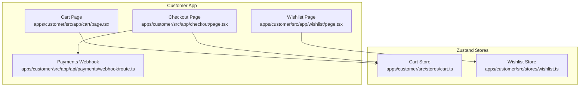
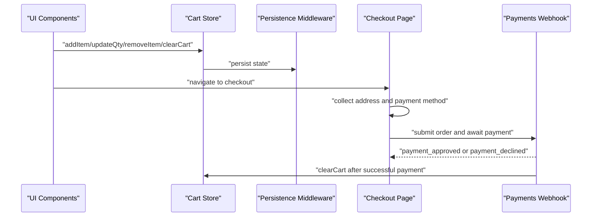
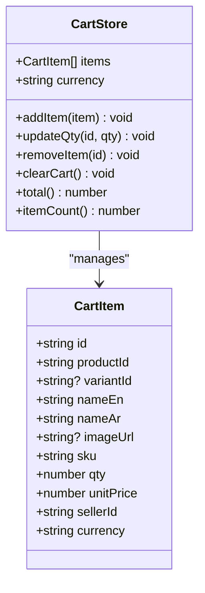
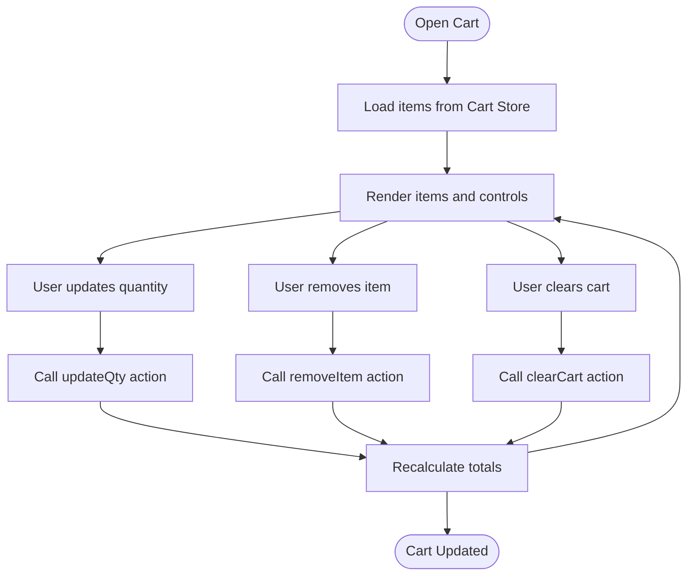
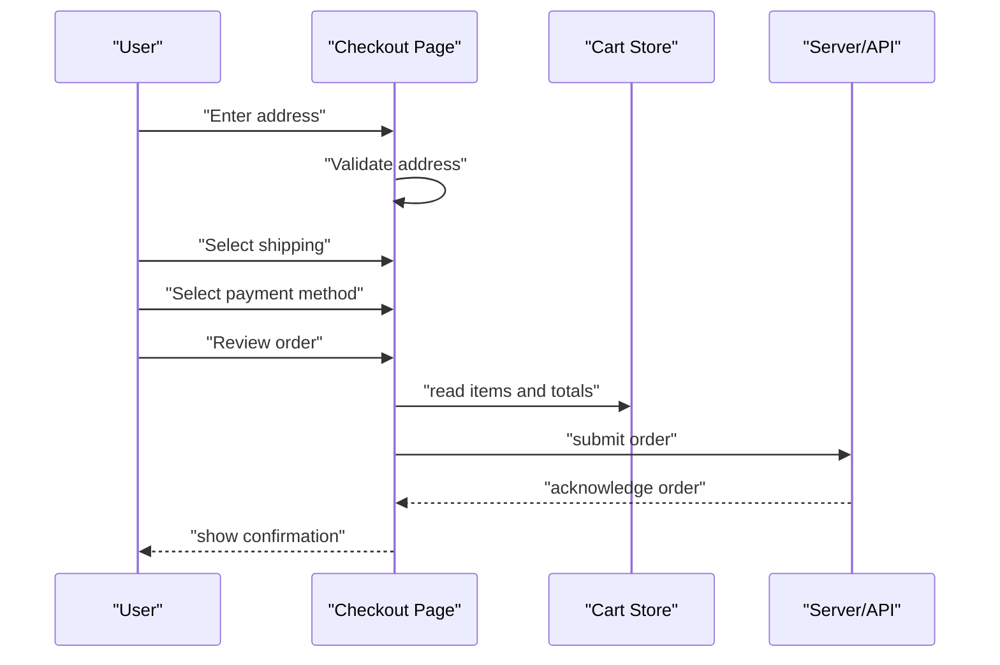
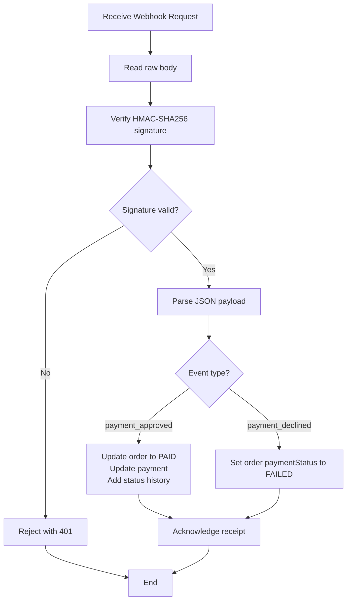
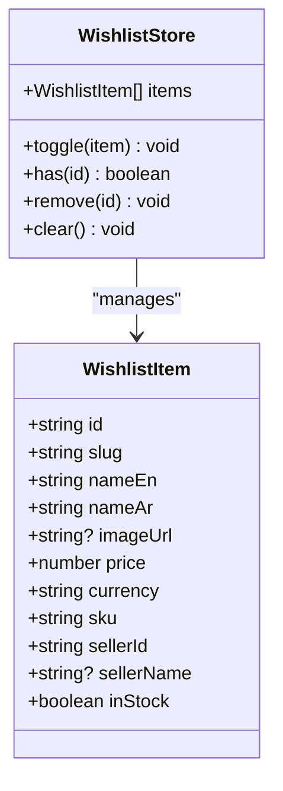
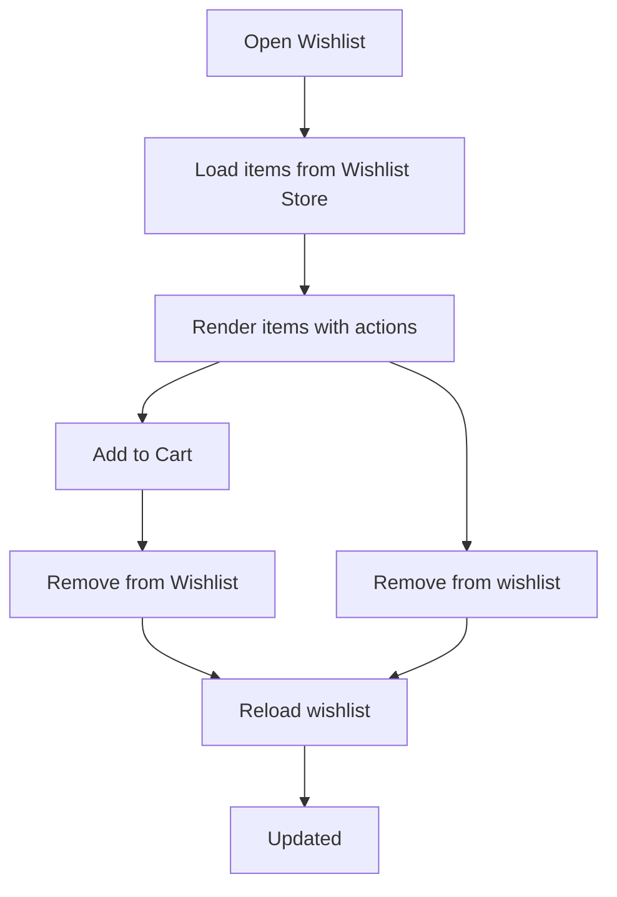
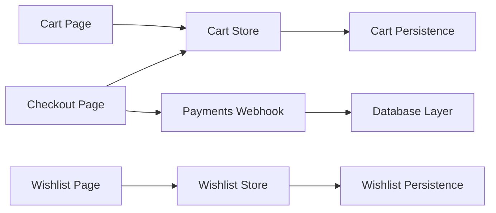

# Shopping Experience

<cite>
**Referenced Files in This Document**
- [cart.ts](file://apps/customer/src/stores/cart.ts)
- [wishlist.ts](file://apps/customer/src/stores/wishlist.ts)
- [page.tsx](file://apps/customer/src/app/cart/page.tsx)
- [page.tsx](file://apps/customer/src/app/checkout/page.tsx)
- [route.ts](file://apps/customer/src/app/api/payments/webhook/route.ts)
- [page.tsx](file://apps/customer/src/app/wishlist/page.tsx)
</cite>

## Table of Contents
1. [Introduction](#introduction)
2. [Project Structure](#project-structure)
3. [Core Components](#core-components)
4. [Architecture Overview](#architecture-overview)
5. [Detailed Component Analysis](#detailed-component-analysis)
6. [Dependency Analysis](#dependency-analysis)
7. [Performance Considerations](#performance-considerations)
8. [Troubleshooting Guide](#troubleshooting-guide)
9. [Conclusion](#conclusion)

## Introduction
This document explains the Shopping Experience components in the customer application, focusing on the shopping cart, checkout, and wishlist. It covers state management with Zustand, persistence across sessions, item manipulation, totals calculation, checkout workflow, form validation, mock payment integration, order submission, and cross-session data persistence. It also outlines state management patterns, component communication, error handling strategies, and performance optimizations for large shopping carts.

## Project Structure
The Shopping Experience spans three primary areas:
- State stores: cart and wishlist powered by Zustand with persistence
- UI pages: cart, checkout, and wishlist views
- Payment webhook: server-side verification and order updates

**Diagram sources**
- [cart.ts](file://apps/customer/src/stores/cart.ts)
- [wishlist.ts](file://apps/customer/src/stores/wishlist.ts)
- [page.tsx](file://apps/customer/src/app/cart/page.tsx)
- [page.tsx](file://apps/customer/src/app/checkout/page.tsx)
- [page.tsx](file://apps/customer/src/app/wishlist/page.tsx)
- [route.ts](file://apps/customer/src/app/api/payments/webhook/route.ts)

**Section sources**
- [cart.ts](file://apps/customer/src/stores/cart.ts)
- [wishlist.ts](file://apps/customer/src/stores/wishlist.ts)
- [page.tsx](file://apps/customer/src/app/cart/page.tsx)
- [page.tsx](file://apps/customer/src/app/checkout/page.tsx)
- [page.tsx](file://apps/customer/src/app/wishlist/page.tsx)
- [route.ts](file://apps/customer/src/app/api/payments/webhook/route.ts)

## Core Components
- Cart Store: manages items, quantities, totals, and persistence
- Wishlist Store: manages favorites and persistence
- Cart Page: renders cart items, quantities, and totals
- Checkout Page: handles address, shipping, payment method selection, and order review
- Payments Webhook: validates signatures and updates order/payment states

Key capabilities:
- Item addition, quantity updates, removal, and clearing
- Totals and item count calculations
- Persistence across browser sessions
- Mock payment method selection and order submission flow
- Webhook-driven payment state transitions

**Section sources**
- [cart.ts](file://apps/customer/src/stores/cart.ts)
- [wishlist.ts](file://apps/customer/src/stores/wishlist.ts)
- [page.tsx](file://apps/customer/src/app/cart/page.tsx)
- [page.tsx](file://apps/customer/src/app/checkout/page.tsx)
- [page.tsx](file://apps/customer/src/app/wishlist/page.tsx)
- [route.ts](file://apps/customer/src/app/api/payments/webhook/route.ts)

## Architecture Overview
The Shopping Experience follows a unidirectional data flow:
- UI components read from Zustand stores
- Actions mutate store state
- Persistent middleware ensures data survives reloads
- Checkout triggers order submission and payment method selection
- Webhook receives external payment events and updates backend state

**Diagram sources**
- [cart.ts](file://apps/customer/src/stores/cart.ts)
- [page.tsx](file://apps/customer/src/app/checkout/page.tsx)
- [route.ts](file://apps/customer/src/app/api/payments/webhook/route.ts)

## Detailed Component Analysis

### Cart Store
The cart store encapsulates:
- CartItem model with product identifiers, pricing, quantities, and currency
- Actions: addItem, updateQty, removeItem, clearCart
- Derived selectors: total, itemCount
- Persistence: session storage via Zustand persist middleware

Implementation highlights:
- Deduplication by productId and variantId
- Quantity validation: zero or below removes the item
- Totals computed from unitPrice × qty per item
- Currency stored at the cart level

**Diagram sources**
- [cart.ts](file://apps/customer/src/stores/cart.ts)

**Section sources**
- [cart.ts](file://apps/customer/src/stores/cart.ts)

### Cart Page
The cart page:
- Renders items from the cart store
- Allows quantity updates and removal
- Displays totals and item counts
- Integrates with the cart store for state updates

**Diagram sources**
- [page.tsx](file://apps/customer/src/app/cart/page.tsx)
- [cart.ts](file://apps/customer/src/stores/cart.ts)

**Section sources**
- [page.tsx](file://apps/customer/src/app/cart/page.tsx)
- [cart.ts](file://apps/customer/src/stores/cart.ts)

### Checkout Workflow
The checkout page implements a step-based flow:
- Address collection
- Shipping method selection
- Payment method selection (mock integration)
- Order review and submission

Key behaviors:
- Payment method selection toggles UI state
- Back navigation moves between steps
- Review step aggregates cart totals and selections

**Diagram sources**
- [page.tsx](file://apps/customer/src/app/checkout/page.tsx)
- [cart.ts](file://apps/customer/src/stores/cart.ts)

**Section sources**
- [page.tsx](file://apps/customer/src/app/checkout/page.tsx)
- [cart.ts](file://apps/customer/src/stores/cart.ts)

### Payments Webhook
The webhook endpoint:
- Enforces Node.js runtime for cryptographic operations
- Validates Checkout.com signatures using HMAC-SHA256
- Updates order and payment statuses upon approved/declined events
- Uses transactional database updates for consistency

**Diagram sources**
- [route.ts](file://apps/customer/src/app/api/payments/webhook/route.ts)

**Section sources**
- [route.ts](file://apps/customer/src/app/api/payments/webhook/route.ts)

### Wishlist Store
The wishlist store:
- Defines WishlistItem model
- Provides toggle, has, remove, and clear actions
- Persists favorites across sessions

**Diagram sources**
- [wishlist.ts](file://apps/customer/src/stores/wishlist.ts)

**Section sources**
- [wishlist.ts](file://apps/customer/src/stores/wishlist.ts)

### Wishlist Page
The wishlist page:
- Lists favorite items
- Supports adding to cart and removing from wishlist
- Uses the wishlist store for state

**Diagram sources**
- [page.tsx](file://apps/customer/src/app/wishlist/page.tsx)
- [wishlist.ts](file://apps/customer/src/stores/wishlist.ts)

**Section sources**
- [page.tsx](file://apps/customer/src/app/wishlist/page.tsx)
- [wishlist.ts](file://apps/customer/src/stores/wishlist.ts)

## Dependency Analysis
- UI pages depend on Zustand stores for state
- Cart totals and item counts are derived from store state
- Checkout depends on cart store for order review
- Webhook depends on database layer for order/payment updates
- Persistence middleware bridges UI state and browser storage

**Diagram sources**
- [cart.ts](file://apps/customer/src/stores/cart.ts)
- [wishlist.ts](file://apps/customer/src/stores/wishlist.ts)
- [page.tsx](file://apps/customer/src/app/cart/page.tsx)
- [page.tsx](file://apps/customer/src/app/checkout/page.tsx)
- [page.tsx](file://apps/customer/src/app/wishlist/page.tsx)
- [route.ts](file://apps/customer/src/app/api/payments/webhook/route.ts)

**Section sources**
- [cart.ts](file://apps/customer/src/stores/cart.ts)
- [wishlist.ts](file://apps/customer/src/stores/wishlist.ts)
- [page.tsx](file://apps/customer/src/app/cart/page.tsx)
- [page.tsx](file://apps/customer/src/app/checkout/page.tsx)
- [page.tsx](file://apps/customer/src/app/wishlist/page.tsx)
- [route.ts](file://apps/customer/src/app/api/payments/webhook/route.ts)

## Performance Considerations
- Prefer derived selectors for totals and counts to avoid recomputation
- Batch UI updates when modifying multiple items to reduce re-renders
- Use stable keys for cart items to improve React.memo and virtualization performance
- Limit cart size by enforcing maximum quantities and removing slow-moving items
- Debounce frequent updates (e.g., quantity changes) to minimize store writes
- For large carts, consider pagination or lazy loading of items in the cart list
- Persist only essential fields to reduce storage overhead

## Troubleshooting Guide
Common issues and resolutions:
- Cart totals incorrect: verify unitPrice and qty fields are numeric and currency matches
- Items not persisting: confirm browser storage is enabled and persistence middleware is initialized
- Checkout stuck on review: ensure cart store is read during review step and no invalid states remain
- Webhook rejected: verify signature secret is configured and cko-signature header is present
- Payment declined: confirm webhook updates paymentStatus to FAILED and order reflects decline

**Section sources**
- [cart.ts](file://apps/customer/src/stores/cart.ts)
- [page.tsx](file://apps/customer/src/app/checkout/page.tsx)
- [route.ts](file://apps/customer/src/app/api/payments/webhook/route.ts)

## Conclusion
The Shopping Experience leverages Zustand for efficient, predictable state management with persistence. The cart and wishlist stores provide robust item lifecycle management, while the checkout flow integrates with a mock payment method and a secure webhook for payment state transitions. By following the outlined patterns, error handling strategies, and performance recommendations, the system remains scalable and maintainable for large shopping carts and cross-session data persistence.