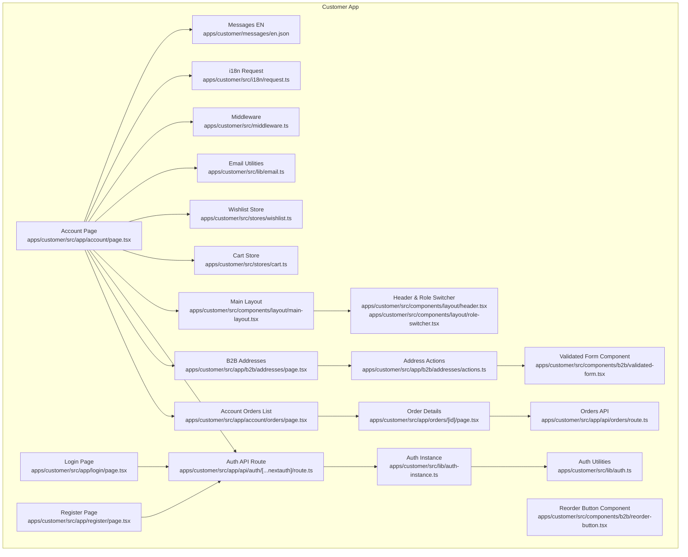
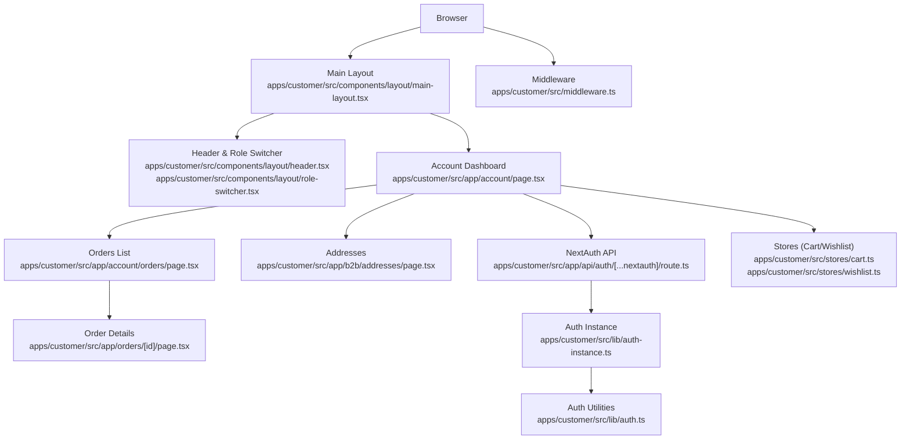
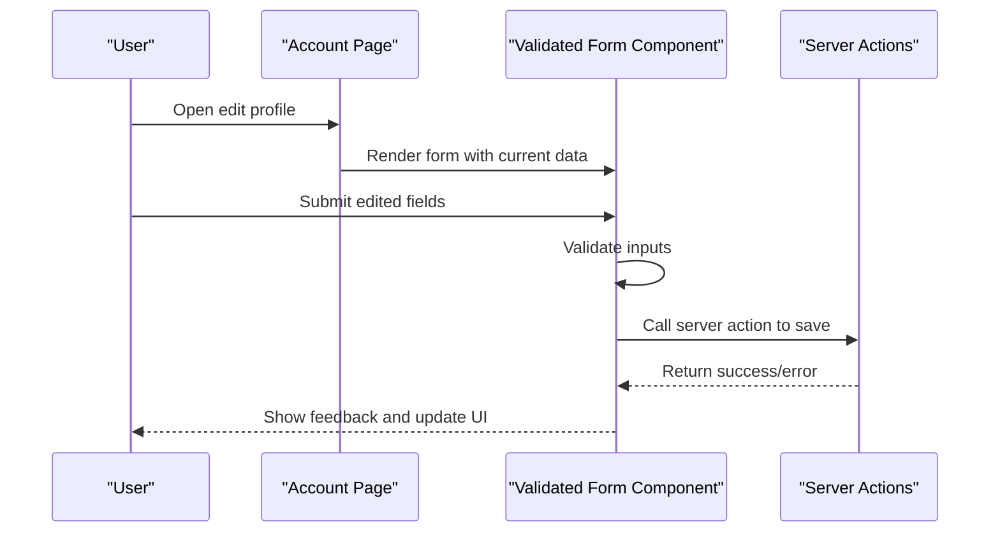
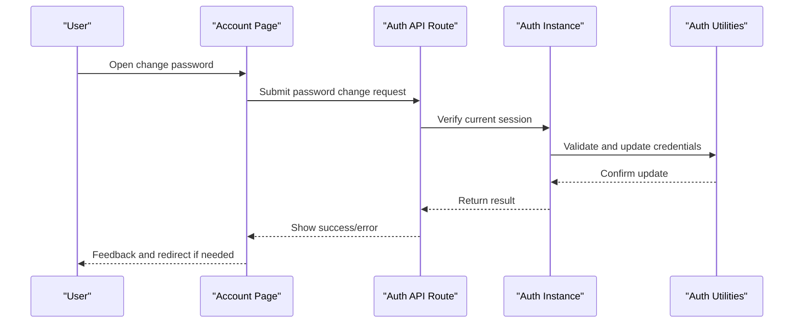
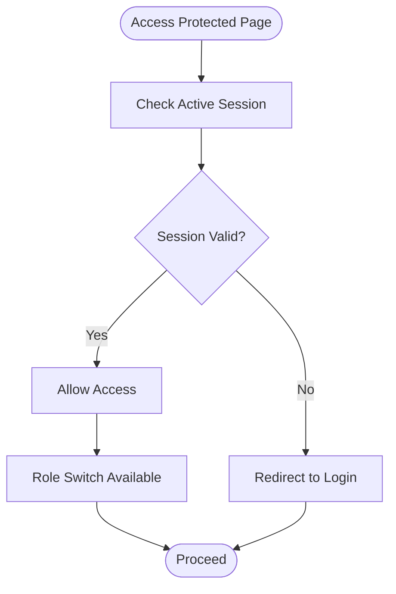
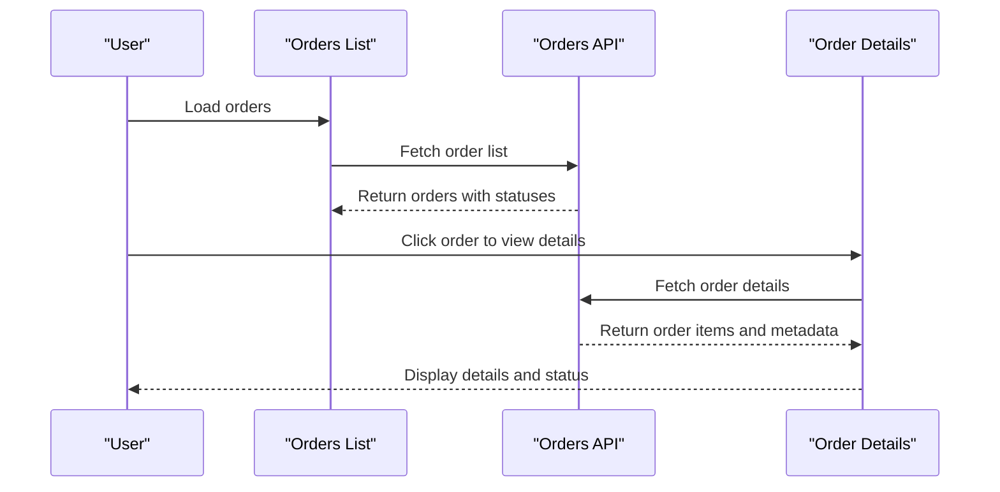
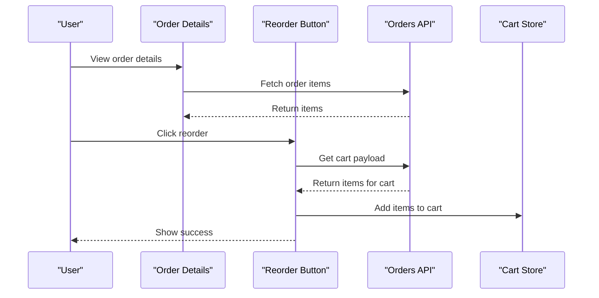
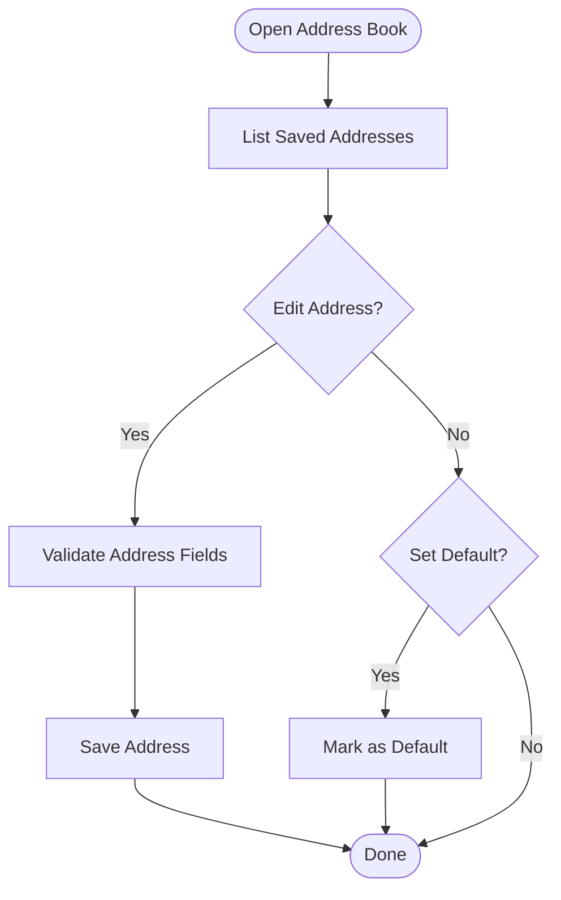
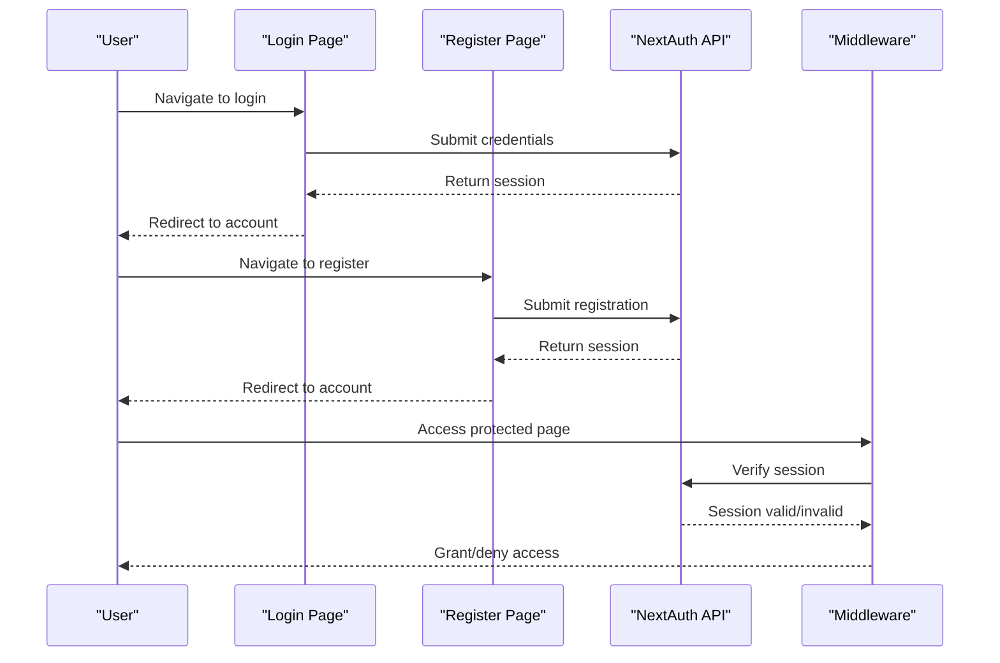
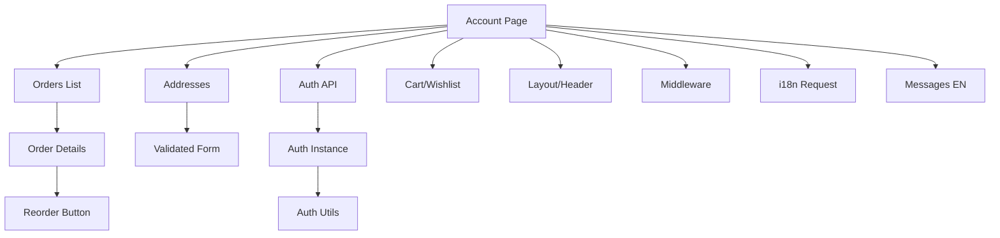

# User Account Management

<cite>
**Referenced Files in This Document**
- [page.tsx](file://apps/customer/src/app/account/page.tsx)
- [orders/page.tsx](file://apps/customer/src/app/account/orders/page.tsx)
- [addresses/page.tsx](file://apps/customer/src/app/b2b/addresses/page.tsx)
- [actions.ts](file://apps/customer/src/app/b2b/addresses/actions.ts)
- [validated-form.tsx](file://apps/customer/src/components/b2b/validated-form.tsx)
- [reorder-button.tsx](file://apps/customer/src/components/b2b/reorder-button.tsx)
- [route.ts](file://apps/customer/src/app/api/auth/[...nextauth]/route.ts)
- [auth-instance.ts](file://apps/customer/src/lib/auth-instance.ts)
- [auth.ts](file://apps/customer/src/lib/auth.ts)
- [layout.tsx](file://apps/customer/src/components/layout/main-layout.tsx)
- [header.tsx](file://apps/customer/src/components/layout/header.tsx)
- [role-switcher.tsx](file://apps/customer/src/components/layout/role-switcher.tsx)
- [login/page.tsx](file://apps/customer/src/app/login/page.tsx)
- [register/page.tsx](file://apps/customer/src/app/register/page.tsx)
- [orders/[id]/page.tsx](file://apps/customer/src/app/orders/[id]/page.tsx)
- [orders/route.ts](file://apps/customer/src/app/api/orders/route.ts)
- [cart.ts](file://apps/customer/src/stores/cart.ts)
- [wishlist.ts](file://apps/customer/src/stores/wishlist.ts)
- [email.ts](file://apps/customer/src/lib/email.ts)
- [middleware.ts](file://apps/customer/src/middleware.ts)
- [request.ts](file://apps/customer/src/i18n/request.ts)
- [en.json](file://apps/customer/messages/en.json)
</cite>

## Table of Contents
1. [Introduction](#introduction)
2. [Project Structure](#project-structure)
3. [Core Components](#core-components)
4. [Architecture Overview](#architecture-overview)
5. [Detailed Component Analysis](#detailed-component-analysis)
6. [Dependency Analysis](#dependency-analysis)
7. [Performance Considerations](#performance-considerations)
8. [Troubleshooting Guide](#troubleshooting-guide)
9. [Conclusion](#conclusion)
10. [Appendices](#appendices)

## Introduction
This document describes the User Account Management features implemented in the customer-facing application. It covers the customer profile management interface, personal information editing, password change functionality, and account security features. It also explains order history display, order status tracking, order details viewing, and order reordering capabilities. Address book management, default address selection, and shipping/billing address handling are documented, along with authentication integration, session management, user preference storage, and GDPR compliance considerations for customer data handling.

## Project Structure
The customer application exposes account-related pages under the account route, integrates with NextAuth for authentication, and provides B2B-specific features such as address management and order reordering. The structure below highlights the relevant files and their roles in user account management.

**Diagram sources**
- [page.tsx:1-200](file://apps/customer/src/app/account/page.tsx#L1-L200)
- [orders/page.tsx:1-200](file://apps/customer/src/app/account/orders/page.tsx#L1-L200)
- [addresses/page.tsx:1-200](file://apps/customer/src/app/b2b/addresses/page.tsx#L1-L200)
- [actions.ts:1-200](file://apps/customer/src/app/b2b/addresses/actions.ts#L1-L200)
- [validated-form.tsx:1-200](file://apps/customer/src/components/b2b/validated-form.tsx#L1-L200)
- [reorder-button.tsx:1-200](file://apps/customer/src/components/b2b/reorder-button.tsx#L1-L200)
- [route.ts:1-200](file://apps/customer/src/app/api/auth/[...nextauth]/route.ts#L1-L200)
- [auth-instance.ts:1-200](file://apps/customer/src/lib/auth-instance.ts#L1-L200)
- [auth.ts:1-200](file://apps/customer/src/lib/auth.ts#L1-L200)
- [layout.tsx:1-200](file://apps/customer/src/components/layout/main-layout.tsx#L1-L200)
- [header.tsx:1-200](file://apps/customer/src/components/layout/header.tsx#L1-L200)
- [role-switcher.tsx:1-200](file://apps/customer/src/components/layout/role-switcher.tsx#L1-L200)
- [login/page.tsx:1-200](file://apps/customer/src/app/login/page.tsx#L1-L200)
- [register/page.tsx:1-200](file://apps/customer/src/app/register/page.tsx#L1-L200)
- [orders/[id]/page.tsx](file://apps/customer/src/app/orders/[id]/page.tsx#L1-L200)
- [orders/route.ts:1-200](file://apps/customer/src/app/api/orders/route.ts#L1-L200)
- [cart.ts:1-200](file://apps/customer/src/stores/cart.ts#L1-L200)
- [wishlist.ts:1-200](file://apps/customer/src/stores/wishlist.ts#L1-L200)
- [email.ts:1-200](file://apps/customer/src/lib/email.ts#L1-L200)
- [middleware.ts:1-200](file://apps/customer/src/middleware.ts#L1-L200)
- [request.ts:1-200](file://apps/customer/src/i18n/request.ts#L1-L200)
- [en.json:1-200](file://apps/customer/messages/en.json#L1-L200)

**Section sources**
- [page.tsx:1-200](file://apps/customer/src/app/account/page.tsx#L1-L200)
- [orders/page.tsx:1-200](file://apps/customer/src/app/account/orders/page.tsx#L1-L200)
- [addresses/page.tsx:1-200](file://apps/customer/src/app/b2b/addresses/page.tsx#L1-L200)
- [actions.ts:1-200](file://apps/customer/src/app/b2b/addresses/actions.ts#L1-L200)
- [validated-form.tsx:1-200](file://apps/customer/src/components/b2b/validated-form.tsx#L1-L200)
- [reorder-button.tsx:1-200](file://apps/customer/src/components/b2b/reorder-button.tsx#L1-L200)
- [route.ts:1-200](file://apps/customer/src/app/api/auth/[...nextauth]/route.ts#L1-L200)
- [auth-instance.ts:1-200](file://apps/customer/src/lib/auth-instance.ts#L1-L200)
- [auth.ts:1-200](file://apps/customer/src/lib/auth.ts#L1-L200)
- [layout.tsx:1-200](file://apps/customer/src/components/layout/main-layout.tsx#L1-L200)
- [header.tsx:1-200](file://apps/customer/src/components/layout/header.tsx#L1-L200)
- [role-switcher.tsx:1-200](file://apps/customer/src/components/layout/role-switcher.tsx#L1-L200)
- [login/page.tsx:1-200](file://apps/customer/src/app/login/page.tsx#L1-L200)
- [register/page.tsx:1-200](file://apps/customer/src/app/register/page.tsx#L1-L200)
- [orders/[id]/page.tsx](file://apps/customer/src/app/orders/[id]/page.tsx#L1-L200)
- [orders/route.ts:1-200](file://apps/customer/src/app/api/orders/route.ts#L1-L200)
- [cart.ts:1-200](file://apps/customer/src/stores/cart.ts#L1-L200)
- [wishlist.ts:1-200](file://apps/customer/src/stores/wishlist.ts#L1-L200)
- [email.ts:1-200](file://apps/customer/src/lib/email.ts#L1-L200)
- [middleware.ts:1-200](file://apps/customer/src/middleware.ts#L1-L200)
- [request.ts:1-200](file://apps/customer/src/i18n/request.ts#L1-L200)
- [en.json:1-200](file://apps/customer/messages/en.json#L1-L200)

## Core Components
- Customer Account Dashboard: Provides access to profile, orders, addresses, and preferences.
- Authentication Integration: NextAuth-based login, registration, and session management.
- Order Management: View order history, track status, view details, and reorder items.
- Address Book: Manage multiple addresses, set defaults, and handle shipping/billing.
- Security and Preferences: Password change, session controls, and user preference storage.
- GDPR Compliance: Data handling policies via middleware and localized messaging.

**Section sources**
- [page.tsx:1-200](file://apps/customer/src/app/account/page.tsx#L1-L200)
- [route.ts:1-200](file://apps/customer/src/app/api/auth/[...nextauth]/route.ts#L1-L200)
- [orders/page.tsx:1-200](file://apps/customer/src/app/account/orders/page.tsx#L1-L200)
- [orders/[id]/page.tsx](file://apps/customer/src/app/orders/[id]/page.tsx#L1-L200)
- [addresses/page.tsx:1-200](file://apps/customer/src/app/b2b/addresses/page.tsx#L1-L200)
- [actions.ts:1-200](file://apps/customer/src/app/b2b/addresses/actions.ts#L1-L200)
- [validated-form.tsx:1-200](file://apps/customer/src/components/b2b/validated-form.tsx#L1-L200)
- [reorder-button.tsx:1-200](file://apps/customer/src/components/b2b/reorder-button.tsx#L1-L200)
- [auth-instance.ts:1-200](file://apps/customer/src/lib/auth-instance.ts#L1-L200)
- [auth.ts:1-200](file://apps/customer/src/lib/auth.ts#L1-L200)
- [middleware.ts:1-200](file://apps/customer/src/middleware.ts#L1-L200)
- [en.json:1-200](file://apps/customer/messages/en.json#L1-L200)

## Architecture Overview
The user account management architecture centers around the customer app’s account routes, NextAuth for authentication, and B2B-specific modules for addresses and reordering. The layout and header components provide navigation and role switching. Stores manage shopping cart and wishlist data. Middleware enforces authentication and localization.

**Diagram sources**
- [layout.tsx:1-200](file://apps/customer/src/components/layout/main-layout.tsx#L1-L200)
- [header.tsx:1-200](file://apps/customer/src/components/layout/header.tsx#L1-L200)
- [role-switcher.tsx:1-200](file://apps/customer/src/components/layout/role-switcher.tsx#L1-L200)
- [page.tsx:1-200](file://apps/customer/src/app/account/page.tsx#L1-L200)
- [orders/page.tsx:1-200](file://apps/customer/src/app/account/orders/page.tsx#L1-L200)
- [orders/[id]/page.tsx](file://apps/customer/src/app/orders/[id]/page.tsx#L1-L200)
- [addresses/page.tsx:1-200](file://apps/customer/src/app/b2b/addresses/page.tsx#L1-L200)
- [route.ts:1-200](file://apps/customer/src/app/api/auth/[...nextauth]/route.ts#L1-L200)
- [auth.ts:1-200](file://apps/customer/src/lib/auth.ts#L1-L200)
- [auth-instance.ts:1-200](file://apps/customer/src/lib/auth-instance.ts#L1-L200)
- [cart.ts:1-200](file://apps/customer/src/stores/cart.ts#L1-L200)
- [wishlist.ts:1-200](file://apps/customer/src/stores/wishlist.ts#L1-L200)
- [middleware.ts:1-200](file://apps/customer/src/middleware.ts#L1-L200)

## Detailed Component Analysis

### Customer Profile Management Interface
- Purpose: Central hub for managing personal information, preferences, and account security.
- Key areas:
  - Personal information editing: form-based updates with validation.
  - Password change: secure update flow integrated with authentication.
  - Account security: session management and logout controls.
  - Preferences: user preference storage and retrieval.
- Implementation anchors:
  - Dashboard page for account overview.
  - Authentication routes for secure operations.
  - Layout and header for navigation and role switching.

**Section sources**
- [page.tsx:1-200](file://apps/customer/src/app/account/page.tsx#L1-L200)
- [route.ts:1-200](file://apps/customer/src/app/api/auth/[...nextauth]/route.ts#L1-L200)
- [layout.tsx:1-200](file://apps/customer/src/components/layout/main-layout.tsx#L1-L200)
- [header.tsx:1-200](file://apps/customer/src/components/layout/header.tsx#L1-L200)
- [role-switcher.tsx:1-200](file://apps/customer/src/components/layout/role-switcher.tsx#L1-L200)

### Personal Information Editing
- Mechanism: Validated forms for safe updates.
- Validation: Client-side and server-side checks to ensure data integrity.
- Integration: Uses validated form component and backend actions.

**Diagram sources**
- [validated-form.tsx:1-200](file://apps/customer/src/components/b2b/validated-form.tsx#L1-L200)
- [page.tsx:1-200](file://apps/customer/src/app/account/page.tsx#L1-L200)

**Section sources**
- [validated-form.tsx:1-200](file://apps/customer/src/components/b2b/validated-form.tsx#L1-L200)
- [page.tsx:1-200](file://apps/customer/src/app/account/page.tsx#L1-L200)

### Password Change Functionality
- Secure update: Requires authenticated session.
- Flow: Enter current password and new password, submit securely.
- Integration: NextAuth-based authentication and session management.

**Diagram sources**
- [route.ts:1-200](file://apps/customer/src/app/api/auth/[...nextauth]/route.ts#L1-L200)
- [auth-instance.ts:1-200](file://apps/customer/src/lib/auth-instance.ts#L1-L200)
- [auth.ts:1-200](file://apps/customer/src/lib/auth.ts#L1-L200)

**Section sources**
- [route.ts:1-200](file://apps/customer/src/app/api/auth/[...nextauth]/route.ts#L1-L200)
- [auth-instance.ts:1-200](file://apps/customer/src/lib/auth-instance.ts#L1-L200)
- [auth.ts:1-200](file://apps/customer/src/lib/auth.ts#L1-L200)

### Account Security Features
- Session management: Enforced via middleware and NextAuth.
- Role switching: Allows seamless transitions between customer and B2B roles.
- Logout: Integrated with authentication provider.

**Diagram sources**
- [middleware.ts:1-200](file://apps/customer/src/middleware.ts#L1-L200)
- [role-switcher.tsx:1-200](file://apps/customer/src/components/layout/role-switcher.tsx#L1-L200)
- [login/page.tsx:1-200](file://apps/customer/src/app/login/page.tsx#L1-L200)

**Section sources**
- [middleware.ts:1-200](file://apps/customer/src/middleware.ts#L1-L200)
- [role-switcher.tsx:1-200](file://apps/customer/src/components/layout/role-switcher.tsx#L1-L200)
- [login/page.tsx:1-200](file://apps/customer/src/app/login/page.tsx#L1-L200)

### Order History Display and Tracking
- Order list: Paginated view of past orders with status indicators.
- Status tracking: Real-time status updates via API.
- Sorting and filtering: Optional enhancements for usability.

**Diagram sources**
- [orders/page.tsx:1-200](file://apps/customer/src/app/account/orders/page.tsx#L1-L200)
- [orders/[id]/page.tsx](file://apps/customer/src/app/orders/[id]/page.tsx#L1-L200)
- [orders/route.ts:1-200](file://apps/customer/src/app/api/orders/route.ts#L1-L200)

**Section sources**
- [orders/page.tsx:1-200](file://apps/customer/src/app/account/orders/page.tsx#L1-L200)
- [orders/[id]/page.tsx](file://apps/customer/src/app/orders/[id]/page.tsx#L1-L200)
- [orders/route.ts:1-200](file://apps/customer/src/app/api/orders/route.ts#L1-L200)

### Order Details Viewing and Reordering
- Details: Items, quantities, pricing, shipping/billing info, status timeline.
- Reorder: One-click re-add items to cart using reorder button component.

**Diagram sources**
- [orders/[id]/page.tsx](file://apps/customer/src/app/orders/[id]/page.tsx#L1-L200)
- [reorder-button.tsx:1-200](file://apps/customer/src/components/b2b/reorder-button.tsx#L1-L200)
- [orders/route.ts:1-200](file://apps/customer/src/app/api/orders/route.ts#L1-L200)
- [cart.ts:1-200](file://apps/customer/src/stores/cart.ts#L1-L200)

**Section sources**
- [orders/[id]/page.tsx](file://apps/customer/src/app/orders/[id]/page.tsx#L1-L200)
- [reorder-button.tsx:1-200](file://apps/customer/src/components/b2b/reorder-button.tsx#L1-L200)
- [orders/route.ts:1-200](file://apps/customer/src/app/api/orders/route.ts#L1-L200)
- [cart.ts:1-200](file://apps/customer/src/stores/cart.ts#L1-L200)

### Address Book Management and Default Address Selection
- Address management: CRUD operations for multiple addresses.
- Default selection: Set primary shipping/billing address.
- Validation: Ensures required fields and formats.

**Diagram sources**
- [addresses/page.tsx:1-200](file://apps/customer/src/app/b2b/addresses/page.tsx#L1-L200)
- [actions.ts:1-200](file://apps/customer/src/app/b2b/addresses/actions.ts#L1-L200)
- [validated-form.tsx:1-200](file://apps/customer/src/components/b2b/validated-form.tsx#L1-L200)

**Section sources**
- [addresses/page.tsx:1-200](file://apps/customer/src/app/b2b/addresses/page.tsx#L1-L200)
- [actions.ts:1-200](file://apps/customer/src/app/b2b/addresses/actions.ts#L1-L200)
- [validated-form.tsx:1-200](file://apps/customer/src/components/b2b/validated-form.tsx#L1-L200)

### Shipping and Billing Address Handling
- Separate fields for shipping and billing.
- Copy shipping to billing option.
- Validation ensures completeness and correctness.

**Section sources**
- [addresses/page.tsx:1-200](file://apps/customer/src/app/b2b/addresses/page.tsx#L1-L200)
- [validated-form.tsx:1-200](file://apps/customer/src/components/b2b/validated-form.tsx#L1-L200)

### Authentication Integration and Session Management
- NextAuth integration: Handles OAuth, callbacks, and session persistence.
- Login/Register: Dedicated pages with provider-based authentication.
- Session enforcement: Middleware validates access to protected routes.

**Diagram sources**
- [login/page.tsx:1-200](file://apps/customer/src/app/login/page.tsx#L1-L200)
- [register/page.tsx:1-200](file://apps/customer/src/app/register/page.tsx#L1-L200)
- [route.ts:1-200](file://apps/customer/src/app/api/auth/[...nextauth]/route.ts#L1-L200)
- [middleware.ts:1-200](file://apps/customer/src/middleware.ts#L1-L200)

**Section sources**
- [login/page.tsx:1-200](file://apps/customer/src/app/login/page.tsx#L1-L200)
- [register/page.tsx:1-200](file://apps/customer/src/app/register/page.tsx#L1-L200)
- [route.ts:1-200](file://apps/customer/src/app/api/auth/[...nextauth]/route.ts#L1-L200)
- [middleware.ts:1-200](file://apps/customer/src/middleware.ts#L1-L200)

### User Preference Storage
- Preferences: Stored per user session and persisted via backend.
- Retrieval: Loaded on account page initialization.
- Stores: Cart and wishlist maintained client-side for convenience.

**Section sources**
- [page.tsx:1-200](file://apps/customer/src/app/account/page.tsx#L1-L200)
- [cart.ts:1-200](file://apps/customer/src/stores/cart.ts#L1-L200)
- [wishlist.ts:1-200](file://apps/customer/src/stores/wishlist.ts#L1-L200)

### GDPR Compliance Considerations
- Data handling: Middleware and localized messaging support privacy controls.
- Localization: Messages and consent flows localized for regions.
- Consent and transparency: UI surfaces consent and data usage information.

**Section sources**
- [middleware.ts:1-200](file://apps/customer/src/middleware.ts#L1-L200)
- [en.json:1-200](file://apps/customer/messages/en.json#L1-L200)
- [request.ts:1-200](file://apps/customer/src/i18n/request.ts#L1-L200)

## Dependency Analysis
The account management features depend on authentication, routing, stores, and UI components. The diagram below outlines key dependencies.

**Diagram sources**
- [page.tsx:1-200](file://apps/customer/src/app/account/page.tsx#L1-L200)
- [orders/page.tsx:1-200](file://apps/customer/src/app/account/orders/page.tsx#L1-L200)
- [orders/[id]/page.tsx](file://apps/customer/src/app/orders/[id]/page.tsx#L1-L200)
- [addresses/page.tsx:1-200](file://apps/customer/src/app/b2b/addresses/page.tsx#L1-L200)
- [actions.ts:1-200](file://apps/customer/src/app/b2b/addresses/actions.ts#L1-L200)
- [validated-form.tsx:1-200](file://apps/customer/src/components/b2b/validated-form.tsx#L1-L200)
- [reorder-button.tsx:1-200](file://apps/customer/src/components/b2b/reorder-button.tsx#L1-L200)
- [route.ts:1-200](file://apps/customer/src/app/api/auth/[...nextauth]/route.ts#L1-L200)
- [auth-instance.ts:1-200](file://apps/customer/src/lib/auth-instance.ts#L1-L200)
- [auth.ts:1-200](file://apps/customer/src/lib/auth.ts#L1-L200)
- [layout.tsx:1-200](file://apps/customer/src/components/layout/main-layout.tsx#L1-L200)
- [header.tsx:1-200](file://apps/customer/src/components/layout/header.tsx#L1-L200)
- [middleware.ts:1-200](file://apps/customer/src/middleware.ts#L1-L200)
- [request.ts:1-200](file://apps/customer/src/i18n/request.ts#L1-L200)
- [en.json:1-200](file://apps/customer/messages/en.json#L1-L200)

**Section sources**
- [page.tsx:1-200](file://apps/customer/src/app/account/page.tsx#L1-L200)
- [orders/page.tsx:1-200](file://apps/customer/src/app/account/orders/page.tsx#L1-L200)
- [orders/[id]/page.tsx](file://apps/customer/src/app/orders/[id]/page.tsx#L1-L200)
- [addresses/page.tsx:1-200](file://apps/customer/src/app/b2b/addresses/page.tsx#L1-L200)
- [actions.ts:1-200](file://apps/customer/src/app/b2b/addresses/actions.ts#L1-L200)
- [validated-form.tsx:1-200](file://apps/customer/src/components/b2b/validated-form.tsx#L1-L200)
- [reorder-button.tsx:1-200](file://apps/customer/src/components/b2b/reorder-button.tsx#L1-L200)
- [route.ts:1-200](file://apps/customer/src/app/api/auth/[...nextauth]/route.ts#L1-L200)
- [auth-instance.ts:1-200](file://apps/customer/src/lib/auth-instance.ts#L1-L200)
- [auth.ts:1-200](file://apps/customer/src/lib/auth.ts#L1-L200)
- [layout.tsx:1-200](file://apps/customer/src/components/layout/main-layout.tsx#L1-L200)
- [header.tsx:1-200](file://apps/customer/src/components/layout/header.tsx#L1-L200)
- [middleware.ts:1-200](file://apps/customer/src/middleware.ts#L1-L200)
- [request.ts:1-200](file://apps/customer/src/i18n/request.ts#L1-L200)
- [en.json:1-200](file://apps/customer/messages/en.json#L1-L200)

## Performance Considerations
- Minimize re-renders: Use server actions and client components judiciously.
- Lazy loading: Defer heavy components until needed.
- Caching: Utilize browser caching for static assets and API responses where appropriate.
- Store synchronization: Keep cart and wishlist stores in sync with backend to avoid stale data.

## Troubleshooting Guide
- Authentication failures: Verify NextAuth configuration and callback URLs.
- Session issues: Check middleware and cookie settings.
- Form validation errors: Ensure validated form component handles all required fields.
- Order retrieval problems: Confirm API routes return proper status codes and data.
- Address management errors: Validate server actions and error handling.

**Section sources**
- [route.ts:1-200](file://apps/customer/src/app/api/auth/[...nextauth]/route.ts#L1-L200)
- [middleware.ts:1-200](file://apps/customer/src/middleware.ts#L1-L200)
- [validated-form.tsx:1-200](file://apps/customer/src/components/b2b/validated-form.tsx#L1-L200)
- [orders/route.ts:1-200](file://apps/customer/src/app/api/orders/route.ts#L1-L200)
- [actions.ts:1-200](file://apps/customer/src/app/b2b/addresses/actions.ts#L1-L200)

## Conclusion
The User Account Management system integrates authentication, order management, and address handling within a cohesive customer experience. It leverages NextAuth for secure sessions, validated forms for safe data entry, and reusable components for consistent UX. Middleware and localization support robust security and compliance. The architecture supports scalability and maintainability while ensuring a smooth user journey from profile management to order fulfillment.

## Appendices
- Additional resources: Email utilities for notifications, stores for cart and wishlist, and internationalization for localized experiences.

**Section sources**
- [email.ts:1-200](file://apps/customer/src/lib/email.ts#L1-L200)
- [cart.ts:1-200](file://apps/customer/src/stores/cart.ts#L1-L200)
- [wishlist.ts:1-200](file://apps/customer/src/stores/wishlist.ts#L1-L200)
- [request.ts:1-200](file://apps/customer/src/i18n/request.ts#L1-L200)
- [en.json:1-200](file://apps/customer/messages/en.json#L1-L200)