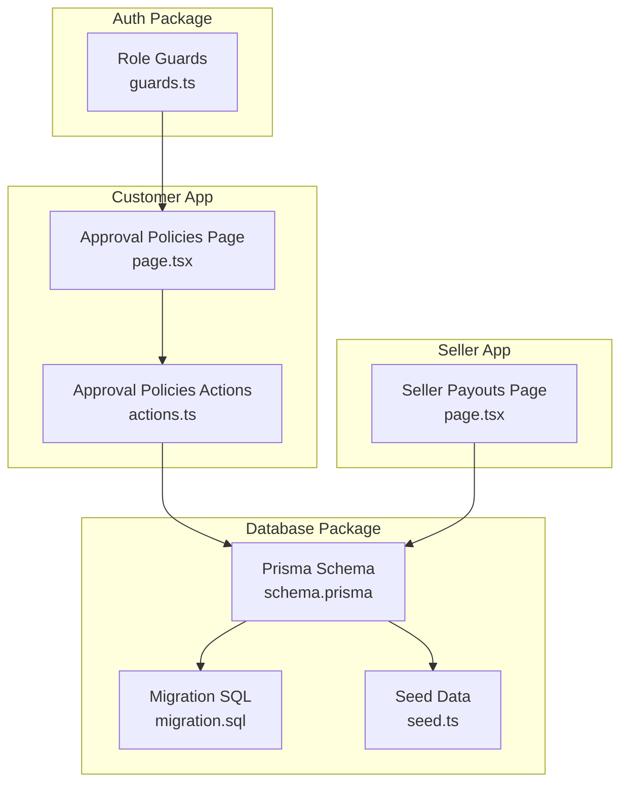
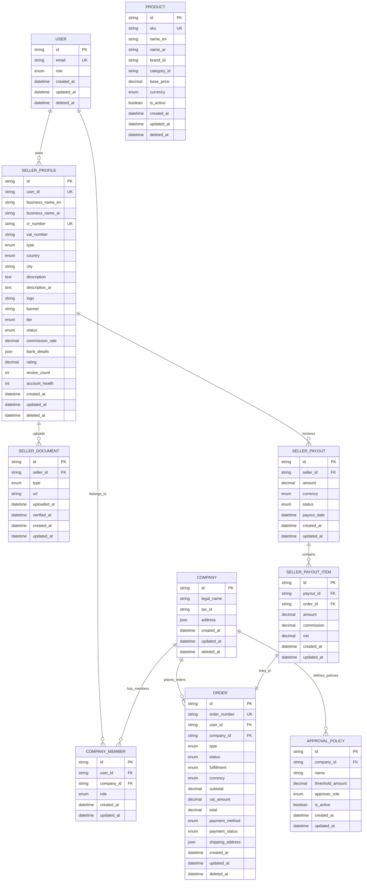
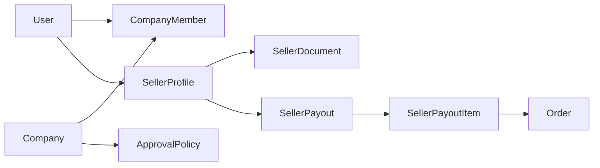

# Core Models & Entities

<cite>
**Referenced Files in This Document**
- [schema.prisma](file://packages/database/prisma/schema.prisma)
- [migration.sql](file://packages/database/prisma/migrations/20260530234542_init_avenick_schema/migration.sql)
- [seed.ts](file://packages/database/prisma/seed.ts)
- [guards.ts](file://packages/auth/src/guards.ts)
- [page.tsx](file://apps/customer/src/app/b2b/approval-policies/page.tsx)
- [actions.ts](file://apps/customer/src/app/b2b/approval-policies/actions.ts)
- [page.tsx](file://apps/seller/src/app/payouts/page.tsx)
</cite>

## Table of Contents
1. [Introduction](#introduction)
2. [Project Structure](#project-structure)
3. [Core Components](#core-components)
4. [Architecture Overview](#architecture-overview)
5. [Detailed Component Analysis](#detailed-component-analysis)
6. [Dependency Analysis](#dependency-analysis)
7. [Performance Considerations](#performance-considerations)
8. [Troubleshooting Guide](#troubleshooting-guide)
9. [Conclusion](#conclusion)
10. [Appendices](#appendices)

## Introduction
This document describes the core database models and entities that power Avenick Commerce’s multi-tenant B2B and seller ecosystems. It focuses on the fundamental entities: User, Company, SellerProfile, Product, Order, and related supporting models such as ApprovalPolicy and CompanyMember. It also documents the roles and permissions model, the B2B company structure, and the seller ecosystem including documents and financial management. Practical usage patterns, common queries, and data relationships are included to help developers and stakeholders understand the design and business implications of each model.

## Project Structure
The database schema and seed logic live under the database package. The schema defines models and relationships, while migrations enforce referential integrity. Seed data demonstrates real-world usage patterns for Users, Companies, Products, and Orders. Role-based access control is enforced via guards in the auth package. Frontend pages consume the database through the database client to showcase typical queries and workflows.

**Diagram sources**
- [schema.prisma](file://packages/database/prisma/schema.prisma)
- [migration.sql](file://packages/database/prisma/migrations/20260530234542_init_avenick_schema/migration.sql)
- [seed.ts](file://packages/database/prisma/seed.ts)
- [guards.ts](file://packages/auth/src/guards.ts)
- [page.tsx](file://apps/customer/src/app/b2b/approval-policies/page.tsx)
- [actions.ts](file://apps/customer/src/app/b2b/approval-policies/actions.ts)
- [page.tsx](file://apps/seller/src/app/payouts/page.tsx)

**Section sources**
- [schema.prisma](file://packages/database/prisma/schema.prisma)
- [migration.sql](file://packages/database/prisma/migrations/20260530234542_init_avenick_schema/migration.sql)
- [seed.ts](file://packages/database/prisma/seed.ts)
- [guards.ts](file://packages/auth/src/guards.ts)
- [page.tsx](file://apps/customer/src/app/b2b/approval-policies/page.tsx)
- [actions.ts](file://apps/customer/src/app/b2b/approval-policies/actions.ts)
- [page.tsx](file://apps/seller/src/app/payouts/page.tsx)

## Core Components
This section outlines the primary models and their responsibilities, fields, constraints, and validations as defined in the schema and enforced by migrations and seed logic.

- User
  - Purpose: Authenticates and authorizes access across the platform. Roles determine access to B2B, seller, and admin features.
  - Key fields: id, email, role, createdAt, updatedAt, deletedAt.
  - Constraints: email uniqueness; role constrained to predefined values; soft delete via deletedAt.
  - Validation: Role guard helpers restrict access to company and seller contexts.

- Company
  - Purpose: Represents a legal entity participating in B2B commerce. Acts as a tenant container for members, purchase orders, and approval policies.
  - Key fields: id, legalName, taxId, address, createdAt, updatedAt, deletedAt.
  - Constraints: Soft delete via deletedAt; indexes on relevant fields for performance.

- CompanyMember
  - Purpose: Links Users to Companies with a specific role (admin, buyer, approver).
  - Key fields: id, userId, companyId, role, createdAt, updatedAt.
  - Constraints: Unique combination of userId and companyId; role constrained to company roles.

- ApprovalPolicy
  - Purpose: Defines spending thresholds and required approver roles for purchase orders within a company.
  - Key fields: id, companyId, name, thresholdAmount, approverRole, isActive, createdAt, updatedAt.
  - Constraints: Threshold must be positive; approverRole restricted to allowed values; per-company scoping via companyId.

- Product
  - Purpose: Catalog item available for sale in B2B and marketplace contexts.
  - Key fields: id, sku, nameEn, nameAr, brandId, categoryId, basePrice, currency, isActive, createdAt, updatedAt, deletedAt.
  - Constraints: SKU uniqueness; currency and price precision; soft delete via deletedAt.

- Order
  - Purpose: Captures purchase transactions with buyer, company, items, totals, and payment/fulfillment metadata.
  - Key fields: id, orderNumber, userId, companyId, type, status, fulfillment, currency, subtotal, vatAmount, total, paymentMethod, paymentStatus, shippingAddress, createdAt, updatedAt, deletedAt.
  - Constraints: Order number uniqueness; totals derived from items; payment and fulfillment states; soft delete via deletedAt.

- SellerProfile
  - Purpose: On-platform seller account with business profile, tier, status, and financial metadata.
  - Key fields: id, userId, businessNameEn, businessNameAr, crNumber, vatNumber, type, country, city, description, descriptionAr, logo, banner, tier, status, commissionRate, bankDetails, rating, reviewCount, accountHealth, createdAt, updatedAt, deletedAt.
  - Constraints: Unique user-to-seller mapping; unique CR number; commission rate decimal precision; tier and status enums; soft delete via deletedAt.

- SellerDocument
  - Purpose: Documents associated with a seller (e.g., licenses, identity verification).
  - Key fields: id, sellerId, type, url, uploadedAt, verifiedAt, createdAt, updatedAt.
  - Constraints: Foreign key to SellerProfile; timestamps for upload and verification.

- SellerPayout
  - Purpose: Aggregates earnings and commissions for a seller over time.
  - Key fields: id, sellerId, amount, currency, status, payoutDate, createdAt, updatedAt.
  - Constraints: Foreign key to SellerProfile; status enum; currency and amount precision.

- SellerPayoutItem
  - Purpose: Line items linking a payout to specific orders and computing amounts and commissions.
  - Key fields: id, payoutId, orderId, amount, commission, net, createdAt, updatedAt.
  - Constraints: Cascading delete on payout; foreign keys to SellerPayout and Order.

**Section sources**
- [schema.prisma](file://packages/database/prisma/schema.prisma)
- [migration.sql](file://packages/database/prisma/migrations/20260530234542_init_avenick_schema/migration.sql)

## Architecture Overview
Avenick Commerce employs a multi-tenant architecture centered on Company as the tenant boundary. Users can belong to multiple Companies with distinct roles. Purchase orders are scoped to a Company, and approval policies define who can approve purchases above certain thresholds. Sellers operate independently but are linked to Users and can receive payouts. The database enforces referential integrity via foreign keys and indexes.

**Diagram sources**
- [schema.prisma](file://packages/database/prisma/schema.prisma)
- [migration.sql](file://packages/database/prisma/migrations/20260530234542_init_avenick_schema/migration.sql)

## Detailed Component Analysis

### User Model
- Responsibilities
  - Authentication and authorization anchor.
  - Role-driven access to B2B, seller, and admin contexts.
- Fields and constraints
  - Unique email; role enum; soft delete via deletedAt.
- Design implications
  - Centralized identity with tenant-aware membership via CompanyMember.
- Practical usage
  - Role checks in guards to gate access to B2B and seller features.
  - Link to SellerProfile via unique userId for seller accounts.

**Section sources**
- [schema.prisma](file://packages/database/prisma/schema.prisma)
- [guards.ts](file://packages/auth/src/guards.ts)

### Company and CompanyMember
- Responsibilities
  - Tenant boundary for B2B operations.
  - Member management with roles: admin, buyer, approver.
- Fields and constraints
  - CompanyMember unique constraint on (userId, companyId); role restricted to company roles.
- Design implications
  - Multi-tenancy achieved by scoping Orders, ApprovalPolicies, and other entities to Company.
- Practical usage
  - Approval policies configured per company with thresholds and approver roles.

**Section sources**
- [schema.prisma](file://packages/database/prisma/schema.prisma)
- [page.tsx](file://apps/customer/src/app/b2b/approval-policies/page.tsx)
- [actions.ts](file://apps/customer/src/app/b2b/approval-policies/actions.ts)

### ApprovalPolicy
- Responsibilities
  - Enforce spend thresholds requiring approvals within a company.
- Fields and constraints
  - Positive thresholdAmount; approverRole restricted to allowed values; isActive flag.
- Design implications
  - Prevents unauthorized spending by requiring designated approvers.
- Practical usage
  - Query policies by company and order total to determine required approvals.

**Section sources**
- [schema.prisma](file://packages/database/prisma/schema.prisma)
- [page.tsx](file://apps/customer/src/app/b2b/approval-policies/page.tsx)
- [actions.ts](file://apps/customer/src/app/b2b/approval-policies/actions.ts)

### Product
- Responsibilities
  - Catalog item definition with pricing and availability.
- Fields and constraints
  - SKU uniqueness; currency and price precision; soft delete via deletedAt.
- Design implications
  - Supports multi-currency pricing and localized naming.
- Practical usage
  - Seed creates sample products used in demo orders.

**Section sources**
- [schema.prisma](file://packages/database/prisma/schema.prisma)
- [seed.ts](file://packages/database/prisma/seed.ts)

### Order
- Responsibilities
  - Capture purchase transaction details, totals, payment, and fulfillment.
- Fields and constraints
  - Order number uniqueness; totals computed from items; payment and fulfillment states; soft delete via deletedAt.
- Design implications
  - B2B-specific fields (companyId, type) separate from marketplace orders.
- Practical usage
  - Seed demonstrates creation of B2B orders with items, taxes, and payment status.

**Section sources**
- [schema.prisma](file://packages/database/prisma/schema.prisma)
- [seed.ts](file://packages/database/prisma/seed.ts)

### SellerProfile, Documents, and Financial Management
- Responsibilities
  - On-platform seller account with business profile, tier, status, and payouts.
- Fields and constraints
  - Unique user-to-seller mapping; unique CR number; commission rate precision; tier and status enums; soft delete via deletedAt.
- Design implications
  - Separates seller identity from operational data (documents, payouts).
- Practical usage
  - Seller payouts page aggregates pending and paid amounts and lists payout items.

**Section sources**
- [schema.prisma](file://packages/database/prisma/schema.prisma)
- [migration.sql](file://packages/database/prisma/migrations/20260530234542_init_avenick_schema/migration.sql)
- [page.tsx](file://apps/seller/src/app/payouts/page.tsx)

## Dependency Analysis
Foreign keys and indexes ensure referential integrity and efficient queries across the model set. The migration script enforces relationships between Company, SellerProfile, SellerDocument, SellerPayout, SellerPayoutItem, and Order.

**Diagram sources**
- [migration.sql](file://packages/database/prisma/migrations/20260530234542_init_avenick_schema/migration.sql)

**Section sources**
- [migration.sql](file://packages/database/prisma/migrations/20260530234542_init_avenick_schema/migration.sql)

## Performance Considerations
- Indexes
  - Composite and single-column indexes on frequently queried fields (e.g., CompanyMember(userId, companyId), ApprovalPolicy(companyId, thresholdAmount)) improve lookup performance.
- Soft deletes
  - deletedAt fields enable logical deletion without cascading impact on reporting and analytics.
- Denormalization for reports
  - Totals and currency fields stored at Order level simplify aggregation queries.
- Caching
  - Approvals and policies can be cached per company to reduce repeated database hits.

[No sources needed since this section provides general guidance]

## Troubleshooting Guide
- Role-based access errors
  - Ensure the session includes a valid role and that the current context (company or seller) matches the user’s membership. Use role guard helpers to validate access.
- Company context not found
  - When viewing B2B features, confirm the user belongs to a Company and that the context is present in the request pipeline.
- Approval policy misconfiguration
  - Verify thresholdAmount is positive and approverRole is one of the allowed values for the company.
- Payout discrepancies
  - Confirm SellerPayoutItem links align with Order IDs and that payout status transitions are handled correctly.

**Section sources**
- [guards.ts](file://packages/auth/src/guards.ts)
- [page.tsx](file://apps/customer/src/app/b2b/approval-policies/page.tsx)
- [actions.ts](file://apps/customer/src/app/b2b/approval-policies/actions.ts)
- [page.tsx](file://apps/seller/src/app/payouts/page.tsx)

## Conclusion
Avenick Commerce’s core models establish a robust, multi-tenant foundation for B2B trade and a seller ecosystem. The schema enforces strong constraints, supports localization and financial precision, and integrates cleanly with role-based access control. The provided examples and diagrams illustrate how to model, query, and reason about data relationships across Users, Companies, Products, Orders, and Sellers.

[No sources needed since this section summarizes without analyzing specific files]

## Appendices

### Roles and Permissions
- Consumer: Standard buyer in marketplace contexts.
- Company roles: ADMIN, BUYER, APPROVER.
- Seller roles: OWNER, STAFF.
- Platform roles: ADMIN, SUPER_ADMIN.

These roles gate access to B2B settings, seller dashboards, and administrative features.

**Section sources**
- [guards.ts](file://packages/auth/src/guards.ts)

### Practical Queries and Examples
- List a company’s approval policies ordered by threshold
  - Query: Find many ApprovalPolicy records filtered by companyId and sorted by thresholdAmount ascending.
  - Reference: [page.tsx](file://apps/customer/src/app/b2b/approval-policies/page.tsx)
- Toggle an approval policy’s active state
  - Mutation: Update ApprovalPolicy by id with isActive toggled.
  - Reference: [actions.ts](file://apps/customer/src/app/b2b/approval-policies/actions.ts)
- Fetch seller payouts with items and compute totals
  - Query: Find many SellerPayout records for a seller, include items, and aggregate pending and paid amounts.
  - Reference: [page.tsx](file://apps/seller/src/app/payouts/page.tsx)
- Create a B2B order with items and totals
  - Mutation: Create Order with items, taxes, and payment status; seed demonstrates realistic totals and addresses.
  - Reference: [seed.ts](file://packages/database/prisma/seed.ts)

**Section sources**
- [page.tsx](file://apps/customer/src/app/b2b/approval-policies/page.tsx)
- [actions.ts](file://apps/customer/src/app/b2b/approval-policies/actions.ts)
- [page.tsx](file://apps/seller/src/app/payouts/page.tsx)
- [seed.ts](file://packages/database/prisma/seed.ts)