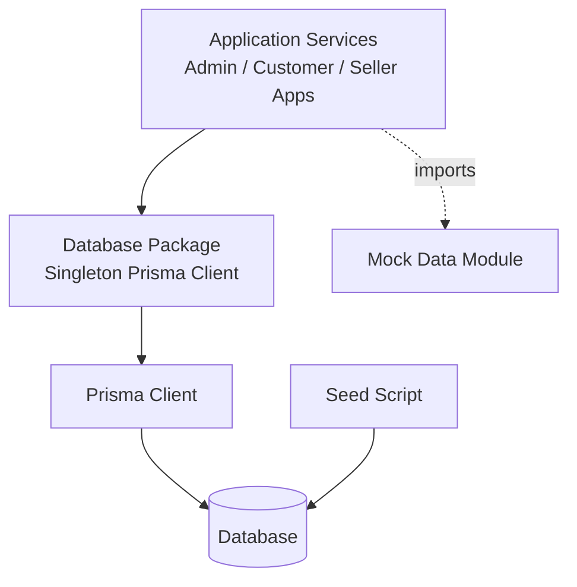
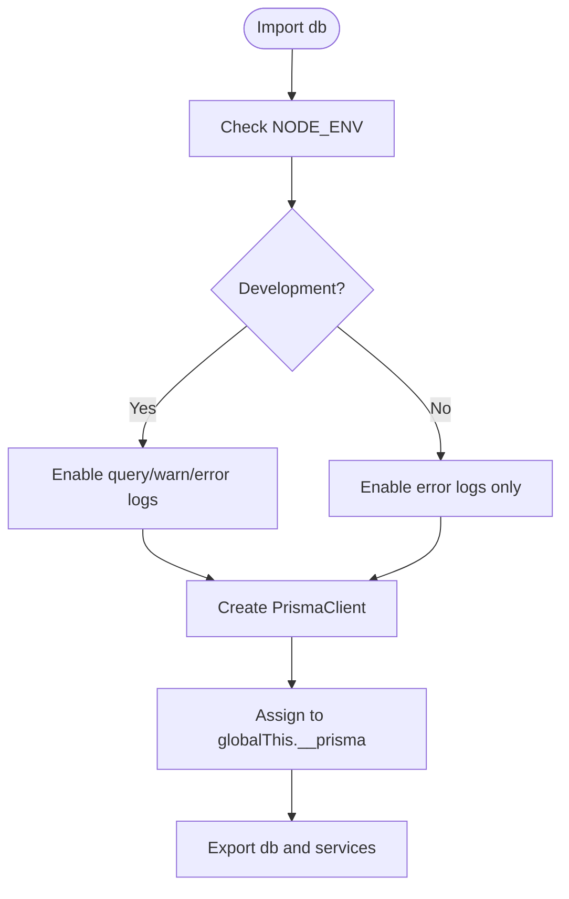
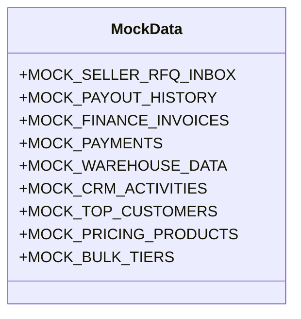
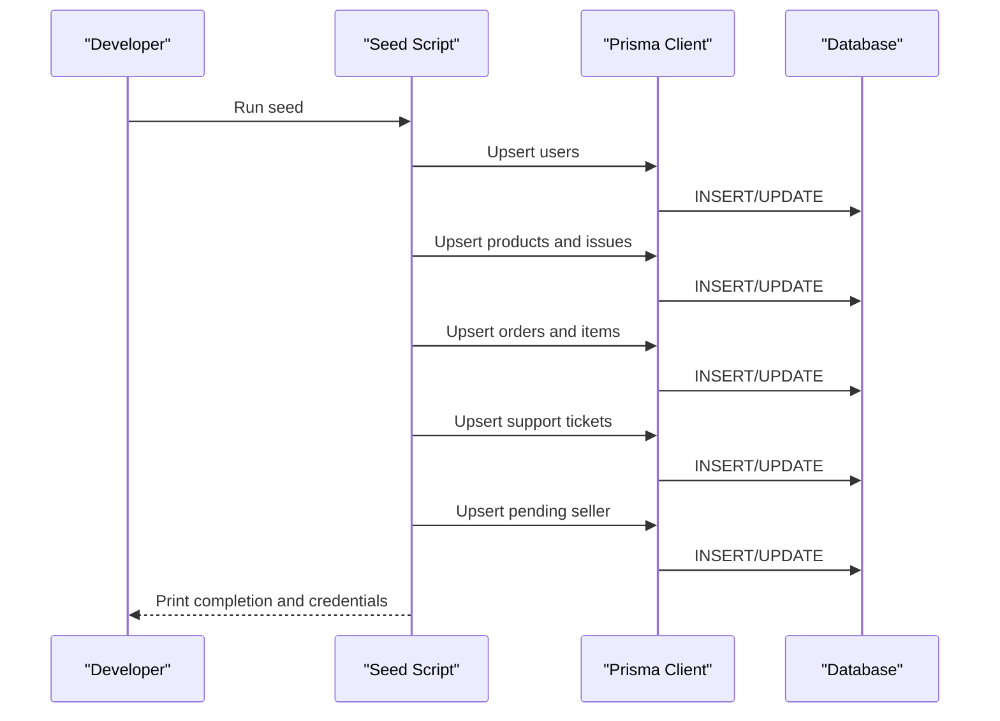
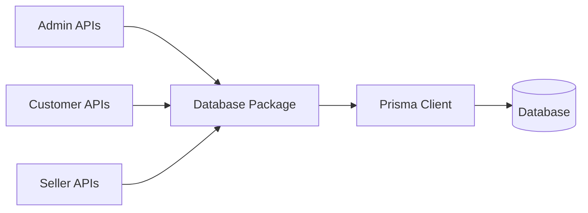
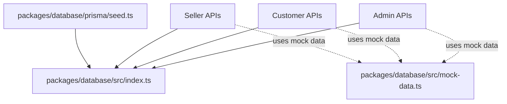

# Data Management & Utilities

<cite>
**Referenced Files in This Document**
- [DATABASE_NOTES.md](file://DATABASE_NOTES.md)
- [packages/database/src/index.ts](file://packages/database/src/index.ts)
- [packages/database/prisma/seed.ts](file://packages/database/prisma/seed.ts)
- [packages/database/src/mock-data.ts](file://packages/database/src/mock-data.ts)
- [apps/admin/src/app/api/admin/dashboard/route.ts](file://apps/admin/src/app/api/admin/dashboard/route.ts)
- [apps/admin/src/app/api/admin/compliance/[id]/approve/route.ts](file://apps/admin/src/app/api/admin/compliance/[id]/approve/route.ts)
- [apps/admin/src/app/api/admin/compliance/[id]/reject/route.ts](file://apps/admin/src/app/api/admin/compliance/[id]/reject/route.ts)
- [apps/admin/src/app/api/admin/products/[id]/approve/route.ts](file://apps/admin/src/app/api/admin/products/[id]/approve/route.ts)
- [apps/admin/src/app/api/admin/sellers/[id]/approve/route.ts](file://apps/admin/src/app/api/admin/sellers/[id]/approve/route.ts)
- [apps/admin/src/app/api/admin/sellers/[id]/reject/route.ts](file://apps/admin/src/app/api/admin/sellers/[id]/reject/route.ts)
- [apps/customer/src/app/api/auth/register/business/route.ts](file://apps/customer/src/app/api/auth/register/business/route.ts)
- [apps/customer/src/app/api/auth/register/consumer/route.ts](file://apps/customer/src/app/api/auth/register/consumer/route.ts)
- [apps/customer/src/app/api/categories/route.ts](file://apps/customer/src/app/api/categories/route.ts)
- [apps/customer/src/app/api/orders/route.ts](file://apps/customer/src/app/api/orders/route.ts)
- [apps/customer/src/app/api/payments/webhook/route.ts](file://apps/customer/src/app/api/payments/webhook/route.ts)
- [apps/customer/src/app/api/products/route.ts](file://apps/customer/src/app/api/products/route.ts)
- [apps/customer/src/app/b2b/addresses/actions.ts](file://apps/customer/src/app/b2b/addresses/actions.ts)
- [apps/customer/src/app/b2b/approval-policies/actions.ts](file://apps/customer/src/app/b2b/approval-policies/actions.ts)
- [apps/customer/src/app/b2b/lists/actions.ts](file://apps/customer/src/app/b2b/lists/actions.ts)
- [apps/customer/src/app/b2b/purchase-orders/actions.ts](file://apps/customer/src/app/b2b/purchase-orders/actions.ts)
- [apps/customer/src/app/b2b/team/actions.ts](file://apps/customer/src/app/b2b/team/actions.ts)
- [apps/seller/src/app/api/seller/dashboard/route.ts](file://apps/seller/src/app/api/seller/dashboard/route.ts)
- [apps/seller/src/app/api/seller/orders/route.ts](file://apps/seller/src/app/api/seller/orders/route.ts)
</cite>

## Table of Contents
1. [Introduction](#introduction)
2. [Project Structure](#project-structure)
3. [Core Components](#core-components)
4. [Architecture Overview](#architecture-overview)
5. [Detailed Component Analysis](#detailed-component-analysis)
6. [Dependency Analysis](#dependency-analysis)
7. [Performance Considerations](#performance-considerations)
8. [Troubleshooting Guide](#troubleshooting-guide)
9. [Conclusion](#conclusion)
10. [Appendices](#appendices)

## Introduction
This document describes the data management utilities and mock data system used in Avenick Commerce. It focuses on:
- How the database client is initialized and reused across the monorepo
- The mock data system used for development and testing
- Database seeding strategies and environment-specific data management
- Practical examples of generating mock data for product catalogs, order histories, and user profiles
- Cleanup and reset mechanisms
- Privacy considerations and guidance for extending the mock data system

## Project Structure
The data management layer is primarily implemented in the shared database package and complemented by seed scripts and mock data exports. Application services import database utilities and mock datasets to power admin, customer, and seller experiences.

```mermaid
graph TB
subgraph "Shared Package"
DBPKG["packages/database/src/index.ts"]
MOCK["packages/database/src/mock-data.ts"]
SEED["packages/database/prisma/seed.ts"]
end
subgraph "Admin App"
ADM_API1["apps/admin/src/app/api/admin/dashboard/route.ts"]
ADM_API2["apps/admin/src/app/api/admin/compliance/[id]/approve/route.ts"]
ADM_API3["apps/admin/src/app/api/admin/compliance/[id]/reject/route.ts"]
ADM_API4["apps/admin/src/app/api/admin/products/[id]/approve/route.ts"]
ADM_API5["apps/admin/src/app/api/admin/sellers/[id]/approve/route.ts"]
ADM_API6["apps/admin/src/app/api/admin/sellers/[id]/reject/route.ts"]
end
subgraph "Customer App"
CUST_API1["apps/customer/src/app/api/auth/register/business/route.ts"]
CUST_API2["apps/customer/src/app/api/auth/register/consumer/route.ts"]
CUST_API3["apps/customer/src/app/api/categories/route.ts"]
CUST_API4["apps/customer/src/app/api/orders/route.ts"]
CUST_API5["apps/customer/src/app/api/payments/webhook/route.ts"]
CUST_API6["apps/customer/src/app/api/products/route.ts"]
CUST_ACT1["apps/customer/src/app/b2b/addresses/actions.ts"]
CUST_ACT2["apps/customer/src/app/b2b/approval-policies/actions.ts"]
CUST_ACT3["apps/customer/src/app/b2b/lists/actions.ts"]
CUST_ACT4["apps/customer/src/app/b2b/purchase-orders/actions.ts"]
CUST_ACT5["apps/customer/src/app/b2b/team/actions.ts"]
end
subgraph "Seller App"
SEL_API1["apps/seller/src/app/api/seller/dashboard/route.ts"]
SEL_API2["apps/seller/src/app/api/seller/orders/route.ts"]
end
DBPKG --> ADM_API1
DBPKG --> ADM_API2
DBPKG --> ADM_API3
DBPKG --> ADM_API4
DBPKG --> ADM_API5
DBPKG --> ADM_API6
DBPKG --> CUST_API1
DBPKG --> CUST_API2
DBPKG --> CUST_API3
DBPKG --> CUST_API4
DBPKG --> CUST_API5
DBPKG --> CUST_API6
DBPKG --> CUST_ACT1
DBPKG --> CUST_ACT2
DBPKG --> CUST_ACT3
DBPKG --> CUST_ACT4
DBPKG --> CUST_ACT5
DBPKG --> SEL_API1
DBPKG --> SEL_API2
MOCK -. "used by" .-> ADM_API1
MOCK -. "used by" .-> CUST_API4
MOCK -. "used by" .-> SEL_API1
```

**Diagram sources**
- [packages/database/src/index.ts:1-28](file://packages/database/src/index.ts#L1-L28)
- [packages/database/src/mock-data.ts:134-394](file://packages/database/src/mock-data.ts#L134-L394)
- [packages/database/prisma/seed.ts:666-1055](file://packages/database/prisma/seed.ts#L666-L1055)
- [apps/admin/src/app/api/admin/dashboard/route.ts:1-5](file://apps/admin/src/app/api/admin/dashboard/route.ts#L1-L5)
- [apps/admin/src/app/api/admin/compliance/[id]/approve/route.ts](file://apps/admin/src/app/api/admin/compliance/[id]/approve/route.ts#L1-L5)
- [apps/admin/src/app/api/admin/compliance/[id]/reject/route.ts](file://apps/admin/src/app/api/admin/compliance/[id]/reject/route.ts#L1-L5)
- [apps/admin/src/app/api/admin/products/[id]/approve/route.ts](file://apps/admin/src/app/api/admin/products/[id]/approve/route.ts#L1-L5)
- [apps/admin/src/app/api/admin/sellers/[id]/approve/route.ts](file://apps/admin/src/app/api/admin/sellers/[id]/approve/route.ts#L1-L5)
- [apps/admin/src/app/api/admin/sellers/[id]/reject/route.ts](file://apps/admin/src/app/api/admin/sellers/[id]/reject/route.ts#L1-L5)
- [apps/customer/src/app/api/auth/register/business/route.ts:1-5](file://apps/customer/src/app/api/auth/register/business/route.ts#L1-L5)
- [apps/customer/src/app/api/auth/register/consumer/route.ts:1-5](file://apps/customer/src/app/api/auth/register/consumer/route.ts#L1-L5)
- [apps/customer/src/app/api/categories/route.ts:1-5](file://apps/customer/src/app/api/categories/route.ts#L1-L5)
- [apps/customer/src/app/api/orders/route.ts:1-10](file://apps/customer/src/app/api/orders/route.ts#L1-L10)
- [apps/customer/src/app/api/payments/webhook/route.ts:1-5](file://apps/customer/src/app/api/payments/webhook/route.ts#L1-L5)
- [apps/customer/src/app/api/products/route.ts:1-5](file://apps/customer/src/app/api/products/route.ts#L1-L5)
- [apps/customer/src/app/b2b/addresses/actions.ts:1-5](file://apps/customer/src/app/b2b/addresses/actions.ts#L1-L5)
- [apps/customer/src/app/b2b/approval-policies/actions.ts:1-5](file://apps/customer/src/app/b2b/approval-policies/actions.ts#L1-L5)
- [apps/customer/src/app/b2b/lists/actions.ts:1-5](file://apps/customer/src/app/b2b/lists/actions.ts#L1-L5)
- [apps/customer/src/app/b2b/purchase-orders/actions.ts:1-5](file://apps/customer/src/app/b2b/purchase-orders/actions.ts#L1-L5)
- [apps/customer/src/app/b2b/team/actions.ts:1-5](file://apps/customer/src/app/b2b/team/actions.ts#L1-L5)
- [apps/seller/src/app/api/seller/dashboard/route.ts:1-5](file://apps/seller/src/app/api/seller/dashboard/route.ts#L1-L5)
- [apps/seller/src/app/api/seller/orders/route.ts:1-5](file://apps/seller/src/app/api/seller/orders/route.ts#L1-L5)

**Section sources**
- [packages/database/src/index.ts:1-28](file://packages/database/src/index.ts#L1-L28)
- [packages/database/src/mock-data.ts:134-394](file://packages/database/src/mock-data.ts#L134-L394)
- [packages/database/prisma/seed.ts:666-1055](file://packages/database/prisma/seed.ts#L666-L1055)

## Core Components
- Database client initialization with singleton pattern to avoid multiple Prisma connections during development hot reload.
- Exported services for listings, products, orders, inventory, admin, and mock data for convenient consumption across apps.
- A comprehensive mock data module exporting ready-to-use datasets for dashboards, catalogs, CRM, finance, and more.
- A seed script that upserts realistic development data including users, products, orders, support tickets, and issues.

Key responsibilities:
- Centralized Prisma client lifecycle management
- Environment-aware logging
- Re-export of domain services and mock datasets
- Seed-driven population of development databases

**Section sources**
- [packages/database/src/index.ts:1-28](file://packages/database/src/index.ts#L1-L28)
- [packages/database/src/mock-data.ts:134-394](file://packages/database/src/mock-data.ts#L134-L394)
- [packages/database/prisma/seed.ts:666-1055](file://packages/database/prisma/seed.ts#L666-L1055)

## Architecture Overview
The data architecture separates concerns:
- Shared database package exposes a singleton Prisma client and domain services
- Applications import the package to access database operations and mock datasets
- Seed script populates development databases with realistic fixtures
- Mock data is used to accelerate UI development and testing without requiring live data

**Diagram sources**
- [packages/database/src/index.ts:1-28](file://packages/database/src/index.ts#L1-L28)
- [packages/database/prisma/seed.ts:666-1055](file://packages/database/prisma/seed.ts#L666-L1055)
- [packages/database/src/mock-data.ts:134-394](file://packages/database/src/mock-data.ts#L134-L394)

## Detailed Component Analysis

### Database Client Initialization
- Implements a singleton Prisma client to prevent multiple connections during development.
- Enables verbose logging in development and minimal logging in production.
- Exports all Prisma client types and domain services for convenience.

**Diagram sources**
- [packages/database/src/index.ts:1-28](file://packages/database/src/index.ts#L1-L28)

**Section sources**
- [packages/database/src/index.ts:1-28](file://packages/database/src/index.ts#L1-L28)

### Mock Data System
The mock data module exports structured datasets for:
- Seller RFQ inbox
- Payout history
- Finance invoices
- Payments
- Warehouse metrics and alerts
- CRM activities and top customers
- Pricing and bulk tiers
- Health monitoring and operational stats

These datasets are designed to be consumed directly by UI components and tests to simulate real-world scenarios without hitting the database.

**Diagram sources**
- [packages/database/src/mock-data.ts:134-394](file://packages/database/src/mock-data.ts#L134-L394)

**Section sources**
- [packages/database/src/mock-data.ts:134-394](file://packages/database/src/mock-data.ts#L134-L394)

### Seed Script and Development Data
The seed script performs controlled upserts to populate development databases with:
- Users (admin, seller, buyer, company, pending seller)
- Products and product issues
- Orders and order items
- Support tickets
- Pending seller onboarding entries

It prints credentials and progress messages to aid local development.

**Diagram sources**
- [packages/database/prisma/seed.ts:666-1055](file://packages/database/prisma/seed.ts#L666-L1055)

**Section sources**
- [packages/database/prisma/seed.ts:666-1055](file://packages/database/prisma/seed.ts#L666-L1055)

### Example Workflows Using Mock Data

#### Product Catalog Mock Data
- Use pricing and bulk tier datasets to render dynamic pricing cards and bulk discounts in the customer app.
- Integrate seller RFQ inbox data to preview buyer demand and quoting workflows in the seller app.

**Section sources**
- [packages/database/src/mock-data.ts:134-394](file://packages/database/src/mock-data.ts#L134-L394)
- [apps/customer/src/app/api/products/route.ts:1-5](file://apps/customer/src/app/api/products/route.ts#L1-L5)
- [apps/seller/src/app/api/seller/dashboard/route.ts:1-5](file://apps/seller/src/app/api/seller/dashboard/route.ts#L1-L5)

#### Order History Mock Data
- Use mock datasets to prefill order lists and dashboards in the customer and seller apps.
- Combine with payment and invoice mocks to simulate end-to-end order-to-payment flows.

**Section sources**
- [packages/database/src/mock-data.ts:134-394](file://packages/database/src/mock-data.ts#L134-L394)
- [apps/customer/src/app/api/orders/route.ts:1-10](file://apps/customer/src/app/api/orders/route.ts#L1-L10)
- [apps/seller/src/app/api/seller/orders/route.ts:1-5](file://apps/seller/src/app/api/seller/orders/route.ts#L1-L5)

#### User Profiles and Registration
- Use seed-generated users to bootstrap admin and seller dashboards.
- Use registration routes to create additional test accounts programmatically.

**Section sources**
- [packages/database/prisma/seed.ts:666-1055](file://packages/database/prisma/seed.ts#L666-L1055)
- [apps/customer/src/app/api/auth/register/business/route.ts:1-5](file://apps/customer/src/app/api/auth/register/business/route.ts#L1-L5)
- [apps/customer/src/app/api/auth/register/consumer/route.ts:1-5](file://apps/customer/src/app/api/auth/register/consumer/route.ts#L1-L5)

### Integration Points Across Applications
- Admin APIs import the database package for dashboard analytics, compliance reviews, product approvals, and seller onboarding decisions.
- Customer APIs leverage the database package for product listings, orders, payments, and B2B features.
- Seller APIs consume the database package for dashboards and order management.

**Diagram sources**
- [apps/admin/src/app/api/admin/dashboard/route.ts:1-5](file://apps/admin/src/app/api/admin/dashboard/route.ts#L1-L5)
- [apps/admin/src/app/api/admin/compliance/[id]/approve/route.ts](file://apps/admin/src/app/api/admin/compliance/[id]/approve/route.ts#L1-L5)
- [apps/admin/src/app/api/admin/compliance/[id]/reject/route.ts](file://apps/admin/src/app/api/admin/compliance/[id]/reject/route.ts#L1-L5)
- [apps/admin/src/app/api/admin/products/[id]/approve/route.ts](file://apps/admin/src/app/api/admin/products/[id]/approve/route.ts#L1-L5)
- [apps/admin/src/app/api/admin/sellers/[id]/approve/route.ts](file://apps/admin/src/app/api/admin/sellers/[id]/approve/route.ts#L1-L5)
- [apps/admin/src/app/api/admin/sellers/[id]/reject/route.ts](file://apps/admin/src/app/api/admin/sellers/[id]/reject/route.ts#L1-L5)
- [apps/customer/src/app/api/auth/register/business/route.ts:1-5](file://apps/customer/src/app/api/auth/register/business/route.ts#L1-L5)
- [apps/customer/src/app/api/auth/register/consumer/route.ts:1-5](file://apps/customer/src/app/api/auth/register/consumer/route.ts#L1-L5)
- [apps/customer/src/app/api/categories/route.ts:1-5](file://apps/customer/src/app/api/categories/route.ts#L1-L5)
- [apps/customer/src/app/api/orders/route.ts:1-10](file://apps/customer/src/app/api/orders/route.ts#L1-L10)
- [apps/customer/src/app/api/payments/webhook/route.ts:1-5](file://apps/customer/src/app/api/payments/webhook/route.ts#L1-L5)
- [apps/customer/src/app/api/products/route.ts:1-5](file://apps/customer/src/app/api/products/route.ts#L1-L5)
- [apps/customer/src/app/b2b/addresses/actions.ts:1-5](file://apps/customer/src/app/b2b/addresses/actions.ts#L1-L5)
- [apps/customer/src/app/b2b/approval-policies/actions.ts:1-5](file://apps/customer/src/app/b2b/approval-policies/actions.ts#L1-L5)
- [apps/customer/src/app/b2b/lists/actions.ts:1-5](file://apps/customer/src/app/b2b/lists/actions.ts#L1-L5)
- [apps/customer/src/app/b2b/purchase-orders/actions.ts:1-5](file://apps/customer/src/app/b2b/purchase-orders/actions.ts#L1-L5)
- [apps/customer/src/app/b2b/team/actions.ts:1-5](file://apps/customer/src/app/b2b/team/actions.ts#L1-L5)
- [apps/seller/src/app/api/seller/dashboard/route.ts:1-5](file://apps/seller/src/app/api/seller/dashboard/route.ts#L1-L5)
- [apps/seller/src/app/api/seller/orders/route.ts:1-5](file://apps/seller/src/app/api/seller/orders/route.ts#L1-L5)

**Section sources**
- [apps/admin/src/app/api/admin/dashboard/route.ts:1-5](file://apps/admin/src/app/api/admin/dashboard/route.ts#L1-L5)
- [apps/admin/src/app/api/admin/compliance/[id]/approve/route.ts](file://apps/admin/src/app/api/admin/compliance/[id]/approve/route.ts#L1-L5)
- [apps/admin/src/app/api/admin/compliance/[id]/reject/route.ts](file://apps/admin/src/app/api/admin/compliance/[id]/reject/route.ts#L1-L5)
- [apps/admin/src/app/api/admin/products/[id]/approve/route.ts](file://apps/admin/src/app/api/admin/products/[id]/approve/route.ts#L1-L5)
- [apps/admin/src/app/api/admin/sellers/[id]/approve/route.ts](file://apps/admin/src/app/api/admin/sellers/[id]/approve/route.ts#L1-L5)
- [apps/admin/src/app/api/admin/sellers/[id]/reject/route.ts](file://apps/admin/src/app/api/admin/sellers/[id]/reject/route.ts#L1-L5)
- [apps/customer/src/app/api/auth/register/business/route.ts:1-5](file://apps/customer/src/app/api/auth/register/business/route.ts#L1-L5)
- [apps/customer/src/app/api/auth/register/consumer/route.ts:1-5](file://apps/customer/src/app/api/auth/register/consumer/route.ts#L1-L5)
- [apps/customer/src/app/api/categories/route.ts:1-5](file://apps/customer/src/app/api/categories/route.ts#L1-L5)
- [apps/customer/src/app/api/orders/route.ts:1-10](file://apps/customer/src/app/api/orders/route.ts#L1-L10)
- [apps/customer/src/app/api/payments/webhook/route.ts:1-5](file://apps/customer/src/app/api/payments/webhook/route.ts#L1-L5)
- [apps/customer/src/app/api/products/route.ts:1-5](file://apps/customer/src/app/api/products/route.ts#L1-L5)
- [apps/customer/src/app/b2b/addresses/actions.ts:1-5](file://apps/customer/src/app/b2b/addresses/actions.ts#L1-L5)
- [apps/customer/src/app/b2b/approval-policies/actions.ts:1-5](file://apps/customer/src/app/b2b/approval-policies/actions.ts#L1-L5)
- [apps/customer/src/app/b2b/lists/actions.ts:1-5](file://apps/customer/src/app/b2b/lists/actions.ts#L1-L5)
- [apps/customer/src/app/b2b/purchase-orders/actions.ts:1-5](file://apps/customer/src/app/b2b/purchase-orders/actions.ts#L1-L5)
- [apps/customer/src/app/b2b/team/actions.ts:1-5](file://apps/customer/src/app/b2b/team/actions.ts#L1-L5)
- [apps/seller/src/app/api/seller/dashboard/route.ts:1-5](file://apps/seller/src/app/api/seller/dashboard/route.ts#L1-L5)
- [apps/seller/src/app/api/seller/orders/route.ts:1-5](file://apps/seller/src/app/api/seller/orders/route.ts#L1-L5)

## Dependency Analysis
- The database package centralizes Prisma client initialization and exports domain services and mock data.
- Application APIs depend on the database package for data access and on mock data for UI scaffolding.
- Seed script depends on Prisma client to upsert development fixtures.

**Diagram sources**
- [packages/database/src/index.ts:1-28](file://packages/database/src/index.ts#L1-L28)
- [packages/database/src/mock-data.ts:134-394](file://packages/database/src/mock-data.ts#L134-L394)
- [packages/database/prisma/seed.ts:666-1055](file://packages/database/prisma/seed.ts#L666-L1055)

**Section sources**
- [packages/database/src/index.ts:1-28](file://packages/database/src/index.ts#L1-L28)
- [packages/database/src/mock-data.ts:134-394](file://packages/database/src/mock-data.ts#L134-L394)
- [packages/database/prisma/seed.ts:666-1055](file://packages/database/prisma/seed.ts#L666-L1055)

## Performance Considerations
- The singleton Prisma client avoids connection overhead and reduces memory footprint during development.
- Mock data eliminates database round-trips for UI prototyping and automated tests.
- Seed script uses upserts to minimize duplicate writes and speed up development setup.

[No sources needed since this section provides general guidance]

## Troubleshooting Guide
Common issues and resolutions:
- Multiple Prisma connections in development: Ensure the singleton pattern is respected by importing the exported client from the database package.
- Empty development database: Run the seed script to populate users, products, orders, and support fixtures.
- Authentication credentials: The seed script prints default credentials for admin, seller, buyer, company, and pending seller accounts.
- Logging verbosity: Development mode enables query and warning logs; production mode restricts logs to errors.

**Section sources**
- [packages/database/src/index.ts:1-28](file://packages/database/src/index.ts#L1-L28)
- [packages/database/prisma/seed.ts:666-1055](file://packages/database/prisma/seed.ts#L666-L1055)

## Conclusion
Avenick Commerce’s data management system combines a singleton Prisma client, a comprehensive mock data module, and a seed script to streamline development and testing. The approach balances realism with privacy by using synthetic data and avoiding real financial transactions. Extensions to the mock data system should remain deterministic, localized, and aligned with existing dataset shapes to maintain consistency across applications.

[No sources needed since this section summarizes without analyzing specific files]

## Appendices

### Database Initialization and Migration Notes
- Migration path to MySQL requires careful handling of array fields and schema adjustments.
- Phase 2 emphasizes mock data usage, reducing reliance on database migrations for new features.

**Section sources**
- [DATABASE_NOTES.md:37-67](file://DATABASE_NOTES.md#L37-L67)

### Development Workflow Integration
- Import the database client from the shared package to access Prisma types and services.
- Use mock data to accelerate UI development and testing without database connectivity.
- Seed the database for initial development state and reset as needed.

**Section sources**
- [packages/database/src/index.ts:1-28](file://packages/database/src/index.ts#L1-L28)
- [packages/database/src/mock-data.ts:134-394](file://packages/database/src/mock-data.ts#L134-L394)
- [packages/database/prisma/seed.ts:666-1055](file://packages/database/prisma/seed.ts#L666-L1055)