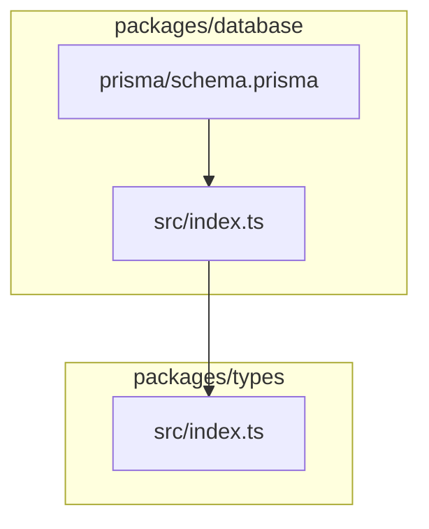
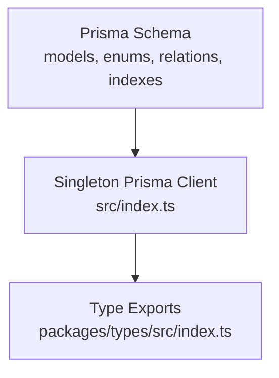
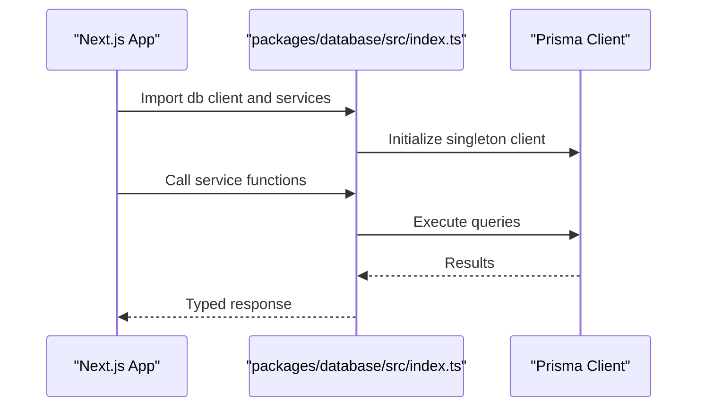
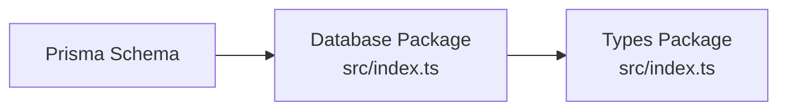

# Database Design & Schema

<cite>
**Referenced Files in This Document**
- [schema.prisma](file://packages/database/prisma/schema.prisma)
- [index.ts](file://packages/database/src/index.ts)
- [DATABASE_NOTES.md](file://DATABASE_NOTES.md)
- [index.ts](file://packages/types/src/index.ts)
</cite>

## Table of Contents
1. [Introduction](#introduction)
2. [Project Structure](#project-structure)
3. [Core Components](#core-components)
4. [Architecture Overview](#architecture-overview)
5. [Detailed Component Analysis](#detailed-component-analysis)
6. [Dependency Analysis](#dependency-analysis)
7. [Performance Considerations](#performance-considerations)
8. [Troubleshooting Guide](#troubleshooting-guide)
9. [Conclusion](#conclusion)
10. [Appendices](#appendices)

## Introduction
This document provides comprehensive database design documentation for Avenick Commerce. It focuses on the Prisma schema that defines 20+ models, including User, Company, SellerProfile, Product, Order, Warehouse, and supporting entities. It explains entity relationships, foreign keys, indexes, data validation rules, and the service layer architecture. It also covers migration strategies, seed data structure, performance optimization techniques, Decimal precision handling for monetary values, and audit trail implementation.

## Project Structure
The database layer is organized under the packages/database monorepo package:
- Prisma schema defines models, enums, relations, indexes, and validations.
- A singleton Prisma client is exported from the database package for centralized data access.
- Types re-exported from the database package enable type-safe usage across portals.
- Migration and seeding guidance is documented separately.

**Diagram sources**
- [schema.prisma:1-1021](file://packages/database/prisma/schema.prisma#L1-L1021)
- [index.ts:1-28](file://packages/database/src/index.ts#L1-L28)
- [index.ts:1-49](file://packages/types/src/index.ts#L1-L49)

**Section sources**
- [schema.prisma:1-1021](file://packages/database/prisma/schema.prisma#L1-L1021)
- [index.ts:1-28](file://packages/database/src/index.ts#L1-L28)
- [index.ts:1-49](file://packages/types/src/index.ts#L1-L49)

## Core Components
This section outlines the primary models and their roles in the Avenick Commerce ecosystem. The schema includes 20+ models covering identity, commerce, inventory, orders, payments, and administrative workflows.

Key models and responsibilities:
- Identity and Access: User, Company, CompanyMember, Role and Status enums
- Commerce Catalog: Category, Brand, Product, ProductVariant, ProductPrice, ProductImage
- Inventory and Warehousing: Warehouse, WarehouseZone, InventoryStock, InventoryTransaction
- Orders and Fulfillment: PurchaseOrder, Order, OrderItem, OrderShipment, OrderAudit
- Payments and Finance: Payment, Refund, Commission, SellerPayout
- Compliance and Documents: ProductComplianceDocument, SellerDocument
- Notifications and Audit: Notification, AuditLog
- AI and Automation: AIInsight, AutomationTask

Representative model coverage:
- Identity and Access: User, Company, CompanyMember, UserRole, UserStatus, CompanyStatus, CompanySize
- Commerce Catalog: Category, Brand, Product, ProductVariant, ProductPrice, ProductImage
- Inventory and Warehousing: Warehouse, WarehouseZone, InventoryStock, InventoryTransaction
- Orders and Fulfillment: PurchaseOrder, Order, OrderItem, OrderShipment, OrderAudit
- Payments and Finance: Payment, Refund, Commission, SellerPayout
- Compliance and Documents: ProductComplianceDocument, SellerDocument
- Notifications and Audit: Notification, AuditLog
- AI and Automation: AIInsight, AutomationTask

**Section sources**
- [schema.prisma:13-1021](file://packages/database/prisma/schema.prisma#L13-L1021)

## Architecture Overview
The database architecture centers on a single Prisma schema with explicit relations, indexes, and validations. The Prisma client is exposed as a singleton to prevent multiple connections during development. Types are re-exported from the database package for cross-application usage.

**Diagram sources**
- [schema.prisma:1-1021](file://packages/database/prisma/schema.prisma#L1-L1021)
- [index.ts:1-28](file://packages/database/src/index.ts#L1-L28)
- [index.ts:1-49](file://packages/types/src/index.ts#L1-L49)

## Detailed Component Analysis

### Identity and Access Layer
Models: User, Company, CompanyMember, Role and Status enums
- User: identity with roles and status; linked to Company via CompanyMember
- Company: organization with status and size; manages members and products
- CompanyMember: join entity linking User to Company with role assignment
- Enums: UserRole, UserStatus, CompanyStatus, CompanySize

Entity relationships:
- One-to-many: Company to CompanyMember
- Many-to-one: CompanyMember to User and Company
- Enum-driven validations for role and status fields

Indexes:
- Composite indexes on (userId, companyId) for fast membership lookups

Validation rules:
- Unique constraints on email per User
- Enum constraints enforced at schema level

**Section sources**
- [schema.prisma:13-1021](file://packages/database/prisma/schema.prisma#L13-L1021)

### Commerce Catalog Layer
Models: Category, Brand, Product, ProductVariant, ProductPrice, ProductImage
- Category: hierarchical taxonomy for products
- Brand: brand metadata
- Product: catalog item with variants, pricing, images, compliance docs
- ProductVariant: SKU-level attributes and pricing
- ProductPrice: price history and tiers
- ProductImage: media assets

Entity relationships:
- One-to-many: Category to Product
- One-to-many: Brand to Product
- One-to-many: Product to ProductVariant
- One-to-many: ProductVariant to ProductPrice
- One-to-many: Product to ProductImage
- One-to-many: Product to ProductComplianceDocument

Indexes:
- Index on Product.categoryId and Product.brandId
- Index on ProductVariant.productId
- Index on ProductPrice.variantId

Validation rules:
- Decimal precision for prices via Decimal(12, 2)
- Enum constraints for ProductStatus, PricingType

**Section sources**
- [schema.prisma:13-1021](file://packages/database/prisma/schema.prisma#L13-L1021)

### Inventory and Warehousing Layer
Models: Warehouse, WarehouseZone, InventoryStock, InventoryTransaction
- Warehouse: storage facility with location and status
- WarehouseZone: zones inside a warehouse
- InventoryStock: current stock levels per variant and zone
- InventoryTransaction: inbound/outbound movements with batch tracking

Entity relationships:
- One-to-many: Warehouse to WarehouseZone
- One-to-many: WarehouseZone to InventoryStock
- One-to-many: ProductVariant to InventoryStock
- One-to-many: InventoryStock to InventoryTransaction

Indexes:
- Composite index on (warehouseZoneId, variantId) for stock lookup
- Index on InventoryTransaction.stockId

Validation rules:
- Decimal quantities for stock levels
- Enum constraints for transaction types

**Section sources**
- [schema.prisma:13-1021](file://packages/database/prisma/schema.prisma#L13-L1021)

### Orders and Fulfillment Layer
Models: PurchaseOrder, Order, OrderItem, OrderShipment, OrderAudit
- PurchaseOrder: buyer’s purchase order with status
- Order: fulfillment order derived from PO or direct purchase
- OrderItem: ordered items with pricing and variant linkage
- OrderShipment: shipping records and tracking
- OrderAudit: audit trail for order lifecycle events

Entity relationships:
- One-to-many: PurchaseOrder to Order
- One-to-many: Order to OrderItem
- One-to-many: Order to OrderShipment
- One-to-many: Order to OrderAudit

Indexes:
- Index on Order.purchaseOrderId
- Index on OrderItem.orderId
- Index on OrderShipment.orderId

Validation rules:
- Decimal precision for item amounts
- Enum constraints for POStatus, OrderStatus, OrderType

**Section sources**
- [schema.prisma:13-1021](file://packages/database/prisma/schema.prisma#L13-L1021)

### Payments and Finance Layer
Models: Payment, Refund, Commission, SellerPayout
- Payment: payment attempts with gateway reference and currency
- Refund: refund requests and statuses
- Commission: seller commission calculations
- SellerPayout: payout requests and statuses

Entity relationships:
- One-to-one: Payment to Order
- One-to-one: Refund to Order
- One-to-many: SellerProfile to Commission
- One-to-many: SellerProfile to SellerPayout

Indexes:
- Index on Payment.orderId
- Index on Refund.orderId

Validation rules:
- Decimal precision for monetary values via Decimal(12, 2)
- Enum constraints for PaymentMethod, PaymentStatus, RefundStatus, PayoutStatus

**Section sources**
- [schema.prisma:13-1021](file://packages/database/prisma/schema.prisma#L13-L1021)

### Compliance and Documents Layer
Models: ProductComplianceDocument, SellerDocument
- ProductComplianceDocument: regulatory and safety documents per product
- SellerDocument: seller onboarding and verification documents

Entity relationships:
- One-to-many: Product to ProductComplianceDocument
- One-to-many: SellerProfile to SellerDocument

Indexes:
- Index on ProductComplianceDocument.productId
- Index on SellerDocument.sellerId

Validation rules:
- Enum constraints for DocumentType, DocumentStatus

**Section sources**
- [schema.prisma:13-1021](file://packages/database/prisma/schema.prisma#L13-L1021)

### Notifications and Audit Layer
Models: Notification, AuditLog
- Notification: user/system notifications
- AuditLog: system-wide audit entries

Entity relationships:
- One-to-many: User to Notification
- One-to-many: User to AuditLog

Indexes:
- Index on Notification.userId
- Index on AuditLog.actorId

Validation rules:
- Enum constraints for NotificationType

**Section sources**
- [schema.prisma:13-1021](file://packages/database/prisma/schema.prisma#L13-L1021)

### AI and Automation Layer
Models: AIInsight, AutomationTask
- AIInsight: AI-generated insights for products and orders
- AutomationTask: scheduled or triggered automation tasks

Entity relationships:
- One-to-many: Product to AIInsight
- One-to-many: Order to AIInsight

Indexes:
- Index on AIInsight.productId
- Index on AIInsight.orderId

Validation rules:
- Json fields for structured data

**Section sources**
- [schema.prisma:13-1021](file://packages/database/prisma/schema.prisma#L13-L1021)

### Service Layer Architecture
The database package exposes a singleton Prisma client and re-exports service modules and mock data for development. This enables encapsulated business logic and consistent data access patterns across portals.

**Diagram sources**
- [index.ts:1-28](file://packages/database/src/index.ts#L1-L28)

**Section sources**
- [index.ts:1-28](file://packages/database/src/index.ts#L1-L28)

### Mock Data System for Development
During Phase 2, new features rely on mock data exported from the database package. This eliminates database dependencies for development and testing while maintaining type safety.

- Mock data is exported from the database package for use across applications.
- No database connection is required when using mock data.

**Section sources**
- [DATABASE_NOTES.md:54-58](file://DATABASE_NOTES.md#L54-L58)

## Dependency Analysis
The types package re-exports Prisma models and enums for use across admin, customer, and seller portals. The database package encapsulates Prisma client initialization and service exports.

**Diagram sources**
- [schema.prisma:1-1021](file://packages/database/prisma/schema.prisma#L1-L1021)
- [index.ts:1-28](file://packages/database/src/index.ts#L1-L28)
- [index.ts:1-49](file://packages/types/src/index.ts#L1-L49)

**Section sources**
- [index.ts:1-49](file://packages/types/src/index.ts#L1-L49)
- [index.ts:1-28](file://packages/database/src/index.ts#L1-L28)

## Performance Considerations
- Decimal Precision: Monetary values use Decimal(12, 2) to ensure consistent precision and avoid floating-point errors.
- Indexes: Strategic indexes on foreign keys and frequently queried columns improve query performance.
- Enum Constraints: Enforcing enums at schema level reduces invalid data and improves query plans.
- Singleton Client: Prevents multiple Prisma client instances, reducing overhead in development.
- JSON Fields: Use Json fields for semi-structured data to maintain flexibility without normalization overhead.
- Array Fields: PostgreSQL array fields are used for tags and similar structures; note migration considerations for MySQL.

[No sources needed since this section provides general guidance]

## Troubleshooting Guide
Common issues and resolutions:
- Migration to MySQL: PostgreSQL-specific array syntax and Decimal types require adjustments; follow the documented migration steps.
- Seed Data: Use registration APIs to create initial test accounts if seeding is unavailable.
- Mock Data Usage: During Phase 2, verify mock data exports are correctly imported and typed.

**Section sources**
- [DATABASE_NOTES.md:37-67](file://DATABASE_NOTES.md#L37-L67)

## Conclusion
Avenick Commerce employs a well-structured Prisma schema with 20+ models covering identity, commerce, inventory, orders, payments, compliance, notifications, and automation. The schema enforces data integrity via enums, indexes, and validations, while the service layer provides encapsulated data access through a singleton Prisma client. Migration strategies and mock data systems support development and future database changes.

[No sources needed since this section summarizes without analyzing specific files]

## Appendices

### Decimal Precision Handling
Monetary values across Payment, Refund, and ProductPrice use Decimal(12, 2) to ensure consistent precision and accurate financial computations.

**Section sources**
- [schema.prisma:993-1008](file://packages/database/prisma/schema.prisma#L993-L1008)

### Audit Trail Implementation
OrderAudit captures lifecycle events with timestamps, status transitions, and actor identification, enabling comprehensive audit trails for orders.

**Section sources**
- [schema.prisma:973-984](file://packages/database/prisma/schema.prisma#L973-L984)

### Migration Strategies
Guidance for migrating from PostgreSQL to MySQL, including schema export, provider changes, and handling PostgreSQL-specific types and arrays.

**Section sources**
- [DATABASE_NOTES.md:37-53](file://DATABASE_NOTES.md#L37-L53)

### Seed Data Structure
Development seeding can be performed via registration APIs for consumers, businesses, and sellers, or by setting admin roles directly in the users table.

**Section sources**
- [DATABASE_NOTES.md:60-67](file://DATABASE_NOTES.md#L60-L67)