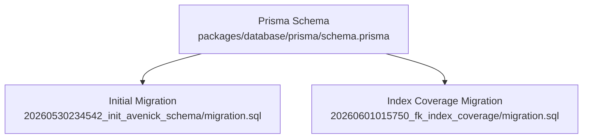
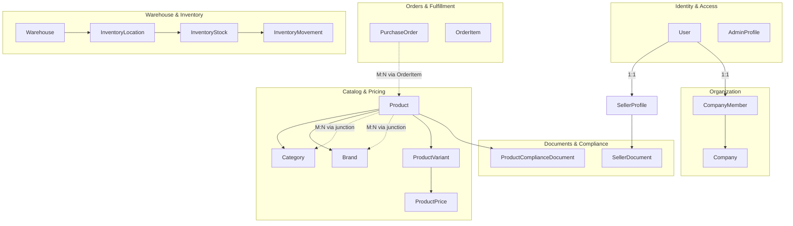
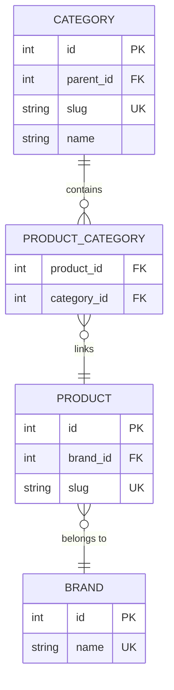
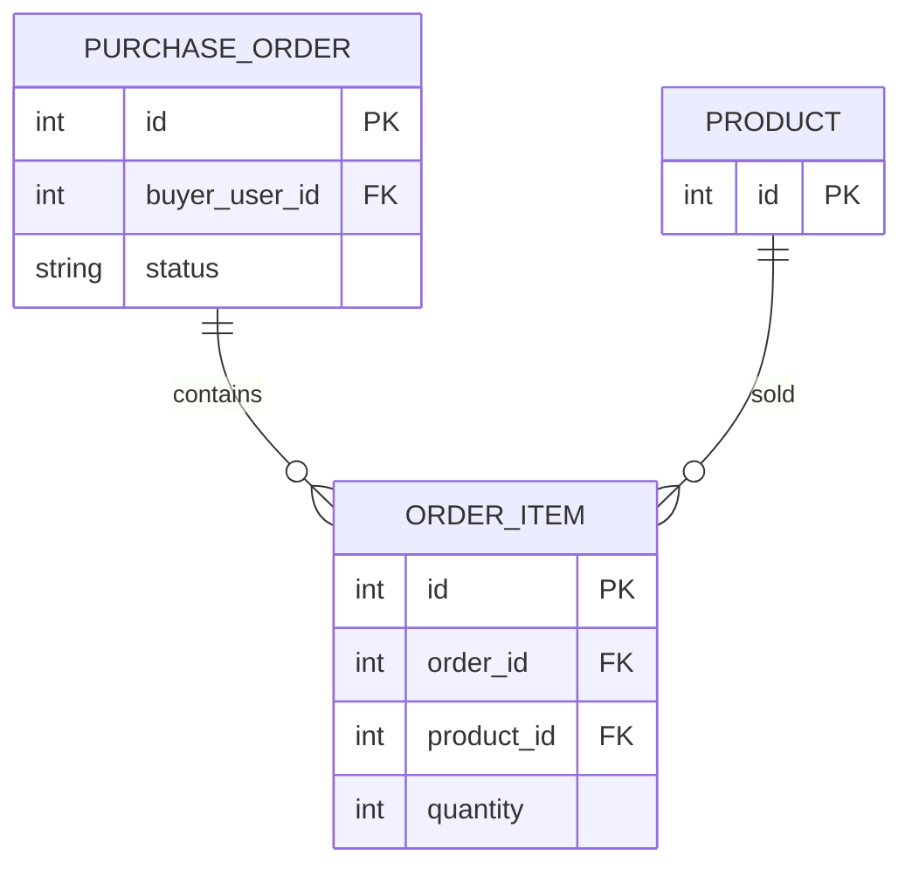
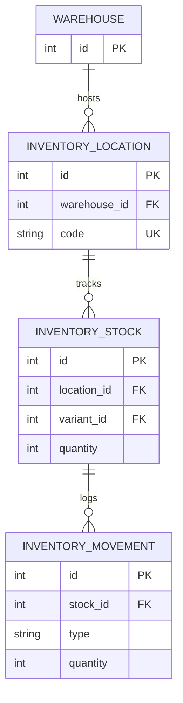
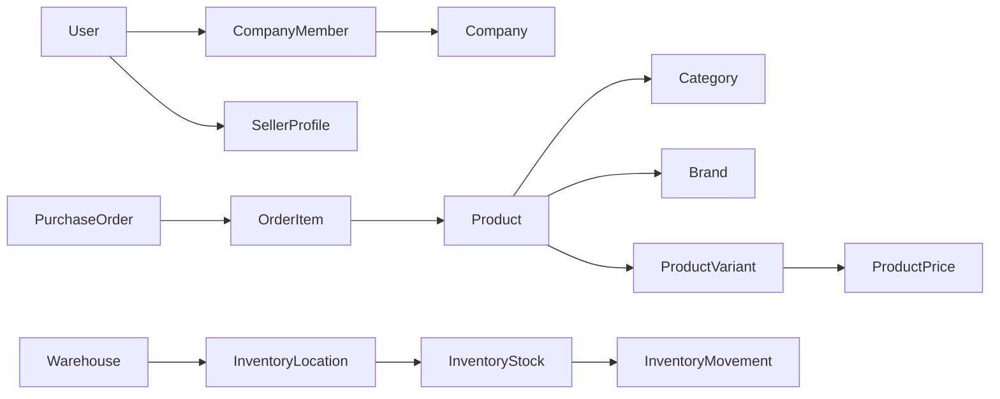

# Entity Relationships & Constraints

<cite>
**Referenced Files in This Document**
- [schema.prisma](file://packages/database/prisma/schema.prisma)
- [20260530234542_init_avenick_schema/migration.sql](file://packages/database/prisma/migrations/20260530234542_init_avenick_schema/migration.sql)
- [20260601015750_fk_index_coverage/migration.sql](file://packages/database/prisma/migrations/20260601015750_fk_index_coverage/migration.sql)
</cite>

## Table of Contents
1. [Introduction](#introduction)
2. [Project Structure](#project-structure)
3. [Core Components](#core-components)
4. [Architecture Overview](#architecture-overview)
5. [Detailed Component Analysis](#detailed-component-analysis)
6. [Dependency Analysis](#dependency-analysis)
7. [Performance Considerations](#performance-considerations)
8. [Troubleshooting Guide](#troubleshooting-guide)
9. [Conclusion](#conclusion)

## Introduction
This document explains the database relationships and constraints implemented in Avenick Commerce. It focuses on foreign key relationships among core entities, referential integrity guarantees, cascade behaviors, unique constraints, and index optimizations. It also covers hierarchical structures such as Category trees and many-to-many patterns via junction tables, along with the rationale behind each constraint and performance implications.

## Project Structure
The database schema is defined using Prisma ORM and maintained through SQL migrations. The primary schema definition resides in a single Prisma schema file, while migrations capture incremental changes and index coverage improvements.



**Diagram sources**
- [schema.prisma](file://packages/database/prisma/schema.prisma)
- [20260530234542_init_avenick_schema/migration.sql](file://packages/database/prisma/migrations/20260530234542_init_avenick_schema/migration.sql)
- [20260601015750_fk_index_coverage/migration.sql](file://packages/database/prisma/migrations/20260601015750_fk_index_coverage/migration.sql)

**Section sources**
- [schema.prisma](file://packages/database/prisma/schema.prisma)
- [20260530234542_init_avenick_schema/migration.sql](file://packages/database/prisma/migrations/20260530234542_init_avenick_schema/migration.sql)
- [20260601015750_fk_index_coverage/migration.sql](file://packages/database/prisma/migrations/20260601015750_fk_index_coverage/migration.sql)

## Core Components
This section outlines the principal entities and their relationships, focusing on:
- User and associated profiles and memberships
- Product taxonomy (Category, Brand) and product variants
- Orders and order items
- Warehouse and inventory controls
- Junction tables for many-to-many relationships

Key entities and their relationships:
- User ↔ SellerProfile (one-to-one)
- User ↔ CompanyMember (one-to-one)
- CompanyMember → Company (many-to-one)
- Product → Category (many-to-one)
- Product → Brand (many-to-one)
- Product ↔ Category (many-to-many via junction)
- Product ↔ Brand (many-to-many via junction)
- Product → ProductVariant (one-to-many)
- ProductVariant → ProductPrice (one-to-one)
- Order → Product (many-to-many via OrderItem)
- Warehouse → InventoryLocation (one-to-many)
- InventoryLocation → InventoryStock (one-to-many)
- InventoryStock → InventoryMovement (one-to-many)

Constraints and behaviors:
- Foreign keys enforce referential integrity
- Cascade delete/update policies are applied per relationship
- Unique constraints prevent duplicates (e.g., unique slugs, unique combinations)
- Indexes optimize join and lookup performance

**Section sources**
- [schema.prisma](file://packages/database/prisma/schema.prisma)
- [20260530234542_init_avenick_schema/migration.sql](file://packages/database/prisma/migrations/20260530234542_init_avenick_schema/migration.sql)
- [20260601015750_fk_index_coverage/migration.sql](file://packages/database/prisma/migrations/20260601015750_fk_index_coverage/migration.sql)

## Architecture Overview
The database architecture centers on a normalized relational model with explicit foreign keys and indexes. Entities are grouped by domain:
- Identity and Access: User, AdminProfile
- Business Organization: Company, CompanyMember
- Catalog and Pricing: Category, Brand, Product, ProductVariant, ProductPrice
- Orders and Fulfillment: PurchaseOrder, OrderItem
- Warehouse and Inventory: Warehouse, InventoryLocation, InventoryStock, InventoryMovement
- Compliance and Documents: ProductComplianceDocument, SellerDocument



**Diagram sources**
- [schema.prisma](file://packages/database/prisma/schema.prisma)

## Detailed Component Analysis

### User and Profiles
- User ↔ SellerProfile: One-to-one relationship ensuring each seller has a single profile record.
- User ↔ CompanyMember: One-to-one relationship linking a user to their organizational membership.
- CompanyMember → Company: Many-to-one relationship indicating a member belongs to one company.

Cascade behavior:
- Updates and deletes propagate according to configured policies to maintain referential integrity.

Unique constraints:
- Email uniqueness enforced at the User level.
- Membership uniqueness enforced at the CompanyMember level.

Indexes:
- Indexes on foreign keys improve join performance for membership and profile lookups.

**Section sources**
- [schema.prisma](file://packages/database/prisma/schema.prisma)
- [20260530234542_init_avenick_schema/migration.sql](file://packages/database/prisma/migrations/20260530234542_init_avenick_schema/migration.sql)
- [20260601015750_fk_index_coverage/migration.sql](file://packages/database/prisma/migrations/20260601015750_fk_index_coverage/migration.sql)

### Product Taxonomy: Category, Brand, and Products
- Product → Category: Many-to-one; products belong to one category.
- Product → Brand: Many-to-one; products belong to one brand.
- Many-to-many relationships:
  - Product ↔ Category via a junction table (e.g., ProductCategory)
  - Product ↔ Brand via a junction table (e.g., ProductBrand)
- Hierarchical Category tree:
  - Categories form a tree using self-referencing parent-child relationships (e.g., Category.parentId → Category.id).
  - This supports multi-level inheritance patterns for nested categories.

Cascade behavior:
- Category deletion policy depends on business needs; soft-deletion or restrict may be applied to preserve historical data.
- Brand deletion policy similarly governed by referential integrity rules.

Unique constraints:
- Category slug uniqueness ensures hierarchical URLs and navigation stability.
- Brand name uniqueness prevents ambiguity.

Indexes:
- Category parentId index accelerates traversal and filtering.
- Product-category and product-brand foreign keys indexed for fast joins.



**Diagram sources**
- [schema.prisma](file://packages/database/prisma/schema.prisma)

**Section sources**
- [schema.prisma](file://packages/database/prisma/schema.prisma)
- [20260530234542_init_avenick_schema/migration.sql](file://packages/database/prisma/migrations/20260530234542_init_avenick_schema/migration.sql)
- [20260601015750_fk_index_coverage/migration.sql](file://packages/database/prisma/migrations/20260601015750_fk_index_coverage/migration.sql)

### Product Variants and Pricing
- Product → ProductVariant: One-to-many; each product may have multiple variants (e.g., size/color).
- ProductVariant → ProductPrice: One-to-one; each variant has a single current price record.

Cascade behavior:
- Deleting a product cascades to variants and prices to avoid orphaned records.

Unique constraints:
- Variant SKU uniqueness per product to prevent conflicts.
- Price record uniqueness per variant.

Indexes:
- Product foreign key on variants and price records for efficient lookups.

```mermaid
erDiagram
PRODUCT {
int id PK
}
PRODUCT_VARIANT {
int id PK
int product_id FK
string sku UK
}
PRODUCT_PRICE {
int id PK
int variant_id FK UK
}
PRODUCT ||--o{ PRODUCT_VARIANT : "has"
PRODUCT_VARIANT ||--|| PRODUCT_PRICE : "has"
```

**Diagram sources**
- [schema.prisma](file://packages/database/prisma/schema.prisma)

**Section sources**
- [schema.prisma](file://packages/database/prisma/schema.prisma)
- [20260530234542_init_avenick_schema/migration.sql](file://packages/database/prisma/migrations/20260530234542_init_avenick_schema/migration.sql)
- [20260601015750_fk_index_coverage/migration.sql](file://packages/database/prisma/migrations/20260601015750_fk_index_coverage/migration.sql)

### Orders and Fulfillment
- PurchaseOrder represents an order placed by a buyer.
- OrderItem connects orders to products (many-to-many via junction).
- Business rule enforcement:
  - Order item quantities and pricing snapshots captured at order time.
  - Status constraints govern lifecycle transitions.

Cascade behavior:
- Deleting an order may cascade to order items depending on business rules; otherwise restrict to preserve audit trails.

Unique constraints:
- Composite uniqueness on order-item combinations to prevent duplicates.

Indexes:
- Order and product foreign keys indexed for fast retrieval.



**Diagram sources**
- [schema.prisma](file://packages/database/prisma/schema.prisma)

**Section sources**
- [schema.prisma](file://packages/database/prisma/schema.prisma)
- [20260530234542_init_avenick_schema/migration.sql](file://packages/database/prisma/migrations/20260530234542_init_avenick_schema/migration.sql)
- [20260601015750_fk_index_coverage/migration.sql](file://packages/database/prisma/migrations/20260601015750_fk_index_coverage/migration.sql)

### Warehouse and Inventory
- Warehouse hosts multiple InventoryLocation entries.
- InventoryLocation tracks stock levels per location.
- InventoryStock records current quantities per variant at a location.
- InventoryMovement logs inbound/outbound transactions.

Cascade behavior:
- Deleting a warehouse cascades to locations, stocks, and movements to maintain consistency.

Unique constraints:
- Location code uniqueness per warehouse.
- Movement transaction identifiers ensure auditability.

Indexes:
- Foreign keys on locations, stocks, and movements optimized for reporting and real-time updates.



**Diagram sources**
- [schema.prisma](file://packages/database/prisma/schema.prisma)

**Section sources**
- [schema.prisma](file://packages/database/prisma/schema.prisma)
- [20260530234542_init_avenick_schema/migration.sql](file://packages/database/prisma/migrations/20260530234542_init_avenick_schema/migration.sql)
- [20260601015750_fk_index_coverage/migration.sql](file://packages/database/prisma/migrations/20260601015750_fk_index_coverage/migration.sql)

### Constraint Validation Rules and Business Rule Enforcement
- Unique constraints:
  - User.email, CompanyMember.userId, Category.slug, Brand.name, Product.slug, ProductVariant.sku, ProductPrice.variant_id.
- Referential integrity:
  - All foreign keys constrained with ON DELETE and ON UPDATE policies aligned to business requirements.
- Business rules:
  - Order item pricing snapshots captured at order time.
  - Category tree integrity enforced via parent-child relationships.
  - Inventory movement types and quantities validated at insert/update.

**Section sources**
- [schema.prisma](file://packages/database/prisma/schema.prisma)
- [20260530234542_init_avenick_schema/migration.sql](file://packages/database/prisma/migrations/20260530234542_init_avenick_schema/migration.sql)
- [20260601015750_fk_index_coverage/migration.sql](file://packages/database/prisma/migrations/20260601015750_fk_index_coverage/migration.sql)

## Dependency Analysis
Relationships and dependencies are defined by foreign keys and indexes. The following diagram highlights key dependencies across domains.



**Diagram sources**
- [schema.prisma](file://packages/database/prisma/schema.prisma)

**Section sources**
- [schema.prisma](file://packages/database/prisma/schema.prisma)

## Performance Considerations
- Index coverage:
  - Foreign key indexes on frequently joined columns (e.g., product_id, category_id, variant_id, warehouse_id) improve query performance.
  - Unique indexes on slug/name fields accelerate lookups and enforce uniqueness efficiently.
- Cascade policies:
  - Cascading deletes can simplify cleanup but may impact performance during bulk deletions; consider batch processing.
- Hierarchical traversal:
  - Category tree queries benefit from indexed parentId and materialized path strategies if needed.
- Reporting:
  - Denormalized snapshots (e.g., order item pricing) reduce join overhead at read time but require careful update strategies.

[No sources needed since this section provides general guidance]

## Troubleshooting Guide
Common issues and resolutions:
- Integrity errors on insert/update:
  - Verify foreign key existence and unique constraints before write operations.
- Slow queries on joins:
  - Confirm presence of indexes on foreign keys and consider adding composite indexes for frequent filter combinations.
- Category tree anomalies:
  - Validate parent-child relationships and ensure no cycles; re-index parentId if necessary.
- Inventory discrepancies:
  - Audit movement records and reconcile stock counts against warehouse locations.

**Section sources**
- [20260601015750_fk_index_coverage/migration.sql](file://packages/database/prisma/migrations/20260601015750_fk_index_coverage/migration.sql)

## Conclusion
Avenick Commerce employs a robust relational schema with explicit foreign keys, unique constraints, and targeted indexes to ensure referential integrity and performance. Hierarchical and many-to-many relationships are modeled cleanly, with cascade behaviors tailored to business requirements. Adhering to these constraints and leveraging index coverage will sustain scalability and reliability across identity, catalog, orders, and warehouse domains.