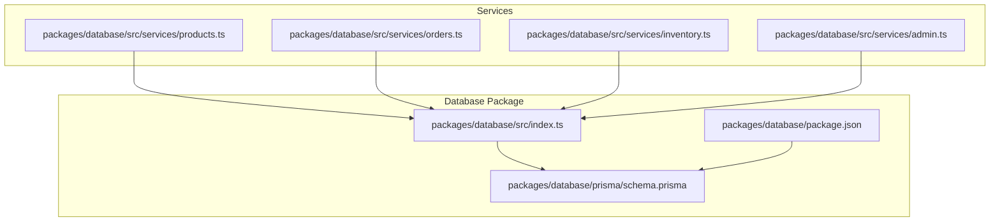
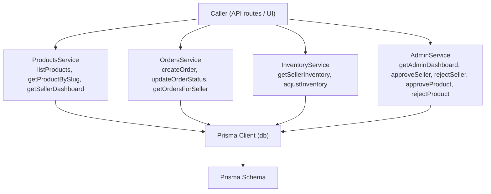
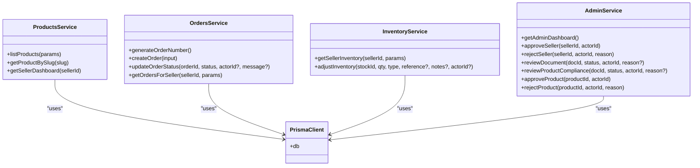
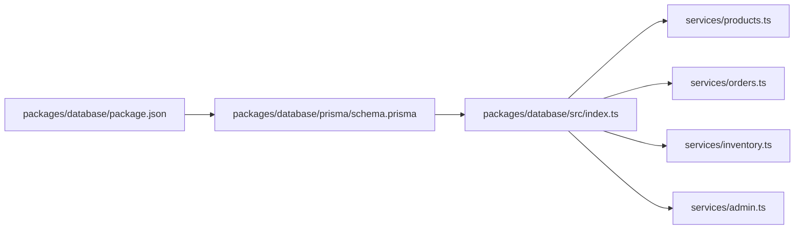
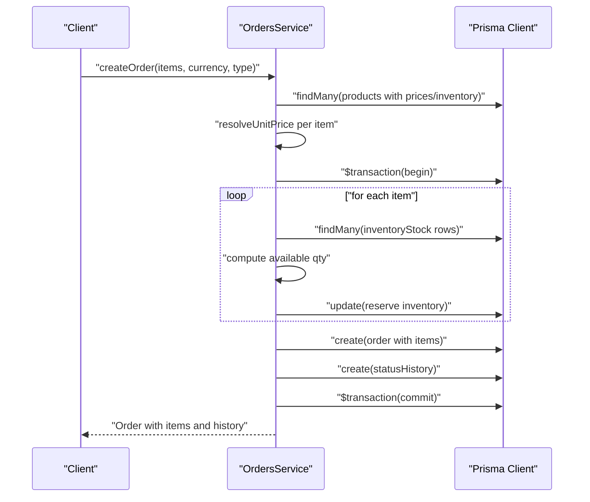
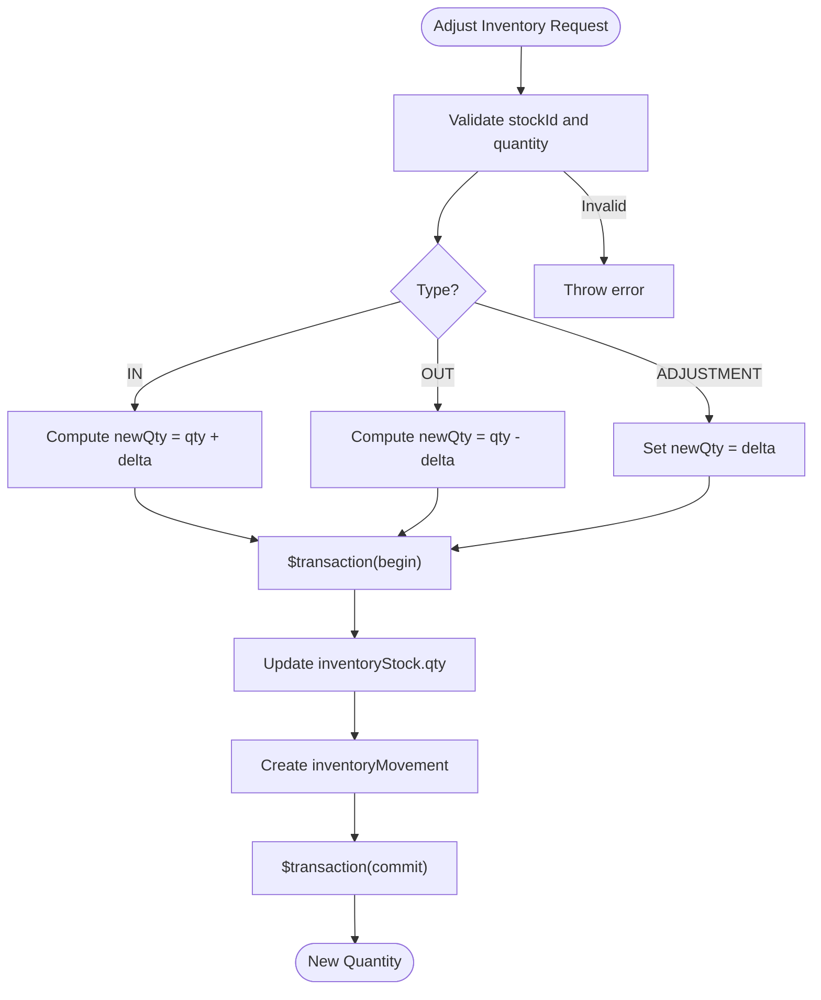
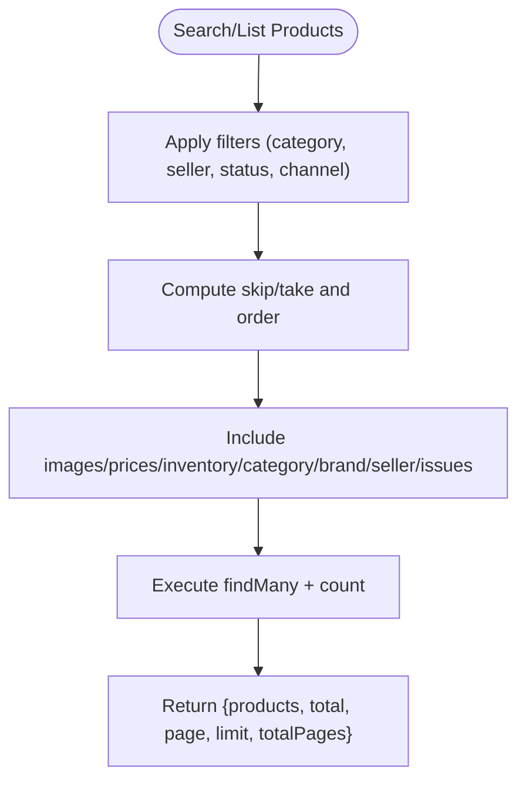

# Service Layer & Business Logic

<cite>
**Referenced Files in This Document**
- [products.ts](file://packages/database/src/services/products.ts)
- [orders.ts](file://packages/database/src/services/orders.ts)
- [inventory.ts](file://packages/database/src/services/inventory.ts)
- [admin.ts](file://packages/database/src/services/admin.ts)
- [index.ts](file://packages/database/src/index.ts)
- [schema.prisma](file://packages/database/prisma/schema.prisma)
- [package.json](file://packages/database/package.json)
- [DATABASE_NOTES.md](file://DATABASE_NOTES.md)
- [PHASE2_IMPLEMENTATION_NOTES.md](file://PHASE2_IMPLEMENTATION_NOTES.md)
</cite>

## Table of Contents
1. [Introduction](#introduction)
2. [Project Structure](#project-structure)
3. [Core Components](#core-components)
4. [Architecture Overview](#architecture-overview)
5. [Detailed Component Analysis](#detailed-component-analysis)
6. [Dependency Analysis](#dependency-analysis)
7. [Performance Considerations](#performance-considerations)
8. [Troubleshooting Guide](#troubleshooting-guide)
9. [Conclusion](#conclusion)
10. [Appendices](#appendices)

## Introduction
This document describes the database service layer architecture used in Avenick Commerce. It focuses on the service abstraction pattern that encapsulates business logic and data access operations, and documents the responsibilities of key services: ProductsService, OrdersService, and InventoryService. It explains how these services enforce business rules, coordinate transactions, maintain data consistency, and transform raw database records into domain-aware outputs. It also covers administrative workflows and the separation of concerns between raw database operations and business logic.

## Project Structure
The service layer is implemented under the database package and exposes typed service functions backed by Prisma. The package integrates with Prisma client generation and provides a central index that exports the database client and shared types.

**Diagram sources**
- [index.ts](file://packages/database/src/index.ts)
- [schema.prisma](file://packages/database/prisma/schema.prisma)
- [package.json](file://packages/database/package.json)
- [products.ts](file://packages/database/src/services/products.ts)
- [orders.ts](file://packages/database/src/services/orders.ts)
- [inventory.ts](file://packages/database/src/services/inventory.ts)
- [admin.ts](file://packages/database/src/services/admin.ts)

**Section sources**
- [index.ts](file://packages/database/src/index.ts)
- [schema.prisma](file://packages/database/prisma/schema.prisma)
- [package.json](file://packages/database/package.json)
- [DATABASE_NOTES.md](file://DATABASE_NOTES.md)
- [PHASE2_IMPLEMENTATION_NOTES.md](file://PHASE2_IMPLEMENTATION_NOTES.md)

## Core Components
This section outlines the primary services and their responsibilities, focusing on how they encapsulate business logic and orchestrate data access.

- ProductsService (products.ts)
  - Catalog listing and search with pagination and filtering
  - Product retrieval by slug with rich includes (images, prices, inventory, variants, reviews)
  - Seller dashboard metrics aggregation (counts, revenue, recent orders)
  - Complexity: Listing and search use filtered queries with includes; dashboard aggregates use multiple counts and raw SQL for low-stock thresholds.

- OrdersService (orders.ts)
  - Order creation with server-side pricing resolution, VAT computation, and inventory reservation
  - Transactional order persistence and status history logging
  - Order status updates with actor attribution
  - Seller-centric order listing with pagination and includes
  - Complexity: Pricing resolution selects best applicable tier; inventory reservation uses greedy allocation across stock rows; transaction ensures atomicity.

- InventoryService (inventory.ts)
  - Inventory listing for a seller with pagination and optional low-stock filter
  - Inventory adjustments (in, out, adjustment) with validation and movement logging
  - Complexity: Adjustments run in a transaction to keep stock and movement logs consistent.

- AdminService (admin.ts)
  - Administrative dashboard metrics (GMV, active sellers, pending reviews)
  - Approve/reject seller and product workflows with audit logging
  - Document review actions for compliance
  - Complexity: Aggregates use groupBy and count; approvals/rejections run in transactions and log audit events.

**Section sources**
- [products.ts](file://packages/database/src/services/products.ts)
- [orders.ts](file://packages/database/src/services/orders.ts)
- [inventory.ts](file://packages/database/src/services/inventory.ts)
- [admin.ts](file://packages/database/src/services/admin.ts)

## Architecture Overview
The service layer follows a clean architecture pattern:
- Services depend on a centralized database client exported from the package index.
- Business logic is encapsulated within service functions, including validation, pricing, tax, and inventory checks.
- Transactions are used to ensure atomicity for operations that modify multiple entities (e.g., order creation, inventory adjustments, admin approvals).
- Data transformations normalize raw database records into domain-friendly shapes (e.g., computed availability flags, aggregated metrics).

**Diagram sources**
- [index.ts](file://packages/database/src/index.ts)
- [schema.prisma](file://packages/database/prisma/schema.prisma)
- [products.ts](file://packages/database/src/services/products.ts)
- [orders.ts](file://packages/database/src/services/orders.ts)
- [inventory.ts](file://packages/database/src/services/inventory.ts)
- [admin.ts](file://packages/database/src/services/admin.ts)

## Detailed Component Analysis

### ProductsService
Responsibilities:
- List products with pagination, search, category/seller filters, and channel enablement flags.
- Retrieve product by slug with rich includes for images, prices, inventory, variants, reviews, and compliance.
- Compute seller dashboard metrics including order counts, pending orders, low stock items, issues, compliance, payouts, active listings, monthly revenue, recent orders, unread messages, and RFQ counts.

Key methods and behaviors:
- listProducts(params): Applies filters, pagination, and includes; returns paginated results with total and page metadata.
- getProductBySlug(slug): Returns a single product with images, active prices, inventory with location and warehouse, category, brand, seller profile, approved compliance docs, variants with active prices, and latest reviews.
- getSellerDashboard(sellerId): Executes multiple aggregations concurrently, including counts, sums, and a raw SQL query to compute low-stock items.

Validation and transformations:
- Filters exclude deleted items and apply case-insensitive search across name and SKU.
- Includes ensure primary images, active prices, and related entities are fetched efficiently.
- Dashboard computes derived flags (low stock/out-of-stock) and aggregates monetary values.

Operational notes:
- Uses Promise.all for efficient parallel reads.
- Uses raw SQL for low-stock threshold evaluation to compare qty and reorderPoint across inventory rows.

**Section sources**
- [products.ts](file://packages/database/src/services/products.ts)

### OrdersService
Responsibilities:
- Create orders with server-side pricing resolution, VAT calculation, and inventory reservation.
- Update order status with actor attribution and status history logging.
- List orders for a seller with pagination and includes.

Key methods and behaviors:
- generateOrderNumber(): Creates a collision-resistant, human-readable order number using time and randomness.
- createOrder(input): Validates non-empty items, resolves unit prices from active tiers, computes totals, and performs inventory reservation within a transaction. Throws explicit errors for missing products, missing pricing tiers, and insufficient stock.
- updateOrderStatus(orderId, status, actorId?, message?): Updates order status and writes a status history record atomically.
- getOrdersForSeller(sellerId, params): Lists orders associated with a seller’s items, with optional status filter and includes.

Business rule enforcement:
- Pricing resolution selects the best applicable tier based on channel, currency, and min/max quantities.
- VAT rates are jurisdiction-specific (KSA vs GCC).
- Inventory reservation prevents overselling by allocating greedily across stock rows and ensuring availability meets demand.

Transactions:
- Order creation and inventory reservation occur in a single transaction.
- Status updates and history logging occur in a separate transaction.

**Section sources**
- [orders.ts](file://packages/database/src/services/orders.ts)

### InventoryService
Responsibilities:
- List inventory for a seller with pagination and optional low-stock filtering.
- Adjust inventory quantities (in, out, adjustment) with validation and movement logging.

Key methods and behaviors:
- getSellerInventory(sellerId, params): Fetches inventory stock with product and location/warehouse details, computes availability and low/out flags, and optionally filters to low-stock items.
- adjustInventory(stockId, qty, type, reference?, notes?, actorId?): Validates stock existence and resulting quantity, then updates stock and logs movement in a transaction.

Business rule enforcement:
- Prevents negative quantities for OUT adjustments.
- Requires exact stock record presence for adjustments.

Transactions:
- Stock update and movement creation occur atomically.

**Section sources**
- [inventory.ts](file://packages/database/src/services/inventory.ts)

### AdminService
Responsibilities:
- Provide administrative dashboard metrics (GMV, active sellers, pending reviews, open RFQs).
- Approve/reject sellers and products with audit logging.
- Review seller documents and product compliance documents.

Key methods and behaviors:
- getAdminDashboard(): Computes GMV for today/month/year, counts active sellers and companies, pending reviews, and recent orders; groups order statuses.
- approveSeller(sellerId, actorId): Activates a seller and logs an audit event.
- rejectSeller(sellerId, actorId, reason): Rejects a seller and logs an audit event with reason.
- approveProduct(productId, actorId): Publishes a product and logs an audit event.
- rejectProduct(productId, actorId, reason): Rejects a product, logs an audit event, and creates a product issue.

Transactions:
- Seller and product approvals/rejections run in transactions and include audit log entries.

**Section sources**
- [admin.ts](file://packages/database/src/services/admin.ts)

### Class Model of Service Functions

**Diagram sources**
- [products.ts](file://packages/database/src/services/products.ts)
- [orders.ts](file://packages/database/src/services/orders.ts)
- [inventory.ts](file://packages/database/src/services/inventory.ts)
- [admin.ts](file://packages/database/src/services/admin.ts)
- [index.ts](file://packages/database/src/index.ts)

## Dependency Analysis
- Centralized database client: All services import the Prisma client from the package index, ensuring consistent configuration and type safety.
- Prisma schema: Entities and relations are defined in the Prisma schema; services rely on these relations for includes and joins.
- Package scripts: The database package defines Prisma commands for generation, seeding, migration, and deployment.

**Diagram sources**
- [package.json](file://packages/database/package.json)
- [schema.prisma](file://packages/database/prisma/schema.prisma)
- [index.ts](file://packages/database/src/index.ts)
- [products.ts](file://packages/database/src/services/products.ts)
- [orders.ts](file://packages/database/src/services/orders.ts)
- [inventory.ts](file://packages/database/src/services/inventory.ts)
- [admin.ts](file://packages/database/src/services/admin.ts)

**Section sources**
- [package.json](file://packages/database/package.json)
- [schema.prisma](file://packages/database/prisma/schema.prisma)
- [index.ts](file://packages/database/src/index.ts)

## Performance Considerations
- Efficient queries with includes: Services fetch only required relations (e.g., primary images, active prices, inventory) to minimize payload size and reduce round-trips.
- Parallelization: Dashboard computations and listing operations use Promise.all to execute independent queries concurrently.
- Pagination: Listing APIs accept page and limit parameters to avoid large result sets.
- Aggregation and grouping: Metrics are computed via database aggregates and groupBy to offload work to the database engine.
- Raw SQL for thresholds: Low-stock computation uses a single raw SQL query to compare columns efficiently.

[No sources needed since this section provides general guidance]

## Troubleshooting Guide
Common issues and resolutions:
- Missing product or pricing tier during order creation: The service throws explicit errors when a product is unavailable or no active price matches the order channel and quantity. Verify product availability and active pricing tiers.
- Insufficient stock during order creation: The service validates total available quantity across inventory rows and throws an error if demand exceeds supply. Check inventoryStock reservations and reorder points.
- Negative inventory adjustment: Adjustments that would drop quantity below zero are rejected. Ensure OUT adjustments do not exceed available quantity.
- Nonexistent stock record: Adjustments require an existing stock record; verify the stockId and product association.
- Transaction failures: Operations that modify multiple entities run in transactions. Failures indicate constraint violations or conflicting concurrent operations; inspect related entities and retry if appropriate.

**Section sources**
- [orders.ts](file://packages/database/src/services/orders.ts)
- [inventory.ts](file://packages/database/src/services/inventory.ts)

## Conclusion
The Avenick Commerce service layer cleanly separates business logic from raw database operations. Services encapsulate pricing, tax, inventory reservation, and audit workflows while leveraging Prisma for type-safe data access. Transactions ensure consistency for critical operations, and rich includes provide domain-ready outputs. Administrative workflows integrate with audit logging and compliance review processes. Together, these patterns deliver a robust, maintainable, and scalable service layer.

[No sources needed since this section summarizes without analyzing specific files]

## Appendices

### Example Workflows

#### Order Fulfillment Workflow

**Diagram sources**
- [orders.ts](file://packages/database/src/services/orders.ts)
- [index.ts](file://packages/database/src/index.ts)

#### Inventory Management Process

**Diagram sources**
- [inventory.ts](file://packages/database/src/services/inventory.ts)
- [index.ts](file://packages/database/src/index.ts)

#### Product Catalog Operations

**Diagram sources**
- [products.ts](file://packages/database/src/services/products.ts)
- [index.ts](file://packages/database/src/index.ts)