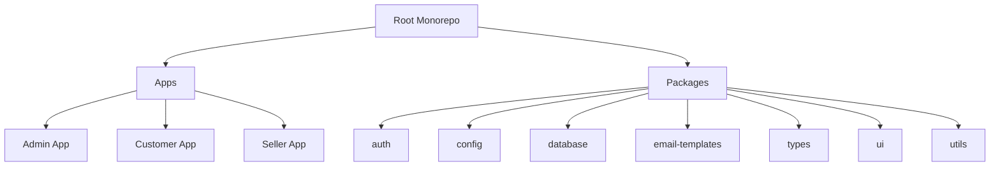
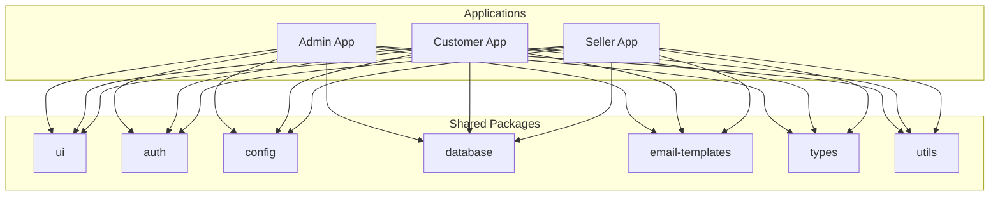
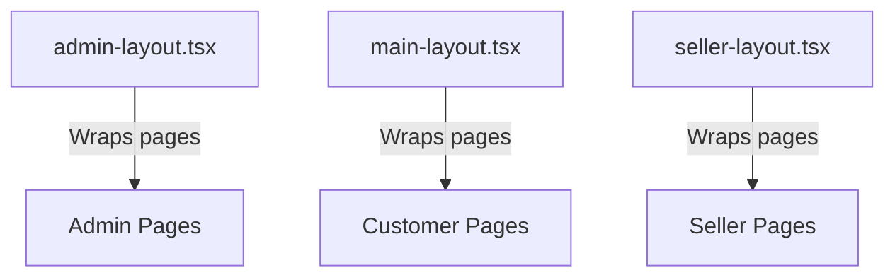
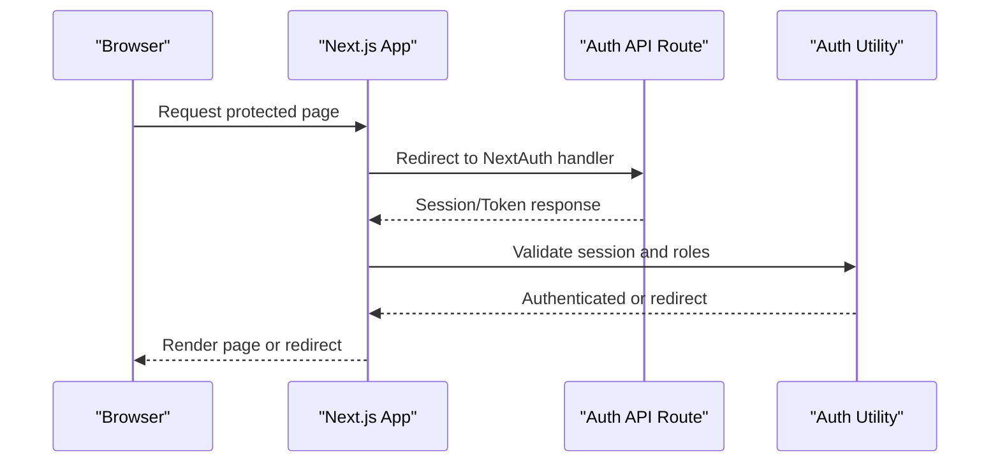
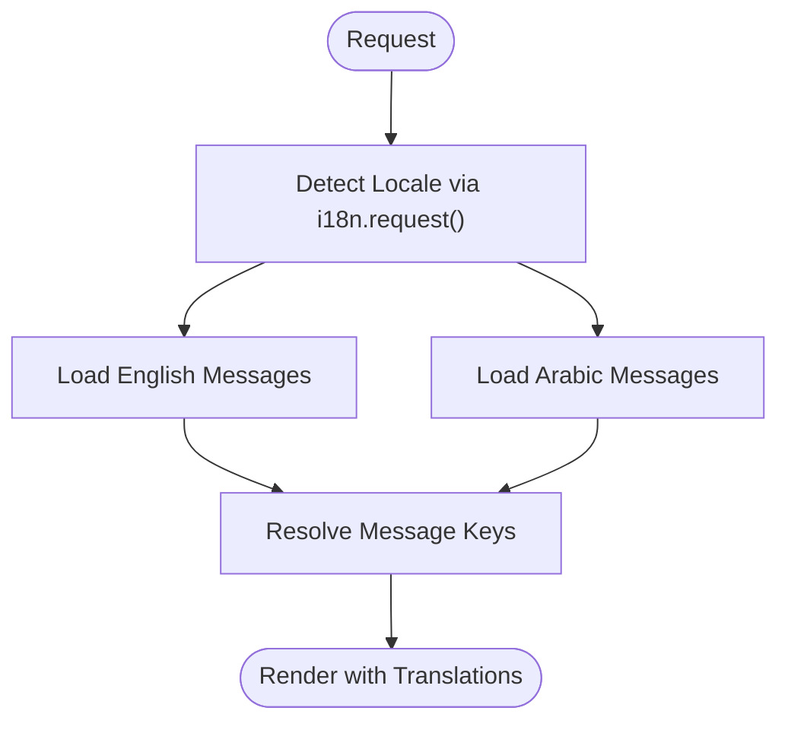
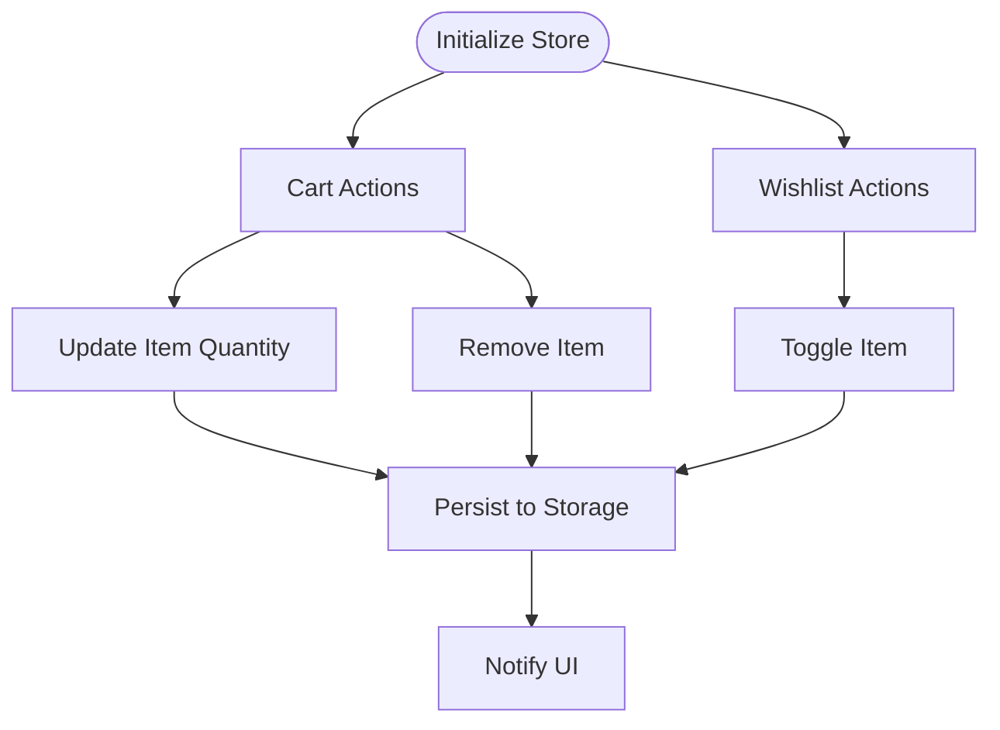
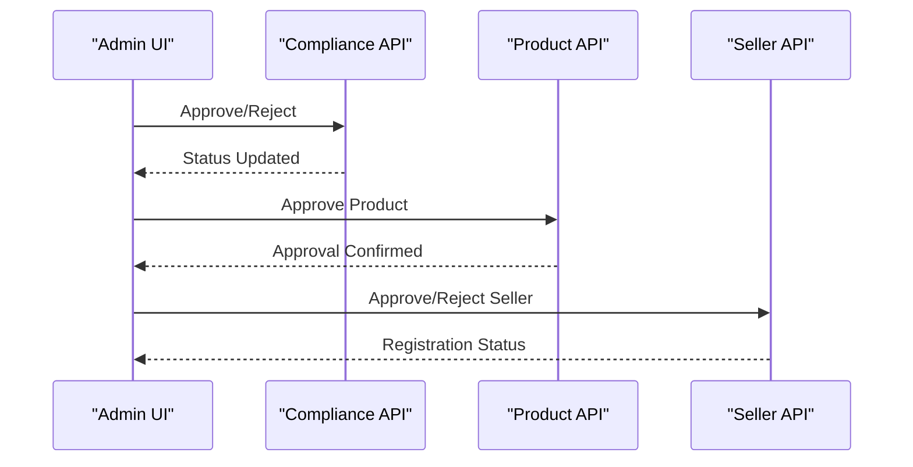
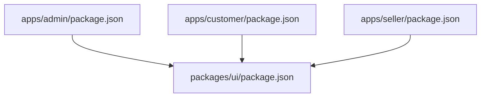

# Development Guidelines

<cite>
**Referenced Files in This Document**
- [README.md](file://README.md)
- [.prettierrc](file://.prettierrc)
- [pnpm-workspace.yaml](file://pnpm-workspace.yaml)
- [turbo.json](file://turbo.json)
- [apps/admin/.eslintrc.json](file://apps/admin/.eslintrc.json)
- [apps/customer/.eslintrc.json](file://apps/customer/.eslintrc.json)
- [apps/seller/.eslintrc.json](file://apps/seller/.eslintrc.json)
- [apps/admin/tsconfig.json](file://apps/admin/tsconfig.json)
- [apps/customer/tsconfig.json](file://apps/customer/tsconfig.json)
- [apps/seller/tsconfig.json](file://apps/seller/tsconfig.json)
- [apps/admin/package.json](file://apps/admin/package.json)
- [apps/customer/package.json](file://apps/customer/package.json)
- [apps/seller/package.json](file://apps/seller/package.json)
- [packages/ui/package.json](file://packages/ui/package.json)
- [DESIGN_SYSTEM_NOTES.md](file://DESIGN_SYSTEM_NOTES.md)
- [UI_UX_REVAMP_NOTES.md](file://UI_UX_REVAMP_NOTES.md)
- [MODULE_01_B2C_MARKETPLACE_NOTES.md](file://MODULE_01_B2C_MARKETPLACE_NOTES.md)
- [MODULE_02_B2B_TRADE_NOTES.md](file://MODULE_02_B2B_TRADE_NOTES.md)
- [MODULE_03_SUPPLIER_SELLER_NOTES.md](file://MODULE_03_SUPPLIER_SELLER_NOTES.md)
- [MODULE_04_ORDERS_FULFILLMENT_NOTES.md](file://MODULE_04_ORDERS_FULFILLMENT_NOTES.md)
- [MODULE_05_WAREHOUSE_3PL_NOTES.md](file://MODULE_05_WAREHOUSE_3PL_NOTES.md)
- [MODULE_06_CRM_GROWTH_NOTES.md](file://MODULE_06_CRM_GROWTH_NOTES.md)
- [MODULE_07_FINANCE_NOTES.md](file://MODULE_07_FINANCE_NOTES.md)
- [MODULE_08_SUPPORT_DISPUTES_NOTES.md](file://MODULE_08_SUPPORT_DISPUTES_NOTES.md)
- [MODULE_09_ADMIN_SETTINGS_NOTES.md](file://MODULE_09_ADMIN_SETTINGS_NOTES.md)
- [MODULE_10_PRICING_COMMISSION_NOTES.md](file://MODULE_10_PRICING_COMMISSION_NOTES.md)
- [MODULE_11_AI_AUTOMATION_INTEGRATIONS_NOTES.md](file://MODULE_11_AI_AUTOMATION_INTEGRATIONS_NOTES.md)
- [PHASE2_IMPLEMENTATION_NOTES.md](file://PHASE2_IMPLEMENTATION_NOTES.md)
- [PHASE3_IMPLEMENTATION_NOTES.md](file://PHASE3_IMPLEMENTATION_NOTES.md)
- [apps/admin/src/app/layout.tsx](file://apps/admin/src/app/layout.tsx)
- [apps/customer/src/app/layout.tsx](file://apps/customer/src/app/layout.tsx)
- [apps/seller/src/app/layout.tsx](file://apps/seller/src/app/layout.tsx)
- [apps/admin/src/middleware.ts](file://apps/admin/src/middleware.ts)
- [apps/customer/src/middleware.ts](file://apps/customer/src/middleware.ts)
- [apps/seller/src/middleware.ts](file://apps/seller/src/middleware.ts)
- [apps/admin/src/lib/auth.ts](file://apps/admin/src/lib/auth.ts)
- [apps/customer/src/lib/b2b.ts](file://apps/customer/src/lib/b2b.ts)
- [apps/seller/src/lib/auth.ts](file://apps/seller/src/lib/auth.ts)
- [apps/admin/src/components/layout/admin-layout.tsx](file://apps/admin/src/components/layout/admin-layout.tsx)
- [apps/customer/src/components/layout/main-layout.tsx](file://apps/customer/src/components/layout/main-layout.tsx)
- [apps/seller/src/components/layout/seller-layout.tsx](file://apps/seller/src/components/layout/seller-layout.tsx)
- [apps/admin/src/i18n/request.ts](file://apps/admin/src/i18n/request.ts)
- [apps/customer/src/i18n/request.ts](file://apps/customer/src/i18n/request.ts)
- [apps/seller/src/i18n/request.ts](file://apps/seller/src/i18n/request.ts)
- [apps/admin/messages/en.json](file://apps/admin/messages/en.json)
- [apps/customer/messages/en.json](file://apps/customer/messages/en.json)
- [apps/seller/messages/en.json](file://apps/seller/messages/en.json)
- [apps/admin/messages/ar.json](file://apps/admin/messages/ar.json)
- [apps/customer/messages/ar.json](file://apps/customer/messages/ar.json)
- [apps/seller/messages/ar.json](file://apps/seller/messages/ar.json)
- [apps/admin/src/stores/cart.ts](file://apps/admin/src/stores/cart.ts)
- [apps/customer/src/stores/cart.ts](file://apps/customer/src/stores/cart.ts)
- [apps/seller/src/stores/cart.ts](file://apps/seller/src/stores/cart.ts)
- [apps/admin/src/stores/wishlist.ts](file://apps/admin/src/stores/wishlist.ts)
- [apps/customer/src/stores/wishlist.ts](file://apps/customer/src/stores/wishlist.ts)
- [apps/seller/src/stores/wishlist.ts](file://apps/seller/src/stores/wishlist.ts)
- [apps/admin/src/app/dashboard/page.tsx](file://apps/admin/src/app/dashboard/page.tsx)
- [apps/customer/src/app/products/[slug]/page.tsx](file://apps/customer/src/app/products/[slug]/page.tsx)
- [apps/seller/src/app/products/page.tsx](file://apps/seller/src/app/products/page.tsx)
- [apps/admin/src/app/api/admin/compliance[id]/approve/route.ts](file://apps/admin/src/app/api/admin/compliance[id]/approve/route.ts)
- [apps/admin/src/app/api/admin/products[id]/approve/route.ts](file://apps/admin/src/app/api/admin/products[id]/approve/route.ts)
- [apps/admin/src/app/api/admin/sellers/[id]/approve/route.ts](file://apps/admin/src/app/api/admin/sellers/[id]/approve/route.ts)
- [apps/admin/src/app/api/admin/sellers/[id]/reject/route.ts](file://apps/admin/src/app/api/admin/sellers/[id]/reject/route.ts)
- [apps/admin/src/app/api/admin/sellers/[id]/route.ts](file://apps/admin/src/app/api/admin/sellers/[id]/route.ts)
- [apps/admin/src/app/api/admin/sellers/route.ts](file://apps/admin/src/app/api/admin/sellers/route.ts)
- [apps/admin/src/app/api/admin/dashboard/route.ts](file://apps/admin/src/app/api/admin/dashboard/route.ts)
- [apps/admin/src/app/api/auth[[...nextauth]]/route.ts](file://apps/admin/src/app/api/auth[[...nextauth]]/route.ts)
- [apps/customer/src/app/api/auth[[...nextauth]]/route.ts](file://apps/customer/src/app/api/auth[[...nextauth]]/route.ts)
- [apps/seller/src/app/api/auth[[...nextauth]]/route.ts](file://apps/seller/src/app/api/auth[[...nextauth]]/route.ts)
- [apps/customer/src/app/api/register/business/route.ts](file://apps/customer/src/app/api/register/business/route.ts)
- [apps/customer/src/app/api/register/consumer/route.ts](file://apps/customer/src/app/api/register/consumer/route.ts)
- [apps/customer/src/app/api/orders/route.ts](file://apps/customer/src/app/api/orders/route.ts)
- [apps/customer/src/app/api/payments/webhook/route.ts](file://apps/customer/src/app/api/payments/webhook/route.ts)
- [apps/customer/src/app/api/categories/route.ts](file://apps/customer/src/app/api/categories/route.ts)
- [apps/customer/src/app/api/products/[slug]/route.ts](file://apps/customer/src/app/api/products/[slug]/route.ts)
- [apps/seller/src/app/api/ai/draft/route.ts](file://apps/seller/src/app/api/ai/draft/route.ts)
- [apps/seller/src/app/api/notifications/route.ts](file://apps/seller/src/app/api/notifications/route.ts)
- [apps/seller/src/app/api/seller/dashboard/route.ts](file://apps/seller/src/app/api/seller/dashboard/route.ts)
- [apps/seller/src/app/api/seller/orders/route.ts](file://apps/seller/src/app/api/seller/orders/route.ts)
- [apps/admin/src/app/warehouse/inbound/page.tsx](file://apps/admin/src/app/warehouse/inbound/page.tsx)
- [apps/admin/src/app/warehouse/pickpack/page.tsx](file://apps/admin/src/app/warehouse/pickpack/page.tsx)
- [apps/admin/src/app/warehouse/stock/page.tsx](file://apps/admin/src/app/warehouse/stock/page.tsx)
- [apps/admin/src/app/finance/page.tsx](file://apps/admin/src/app/finance/page.tsx)
- [apps/admin/src/app/settlements/page.tsx](file://apps/admin/src/app/settlements/page.tsx)
- [apps/admin/src/app/returns/page.tsx](file://apps/admin/src/app/returns/page.tsx)
- [apps/admin/src/app/disputes/page.tsx](file://apps/admin/src/app/disputes/page.tsx)
- [apps/admin/src/app/support/[id]/page.tsx](file://apps/admin/src/app/support/[id]/page.tsx)
- [apps/admin/src/app/support/actions.ts](file://apps/admin/src/app/support/actions.ts)
- [apps/admin/src/app/settings/page.tsx](file://apps/admin/src/app/settings/page.tsx)
- [apps/admin/src/app/compliance/page.tsx](file://apps/admin/src/app/compliance/page.tsx)
- [apps/admin/src/app/crm/page.tsx](file://apps/admin/src/app/crm/page.tsx)
- [apps/admin/src/app/deals/page.tsx](file://apps/admin/src/app/deals/page.tsx)
- [apps/admin/src/app/pricing/page.tsx](file://apps/admin/src/app/pricing/page.tsx)
- [apps/admin/src/app/segments/page.tsx](file://apps/admin/src/app/segments/page.tsx)
- [apps/admin/src/app/vat/page.tsx](file://apps/admin/src/app/vat/page.tsx)
- [apps/admin/src/app/automation/page.tsx](file://apps/admin/src/app/automation/page.tsx)
- [apps/admin/src/app/performance/page.tsx](file://apps/admin/src/app/performance/page.tsx)
- [apps/admin/src/app/audit/page.tsx](file://apps/admin/src/app/audit/page.tsx)
- [apps/admin/src/app/integrations/page.tsx](file://apps/admin/src/app/integrations/page.tsx)
- [apps/admin/src/app/users/page.tsx](file://apps/admin/src/app/users/page.tsx)
- [apps/admin/src/app/brands/page.tsx](file://apps/admin/src/app/brands/page.tsx)
- [apps/admin/src/app/categories/page.tsx](file://apps/admin/src/app/categories/page.tsx)
- [apps/admin/src/app/companies/page.tsx](file://apps/admin/src/app/companies/page.tsx)
- [apps/admin/src/app/departments/page.tsx](file://apps/admin/src/app/departments/page.tsx)
- [apps/admin/src/app/retention/page.tsx](file://apps/admin/src/app/retention/page.tsx)
- [apps/admin/src/app/sla/page.tsx](file://apps/admin/src/app/sla/page.tsx)
- [apps/admin/src/app/shipments/page.tsx](file://apps/admin/src/app/shipments/page.tsx)
- [apps/admin/src/app/ai-insights/page.tsx](file://apps/admin/src/app/ai-insights/page.tsx)
- [apps/customer/src/app/b2b/page.tsx](file://apps/customer/src/app/b2b/page.tsx)
- [apps/customer/src/app/b2b/addresses/page.tsx](file://apps/customer/src/app/b2b/addresses/page.tsx)
- [apps/customer/src/app/b2b/addresses/actions.ts](file://apps/customer/src/app/b2b/addresses/actions.ts)
- [apps/customer/src/app/b2b/analytics/page.tsx](file://apps/customer/src/app/b2b/analytics/page.tsx)
- [apps/customer/src/app/b2b/approval-policies/page.tsx](file://apps/customer/src/app/b2b/approval-policies/page.tsx)
- [apps/customer/src/app/b2b/approval-policies/actions.ts](file://apps/customer/src/app/b2b/approval-policies/actions.ts)
- [apps/customer/src/app/b2b/approvals/page.tsx](file://apps/customer/src/app/b2b/approvals/page.tsx)
- [apps/customer/src/app/b2b/billing/page.tsx](file://apps/customer/src/app/b2b/billing/page.tsx)
- [apps/customer/src/app/b2b/company/page.tsx](file://apps/customer/src/app/b2b/company/page.tsx)
- [apps/customer/src/app/b2b/lists/page.tsx](file://apps/customer/src/app/b2b/lists/page.tsx)
- [apps/customer/src/app/b2b/lists/actions.ts](file://apps/customer/src/app/b2b/lists/actions.ts)
- [apps/customer/src/app/b2b/purchase-orders/page.tsx](file://apps/customer/src/app/b2b/purchase-orders/page.tsx)
- [apps/customer/src/app/b2b/purchase-orders/actions.ts](file://apps/customer/src/app/b2b/purchase-orders/actions.ts)
- [apps/customer/src/app/b2b/quotes/page.tsx](file://apps/customer/src/app/b2b/quotes/page.tsx)
- [apps/customer/src/app/b2b/register/page.tsx](file://apps/customer/src/app/b2b/register/page.tsx)
- [apps/customer/src/app/b2b/rfq/new/page.tsx](file://apps/customer/src/app/b2b/rfq/new/page.tsx)
- [apps/customer/src/app/b2b/rfq/[id]/page.tsx](file://apps/customer/src/app/b2b/rfq/[id]/page.tsx)
- [apps/customer/src/app/b2b/team/page.tsx](file://apps/customer/src/app/b2b/team/page.tsx)
- [apps/customer/src/app/b2b/team/actions.ts](file://apps/customer/src/app/b2b/team/actions.ts)
- [apps/customer/src/app/cart/page.tsx](file://apps/customer/src/app/cart/page.tsx)
- [apps/customer/src/app/checkout/page.tsx](file://apps/customer/src/app/checkout/page.tsx)
- [apps/customer/src/app/deals/page.tsx](file://apps/customer/src/app/deals/page.tsx)
- [apps/customer/src/app/login/page.tsx](file://apps/customer/src/app/login/page.tsx)
- [apps/customer/src/app/orders/[id]/page.tsx](file://apps/customer/src/app/orders/[id]/page.tsx)
- [apps/customer/src/app/products/page.tsx](file://apps/customer/src/app/products/page.tsx)
- [apps/customer/src/app/search/page.tsx](file://apps/customer/src/app/search/page.tsx)
- [apps/customer/src/app/support/page.tsx](file://apps/customer/src/app/support/page.tsx)
- [apps/customer/src/app/support/actions.ts](file://apps/customer/src/app/support/actions.ts)
- [apps/customer/src/app/wishlist/page.tsx](file://apps/customer/src/app/wishlist/page.tsx)
- [apps/seller/src/app/analytics/page.tsx](file://apps/seller/src/app/analytics/page.tsx)
- [apps/seller/src/app/commission/page.tsx](file://apps/seller/src/app/commission/page.tsx)
- [apps/seller/src/app/compliance/page.tsx](file://apps/seller/src/app/compliance/page.tsx)
- [apps/seller/src/app/dashboard/page.tsx](file://apps/seller/src/app/dashboard/page.tsx)
- [apps/seller/src/app/documents/page.tsx](file://apps/seller/src/app/documents/page.tsx)
- [apps/seller/src/app/inventory/page.tsx](file://apps/seller/src/app/inventory/page.tsx)
- [apps/seller/src/app/invoices/page.tsx](file://apps/seller/src/app/invoices/page.tsx)
- [apps/seller/src/app/issues/page.tsx](file://apps/seller/src/app/issues/page.tsx)
- [apps/seller/src/app/login/page.tsx](file://apps/seller/src/app/login/page.tsx)
- [apps/seller/src/app/messages/page.tsx](file://apps/seller/src/app/messages/page.tsx)
- [apps/seller/src/app/onboarding/page.tsx](file://apps/seller/src/app/onboarding/page.tsx)
- [apps/seller/src/app/orders/page.tsx](file://apps/seller/src/app/orders/page.tsx)
- [apps/seller/src/app/orders/actions.ts](file://apps/seller/src/app/orders/actions.ts)
- [apps/seller/src/app/payouts/page.tsx](file://apps/seller/src/app/payouts/page.tsx)
- [apps/seller/src/app/performance/page.tsx](file://apps/seller/src/app/performance/page.tsx)
- [apps/seller/src/app/products/page.tsx](file://apps/seller/src/app/products/page.tsx)
- [apps/seller/src/app/products/actions.ts](file://apps/seller/src/app/products/actions.ts)
- [apps/seller/src/app/quotes/page.tsx](file://apps/seller/src/app/quotes/page.tsx)
- [apps/seller/src/app/quotes/submit/page.tsx](file://apps/seller/src/app/quotes/submit/page.tsx)
- [apps/seller/src/app/returns/page.tsx](file://apps/seller/src/app/returns/page.tsx)
- [apps/seller/src/app/returns/actions.ts](file://apps/seller/src/app/returns/actions.ts)
- [apps/seller/src/app/saved-views/page.tsx](file://apps/seller/src/app/saved-views/page.tsx)
- [apps/seller/src/app/saved-views/actions.ts](file://apps/seller/src/app/saved-views/actions.ts)
- [apps/seller/src/app/shipments/page.tsx](file://apps/seller/src/app/shipments/page.tsx)
- [apps/seller/src/app/shipments/actions.ts](file://apps/seller/src/app/shipments/actions.ts)
</cite>

## Table of Contents
1. [Introduction](#introduction)
2. [Project Structure](#project-structure)
3. [Core Components](#core-components)
4. [Architecture Overview](#architecture-overview)
5. [Detailed Component Analysis](#detailed-component-analysis)
6. [Dependency Analysis](#dependency-analysis)
7. [Performance Considerations](#performance-considerations)
8. [Troubleshooting Guide](#troubleshooting-guide)
9. [Conclusion](#conclusion)
10. [Appendices](#appendices)

## Introduction
This document defines development guidelines for the Avenick Commerce platform. It consolidates code standards, linting and formatting configurations, TypeScript best practices, contribution workflows, code review expectations, and design system conventions across the monorepo. It also provides practical examples for implementing new features, extending existing functionality, debugging strategies, performance optimization techniques, and recommended development tooling.

## Project Structure
Avenick Commerce is a monorepo organized with a root workspace and multiple applications and shared packages:
- Applications:
  - Admin portal for administrative tasks and oversight
  - Customer portal for B2C/B2B shopping experiences
  - Seller portal for supplier operations
- Shared packages:
  - Authentication, configuration, database utilities, email templates, UI components, types, and general utilities
- Tooling:
  - Workspace managed via pnpm workspaces
  - Build and task orchestration via Turborepo
  - Formatting via Prettier
  - Linting via ESLint per app
  - Type checking via TypeScript configuration per app

**Diagram sources**
- [pnpm-workspace.yaml](file://pnpm-workspace.yaml)
- [turbo.json](file://turbo.json)

**Section sources**
- [pnpm-workspace.yaml](file://pnpm-workspace.yaml)
- [turbo.json](file://turbo.json)

## Core Components
This section outlines the foundational development standards and tooling across the monorepo.

- Code Standards and Style
  - Formatting: Prettier is configured at the repository root. All contributors must format code prior to committing.
  - Linting: Each app maintains its own ESLint configuration. Lint checks are part of CI and local pre-commit hooks.
  - TypeScript: Strict type checking is enforced per app’s tsconfig. Prefer explicit types, narrow unions, and exhaustive checks.

- Contribution Workflow
  - Branching: Feature branches from develop or main as defined by your team’s branching model.
  - Commit hygiene: Use conventional commit messages and keep commits focused.
  - Pull Requests: Open PRs with clear descriptions, links to related issues, and screenshots for UI changes.
  - Code Review: Expect feedback on correctness, maintainability, performance, accessibility, and adherence to design system.

- Development Conventions
  - File naming: kebab-case for routes and pages; PascalCase for React components; snake_case for stores and utilities.
  - Component composition: Favor small, single-responsibility components and reusable UI primitives from the shared UI package.
  - State management: Keep global state minimal; use local component state or app-specific stores sparingly.
  - Internationalization: Use the existing i18n request utilities and message files per app.
  - Middleware: Centralize auth and role-based routing via middleware.ts per app.
  - API routes: Place Next.js App Router API routes under app/api with clear hierarchy mirroring feature areas.

- UI Consistency and Design System
  - Use shared UI components from the ui package for buttons, inputs, modals, tables, and layouts.
  - Follow the documented design system guidelines and UI/UX revamp notes for spacing, typography, color tokens, and interaction patterns.
  - Respect RTL support by leveraging the existing Arabic message files and ensuring directional styles are handled properly.

- Testing and Quality Gates
  - Run lint and type checks locally before pushing.
  - Ensure all tests pass and coverage remains stable after changes.
  - For UI changes, validate against design specs and accessibility requirements.

**Section sources**
- [.prettierrc](file://.prettierrc)
- [apps/admin/.eslintrc.json](file://apps/admin/.eslintrc.json)
- [apps/customer/.eslintrc.json](file://apps/customer/.eslintrc.json)
- [apps/seller/.eslintrc.json](file://apps/seller/.eslintrc.json)
- [apps/admin/tsconfig.json](file://apps/admin/tsconfig.json)
- [apps/customer/tsconfig.json](file://apps/customer/tsconfig.json)
- [apps/seller/tsconfig.json](file://apps/seller/tsconfig.json)
- [DESIGN_SYSTEM_NOTES.md](file://DESIGN_SYSTEM_NOTES.md)
- [UI_UX_REVAMP_NOTES.md](file://UI_UX_REVAMP_NOTES.md)

## Architecture Overview
The platform follows a modular, app-centric architecture with shared packages for cross-cutting concerns. Each app encapsulates its domain features, while the UI package centralizes reusable components and design tokens.

**Diagram sources**
- [pnpm-workspace.yaml](file://pnpm-workspace.yaml)
- [packages/ui/package.json](file://packages/ui/package.json)

## Detailed Component Analysis

### Layout and Navigation
Each app defines a top-level layout and a set of reusable layout shells to ensure consistent navigation and branding.

**Diagram sources**
- [apps/admin/src/components/layout/admin-layout.tsx](file://apps/admin/src/components/layout/admin-layout.tsx)
- [apps/customer/src/components/layout/main-layout.tsx](file://apps/customer/src/components/layout/main-layout.tsx)
- [apps/seller/src/components/layout/seller-layout.tsx](file://apps/seller/src/components/layout/seller-layout.tsx)

**Section sources**
- [apps/admin/src/app/layout.tsx](file://apps/admin/src/app/layout.tsx)
- [apps/customer/src/app/layout.tsx](file://apps/customer/src/app/layout.tsx)
- [apps/seller/src/app/layout.tsx](file://apps/seller/src/app/layout.tsx)
- [apps/admin/src/components/layout/admin-layout.tsx](file://apps/admin/src/components/layout/admin-layout.tsx)
- [apps/customer/src/components/layout/main-layout.tsx](file://apps/customer/src/components/layout/main-layout.tsx)
- [apps/seller/src/components/layout/seller-layout.tsx](file://apps/seller/src/components/layout/seller-layout.tsx)

### Authentication and Middleware
Authentication is centralized via NextAuth integration and enforced through middleware per app. The auth utilities provide typed wrappers and guards.

**Diagram sources**
- [apps/admin/src/middleware.ts](file://apps/admin/src/middleware.ts)
- [apps/customer/src/middleware.ts](file://apps/customer/src/middleware.ts)
- [apps/seller/src/middleware.ts](file://apps/seller/src/middleware.ts)
- [apps/admin/src/lib/auth.ts](file://apps/admin/src/lib/auth.ts)
- [apps/customer/src/lib/b2b.ts](file://apps/customer/src/lib/b2b.ts)
- [apps/seller/src/lib/auth.ts](file://apps/seller/src/lib/auth.ts)
- [apps/admin/src/app/api/auth[[...nextauth]]/route.ts](file://apps/admin/src/app/api/auth[[...nextauth]]/route.ts)
- [apps/customer/src/app/api/auth[[...nextauth]]/route.ts](file://apps/customer/src/app/api/auth[[...nextauth]]/route.ts)
- [apps/seller/src/app/api/auth[[...nextauth]]/route.ts](file://apps/seller/src/app/api/auth[[...nextauth]]/route.ts)

**Section sources**
- [apps/admin/src/middleware.ts](file://apps/admin/src/middleware.ts)
- [apps/customer/src/middleware.ts](file://apps/customer/src/middleware.ts)
- [apps/seller/src/middleware.ts](file://apps/seller/src/middleware.ts)
- [apps/admin/src/lib/auth.ts](file://apps/admin/src/lib/auth.ts)
- [apps/customer/src/lib/b2b.ts](file://apps/customer/src/lib/b2b.ts)
- [apps/seller/src/lib/auth.ts](file://apps/seller/src/lib/auth.ts)

### Internationalization (i18n)
Each app supports English and Arabic locales with dedicated message files and an i18n request utility to resolve locale-aware content.

**Diagram sources**
- [apps/admin/src/i18n/request.ts](file://apps/admin/src/i18n/request.ts)
- [apps/customer/src/i18n/request.ts](file://apps/customer/src/i18n/request.ts)
- [apps/seller/src/i18n/request.ts](file://apps/seller/src/i18n/request.ts)
- [apps/admin/messages/en.json](file://apps/admin/messages/en.json)
- [apps/customer/messages/en.json](file://apps/customer/messages/en.json)
- [apps/seller/messages/en.json](file://apps/seller/messages/en.json)
- [apps/admin/messages/ar.json](file://apps/admin/messages/ar.json)
- [apps/customer/messages/ar.json](file://apps/customer/messages/ar.json)
- [apps/seller/messages/ar.json](file://apps/seller/messages/ar.json)

**Section sources**
- [apps/admin/src/i18n/request.ts](file://apps/admin/src/i18n/request.ts)
- [apps/customer/src/i18n/request.ts](file://apps/customer/src/i18n/request.ts)
- [apps/seller/src/i18n/request.ts](file://apps/seller/src/i18n/request.ts)

### Store Management (Cart and Wishlist)
State is managed via lightweight stores per app for cart and wishlist, enabling predictable updates and reactivity.

**Diagram sources**
- [apps/admin/src/stores/cart.ts](file://apps/admin/src/stores/cart.ts)
- [apps/customer/src/stores/cart.ts](file://apps/customer/src/stores/cart.ts)
- [apps/seller/src/stores/cart.ts](file://apps/seller/src/stores/cart.ts)
- [apps/admin/src/stores/wishlist.ts](file://apps/admin/src/stores/wishlist.ts)
- [apps/customer/src/stores/wishlist.ts](file://apps/customer/src/stores/wishlist.ts)
- [apps/seller/src/stores/wishlist.ts](file://apps/seller/src/stores/wishlist.ts)

**Section sources**
- [apps/admin/src/stores/cart.ts](file://apps/admin/src/stores/cart.ts)
- [apps/customer/src/stores/cart.ts](file://apps/customer/src/stores/cart.ts)
- [apps/seller/src/stores/cart.ts](file://apps/seller/src/stores/cart.ts)
- [apps/admin/src/stores/wishlist.ts](file://apps/admin/src/stores/wishlist.ts)
- [apps/customer/src/stores/wishlist.ts](file://apps/customer/src/stores/wishlist.ts)
- [apps/seller/src/stores/wishlist.ts](file://apps/seller/src/stores/wishlist.ts)

### API Routes and Domain Areas
API routes are grouped by domain area and mapped to feature pages. Administrative compliance, product moderation, and seller onboarding are examples of API-driven workflows.

**Diagram sources**
- [apps/admin/src/app/api/admin/compliance[id]/approve/route.ts](file://apps/admin/src/app/api/admin/compliance[id]/approve/route.ts)
- [apps/admin/src/app/api/admin/products[id]/approve/route.ts](file://apps/admin/src/app/api/admin/products[id]/approve/route.ts)
- [apps/admin/src/app/api/admin/sellers/[id]/approve/route.ts](file://apps/admin/src/app/api/admin/sellers/[id]/approve/route.ts)
- [apps/admin/src/app/api/admin/sellers/[id]/reject/route.ts](file://apps/admin/src/app/api/admin/sellers/[id]/reject/route.ts)
- [apps/admin/src/app/api/admin/sellers/[id]/route.ts](file://apps/admin/src/app/api/admin/sellers/[id]/route.ts)
- [apps/admin/src/app/api/admin/sellers/route.ts](file://apps/admin/src/app/api/admin/sellers/route.ts)
- [apps/admin/src/app/api/admin/dashboard/route.ts](file://apps/admin/src/app/api/admin/dashboard/route.ts)

**Section sources**
- [apps/admin/src/app/api/admin/compliance[id]/approve/route.ts](file://apps/admin/src/app/api/admin/compliance[id]/approve/route.ts)
- [apps/admin/src/app/api/admin/products[id]/approve/route.ts](file://apps/admin/src/app/api/admin/products[id]/approve/route.ts)
- [apps/admin/src/app/api/admin/sellers/[id]/approve/route.ts](file://apps/admin/src/app/api/admin/sellers/[id]/approve/route.ts)
- [apps/admin/src/app/api/admin/sellers/[id]/reject/route.ts](file://apps/admin/src/app/api/admin/sellers/[id]/reject/route.ts)
- [apps/admin/src/app/api/admin/sellers/[id]/route.ts](file://apps/admin/src/app/api/admin/sellers/[id]/route.ts)
- [apps/admin/src/app/api/admin/sellers/route.ts](file://apps/admin/src/app/api/admin/sellers/route.ts)
- [apps/admin/src/app/api/admin/dashboard/route.ts](file://apps/admin/src/app/api/admin/dashboard/route.ts)

### Feature Examples and Implementation Patterns

- Implementing a New Feature Page
  - Create a new page under the appropriate app’s app directory with a descriptive kebab-case path.
  - Wrap the page with the app’s layout shell for consistent navigation and branding.
  - Add localized messages if the feature is internationalized.
  - Example paths:
    - [apps/customer/src/app/products/page.tsx](file://apps/customer/src/app/products/page.tsx)
    - [apps/seller/src/app/products/page.tsx](file://apps/seller/src/app/products/page.tsx)

- Extending Existing Functionality
  - For UI enhancements, reuse shared components from the ui package and adhere to design system tokens.
  - For state changes, update the relevant store and ensure side effects are handled consistently.
  - Example paths:
    - [apps/customer/src/app/b2b/addresses/actions.ts](file://apps/customer/src/app/b2b/addresses/actions.ts)
    - [apps/seller/src/app/products/actions.ts](file://apps/seller/src/app/products/actions.ts)

- Adding a New API Endpoint
  - Place the route under app/api with a clear hierarchy reflecting the feature area.
  - Use consistent request/response patterns and error handling.
  - Example paths:
    - [apps/customer/src/app/api/register/business/route.ts](file://apps/customer/src/app/api/register/business/route.ts)
    - [apps/customer/src/app/api/register/consumer/route.ts](file://apps/customer/src/app/api/register/consumer/route.ts)
    - [apps/seller/src/app/api/ai/draft/route.ts](file://apps/seller/src/app/api/ai/draft/route.ts)

- Integrating Internationalization
  - Add message keys to the app’s message files and use the i18n request utility to resolve translations.
  - Example paths:
    - [apps/admin/src/i18n/request.ts](file://apps/admin/src/i18n/request.ts)
    - [apps/customer/src/i18n/request.ts](file://apps/customer/src/i18n/request.ts)
    - [apps/seller/src/i18n/request.ts](file://apps/seller/src/i18n/request.ts)

**Section sources**
- [apps/customer/src/app/products/page.tsx](file://apps/customer/src/app/products/page.tsx)
- [apps/seller/src/app/products/page.tsx](file://apps/seller/src/app/products/page.tsx)
- [apps/customer/src/app/b2b/addresses/actions.ts](file://apps/customer/src/app/b2b/addresses/actions.ts)
- [apps/seller/src/app/products/actions.ts](file://apps/seller/src/app/products/actions.ts)
- [apps/customer/src/app/api/register/business/route.ts](file://apps/customer/src/app/api/register/business/route.ts)
- [apps/customer/src/app/api/register/consumer/route.ts](file://apps/customer/src/app/api/register/consumer/route.ts)
- [apps/seller/src/app/api/ai/draft/route.ts](file://apps/seller/src/app/api/ai/draft/route.ts)
- [apps/admin/src/i18n/request.ts](file://apps/admin/src/i18n/request.ts)
- [apps/customer/src/i18n/request.ts](file://apps/customer/src/i18n/request.ts)
- [apps/seller/src/i18n/request.ts](file://apps/seller/src/i18n/request.ts)

## Dependency Analysis
The monorepo uses pnpm workspaces and Turborepo to manage dependencies and build pipelines. The UI package is a primary dependency for all apps, ensuring consistent component usage and design tokens.

**Diagram sources**
- [apps/admin/package.json](file://apps/admin/package.json)
- [apps/customer/package.json](file://apps/customer/package.json)
- [apps/seller/package.json](file://apps/seller/package.json)
- [packages/ui/package.json](file://packages/ui/package.json)

**Section sources**
- [pnpm-workspace.yaml](file://pnpm-workspace.yaml)
- [turbo.json](file://turbo.json)
- [apps/admin/package.json](file://apps/admin/package.json)
- [apps/customer/package.json](file://apps/customer/package.json)
- [apps/seller/package.json](file://apps/seller/package.json)
- [packages/ui/package.json](file://packages/ui/package.json)

## Performance Considerations
- Lazy loading and code splitting: Use dynamic imports for heavy components and routes to reduce initial bundle size.
- Image optimization: Utilize Next.js image optimization features and appropriate formats.
- State minimization: Keep global state minimal and avoid unnecessary re-renders by using stable references and memoization.
- API efficiency: Paginate long lists, cache responses where safe, and debounce frequent requests.
- Bundle analysis: Periodically analyze bundles to identify large dependencies and optimize imports.
- Rendering: Prefer server-side rendering for SEO-heavy pages and client-side rendering for interactive dashboards.

## Troubleshooting Guide
- Formatting and Linting Failures
  - Run the formatter and linter locally before committing to catch issues early.
  - Ensure each app’s ESLint configuration is respected and no rules are overridden without justification.
- Type Errors
  - Fix TypeScript errors by adding missing types, narrowing unions, or using exhaustive checks.
  - Verify tsconfig settings per app align with project requirements.
- Authentication Issues
  - Confirm middleware is present and correctly redirects unauthenticated users.
  - Validate NextAuth routes and session handling utilities.
- Internationalization Problems
  - Ensure message keys exist in the app’s message files and are resolved via the i18n request utility.
- API Route Errors
  - Check route handlers for proper request parsing, validation, and error responses.
- UI Consistency
  - Reuse shared components from the ui package and verify design tokens are applied consistently.

**Section sources**
- [.prettierrc](file://.prettierrc)
- [apps/admin/.eslintrc.json](file://apps/admin/.eslintrc.json)
- [apps/customer/.eslintrc.json](file://apps/customer/.eslintrc.json)
- [apps/seller/.eslintrc.json](file://apps/seller/.eslintrc.json)
- [apps/admin/tsconfig.json](file://apps/admin/tsconfig.json)
- [apps/customer/tsconfig.json](file://apps/customer/tsconfig.json)
- [apps/seller/tsconfig.json](file://apps/seller/tsconfig.json)
- [apps/admin/src/middleware.ts](file://apps/admin/src/middleware.ts)
- [apps/customer/src/middleware.ts](file://apps/customer/src/middleware.ts)
- [apps/seller/src/middleware.ts](file://apps/seller/src/middleware.ts)
- [apps/admin/src/i18n/request.ts](file://apps/admin/src/i18n/request.ts)
- [apps/customer/src/i18n/request.ts](file://apps/customer/src/i18n/request.ts)
- [apps/seller/src/i18n/request.ts](file://apps/seller/src/i18n/request.ts)

## Conclusion
These guidelines establish a consistent, scalable development process across the Avenick Commerce monorepo. By adhering to formatting, linting, and TypeScript standards, following the contribution workflow, and leveraging the design system and shared packages, teams can deliver reliable, maintainable features efficiently.

## Appendices

### Module Notes References
The following module notes provide domain-specific guidance and should be consulted when implementing features aligned with those modules:
- Marketplace and B2C: [MODULE_01_B2C_MARKETPLACE_NOTES.md](file://MODULE_01_B2C_MARKETPLACE_NOTES.md)
- B2B Trade: [MODULE_02_B2B_TRADE_NOTES.md](file://MODULE_02_B2B_TRADE_NOTES.md)
- Supplier/Seller: [MODULE_03_SUPPLIER_SELLER_NOTES.md](file://MODULE_03_SUPPLIER_SELLER_NOTES.md)
- Orders and Fulfillment: [MODULE_04_ORDERS_FULFILLMENT_NOTES.md](file://MODULE_04_ORDERS_FULFILLMENT_NOTES.md)
- Warehouse and 3PL: [MODULE_05_WAREHOUSE_3PL_NOTES.md](file://MODULE_05_WAREHOUSE_3PL_NOTES.md)
- CRM and Growth: [MODULE_06_CRM_GROWTH_NOTES.md](file://MODULE_06_CRM_GROWTH_NOTES.md)
- Finance: [MODULE_07_FINANCE_NOTES.md](file://MODULE_07_FINANCE_NOTES.md)
- Support and Disputes: [MODULE_08_SUPPORT_DISPUTES_NOTES.md](file://MODULE_08_SUPPORT_DISPUTES_NOTES.md)
- Admin Settings: [MODULE_09_ADMIN_SETTINGS_NOTES.md](file://MODULE_09_ADMIN_SETTINGS_NOTES.md)
- Pricing and Commission: [MODULE_10_PRICING_COMMISSION_NOTES.md](file://MODULE_10_PRICING_COMMISSION_NOTES.md)
- AI Automation and Integrations: [MODULE_11_AI_AUTOMATION_INTEGRATIONS_NOTES.md](file://MODULE_11_AI_AUTOMATION_INTEGRATIONS_NOTES.md)

**Section sources**
- [MODULE_01_B2C_MARKETPLACE_NOTES.md](file://MODULE_01_B2C_MARKETPLACE_NOTES.md)
- [MODULE_02_B2B_TRADE_NOTES.md](file://MODULE_02_B2B_TRADE_NOTES.md)
- [MODULE_03_SUPPLIER_SELLER_NOTES.md](file://MODULE_03_SUPPLIER_SELLER_NOTES.md)
- [MODULE_04_ORDERS_FULFILLMENT_NOTES.md](file://MODULE_04_ORDERS_FULFILLMENT_NOTES.md)
- [MODULE_05_WAREHOUSE_3PL_NOTES.md](file://MODULE_05_WAREHOUSE_3PL_NOTES.md)
- [MODULE_06_CRM_GROWTH_NOTES.md](file://MODULE_06_CRM_GROWTH_NOTES.md)
- [MODULE_07_FINANCE_NOTES.md](file://MODULE_07_FINANCE_NOTES.md)
- [MODULE_08_SUPPORT_DISPUTES_NOTES.md](file://MODULE_08_SUPPORT_DISPUTES_NOTES.md)
- [MODULE_09_ADMIN_SETTINGS_NOTES.md](file://MODULE_09_ADMIN_SETTINGS_NOTES.md)
- [MODULE_10_PRICING_COMMISSION_NOTES.md](file://MODULE_10_PRICING_COMMISSION_NOTES.md)
- [MODULE_11_AI_AUTOMATION_INTEGRATIONS_NOTES.md](file://MODULE_11_AI_AUTOMATION_INTEGRATIONS_NOTES.md)