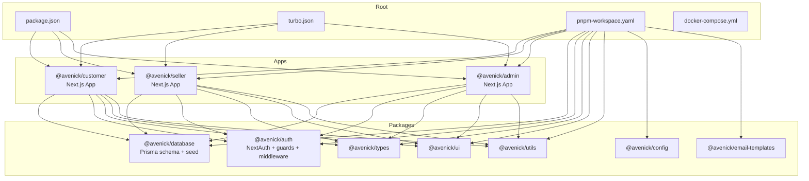
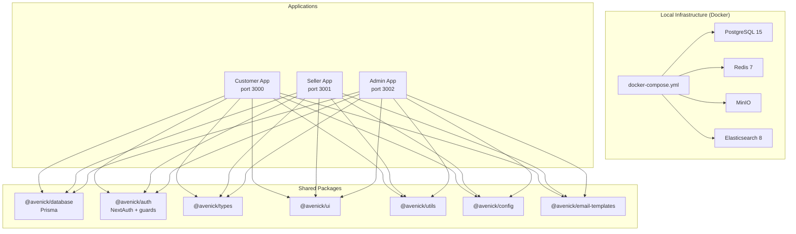
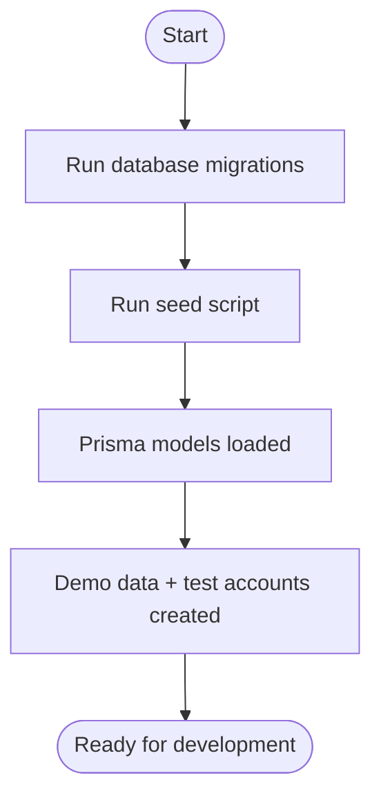
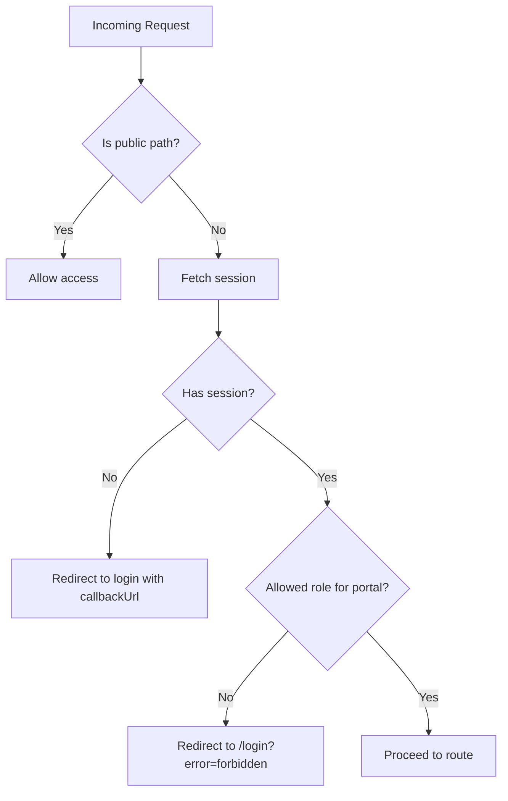
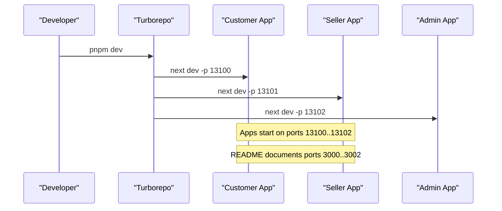
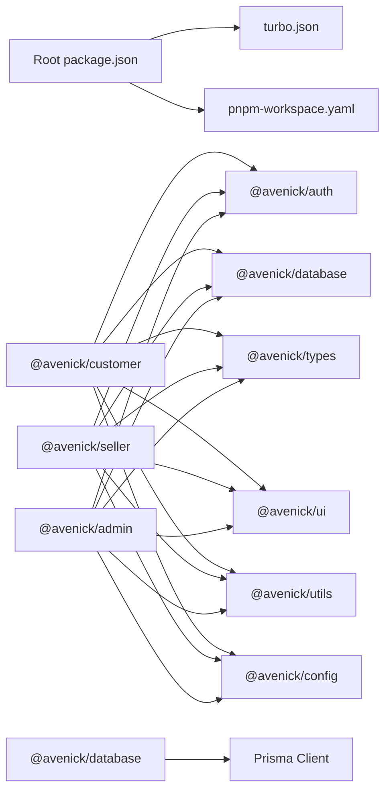

# Getting Started

<cite>
**Referenced Files in This Document**
- [README.md](file://README.md)
- [package.json](file://package.json)
- [turbo.json](file://turbo.json)
- [pnpm-workspace.yaml](file://pnpm-workspace.yaml)
- [docker-compose.yml](file://docker-compose.yml)
- [apps/customer/package.json](file://apps/customer/package.json)
- [apps/seller/package.json](file://apps/seller/package.json)
- [apps/admin/package.json](file://apps/admin/package.json)
- [packages/database/package.json](file://packages/database/package.json)
- [packages/database/prisma/schema.prisma](file://packages/database/prisma/schema.prisma)
- [packages/database/prisma/seed.ts](file://packages/database/prisma/seed.ts)
- [packages/auth/src/middleware.ts](file://packages/auth/src/middleware.ts)
</cite>

## Table of Contents
1. [Introduction](#introduction)
2. [Project Structure](#project-structure)
3. [Core Components](#core-components)
4. [Architecture Overview](#architecture-overview)
5. [Detailed Component Analysis](#detailed-component-analysis)
6. [Dependency Analysis](#dependency-analysis)
7. [Performance Considerations](#performance-considerations)
8. [Troubleshooting Guide](#troubleshooting-guide)
9. [Conclusion](#conclusion)
10. [Appendices](#appendices)

## Introduction
This guide helps you set up and run the Avenick Commerce platform locally. It covers prerequisites, environment setup, database configuration, and launching all three portals: Customer (port 3000), Seller (port 3001), and Admin (port 3002). You will also learn the monorepo structure, how Turborepo orchestrates development, and how to troubleshoot common setup issues.

## Project Structure
Avenick is a monorepo organized into:
- apps: Three Next.js applications (customer, seller, admin)
- packages: Shared libraries (database, auth, types, ui, utils, config, email-templates)
- Root tooling: Turbo for orchestration, pnpm workspace configuration, Docker Compose for infrastructure

**Diagram sources**
- [package.json:1-28](file://package.json#L1-L28)
- [turbo.json:1-69](file://turbo.json#L1-L69)
- [pnpm-workspace.yaml:1-14](file://pnpm-workspace.yaml#L1-L14)
- [apps/customer/package.json:1-51](file://apps/customer/package.json#L1-L51)
- [apps/seller/package.json:1-49](file://apps/seller/package.json#L1-L49)
- [apps/admin/package.json:1-49](file://apps/admin/package.json#L1-L49)
- [packages/database/package.json:1-34](file://packages/database/package.json#L1-L34)
- [packages/auth/src/middleware.ts:1-66](file://packages/auth/src/middleware.ts#L1-L66)

**Section sources**
- [README.md:123-139](file://README.md#L123-L139)
- [package.json:1-28](file://package.json#L1-L28)
- [turbo.json:1-69](file://turbo.json#L1-L69)
- [pnpm-workspace.yaml:1-14](file://pnpm-workspace.yaml#L1-L14)

## Core Components
- Prerequisites: Node.js 20+, pnpm 9+, Docker + Docker Compose
- Infrastructure: PostgreSQL 15, Redis 7, MinIO, Elasticsearch 8
- Database: Prisma schema and seed script populate test data
- Authentication: NextAuth v5 with role-based middleware per portal
- Monorepo tooling: Turborepo for dev/build/lint/typecheck/test; pnpm workspace for package management

Key setup steps:
- Install dependencies
- Copy environment example to .env
- Start infrastructure with Docker Compose
- Run database migrations and seed
- Launch all portals or individual apps

Port configuration:
- Customer Portal: http://localhost:3000
- Seller Central: http://localhost:3001
- Admin Console: http://localhost:3002
- Additional services: MinIO Console (9001), Elasticsearch (9200), PostgreSQL (5432), Redis (6379)

Test accounts (after seeding):
- Super Admin: admin@avenick.test / Password123!
- Seller Owner: seller@avenick.test / Password123!
- B2C Buyer: buyer@avenick.test / Password123!
- B2B Company Admin: company@avenick.test / Password123!
- Pending Seller: pending-seller@avenick.test / Password123!

**Section sources**
- [README.md:11-89](file://README.md#L11-L89)
- [docker-compose.yml:1-112](file://docker-compose.yml#L1-L112)
- [packages/database/prisma/seed.ts:1-800](file://packages/database/prisma/seed.ts#L1-L800)

## Architecture Overview
The platform runs three Next.js portals backed by shared packages and a local Dockerized infrastructure. Turborepo coordinates tasks across the monorepo.

**Diagram sources**
- [docker-compose.yml:1-112](file://docker-compose.yml#L1-L112)
- [apps/customer/package.json:1-51](file://apps/customer/package.json#L1-L51)
- [apps/seller/package.json:1-49](file://apps/seller/package.json#L1-L49)
- [apps/admin/package.json:1-49](file://apps/admin/package.json#L1-L49)
- [packages/database/package.json:1-34](file://packages/database/package.json#L1-L34)
- [packages/auth/src/middleware.ts:1-66](file://packages/auth/src/middleware.ts#L1-L66)

**Section sources**
- [README.md:123-139](file://README.md#L123-L139)
- [turbo.json:1-69](file://turbo.json#L1-L69)

## Detailed Component Analysis

### Database Setup and Seed
- Prisma schema defines models and enums for users, companies, sellers, products, orders, inventory, and more.
- The seed script creates roles, categories, brands, warehouses, products, reviews, support tickets, and product issues.
- After migrations, the database is populated with realistic demo data and test accounts.

**Diagram sources**
- [packages/database/package.json:11-21](file://packages/database/package.json#L11-L21)
- [packages/database/prisma/schema.prisma:1-800](file://packages/database/prisma/schema.prisma#L1-L800)
- [packages/database/prisma/seed.ts:1-800](file://packages/database/prisma/seed.ts#L1-L800)

**Section sources**
- [packages/database/package.json:1-34](file://packages/database/package.json#L1-L34)
- [packages/database/prisma/schema.prisma:1-800](file://packages/database/prisma/schema.prisma#L1-L800)
- [packages/database/prisma/seed.ts:1-800](file://packages/database/prisma/seed.ts#L1-L800)

### Authentication Middleware
- A single middleware factory enforces role-based access per portal (customer, seller, admin).
- Public routes are whitelisted; protected routes require a valid session whose role matches the portal’s allowed roles.
- Redirects to login when unauthenticated or unauthorized.

**Diagram sources**
- [packages/auth/src/middleware.ts:1-66](file://packages/auth/src/middleware.ts#L1-L66)

**Section sources**
- [packages/auth/src/middleware.ts:1-66](file://packages/auth/src/middleware.ts#L1-L66)

### Port Configuration and Launch
- The root README documents the expected URLs and ports for all services.
- Individual apps define their own Next.js ports in their package scripts.
- Turborepo runs all apps concurrently during development.

**Diagram sources**
- [README.md:66-76](file://README.md#L66-L76)
- [apps/customer/package.json:5-11](file://apps/customer/package.json#L5-L11)
- [apps/seller/package.json:5-11](file://apps/seller/package.json#L5-L11)
- [apps/admin/package.json:5-11](file://apps/admin/package.json#L5-L11)
- [turbo.json:19-22](file://turbo.json#L19-L22)

**Section sources**
- [README.md:66-76](file://README.md#L66-L76)
- [apps/customer/package.json:5-11](file://apps/customer/package.json#L5-L11)
- [apps/seller/package.json:5-11](file://apps/seller/package.json#L5-L11)
- [apps/admin/package.json:5-11](file://apps/admin/package.json#L5-L11)
- [turbo.json:19-22](file://turbo.json#L19-L22)

## Dependency Analysis
- Root package.json defines Turborepo-driven scripts and engine requirements.
- pnpm workspace enables workspace:* dependencies across apps and packages.
- Each app depends on shared packages: auth, database, types, ui, utils, and config.
- The database package integrates Prisma and exposes migration/seed commands.

**Diagram sources**
- [package.json:1-28](file://package.json#L1-L28)
- [turbo.json:1-69](file://turbo.json#L1-L69)
- [pnpm-workspace.yaml:1-14](file://pnpm-workspace.yaml#L1-L14)
- [apps/customer/package.json:12-36](file://apps/customer/package.json#L12-L36)
- [apps/seller/package.json:12-35](file://apps/seller/package.json#L12-L35)
- [apps/admin/package.json:12-35](file://apps/admin/package.json#L12-L35)
- [packages/database/package.json:22-24](file://packages/database/package.json#L22-L24)

**Section sources**
- [package.json:1-28](file://package.json#L1-L28)
- [turbo.json:1-69](file://turbo.json#L1-L69)
- [pnpm-workspace.yaml:1-14](file://pnpm-workspace.yaml#L1-L14)
- [apps/customer/package.json:12-36](file://apps/customer/package.json#L12-L36)
- [apps/seller/package.json:12-35](file://apps/seller/package.json#L12-L35)
- [apps/admin/package.json:12-35](file://apps/admin/package.json#L12-L35)
- [packages/database/package.json:22-24](file://packages/database/package.json#L22-L24)

## Performance Considerations
- Use Turborepo caching to speed up repeated builds and tasks.
- Keep Docker services healthy before running migrations to avoid retries.
- Prefer incremental seeding and targeted migrations during development.
- Monitor Elasticsearch readiness before indexing/search operations.

[No sources needed since this section provides general guidance]

## Troubleshooting Guide
Common setup issues and resolutions:
- Node.js or pnpm version mismatch
  - Ensure Node.js >= 20 and pnpm >= 9 as required by engines and workspace config.
- Docker Compose services not ready
  - Wait for PostgreSQL, Redis, MinIO, and Elasticsearch to pass health checks before running migrations.
- Prisma client generation errors
  - The database package runs Prisma generate on postinstall; ensure pnpm workspace allows build scripts for Prisma-related packages.
- Port conflicts
  - Apps run on ports 13100..13102 internally; the README documents ports 3000..3002. Adjust host ports or stop conflicting services.
- Authentication redirects loop
  - Verify NEXTAUTH_URL and secrets in environment variables; ensure middleware is applied in each portal.

**Section sources**
- [package.json:22-26](file://package.json#L22-L26)
- [pnpm-workspace.yaml:5-13](file://pnpm-workspace.yaml#L5-L13)
- [docker-compose.yml:16-89](file://docker-compose.yml#L16-L89)
- [apps/customer/package.json:5-11](file://apps/customer/package.json#L5-L11)
- [apps/seller/package.json:5-11](file://apps/seller/package.json#L5-L11)
- [apps/admin/package.json:5-11](file://apps/admin/package.json#L5-L11)
- [packages/database/package.json:11-12](file://packages/database/package.json#L11-L12)
- [packages/auth/src/middleware.ts:31-66](file://packages/auth/src/middleware.ts#L31-L66)

## Conclusion
You now have the essentials to set up Avenick Commerce locally: install prerequisites, start Docker infrastructure, run migrations and seed, and launch the three portals. Use Turborepo for efficient development and leverage the shared packages for consistent behavior across apps. Refer to the troubleshooting section if you encounter setup issues.

[No sources needed since this section summarizes without analyzing specific files]

## Appendices

### Step-by-Step Installation
- Prerequisites: Node.js 20+, pnpm 9+, Docker + Docker Compose
- Clone and install dependencies
- Copy environment example to .env
- Start infrastructure with Docker Compose
- Run database migrations and seed
- Start all portals or individual apps

**Section sources**
- [README.md:11-54](file://README.md#L11-L54)
- [docker-compose.yml:1-112](file://docker-compose.yml#L1-L112)
- [packages/database/package.json:11-21](file://packages/database/package.json#L11-L21)

### Ports Reference
- Customer Portal: http://localhost:3000
- Seller Central: http://localhost:3001
- Admin Console: http://localhost:3002
- MinIO Console: http://localhost:9001
- Elasticsearch: http://localhost:9200
- PostgreSQL: localhost:5432
- Redis: localhost:6379

**Section sources**
- [README.md:66-76](file://README.md#L66-L76)

### Test Accounts
- Super Admin: admin@avenick.test / Password123!
- Seller Owner: seller@avenick.test / Password123!
- B2C Buyer: buyer@avenick.test / Password123!
- B2B Company Admin: company@avenick.test / Password123!
- Pending Seller: pending-seller@avenick.test / Password123!

**Section sources**
- [README.md:80-89](file://README.md#L80-L89)
- [packages/database/prisma/seed.ts:35-53](file://packages/database/prisma/seed.ts#L35-L53)