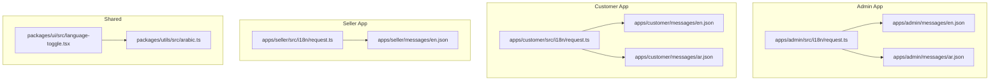
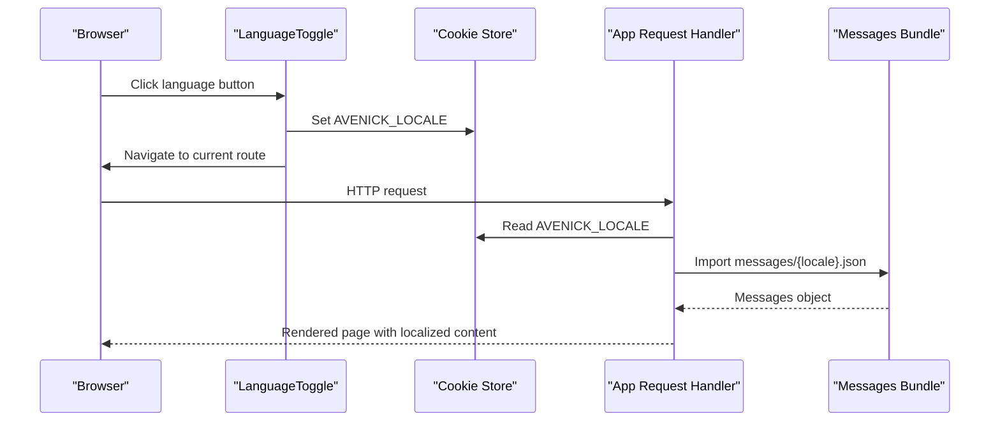
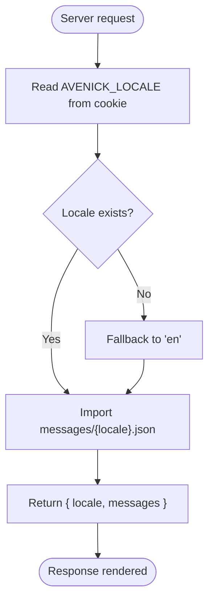
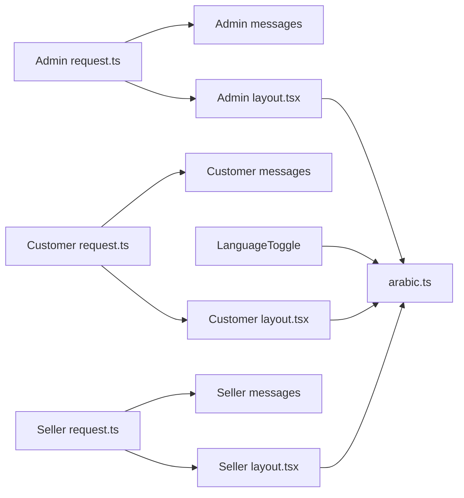

# Internationalization & Localization

<cite>
**Referenced Files in This Document**
- [apps/admin/src/i18n/request.ts](file://apps/admin/src/i18n/request.ts)
- [apps/customer/src/i18n/request.ts](file://apps/customer/src/i18n/request.ts)
- [apps/seller/src/i18n/request.ts](file://apps/seller/src/i18n/request.ts)
- [apps/admin/messages/ar.json](file://apps/admin/messages/ar.json)
- [apps/admin/messages/en.json](file://apps/admin/messages/en.json)
- [apps/customer/messages/ar.json](file://apps/customer/messages/ar.json)
- [apps/customer/messages/en.json](file://apps/customer/messages/en.json)
- [apps/seller/messages/en.json](file://apps/seller/messages/en.json)
- [packages/ui/src/language-toggle.tsx](file://packages/ui/src/language-toggle.tsx)
- [packages/utils/src/arabic.ts](file://packages/utils/src/arabic.ts)
- [apps/admin/src/middleware.ts](file://apps/admin/src/middleware.ts)
- [apps/customer/src/middleware.ts](file://apps/customer/src/middleware.ts)
- [apps/seller/src/middleware.ts](file://apps/seller/src/middleware.ts)
- [apps/admin/src/layout.tsx](file://apps/admin/src/layout.tsx)
- [apps/customer/src/layout.tsx](file://apps/customer/src/layout.tsx)
- [apps/seller/src/layout.tsx](file://apps/seller/src/layout.tsx)
- [apps/admin/src/app/login/page.tsx](file://apps/admin/src/app/login/page.tsx)
- [apps/customer/src/app/login/page.tsx](file://apps/customer/src/app/login/page.tsx)
- [apps/seller/src/app/login/page.tsx](file://apps/seller/src/app/login/page.tsx)
- [apps/admin/src/components/layout/admin-layout.tsx](file://apps/admin/src/components/layout/admin-layout.tsx)
- [apps/customer/src/components/layout/main-layout.tsx](file://apps/customer/src/components/layout/main-layout.tsx)
- [apps/seller/src/components/layout/seller-layout.tsx](file://apps/seller/src/components/layout/seller-layout.tsx)
- [packages/types/src/schemas.ts](file://packages/types/src/schemas.ts)
- [packages/database/prisma/seed.ts](file://packages/database/prisma/seed.ts)
- [packages/auth/src/config.ts](file://packages/auth/src/config.ts)
</cite>

## Table of Contents
1. [Introduction](#introduction)
2. [Project Structure](#project-structure)
3. [Core Components](#core-components)
4. [Architecture Overview](#architecture-overview)
5. [Detailed Component Analysis](#detailed-component-analysis)
6. [Dependency Analysis](#dependency-analysis)
7. [Performance Considerations](#performance-considerations)
8. [Troubleshooting Guide](#troubleshooting-guide)
9. [Conclusion](#conclusion)
10. [Appendices](#appendices)

## Introduction
This document explains the internationalization (i18n) and localization system for the Avenick Commerce platform. It covers multi-language support for Arabic and English locales, right-to-left (RTL) layout implementation, locale-aware formatting, message management, translation workflow, dynamic locale switching, i18n request handling, message file organization, and component localization patterns. It also documents integration with Next.js internationalization features and best practices for maintaining consistent translations across the Admin, Customer, and Seller applications.

## Project Structure
The i18n system is implemented per application with shared utilities and a consistent pattern:
- Each application defines a server-side request handler that resolves the current locale and loads messages from JSON files.
- Message files are organized under each app’s messages directory with separate files for each locale.
- A shared UI component provides a language toggle for dynamic locale switching.
- Shared utilities encapsulate locale-aware formatting and direction detection.
- Middleware ensures locale persistence via a cookie and supports locale-specific routing behavior.

**Diagram sources**
- [apps/admin/src/i18n/request.ts:1-11](file://apps/admin/src/i18n/request.ts#L1-L11)
- [apps/customer/src/i18n/request.ts:1-12](file://apps/customer/src/i18n/request.ts#L1-L12)
- [apps/seller/src/i18n/request.ts:1-11](file://apps/seller/src/i18n/request.ts#L1-L11)
- [apps/admin/messages/en.json](file://apps/admin/messages/en.json)
- [apps/admin/messages/ar.json](file://apps/admin/messages/ar.json)
- [apps/customer/messages/en.json](file://apps/customer/messages/en.json)
- [apps/customer/messages/ar.json](file://apps/customer/messages/ar.json)
- [apps/seller/messages/en.json](file://apps/seller/messages/en.json)
- [packages/ui/src/language-toggle.tsx:1-41](file://packages/ui/src/language-toggle.tsx#L1-L41)
- [packages/utils/src/arabic.ts:1-51](file://packages/utils/src/arabic.ts#L1-L51)

**Section sources**
- [apps/admin/src/i18n/request.ts:1-11](file://apps/admin/src/i18n/request.ts#L1-L11)
- [apps/customer/src/i18n/request.ts:1-12](file://apps/customer/src/i18n/request.ts#L1-L12)
- [apps/seller/src/i18n/request.ts:1-11](file://apps/seller/src/i18n/request.ts#L1-L11)
- [packages/ui/src/language-toggle.tsx:1-41](file://packages/ui/src/language-toggle.tsx#L1-L41)
- [packages/utils/src/arabic.ts:1-51](file://packages/utils/src/arabic.ts#L1-L51)

## Core Components
- Locale resolution and message loading per app:
  - Admin, Customer, and Seller each define a server-side request handler that reads the locale from a cookie and imports the corresponding messages file.
- Message files:
  - English and Arabic message bundles exist for Admin and Customer; English-only for Seller.
- Language toggle UI:
  - A reusable client component switches the locale and persists it via a cookie.
- Locale utilities:
  - Functions to detect directionality, format names, map country codes, and localize values based on locale.
- Middleware:
  - Ensures locale persistence and supports locale-specific routing behavior.
- Layouts:
  - Application layouts set HTML attributes for directionality and language to enable proper rendering of RTL content.

**Section sources**
- [apps/admin/src/i18n/request.ts:1-11](file://apps/admin/src/i18n/request.ts#L1-L11)
- [apps/customer/src/i18n/request.ts:1-12](file://apps/customer/src/i18n/request.ts#L1-L12)
- [apps/seller/src/i18n/request.ts:1-11](file://apps/seller/src/i18n/request.ts#L1-L11)
- [apps/admin/messages/en.json](file://apps/admin/messages/en.json)
- [apps/admin/messages/ar.json](file://apps/admin/messages/ar.json)
- [apps/customer/messages/en.json](file://apps/customer/messages/en.json)
- [apps/customer/messages/ar.json](file://apps/customer/messages/ar.json)
- [apps/seller/messages/en.json](file://apps/seller/messages/en.json)
- [packages/ui/src/language-toggle.tsx:1-41](file://packages/ui/src/language-toggle.tsx#L1-L41)
- [packages/utils/src/arabic.ts:1-51](file://packages/utils/src/arabic.ts#L1-L51)
- [apps/admin/src/middleware.ts](file://apps/admin/src/middleware.ts)
- [apps/customer/src/middleware.ts](file://apps/customer/src/middleware.ts)
- [apps/seller/src/middleware.ts](file://apps/seller/src/middleware.ts)
- [apps/admin/src/layout.tsx](file://apps/admin/src/layout.tsx)
- [apps/customer/src/layout.tsx](file://apps/customer/src/layout.tsx)
- [apps/seller/src/layout.tsx](file://apps/seller/src/layout.tsx)

## Architecture Overview
The i18n architecture follows a server-driven model with client-side toggling:
- On each request, the app’s request handler resolves the locale from a cookie and loads the appropriate message bundle.
- The LanguageToggle component updates the cookie and triggers navigation to apply the new locale.
- Middleware ensures the cookie is present and routes requests consistently across locales.
- Layouts set HTML attributes to enable correct rendering of RTL content.

**Diagram sources**
- [packages/ui/src/language-toggle.tsx:1-41](file://packages/ui/src/language-toggle.tsx#L1-L41)
- [apps/admin/src/i18n/request.ts:1-11](file://apps/admin/src/i18n/request.ts#L1-L11)
- [apps/customer/src/i18n/request.ts:1-12](file://apps/customer/src/i18n/request.ts#L1-L12)
- [apps/seller/src/i18n/request.ts:1-11](file://apps/seller/src/i18n/request.ts#L1-L11)

## Detailed Component Analysis

### Locale Resolution and Message Loading
Each application defines a server-side request handler that:
- Reads the locale from a cookie named AVENICK_LOCALE.
- Falls back to English if the cookie is missing.
- Dynamically imports the messages JSON file for the resolved locale.

**Diagram sources**
- [apps/admin/src/i18n/request.ts:1-11](file://apps/admin/src/i18n/request.ts#L1-L11)
- [apps/customer/src/i18n/request.ts:1-12](file://apps/customer/src/i18n/request.ts#L1-L12)
- [apps/seller/src/i18n/request.ts:1-11](file://apps/seller/src/i18n/request.ts#L1-L11)

**Section sources**
- [apps/admin/src/i18n/request.ts:1-11](file://apps/admin/src/i18n/request.ts#L1-L11)
- [apps/customer/src/i18n/request.ts:1-12](file://apps/customer/src/i18n/request.ts#L1-L12)
- [apps/seller/src/i18n/request.ts:1-11](file://apps/seller/src/i18n/request.ts#L1-L11)

### Message Management and File Organization
- Message files are stored under each app’s messages directory with filenames aligned to the locale codes.
- Admin and Customer include both English and Arabic bundles; Seller currently includes only English.
- Message keys are application-scoped and should be consistent across locales to simplify maintenance.

Practical guidance:
- Keep message keys stable and descriptive.
- Add new keys to all locale files simultaneously.
- Use nested keys for hierarchical organization (e.g., pages.login.title).

**Section sources**
- [apps/admin/messages/en.json](file://apps/admin/messages/en.json)
- [apps/admin/messages/ar.json](file://apps/admin/messages/ar.json)
- [apps/customer/messages/en.json](file://apps/customer/messages/en.json)
- [apps/customer/messages/ar.json](file://apps/customer/messages/ar.json)
- [apps/seller/messages/en.json](file://apps/seller/messages/en.json)

### Dynamic Locale Switching
The LanguageToggle component:
- Accepts the current locale and an onChange callback.
- Renders buttons for Arabic and English.
- Invokes onChange with the selected locale, enabling parent components to persist the choice.

Integration steps:
- Call onChange to update the locale.
- Persist the selection by setting the AVENICK_LOCALE cookie.
- Trigger navigation to re-fetch the page with the new locale.

**Section sources**
- [packages/ui/src/language-toggle.tsx:1-41](file://packages/ui/src/language-toggle.tsx#L1-L41)

### Right-to-Left (RTL) Layout Implementation
Directionality is determined by the locale:
- The utility module provides a function to return "rtl" for Arabic and "ltr" otherwise.
- Application layouts set HTML attributes to reflect the chosen directionality, ensuring proper rendering of text and component alignment.

Best practices:
- Apply directionality at the root layout level.
- Test component layouts under both directions to prevent visual regressions.
- Avoid hardcoded direction-specific styles; rely on CSS utilities and direction-aware properties.

**Section sources**
- [packages/utils/src/arabic.ts:1-51](file://packages/utils/src/arabic.ts#L1-L51)
- [apps/admin/src/layout.tsx](file://apps/admin/src/layout.tsx)
- [apps/customer/src/layout.tsx](file://apps/customer/src/layout.tsx)
- [apps/seller/src/layout.tsx](file://apps/seller/src/layout.tsx)

### Locale-Aware Formatting
The utility module provides helpers for locale-sensitive formatting:
- Direction detection for layout.
- Name formatting tailored to Arabic (family name first).
- Country name mapping between Arabic and English.
- Number formatting using Arabic-Indic numerals.

Usage examples:
- Use direction detection to conditionally apply RTL styles.
- Use country name mapping to display localized country labels.
- Wrap numbers with Arabic numeral formatting for Arabic contexts.

**Section sources**
- [packages/utils/src/arabic.ts:1-51](file://packages/utils/src/arabic.ts#L1-L51)

### Middleware and Locale Persistence
Middleware ensures:
- Locale persistence via the AVENICK_LOCALE cookie.
- Consistent locale handling across routes.
- Optional redirection behavior for locale-specific routing.

Recommendations:
- Keep middleware logic minimal and focused on locale extraction/persistence.
- Avoid conflicting with Next.js internationalized routing if enabled.

**Section sources**
- [apps/admin/src/middleware.ts](file://apps/admin/src/middleware.ts)
- [apps/customer/src/middleware.ts](file://apps/customer/src/middleware.ts)
- [apps/seller/src/middleware.ts](file://apps/seller/src/middleware.ts)

### Component Localization Patterns
Common patterns observed across applications:
- Centralized message keys accessed through the app’s request handler.
- Conditional rendering based on locale (e.g., direction, localized labels).
- Reusable UI components that accept locale props or derive locale from context.

Examples to emulate:
- Login pages in each app demonstrate localized labels and placeholders.
- Layout components show direction-aware rendering and language attributes.

**Section sources**
- [apps/admin/src/app/login/page.tsx](file://apps/admin/src/app/login/page.tsx)
- [apps/customer/src/app/login/page.tsx](file://apps/customer/src/app/login/page.tsx)
- [apps/seller/src/app/login/page.tsx](file://apps/seller/src/app/login/page.tsx)
- [apps/admin/src/components/layout/admin-layout.tsx](file://apps/admin/src/components/layout/admin-layout.tsx)
- [apps/customer/src/components/layout/main-layout.tsx](file://apps/customer/src/components/layout/main-layout.tsx)
- [apps/seller/src/components/layout/seller-layout.tsx](file://apps/seller/src/components/layout/seller-layout.tsx)

### Translation Workflow
Recommended process:
- Define message keys in English first.
- Add corresponding keys to Arabic messages.
- Validate translations in both locales.
- Use the LanguageToggle to preview changes.
- Run tests to ensure no broken keys remain after updates.

Consistency tips:
- Maintain identical key sets across all apps.
- Use a shared naming convention for keys.
- Review layout changes when adding RTL content.

**Section sources**
- [apps/admin/messages/en.json](file://apps/admin/messages/en.json)
- [apps/admin/messages/ar.json](file://apps/admin/messages/ar.json)
- [apps/customer/messages/en.json](file://apps/customer/messages/en.json)
- [apps/customer/messages/ar.json](file://apps/customer/messages/ar.json)
- [apps/seller/messages/en.json](file://apps/seller/messages/en.json)
- [packages/ui/src/language-toggle.tsx:1-41](file://packages/ui/src/language-toggle.tsx#L1-L41)

### Integration with Next.js Internationalization Features
- Current implementation relies on a custom cookie-based locale resolution and server request handlers.
- If adopting Next.js built-in i18n routing, consider migrating request handlers to align with Next-intl’s configuration and route-based locale detection.
- Ensure message keys remain consistent with the chosen i18n strategy.

[No sources needed since this section provides general guidance]

## Dependency Analysis
The i18n system exhibits low coupling and high cohesion:
- Each app depends on its own request handler and message files.
- Shared utilities are consumed by UI components and layouts.
- Middleware and layouts coordinate locale persistence and rendering.

**Diagram sources**
- [apps/admin/src/i18n/request.ts:1-11](file://apps/admin/src/i18n/request.ts#L1-L11)
- [apps/customer/src/i18n/request.ts:1-12](file://apps/customer/src/i18n/request.ts#L1-L12)
- [apps/seller/src/i18n/request.ts:1-11](file://apps/seller/src/i18n/request.ts#L1-L11)
- [apps/admin/messages/en.json](file://apps/admin/messages/en.json)
- [apps/admin/messages/ar.json](file://apps/admin/messages/ar.json)
- [apps/customer/messages/en.json](file://apps/customer/messages/en.json)
- [apps/customer/messages/ar.json](file://apps/customer/messages/ar.json)
- [apps/seller/messages/en.json](file://apps/seller/messages/en.json)
- [packages/ui/src/language-toggle.tsx:1-41](file://packages/ui/src/language-toggle.tsx#L1-L41)
- [packages/utils/src/arabic.ts:1-51](file://packages/utils/src/arabic.ts#L1-L51)
- [apps/admin/src/layout.tsx](file://apps/admin/src/layout.tsx)
- [apps/customer/src/layout.tsx](file://apps/customer/src/layout.tsx)
- [apps/seller/src/layout.tsx](file://apps/seller/src/layout.tsx)

**Section sources**
- [apps/admin/src/i18n/request.ts:1-11](file://apps/admin/src/i18n/request.ts#L1-L11)
- [apps/customer/src/i18n/request.ts:1-12](file://apps/customer/src/i18n/request.ts#L1-L12)
- [apps/seller/src/i18n/request.ts:1-11](file://apps/seller/src/i18n/request.ts#L1-L11)
- [packages/ui/src/language-toggle.tsx:1-41](file://packages/ui/src/language-toggle.tsx#L1-L41)
- [packages/utils/src/arabic.ts:1-51](file://packages/utils/src/arabic.ts#L1-L51)
- [apps/admin/src/layout.tsx](file://apps/admin/src/layout.tsx)
- [apps/customer/src/layout.tsx](file://apps/customer/src/layout.tsx)
- [apps/seller/src/layout.tsx](file://apps/seller/src/layout.tsx)

## Performance Considerations
- Message loading uses dynamic imports per request; cache messages at runtime if needed.
- Minimize the number of translation keys per page to reduce payload size.
- Prefer lazy-loading heavy localized assets conditionally based on locale.
- Monitor render performance when applying RTL styles dynamically.

[No sources needed since this section provides general guidance]

## Troubleshooting Guide
Common issues and resolutions:
- Missing translations:
  - Verify that all message keys exist in both English and Arabic files.
  - Confirm the request handler is importing the correct locale file.
- Incorrect directionality:
  - Ensure the layout sets HTML attributes for directionality.
  - Check that the utility function returns the expected direction for the current locale.
- Locale not persisting:
  - Confirm the LanguageToggle updates the AVENICK_LOCALE cookie.
  - Verify middleware reads and applies the cookie consistently.
- Seller app missing Arabic messages:
  - Add Arabic messages and update the request handler to load them.

**Section sources**
- [apps/admin/src/i18n/request.ts:1-11](file://apps/admin/src/i18n/request.ts#L1-L11)
- [apps/customer/src/i18n/request.ts:1-12](file://apps/customer/src/i18n/request.ts#L1-L12)
- [apps/seller/src/i18n/request.ts:1-11](file://apps/seller/src/i18n/request.ts#L1-L11)
- [packages/ui/src/language-toggle.tsx:1-41](file://packages/ui/src/language-toggle.tsx#L1-L41)
- [packages/utils/src/arabic.ts:1-51](file://packages/utils/src/arabic.ts#L1-L51)

## Conclusion
The Avenick Commerce platform implements a robust, per-app i18n system with cookie-based locale persistence, server-driven message loading, and shared utilities for directionality and formatting. By following the documented patterns and best practices, teams can maintain consistent translations across the Admin, Customer, and Seller applications while supporting both Arabic and English locales effectively.

[No sources needed since this section summarizes without analyzing specific files]

## Appendices

### Practical Examples Index
- Implementing translations:
  - Define keys in English and add corresponding keys in Arabic.
  - Load messages in the app’s request handler and render localized content.
  - Reference: [apps/admin/src/i18n/request.ts:1-11](file://apps/admin/src/i18n/request.ts#L1-L11), [apps/customer/src/i18n/request.ts:1-12](file://apps/customer/src/i18n/request.ts#L1-L12), [apps/seller/src/i18n/request.ts:1-11](file://apps/seller/src/i18n/request.ts#L1-L11)
- Handling right-to-left layouts:
  - Use the direction utility to set HTML attributes in layouts.
  - Reference: [packages/utils/src/arabic.ts:1-51](file://packages/utils/src/arabic.ts#L1-L51), [apps/admin/src/layout.tsx](file://apps/admin/src/layout.tsx), [apps/customer/src/layout.tsx](file://apps/customer/src/layout.tsx), [apps/seller/src/layout.tsx](file://apps/seller/src/layout.tsx)
- Managing locale-specific content:
  - Use the LanguageToggle to switch locales and persist the selection.
  - Reference: [packages/ui/src/language-toggle.tsx:1-41](file://packages/ui/src/language-toggle.tsx#L1-L41)
- Maintaining consistency across apps:
  - Keep identical message keys across Admin, Customer, and Seller.
  - Reference: [apps/admin/messages/en.json](file://apps/admin/messages/en.json), [apps/customer/messages/en.json](file://apps/customer/messages/en.json), [apps/seller/messages/en.json](file://apps/seller/messages/en.json)