# Business Insights & Analytics

<cite>
**Referenced Files in This Document**
- [README.md](file://README.md)
- [EXECUTIVE_DASHBOARD_NOTES.md](file://EXECUTIVE_DASHBOARD_NOTES.md)
- [MODULE_06_CRM_GROWTH_NOTES.md](file://MODULE_06_CRM_GROWTH_NOTES.md)
- [MODULE_11_AI_AUTOMATION_INTEGRATIONS_NOTES.md](file://MODULE_11_AI_AUTOMATION_INTEGRATIONS_NOTES.md)
- [apps/admin/src/app/dashboard/page.tsx](file://apps/admin/src/app/dashboard/page.tsx)
- [apps/admin/src/app/dashboard/dashboard-view.tsx](file://apps/admin/src/app/dashboard/dashboard-view.tsx)
- [apps/admin/src/app/performance/page.tsx](file://apps/admin/src/app/performance/page.tsx)
- [apps/admin/src/app/pricing/page.tsx](file://apps/admin/src/app/pricing/page.tsx)
- [apps/admin/src/app/finance/page.tsx](file://apps/admin/src/app/finance/page.tsx)
- [apps/admin/src/app/integrations/page.tsx](file://apps/admin/src/app/integrations/page.tsx)
- [apps/admin/src/app/ai-insights/page.tsx](file://apps/admin/src/app/ai-insights/page.tsx)
- [apps/admin/src/app/retention/page.tsx](file://apps/admin/src/app/retention/page.tsx)
- [apps/admin/src/app/compliance/page.tsx](file://apps/admin/src/app/compliance/page.tsx)
- [apps/admin/src/app/audit/page.tsx](file://apps/admin/src/app/audit/page.tsx)
- [apps/admin/src/app/automation/page.tsx](file://apps/admin/src/app/automation/page.tsx)
- [apps/admin/src/app/crm/page.tsx](file://apps/admin/src/app/crm/page.tsx)
- [apps/admin/src/app/deals/page.tsx](file://apps/admin/src/app/deals/page.tsx)
- [apps/admin/src/app/disputes/page.tsx](file://apps/admin/src/app/disputes/page.tsx)
- [apps/admin/src/app/returns/page.tsx](file://apps/admin/src/app/returns/page.tsx)
- [apps/admin/src/app/segments/page.tsx](file://apps/admin/src/app/segments/page.tsx)
- [apps/admin/src/app/settings/page.tsx](file://apps/admin/src/app/settings/page.tsx)
- [apps/admin/src/app/sla/page.tsx](file://apps/admin/src/app/sla/page.tsx)
- [apps/admin/src/app/support/page.tsx](file://apps/admin/src/app/support/page.tsx)
- [apps/admin/src/app/vat/page.tsx](file://apps/admin/src/app/vat/page.tsx)
- [apps/admin/src/app/warehouse/page.tsx](file://apps/admin/src/app/warehouse/page.tsx)
- [apps/admin/src/app/warehouse/inbound/page.tsx](file://apps/admin/src/app/warehouse/inbound/page.tsx)
- [apps/admin/src/app/warehouse/pickpack/page.tsx](file://apps/admin/src/app/warehouse/pickpack/page.tsx)
- [apps/admin/src/app/warehouse/stock/page.tsx](file://apps/admin/src/app/warehouse/stock/page.tsx)
- [apps/admin/src/app/products/page.tsx](file://apps/admin/src/app/products/page.tsx)
- [apps/admin/src/app/orders/page.tsx](file://apps/admin/src/app/orders/page.tsx)
- [apps/admin/src/app/users/page.tsx](file://apps/admin/src/app/users/page.tsx)
- [apps/admin/src/app/sellers/page.tsx](file://apps/admin/src/app/sellers/page.tsx)
- [apps/admin/src/app/sellers/pending/page.tsx](file://apps/admin/src/app/sellers/pending/page.tsx)
- [apps/admin/src/app/sellers/[id]/page.tsx](file://apps/admin/src/app/sellers/[id]/page.tsx)
- [apps/admin/src/app/companies/page.tsx](file://apps/admin/src/app/companies/page.tsx)
- [apps/admin/src/app/categories/page.tsx](file://apps/admin/src/app/categories/page.tsx)
- [apps/admin/src/app/brands/page.tsx](file://apps/admin/src/app/brands/page.tsx)
- [apps/admin/src/app/campaigns/page.tsx](file://apps/admin/src/app/campaigns/page.tsx)
- [apps/admin/src/app/rfqs/page.tsx](file://apps/admin/src/app/rfqs/page.tsx)
- [apps/admin/src/app/settlements/page.tsx](file://apps/admin/src/app/settlements/page.tsx)
- [apps/admin/src/app/shipments/page.tsx](file://apps/admin/src/app/shipments/page.tsx)
- [apps/admin/src/app/payments/page.tsx](file://apps/admin/src/app/payments/page.tsx)
- [apps/admin/src/app/quotations/page.tsx](file://apps/admin/src/app/quotations/page.tsx)
- [apps/admin/src/app/quotes/page.tsx](file://apps/admin/src/app/quotes/page.tsx)
- [apps/admin/src/app/warehouses/stock/page.tsx](file://apps/admin/src/app/warehouses/stock/page.tsx)
- [apps/admin/src/app/warehouses/inbound/page.tsx](file://apps/admin/src/app/warehouses/inbound/page.tsx)
- [apps/admin/src/app/warehouses/pickpack/page.tsx](file://apps/admin/src/app/warehouses/pickpack/page.tsx)
- [apps/admin/src/app/warehouses/stock/page.tsx](file://apps/admin/src/app/warehouses/stock/page.tsx)
- [apps/customer/src/app/b2b/analytics/page.tsx](file://apps/customer/src/app/b2b/analytics/page.tsx)
- [apps/seller/src/app/analytics/page.tsx](file://apps/seller/src/app/analytics/page.tsx)
- [apps/seller/src/app/dashboard/page.tsx](file://apps/seller/src/app/dashboard/page.tsx)
- [apps/seller/src/app/performance/page.tsx](file://apps/seller/src/app/performance/page.tsx)
- [apps/seller/src/app/inventory/page.tsx](file://apps/seller/src/app/inventory/page.tsx)
- [apps/seller/src/app/orders/actions.ts](file://apps/seller/src/app/orders/actions.ts)
- [apps/seller/src/app/products/actions.ts](file://apps/seller/src/app/products/actions.ts)
- [apps/seller/src/app/shipments/actions.ts](file://apps/seller/src/app/shipments/actions.ts)
- [apps/seller/src/app/returns/actions.ts](file://apps/seller/src/app/returns/actions.ts)
- [apps/seller/src/app/saved-views/actions.ts](file://apps/seller/src/app/saved-views/actions.ts)
- [apps/seller/src/lib/ai.ts](file://apps/seller/src/lib/ai.ts)
- [apps/seller/src/components/ai-assist.tsx](file://apps/seller/src/components/ai-assist.tsx)
- [apps/seller/src/components/saved-views.tsx](file://apps/seller/src/components/saved-views.tsx)
- [apps/seller/src/app/api/ai/draft/route.ts](file://apps/seller/src/app/api/ai/draft/route.ts)
- [apps/seller/src/app/api/notifications/route.ts](file://apps/seller/src/app/api/notifications/route.ts)
- [apps/admin/src/app/api/admin/dashboard/route.ts](file://apps/admin/src/app/api/admin/dashboard/route.ts)
- [apps/admin/src/app/api/admin/compliance/[id]/approve/route.ts](file://apps/admin/src/app/api/admin/compliance/[id]/approve/route.ts)
- [apps/admin/src/app/api/admin/compliance/[id]/reject/route.ts](file://apps/admin/src/app/api/admin/compliance/[id]/reject/route.ts)
- [apps/admin/src/app/api/admin/products/[id]/approve/route.ts](file://apps/admin/src/app/api/admin/products/[id]/approve/route.ts)
- [apps/admin/src/app/api/admin/sellers/[id]/approve/route.ts](file://apps/admin/src/app/api/admin/sellers/[id]/approve/route.ts)
- [apps/admin/src/app/api/admin/sellers/[id]/reject/route.ts](file://apps/admin/src/app/api/admin/sellers/[id]/reject/route.ts)
- [apps/admin/src/app/api/auth/[...nextauth]/route.ts](file://apps/admin/src/app/api/auth/[...nextauth]/route.ts)
- [apps/customer/src/app/api/auth/[...nextauth]/route.ts](file://apps/customer/src/app/api/auth/[...nextauth]/route.ts)
- [apps/seller/src/app/api/auth/[...nextauth]/route.ts](file://apps/seller/src/app/api/auth/[...nextauth]/route.ts)
- [apps/admin/src/middleware.ts](file://apps/admin/src/middleware.ts)
- [apps/customer/src/middleware.ts](file://apps/customer/src/middleware.ts)
- [apps/seller/src/middleware.ts](file://apps/seller/src/middleware.ts)
</cite>

## Table of Contents
1. [Introduction](#introduction)
2. [Project Structure](#project-structure)
3. [Core Components](#core-components)
4. [Architecture Overview](#architecture-overview)
5. [Detailed Component Analysis](#detailed-component-analysis)
6. [Dependency Analysis](#dependency-analysis)
7. [Performance Considerations](#performance-considerations)
8. [Troubleshooting Guide](#troubleshooting-guide)
9. [Conclusion](#conclusion)
10. [Appendices](#appendices)

## Introduction
This document describes the Business Insights and Analytics system built across the administrative, customer, and seller applications. It focuses on performance dashboards, sales and revenue tracking, growth analytics, market intelligence (competitor analysis, pricing benchmarks, demand forecasting), AI-powered insights (recommendation engines, trend analysis, optimization suggestions), customer behavior analytics, product performance metrics, inventory efficiency indicators, exportable reports, custom dashboard creation, and real-time alert systems. Integration with external analytics platforms and visualization tools is also covered.

## Project Structure
The analytics capabilities span three Next.js applications:
- Admin application: central analytics hub, compliance, finance, integrations, and administrative dashboards.
- Customer application (B2B): analytics for buyers and procurement teams.
- Seller application: analytics for suppliers and vendors, including AI assistance and saved views.

Key areas include:
- Dashboards and views for KPIs and performance metrics
- Sales and revenue tracking pages
- Pricing benchmarking and demand forecasting
- AI-driven insights and recommendations
- Inventory efficiency and warehouse analytics
- Real-time alerts and notifications
- Exportable reports and custom dashboard creation

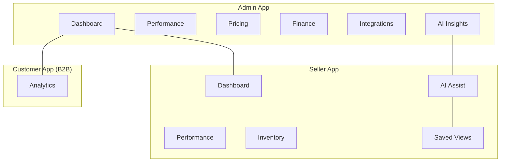

**Section sources**
- [README.md:1-200](file://README.md#L1-L200)
- [EXECUTIVE_DASHBOARD_NOTES.md:1-200](file://EXECUTIVE_DASHBOARD_NOTES.md#L1-L200)

## Core Components
- Executive Dashboard: centralized view aggregating sales metrics, revenue tracking, growth analytics, and operational KPIs.
- Performance Analytics: sales funnel, conversion rates, order lifecycle metrics, and growth indicators.
- Market Intelligence: pricing benchmarks, demand forecasting, and competitive analysis features.
- AI-Powered Insights: recommendation engines, trend analysis, and optimization suggestions.
- Customer Behavior Analytics: buyer segmentation, retention, churn prediction, and engagement metrics.
- Product Performance Metrics: SKU-level sales, inventory turnover, return rates, and profitability.
- Inventory Efficiency Indicators: stock levels, inbound/outbound throughput, picking and packing efficiency.
- Exportable Reports: downloadable summaries and detailed analytics exports.
- Custom Dashboard Creation: drag-and-drop widgets, saved views, and personalized layouts.
- Real-Time Alerts: notifications for anomalies, thresholds, and critical events.

**Section sources**
- [apps/admin/src/app/dashboard/page.tsx:1-200](file://apps/admin/src/app/dashboard/page.tsx#L1-L200)
- [apps/admin/src/app/dashboard/dashboard-view.tsx:1-200](file://apps/admin/src/app/dashboard/dashboard-view.tsx#L1-L200)
- [apps/admin/src/app/performance/page.tsx:1-200](file://apps/admin/src/app/performance/page.tsx#L1-L200)
- [apps/admin/src/app/pricing/page.tsx:1-200](file://apps/admin/src/app/pricing/page.tsx#L1-L200)
- [apps/admin/src/app/finance/page.tsx:1-200](file://apps/admin/src/app/finance/page.tsx#L1-L200)
- [apps/admin/src/app/integrations/page.tsx:1-200](file://apps/admin/src/app/integrations/page.tsx#L1-L200)
- [apps/admin/src/app/ai-insights/page.tsx:1-200](file://apps/admin/src/app/ai-insights/page.tsx#L1-L200)
- [apps/customer/src/app/b2b/analytics/page.tsx:1-200](file://apps/customer/src/app/b2b/analytics/page.tsx#L1-L200)
- [apps/seller/src/app/analytics/page.tsx:1-200](file://apps/seller/src/app/analytics/page.tsx#L1-L200)
- [apps/seller/src/app/dashboard/page.tsx:1-200](file://apps/seller/src/app/dashboard/page.tsx#L1-L200)
- [apps/seller/src/app/performance/page.tsx:1-200](file://apps/seller/src/app/performance/page.tsx#L1-L200)
- [apps/seller/src/app/inventory/page.tsx:1-200](file://apps/seller/src/app/inventory/page.tsx#L1-L200)
- [apps/seller/src/components/ai-assist.tsx:1-200](file://apps/seller/src/components/ai-assist.tsx#L1-L200)
- [apps/seller/src/components/saved-views.tsx:1-200](file://apps/seller/src/components/saved-views.tsx#L1-L200)

## Architecture Overview
The system follows a modular, role-based architecture:
- Admin: orchestrates cross-functional analytics, compliance, finance, and integrations.
- Customer (B2B): focuses on procurement analytics and buyer insights.
- Seller: emphasizes product performance, inventory, and AI-driven recommendations.

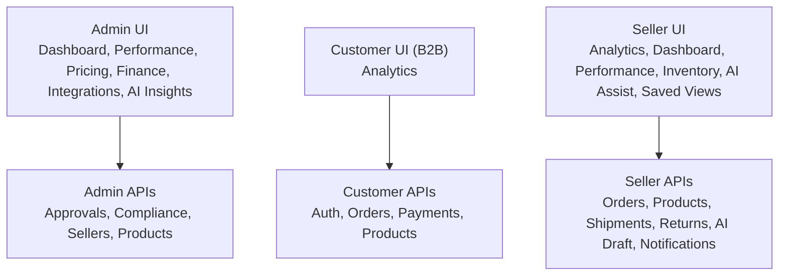

**Diagram sources**
- [apps/admin/src/app/dashboard/page.tsx:1-200](file://apps/admin/src/app/dashboard/page.tsx#L1-L200)
- [apps/admin/src/app/api/admin/dashboard/route.ts:1-200](file://apps/admin/src/app/api/admin/dashboard/route.ts#L1-L200)
- [apps/admin/src/app/api/admin/compliance/[id]/approve/route.ts](file://apps/admin/src/app/api/admin/compliance/[id]/approve/route.ts#L1-L200)
- [apps/admin/src/app/api/admin/compliance/[id]/reject/route.ts](file://apps/admin/src/app/api/admin/compliance/[id]/reject/route.ts#L1-L200)
- [apps/admin/src/app/api/admin/products/[id]/approve/route.ts](file://apps/admin/src/app/api/admin/products/[id]/approve/route.ts#L1-L200)
- [apps/admin/src/app/api/admin/sellers/[id]/approve/route.ts](file://apps/admin/src/app/api/admin/sellers/[id]/approve/route.ts#L1-L200)
- [apps/admin/src/app/api/admin/sellers/[id]/reject/route.ts](file://apps/admin/src/app/api/admin/sellers/[id]/reject/route.ts#L1-L200)
- [apps/seller/src/app/api/ai/draft/route.ts:1-200](file://apps/seller/src/app/api/ai/draft/route.ts#L1-L200)
- [apps/seller/src/app/api/notifications/route.ts:1-200](file://apps/seller/src/app/api/notifications/route.ts#L1-L200)
- [apps/admin/src/app/api/auth/[...nextauth]/route.ts](file://apps/admin/src/app/api/auth/[...nextauth]/route.ts#L1-L200)
- [apps/customer/src/app/api/auth/[...nextauth]/route.ts](file://apps/customer/src/app/api/auth/[...nextauth]/route.ts#L1-L200)
- [apps/seller/src/app/api/auth/[...nextauth]/route.ts](file://apps/seller/src/app/api/auth/[...nextauth]/route.ts#L1-L200)

## Detailed Component Analysis

### Executive Dashboard
The executive dashboard aggregates key performance indicators across sales, revenue, growth, and operations. It supports:
- Real-time KPI tiles and charts
- Drill-down navigation to detailed views
- Exportable summaries and PDF reports
- Customizable widget layouts

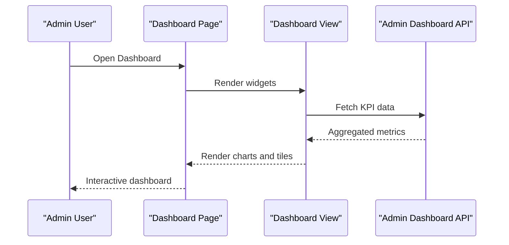

**Diagram sources**
- [apps/admin/src/app/dashboard/page.tsx:1-200](file://apps/admin/src/app/dashboard/page.tsx#L1-L200)
- [apps/admin/src/app/dashboard/dashboard-view.tsx:1-200](file://apps/admin/src/app/dashboard/dashboard-view.tsx#L1-L200)
- [apps/admin/src/app/api/admin/dashboard/route.ts:1-200](file://apps/admin/src/app/api/admin/dashboard/route.ts#L1-L200)

**Section sources**
- [apps/admin/src/app/dashboard/page.tsx:1-200](file://apps/admin/src/app/dashboard/page.tsx#L1-L200)
- [apps/admin/src/app/dashboard/dashboard-view.tsx:1-200](file://apps/admin/src/app/dashboard/dashboard-view.tsx#L1-L200)
- [apps/admin/src/app/api/admin/dashboard/route.ts:1-200](file://apps/admin/src/app/api/admin/dashboard/route.ts#L1-L200)

### Performance Analytics
Performance analytics covers sales funnels, conversion rates, order lifecycle metrics, and growth indicators. It includes:
- Funnel visualization and drop-off analysis
- Conversion rate by channel and segment
- Order-to-cash cycle time
- Year-over-year growth comparisons

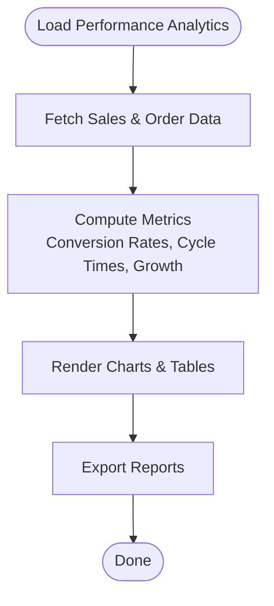

**Diagram sources**
- [apps/admin/src/app/performance/page.tsx:1-200](file://apps/admin/src/app/performance/page.tsx#L1-L200)

**Section sources**
- [apps/admin/src/app/performance/page.tsx:1-200](file://apps/admin/src/app/performance/page.tsx#L1-L200)

### Market Intelligence
Market intelligence features include:
- Pricing benchmarks against category and brand peers
- Demand forecasting using historical trends and seasonality
- Competitor analysis via price monitoring and share-of-shelf tracking

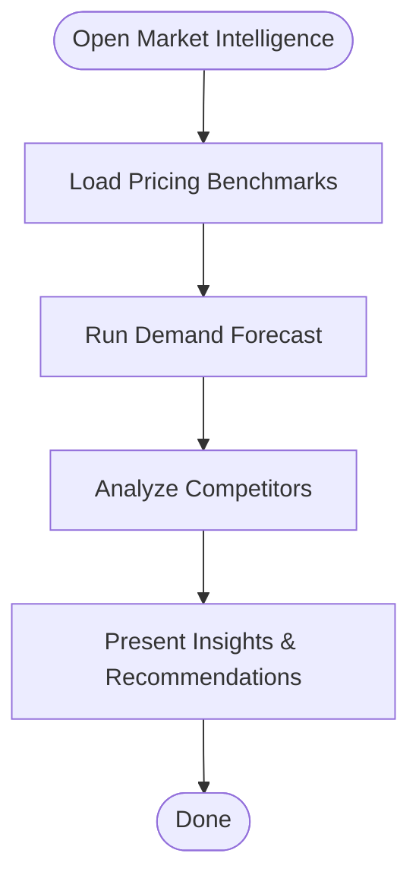

**Diagram sources**
- [apps/admin/src/app/pricing/page.tsx:1-200](file://apps/admin/src/app/pricing/page.tsx#L1-L200)

**Section sources**
- [apps/admin/src/app/pricing/page.tsx:1-200](file://apps/admin/src/app/pricing/page.tsx#L1-L200)

### AI-Powered Insights
AI-powered insights provide:
- Recommendation engines for pricing, promotions, and inventory
- Trend analysis and anomaly detection
- Optimization suggestions for supply chain and marketing spend

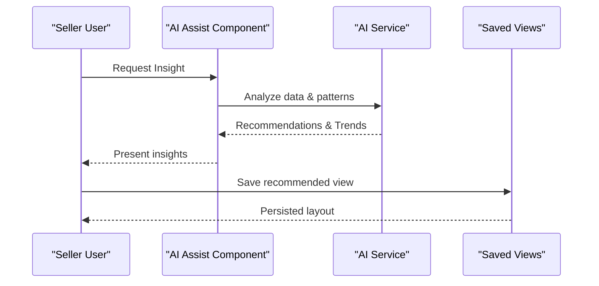

**Diagram sources**
- [apps/seller/src/components/ai-assist.tsx:1-200](file://apps/seller/src/components/ai-assist.tsx#L1-L200)
- [apps/seller/src/lib/ai.ts:1-200](file://apps/seller/src/lib/ai.ts#L1-L200)
- [apps/seller/src/components/saved-views.tsx:1-200](file://apps/seller/src/components/saved-views.tsx#L1-L200)
- [apps/seller/src/app/api/ai/draft/route.ts:1-200](file://apps/seller/src/app/api/ai/draft/route.ts#L1-L200)

**Section sources**
- [apps/admin/src/app/ai-insights/page.tsx:1-200](file://apps/admin/src/app/ai-insights/page.tsx#L1-L200)
- [apps/seller/src/components/ai-assist.tsx:1-200](file://apps/seller/src/components/ai-assist.tsx#L1-L200)
- [apps/seller/src/lib/ai.ts:1-200](file://apps/seller/src/lib/ai.ts#L1-L200)
- [apps/seller/src/components/saved-views.tsx:1-200](file://apps/seller/src/components/saved-views.tsx#L1-L200)
- [apps/seller/src/app/api/ai/draft/route.ts:1-200](file://apps/seller/src/app/api/ai/draft/route.ts#L1-L200)

### Customer Behavior Analytics
Customer behavior analytics includes:
- Buyer segmentation and cohort analysis
- Retention and churn prediction
- Engagement metrics and lifetime value modeling

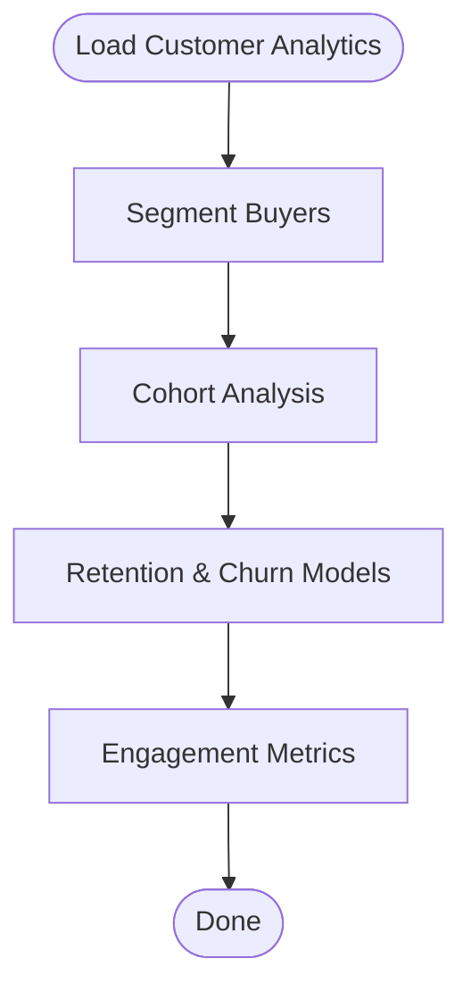

**Diagram sources**
- [apps/admin/src/app/retention/page.tsx:1-200](file://apps/admin/src/app/retention/page.tsx#L1-L200)
- [apps/admin/src/app/crm/page.tsx:1-200](file://apps/admin/src/app/crm/page.tsx#L1-L200)

**Section sources**
- [apps/admin/src/app/retention/page.tsx:1-200](file://apps/admin/src/app/retention/page.tsx#L1-L200)
- [apps/admin/src/app/crm/page.tsx:1-200](file://apps/admin/src/app/crm/page.tsx#L1-L200)

### Product Performance Metrics
Product performance metrics include:
- SKU-level sales and revenue
- Inventory turnover and stock-out risk
- Return rates and refund analysis
- Profitability by product and category

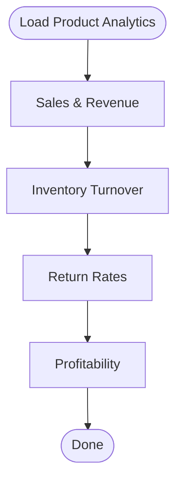

**Diagram sources**
- [apps/admin/src/app/products/page.tsx:1-200](file://apps/admin/src/app/products/page.tsx#L1-L200)
- [apps/seller/src/app/products/actions.ts:1-200](file://apps/seller/src/app/products/actions.ts#L1-L200)

**Section sources**
- [apps/admin/src/app/products/page.tsx:1-200](file://apps/admin/src/app/products/page.tsx#L1-L200)
- [apps/seller/src/app/products/actions.ts:1-200](file://apps/seller/src/app/products/actions.ts#L1-L200)

### Inventory Efficiency Indicators
Inventory efficiency indicators include:
- Stock levels and safety stock coverage
- Inbound and outbound throughput
- Picking and packing efficiency
- Warehouse utilization and capacity planning

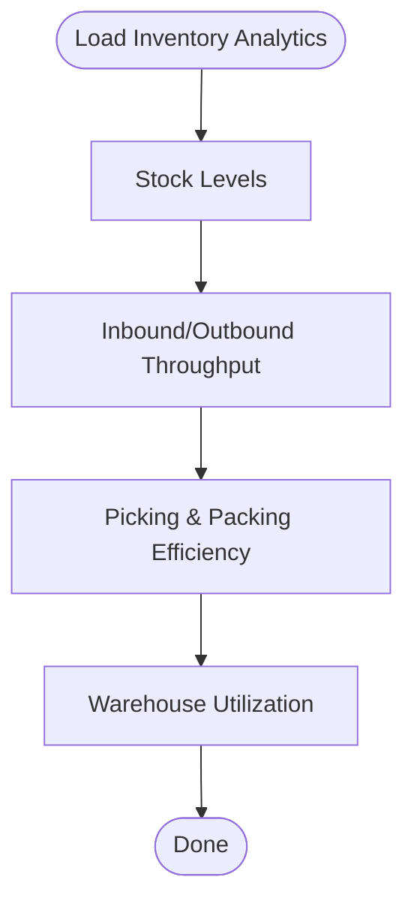

**Diagram sources**
- [apps/admin/src/app/warehouse/page.tsx:1-200](file://apps/admin/src/app/warehouse/page.tsx#L1-L200)
- [apps/admin/src/app/warehouse/inbound/page.tsx:1-200](file://apps/admin/src/app/warehouse/inbound/page.tsx#L1-L200)
- [apps/admin/src/app/warehouse/pickpack/page.tsx:1-200](file://apps/admin/src/app/warehouse/pickpack/page.tsx#L1-L200)
- [apps/admin/src/app/warehouse/stock/page.tsx:1-200](file://apps/admin/src/app/warehouse/stock/page.tsx#L1-L200)
- [apps/seller/src/app/inventory/page.tsx:1-200](file://apps/seller/src/app/inventory/page.tsx#L1-L200)
- [apps/seller/src/app/shipments/actions.ts:1-200](file://apps/seller/src/app/shipments/actions.ts#L1-L200)

**Section sources**
- [apps/admin/src/app/warehouse/page.tsx:1-200](file://apps/admin/src/app/warehouse/page.tsx#L1-L200)
- [apps/admin/src/app/warehouse/inbound/page.tsx:1-200](file://apps/admin/src/app/warehouse/inbound/page.tsx#L1-L200)
- [apps/admin/src/app/warehouse/pickpack/page.tsx:1-200](file://apps/admin/src/app/warehouse/pickpack/page.tsx#L1-L200)
- [apps/admin/src/app/warehouse/stock/page.tsx:1-200](file://apps/admin/src/app/warehouse/stock/page.tsx#L1-L200)
- [apps/seller/src/app/inventory/page.tsx:1-200](file://apps/seller/src/app/inventory/page.tsx#L1-L200)
- [apps/seller/src/app/shipments/actions.ts:1-200](file://apps/seller/src/app/shipments/actions.ts#L1-L200)

### Exportable Reports and Custom Dashboards
Exportable reports and custom dashboards enable:
- Downloadable PDF and CSV exports
- Drag-and-drop widget customization
- Saved views for repeated access
- Role-based sharing and permissions

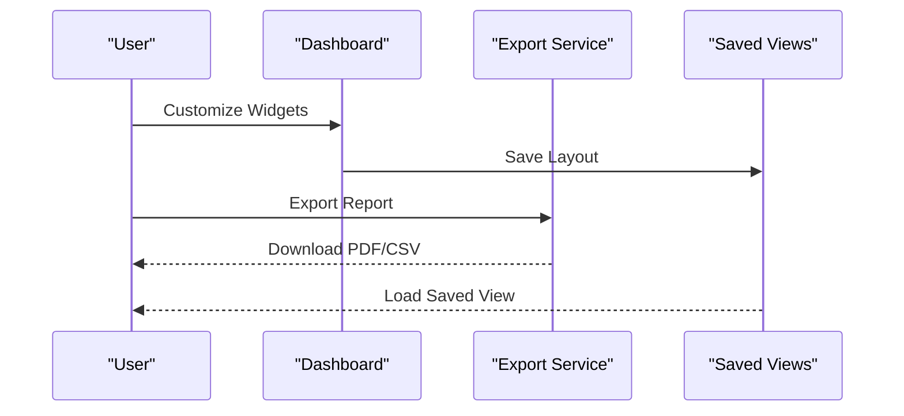

**Diagram sources**
- [apps/admin/src/app/dashboard/dashboard-view.tsx:1-200](file://apps/admin/src/app/dashboard/dashboard-view.tsx#L1-L200)
- [apps/seller/src/components/saved-views.tsx:1-200](file://apps/seller/src/components/saved-views.tsx#L1-L200)

**Section sources**
- [apps/admin/src/app/dashboard/dashboard-view.tsx:1-200](file://apps/admin/src/app/dashboard/dashboard-view.tsx#L1-L200)
- [apps/seller/src/components/saved-views.tsx:1-200](file://apps/seller/src/components/saved-views.tsx#L1-L200)

### Real-Time Alerts and Notifications
Real-time alerts and notifications include:
- Threshold-based alerts for KPIs and inventory
- Anomaly detection for sales spikes or drops
- Automated notifications for approvals and compliance
- Push notifications for critical events

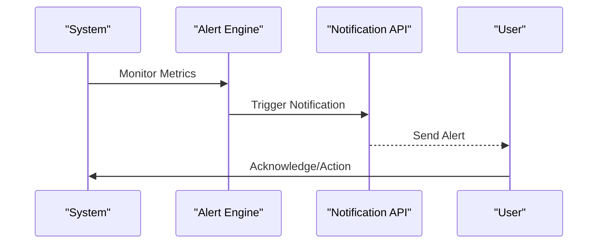

**Diagram sources**
- [apps/seller/src/app/api/notifications/route.ts:1-200](file://apps/seller/src/app/api/notifications/route.ts#L1-L200)

**Section sources**
- [apps/seller/src/app/api/notifications/route.ts:1-200](file://apps/seller/src/app/api/notifications/route.ts#L1-L200)

### Integration with External Platforms
Integration capabilities include:
- Third-party analytics and visualization tools
- Data export to BI platforms
- Webhook-based event streaming
- Authentication and authorization via NextAuth

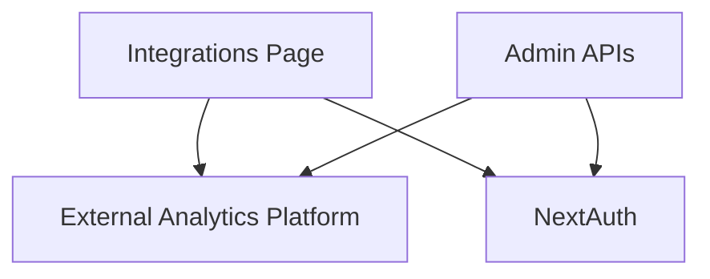

**Diagram sources**
- [apps/admin/src/app/integrations/page.tsx:1-200](file://apps/admin/src/app/integrations/page.tsx#L1-L200)
- [apps/admin/src/app/api/auth/[...nextauth]/route.ts](file://apps/admin/src/app/api/auth/[...nextauth]/route.ts#L1-L200)
- [apps/customer/src/app/api/auth/[...nextauth]/route.ts](file://apps/customer/src/app/api/auth/[...nextauth]/route.ts#L1-L200)
- [apps/seller/src/app/api/auth/[...nextauth]/route.ts](file://apps/seller/src/app/api/auth/[...nextauth]/route.ts#L1-L200)

**Section sources**
- [apps/admin/src/app/integrations/page.tsx:1-200](file://apps/admin/src/app/integrations/page.tsx#L1-L200)
- [apps/admin/src/app/api/auth/[...nextauth]/route.ts](file://apps/admin/src/app/api/auth/[...nextauth]/route.ts#L1-L200)
- [apps/customer/src/app/api/auth/[...nextauth]/route.ts](file://apps/customer/src/app/api/auth/[...nextauth]/route.ts#L1-L200)
- [apps/seller/src/app/api/auth/[...nextauth]/route.ts](file://apps/seller/src/app/api/auth/[...nextauth]/route.ts#L1-L200)

## Dependency Analysis
The system exhibits layered dependencies:
- UI components depend on page routes and shared libraries
- Page routes depend on API handlers for data retrieval and mutations
- API handlers integrate with authentication and external services
- Middleware enforces role-based access control across applications

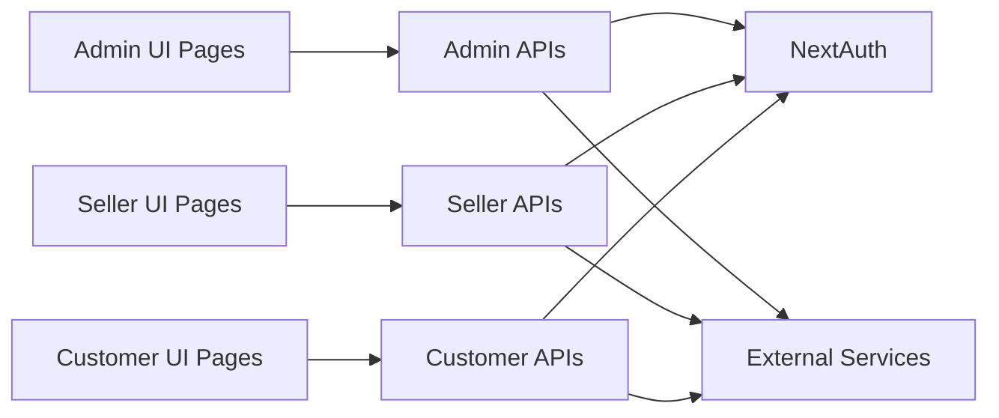

**Diagram sources**
- [apps/admin/src/middleware.ts:1-200](file://apps/admin/src/middleware.ts#L1-L200)
- [apps/seller/src/middleware.ts:1-200](file://apps/seller/src/middleware.ts#L1-L200)
- [apps/customer/src/middleware.ts:1-200](file://apps/customer/src/middleware.ts#L1-L200)

**Section sources**
- [apps/admin/src/middleware.ts:1-200](file://apps/admin/src/middleware.ts#L1-L200)
- [apps/seller/src/middleware.ts:1-200](file://apps/seller/src/middleware.ts#L1-L200)
- [apps/customer/src/middleware.ts:1-200](file://apps/customer/src/middleware.ts#L1-L200)

## Performance Considerations
- Optimize dashboard queries with pagination and caching
- Use incremental static regeneration for frequently accessed reports
- Implement server-side rendering for SEO-friendly analytics pages
- Minimize payload sizes for real-time updates via streaming APIs
- Employ background jobs for heavy computations (forecasting, recommendations)

## Troubleshooting Guide
Common issues and resolutions:
- Authentication failures: verify NextAuth configuration and provider credentials
- Missing data in dashboards: confirm API endpoints and data pipeline connectivity
- Slow report generation: implement caching and limit result sets
- Notification delivery failures: check webhook endpoints and retry policies
- Permission errors: review middleware and role-based access controls

**Section sources**
- [apps/admin/src/app/api/auth/[...nextauth]/route.ts](file://apps/admin/src/app/api/auth/[...nextauth]/route.ts#L1-L200)
- [apps/seller/src/app/api/notifications/route.ts:1-200](file://apps/seller/src/app/api/notifications/route.ts#L1-L200)
- [apps/admin/src/middleware.ts:1-200](file://apps/admin/src/middleware.ts#L1-L200)
- [apps/seller/src/middleware.ts:1-200](file://apps/seller/src/middleware.ts#L1-L200)
- [apps/customer/src/middleware.ts:1-200](file://apps/customer/src/middleware.ts#L1-L200)

## Conclusion
The Business Insights and Analytics system integrates executive dashboards, performance tracking, market intelligence, AI-powered insights, customer behavior analytics, product performance metrics, and inventory efficiency indicators. It supports exportable reports, custom dashboards, and real-time alerts while integrating with external analytics platforms and visualization tools. The modular architecture ensures scalability and maintainability across admin, customer, and seller roles.

## Appendices
- Additional documentation references:
  - Executive Dashboard Notes
  - CRM and Growth Notes
  - AI, Automation, and Integrations Notes

**Section sources**
- [EXECUTIVE_DASHBOARD_NOTES.md:1-200](file://EXECUTIVE_DASHBOARD_NOTES.md#L1-L200)
- [MODULE_06_CRM_GROWTH_NOTES.md:1-200](file://MODULE_06_CRM_GROWTH_NOTES.md#L1-L200)
- [MODULE_11_AI_AUTOMATION_INTEGRATIONS_NOTES.md:1-200](file://MODULE_11_AI_AUTOMATION_INTEGRATIONS_NOTES.md#L1-L200)