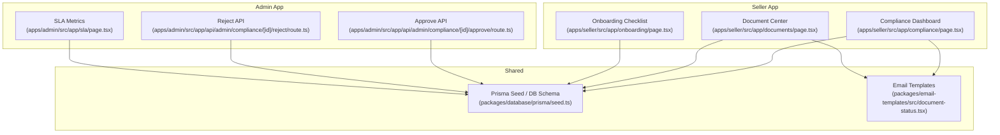
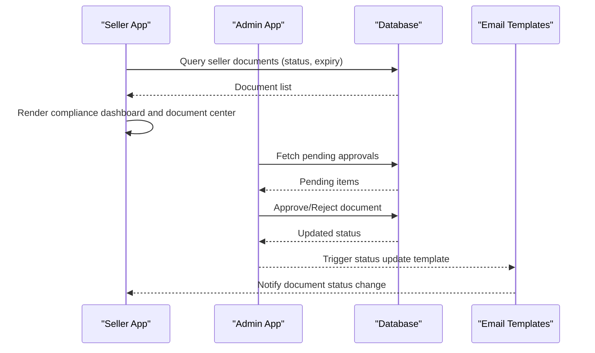
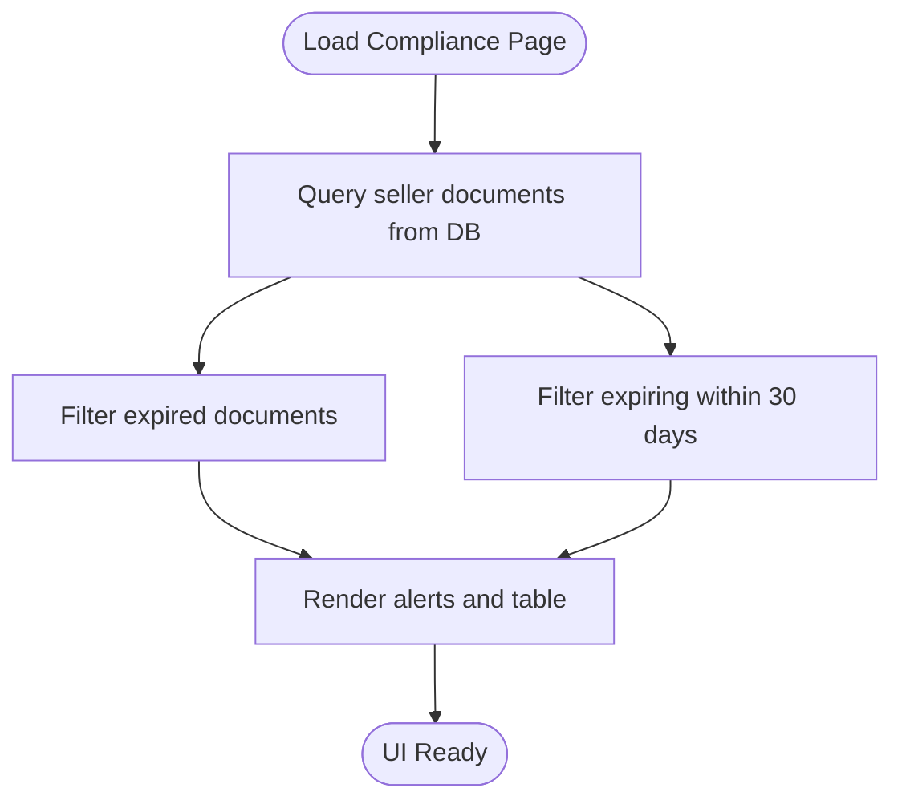
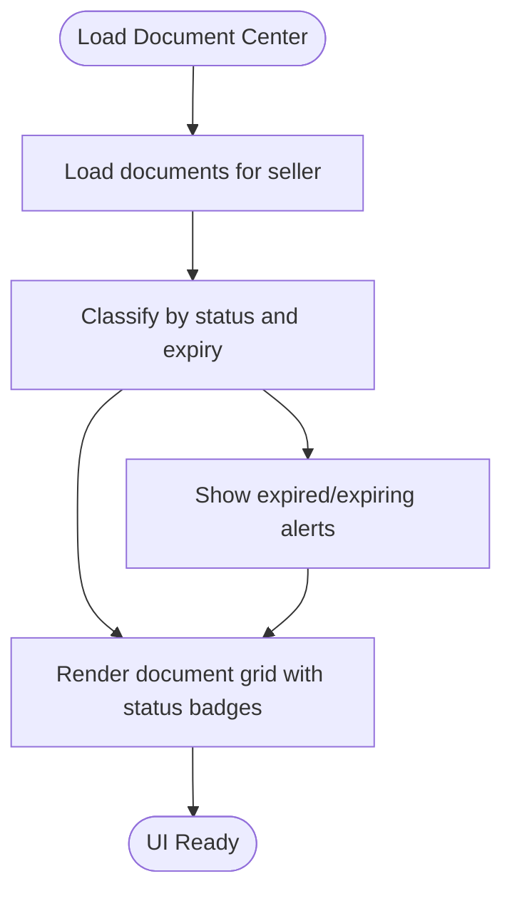
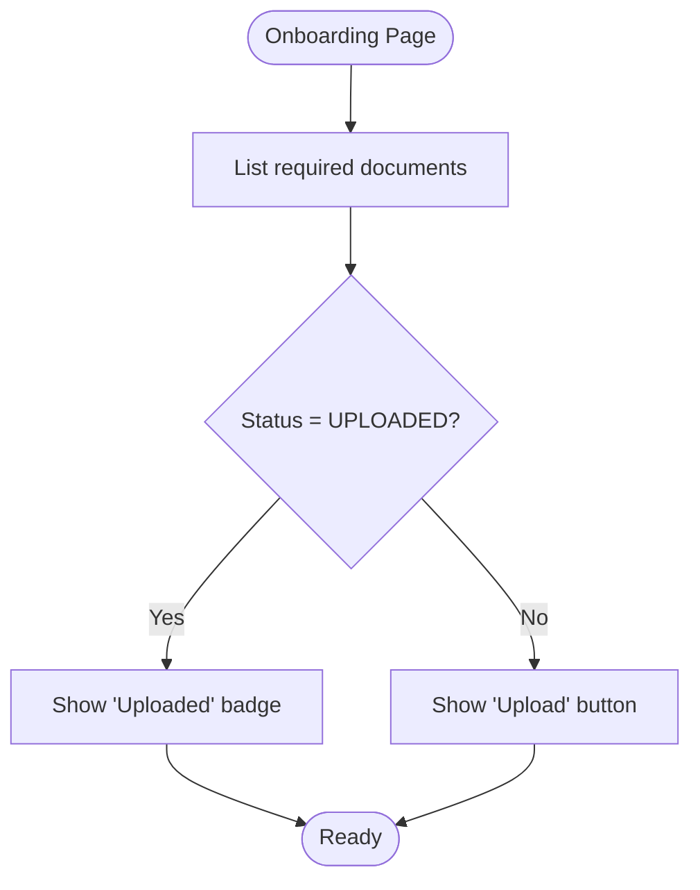
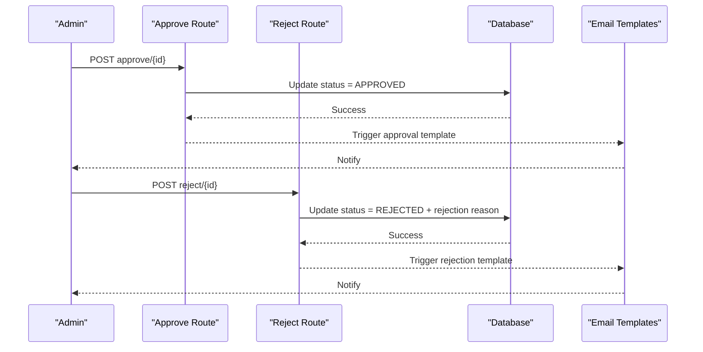
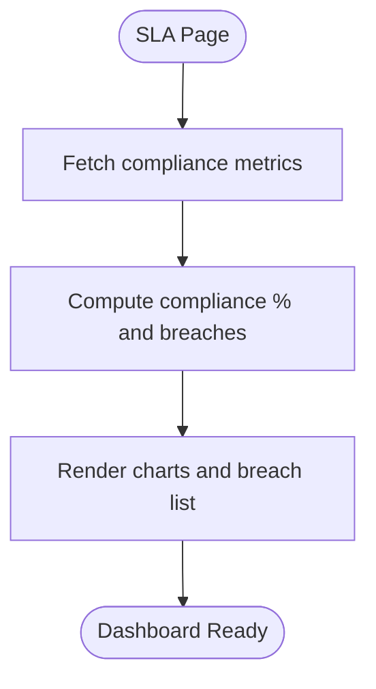
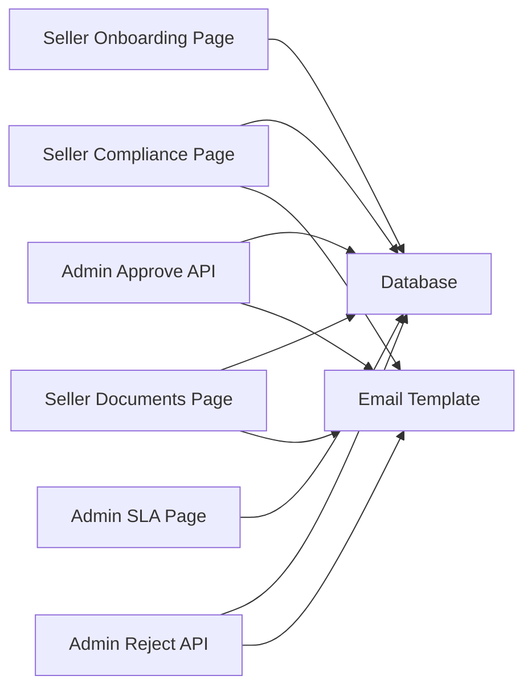

# Compliance & Documentation

<cite>
**Referenced Files in This Document**
- [apps/seller/src/app/compliance/page.tsx](file://apps/seller/src/app/compliance/page.tsx)
- [apps/seller/src/app/documents/page.tsx](file://apps/seller/src/app/documents/page.tsx)
- [apps/seller/src/app/onboarding/page.tsx](file://apps/seller/src/app/onboarding/page.tsx)
- [apps/admin/src/app/api/admin/compliance/[id]/approve/route.ts](file://apps/admin/src/app/api/admin/compliance/[id]/approve/route.ts)
- [apps/admin/src/app/api/admin/compliance/[id]/reject/route.ts](file://apps/admin/src/app/api/admin/compliance/[id]/reject/route.ts)
- [apps/admin/src/app/sla/page.tsx](file://apps/admin/src/app/sla/page.tsx)
- [packages/email-templates/src/document-status.tsx](file://packages/email-templates/src/document-status.tsx)
- [packages/database/prisma/seed.ts](file://packages/database/prisma/seed.ts)
</cite>

## Table of Contents
1. [Introduction](#introduction)
2. [Project Structure](#project-structure)
3. [Core Components](#core-components)
4. [Architecture Overview](#architecture-overview)
5. [Detailed Component Analysis](#detailed-component-analysis)
6. [Dependency Analysis](#dependency-analysis)
7. [Performance Considerations](#performance-considerations)
8. [Troubleshooting Guide](#troubleshooting-guide)
9. [Conclusion](#conclusion)
10. [Appendices](#appendices)

## Introduction
This document describes the Compliance and Documentation system across the marketplace’s Admin, Seller, and Customer applications. It covers:
- Compliance requirement tracking and regulatory guideline adherence
- Certification and license management
- Document upload and storage for licenses, permits, and business registrations
- Return policy management and warranty documentation
- Quality assurance and product safety certifications
- Compliance monitoring, automated alerts for expiring documents, and audit preparation tools
- Integration with legal/regulatory databases for real-time compliance checking

The system distinguishes between seller-facing compliance dashboards and administrative oversight with approval/rejection workflows.

## Project Structure
The Compliance and Documentation system spans three Next.js applications:
- Admin: oversight, approvals, SLA metrics, and audit views
- Seller: document center, compliance dashboard, onboarding checklist, and uploads
- Customer: B2B approval policies and related compliance contexts

**Diagram sources**
- [apps/seller/src/app/compliance/page.tsx](file://apps/seller/src/app/compliance/page.tsx)
- [apps/seller/src/app/documents/page.tsx](file://apps/seller/src/app/documents/page.tsx)
- [apps/seller/src/app/onboarding/page.tsx](file://apps/seller/src/app/onboarding/page.tsx)
- [apps/admin/src/app/api/admin/compliance/[id]/approve/route.ts](file://apps/admin/src/app/api/admin/compliance/[id]/approve/route.ts)
- [apps/admin/src/app/api/admin/compliance/[id]/reject/route.ts](file://apps/admin/src/app/api/admin/compliance/[id]/reject/route.ts)
- [apps/admin/src/app/sla/page.tsx](file://apps/admin/src/app/sla/page.tsx)
- [packages/email-templates/src/document-status.tsx](file://packages/email-templates/src/document-status.tsx)
- [packages/database/prisma/seed.ts](file://packages/database/prisma/seed.ts)

**Section sources**
- [apps/seller/src/app/compliance/page.tsx](file://apps/seller/src/app/compliance/page.tsx)
- [apps/seller/src/app/documents/page.tsx](file://apps/seller/src/app/documents/page.tsx)
- [apps/seller/src/app/onboarding/page.tsx](file://apps/seller/src/app/onboarding/page.tsx)
- [apps/admin/src/app/api/admin/compliance/[id]/approve/route.ts](file://apps/admin/src/app/api/admin/compliance/[id]/approve/route.ts)
- [apps/admin/src/app/api/admin/compliance/[id]/reject/route.ts](file://apps/admin/src/app/api/admin/compliance/[id]/reject/route.ts)
- [apps/admin/src/app/sla/page.tsx](file://apps/admin/src/app/sla/page.tsx)
- [packages/email-templates/src/document-status.tsx](file://packages/email-templates/src/document-status.tsx)
- [packages/database/prisma/seed.ts](file://packages/database/prisma/seed.ts)

## Core Components
- Compliance Dashboard (Seller): Lists uploaded documents per seller, shows status and expiry, highlights expired and expiring-soon documents, and provides upload actions.
- Document Center (Seller): Centralized grid view of documents with status badges, expiry countdown, and renewal prompts.
- Onboarding Checklist (Seller): Required document list during onboarding with upload triggers.
- Admin Approvals: REST-style API routes to approve or reject seller documents.
- SLA Metrics (Admin): Compliance percentage and breach reporting for operational oversight.
- Email Templates: Notification templates for document status updates.
- Prisma Seed: Sample product issues indicating missing compliance documentation and regional requirements.

Key implementation patterns:
- Status-driven UI with icons and color-coded labels
- Expiry calculation and “expiring soon” thresholds
- Database queries scoped to the current seller session
- Administrative approval endpoints for governance

**Section sources**
- [apps/seller/src/app/compliance/page.tsx](file://apps/seller/src/app/compliance/page.tsx)
- [apps/seller/src/app/documents/page.tsx](file://apps/seller/src/app/documents/page.tsx)
- [apps/seller/src/app/onboarding/page.tsx](file://apps/seller/src/app/onboarding/page.tsx)
- [apps/admin/src/app/api/admin/compliance/[id]/approve/route.ts](file://apps/admin/src/app/api/admin/compliance/[id]/approve/route.ts)
- [apps/admin/src/app/api/admin/compliance/[id]/reject/route.ts](file://apps/admin/src/app/api/admin/compliance/[id]/reject/route.ts)
- [apps/admin/src/app/sla/page.tsx](file://apps/admin/src/app/sla/page.tsx)
- [packages/email-templates/src/document-status.tsx](file://packages/email-templates/src/document-status.tsx)
- [packages/database/prisma/seed.ts](file://packages/database/prisma/seed.ts)

## Architecture Overview
The system integrates UI pages, server-side data fetching, and administrative APIs. Sellers manage documents and monitor compliance; Admins review and act on submissions; shared templates and seed data support notifications and test scenarios.

**Diagram sources**
- [apps/seller/src/app/compliance/page.tsx](file://apps/seller/src/app/compliance/page.tsx)
- [apps/seller/src/app/documents/page.tsx](file://apps/seller/src/app/documents/page.tsx)
- [apps/admin/src/app/api/admin/compliance/[id]/approve/route.ts](file://apps/admin/src/app/api/admin/compliance/[id]/approve/route.ts)
- [apps/admin/src/app/api/admin/compliance/[id]/reject/route.ts](file://apps/admin/src/app/api/admin/compliance/[id]/reject/route.ts)
- [packages/email-templates/src/document-status.tsx](file://packages/email-templates/src/document-status.tsx)

## Detailed Component Analysis

### Compliance Dashboard (Seller)
Purpose:
- Display uploaded documents for the logged-in seller
- Highlight expired and expiring-soon documents
- Provide quick links to upload new documents

Processing logic:
- Loads documents via database query filtered by seller ID
- Computes expiring-soon subset using date comparisons
- Renders status indicators and rejection reasons when present

**Diagram sources**
- [apps/seller/src/app/compliance/page.tsx](file://apps/seller/src/app/compliance/page.tsx)

**Section sources**
- [apps/seller/src/app/compliance/page.tsx](file://apps/seller/src/app/compliance/page.tsx)

### Document Center (Seller)
Purpose:
- Centralized view of all documents with status and expiry
- Visual alerts for expired/expiring documents
- Grid cards with status badges and renewal prompts

Processing logic:
- Normalizes document records and computes expiry states
- Groups documents into expired, expiring-soon, and valid sets
- Renders summary cards and grid with status-specific styling

**Diagram sources**
- [apps/seller/src/app/documents/page.tsx](file://apps/seller/src/app/documents/page.tsx)

**Section sources**
- [apps/seller/src/app/documents/page.tsx](file://apps/seller/src/app/documents/page.tsx)

### Onboarding Checklist (Seller)
Purpose:
- Enforce required documents during seller onboarding
- Provide upload triggers per required document type

Processing logic:
- Displays required documents with status indicators
- Offers “Upload” actions for pending items

**Diagram sources**
- [apps/seller/src/app/onboarding/page.tsx](file://apps/seller/src/app/onboarding/page.tsx)

**Section sources**
- [apps/seller/src/app/onboarding/page.tsx](file://apps/seller/src/app/onboarding/page.tsx)

### Admin Approval Workflows
Purpose:
- Approve or reject seller-submitted documents
- Integrate with compliance monitoring and SLA reporting

Processing logic:
- REST-style API endpoints accept document IDs and actions
- Update document status and notify stakeholders via email templates

**Diagram sources**
- [apps/admin/src/app/api/admin/compliance/[id]/approve/route.ts](file://apps/admin/src/app/api/admin/compliance/[id]/approve/route.ts)
- [apps/admin/src/app/api/admin/compliance/[id]/reject/route.ts](file://apps/admin/src/app/api/admin/compliance/[id]/reject/route.ts)
- [packages/email-templates/src/document-status.tsx](file://packages/email-templates/src/document-status.tsx)

**Section sources**
- [apps/admin/src/app/api/admin/compliance/[id]/approve/route.ts](file://apps/admin/src/app/api/admin/compliance/[id]/approve/route.ts)
- [apps/admin/src/app/api/admin/compliance/[id]/reject/route.ts](file://apps/admin/src/app/api/admin/compliance/[id]/reject/route.ts)
- [packages/email-templates/src/document-status.tsx](file://packages/email-templates/src/document-status.tsx)

### SLA Metrics and Compliance Monitoring (Admin)
Purpose:
- Track compliance percentages and recent breaches
- Support audit preparation and operational oversight

Processing logic:
- Aggregates compliance metrics and displays trends
- Highlights breaches and targets for remediation

**Diagram sources**
- [apps/admin/src/app/sla/page.tsx](file://apps/admin/src/app/sla/page.tsx)

**Section sources**
- [apps/admin/src/app/sla/page.tsx](file://apps/admin/src/app/sla/page.tsx)

### Regulatory Databases and Real-Time Compliance Checking
Current state:
- The codebase demonstrates document status management and expiry monitoring.
- Seed data includes product issues indicating missing compliance documentation and region-specific requirements (e.g., KSA SASO for safety equipment).

Recommendations:
- Integrate external regulatory databases or APIs to validate product safety certifications and licensing requirements in real time.
- Add automated checks during product listing and seller onboarding to flag missing or invalid certifications.

**Section sources**
- [packages/database/prisma/seed.ts](file://packages/database/prisma/seed.ts)

## Dependency Analysis
- UI pages depend on the database client to fetch and render seller documents
- Admin approval routes update document statuses and trigger email notifications
- SLA metrics consume aggregated compliance data
- Email templates provide standardized notifications for status changes

**Diagram sources**
- [apps/seller/src/app/compliance/page.tsx](file://apps/seller/src/app/compliance/page.tsx)
- [apps/seller/src/app/documents/page.tsx](file://apps/seller/src/app/documents/page.tsx)
- [apps/seller/src/app/onboarding/page.tsx](file://apps/seller/src/app/onboarding/page.tsx)
- [apps/admin/src/app/api/admin/compliance/[id]/approve/route.ts](file://apps/admin/src/app/api/admin/compliance/[id]/approve/route.ts)
- [apps/admin/src/app/api/admin/compliance/[id]/reject/route.ts](file://apps/admin/src/app/api/admin/compliance/[id]/reject/route.ts)
- [apps/admin/src/app/sla/page.tsx](file://apps/admin/src/app/sla/page.tsx)
- [packages/email-templates/src/document-status.tsx](file://packages/email-templates/src/document-status.tsx)

**Section sources**
- [apps/seller/src/app/compliance/page.tsx](file://apps/seller/src/app/compliance/page.tsx)
- [apps/seller/src/app/documents/page.tsx](file://apps/seller/src/app/documents/page.tsx)
- [apps/seller/src/app/onboarding/page.tsx](file://apps/seller/src/app/onboarding/page.tsx)
- [apps/admin/src/app/api/admin/compliance/[id]/approve/route.ts](file://apps/admin/src/app/api/admin/compliance/[id]/approve/route.ts)
- [apps/admin/src/app/api/admin/compliance/[id]/reject/route.ts](file://apps/admin/src/app/api/admin/compliance/[id]/reject/route.ts)
- [apps/admin/src/app/sla/page.tsx](file://apps/admin/src/app/sla/page.tsx)
- [packages/email-templates/src/document-status.tsx](file://packages/email-templates/src/document-status.tsx)

## Performance Considerations
- Optimize database queries by filtering on seller ID and ordering by status and upload date
- Paginate document lists for sellers with large volumes
- Cache frequently accessed compliance summaries in memory or Redis for SLA dashboards
- Debounce alert banners to avoid excessive re-renders when many documents are expiring

## Troubleshooting Guide
Common issues and resolutions:
- Expired documents blocking listings: Ensure renewals are uploaded and approved; check rejection reasons in the compliance dashboard
- Missing required documents during onboarding: Use the onboarding checklist to upload required items
- Approval/rejection delays: Verify admin API endpoints are reachable and database writes succeed
- Expiry threshold confusion: Confirm date calculations and time zone handling for “expiring within 30 days”

Operational tips:
- Monitor SLA compliance metrics to identify underperforming sellers
- Use seed data to simulate missing compliance scenarios and validate alert flows

**Section sources**
- [apps/seller/src/app/compliance/page.tsx](file://apps/seller/src/app/compliance/page.tsx)
- [apps/seller/src/app/documents/page.tsx](file://apps/seller/src/app/documents/page.tsx)
- [apps/seller/src/app/onboarding/page.tsx](file://apps/seller/src/app/onboarding/page.tsx)
- [apps/admin/src/app/sla/page.tsx](file://apps/admin/src/app/sla/page.tsx)
- [packages/database/prisma/seed.ts](file://packages/database/prisma/seed.ts)

## Conclusion
The Compliance and Documentation system provides robust seller self-service for managing licenses, permits, and business registrations, with strong administrative oversight and approval workflows. The system’s UI clearly communicates document status and expiry, supports renewal prompts, and integrates with SLA metrics for continuous monitoring. Future enhancements should focus on integrating real-time regulatory databases and expanding automated compliance checks to reduce manual effort and risk.

## Appendices

### Appendix A: Document Types and Statuses
- Document types: Business registration, licenses, permits, certifications
- Statuses: Approved, Pending Review, Rejected, Expired
- Expiry handling: Threshold-based alerts and color-coded UI

**Section sources**
- [apps/seller/src/app/compliance/page.tsx](file://apps/seller/src/app/compliance/page.tsx)
- [apps/seller/src/app/documents/page.tsx](file://apps/seller/src/app/documents/page.tsx)
- [apps/seller/src/app/onboarding/page.tsx](file://apps/seller/src/app/onboarding/page.tsx)

### Appendix B: Audit Preparation Tools
- SLA breach reports and compliance percentages
- Document center summaries and status timelines
- Email templates for status change notifications

**Section sources**
- [apps/admin/src/app/sla/page.tsx](file://apps/admin/src/app/sla/page.tsx)
- [packages/email-templates/src/document-status.tsx](file://packages/email-templates/src/document-status.tsx)