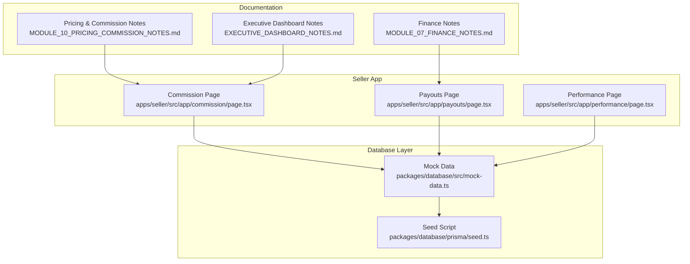
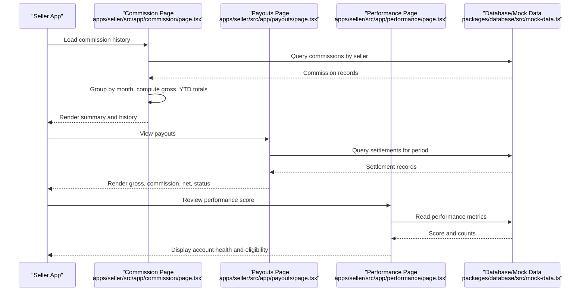
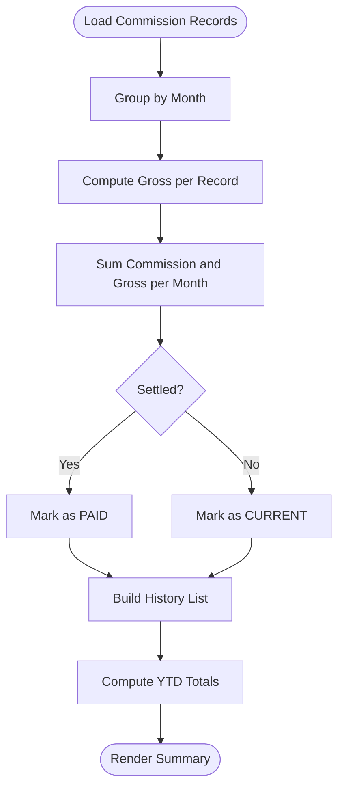
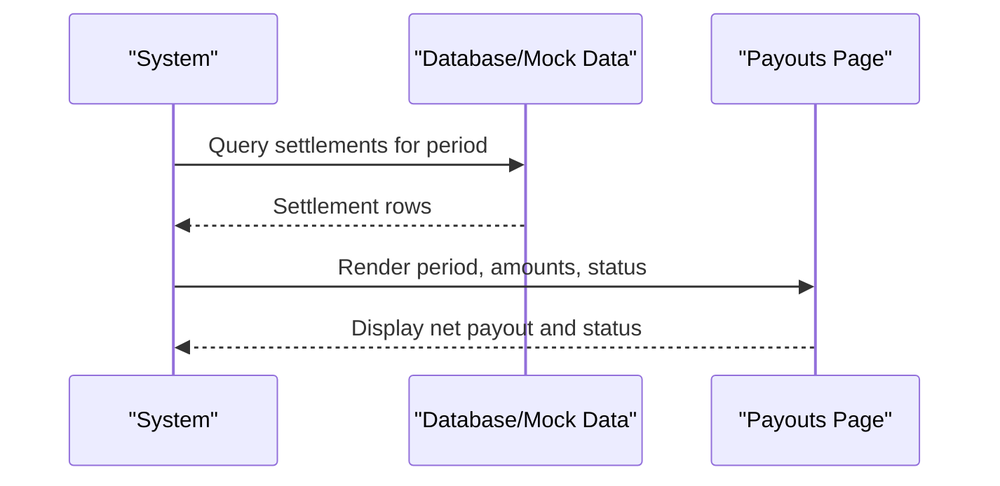
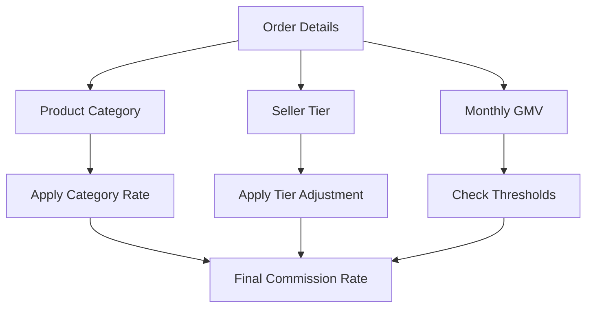
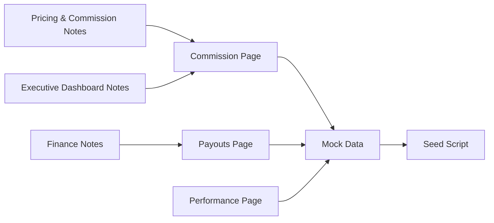

# Commission Tracking

<cite>
**Referenced Files in This Document**
- [MODULE_10_PRICING_COMMISSION_NOTES.md](file://MODULE_10_PRICING_COMMISSION_NOTES.md)
- [MODULE_07_FINANCE_NOTES.md](file://MODULE_07_FINANCE_NOTES.md)
- [EXECUTIVE_DASHBOARD_NOTES.md](file://EXECUTIVE_DASHBOARD_NOTES.md)
- [commission/page.tsx](file://apps/seller/src/app/commission/page.tsx)
- [payouts/page.tsx](file://apps/seller/src/app/payouts/page.tsx)
- [performance/page.tsx](file://apps/seller/src/app/performance/page.tsx)
- [mock-data.ts](file://packages/database/src/mock-data.ts)
- [seed.ts](file://packages/database/prisma/seed.ts)
</cite>

## Table of Contents
1. [Introduction](#introduction)
2. [Project Structure](#project-structure)
3. [Core Components](#core-components)
4. [Architecture Overview](#architecture-overview)
5. [Detailed Component Analysis](#detailed-component-analysis)
6. [Dependency Analysis](#dependency-analysis)
7. [Performance Considerations](#performance-considerations)
8. [Troubleshooting Guide](#troubleshooting-guide)
9. [Conclusion](#conclusion)
10. [Appendices](#appendices)

## Introduction
This document describes the Commission Tracking system within the platform. It covers commission calculation algorithms (percentage-based rates, fixed amounts, and tiered structures), accrual and settlement processes, payment schedules, and payout cycles. It also explains commission categorization by product type, sales volume, and performance metrics, along with commission adjustments, refunds, and dispute resolution procedures. Reporting capabilities, earnings summaries, tax documentation, and compliance tracking are documented alongside integration points with pricing modules and sales analytics for accurate commission computation.

## Project Structure
The Commission Tracking system spans frontend pages, backend database models, and supporting documentation. Key areas include:
- Commission dashboard for sellers
- Settlements and payouts
- Performance metrics influencing commission tiers
- Mock data and seed scripts for demonstration
- Finance and analytics documentation outlining future schema and flows

**Diagram sources**
- [commission/page.tsx](file://apps/seller/src/app/commission/page.tsx)
- [payouts/page.tsx](file://apps/seller/src/app/payouts/page.tsx)
- [performance/page.tsx](file://apps/seller/src/app/performance/page.tsx)
- [mock-data.ts](file://packages/database/src/mock-data.ts)
- [seed.ts](file://packages/database/prisma/seed.ts)
- [MODULE_10_PRICING_COMMISSION_NOTES.md](file://MODULE_10_PRICING_COMMISSION_NOTES.md)
- [MODULE_07_FINANCE_NOTES.md](file://MODULE_07_FINANCE_NOTES.md)
- [EXECUTIVE_DASHBOARD_NOTES.md](file://EXECUTIVE_DASHBOARD_NOTES.md)

**Section sources**
- [commission/page.tsx](file://apps/seller/src/app/commission/page.tsx)
- [payouts/page.tsx](file://apps/seller/src/app/payouts/page.tsx)
- [performance/page.tsx](file://apps/seller/src/app/performance/page.tsx)
- [mock-data.ts](file://packages/database/src/mock-data.ts)
- [seed.ts](file://packages/database/prisma/seed.ts)
- [MODULE_10_PRICING_COMMISSION_NOTES.md](file://MODULE_10_PRICING_COMMISSION_NOTES.md)
- [MODULE_07_FINANCE_NOTES.md](file://MODULE_07_FINANCE_NOTES.md)
- [EXECUTIVE_DASHBOARD_NOTES.md](file://EXECUTIVE_DASHBOARD_NOTES.md)

## Core Components
- Commission calculation and accrual:
  - Percentage-based rates per seller and product
  - Tiered commission rates based on seller tier and performance
  - Monthly grouping and YTD aggregation
- Settlements and payouts:
  - Periodic gross, commission, handling fees, and net payout
  - Status tracking (pending, processing, paid)
- Reporting:
  - Earnings summaries and tax-related analytics
  - Compliance and document tracking
- Integration:
  - Pricing modules for product-specific rates
  - Sales analytics for GMV and performance metrics

**Section sources**
- [commission/page.tsx](file://apps/seller/src/app/commission/page.tsx)
- [payouts/page.tsx](file://apps/seller/src/app/payouts/page.tsx)
- [performance/page.tsx](file://apps/seller/src/app/performance/page.tsx)
- [mock-data.ts](file://packages/database/src/mock-data.ts)
- [seed.ts](file://packages/database/prisma/seed.ts)
- [MODULE_10_PRICING_COMMISSION_NOTES.md](file://MODULE_10_PRICING_COMMISSION_NOTES.md)
- [MODULE_07_FINANCE_NOTES.md](file://MODULE_07_FINANCE_NOTES.md)
- [EXECUTIVE_DASHBOARD_NOTES.md](file://EXECUTIVE_DASHBOARD_NOTES.md)

## Architecture Overview
The Commission Tracking system integrates seller-facing dashboards with database-backed calculations and reporting. The flow below maps actual components and their interactions.

**Diagram sources**
- [commission/page.tsx](file://apps/seller/src/app/commission/page.tsx)
- [payouts/page.tsx](file://apps/seller/src/app/payouts/page.tsx)
- [performance/page.tsx](file://apps/seller/src/app/performance/page.tsx)
- [mock-data.ts](file://packages/database/src/mock-data.ts)

## Detailed Component Analysis

### Commission Calculation and Accrual
- Percentage-based rates:
  - Per seller default rate and per-product commission rate
  - Monthly grouping and gross computation from commission amount and rate
- Tiered structures:
  - Standard, Verified, Gold, Platinum tiers with reduced rates
  - Eligibility tied to performance score and monthly GMV thresholds
- Accrual and YTD:
  - Aggregation by month and YTD totals for paid commission and net earnings

**Diagram sources**
- [commission/page.tsx](file://apps/seller/src/app/commission/page.tsx)

**Section sources**
- [commission/page.tsx](file://apps/seller/src/app/commission/page.tsx)
- [mock-data.ts](file://packages/database/src/mock-data.ts)
- [seed.ts](file://packages/database/prisma/seed.ts)

### Settlements and Payout Cycles
- Settlement records include gross sales, commission, handling fees, and net payout
- Status lifecycle: pending → processing → paid
- Payouts page aggregates items per period and displays gross, commission, and net

**Diagram sources**
- [payouts/page.tsx](file://apps/seller/src/app/payouts/page.tsx)
- [mock-data.ts](file://packages/database/src/mock-data.ts)

**Section sources**
- [payouts/page.tsx](file://apps/seller/src/app/payouts/page.tsx)
- [mock-data.ts](file://packages/database/src/mock-data.ts)

### Commission Categorization and Performance Metrics
- Product-type categorization influences rates (e.g., Safety & PPE)
- Volume thresholds and seller tiers reduce rates
- Performance score and GMV thresholds determine tier eligibility and reduced rates

**Diagram sources**
- [mock-data.ts](file://packages/database/src/mock-data.ts)
- [performance/page.tsx](file://apps/seller/src/app/performance/page.tsx)

**Section sources**
- [mock-data.ts](file://packages/database/src/mock-data.ts)
- [performance/page.tsx](file://apps/seller/src/app/performance/page.tsx)

### Payment Schedules and Payout Cycles
- Settlement periods align with monthly windows
- Net payout computed as gross minus commission minus handling fees
- Status transitions reflect processing cadence

**Section sources**
- [payouts/page.tsx](file://apps/seller/src/app/payouts/page.tsx)
- [mock-data.ts](file://packages/database/src/mock-data.ts)

### Commission Adjustments, Refunds, and Dispute Resolution
- Disputes and support actions are surfaced in the admin and support modules
- Quick actions include converting to dispute and issuing refunds
- Commission adjustments would be reflected in subsequent settlement runs

**Section sources**
- [apps/admin/src/app/support/[id]/page.tsx](file://apps/admin/src/app/support/[id]/page.tsx)

### Reporting, Earnings Summaries, Tax Documentation, and Compliance Tracking
- Executive dashboard KPIs include commission totals and trends
- Finance documentation outlines VAT periods and settlement schema
- Compliance pages track document uploads and statuses

**Section sources**
- [EXECUTIVE_DASHBOARD_NOTES.md](file://EXECUTIVE_DASHBOARD_NOTES.md)
- [MODULE_07_FINANCE_NOTES.md](file://MODULE_07_FINANCE_NOTES.md)
- [apps/seller/src/app/compliance/page.tsx](file://apps/seller/src/app/compliance/page.tsx)

### Integration with Pricing Modules and Sales Analytics
- Product pricing and commission rates are modeled in mock data
- Seed script demonstrates commission computations based on order totals
- Analytics daily tables pre-aggregate GMV and other metrics for reporting

**Section sources**
- [mock-data.ts](file://packages/database/src/mock-data.ts)
- [seed.ts](file://packages/database/prisma/seed.ts)
- [EXECUTIVE_DASHBOARD_NOTES.md](file://EXECUTIVE_DASHBOARD_NOTES.md)

## Dependency Analysis
The Commission Tracking system depends on:
- Database/mocks for commission and settlement data
- Pricing/product data for rate derivation
- Performance metrics for tier eligibility
- Finance documentation for settlement and tax schema

**Diagram sources**
- [commission/page.tsx](file://apps/seller/src/app/commission/page.tsx)
- [payouts/page.tsx](file://apps/seller/src/app/payouts/page.tsx)
- [performance/page.tsx](file://apps/seller/src/app/performance/page.tsx)
- [mock-data.ts](file://packages/database/src/mock-data.ts)
- [seed.ts](file://packages/database/prisma/seed.ts)
- [MODULE_10_PRICING_COMMISSION_NOTES.md](file://MODULE_10_PRICING_COMMISSION_NOTES.md)
- [MODULE_07_FINANCE_NOTES.md](file://MODULE_07_FINANCE_NOTES.md)
- [EXECUTIVE_DASHBOARD_NOTES.md](file://EXECUTIVE_DASHBOARD_NOTES.md)

**Section sources**
- [commission/page.tsx](file://apps/seller/src/app/commission/page.tsx)
- [payouts/page.tsx](file://apps/seller/src/app/payouts/page.tsx)
- [performance/page.tsx](file://apps/seller/src/app/performance/page.tsx)
- [mock-data.ts](file://packages/database/src/mock-data.ts)
- [seed.ts](file://packages/database/prisma/seed.ts)
- [MODULE_10_PRICING_COMMISSION_NOTES.md](file://MODULE_10_PRICING_COMMISSION_NOTES.md)
- [MODULE_07_FINANCE_NOTES.md](file://MODULE_07_FINANCE_NOTES.md)
- [EXECUTIVE_DASHBOARD_NOTES.md](file://EXECUTIVE_DASHBOARD_NOTES.md)

## Performance Considerations
- Monthly aggregation and YTD computations are O(n) over commission records
- UI rendering leverages client-side grouping; server-side aggregation could improve performance for large datasets
- Settlement queries should be indexed by period and seller for efficient retrieval

## Troubleshooting Guide
- Commission history appears empty:
  - Verify commission records exist for the seller and date range
  - Confirm rate values are non-zero to compute gross accurately
- Payout status stuck as pending:
  - Check settlement records for processing status
  - Validate gross, commission, and handling fee fields
- Tier eligibility not applied:
  - Confirm performance score and GMV thresholds meet criteria
  - Review tier assignments and effective dates

**Section sources**
- [commission/page.tsx](file://apps/seller/src/app/commission/page.tsx)
- [payouts/page.tsx](file://apps/seller/src/app/payouts/page.tsx)
- [performance/page.tsx](file://apps/seller/src/app/performance/page.tsx)

## Conclusion
The Commission Tracking system integrates seller dashboards with database-backed calculations and reporting. It supports percentage-based rates, tiered structures, and performance-driven adjustments, while providing settlement and payout visibility. Future enhancements should focus on real-time analytics, automated settlement triggers, and expanded dispute resolution workflows aligned with the documented schema and processes.

## Appendices
- Commission rules schema and contract pricing outline
- Finance settlement and VAT schema
- Executive dashboard analytics tables

**Section sources**
- [MODULE_10_PRICING_COMMISSION_NOTES.md](file://MODULE_10_PRICING_COMMISSION_NOTES.md)
- [MODULE_07_FINANCE_NOTES.md](file://MODULE_07_FINANCE_NOTES.md)
- [EXECUTIVE_DASHBOARD_NOTES.md](file://EXECUTIVE_DASHBOARD_NOTES.md)