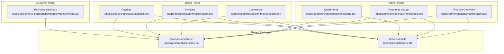
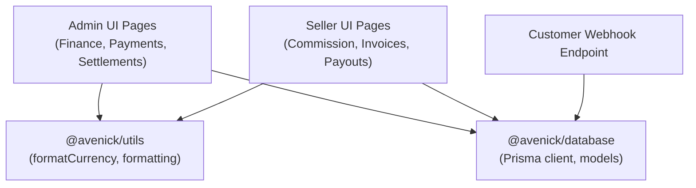
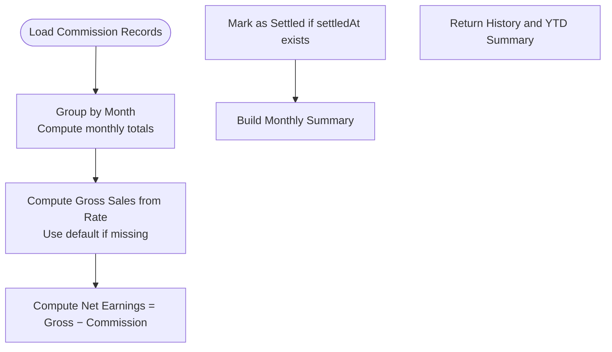
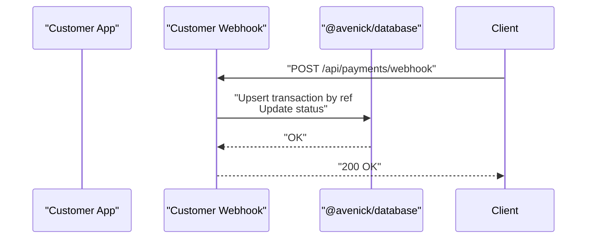
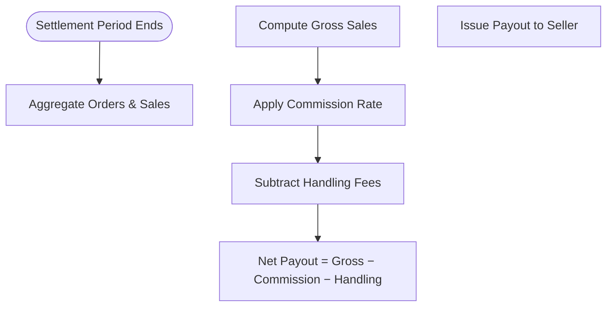
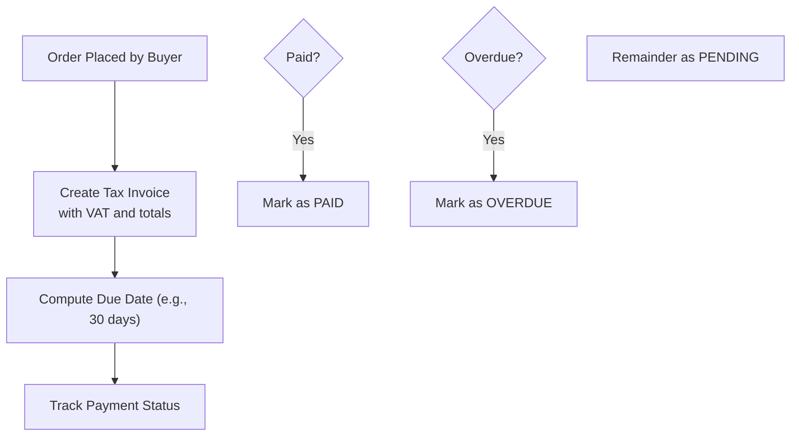
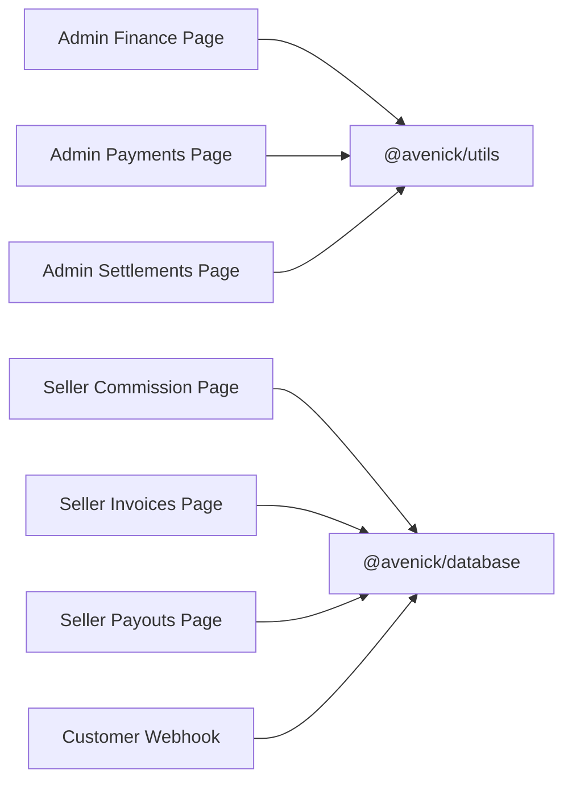
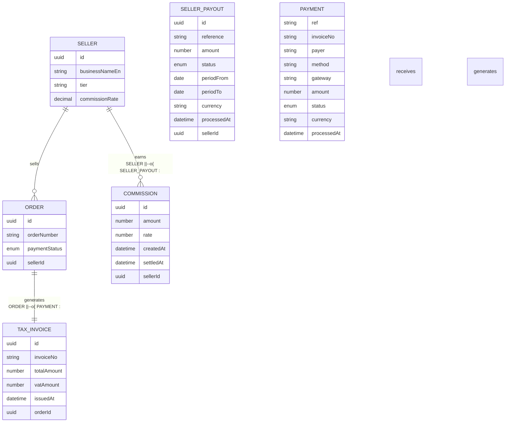

# Financial Management

<cite>
**Referenced Files in This Document**
- [apps/admin/src/app/finance/page.tsx](file://apps/admin/src/app/finance/page.tsx)
- [apps/admin/src/app/settlements/page.tsx](file://apps/admin/src/app/settlements/page.tsx)
- [apps/admin/src/app/payments/page.tsx](file://apps/admin/src/app/payments/page.tsx)
- [apps/seller/src/app/commission/page.tsx](file://apps/seller/src/app/commission/page.tsx)
- [apps/seller/src/app/invoices/page.tsx](file://apps/seller/src/app/invoices/page.tsx)
- [apps/seller/src/app/payouts/page.tsx](file://apps/seller/src/app/payouts/page.tsx)
- [apps/customer/src/app/api/payments/webhook/route.ts](file://apps/customer/src/app/api/payments/webhook/route.ts)
- [packages/database/index.ts](file://packages/database/index.ts)
- [packages/utils/index.ts](file://packages/utils/index.ts)
</cite>

## Table of Contents
1. [Introduction](#introduction)
2. [Project Structure](#project-structure)
3. [Core Components](#core-components)
4. [Architecture Overview](#architecture-overview)
5. [Detailed Component Analysis](#detailed-component-analysis)
6. [Dependency Analysis](#dependency-analysis)
7. [Performance Considerations](#performance-considerations)
8. [Troubleshooting Guide](#troubleshooting-guide)
9. [Conclusion](#conclusion)
10. [Appendices](#appendices)

## Introduction
This document describes the Financial Management system covering commission calculation, rate structures, payment processing, payouts, invoicing, tax handling, settlements, and reporting. It synthesizes frontend dashboards and pages with backend data sources and utilities to explain workflows, algorithms, and integrations. The system currently uses mock data for administrative views and Prisma-backed queries for seller-facing features.

## Project Structure
The Financial Management domain spans three Next.js applications:
- Admin portal: Finance overview, payments ledger, and supplier settlements
- Seller portal: Commission rates and history, tax invoices, and payouts
- Customer portal: Payment webhook for asynchronous transaction updates

**Diagram sources**
- [apps/admin/src/app/finance/page.tsx](file://apps/admin/src/app/finance/page.tsx)
- [apps/admin/src/app/payments/page.tsx](file://apps/admin/src/app/payments/page.tsx)
- [apps/admin/src/app/settlements/page.tsx](file://apps/admin/src/app/settlements/page.tsx)
- [apps/seller/src/app/commission/page.tsx](file://apps/seller/src/app/commission/page.tsx)
- [apps/seller/src/app/invoices/page.tsx](file://apps/seller/src/app/invoices/page.tsx)
- [apps/seller/src/app/payouts/page.tsx](file://apps/seller/src/app/payouts/page.tsx)
- [apps/customer/src/app/api/payments/webhook/route.ts](file://apps/customer/src/app/api/payments/webhook/route.ts)
- [packages/database/index.ts](file://packages/database/index.ts)
- [packages/utils/index.ts](file://packages/utils/index.ts)

**Section sources**
- [apps/admin/src/app/finance/page.tsx](file://apps/admin/src/app/finance/page.tsx)
- [apps/admin/src/app/payments/page.tsx](file://apps/admin/src/app/payments/page.tsx)
- [apps/admin/src/app/settlements/page.tsx](file://apps/admin/src/app/settlements/page.tsx)
- [apps/seller/src/app/commission/page.tsx](file://apps/seller/src/app/commission/page.tsx)
- [apps/seller/src/app/invoices/page.tsx](file://apps/seller/src/app/invoices/page.tsx)
- [apps/seller/src/app/payouts/page.tsx](file://apps/seller/src/app/payouts/page.tsx)
- [apps/customer/src/app/api/payments/webhook/route.ts](file://apps/customer/src/app/api/payments/webhook/route.ts)
- [packages/database/index.ts](file://packages/database/index.ts)
- [packages/utils/index.ts](file://packages/utils/index.ts)

## Core Components
- Finance Overview (Admin): Aggregates invoicing totals, collection metrics, VAT, pending settlements, and credit exposure. Uses mock datasets and currency formatting utilities.
- Payments Ledger (Admin): Displays transaction statuses, methods, gateways, and amounts; supports retry actions for failed transactions.
- Settlements (Admin): Shows supplier payouts, commission breakdowns, handling fees, and settlement periods; supports bulk processing.
- Commission (Seller): Calculates YTD and monthly commission, net earnings, and applies tiered commission rates; groups historical records by month.
- Invoices (Seller): Generates tax invoices per order, computes due dates, tracks payment status, and categorizes as paid, pending, or overdue.
- Payouts (Seller): Summarizes pending and paid amounts, displays periodized statements, and shows gross, commission, and net figures.
- Payment Webhook (Customer): Receives asynchronous payment events to update transaction states.

**Section sources**
- [apps/admin/src/app/finance/page.tsx](file://apps/admin/src/app/finance/page.tsx)
- [apps/admin/src/app/payments/page.tsx](file://apps/admin/src/app/payments/page.tsx)
- [apps/admin/src/app/settlements/page.tsx](file://apps/admin/src/app/settlements/page.tsx)
- [apps/seller/src/app/commission/page.tsx](file://apps/seller/src/app/commission/page.tsx)
- [apps/seller/src/app/invoices/page.tsx](file://apps/seller/src/app/invoices/page.tsx)
- [apps/seller/src/app/payouts/page.tsx](file://apps/seller/src/app/payouts/page.tsx)
- [apps/customer/src/app/api/payments/webhook/route.ts](file://apps/customer/src/app/api/payments/webhook/route.ts)

## Architecture Overview
The Financial Management system integrates UI dashboards with shared data and utility packages. Administrative views rely on mock datasets for demonstration, while seller-facing pages connect to a database via Prisma. Currency formatting and localization utilities standardize display across the platform.

**Diagram sources**
- [apps/admin/src/app/finance/page.tsx](file://apps/admin/src/app/finance/page.tsx)
- [apps/admin/src/app/payments/page.tsx](file://apps/admin/src/app/payments/page.tsx)
- [apps/admin/src/app/settlements/page.tsx](file://apps/admin/src/app/settlements/page.tsx)
- [apps/seller/src/app/commission/page.tsx](file://apps/seller/src/app/commission/page.tsx)
- [apps/seller/src/app/invoices/page.tsx](file://apps/seller/src/app/invoices/page.tsx)
- [apps/seller/src/app/payouts/page.tsx](file://apps/seller/src/app/payouts/page.tsx)
- [apps/customer/src/app/api/payments/webhook/route.ts](file://apps/customer/src/app/api/payments/webhook/route.ts)
- [packages/database/index.ts](file://packages/database/index.ts)
- [packages/utils/index.ts](file://packages/utils/index.ts)

## Detailed Component Analysis

### Commission Calculation and Rate Structures
- Tiered commission rates apply to sellers based on performance and volume thresholds. The seller page aggregates monthly commission and gross sales, derives net earnings, and flags unsettled items.
- Algorithms:
  - Monthly aggregation groups commission records by calendar month.
  - Gross sales derived from commission amount and default rate fallback.
  - YTD computation aggregates annual totals and computes net earnings.

**Diagram sources**
- [apps/seller/src/app/commission/page.tsx](file://apps/seller/src/app/commission/page.tsx)

**Section sources**
- [apps/seller/src/app/commission/page.tsx](file://apps/seller/src/app/commission/page.tsx)

### Payment Processing Workflows
- The payments page presents a transaction ledger with statuses (SUCCEEDED, PENDING, FAILED, REFUNDED) and payment methods (bank transfer, card, mada, Apple Pay, credit terms). It computes collected and pending values and surfaces failed transactions for follow-up.
- The customer-side webhook endpoint receives payment events and updates transaction states asynchronously.

**Diagram sources**
- [apps/customer/src/app/api/payments/webhook/route.ts](file://apps/customer/src/app/api/payments/webhook/route.ts)
- [packages/database/index.ts](file://packages/database/index.ts)

**Section sources**
- [apps/admin/src/app/payments/page.tsx](file://apps/admin/src/app/payments/page.tsx)
- [apps/customer/src/app/api/payments/webhook/route.ts](file://apps/customer/src/app/api/payments/webhook/route.ts)

### Payout Scheduling and Automated Payout Systems
- The settlements page defines a bi-weekly schedule and computes net payouts as gross minus commission and handling fees. The seller payouts page summarizes pending and paid disbursements and summarizes periodized statements.
- The system does not implement a scheduler in the provided code; processing buttons indicate manual triggers for pending settlements.

**Diagram sources**
- [apps/admin/src/app/settlements/page.tsx](file://apps/admin/src/app/settlements/page.tsx)
- [apps/seller/src/app/payouts/page.tsx](file://apps/seller/src/app/payouts/page.tsx)

**Section sources**
- [apps/admin/src/app/settlements/page.tsx](file://apps/admin/src/app/settlements/page.tsx)
- [apps/seller/src/app/payouts/page.tsx](file://apps/seller/src/app/payouts/page.tsx)

### Invoice Generation and Tax Calculations
- The seller invoices page generates tax invoices linked to orders, computes VAT, due dates, and payment status. It classifies invoices as paid, pending, or overdue and provides PDF download actions.
- The system indicates compliance with UAE FTA requirements for VAT invoices.

**Diagram sources**
- [apps/seller/src/app/invoices/page.tsx](file://apps/seller/src/app/invoices/page.tsx)

**Section sources**
- [apps/seller/src/app/invoices/page.tsx](file://apps/seller/src/app/invoices/page.tsx)

### Bank Account Integration and Bank Transfers
- The payments page recognizes “Bank Transfer" and “Credit Terms" payment methods. The settlement table shows net payouts and status transitions suitable for bank transfers and internal credit terms.
- No explicit bank account linking UI is present in the provided files.

**Section sources**
- [apps/admin/src/app/payments/page.tsx](file://apps/admin/src/app/payments/page.tsx)
- [apps/admin/src/app/settlements/page.tsx](file://apps/admin/src/app/settlements/page.tsx)

### Financial Reporting and Reconciliation
- The finance overview aggregates total invoiced, collected, outstanding, and total VAT. It also highlights pending supplier settlements and credit exposure.
- The payments page provides a consolidated view of total transactions and failed counts for follow-up.

**Section sources**
- [apps/admin/src/app/finance/page.tsx](file://apps/admin/src/app/finance/page.tsx)
- [apps/admin/src/app/payments/page.tsx](file://apps/admin/src/app/payments/page.tsx)

### Compliance Reporting, Audit Trails, and Document Storage
- The seller invoices page indicates compliance with UAE FTA requirements for VAT invoices.
- The system maintains historical records for invoices, payments, and settlements, enabling audit trails.

**Section sources**
- [apps/seller/src/app/invoices/page.tsx](file://apps/seller/src/app/invoices/page.tsx)
- [apps/admin/src/app/finance/page.tsx](file://apps/admin/src/app/finance/page.tsx)
- [apps/admin/src/app/settlements/page.tsx](file://apps/admin/src/app/settlements/page.tsx)

### Currency Conversion, International Payments, and Regulatory Requirements
- Currency formatting utilities format amounts consistently across the platform.
- The system’s mock datasets and seller pages demonstrate AED as the primary currency. No explicit multi-currency conversion or international gateway integrations are present in the provided files.

**Section sources**
- [packages/utils/index.ts](file://packages/utils/index.ts)
- [apps/admin/src/app/finance/page.tsx](file://apps/admin/src/app/finance/page.tsx)
- [apps/admin/src/app/settlements/page.tsx](file://apps/admin/src/app/settlements/page.tsx)
- [apps/seller/src/app/commission/page.tsx](file://apps/seller/src/app/commission/page.tsx)
- [apps/seller/src/app/invoices/page.tsx](file://apps/seller/src/app/invoices/page.tsx)
- [apps/seller/src/app/payouts/page.tsx](file://apps/seller/src/app/payouts/page.tsx)

## Dependency Analysis
The system relies on shared packages for data access and formatting:
- @avenick/database: Provides Prisma client and model access for seller-specific features.
- @avenick/utils: Provides currency formatting and related utilities.

**Diagram sources**
- [apps/admin/src/app/finance/page.tsx](file://apps/admin/src/app/finance/page.tsx)
- [apps/admin/src/app/payments/page.tsx](file://apps/admin/src/app/payments/page.tsx)
- [apps/admin/src/app/settlements/page.tsx](file://apps/admin/src/app/settlements/page.tsx)
- [apps/seller/src/app/commission/page.tsx](file://apps/seller/src/app/commission/page.tsx)
- [apps/seller/src/app/invoices/page.tsx](file://apps/seller/src/app/invoices/page.tsx)
- [apps/seller/src/app/payouts/page.tsx](file://apps/seller/src/app/payouts/page.tsx)
- [apps/customer/src/app/api/payments/webhook/route.ts](file://apps/customer/src/app/api/payments/webhook/route.ts)
- [packages/database/index.ts](file://packages/database/index.ts)
- [packages/utils/index.ts](file://packages/utils/index.ts)

**Section sources**
- [packages/database/index.ts](file://packages/database/index.ts)
- [packages/utils/index.ts](file://packages/utils/index.ts)

## Performance Considerations
- Dashboard computations use simple aggregations over arrays; ensure pagination and server-side filtering for large datasets.
- Currency formatting is centralized; avoid repeated conversions by caching formatted values when rendering tables.
- Webhooks should acknowledge quickly and defer heavy work to background jobs to prevent timeouts.

## Troubleshooting Guide
- Payments tab shows failed transactions: Use the Retry action to reattempt failed payments.
- Settlements show Pending payouts: Use the Process All Pending action to initiate payouts.
- Invoices overdue: Monitor overdue balances and follow up with buyers.
- Missing data in seller dashboards: Verify Prisma queries and ensure order-to-invoice relationships are established.

**Section sources**
- [apps/admin/src/app/payments/page.tsx](file://apps/admin/src/app/payments/page.tsx)
- [apps/admin/src/app/settlements/page.tsx](file://apps/admin/src/app/settlements/page.tsx)
- [apps/seller/src/app/invoices/page.tsx](file://apps/seller/src/app/invoices/page.tsx)

## Conclusion
The Financial Management system provides a comprehensive suite of financial capabilities: commission tiers and calculations, comprehensive payment tracking, automated settlement workflows, tax-compliant invoicing, and robust reporting. While administrative dashboards currently use mock data, seller-facing features integrate with a database for real-time insights. Extending the system to include automated scheduling, multi-currency support, and expanded payment methods would further enhance operational efficiency and global reach.

## Appendices
- Data Model Overview (conceptual)
