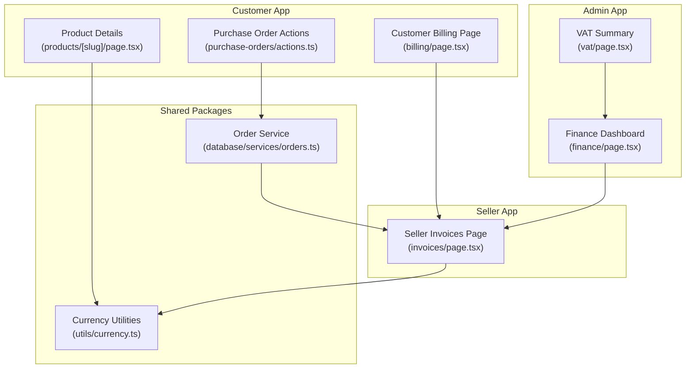
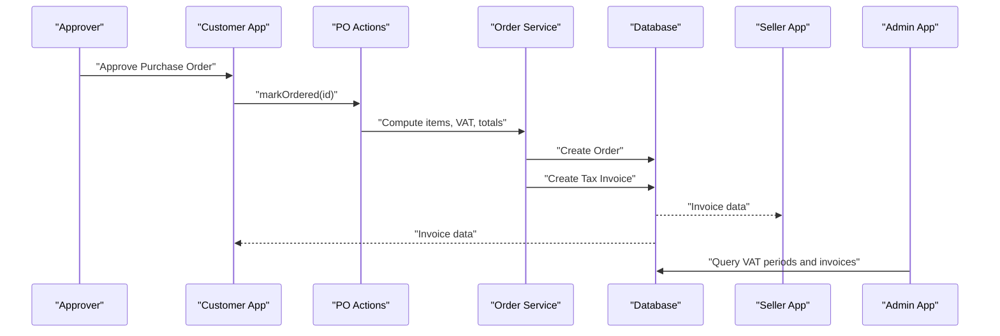
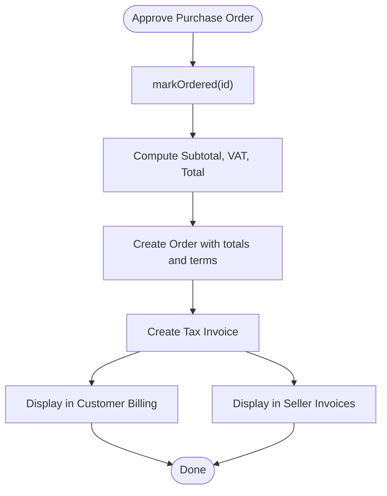
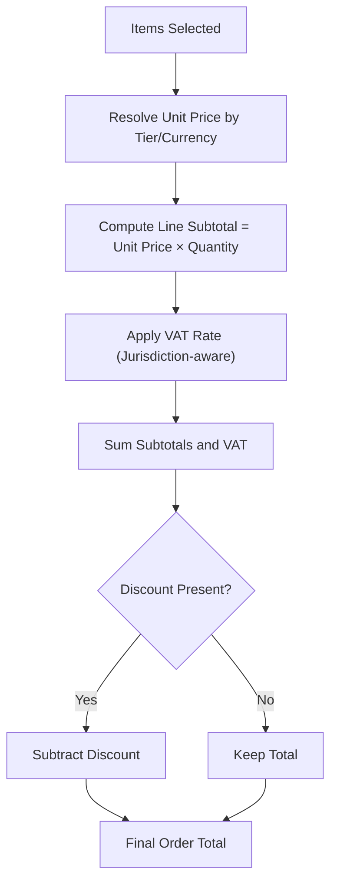
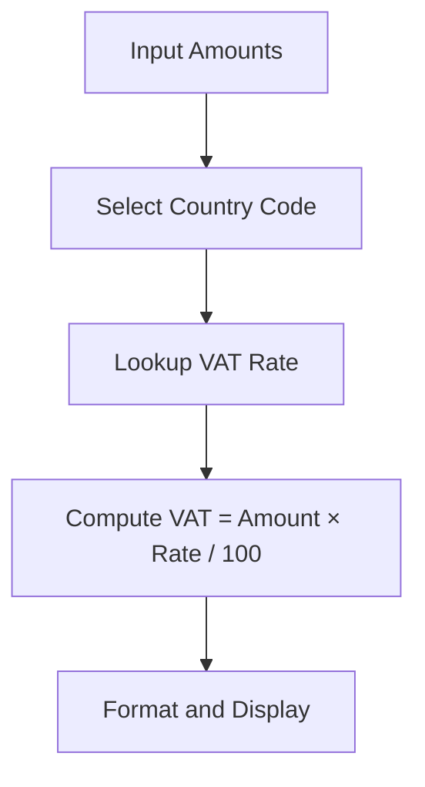
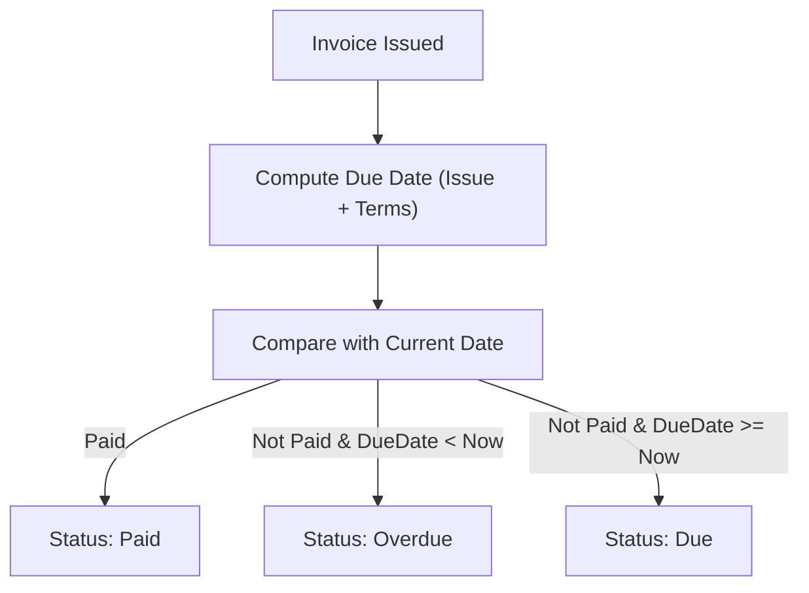
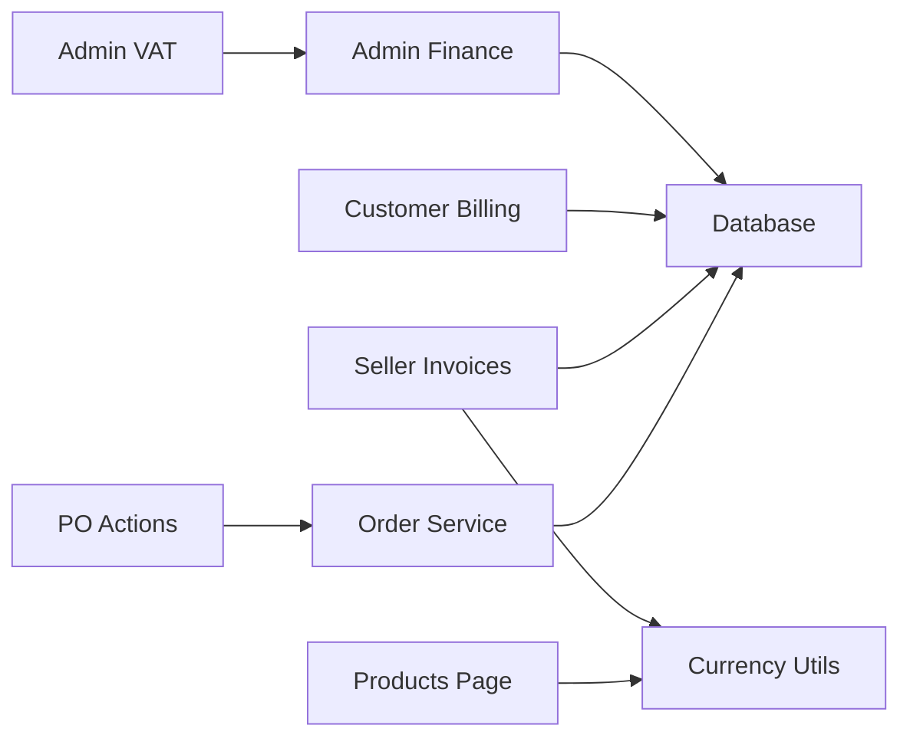

# Invoice Generation

<cite>
**Referenced Files in This Document**
- [page.tsx](file://apps/seller/src/app/invoices/page.tsx)
- [page.tsx](file://apps/customer/src/app/b2b/billing/page.tsx)
- [page.tsx](file://apps/admin/src/app/vat/page.tsx)
- [page.tsx](file://apps/admin/src/app/finance/page.tsx)
- [actions.ts](file://apps/customer/src/app/b2b/purchase-orders/actions.ts)
- [orders.ts](file://packages/database/src/services/orders.ts)
- [currency.ts](file://packages/utils/src/currency.ts)
- [page.tsx](file://apps/customer/src/app/products/[slug]/page.tsx)
- [page.tsx](file://apps/seller/src/app/quotes/submit/page.tsx)
</cite>

## Table of Contents
1. [Introduction](#introduction)
2. [Project Structure](#project-structure)
3. [Core Components](#core-components)
4. [Architecture Overview](#architecture-overview)
5. [Detailed Component Analysis](#detailed-component-analysis)
6. [Dependency Analysis](#dependency-analysis)
7. [Performance Considerations](#performance-considerations)
8. [Troubleshooting Guide](#troubleshooting-guide)
9. [Conclusion](#conclusion)
10. [Appendices](#appendices)

## Introduction
This document describes the Invoice Generation system across the Avenick commerce platform. It covers invoice templates, custom branding, and formatting options; automated invoice creation triggered by order completion and purchase order placement; invoice line items, quantity calculations, unit pricing, and discount application; tax calculation integration with VAT and local tax jurisdictions; invoice status tracking, payment reminders, and late fee automation; invoice archiving, retrieval, and export capabilities; invoice corrections, credit notes, and voiding procedures; and multi-currency invoicing and exchange rate handling.

## Project Structure
The invoice system spans three application surfaces:
- Customer B2B Billing: displays buyer-side invoices, payment terms, aging, and download actions.
- Seller Invoices: displays seller-side invoices, totals, and statuses.
- Admin Finance/VAT: provides finance dashboards and VAT reporting summaries.

Key modules involved:
- Purchase order placement and invoice generation pipeline.
- Order service for line-item computation and VAT aggregation.
- Currency utilities for VAT calculation and formatting.
- Product pages for pricing and VAT visibility.

**Diagram sources**
- [page.tsx](file://apps/customer/src/app/b2b/billing/page.tsx)
- [actions.ts](file://apps/customer/src/app/b2b/purchase-orders/actions.ts)
- [page.tsx](file://apps/seller/src/app/invoices/page.tsx)
- [page.tsx](file://apps/admin/src/app/finance/page.tsx)
- [page.tsx](file://apps/admin/src/app/vat/page.tsx)
- [orders.ts](file://packages/database/src/services/orders.ts)
- [currency.ts](file://packages/utils/src/currency.ts)
- [page.tsx](file://apps/customer/src/app/products/[slug]/page.tsx)

**Section sources**
- [page.tsx](file://apps/customer/src/app/b2b/billing/page.tsx)
- [page.tsx](file://apps/seller/src/app/invoices/page.tsx)
- [page.tsx](file://apps/admin/src/app/finance/page.tsx)
- [page.tsx](file://apps/admin/src/app/vat/page.tsx)
- [actions.ts](file://apps/customer/src/app/b2b/purchase-orders/actions.ts)
- [orders.ts](file://packages/database/src/services/orders.ts)
- [currency.ts](file://packages/utils/src/currency.ts)
- [page.tsx](file://apps/customer/src/app/products/[slug]/page.tsx)

## Core Components
- Automated invoice creation triggered by purchase order approval and placement, which creates orders and tax invoices.
- Line-item computation with unit pricing, quantity, and jurisdiction-specific VAT rates.
- Buyer-side invoice listing with due dates, payment status, and download actions.
- Seller-side invoice listing with buyer/company info, totals, and statuses.
- VAT summary and finance reporting for administrative oversight.
- Currency utilities for VAT calculation and formatted display.

**Section sources**
- [actions.ts](file://apps/customer/src/app/b2b/purchase-orders/actions.ts)
- [orders.ts](file://packages/database/src/services/orders.ts)
- [page.tsx](file://apps/customer/src/app/b2b/billing/page.tsx)
- [page.tsx](file://apps/seller/src/app/invoices/page.tsx)
- [page.tsx](file://apps/admin/src/app/vat/page.tsx)
- [page.tsx](file://apps/admin/src/app/finance/page.tsx)
- [currency.ts](file://packages/utils/src/currency.ts)

## Architecture Overview
The invoice lifecycle begins when a purchase order is approved. The system creates an order with computed subtotal, VAT, and total, then issues a tax invoice. Both buyer and seller surfaces display the invoice with status and due date. VAT reporting aggregates open periods and net liabilities.

**Diagram sources**
- [actions.ts](file://apps/customer/src/app/b2b/purchase-orders/actions.ts)
- [orders.ts](file://packages/database/src/services/orders.ts)
- [page.tsx](file://apps/seller/src/app/invoices/page.tsx)
- [page.tsx](file://apps/customer/src/app/b2b/billing/page.tsx)
- [page.tsx](file://apps/admin/src/app/vat/page.tsx)

## Detailed Component Analysis

### Automated Invoice Creation Pipeline
- Purchase order approval triggers order creation and invoice issuance.
- Jurisdiction-specific VAT rates are applied per line item and aggregated.
- Payment terms are set from company preferences; due dates are computed accordingly.

**Diagram sources**
- [actions.ts](file://apps/customer/src/app/b2b/purchase-orders/actions.ts)
- [orders.ts](file://packages/database/src/services/orders.ts)
- [page.tsx](file://apps/customer/src/app/b2b/billing/page.tsx)
- [page.tsx](file://apps/seller/src/app/invoices/page.tsx)

**Section sources**
- [actions.ts](file://apps/customer/src/app/b2b/purchase-orders/actions.ts)
- [orders.ts](file://packages/database/src/services/orders.ts)
- [page.tsx](file://apps/customer/src/app/b2b/billing/page.tsx)
- [page.tsx](file://apps/seller/src/app/invoices/page.tsx)

### Invoice Line Items, Quantity, Unit Pricing, and Discounts
- Line items compute subtotal per item, apply VAT based on product tier and jurisdiction, and sum totals.
- Discount application reduces order total after VAT calculation.
- Product pages show unit prices and VAT per unit for transparency.

**Diagram sources**
- [orders.ts](file://packages/database/src/services/orders.ts)
- [page.tsx](file://apps/customer/src/app/products/[slug]/page.tsx)

**Section sources**
- [orders.ts](file://packages/database/src/services/orders.ts)
- [page.tsx](file://apps/customer/src/app/products/[slug]/page.tsx)

### Tax Calculation Integration (VAT, GST, Local Jurisdictions)
- VAT rates are derived from country codes; defaults are applied when unspecified.
- VAT is calculated on subtotal, shipping, and discounts where applicable.
- Finance and VAT dashboards summarize net VAT due and open periods.

**Diagram sources**
- [currency.ts](file://packages/utils/src/currency.ts)
- [page.tsx](file://apps/admin/src/app/vat/page.tsx)
- [page.tsx](file://apps/admin/src/app/finance/page.tsx)

**Section sources**
- [currency.ts](file://packages/utils/src/currency.ts)
- [page.tsx](file://apps/admin/src/app/vat/page.tsx)
- [page.tsx](file://apps/admin/src/app/finance/page.tsx)

### Invoice Status Tracking, Payment Reminders, and Late Fee Automation
- Statuses include Paid, Due, and Overdue, computed from issued date plus payment terms.
- Aging buckets categorize receivables by days overdue.
- Late fees are not explicitly modeled in the current code; overdue reminders can be surfaced via UI.

**Diagram sources**
- [page.tsx](file://apps/customer/src/app/b2b/billing/page.tsx)
- [page.tsx](file://apps/seller/src/app/invoices/page.tsx)

**Section sources**
- [page.tsx](file://apps/customer/src/app/b2b/billing/page.tsx)
- [page.tsx](file://apps/seller/src/app/invoices/page.tsx)

### Invoice Archiving, Retrieval, and Export Capabilities
- Invoices are retrieved and paginated by recent activity for both buyer and seller views.
- Export actions are present in VAT summary and finance dashboards for reporting.
- PDF download actions are exposed in invoice listings for immediate retrieval.

**Section sources**
- [page.tsx](file://apps/seller/src/app/invoices/page.tsx)
- [page.tsx](file://apps/customer/src/app/b2b/billing/page.tsx)
- [page.tsx](file://apps/admin/src/app/vat/page.tsx)
- [page.tsx](file://apps/admin/src/app/finance/page.tsx)

### Invoice Corrections, Credit Notes, and Voiding Procedures
- No explicit credit note or voiding logic is visible in the current codebase.
- Recommended extension points include adding credit note records linked to invoices and void flags with audit trails.

[No sources needed since this section provides general guidance]

### Multi-Currency Invoicing and Exchange Rate Handling
- Purchase orders and orders carry currency fields; VAT rates differ by currency (e.g., SAR vs AED).
- Currency utilities provide formatting and VAT calculation helpers.
- Exchange rate handling is not implemented in the current code; future enhancements could include rate lookup and conversion for reporting.

**Section sources**
- [actions.ts](file://apps/customer/src/app/b2b/purchase-orders/actions.ts)
- [orders.ts](file://packages/database/src/services/orders.ts)
- [currency.ts](file://packages/utils/src/currency.ts)

## Dependency Analysis
- Purchase order actions depend on order service for pricing and VAT computation.
- Invoice listing pages depend on database queries returning tax invoices joined with order and company data.
- Finance and VAT dashboards rely on mock datasets and currency utilities for reporting.
- Product pages expose pricing and VAT visibility to inform buyer expectations.

**Diagram sources**
- [actions.ts](file://apps/customer/src/app/b2b/purchase-orders/actions.ts)
- [orders.ts](file://packages/database/src/services/orders.ts)
- [page.tsx](file://apps/seller/src/app/invoices/page.tsx)
- [page.tsx](file://apps/customer/src/app/b2b/billing/page.tsx)
- [page.tsx](file://apps/admin/src/app/finance/page.tsx)
- [page.tsx](file://apps/admin/src/app/vat/page.tsx)
- [page.tsx](file://apps/customer/src/app/products/[slug]/page.tsx)
- [currency.ts](file://packages/utils/src/currency.ts)

**Section sources**
- [actions.ts](file://apps/customer/src/app/b2b/purchase-orders/actions.ts)
- [orders.ts](file://packages/database/src/services/orders.ts)
- [page.tsx](file://apps/seller/src/app/invoices/page.tsx)
- [page.tsx](file://apps/customer/src/app/b2b/billing/page.tsx)
- [page.tsx](file://apps/admin/src/app/finance/page.tsx)
- [page.tsx](file://apps/admin/src/app/vat/page.tsx)
- [page.tsx](file://apps/customer/src/app/products/[slug]/page.tsx)
- [currency.ts](file://packages/utils/src/currency.ts)

## Performance Considerations
- Batch retrieval of invoices with includes minimizes round-trips; consider pagination and indexing on issued date and payment status.
- VAT computations are precise but should avoid redundant recalculations; cache jurisdiction rates where appropriate.
- Currency formatting is localized; ensure locale selection is consistent across buyer and seller views.

[No sources needed since this section provides general guidance]

## Troubleshooting Guide
- If invoices do not appear after purchase order approval, verify the order creation and invoice creation steps in the purchase order actions.
- If VAT amounts are incorrect, confirm jurisdiction-specific rates and tier resolution in the order service.
- If payment terms or due dates are wrong, check company payment terms and invoice issuance date logic.
- If currency formatting appears inconsistent, verify locale and currency code usage in formatting utilities.

**Section sources**
- [actions.ts](file://apps/customer/src/app/b2b/purchase-orders/actions.ts)
- [orders.ts](file://packages/database/src/services/orders.ts)
- [page.tsx](file://apps/customer/src/app/b2b/billing/page.tsx)
- [currency.ts](file://packages/utils/src/currency.ts)

## Conclusion
The Invoice Generation system integrates purchase order approval, order creation, and tax invoice issuance with robust buyer and seller views. VAT computation aligns with jurisdiction-specific rates, and finance/VAT dashboards support administrative oversight. Areas for enhancement include credit notes/voiding, late fee automation, and multi-currency exchange rate handling.

[No sources needed since this section summarizes without analyzing specific files]

## Appendices
- Custom Branding and Formatting Options: Invoice templates and branding are not implemented in the current codebase. Future work should define template rendering and brand assets integration.
- Subscription Renewals and Service Delivery: Not covered in the current codebase; would require separate workflows and invoice triggers aligned with recurring billing systems.

[No sources needed since this section provides general guidance]