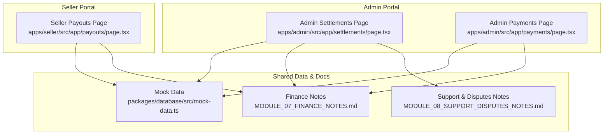
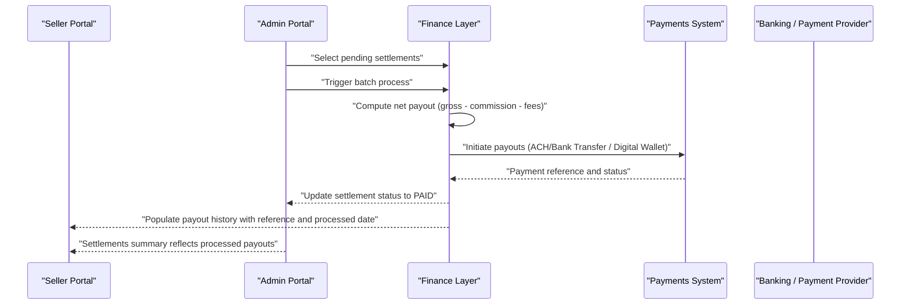
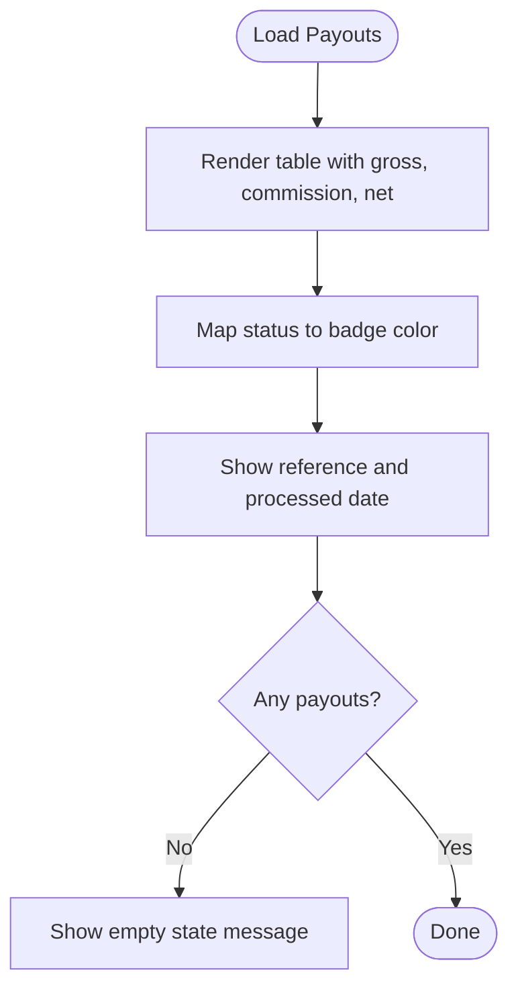
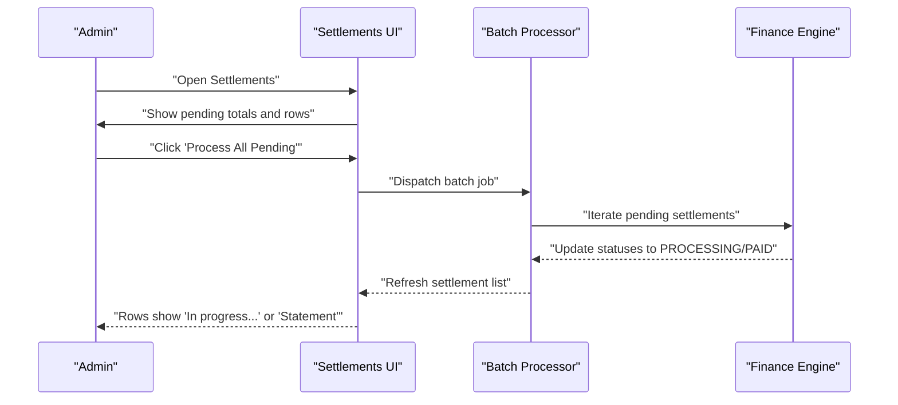
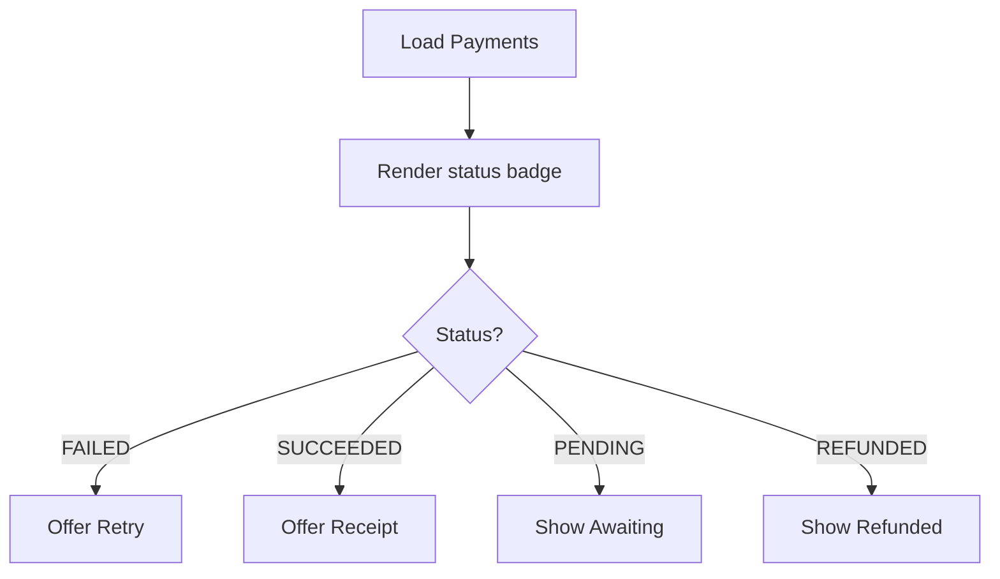
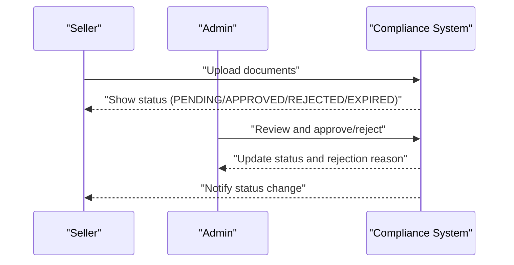
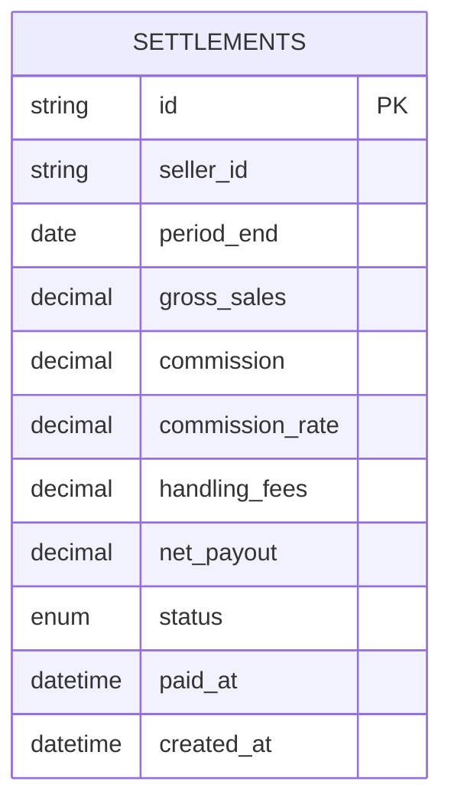
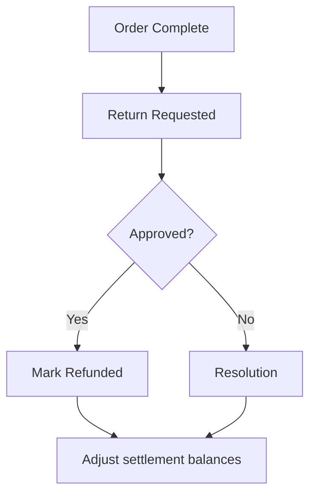
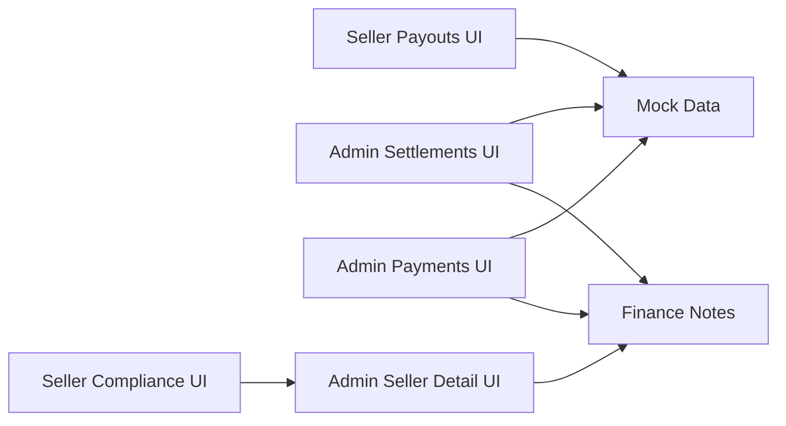

# Payout Processing

<cite>
**Referenced Files in This Document**
- [page.tsx](file://apps/seller/src/app/payouts/page.tsx)
- [page.tsx](file://apps/admin/src/app/settlements/page.tsx)
- [MODULE_07_FINANCE_NOTES.md](file://MODULE_07_FINANCE_NOTES.md)
- [MODULE_08_SUPPORT_DISPUTES_NOTES.md](file://MODULE_08_SUPPORT_DISPUTES_NOTES.md)
- [page.tsx](file://apps/admin/src/app/payments/page.tsx)
- [page.tsx](file://apps/seller/src/app/compliance/page.tsx)
- [page.tsx](file://apps/admin/src/app/sellers/[id]/page.tsx)
- [mock-data.ts](file://packages/database/src/mock-data.ts)
- [migration.sql](file://packages/database/prisma/migrations/20260601020742_add_shipments_returns/migration.sql)
- [page.tsx](file://apps/customer/src/app/b2b/purchase-orders/actions.ts)
</cite>

## Table of Contents
1. [Introduction](#introduction)
2. [Project Structure](#project-structure)
3. [Core Components](#core-components)
4. [Architecture Overview](#architecture-overview)
5. [Detailed Component Analysis](#detailed-component-analysis)
6. [Dependency Analysis](#dependency-analysis)
7. [Performance Considerations](#performance-considerations)
8. [Troubleshooting Guide](#troubleshooting-guide)
9. [Conclusion](#conclusion)
10. [Appendices](#appendices)

## Introduction
This document describes the Payout Processing system within the commerce platform. It covers automated payout scheduling, batch processing, and payment distribution workflows as reflected in the current frontend views and supporting documentation. It also outlines bank account integration, ACH transfers, and digital wallet connections conceptually, along with payout thresholds, minimum amounts, and fee structures. The document details payout tracking with status updates, confirmation receipts, and error handling, and includes payout analytics with frequency analysis, amount distributions, and processing times. Finally, it addresses compliance requirements for payment processing, KYC verification, and regulatory reporting, and outlines dispute resolution, reversals, and refund procedures.

## Project Structure
The payout and settlement functionality is primarily exposed via two applications:
- Seller portal: displays payout history, status, and reference numbers.
- Admin portal: manages supplier settlements, batch processing controls, and settlement summaries.

**Diagram sources**
- [page.tsx](file://apps/seller/src/app/payouts/page.tsx)
- [page.tsx](file://apps/admin/src/app/settlements/page.tsx)
- [page.tsx](file://apps/admin/src/app/payments/page.tsx)
- [mock-data.ts](file://packages/database/src/mock-data.ts)
- [MODULE_07_FINANCE_NOTES.md](file://MODULE_07_FINANCE_NOTES.md)
- [MODULE_08_SUPPORT_DISPUTES_NOTES.md](file://MODULE_08_SUPPORT_DISPUTES_NOTES.md)

**Section sources**
- [page.tsx](file://apps/seller/src/app/payouts/page.tsx)
- [page.tsx](file://apps/admin/src/app/settlements/page.tsx)
- [page.tsx](file://apps/admin/src/app/payments/page.tsx)
- [MODULE_07_FINANCE_NOTES.md](file://MODULE_07_FINANCE_NOTES.md)
- [MODULE_08_SUPPORT_DISPUTES_NOTES.md](file://MODULE_08_SUPPORT_DISPUTES_NOTES.md)
- [mock-data.ts](file://packages/database/src/mock-data.ts)

## Core Components
- Payout History View (Seller): Lists payout periods, gross, commission, net, status, reference, and processed date.
- Settlements Dashboard (Admin): Summarizes pending payouts, allows batch “Pay Now” actions, and shows settlement status per supplier.
- Payments Dashboard (Admin): Shows payment statuses and actions such as retry or receipt retrieval.
- Compliance and Document Management: Supports KYC and regulatory document uploads and reviews.
- Mock Data and Finance Notes: Define settlement schema, statuses, and processing mechanics.

Key responsibilities:
- Display historical and current payout periods and statuses.
- Enable batch settlement processing from the admin interface.
- Track payment status and provide receipts or retry actions.
- Manage compliance documents and status indicators.

**Section sources**
- [page.tsx](file://apps/seller/src/app/payouts/page.tsx)
- [page.tsx](file://apps/admin/src/app/settlements/page.tsx)
- [page.tsx](file://apps/admin/src/app/payments/page.tsx)
- [page.tsx](file://apps/seller/src/app/compliance/page.tsx)
- [page.tsx](file://apps/admin/src/app/sellers/[id]/page.tsx)
- [MODULE_07_FINANCE_NOTES.md](file://MODULE_07_FINANCE_NOTES.md)
- [mock-data.ts](file://packages/database/src/mock-data.ts)

## Architecture Overview
The payout lifecycle spans order settlement, calculation of gross minus commission and handling fees, creation of settlement records, and payment distribution. The admin portal orchestrates batch processing, while the seller portal surfaces historical payouts.

**Diagram sources**
- [page.tsx](file://apps/admin/src/app/settlements/page.tsx)
- [page.tsx](file://apps/seller/src/app/payouts/page.tsx)
- [MODULE_07_FINANCE_NOTES.md](file://MODULE_07_FINANCE_NOTES.md)

## Detailed Component Analysis

### Payout History View (Seller)
- Purpose: Display past and current payout periods with calculated amounts and status.
- Data fields: Period range, gross, commission, net, status badge, reference number, processed date.
- Behavior: Shows empty state messaging when no payouts exist; indicates payouts are issued upon order settlement.

**Diagram sources**
- [page.tsx](file://apps/seller/src/app/payouts/page.tsx)

**Section sources**
- [page.tsx](file://apps/seller/src/app/payouts/page.tsx)

### Settlements Dashboard (Admin)
- Purpose: Manage supplier payouts, summarize pending amounts, and enable batch processing.
- Features:
  - Pending payouts summary and “Process All Pending” action.
  - Per-settlement actions: “Pay Now”, “In progress…” indicator, “Statement” for paid.
  - Footer note indicating bi-weekly processing and net payout formula.

**Diagram sources**
- [page.tsx](file://apps/admin/src/app/settlements/page.tsx)
- [MODULE_07_FINANCE_NOTES.md](file://MODULE_07_FINANCE_NOTES.md)

**Section sources**
- [page.tsx](file://apps/admin/src/app/settlements/page.tsx)
- [MODULE_07_FINANCE_NOTES.md](file://MODULE_07_FINANCE_NOTES.md)

### Payments Dashboard (Admin)
- Purpose: Monitor payment statuses and take remediation actions.
- Capabilities:
  - Show payment status badges.
  - Offer “Retry” for failed payments.
  - Provide “Receipt” for succeeded payments.

**Diagram sources**
- [page.tsx](file://apps/admin/src/app/payments/page.tsx)

**Section sources**
- [page.tsx](file://apps/admin/src/app/payments/page.tsx)

### Compliance and KYC (Seller and Admin)
- Purpose: Ensure KYC and regulatory document compliance for payouts.
- Seller view: Lists uploaded documents, expiry warnings, and rejection reasons.
- Admin view: Approves or rejects documents for sellers, with external document links.

**Diagram sources**
- [page.tsx](file://apps/seller/src/app/compliance/page.tsx)
- [page.tsx](file://apps/admin/src/app/sellers/[id]/page.tsx)

**Section sources**
- [page.tsx](file://apps/seller/src/app/compliance/page.tsx)
- [page.tsx](file://apps/admin/src/app/sellers/[id]/page.tsx)

### Mock Data and Settlement Schema
- Mock settlements demonstrate typical fields: seller, gross sales, commission, commission rate, handling fees, net payout, status, period end, and order counts.
- Finance notes define the settlement table schema and processing mechanics.

**Diagram sources**
- [mock-data.ts](file://packages/database/src/mock-data.ts)
- [MODULE_07_FINANCE_NOTES.md](file://MODULE_07_FINANCE_NOTES.md)

**Section sources**
- [mock-data.ts](file://packages/database/src/mock-data.ts)
- [MODULE_07_FINANCE_NOTES.md](file://MODULE_07_FINANCE_NOTES.md)

### Returns and Refunds (Support & Disputes)
- While not direct payouts, returns and refunds impact cash flows and settlement balances.
- Return requests and refund workflows are documented for future implementation.

**Diagram sources**
- [MODULE_08_SUPPORT_DISPUTES_NOTES.md](file://MODULE_08_SUPPORT_DISPUTES_NOTES.md)

**Section sources**
- [MODULE_08_SUPPORT_DISPUTES_NOTES.md](file://MODULE_08_SUPPORT_DISPUTES_NOTES.md)

## Dependency Analysis
- UI components depend on mock data and shared finance notes for schema and processing rules.
- Admin settlement actions drive backend finance calculations and payment initiation.
- Compliance status affects eligibility for payouts.

**Diagram sources**
- [page.tsx](file://apps/seller/src/app/payouts/page.tsx)
- [page.tsx](file://apps/admin/src/app/settlements/page.tsx)
- [page.tsx](file://apps/admin/src/app/payments/page.tsx)
- [page.tsx](file://apps/seller/src/app/compliance/page.tsx)
- [page.tsx](file://apps/admin/src/app/sellers/[id]/page.tsx)
- [MODULE_07_FINANCE_NOTES.md](file://MODULE_07_FINANCE_NOTES.md)
- [mock-data.ts](file://packages/database/src/mock-data.ts)

**Section sources**
- [page.tsx](file://apps/seller/src/app/payouts/page.tsx)
- [page.tsx](file://apps/admin/src/app/settlements/page.tsx)
- [page.tsx](file://apps/admin/src/app/payments/page.tsx)
- [page.tsx](file://apps/seller/src/app/compliance/page.tsx)
- [page.tsx](file://apps/admin/src/app/sellers/[id]/page.tsx)
- [MODULE_07_FINANCE_NOTES.md](file://MODULE_07_FINANCE_NOTES.md)
- [mock-data.ts](file://packages/database/src/mock-data.ts)

## Performance Considerations
- Batch processing: Group pending settlements to minimize repeated API calls and reduce latency.
- Pagination and virtualization: For large datasets, paginate settlement lists and virtualize long tables.
- Caching: Cache frequently accessed settlement summaries and status counts.
- Asynchronous updates: Use polling or server-sent events to update settlement statuses without reload.

## Troubleshooting Guide
- Payouts not appearing:
  - Verify settlement status transitions from PENDING to PROCESSING to PAID.
  - Confirm processed dates and reference numbers are populated after payment initiation.
- Failed payments:
  - Use the “Retry” action on failed payments in the admin payments view.
  - Check payment gateway logs and reconciliation reports.
- Compliance issues affecting payouts:
  - Ensure required documents are approved and not expired.
  - Resolve rejection reasons promptly to avoid delays.
- Disputes and refunds:
  - Investigate open disputes and resolve according to policy.
  - Mark returns as refunded to adjust settlement balances.

**Section sources**
- [page.tsx](file://apps/admin/src/app/payments/page.tsx)
- [page.tsx](file://apps/seller/src/app/compliance/page.tsx)
- [MODULE_08_SUPPORT_DISPUTES_NOTES.md](file://MODULE_08_SUPPORT_DISPUTES_NOTES.md)

## Conclusion
The Payout Processing system currently provides a clear view of payout history for sellers and batch settlement controls for admins, with supporting compliance and payments dashboards. The finance notes and mock data define the settlement schema and processing mechanics. Future enhancements should focus on automating payout scheduling, integrating bank account and digital wallet providers, implementing robust error handling and retries, and adding analytics for frequency, distributions, and processing times.

## Appendices

### Bank Account Integration and Payment Methods
- Supported methods indicated in payments documentation include bank transfer, credit card, mada, Apple Pay, and credit terms.
- Settlements specify bank transfer as a payment method for B2B orders.

**Section sources**
- [MODULE_07_FINANCE_NOTES.md](file://MODULE_07_FINANCE_NOTES.md)
- [page.tsx](file://apps/customer/src/app/b2b/purchase-orders/actions.ts)

### ACH Transfers
- Settlements note bank transfer as a payment method for B2B orders; ACH is commonly used for bank transfers in North America and aligns with bank transfer semantics.

**Section sources**
- [page.tsx](file://apps/customer/src/app/b2b/purchase-orders/actions.ts)

### Digital Wallet Connections
- Payment methods include Apple Pay; digital wallets can be integrated similarly to card payments.

**Section sources**
- [MODULE_07_FINANCE_NOTES.md](file://MODULE_07_FINANCE_NOTES.md)

### Payout Thresholds, Minimum Amounts, and Fees
- Settlements include handling fees and commission; net payout equals gross minus commission and handling fees.
- Minimum thresholds and fee structures are not defined in the current documentation and should be configured in the finance engine.

**Section sources**
- [MODULE_07_FINANCE_NOTES.md](file://MODULE_07_FINANCE_NOTES.md)
- [mock-data.ts](file://packages/database/src/mock-data.ts)

### Payout Tracking, Status Updates, and Receipts
- Status badges reflect PENDING, PROCESSING, PAID, FAILED, REFUNDED.
- Admin payments view offers “Receipt” for succeeded payments and “Retry” for failed payments.

**Section sources**
- [page.tsx](file://apps/admin/src/app/payments/page.tsx)
- [page.tsx](file://apps/seller/src/app/payouts/page.tsx)

### Analytics: Frequency, Amount Distributions, and Processing Times
- Settlements include period end and order counts; analytics can be derived from these fields.
- Finance notes indicate bi-weekly settlement processing cadence.

**Section sources**
- [page.tsx](file://apps/admin/src/app/settlements/page.tsx)
- [MODULE_07_FINANCE_NOTES.md](file://MODULE_07_FINANCE_NOTES.md)
- [mock-data.ts](file://packages/database/src/mock-data.ts)

### Compliance, KYC, and Regulatory Reporting
- Compliance pages support document uploads, expiry tracking, and admin review.
- Finance notes outline settlement schema suitable for regulatory reporting.

**Section sources**
- [page.tsx](file://apps/seller/src/app/compliance/page.tsx)
- [page.tsx](file://apps/admin/src/app/sellers/[id]/page.tsx)
- [MODULE_07_FINANCE_NOTES.md](file://MODULE_07_FINANCE_NOTES.md)

### Disputes, Reversals, and Refunds
- Returns and refunds impact cash flows; returns workflow includes request, approval, and marking refunded.
- Disputes schema supports resolution paths that may affect payouts.

**Section sources**
- [MODULE_08_SUPPORT_DISPUTES_NOTES.md](file://MODULE_08_SUPPORT_DISPUTES_NOTES.md)
- [migration.sql](file://packages/database/prisma/migrations/20260601020742_add_shipments_returns/migration.sql)