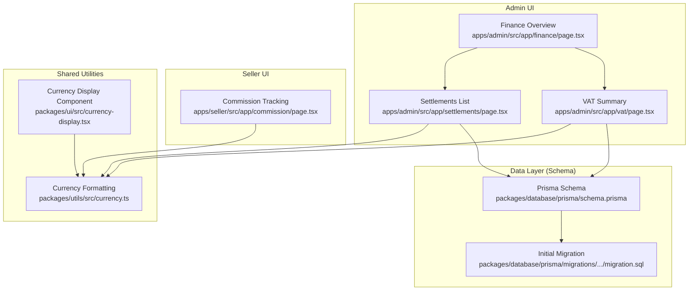
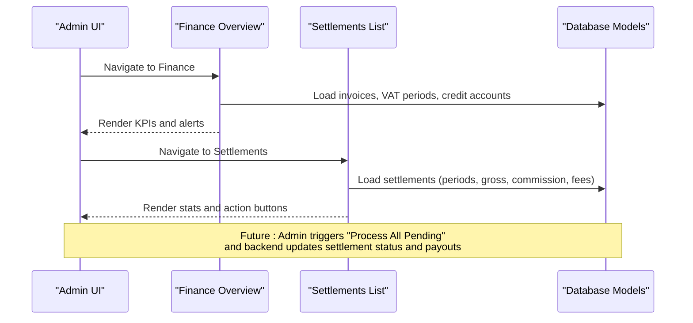
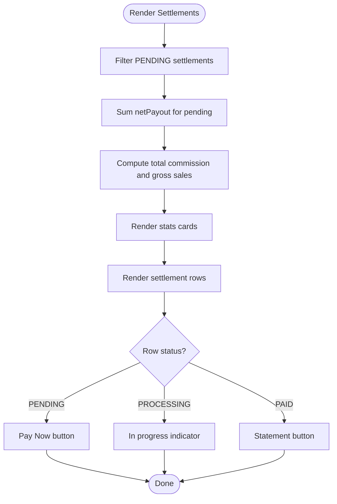
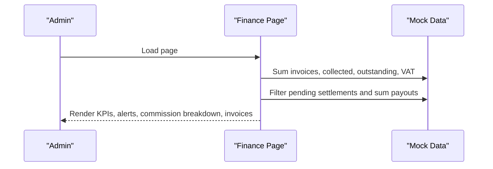
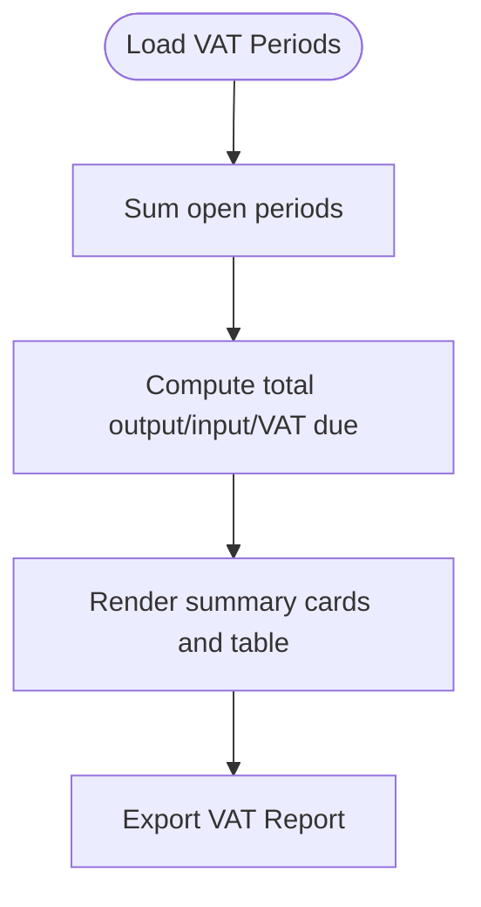
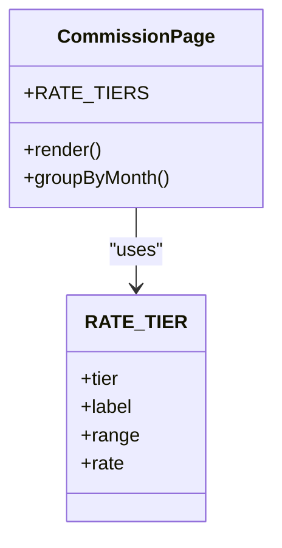
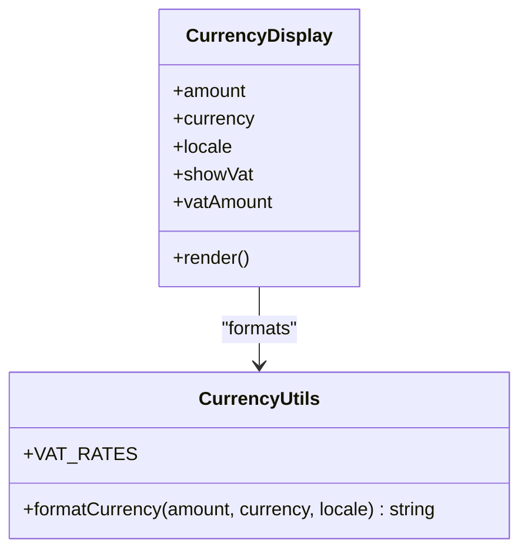
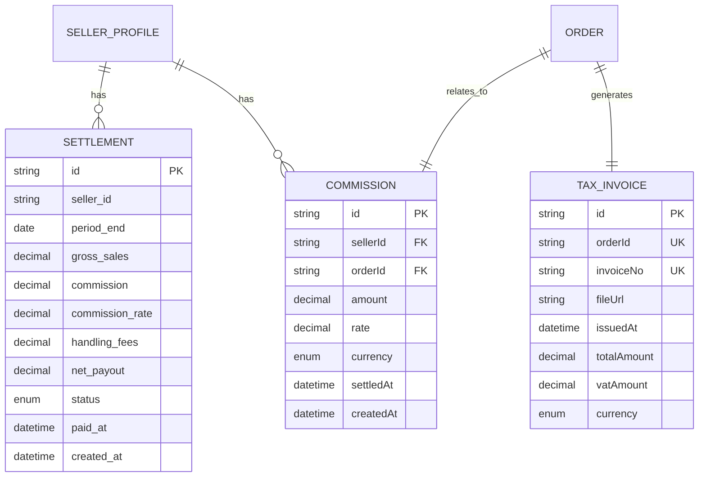
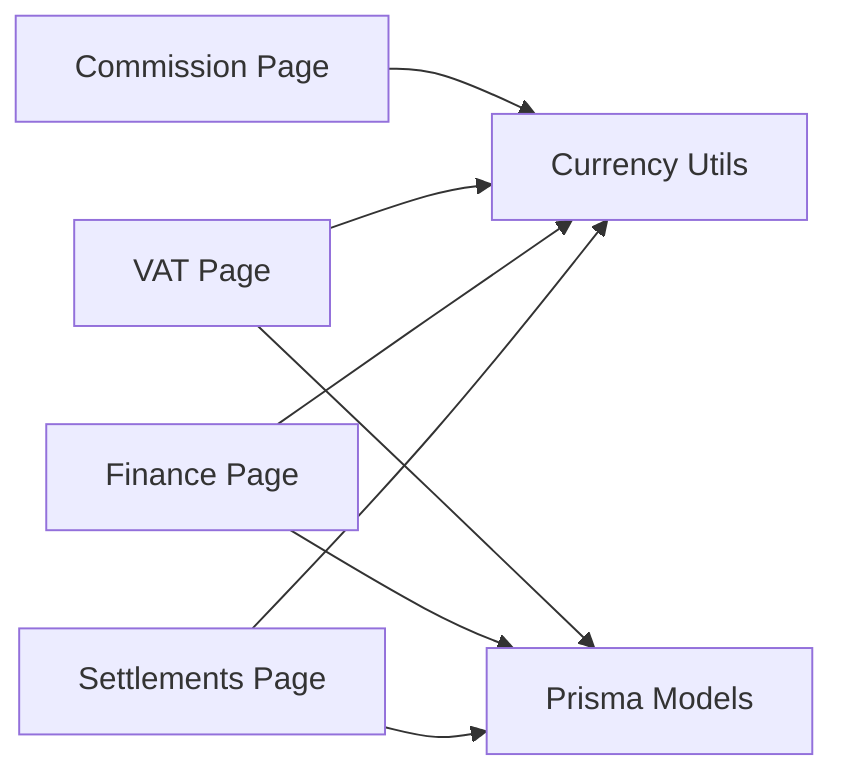

# Settlement Processing

<cite>
**Referenced Files in This Document**
- [apps/admin/src/app/finance/page.tsx](file://apps/admin/src/app/finance/page.tsx)
- [apps/admin/src/app/settlements/page.tsx](file://apps/admin/src/app/settlements/page.tsx)
- [apps/admin/src/app/vat/page.tsx](file://apps/admin/src/app/vat/page.tsx)
- [apps/seller/src/app/commission/page.tsx](file://apps/seller/src/app/commission/page.tsx)
- [packages/utils/src/currency.ts](file://packages/utils/src/currency.ts)
- [packages/ui/src/currency-display.tsx](file://packages/ui/src/currency-display.tsx)
- [MODULE_07_FINANCE_NOTES.md](file://MODULE_07_FINANCE_NOTES.md)
- [packages/database/prisma/schema.prisma](file://packages/database/prisma/schema.prisma)
- [packages/database/prisma/migrations/20260530234542_init_avenick_schema/migration.sql](file://packages/database/prisma/migrations/20260530234542_init_avenick_schema/migration.sql)
</cite>

## Table of Contents
1. [Introduction](#introduction)
2. [Project Structure](#project-structure)
3. [Core Components](#core-components)
4. [Architecture Overview](#architecture-overview)
5. [Detailed Component Analysis](#detailed-component-analysis)
6. [Dependency Analysis](#dependency-analysis)
7. [Performance Considerations](#performance-considerations)
8. [Troubleshooting Guide](#troubleshooting-guide)
9. [Conclusion](#conclusion)
10. [Appendices](#appendices)

## Introduction
This document describes the Settlement Processing system within the Avenick commerce platform. It covers settlement cycles, reconciliation, and revenue distribution for a multi-seller marketplace. It also documents settlement reporting, dispute and reserve handling, analytics, and integration touchpoints with accounting and tax systems. The current implementation is primarily UI-driven with mock data, and future work will integrate with persistent data models and backend services.

## Project Structure
The settlement-related functionality spans three primary areas:
- Admin Finance dashboards for oversight and actions
- Settlement listing and processing controls
- VAT reporting and tax summary
- Seller commission tracking and visibility
- Currency formatting and localization utilities
- Database schema and migration definitions for future persistence

**Diagram sources**
- [apps/admin/src/app/finance/page.tsx:10-154](file://apps/admin/src/app/finance/page.tsx#L10-L154)
- [apps/admin/src/app/settlements/page.tsx:18-133](file://apps/admin/src/app/settlements/page.tsx#L18-L133)
- [apps/admin/src/app/vat/page.tsx:15-49](file://apps/admin/src/app/vat/page.tsx#L15-L49)
- [apps/seller/src/app/commission/page.tsx:16-31](file://apps/seller/src/app/commission/page.tsx#L16-L31)
- [packages/utils/src/currency.ts:1-40](file://packages/utils/src/currency.ts#L1-L40)
- [packages/ui/src/currency-display.tsx:24-45](file://packages/ui/src/currency-display.tsx#L24-L45)
- [packages/database/prisma/schema.prisma:1019-1047](file://packages/database/prisma/schema.prisma#L1019-L1047)
- [packages/database/prisma/migrations/20260530234542_init_avenick_schema/migration.sql:646-657](file://packages/database/prisma/migrations/20260530234542_init_avenick_schema/migration.sql#L646-L657)

**Section sources**
- [apps/admin/src/app/finance/page.tsx:10-154](file://apps/admin/src/app/finance/page.tsx#L10-L154)
- [apps/admin/src/app/settlements/page.tsx:18-133](file://apps/admin/src/app/settlements/page.tsx#L18-L133)
- [apps/admin/src/app/vat/page.tsx:15-49](file://apps/admin/src/app/vat/page.tsx#L15-L49)
- [apps/seller/src/app/commission/page.tsx:16-31](file://apps/seller/src/app/commission/page.tsx#L16-L31)
- [packages/utils/src/currency.ts:1-40](file://packages/utils/src/currency.ts#L1-L40)
- [packages/ui/src/currency-display.tsx:24-45](file://packages/ui/src/currency-display.tsx#L24-L45)
- [packages/database/prisma/schema.prisma:1019-1047](file://packages/database/prisma/schema.prisma#L1019-L1047)
- [packages/database/prisma/migrations/20260530234542_init_avenick_schema/migration.sql:646-657](file://packages/database/prisma/migrations/20260530234542_init_avenick_schema/migration.sql#L646-L657)

## Core Components
- Settlements dashboard: Lists settlement periods, computes net payouts, and exposes actions to process pending payouts and view statements.
- Finance overview: Aggregates invoicing, collections, outstanding balances, VAT totals, marketplace commission breakdown, and highlights pending settlements and credit exposure.
- VAT summary: Shows open periods, output/input VAT, and net due amounts with filing reminders and export capability.
- Seller commission: Displays commission rates by tier and historical commission records grouped by month.
- Currency utilities: Centralized formatting for multiple currencies and locales, with optional VAT indicators.

Key implementation references:
- Settlements stats and net payout calculation: [apps/admin/src/app/settlements/page.tsx:21-24](file://apps/admin/src/app/settlements/page.tsx#L21-L24)
- Finance overview KPIs and alerts: [apps/admin/src/app/finance/page.tsx:13-21](file://apps/admin/src/app/finance/page.tsx#L13-L21)
- VAT summary totals and statuses: [apps/admin/src/app/vat/page.tsx:18-22](file://apps/admin/src/app/vat/page.tsx#L18-L22)
- Commission tiers and monthly grouping: [apps/seller/src/app/commission/page.tsx:9-31](file://apps/seller/src/app/commission/page.tsx#L9-L31)
- Currency formatting and VAT rates: [packages/utils/src/currency.ts:1-40](file://packages/utils/src/currency.ts#L1-L40)

**Section sources**
- [apps/admin/src/app/settlements/page.tsx:21-24](file://apps/admin/src/app/settlements/page.tsx#L21-L24)
- [apps/admin/src/app/finance/page.tsx:13-21](file://apps/admin/src/app/finance/page.tsx#L13-L21)
- [apps/admin/src/app/vat/page.tsx:18-22](file://apps/admin/src/app/vat/page.tsx#L18-L22)
- [apps/seller/src/app/commission/page.tsx:9-31](file://apps/seller/src/app/commission/page.tsx#L9-L31)
- [packages/utils/src/currency.ts:1-40](file://packages/utils/src/currency.ts#L1-L40)

## Architecture Overview
The settlement workflow is currently UI-driven with mock data. The system’s future architecture will integrate:
- Data models for payments, settlements, and tax invoices
- Backend services orchestrating settlement cycles and reconciliations
- Accounting integrations for tax reporting and financial statement generation
- Currency conversion and FX compliance for international operations

**Diagram sources**
- [apps/admin/src/app/finance/page.tsx:10-154](file://apps/admin/src/app/finance/page.tsx#L10-L154)
- [apps/admin/src/app/settlements/page.tsx:18-133](file://apps/admin/src/app/settlements/page.tsx#L18-L133)
- [packages/database/prisma/schema.prisma:1019-1047](file://packages/database/prisma/schema.prisma#L1019-L1047)

## Detailed Component Analysis

### Settlements Dashboard
Responsibilities:
- Display settlement periods and seller summaries
- Compute pending payouts and total commission
- Provide actions to process pending settlements and view statements
- Show settlement status with icons and labels

Processing logic highlights:
- Pending payouts aggregation and per-settlement net payout computation
- Bi-weekly settlement cadence and net payout formula
- Action buttons per status (Pay Now, In progress, Statement)

**Diagram sources**
- [apps/admin/src/app/settlements/page.tsx:21-24](file://apps/admin/src/app/settlements/page.tsx#L21-L24)
- [apps/admin/src/app/settlements/page.tsx:86-120](file://apps/admin/src/app/settlements/page.tsx#L86-L120)

**Section sources**
- [apps/admin/src/app/settlements/page.tsx:18-133](file://apps/admin/src/app/settlements/page.tsx#L18-L133)

### Finance Overview
Responsibilities:
- Aggregate invoicing totals, collection rate, and outstanding balances
- Surface pending settlements and credit exposure alerts
- Show marketplace commission breakdown (computed from settlements)
- Display recent invoices with buyer, type, amount, VAT, and status

**Diagram sources**
- [apps/admin/src/app/finance/page.tsx:13-21](file://apps/admin/src/app/finance/page.tsx#L13-L21)
- [apps/admin/src/app/finance/page.tsx:117-150](file://apps/admin/src/app/finance/page.tsx#L117-L150)

**Section sources**
- [apps/admin/src/app/finance/page.tsx:10-154](file://apps/admin/src/app/finance/page.tsx#L10-L154)

### VAT Summary
Responsibilities:
- Summarize open VAT periods, output/input VAT, and net due
- Display filing deadlines and enable export of VAT reports
- Support country-specific tax regimes (e.g., UAE 5%, KSA 15%)

**Diagram sources**
- [apps/admin/src/app/vat/page.tsx:18-22](file://apps/admin/src/app/vat/page.tsx#L18-L22)
- [apps/admin/src/app/vat/page.tsx:44-62](file://apps/admin/src/app/vat/page.tsx#L44-L62)

**Section sources**
- [apps/admin/src/app/vat/page.tsx:15-49](file://apps/admin/src/app/vat/page.tsx#L15-L49)

### Seller Commission Tracking
Responsibilities:
- Display commission rate tiers (Standard, Verified, Gold, Platinum)
- Show historical commission records grouped by month
- Calculate gross from commission and rate

**Diagram sources**
- [apps/seller/src/app/commission/page.tsx:9-14](file://apps/seller/src/app/commission/page.tsx#L9-L14)
- [apps/seller/src/app/commission/page.tsx:20-31](file://apps/seller/src/app/commission/page.tsx#L20-L31)

**Section sources**
- [apps/seller/src/app/commission/page.tsx:16-31](file://apps/seller/src/app/commission/page.tsx#L16-L31)

### Currency Formatting and Localization
Responsibilities:
- Centralized currency formatting with locale-aware symbols and decimal handling
- Optional VAT inclusion display
- Country-specific VAT rates for tax computations

**Diagram sources**
- [packages/utils/src/currency.ts:1-40](file://packages/utils/src/currency.ts#L1-L40)
- [packages/ui/src/currency-display.tsx:24-45](file://packages/ui/src/currency-display.tsx#L24-L45)

**Section sources**
- [packages/utils/src/currency.ts:1-40](file://packages/utils/src/currency.ts#L1-L40)
- [packages/ui/src/currency-display.tsx:24-45](file://packages/ui/src/currency-display.tsx#L24-L45)

### Database Models and Future Integration
Data models supporting settlement processing:
- Settlements: period-end, gross sales, commission, handling fees, net payout, status
- Commissions: seller, order, amount, rate, currency, settlement timestamp
- Tax invoices: order linkage, invoice number, issued date, totals, VAT, currency

**Diagram sources**
- [packages/database/prisma/schema.prisma:1019-1047](file://packages/database/prisma/schema.prisma#L1019-L1047)
- [packages/database/prisma/migrations/20260530234542_init_avenick_schema/migration.sql:646-657](file://packages/database/prisma/migrations/20260530234542_init_avenick_schema/migration.sql#L646-L657)

**Section sources**
- [packages/database/prisma/schema.prisma:1019-1047](file://packages/database/prisma/schema.prisma#L1019-L1047)
- [packages/database/prisma/migrations/20260530234542_init_avenick_schema/migration.sql:646-657](file://packages/database/prisma/migrations/20260530234542_init_avenick_schema/migration.sql#L646-L657)

## Dependency Analysis
- UI pages depend on shared currency utilities for consistent formatting.
- Settlements and Finance dashboards rely on mock datasets during the prototype phase.
- Future backend services will consume Prisma models to persist and reconcile transactions.
- VAT reporting depends on country-specific tax configurations and filing deadlines.

**Diagram sources**
- [apps/admin/src/app/settlements/page.tsx:3-4](file://apps/admin/src/app/settlements/page.tsx#L3-L4)
- [apps/admin/src/app/finance/page.tsx](file://apps/admin/src/app/finance/page.tsx#L3)
- [apps/admin/src/app/vat/page.tsx](file://apps/admin/src/app/vat/page.tsx#L3)
- [apps/seller/src/app/commission/page.tsx](file://apps/seller/src/app/commission/page.tsx#L3)
- [packages/utils/src/currency.ts:1-40](file://packages/utils/src/currency.ts#L1-L40)
- [packages/database/prisma/schema.prisma:1019-1047](file://packages/database/prisma/schema.prisma#L1019-L1047)

**Section sources**
- [apps/admin/src/app/settlements/page.tsx:3-4](file://apps/admin/src/app/settlements/page.tsx#L3-L4)
- [apps/admin/src/app/finance/page.tsx](file://apps/admin/src/app/finance/page.tsx#L3)
- [apps/admin/src/app/vat/page.tsx](file://apps/admin/src/app/vat/page.tsx#L3)
- [apps/seller/src/app/commission/page.tsx](file://apps/seller/src/app/commission/page.tsx#L3)
- [packages/utils/src/currency.ts:1-40](file://packages/utils/src/currency.ts#L1-L40)
- [packages/database/prisma/schema.prisma:1019-1047](file://packages/database/prisma/schema.prisma#L1019-L1047)

## Performance Considerations
- Current mock data reduces server load but does not reflect production-scale performance characteristics.
- Future pagination and filtering for large settlement and invoice datasets will be necessary.
- Currency formatting is client-side; ensure locale and symbol caching for repeated renders.
- VAT computations should leverage precomputed aggregates in the database to minimize UI-side sums.

## Troubleshooting Guide
Common issues and resolutions:
- Missing settlement actions: Ensure the settlement status is PENDING; “Pay Now” is only enabled for pending rows.
- Incorrect net payout: Verify the formula used in the UI matches gross minus commission and handling fees.
- VAT totals mismatch: Confirm open periods and country-specific rates are correctly applied.
- Currency display anomalies: Validate currency and locale parameters passed to formatting utilities.

Operational checks (from module notes):
- Settlements net payout math correctness verified in testing checklist.
- VAT filing deadline banners and “File Return” CTAs included in scope.
- UI-only actions for processing payouts and retrying payments pending backend integration.

**Section sources**
- [MODULE_07_FINANCE_NOTES.md:46-62](file://MODULE_07_FINANCE_NOTES.md#L46-L62)

## Conclusion
The Settlement Processing system currently provides a comprehensive front-end for managing marketplace payouts, finance KPIs, VAT reporting, and seller commission tracking. The next phase involves integrating backend services, persisting data via Prisma models, and implementing automated settlement cycles, reconciliation, and reporting. Internationalization and currency handling are centralized to support multi-region operations.

## Appendices

### Settlement Cycle and Reconciliation Procedures
- Settlement cycle cadence: Bi-weekly settlement periods with period-end dates.
- Reconciliation: Gross sales aggregated per period, minus marketplace commission and handling fees, equals net payout.
- Status lifecycle: PENDING → PROCESSING → PAID with timestamps and status indicators.

**Section sources**
- [apps/admin/src/app/settlements/page.tsx:124-128](file://apps/admin/src/app/settlements/page.tsx#L124-L128)

### Revenue Distribution Mechanisms
- Marketplace commission: Calculated as a percentage of gross sales with tiered rates for sellers.
- Handling fees: Deducted per settlement period.
- Net payout: Gross minus commission minus handling fees.

**Section sources**
- [apps/admin/src/app/settlements/page.tsx:101-107](file://apps/admin/src/app/settlements/page.tsx#L101-L107)
- [apps/seller/src/app/commission/page.tsx:9-14](file://apps/seller/src/app/commission/page.tsx#L9-L14)

### Settlement Reporting and Financial Metrics
- Profit and loss: Derived from gross sales, commission, and handling fees; net payout reflects realized cash flow.
- Tax summaries: Output/input VAT and net due per jurisdiction; exportable reports.
- Financial performance: Collection rate, outstanding receivables, and commission breakdown by B2B/B2C.

**Section sources**
- [apps/admin/src/app/finance/page.tsx:13-21](file://apps/admin/src/app/finance/page.tsx#L13-L21)
- [apps/admin/src/app/vat/page.tsx:18-22](file://apps/admin/src/app/vat/page.tsx#L18-L22)

### Disputes, Holdbacks, and Reserves
- Credit exposure: Overdue balances across credit accounts surfaced as an alert.
- Holdbacks/reserves: Not implemented in current UI; future scope includes reserve calculations and dispute resolution workflows.

**Section sources**
- [apps/admin/src/app/finance/page.tsx:80-92](file://apps/admin/src/app/finance/page.tsx#L80-L92)

### Analytics: Cash Flow Projections and Trends
- Historical commission grouping by month enables trend analysis.
- Spend analytics for B2B buyers demonstrates spending patterns; analogous settlement analytics can be built from commission and payout datasets.

**Section sources**
- [apps/seller/src/app/commission/page.tsx:25-31](file://apps/seller/src/app/commission/page.tsx#L25-L31)

### Integrations with Accounting and Tax Systems
- Tax invoice model supports invoice generation and linkage to orders.
- VAT periods model tracks filing deadlines and net due amounts.
- Export capabilities for VAT reports facilitate integration with accounting tools.

**Section sources**
- [packages/database/prisma/schema.prisma:1036-1047](file://packages/database/prisma/schema.prisma#L1036-L1047)
- [apps/admin/src/app/vat/page.tsx:39-41](file://apps/admin/src/app/vat/page.tsx#L39-L41)

### International Settlements and Currency Handling
- Supported currencies and locales are centrally configured.
- VAT rates vary by country; UI displays jurisdiction-specific rates.
- Future enhancements will include FX conversion and compliance with regional regulations.

**Section sources**
- [packages/utils/src/currency.ts:1-28](file://packages/utils/src/currency.ts#L1-L28)