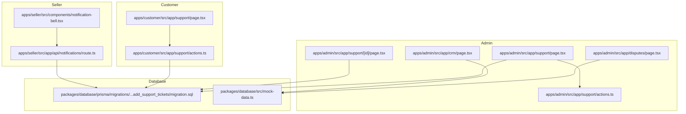
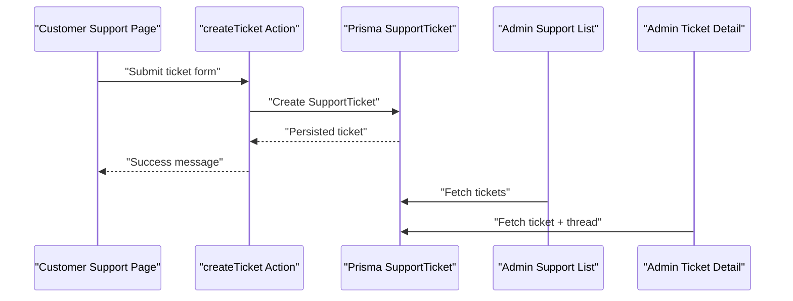
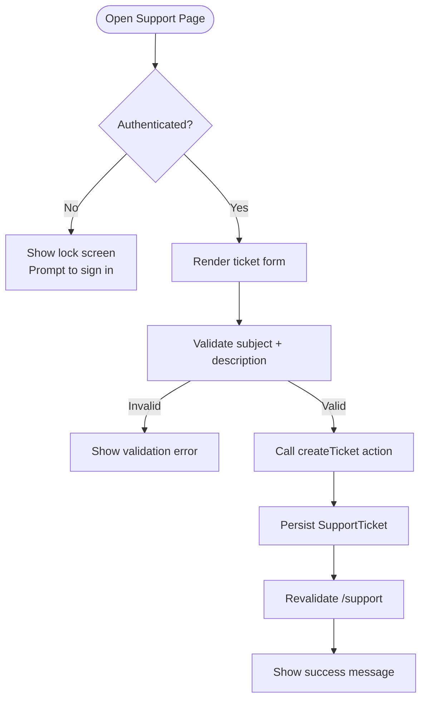
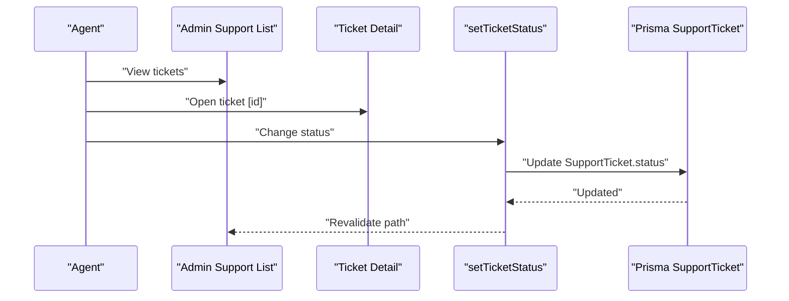
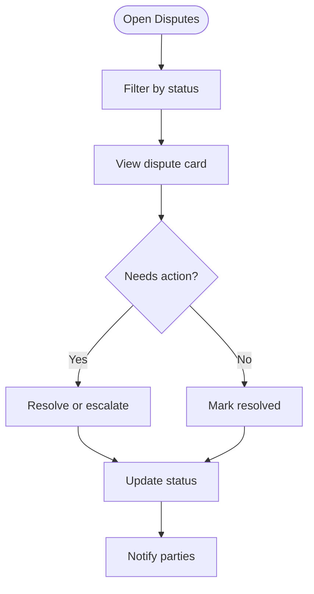
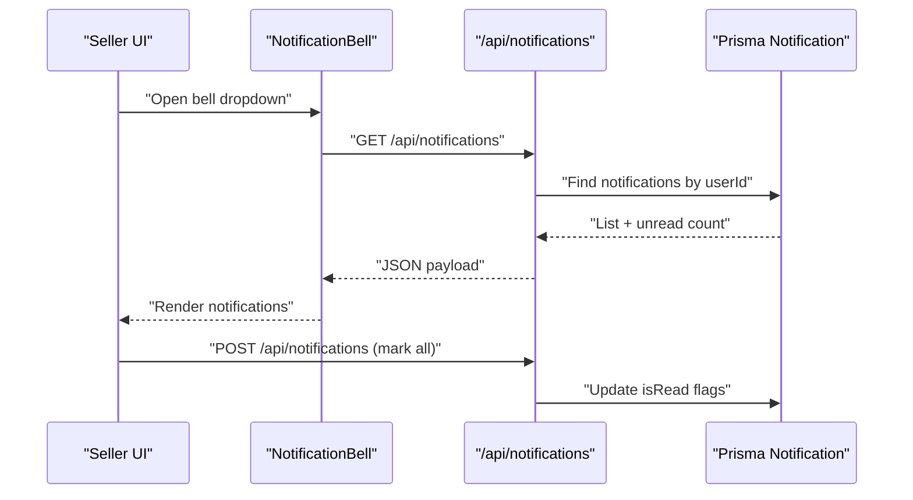
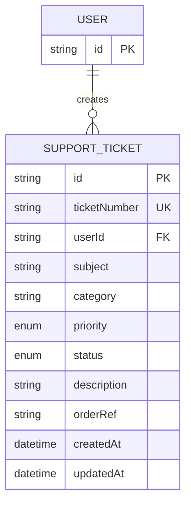
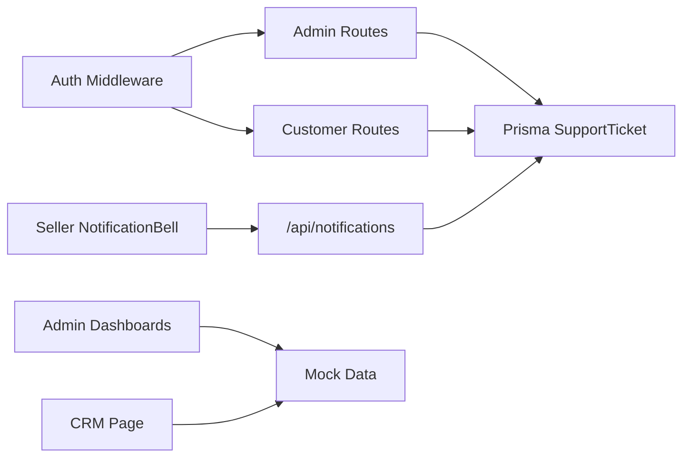

# Messaging & Support

<cite>
**Referenced Files in This Document**
- [apps/admin/src/app/support/actions.ts](file://apps/admin/src/app/support/actions.ts)
- [apps/admin/src/app/support/[id]/page.tsx](file://apps/admin/src/app/support/[id]/page.tsx)
- [apps/admin/src/app/support/page.tsx](file://apps/admin/src/app/support/page.tsx)
- [apps/admin/src/app/disputes/page.tsx](file://apps/admin/src/app/disputes/page.tsx)
- [apps/admin/src/app/crm/page.tsx](file://apps/admin/src/app/crm/page.tsx)
- [apps/customer/src/app/support/actions.ts](file://apps/customer/src/app/support/actions.ts)
- [apps/customer/src/app/support/page.tsx](file://apps/customer/src/app/support/page.tsx)
- [apps/seller/src/app/api/notifications/route.ts](file://apps/seller/src/app/api/notifications/route.ts)
- [apps/seller/src/components/notification-bell.tsx](file://apps/seller/src/components/notification-bell.tsx)
- [packages/database/prisma/migrations/20260601013412_add_support_tickets/migration.sql](file://packages/database/prisma/migrations/20260601013412_add_support_tickets/migration.sql)
- [packages/database/src/mock-data.ts](file://packages/database/src/mock-data.ts)
- [MODULE_08_SUPPORT_DISPUTES_NOTES.md](file://MODULE_08_SUPPORT_DISPUTES_NOTES.md)
</cite>

## Table of Contents
1. [Introduction](#introduction)
2. [Project Structure](#project-structure)
3. [Core Components](#core-components)
4. [Architecture Overview](#architecture-overview)
5. [Detailed Component Analysis](#detailed-component-analysis)
6. [Dependency Analysis](#dependency-analysis)
7. [Performance Considerations](#performance-considerations)
8. [Troubleshooting Guide](#troubleshooting-guide)
9. [Conclusion](#conclusion)
10. [Appendices](#appendices)

## Introduction
This document describes the Messaging and Support system across the Admin, Customer, and Seller applications. It covers internal messaging between sellers and platform support teams, the issue ticketing lifecycle, escalation and resolution tracking, notification management (real-time alerts, email placeholders, and mobile push updates), customer communication tools, dispute resolution processes, feedback collection mechanisms, support analytics (response times, satisfaction ratings, and common issue patterns), and integration points with helpdesk systems and knowledge base integration.

## Project Structure
The Messaging and Support system spans three Next.js applications:
- Admin: Centralized view for support agents to manage tickets, track escalations, and monitor SLA compliance. Includes dispute management and CRM insights.
- Customer: Self-service portal for buyers to raise tickets, track status, and receive notifications.
- Seller: Notifications API and UI component for sellers to receive real-time updates and manage operational alerts.

**Diagram sources**
- [apps/admin/src/app/support/page.tsx:26-54](file://apps/admin/src/app/support/page.tsx#L26-L54)
- [apps/admin/src/app/support/[id]/page.tsx](file://apps/admin/src/app/support/[id]/page.tsx#L9-L30)
- [apps/admin/src/app/support/actions.ts:9-14](file://apps/admin/src/app/support/actions.ts#L9-L14)
- [apps/admin/src/app/disputes/page.tsx:27-96](file://apps/admin/src/app/disputes/page.tsx#L27-L96)
- [apps/admin/src/app/crm/page.tsx:61-83](file://apps/admin/src/app/crm/page.tsx#L61-L83)
- [apps/customer/src/app/support/page.tsx:21-83](file://apps/customer/src/app/support/page.tsx#L21-L83)
- [apps/customer/src/app/support/actions.ts:16-34](file://apps/customer/src/app/support/actions.ts#L16-L34)
- [apps/seller/src/app/api/notifications/route.ts:5-32](file://apps/seller/src/app/api/notifications/route.ts#L5-L32)
- [apps/seller/src/components/notification-bell.tsx:21-94](file://apps/seller/src/components/notification-bell.tsx#L21-L94)
- [packages/database/prisma/migrations/20260601013412_add_support_tickets/migration.sql:7-34](file://packages/database/prisma/migrations/20260601013412_add_support_tickets/migration.sql#L7-L34)
- [packages/database/src/mock-data.ts:359-378](file://packages/database/src/mock-data.ts#L359-L378)

**Section sources**
- [apps/admin/src/app/support/page.tsx:26-54](file://apps/admin/src/app/support/page.tsx#L26-L54)
- [apps/customer/src/app/support/page.tsx:21-83](file://apps/customer/src/app/support/page.tsx#L21-L83)
- [apps/seller/src/components/notification-bell.tsx:21-94](file://apps/seller/src/components/notification-bell.tsx#L21-L94)

## Core Components
- Support Ticketing (Customer → Admin)
  - Customer creates tickets via a form with subject, description, category, and optional order reference. The system generates a unique ticket number and persists the record.
  - Admin manages tickets, updates statuses, and views recent activity.
- Internal Messaging and Escalation
  - Mocked ticket thread rendering demonstrates internal notes and conversation history. Escalation actions are present in UI but not yet backed by backend persistence.
- Dispute Resolution
  - Disputes module surfaces buyer–seller disputes with status tracking, priority indicators, and mediation actions.
- Notification Management
  - Real-time notifications for sellers via a dedicated API endpoint and a bell component that polls periodically and supports marking as read.
- Analytics and SLA Monitoring
  - Admin dashboards show ticket statistics, SLA health, and performance-by-type metrics. Mock data illustrates typical insights and alerts.

**Section sources**
- [apps/customer/src/app/support/actions.ts:16-34](file://apps/customer/src/app/support/actions.ts#L16-L34)
- [apps/admin/src/app/support/[id]/page.tsx](file://apps/admin/src/app/support/[id]/page.tsx#L9-L30)
- [apps/admin/src/app/disputes/page.tsx:27-96](file://apps/admin/src/app/disputes/page.tsx#L27-L96)
- [apps/seller/src/app/api/notifications/route.ts:5-32](file://apps/seller/src/app/api/notifications/route.ts#L5-L32)
- [apps/seller/src/components/notification-bell.tsx:21-94](file://apps/seller/src/components/notification-bell.tsx#L21-L94)
- [MODULE_08_SUPPORT_DISPUTES_NOTES.md:42-70](file://MODULE_08_SUPPORT_DISPUTES_NOTES.md#L42-L70)

## Architecture Overview
The system follows a layered architecture:
- Presentation Layer: Next.js app pages and components for Admin, Customer, and Seller.
- Action Layer: Server actions for state transitions and data mutations.
- Persistence Layer: Prisma schema migrations define the canonical model for support tickets and related entities.
- Mock Data Layer: Shared mock datasets power Admin dashboards and CRM insights during development.

**Diagram sources**
- [apps/customer/src/app/support/actions.ts:16-34](file://apps/customer/src/app/support/actions.ts#L16-L34)
- [apps/admin/src/app/support/page.tsx:29-33](file://apps/admin/src/app/support/page.tsx#L29-L33)
- [apps/admin/src/app/support/[id]/page.tsx](file://apps/admin/src/app/support/[id]/page.tsx#L12-L19)
- [packages/database/prisma/migrations/20260601013412_add_support_tickets/migration.sql:7-22](file://packages/database/prisma/migrations/20260601013412_add_support_tickets/migration.sql#L7-L22)

## Detailed Component Analysis

### Customer Support Portal
- Purpose: Allow authenticated buyers to open tickets, view status, and receive notifications.
- Key Features:
  - Ticket creation with validation and unique ticket number generation.
  - Ticket list with status badges, categories, and order references.
  - Protected access: unauthenticated users see a lock screen prompting sign-in.
- Data Model: Uses Prisma migration for SupportTicket with fields for user, subject, category, priority, status, and timestamps.

**Diagram sources**
- [apps/customer/src/app/support/page.tsx:21-34](file://apps/customer/src/app/support/page.tsx#L21-L34)
- [apps/customer/src/app/support/actions.ts:16-34](file://apps/customer/src/app/support/actions.ts#L16-L34)

**Section sources**
- [apps/customer/src/app/support/page.tsx:21-83](file://apps/customer/src/app/support/page.tsx#L21-L83)
- [apps/customer/src/app/support/actions.ts:16-34](file://apps/customer/src/app/support/actions.ts#L16-L34)
- [packages/database/prisma/migrations/20260601013412_add_support_tickets/migration.sql:7-22](file://packages/database/prisma/migrations/20260601013412_add_support_tickets/migration.sql#L7-L22)

### Admin Support Dashboard and Ticket Detail
- Purpose: Provide support agents with a centralized view to triage, update, and escalate tickets.
- Key Features:
  - Ticket list with counts by status, sorting, and links to detail pages.
  - Ticket detail page with header metadata, status color coding, and a mocked conversation thread.
  - Status update action for changing ticket state.
- Mock Data: Disputes and CRM insights rely on shared mock datasets for demonstration.

**Diagram sources**
- [apps/admin/src/app/support/page.tsx:29-33](file://apps/admin/src/app/support/page.tsx#L29-L33)
- [apps/admin/src/app/support/[id]/page.tsx](file://apps/admin/src/app/support/[id]/page.tsx#L12-L19)
- [apps/admin/src/app/support/actions.ts:9-14](file://apps/admin/src/app/support/actions.ts#L9-L14)
- [packages/database/prisma/migrations/20260601013412_add_support_tickets/migration.sql:7-22](file://packages/database/prisma/migrations/20260601013412_add_support_tickets/migration.sql#L7-L22)

**Section sources**
- [apps/admin/src/app/support/page.tsx:26-54](file://apps/admin/src/app/support/page.tsx#L26-L54)
- [apps/admin/src/app/support/[id]/page.tsx](file://apps/admin/src/app/support/[id]/page.tsx#L9-L30)
- [apps/admin/src/app/support/actions.ts:9-14](file://apps/admin/src/app/support/actions.ts#L9-L14)
- [packages/database/src/mock-data.ts:359-378](file://packages/database/src/mock-data.ts#L359-L378)

### Dispute Resolution Workflow
- Purpose: Mediate buyer–seller disputes with status tracking and priority flags.
- Key Features:
  - Disputes list with tabs for filtering by status.
  - Priority indicators and actionable statuses (e.g., “Awaiting Seller”, “Under Review”).
  - Summary statistics for open disputes, disputed value, and resolution counts.

**Diagram sources**
- [apps/admin/src/app/disputes/page.tsx:27-96](file://apps/admin/src/app/disputes/page.tsx#L27-L96)

**Section sources**
- [apps/admin/src/app/disputes/page.tsx:27-96](file://apps/admin/src/app/disputes/page.tsx#L27-L96)
- [MODULE_08_SUPPORT_DISPUTES_NOTES.md:42-70](file://MODULE_08_SUPPORT_DISPUTES_NOTES.md#L42-L70)

### Notification Management (Real-Time Alerts)
- Purpose: Deliver timely updates to sellers via a RESTful notifications API and a real-time bell component.
- Key Features:
  - GET endpoint returns paginated notifications and unread count.
  - POST endpoint marks a specific notification or all unread notifications as read.
  - Client-side polling refreshes the bell dropdown every 30 seconds and supports bulk mark-as-read.

**Diagram sources**
- [apps/seller/src/components/notification-bell.tsx:27-56](file://apps/seller/src/components/notification-bell.tsx#L27-L56)
- [apps/seller/src/app/api/notifications/route.ts:5-32](file://apps/seller/src/app/api/notifications/route.ts#L5-L32)

**Section sources**
- [apps/seller/src/app/api/notifications/route.ts:5-32](file://apps/seller/src/app/api/notifications/route.ts#L5-L32)
- [apps/seller/src/components/notification-bell.tsx:21-94](file://apps/seller/src/components/notification-bell.tsx#L21-L94)

### Data Model: Support Tickets and Disputes
- Canonical schema defines SupportTicket with enums for status and priority, and foreign key to User.
- Disputes and CRM mock data illustrate typical categories and severity configurations.

**Diagram sources**
- [packages/database/prisma/migrations/20260601013412_add_support_tickets/migration.sql:7-22](file://packages/database/prisma/migrations/20260601013412_add_support_tickets/migration.sql#L7-L22)

**Section sources**
- [packages/database/prisma/migrations/20260601013412_add_support_tickets/migration.sql:1-34](file://packages/database/prisma/migrations/20260601013412_add_support_tickets/migration.sql#L1-L34)
- [packages/database/src/mock-data.ts:359-378](file://packages/database/src/mock-data.ts#L359-L378)

## Dependency Analysis
- Authentication and Authorization
  - Admin routes enforce admin sessions; customer routes enforce buyer sessions.
- Data Access
  - Customer actions and Admin queries use Prisma-backed database access.
- UI-to-API Coupling
  - Seller notification bell depends on a dedicated API endpoint for fetching and updating read status.
- Mock Data Coupling
  - Admin dashboards and CRM pages depend on shared mock datasets for demonstration.

**Diagram sources**
- [apps/admin/src/app/support/actions.ts:9-14](file://apps/admin/src/app/support/actions.ts#L9-L14)
- [apps/customer/src/app/support/actions.ts:16-34](file://apps/customer/src/app/support/actions.ts#L16-L34)
- [apps/seller/src/app/api/notifications/route.ts:5-32](file://apps/seller/src/app/api/notifications/route.ts#L5-L32)
- [packages/database/src/mock-data.ts:359-378](file://packages/database/src/mock-data.ts#L359-L378)

**Section sources**
- [apps/admin/src/app/support/actions.ts:9-14](file://apps/admin/src/app/support/actions.ts#L9-L14)
- [apps/customer/src/app/support/actions.ts:16-34](file://apps/customer/src/app/support/actions.ts#L16-L34)
- [apps/seller/src/app/api/notifications/route.ts:5-32](file://apps/seller/src/app/api/notifications/route.ts#L5-L32)
- [packages/database/src/mock-data.ts:359-378](file://packages/database/src/mock-data.ts#L359-L378)

## Performance Considerations
- Polling Frequency: The seller notification bell polls every 30 seconds. Adjust interval based on traffic and backend capacity.
- Pagination: The notifications API limits results to a small page size; keep this conservative to avoid large payloads.
- Indexes: Ensure database indexes on SupportTicket fields (user, status) are maintained to optimize Admin queries.
- Caching: Use Next.js caching strategies judiciously; revalidation is already applied after Admin status updates.

## Troubleshooting Guide
- Customer cannot open tickets
  - Verify authentication; unauthenticated users are redirected to a lock screen.
  - Ensure required fields are present; validation returns explicit errors.
- Admin status updates not reflected
  - Confirm admin session enforcement and that the status update action is invoked.
  - Check revalidation path to refresh the ticket list.
- Notifications not appearing
  - Confirm user is authenticated and the API returns items and unread count.
  - Verify periodic polling is active and POST mark-all read is reachable.
- Disputes not loading
  - Disputes rely on mock data; confirm mock dataset is imported and rendered.

**Section sources**
- [apps/customer/src/app/support/page.tsx:25-34](file://apps/customer/src/app/support/page.tsx#L25-L34)
- [apps/customer/src/app/support/actions.ts:16-34](file://apps/customer/src/app/support/actions.ts#L16-L34)
- [apps/admin/src/app/support/actions.ts:9-14](file://apps/admin/src/app/support/actions.ts#L9-L14)
- [apps/seller/src/app/api/notifications/route.ts:5-32](file://apps/seller/src/app/api/notifications/route.ts#L5-L32)
- [apps/admin/src/app/disputes/page.tsx:27-96](file://apps/admin/src/app/disputes/page.tsx#L27-L96)

## Conclusion
The Messaging and Support system integrates customer self-service, admin triage, and seller notifications into a cohesive workflow. While current implementations leverage mock data and UI-only actions for escalation, the underlying Prisma schema and routing infrastructure provide a solid foundation for production-grade persistence, real-time updates, and advanced analytics.

## Appendices

### API Definitions
- Notifications API
  - GET /api/notifications
    - Returns: items[], unread number
  - POST /api/notifications
    - Body: { id? } to mark a specific notification as read, or empty to mark all unread as read
    - Returns: { ok: boolean }

**Section sources**
- [apps/seller/src/app/api/notifications/route.ts:5-32](file://apps/seller/src/app/api/notifications/route.ts#L5-L32)

### Known Limitations and Future Work
- All support/dispute/SLA data is currently mocked; production requires persistent tables for tickets, messages, disputes, and evidence.
- Reply, escalate, resolve, and mediate actions are UI-only; backend persistence must be implemented.
- SLA timers are static strings; a live countdown engine is needed.
- Evidence files are count-only; upload and view capabilities are pending.
- Ticket detail always renders a mocked thread; dynamic thread retrieval by ticket ID is required.

**Section sources**
- [MODULE_08_SUPPORT_DISPUTES_NOTES.md:64-70](file://MODULE_08_SUPPORT_DISPUTES_NOTES.md#L64-L70)