# Fulfillment Workflows

<cite>
**Referenced Files in This Document**
- [MODULE_04_ORDERS_FULFILLMENT_NOTES.md](file://MODULE_04_ORDERS_FULFILLMENT_NOTES.md)
- [MODULE_05_WAREHOUSE_3PL_NOTES.md](file://MODULE_05_WAREHOUSE_3PL_NOTES.md)
- [page.tsx](file://apps/admin/src/app/warehouse/pickpack/page.tsx)
- [page.tsx](file://apps/admin/src/app/shipments/page.tsx)
- [page.tsx](file://apps/seller/src/app/shipments/page.tsx)
- [actions.ts](file://apps/seller/src/app/returns/actions.ts)
- [20260601020742_add_shipments_returns/migration.sql](file://packages/database/prisma/migrations/20260601020742_add_shipments_returns/migration.sql)
</cite>

## Table of Contents
1. [Introduction](#introduction)
2. [Project Structure](#project-structure)
3. [Core Components](#core-components)
4. [Architecture Overview](#architecture-overview)
5. [Detailed Component Analysis](#detailed-component-analysis)
6. [Dependency Analysis](#dependency-analysis)
7. [Performance Considerations](#performance-considerations)
8. [Troubleshooting Guide](#troubleshooting-guide)
9. [Conclusion](#conclusion)
10. [Appendices](#appendices)

## Introduction
This document describes fulfillment workflows across inventory allocation, picking, packing, shipping, delivery confirmation, returns, and reverse logistics. It also covers batch operations, rush orders, special handling, analytics, and integration touchpoints with warehouse management systems and third-party logistics (3PL) providers. The content synthesizes current UI surfaces and schema migrations present in the repository to provide a practical blueprint for building end-to-end fulfillment capabilities.

## Project Structure
Fulfillment-related functionality spans administrative dashboards, seller-facing shipment tracking, return management, and database schema for shipments and returns. The following diagram maps the primary UI and schema components involved in fulfillment.

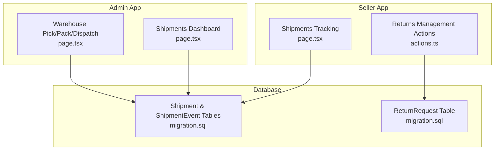

**Diagram sources**
- [page.tsx](file://apps/admin/src/app/warehouse/pickpack/page.tsx)
- [page.tsx](file://apps/admin/src/app/shipments/page.tsx)
- [page.tsx](file://apps/seller/src/app/shipments/page.tsx)
- [actions.ts](file://apps/seller/src/app/returns/actions.ts)
- [20260601020742_add_shipments_returns/migration.sql](file://packages/database/prisma/migrations/20260601020742_add_shipments_returns/migration.sql)

**Section sources**
- [page.tsx](file://apps/admin/src/app/warehouse/pickpack/page.tsx)
- [page.tsx](file://apps/admin/src/app/shipments/page.tsx)
- [page.tsx](file://apps/seller/src/app/shipments/page.tsx)
- [actions.ts](file://apps/seller/src/app/returns/actions.ts)
- [20260601020742_add_shipments_returns/migration.sql](file://packages/database/prisma/migrations/20260601020742_add_shipments_returns/migration.sql)

## Core Components
- Fulfillment pipeline dashboard (admin): visualizes pick queue, pack queue, and dispatch readiness; supports generating pick lists and managing fulfillment stages.
- Shipment lifecycle tracking (admin and seller): displays shipment statuses, timestamps, and enables status updates along the delivery journey.
- Return request management (seller): allows updating return statuses with validation and cache revalidation.
- Database schema for shipments and returns: defines enums, tables, and relationships for shipment events and return requests.

**Section sources**
- [page.tsx](file://apps/admin/src/app/warehouse/pickpack/page.tsx)
- [page.tsx](file://apps/admin/src/app/shipments/page.tsx)
- [page.tsx](file://apps/seller/src/app/shipments/page.tsx)
- [actions.ts](file://apps/seller/src/app/returns/actions.ts)
- [20260601020742_add_shipments_returns/migration.sql](file://packages/database/prisma/migrations/20260601020742_add_shipments_returns/migration.sql)

## Architecture Overview
The fulfillment architecture integrates UI dashboards with backend data models. Admin dashboards coordinate warehouse operations and monitor marketplace-wide shipments. Seller dashboards enable shipment updates and return handling. Database migrations define the canonical state for shipment and return lifecycles.

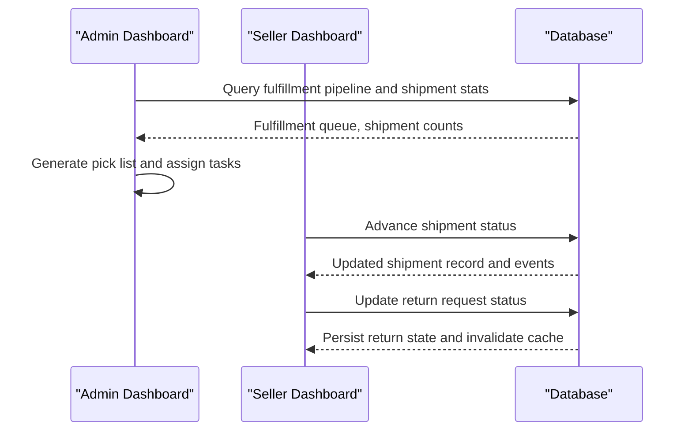

**Diagram sources**
- [page.tsx](file://apps/admin/src/app/warehouse/pickpack/page.tsx)
- [page.tsx](file://apps/admin/src/app/shipments/page.tsx)
- [page.tsx](file://apps/seller/src/app/shipments/page.tsx)
- [actions.ts](file://apps/seller/src/app/returns/actions.ts)
- [20260601020742_add_shipments_returns/migration.sql](file://packages/database/prisma/migrations/20260601020742_add_shipments_returns/migration.sql)

## Detailed Component Analysis

### Fulfillment Pipeline Dashboard (Admin)
- Purpose: Central hub for warehouse coordination, including pick list generation, queue monitoring, and dispatch readiness.
- Key UI elements:
  - Pipeline statistics for pick queue, pack queue, and ready-to-ship items.
  - Actionable buttons to generate pick lists and navigate to dispatch queues.
- Operational flow:
  - Aggregate fulfillment queue counts per stage.
  - Render priority indicators and due-by times.
  - Trigger pick list generation and queue transitions.

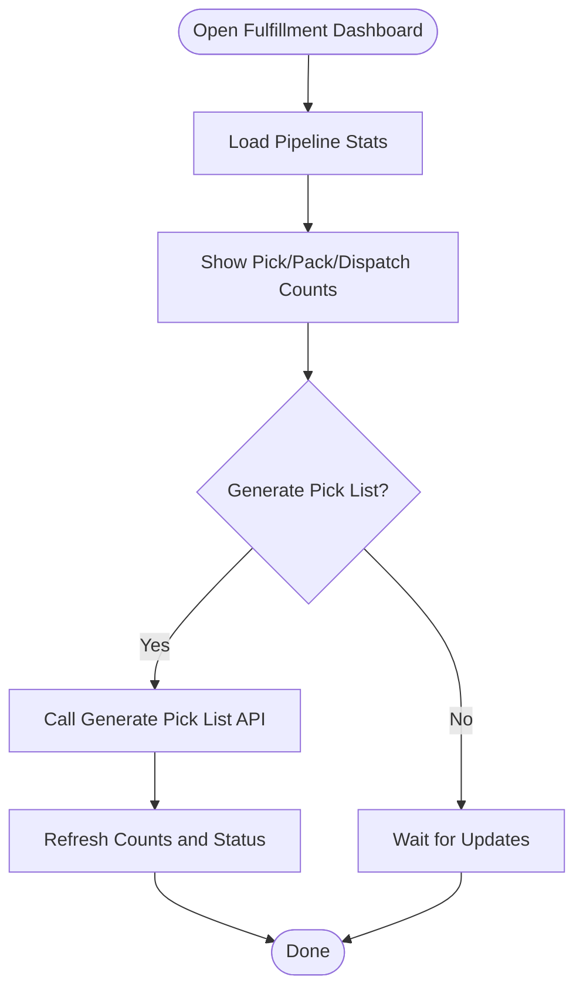

**Diagram sources**
- [page.tsx](file://apps/admin/src/app/warehouse/pickpack/page.tsx)

**Section sources**
- [page.tsx](file://apps/admin/src/app/warehouse/pickpack/page.tsx)

### Shipment Lifecycle Tracking (Admin and Seller)
- Admin dashboard:
  - Market-wide shipment overview with status breakdowns.
  - Navigation to warehouse dispatch queue.
- Seller dashboard:
  - Per-shipment status labels and timestamps.
  - Controlled state transitions (e.g., pending → picked up → in transit → out for delivery → delivered).
  - Utility formatting for dates and locations.

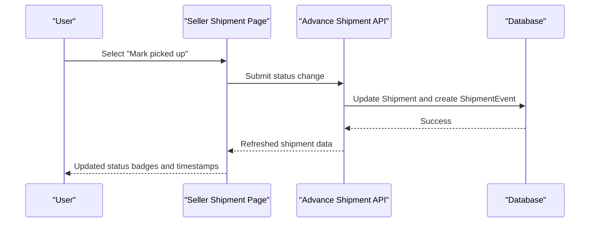

**Diagram sources**
- [page.tsx](file://apps/seller/src/app/shipments/page.tsx)
- [20260601020742_add_shipments_returns/migration.sql](file://packages/database/prisma/migrations/20260601020742_add_shipments_returns/migration.sql)

**Section sources**
- [page.tsx](file://apps/admin/src/app/shipments/page.tsx)
- [page.tsx](file://apps/seller/src/app/shipments/page.tsx)
- [20260601020742_add_shipments_returns/migration.sql](file://packages/database/prisma/migrations/20260601020742_add_shipments_returns/migration.sql)

### Return Request Management (Seller)
- Purpose: Manage return requests with explicit status transitions and seller ownership checks.
- Key behaviors:
  - Validate requested status against allowed set.
  - Enforce seller-scoped access to return records.
  - Persist status updates and trigger UI cache revalidation.

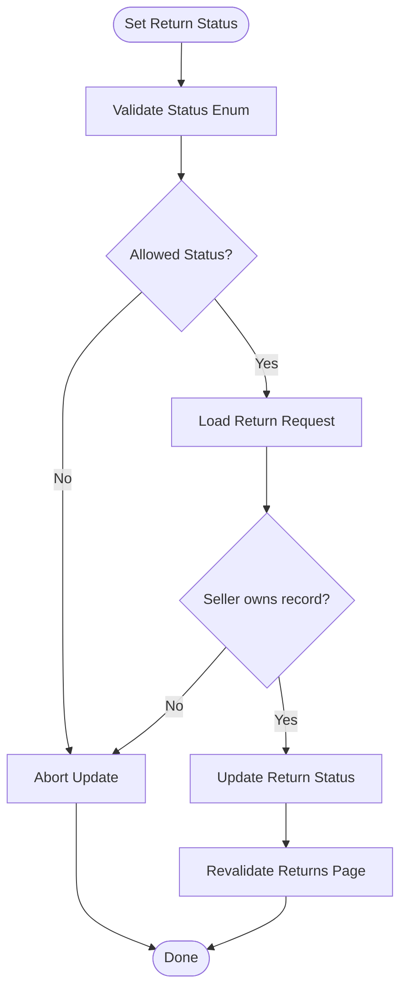

**Diagram sources**
- [actions.ts](file://apps/seller/src/app/returns/actions.ts)

**Section sources**
- [actions.ts](file://apps/seller/src/app/returns/actions.ts)

### Database Schema for Shipments and Returns
- Shipment lifecycle:
  - Enumerated statuses: pending, picked up, in transit, out for delivery, delivered, failed, returned.
  - Timestamps for shipped and delivered events.
  - Event log table to capture status changes with location and notes.
- Return lifecycle:
  - Enumerated statuses: requested, approved, rejected, in transit, received, refunded.
  - Optional refund amount and reason linkage to orders.

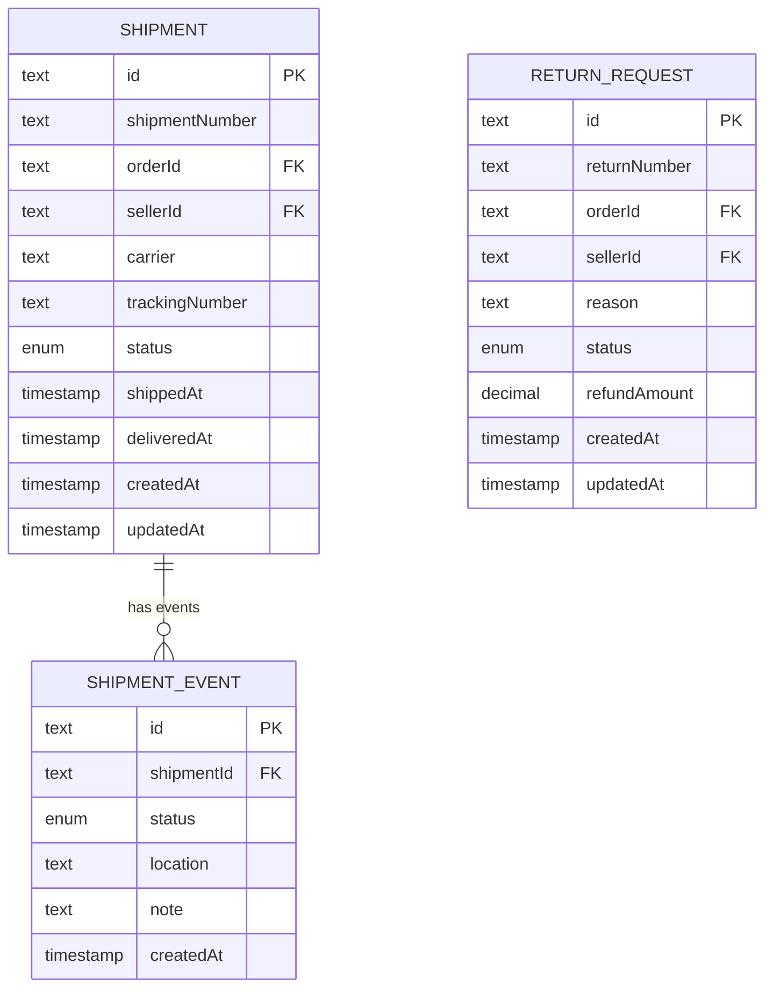

**Diagram sources**
- [20260601020742_add_shipments_returns/migration.sql](file://packages/database/prisma/migrations/20260601020742_add_shipments_returns/migration.sql)

**Section sources**
- [20260601020742_add_shipments_returns/migration.sql](file://packages/database/prisma/migrations/20260601020742_add_shipments_returns/migration.sql)

### Warehouse Coordination and Packaging Requirements
- Current state:
  - Mocked fulfillment pipeline with placeholder data and UI-only actions.
  - No backend APIs implemented for receiving goods, marking picked/packed/dispatched, or stock search.
- Future enhancements (planned):
  - Inbound purchase orders and receipt workflows.
  - Real-time stock search and aging inventory tracking.
  - Pick list assignment and fulfillment queue management.

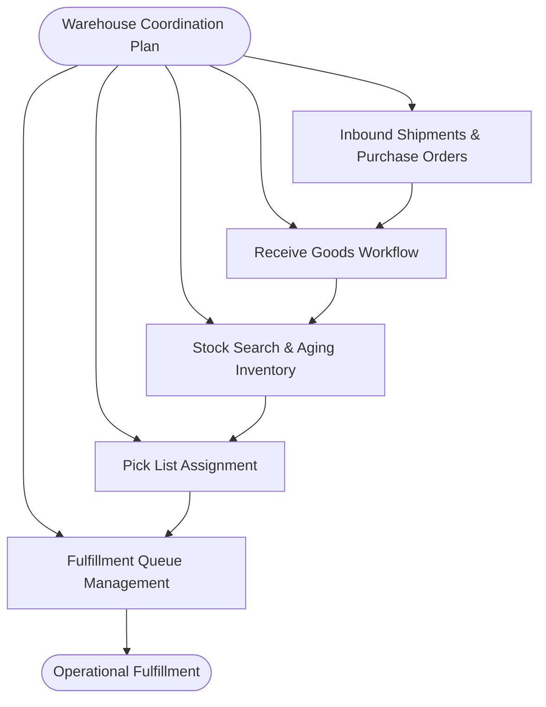

**Diagram sources**
- [MODULE_05_WAREHOUSE_3PL_NOTES.md](file://MODULE_05_WAREHOUSE_3PL_NOTES.md)

**Section sources**
- [MODULE_05_WAREHOUSE_3PL_NOTES.md](file://MODULE_05_WAREHOUSE_3PL_NOTES.md)

### Shipping Label Creation, Carrier Integration, and Tracking
- Current state:
  - Shipment table includes optional carrier and tracking number fields.
  - Admin dashboard shows shipment status and exceptions.
- Future enhancements (planned):
  - Label generation APIs integrated with carriers.
  - Automatic tracking number assignment upon label creation.
  - Real-time tracking updates via carrier webhooks.

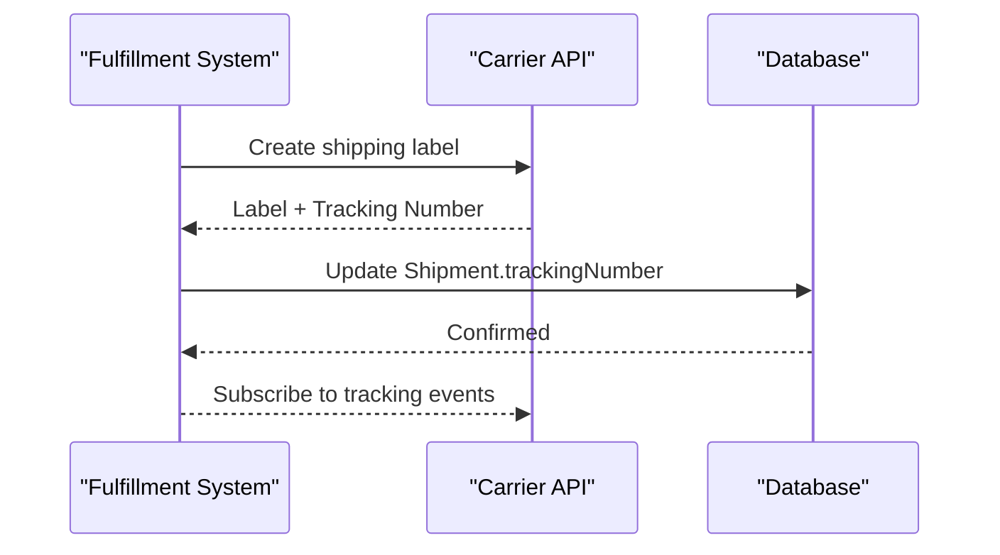

**Diagram sources**
- [page.tsx](file://apps/admin/src/app/shipments/page.tsx)
- [20260601020742_add_shipments_returns/migration.sql](file://packages/database/prisma/migrations/20260601020742_add_shipments_returns/migration.sql)

**Section sources**
- [page.tsx](file://apps/admin/src/app/shipments/page.tsx)
- [20260601020742_add_shipments_returns/migration.sql](file://packages/database/prisma/migrations/20260601020742_add_shipments_returns/migration.sql)

### Return Processing, Reverse Logistics, and Damaged Goods Handling
- Current state:
  - Return request table with lifecycle statuses and optional refund amount.
  - Seller actions to update return status with validation.
- Future enhancements (planned):
  - Automated return authorization workflows.
  - Integration with RMA number generation and return shipping label creation.
  - Damage inspection workflows and replacement/refund routing.

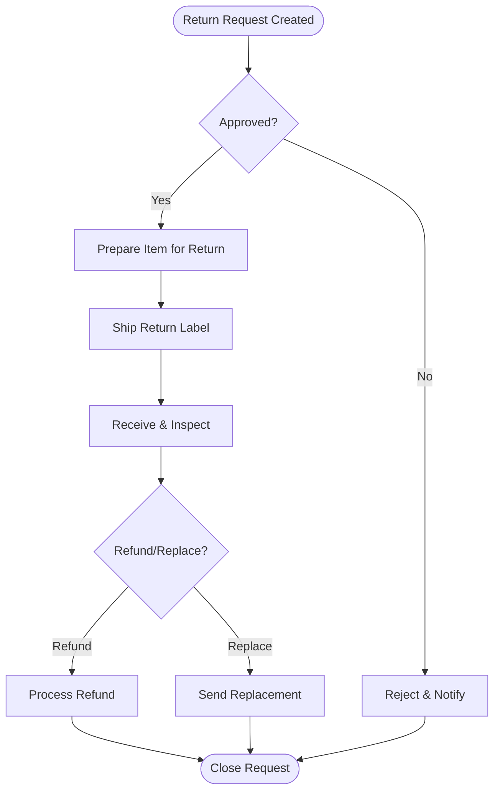

**Diagram sources**
- [actions.ts](file://apps/seller/src/app/returns/actions.ts)
- [20260601020742_add_shipments_returns/migration.sql](file://packages/database/prisma/migrations/20260601020742_add_shipments_returns/migration.sql)

**Section sources**
- [actions.ts](file://apps/seller/src/app/returns/actions.ts)
- [20260601020742_add_shipments_returns/migration.sql](file://packages/database/prisma/migrations/20260601020742_add_shipments_returns/migration.sql)

### Batch Fulfillment Operations, Rush Orders, and Special Handling
- Current state:
  - Priority field exists in fulfillment queue (normal/urgent).
  - UI surfaces urgency and due-by times.
- Future enhancements (planned):
  - Batch picking and packing workflows.
  - Special handling flags and packaging requirements.
  - SLA enforcement and escalation for rush orders.

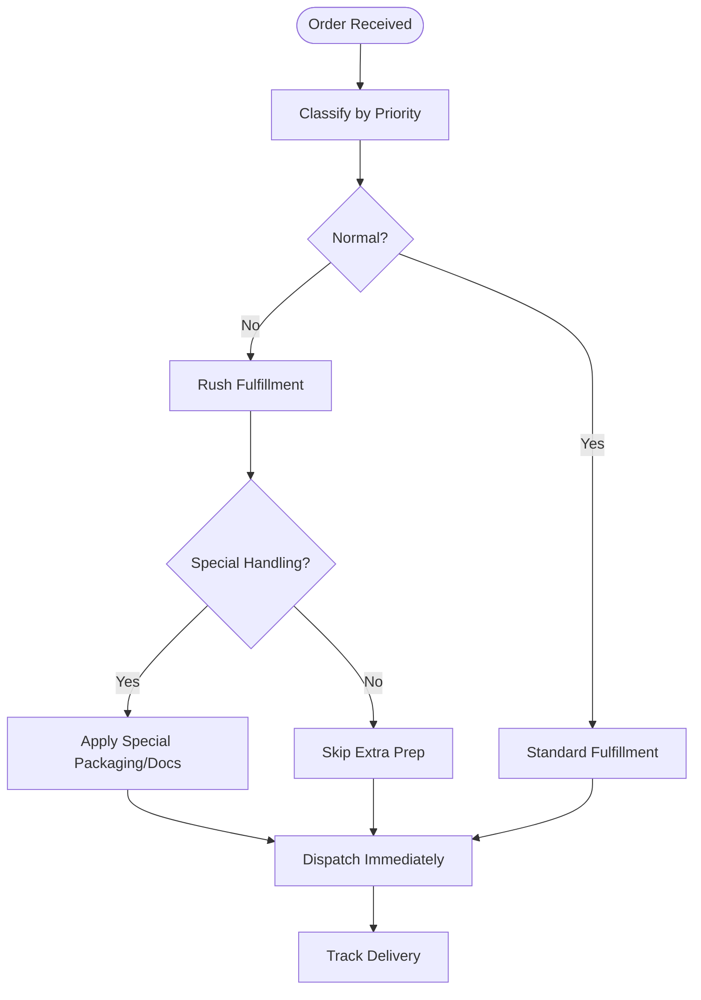

**Diagram sources**
- [MODULE_05_WAREHOUSE_3PL_NOTES.md](file://MODULE_05_WAREHOUSE_3PL_NOTES.md)

**Section sources**
- [MODULE_05_WAREHOUSE_3PL_NOTES.md](file://MODULE_05_WAREHOUSE_3PL_NOTES.md)

### Fulfillment Analytics, Efficiency Metrics, and Performance Monitoring
- Current state:
  - Admin dashboard shows shipment exceptions and in-transit counts.
  - AI insights surface risks like late deliveries and return trends.
- Future enhancements (planned):
  - KPIs: on-time delivery rate, pick accuracy, packing efficiency, return rate.
  - SLA dashboards and alerts.
  - Integration with warehouse KPIs and 3PL performance metrics.

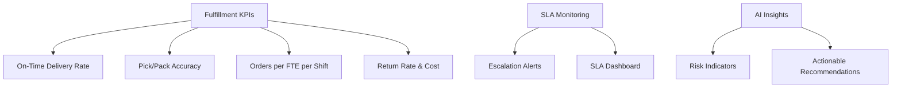

**Diagram sources**
- [page.tsx](file://apps/admin/src/app/ai-insights/page.tsx)
- [page.tsx](file://apps/admin/src/app/shipments/page.tsx)

**Section sources**
- [page.tsx](file://apps/admin/src/app/ai-insights/page.tsx)
- [page.tsx](file://apps/admin/src/app/shipments/page.tsx)

### Integration with Warehouse Management Systems and 3PL Providers
- Current state:
  - UI surfaces warehouse and carrier information.
  - Database includes carrier and tracking fields.
- Future enhancements (planned):
  - APIs to integrate with WMS for real-time stock and reservations.
  - 3PL connectivity for shipment status sync and label printing.
  - Inbound/outbound PO workflows and ASN/routing label generation.

```mermaid
graph TB
WMS["WMS System"] <- --> |Real-time Stock/Reservations| Core["Core Platform"]
3PL["3PL Provider"] <- --> |Status Sync/Labels| Core
Core --> Carriers["Carrier APIs"]
Core --> DB["Shipments & Returns DB"]
```

**Diagram sources**
- [MODULE_05_WAREHOUSE_3PL_NOTES.md](file://MODULE_05_WAREHOUSE_3PL_NOTES.md)
- [20260601020742_add_shipments_returns/migration.sql](file://packages/database/prisma/migrations/20260601020742_add_shipments_returns/migration.sql)

**Section sources**
- [MODULE_05_WAREHOUSE_3PL_NOTES.md](file://MODULE_05_WAREHOUSE_3PL_NOTES.md)
- [20260601020742_add_shipments_returns/migration.sql](file://packages/database/prisma/migrations/20260601020742_add_shipments_returns/migration.sql)

## Dependency Analysis
The fulfillment subsystems depend on shared database models and UI components. Admin dashboards rely on aggregated shipment data, while seller dashboards focus on per-order shipment updates and return handling.

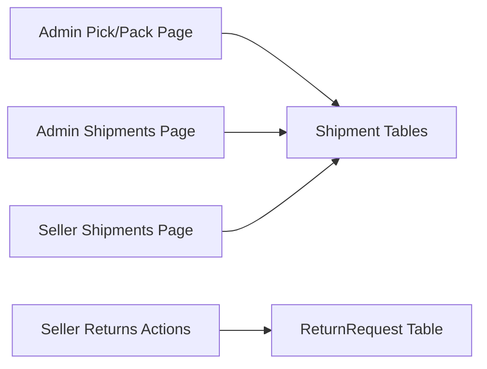

**Diagram sources**
- [page.tsx](file://apps/admin/src/app/warehouse/pickpack/page.tsx)
- [page.tsx](file://apps/admin/src/app/shipments/page.tsx)
- [page.tsx](file://apps/seller/src/app/shipments/page.tsx)
- [actions.ts](file://apps/seller/src/app/returns/actions.ts)
- [20260601020742_add_shipments_returns/migration.sql](file://packages/database/prisma/migrations/20260601020742_add_shipments_returns/migration.sql)

**Section sources**
- [page.tsx](file://apps/admin/src/app/warehouse/pickpack/page.tsx)
- [page.tsx](file://apps/admin/src/app/shipments/page.tsx)
- [page.tsx](file://apps/seller/src/app/shipments/page.tsx)
- [actions.ts](file://apps/seller/src/app/returns/actions.ts)
- [20260601020742_add_shipments_returns/migration.sql](file://packages/database/prisma/migrations/20260601020742_add_shipments_returns/migration.sql)

## Performance Considerations
- UI responsiveness:
  - Debounce status update actions and batch refreshes.
  - Paginate and filter shipment lists to reduce render overhead.
- Database efficiency:
  - Index shipment status and tracking number for fast queries.
  - Use connection pooling and limit concurrent shipment updates.
- Caching:
  - Cache shipment summaries and return counts; invalidate on mutation.
- Scalability:
  - Partition shipment events by date for historical reporting.
  - Use background jobs for heavy operations like label generation and bulk status updates.

## Troubleshooting Guide
- Shipment status stuck:
  - Verify the next allowable status in the status mapping.
  - Confirm shipment existence and seller ownership for seller actions.
- Return status not updating:
  - Ensure the requested status is part of the allowed set.
  - Check that the return request belongs to the authenticated seller.
- Missing tracking number:
  - Confirm label creation workflow completed successfully.
  - Validate carrier integration and webhook reception.

**Section sources**
- [page.tsx](file://apps/seller/src/app/shipments/page.tsx)
- [actions.ts](file://apps/seller/src/app/returns/actions.ts)

## Conclusion
The repository provides a solid foundation for fulfillment workflows with UI dashboards, return management, and a robust shipment/return schema. The next phase focuses on implementing backend APIs for warehouse operations, carrier integrations, and advanced analytics, aligning with the documented module plans.

## Appendices
- Reference: Fulfillment queue and inbound schema notes are documented in the warehouse/3PL module notes.
- Reference: Shipment and return database migrations define canonical state and relationships.

**Section sources**
- [MODULE_05_WAREHOUSE_3PL_NOTES.md](file://MODULE_05_WAREHOUSE_3PL_NOTES.md)
- [20260601020742_add_shipments_returns/migration.sql](file://packages/database/prisma/migrations/20260601020742_add_shipments_returns/migration.sql)