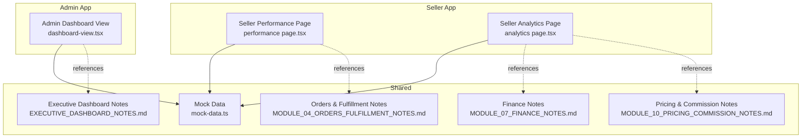
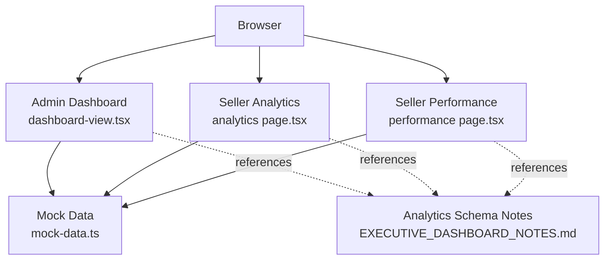
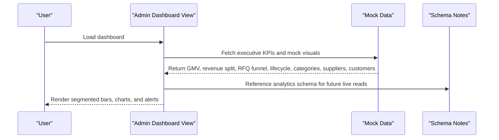
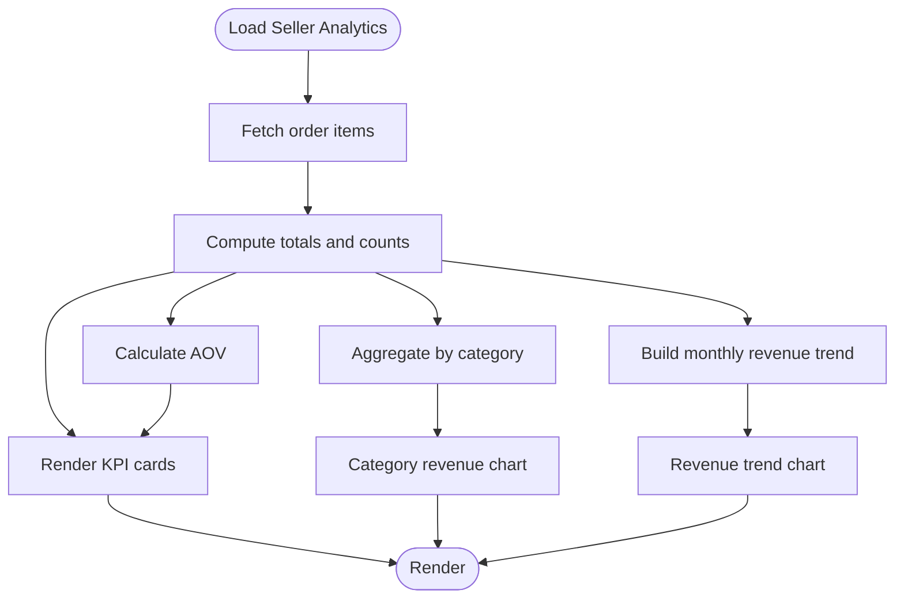
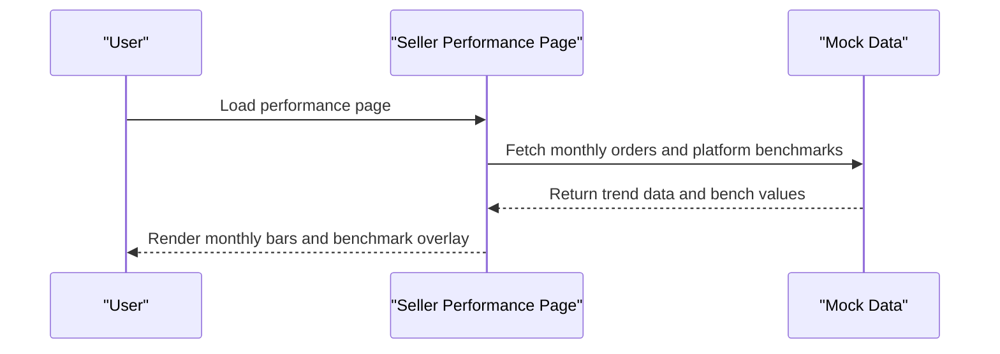
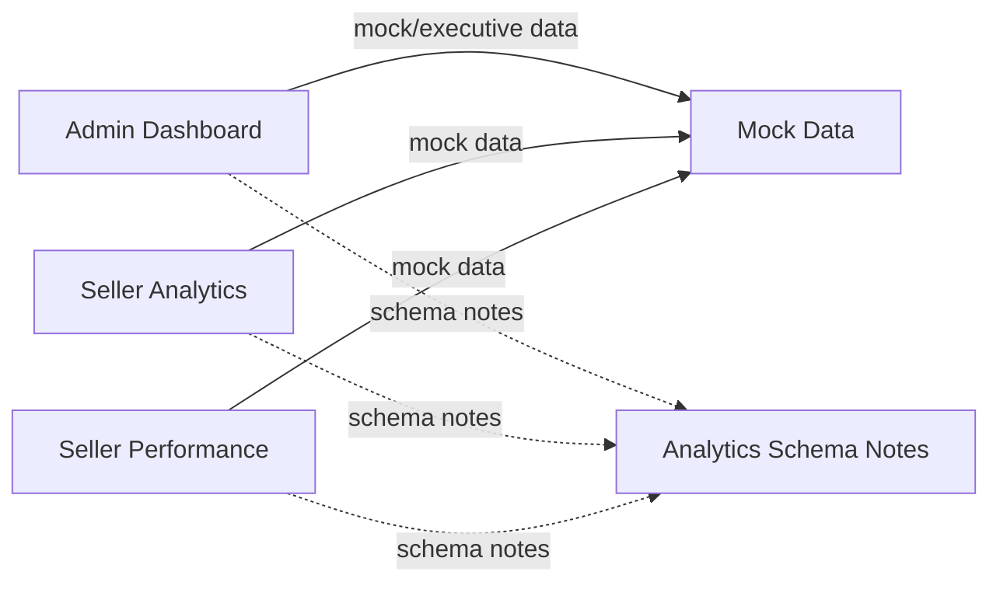

# Order Analytics & Performance

<cite>
**Referenced Files in This Document**
- [dashboard-view.tsx](file://apps/admin/src/app/dashboard/dashboard-view.tsx)
- [EXECUTIVE_DASHBOARD_NOTES.md](file://EXECUTIVE_DASHBOARD_NOTES.md)
- [performance page.tsx](file://apps/seller/src/app/performance/page.tsx)
- [analytics page.tsx](file://apps/seller/src/app/analytics/page.tsx)
- [mock-data.ts](file://packages/database/src/mock-data.ts)
- [MODULE_04_ORDERS_FULFILLMENT_NOTES.md](file://MODULE_04_ORDERS_FULFILLMENT_NOTES.md)
- [MODULE_07_FINANCE_NOTES.md](file://MODULE_07_FINANCE_NOTES.md)
- [MODULE_10_PRICING_COMMISSION_NOTES.md](file://MODULE_10_PRICING_COMMISSION_NOTES.md)
</cite>

## Table of Contents
1. [Introduction](#introduction)
2. [Project Structure](#project-structure)
3. [Core Components](#core-components)
4. [Architecture Overview](#architecture-overview)
5. [Detailed Component Analysis](#detailed-component-analysis)
6. [Dependency Analysis](#dependency-analysis)
7. [Performance Considerations](#performance-considerations)
8. [Troubleshooting Guide](#troubleshooting-guide)
9. [Conclusion](#conclusion)
10. [Appendices](#appendices)

## Introduction
This document describes the order analytics and performance tracking systems present in the commerce platform. It focuses on sales reporting, revenue analytics, conversion metrics, customer order frequency, average order value (AOV), repeat purchase tracking, order processing time metrics, fulfillment performance indicators, customer satisfaction scores, forecasting models, trend analysis, seasonal pattern recognition, competitive benchmarking, market share tracking, ROI calculations, dashboard visualizations, custom report generation, export capabilities, real-time monitoring, alert systems, and performance optimization recommendations. The content synthesizes current frontend dashboards and backend analytics schema notes to guide implementation and future enhancements.

## Project Structure
The analytics and performance features are primarily implemented in three Next.js applications:
- Admin dashboard: executive KPIs, operational health, RFQ funnel, order lifecycle, top categories/suppliers/customers.
- Seller analytics: monthly orders trend, category revenue breakdown, and KPIs (total revenue, monthly revenue, orders count, AOV).
- Finance and fulfillment modules: foundational notes for revenue, commission, SLA, and warehouse metrics.

**Diagram sources**
- [dashboard-view.tsx:32-131](file://apps/admin/src/app/dashboard/dashboard-view.tsx#L32-L131)
- [performance page.tsx:97-120](file://apps/seller/src/app/performance/page.tsx#L97-L120)
- [analytics page.tsx:53-101](file://apps/seller/src/app/analytics/page.tsx#L53-L101)
- [mock-data.ts](file://packages/database/src/mock-data.ts)
- [EXECUTIVE_DASHBOARD_NOTES.md:31-99](file://EXECUTIVE_DASHBOARD_NOTES.md#L31-L99)
- [MODULE_04_ORDERS_FULFILLMENT_NOTES.md](file://MODULE_04_ORDERS_FULFILLMENT_NOTES.md)
- [MODULE_07_FINANCE_NOTES.md](file://MODULE_07_FINANCE_NOTES.md)
- [MODULE_10_PRICING_COMMISSION_NOTES.md](file://MODULE_10_PRICING_COMMISSION_NOTES.md)

**Section sources**
- [dashboard-view.tsx:32-131](file://apps/admin/src/app/dashboard/dashboard-view.tsx#L32-L131)
- [EXECUTIVE_DASHBOARD_NOTES.md:31-99](file://EXECUTIVE_DASHBOARD_NOTES.md#L31-L99)

## Core Components
- Admin Executive Dashboard: Presents live KPIs and mock-driven analytics including revenue split (B2B vs B2C), RFQ funnel, order lifecycle, top categories, top suppliers, top customers, AI recommendations, and operational health alerts.
- Seller Analytics: Displays KPIs (total revenue, monthly revenue, orders count, AOV), category revenue distribution, and monthly order trends.
- Seller Performance: Shows monthly order trends and benchmarking against platform averages.
- Mock Data Layer: Supplies demo-safe fallbacks for executive KPIs and top customer lists.
- Analytics Schema Notes: Outlines pre-aggregated tables for fast dashboard reads and nightly aggregation jobs.

Key implementation references:
- Admin dashboard view and KPI rendering: [dashboard-view.tsx:32-131](file://apps/admin/src/app/dashboard/dashboard-view.tsx#L32-L131), [dashboard-view.tsx:275-296](file://apps/admin/src/app/dashboard/dashboard-view.tsx#L275-L296)
- Seller analytics KPIs and charts: [analytics page.tsx:53-101](file://apps/seller/src/app/analytics/page.tsx#L53-L101)
- Seller performance monthly orders: [performance page.tsx:97-120](file://apps/seller/src/app/performance/page.tsx#L97-L120)
- Mock data for executive KPIs and top customers: [mock-data.ts](file://packages/database/src/mock-data.ts)
- Analytics schema and nightly aggregation: [EXECUTIVE_DASHBOARD_NOTES.md:63-92](file://EXECUTIVE_DASHBOARD_NOTES.md#L63-L92)

**Section sources**
- [dashboard-view.tsx:32-131](file://apps/admin/src/app/dashboard/dashboard-view.tsx#L32-L131)
- [dashboard-view.tsx:275-296](file://apps/admin/src/app/dashboard/dashboard-view.tsx#L275-L296)
- [analytics page.tsx:53-101](file://apps/seller/src/app/analytics/page.tsx#L53-L101)
- [performance page.tsx:97-120](file://apps/seller/src/app/performance/page.tsx#L97-L120)
- [mock-data.ts](file://packages/database/src/mock-data.ts)
- [EXECUTIVE_DASHBOARD_NOTES.md:63-92](file://EXECUTIVE_DASHBOARD_NOTES.md#L63-L92)

## Architecture Overview
The analytics architecture combines live data retrieval and mock fallbacks for resilience and demo safety. The Admin dashboard consumes executive data and renders segmented visuals. The Seller apps compute KPIs client-side from order item datasets and present trend charts. A future analytics engine will populate pre-aggregated tables for efficient dashboard reads.

**Diagram sources**
- [dashboard-view.tsx:32-131](file://apps/admin/src/app/dashboard/dashboard-view.tsx#L32-L131)
- [analytics page.tsx:53-101](file://apps/seller/src/app/analytics/page.tsx#L53-L101)
- [performance page.tsx:97-120](file://apps/seller/src/app/performance/page.tsx#L97-L120)
- [mock-data.ts](file://packages/database/src/mock-data.ts)
- [EXECUTIVE_DASHBOARD_NOTES.md:63-92](file://EXECUTIVE_DASHBOARD_NOTES.md#L63-L92)

## Detailed Component Analysis

### Admin Executive Dashboard
- Revenue split: B2B vs B2C with percentage bars and totals.
- RFQ funnel: Created → Sent → Quoted → Accepted.
- Order lifecycle: Confirmed/Processing/Shipped/Delivered/Disputed.
- Top categories: GMV share bars.
- Top suppliers: Rank, rating, orders, GMV.
- Top customers: Orders, spend, B2B/B2C tag.
- AI recommendations: Rule/mock-based insights.
- Operational health: Live alerts for RFQs pending, orders stuck, supplier docs expiring, tickets near SLA breach, low inventory.

**Diagram sources**
- [dashboard-view.tsx:32-131](file://apps/admin/src/app/dashboard/dashboard-view.tsx#L32-L131)
- [dashboard-view.tsx:275-296](file://apps/admin/src/app/dashboard/dashboard-view.tsx#L275-L296)
- [mock-data.ts](file://packages/database/src/mock-data.ts)
- [EXECUTIVE_DASHBOARD_NOTES.md:31-99](file://EXECUTIVE_DASHBOARD_NOTES.md#L31-L99)

**Section sources**
- [dashboard-view.tsx:32-131](file://apps/admin/src/app/dashboard/dashboard-view.tsx#L32-L131)
- [dashboard-view.tsx:275-296](file://apps/admin/src/app/dashboard/dashboard-view.tsx#L275-L296)
- [EXECUTIVE_DASHBOARD_NOTES.md:31-99](file://EXECUTIVE_DASHBOARD_NOTES.md#L31-L99)

### Seller Analytics
- KPIs: Total revenue, this month’s revenue, orders count, average order value (AOV).
- Category revenue breakdown: Summed by category with percentages.
- Revenue trend: Monthly bars showing growth trajectory.
- Monthly orders trend: Platform benchmark overlay.

**Diagram sources**
- [analytics page.tsx:53-101](file://apps/seller/src/app/analytics/page.tsx#L53-L101)

**Section sources**
- [analytics page.tsx:53-101](file://apps/seller/src/app/analytics/page.tsx#L53-L101)

### Seller Performance
- Monthly orders trend: Vertical bars per month with platform average overlay.
- Benchmarking: Compares seller performance to platform averages.

**Diagram sources**
- [performance page.tsx:97-120](file://apps/seller/src/app/performance/page.tsx#L97-L120)

**Section sources**
- [performance page.tsx:97-120](file://apps/seller/src/app/performance/page.tsx#L97-L120)

### Forecasting Models, Trend Analysis, and Seasonality
- Trend analysis: Monthly revenue and orders charts enable trend identification.
- Seasonality: Monthly grouping supports seasonal pattern recognition.
- Forecasting: Placeholder for ML models; current UI-ready mock insights.

Implementation references:
- Monthly revenue trend: [analytics page.tsx:53-101](file://apps/seller/src/app/analytics/page.tsx#L53-L101)
- Monthly orders trend: [performance page.tsx:97-120](file://apps/seller/src/app/performance/page.tsx#L97-L120)
- Executive dashboard trend visuals: [dashboard-view.tsx:32-131](file://apps/admin/src/app/dashboard/dashboard-view.tsx#L32-L131)

**Section sources**
- [analytics page.tsx:53-101](file://apps/seller/src/app/analytics/page.tsx#L53-L101)
- [performance page.tsx:97-120](file://apps/seller/src/app/performance/page.tsx#L97-L120)
- [dashboard-view.tsx:32-131](file://apps/admin/src/app/dashboard/dashboard-view.tsx#L32-L131)

### Conversion Metrics, Repeat Purchase Tracking, and Customer Order Frequency
- Conversion metrics: RFQ funnel (Created → Sent → Quoted → Accepted) in the Admin dashboard.
- Repeat purchase and frequency: Top customers list with total orders/spend enables cohort-style analysis.
- AOV: Computed in Seller Analytics for conversion efficiency insights.

References:
- RFQ funnel: [dashboard-view.tsx:275-296](file://apps/admin/src/app/dashboard/dashboard-view.tsx#L275-L296)
- Top customers: [dashboard-view.tsx:32-131](file://apps/admin/src/app/dashboard/dashboard-view.tsx#L32-L131)
- AOV computation: [analytics page.tsx:53-101](file://apps/seller/src/app/analytics/page.tsx#L53-L101)

**Section sources**
- [dashboard-view.tsx:275-296](file://apps/admin/src/app/dashboard/dashboard-view.tsx#L275-L296)
- [dashboard-view.tsx:32-131](file://apps/admin/src/app/dashboard/dashboard-view.tsx#L32-L131)
- [analytics page.tsx:53-101](file://apps/seller/src/app/analytics/page.tsx#L53-L101)

### Fulfillment Performance and Order Processing Time
- Order lifecycle: Confirmed/Processing/Shipped/Delivered/Disputed in Admin dashboard.
- Operational health: Alerts for delayed orders and SLA breaches.
- Notes: Module notes outline SLA and warehouse utilization metrics for future live integration.

References:
- Order lifecycle and alerts: [dashboard-view.tsx:32-131](file://apps/admin/src/app/dashboard/dashboard-view.tsx#L32-L131)
- Operational health: [dashboard-view.tsx:110-114](file://apps/admin/src/app/dashboard/dashboard-view.tsx#L110-L114)
- Fulfillment module notes: [MODULE_04_ORDERS_FULFILLMENT_NOTES.md](file://MODULE_04_ORDERS_FULFILLMENT_NOTES.md)

**Section sources**
- [dashboard-view.tsx:32-131](file://apps/admin/src/app/dashboard/dashboard-view.tsx#L32-L131)
- [dashboard-view.tsx:110-114](file://apps/admin/src/app/dashboard/dashboard-view.tsx#L110-L114)
- [MODULE_04_ORDERS_FULFILLMENT_NOTES.md](file://MODULE_04_ORDERS_FULFILLMENT_NOTES.md)

### Customer Satisfaction Scores
- Satisfaction indicators: Disputes count and “open disputes” alert in Admin dashboard operational health.
- Future integration: Notes indicate plans to incorporate satisfaction metrics into analytics.

Reference:
- Operational health alerts: [dashboard-view.tsx:110-114](file://apps/admin/src/app/dashboard/dashboard-view.tsx#L110-L114)

**Section sources**
- [dashboard-view.tsx:110-114](file://apps/admin/src/app/dashboard/dashboard-view.tsx#L110-L114)

### Competitive Benchmarking and Market Share
- Benchmarking: Seller performance compares seller metrics to platform averages.
- Market share: Top categories and suppliers in Admin dashboard reflect category share and supplier performance.

References:
- Platform benchmark overlay: [performance page.tsx:97-120](file://apps/seller/src/app/performance/page.tsx#L97-L120)
- Top categories and suppliers: [dashboard-view.tsx:32-131](file://apps/admin/src/app/dashboard/dashboard-view.tsx#L32-L131)

**Section sources**
- [performance page.tsx:97-120](file://apps/seller/src/app/performance/page.tsx#L97-L120)
- [dashboard-view.tsx:32-131](file://apps/admin/src/app/dashboard/dashboard-view.tsx#L32-L131)

### ROI and Revenue Analytics
- Revenue split: B2B vs B2C in Admin dashboard.
- Finance notes: Pricing and commission models underpin ROI calculations.
- Notes: Analytics schema includes commission and revenue fields for financial reporting.

References:
- Revenue split: [dashboard-view.tsx:275-296](file://apps/admin/src/app/dashboard/dashboard-view.tsx#L275-L296)
- Finance notes: [MODULE_07_FINANCE_NOTES.md](file://MODULE_07_FINANCE_NOTES.md)
- Pricing/commission notes: [MODULE_10_PRICING_COMMISSION_NOTES.md](file://MODULE_10_PRICING_COMMISSION_NOTES.md)
- Analytics schema fields: [EXECUTIVE_DASHBOARD_NOTES.md:63-92](file://EXECUTIVE_DASHBOARD_NOTES.md#L63-L92)

**Section sources**
- [dashboard-view.tsx:275-296](file://apps/admin/src/app/dashboard/dashboard-view.tsx#L275-L296)
- [MODULE_07_FINANCE_NOTES.md](file://MODULE_07_FINANCE_NOTES.md)
- [MODULE_10_PRICING_COMMISSION_NOTES.md](file://MODULE_10_PRICING_COMMISSION_NOTES.md)
- [EXECUTIVE_DASHBOARD_NOTES.md:63-92](file://EXECUTIVE_DASHBOARD_NOTES.md#L63-L92)

### Dashboard Visualizations, Custom Reports, and Export
- Visualizations: Segmented bars, share bars, monthly trend bars, and KPI cards.
- Custom reports: Not implemented in current code; placeholder for future export/report features.
- Export: Not implemented in current code; placeholder for CSV/PDF exports.

References:
- Segmented bars and charts: [dashboard-view.tsx:32-131](file://apps/admin/src/app/dashboard/dashboard-view.tsx#L32-L131)
- Monthly trend charts: [analytics page.tsx:53-101](file://apps/seller/src/app/analytics/page.tsx#L53-L101), [performance page.tsx:97-120](file://apps/seller/src/app/performance/page.tsx#L97-L120)

**Section sources**
- [dashboard-view.tsx:32-131](file://apps/admin/src/app/dashboard/dashboard-view.tsx#L32-L131)
- [analytics page.tsx:53-101](file://apps/seller/src/app/analytics/page.tsx#L53-L101)
- [performance page.tsx:97-120](file://apps/seller/src/app/performance/page.tsx#L97-L120)

### Real-Time Monitoring and Alert Systems
- Real-time status: Live indicator in Admin dashboard.
- Alerts: Operational health cards for open disputes and delayed orders.
- Quick actions: Deep links to relevant sections for remediation.

References:
- Live indicator and alerts: [dashboard-view.tsx:124-131](file://apps/admin/src/app/dashboard/dashboard-view.tsx#L124-L131), [dashboard-view.tsx:110-114](file://apps/admin/src/app/dashboard/dashboard-view.tsx#L110-L114)

**Section sources**
- [dashboard-view.tsx:124-131](file://apps/admin/src/app/dashboard/dashboard-view.tsx#L124-L131)
- [dashboard-view.tsx:110-114](file://apps/admin/src/app/dashboard/dashboard-view.tsx#L110-L114)

## Dependency Analysis
- Coupling: Admin and Seller dashboards depend on shared mock data for resilient demo experiences.
- Cohesion: Each dashboard focuses on its domain (executive, seller analytics, seller performance).
- External dependencies: Analytics schema notes define future integration points with nightly aggregation jobs.

**Diagram sources**
- [dashboard-view.tsx:32-131](file://apps/admin/src/app/dashboard/dashboard-view.tsx#L32-L131)
- [analytics page.tsx:53-101](file://apps/seller/src/app/analytics/page.tsx#L53-L101)
- [performance page.tsx:97-120](file://apps/seller/src/app/performance/page.tsx#L97-L120)
- [mock-data.ts](file://packages/database/src/mock-data.ts)
- [EXECUTIVE_DASHBOARD_NOTES.md:63-92](file://EXECUTIVE_DASHBOARD_NOTES.md#L63-L92)

**Section sources**
- [dashboard-view.tsx:32-131](file://apps/admin/src/app/dashboard/dashboard-view.tsx#L32-L131)
- [analytics page.tsx:53-101](file://apps/seller/src/app/analytics/page.tsx#L53-L101)
- [performance page.tsx:97-120](file://apps/seller/src/app/performance/page.tsx#L97-L120)
- [mock-data.ts](file://packages/database/src/mock-data.ts)
- [EXECUTIVE_DASHBOARD_NOTES.md:63-92](file://EXECUTIVE_DASHBOARD_NOTES.md#L63-L92)

## Performance Considerations
- Pre-aggregated tables: Use analytics_daily and category_performance to accelerate dashboard reads.
- Nightly aggregation: Compute GMV, revenue, orders, delays, fulfillment rate, RFQ conversion, and warehouse utilization.
- Demo safety: Keep mock fallbacks enabled to avoid blank cards and maintain responsiveness.

References:
- Analytics schema: [EXECUTIVE_DASHBOARD_NOTES.md:63-92](file://EXECUTIVE_DASHBOARD_NOTES.md#L63-L92)

**Section sources**
- [EXECUTIVE_DASHBOARD_NOTES.md:63-92](file://EXECUTIVE_DASHBOARD_NOTES.md#L63-L92)

## Troubleshooting Guide
- Blank dashboard cards: Verify mock data availability and fallback logic.
- Missing live data: Confirm analytics pipeline readiness and nightly aggregation job execution.
- Incorrect AOV or category totals: Validate order item aggregation and currency formatting.
- Operational health false positives: Review alert thresholds and SLA configurations.

References:
- Mock data fallbacks: [mock-data.ts](file://packages/database/src/mock-data.ts)
- Operational health alerts: [dashboard-view.tsx:110-114](file://apps/admin/src/app/dashboard/dashboard-view.tsx#L110-L114)

**Section sources**
- [mock-data.ts](file://packages/database/src/mock-data.ts)
- [dashboard-view.tsx:110-114](file://apps/admin/src/app/dashboard/dashboard-view.tsx#L110-L114)

## Conclusion
The platform currently provides robust UI foundations for order analytics and performance tracking, with executive dashboards, seller analytics, and performance views. Mock data ensures resilience and demo readiness. The analytics schema notes outline a clear path to live, pre-aggregated reporting for revenue, conversion, fulfillment, and warehouse metrics. Future work should focus on integrating the analytics pipeline, implementing forecasting and export features, and expanding customer satisfaction and ROI metrics.

## Appendices
- Executive dashboard feature list and UX guidelines: [EXECUTIVE_DASHBOARD_NOTES.md:31-99](file://EXECUTIVE_DASHBOARD_NOTES.md#L31-L99)
- Orders and fulfillment module notes: [MODULE_04_ORDERS_FULFILLMENT_NOTES.md](file://MODULE_04_ORDERS_FULFILLMENT_NOTES.md)
- Finance and pricing/commission notes: [MODULE_07_FINANCE_NOTES.md](file://MODULE_07_FINANCE_NOTES.md), [MODULE_10_PRICING_COMMISSION_NOTES.md](file://MODULE_10_PRICING_COMMISSION_NOTES.md)