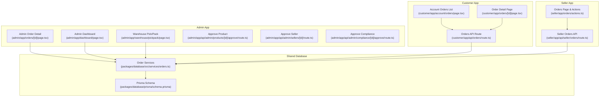
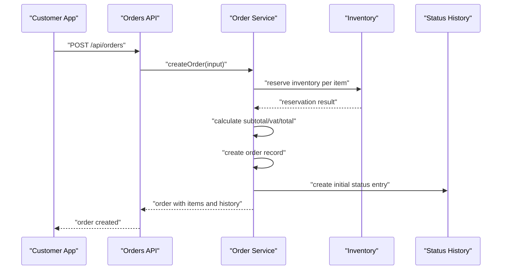
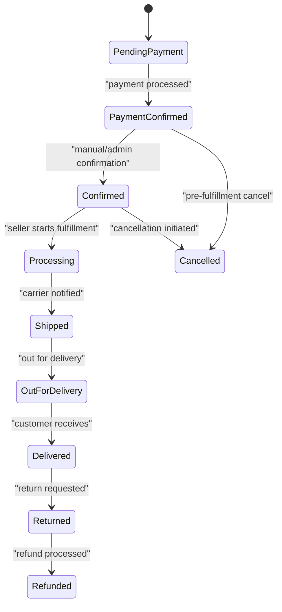
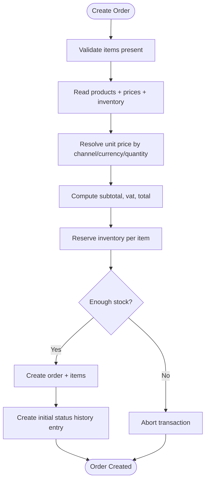
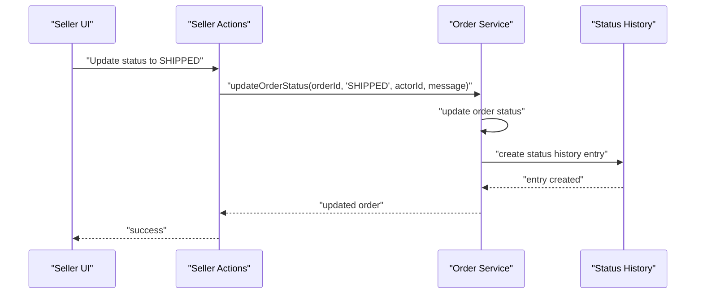
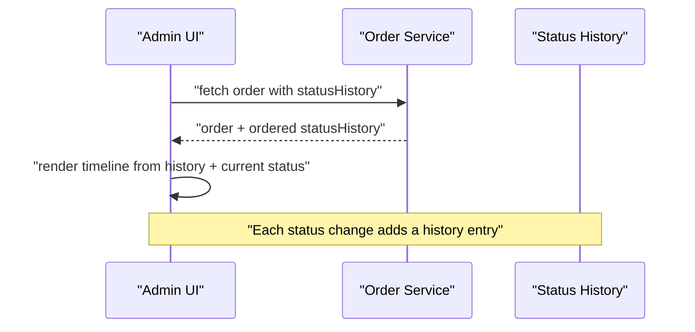
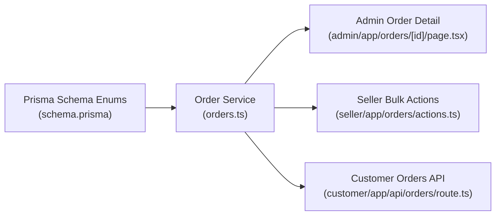

# Order Lifecycle Management

<cite>
**Referenced Files in This Document**
- [schema.prisma](file://packages/database/prisma/schema.prisma)
- [orders.ts](file://packages/database/src/services/orders.ts)
- [page.tsx](file://apps/admin/src/app/orders/[id]/page.tsx)
- [page.tsx](file://apps/admin/src/app/dashboard/page.tsx)
- [page.tsx](file://apps/admin/src/app/warehouse/pickpack/page.tsx)
- [actions.ts](file://apps/seller/src/app/orders/actions.ts)
- [page.tsx](file://apps/customer/src/app/account/orders/page.tsx)
- [page.tsx](file://apps/customer/src/app/orders/[id]/page.tsx)
- [route.ts](file://apps/customer/src/app/api/orders/route.ts)
- [route.ts](file://apps/admin/src/app/api/admin/compliance/[id]/approve/route.ts)
- [route.ts](file://apps/admin/src/app/api/admin/products/[id]/approve/route.ts)
- [route.ts](file://apps/admin/src/app/api/admin/sellers/[id]/route.ts)
- [route.ts](file://apps/seller/src/app/api/seller/dashboard/route.ts)
- [route.ts](file://apps/seller/src/app/api/seller/orders/route.ts)
</cite>

## Table of Contents
1. [Introduction](#introduction)
2. [Project Structure](#project-structure)
3. [Core Components](#core-components)
4. [Architecture Overview](#architecture-overview)
5. [Detailed Component Analysis](#detailed-component-analysis)
6. [Dependency Analysis](#dependency-analysis)
7. [Performance Considerations](#performance-considerations)
8. [Troubleshooting Guide](#troubleshooting-guide)
9. [Conclusion](#conclusion)
10. [Appendices](#appendices)

## Introduction
This document describes the order lifecycle management system across the Avenick commerce platform. It covers the end-to-end order journey from placement to completion, including order states, entry and validation processes, data capture, modifications, status transitions, audit trails, search and filtering, bulk operations, history tracking, customer communication triggers, automated updates, and partial fulfillment. It also provides state diagrams and transition logic grounded in the repository’s schema and services.

## Project Structure
The order lifecycle spans three applications and a shared database package:
- Customer app: places orders, views order details, and tracks status.
- Seller app: fulfills orders, updates statuses, and performs bulk operations.
- Admin app: monitors orders, approves compliance/product/seller actions, and manages dashboards.
- Shared database package: defines the domain model, enums, and order service functions.

**Diagram sources**
- [page.tsx](file://apps/customer/src/app/account/orders/page.tsx)
- [page.tsx](file://apps/customer/src/app/orders/[id]/page.tsx)
- [route.ts](file://apps/customer/src/app/api/orders/route.ts)
- [actions.ts](file://apps/seller/src/app/orders/actions.ts)
- [route.ts](file://apps/seller/src/app/api/seller/orders/route.ts)
- [page.tsx](file://apps/admin/src/app/orders/[id]/page.tsx)
- [page.tsx](file://apps/admin/src/app/dashboard/page.tsx)
- [page.tsx](file://apps/admin/src/app/warehouse/pickpack/page.tsx)
- [route.ts](file://apps/admin/src/app/api/admin/compliance/[id]/approve/route.ts)
- [route.ts](file://apps/admin/src/app/api/admin/products/[id]/approve/route.ts)
- [route.ts](file://apps/admin/src/app/api/admin/sellers/[id]/route.ts)
- [schema.prisma](file://packages/database/prisma/schema.prisma)
- [orders.ts](file://packages/database/src/services/orders.ts)

**Section sources**
- [schema.prisma](file://packages/database/prisma/schema.prisma)
- [orders.ts](file://packages/database/src/services/orders.ts)
- [page.tsx](file://apps/admin/src/app/orders/[id]/page.tsx)
- [page.tsx](file://apps/admin/src/app/dashboard/page.tsx)
- [page.tsx](file://apps/admin/src/app/warehouse/pickpack/page.tsx)
- [actions.ts](file://apps/seller/src/app/orders/actions.ts)
- [page.tsx](file://apps/customer/src/app/account/orders/page.tsx)
- [page.tsx](file://apps/customer/src/app/orders/[id]/page.tsx)
- [route.ts](file://apps/customer/src/app/api/orders/route.ts)

## Core Components
- Domain model and enums define order states, types, and related statuses.
- Order service encapsulates order creation, validation, inventory reservation, and status updates.
- UI pages render order details, timelines, and status controls.
- Bulk operations enable sellers to update multiple orders atomically.
- Admin dashboards and warehouse views integrate order visibility and fulfillment steps.

Key responsibilities:
- Order creation with pricing, VAT calculation, and inventory reservation.
- Atomic status transitions with audit trail entries.
- Search/filtering and pagination for seller and admin views.
- Timeline rendering and status badges for customer and admin.

**Section sources**
- [schema.prisma](file://packages/database/prisma/schema.prisma)
- [orders.ts](file://packages/database/src/services/orders.ts)
- [page.tsx](file://apps/admin/src/app/orders/[id]/page.tsx)
- [actions.ts](file://apps/seller/src/app/orders/actions.ts)

## Architecture Overview
The order lifecycle is orchestrated by the shared database package and surfaced through Next.js app routes and pages. The customer-facing routes handle order placement and viewing, while seller and admin routes manage fulfillment and oversight.

**Diagram sources**
- [route.ts](file://apps/customer/src/app/api/orders/route.ts)
- [orders.ts](file://packages/database/src/services/orders.ts)

## Detailed Component Analysis

### Order States and Transitions
The system defines a comprehensive set of order states and related statuses. The primary order status enum includes multiple stages from payment to delivery and cancellation/refund/return states.

**Diagram sources**
- [schema.prisma](file://packages/database/prisma/schema.prisma)

Operational transitions:
- Creation initializes with a pending-payment state and an initial status history entry.
- Sellers can update status to confirmed, processing, shipped, out_for_delivery, and delivered.
- Administrative and system events can move orders to returned/refunded or cancelled.

**Section sources**
- [orders.ts](file://packages/database/src/services/orders.ts)
- [schema.prisma](file://packages/database/prisma/schema.prisma)

### Order Entry, Validation, and Data Capture
Order creation validates inputs, resolves pricing tiers, calculates totals, reserves inventory, and records status history atomically.

Validation and capture highlights:
- Items must be present; otherwise, creation fails early.
- Product existence and availability are verified via a single read of catalog/pricing/inventory.
- Pricing tiers are resolved by channel, currency, and quantity; missing tiers cause failure.
- VAT rates are applied per line and aggregated; totals are computed and rounded consistently.
- Inventory is reserved across stock rows to prevent overselling; insufficient stock aborts the transaction.
- A status history entry is created alongside the order.

**Diagram sources**
- [orders.ts](file://packages/database/src/services/orders.ts)

**Section sources**
- [orders.ts](file://packages/database/src/services/orders.ts)

### Order Modification Workflows and Audit Trails
Status updates are performed atomically: the order status is updated and a corresponding status history entry is created. This ensures a complete audit trail of who changed the status and when.

Key behaviors:
- Transactional update guarantees consistency between status and history.
- Optional actor ID and message allow attribution and context.
- Bulk updates are supported for sellers with validation to ensure ownership.

**Diagram sources**
- [actions.ts](file://apps/seller/src/app/orders/actions.ts)
- [orders.ts](file://packages/database/src/services/orders.ts)

**Section sources**
- [orders.ts](file://packages/database/src/services/orders.ts)
- [actions.ts](file://apps/seller/src/app/orders/actions.ts)

### Search, Filtering, and Bulk Operations
- Sellers can filter orders by status and paginate results.
- Bulk status updates are restricted to allowed statuses and enforced by ownership checks.
- Admin dashboards and warehouse views surface order lists with status badges and timeline indicators.

Highlights:
- Seller orders query filters by seller ownership and optional status.
- Bulk operation validates target order IDs belong to the seller before updating.
- Revalidation refreshes cached views after bulk updates.

**Section sources**
- [orders.ts](file://packages/database/src/services/orders.ts)
- [actions.ts](file://apps/seller/src/app/orders/actions.ts)
- [page.tsx](file://apps/admin/src/app/dashboard/page.tsx)
- [page.tsx](file://apps/admin/src/app/warehouse/pickpack/page.tsx)

### Order History Tracking and Communication Triggers
- Status history captures all transitions with timestamps and optional actor/message.
- Admin order detail renders a timeline based on status history and current status.
- Customer and admin pages display order status badges and timeline steps.

**Diagram sources**
- [page.tsx](file://apps/admin/src/app/orders/[id]/page.tsx)
- [orders.ts](file://packages/database/src/services/orders.ts)

**Section sources**
- [page.tsx](file://apps/admin/src/app/orders/[id]/page.tsx)
- [orders.ts](file://packages/database/src/services/orders.ts)

### Automated Status Updates and Partial Fulfillment
- Automated transitions occur when payment is confirmed and when manual actions advance the order (e.g., shipped/out_for_delivery/delivered).
- Partial fulfillment is not explicitly modeled in the schema; however, inventory reservation occurs per item during creation, enabling later split/consolidation at the UI level if needed.

Recommendations:
- Introduce “fulfilledQuantity” per order item to track partial fulfillment.
- Add “splitFrom” and “splitTo” references to support order splitting/consolidation with audit trails.

[No sources needed since this section provides general guidance]

### Customer and Admin Views
- Customer account orders list and order detail pages show order status, items, and timeline.
- Admin order detail page mirrors the timeline and includes user/company context.
- Admin dashboard and warehouse pick/pack views display orders with status badges and actionable buttons aligned with fulfillment steps.

**Section sources**
- [page.tsx](file://apps/customer/src/app/account/orders/page.tsx)
- [page.tsx](file://apps/customer/src/app/orders/[id]/page.tsx)
- [page.tsx](file://apps/admin/src/app/orders/[id]/page.tsx)
- [page.tsx](file://apps/admin/src/app/dashboard/page.tsx)
- [page.tsx](file://apps/admin/src/app/warehouse/pickpack/page.tsx)

## Dependency Analysis
The order lifecycle depends on:
- Prisma schema enums and relations for modeling order states and related entities.
- Order service functions for creation, inventory reservation, and status updates.
- UI pages and actions for rendering, validation, and mutation.

**Diagram sources**
- [schema.prisma](file://packages/database/prisma/schema.prisma)
- [orders.ts](file://packages/database/src/services/orders.ts)
- [page.tsx](file://apps/admin/src/app/orders/[id]/page.tsx)
- [actions.ts](file://apps/seller/src/app/orders/actions.ts)
- [route.ts](file://apps/customer/src/app/api/orders/route.ts)

**Section sources**
- [schema.prisma](file://packages/database/prisma/schema.prisma)
- [orders.ts](file://packages/database/src/services/orders.ts)
- [page.tsx](file://apps/admin/src/app/orders/[id]/page.tsx)
- [actions.ts](file://apps/seller/src/app/orders/actions.ts)
- [route.ts](file://apps/customer/src/app/api/orders/route.ts)

## Performance Considerations
- Single-pass catalog read minimizes N+1 queries and ensures consistent pricing/inventory checks.
- Inventory reservation across stock rows prevents overselling under concurrency.
- Transactional status updates guarantee atomicity of state and audit trail.
- Pagination and seller-scoped filters reduce load on large datasets.

[No sources needed since this section provides general guidance]

## Troubleshooting Guide
Common issues and resolutions:
- Insufficient stock: creation fails if available quantity is less than requested; adjust quantities or restock inventory.
- Missing pricing tier: creation fails if no active price matches channel/currency/quantity; verify product pricing configuration.
- Unauthorized bulk updates: seller bulk action validates ownership; ensure order IDs belong to the logged-in seller.
- Status update failures: ensure status is allowed and actor context is provided; check audit trail for recent changes.

**Section sources**
- [orders.ts](file://packages/database/src/services/orders.ts)
- [actions.ts](file://apps/seller/src/app/orders/actions.ts)

## Conclusion
The order lifecycle system integrates robust validation, atomic operations, and clear audit trails. It supports end-to-end order management across customer, seller, and admin roles with explicit state transitions, history tracking, and scalable search/filtering. Extending support for partial fulfillment, splitting, and consolidation would further enhance operational flexibility.

[No sources needed since this section summarizes without analyzing specific files]

## Appendices

### Appendix A: Order States Reference
- PENDING_PAYMENT
- PAYMENT_CONFIRMED
- CONFIRMED
- PROCESSING
- SHIPPED
- OUT_FOR_DELIVERY
- DELIVERED
- CANCELLED
- REFUNDED
- RETURN_REQUESTED
- RETURNED

**Section sources**
- [schema.prisma](file://packages/database/prisma/schema.prisma)