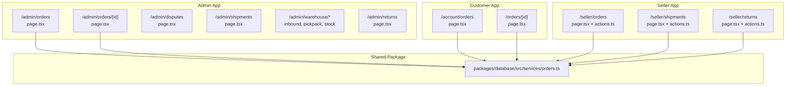
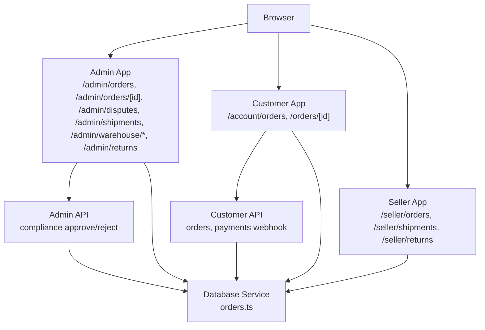
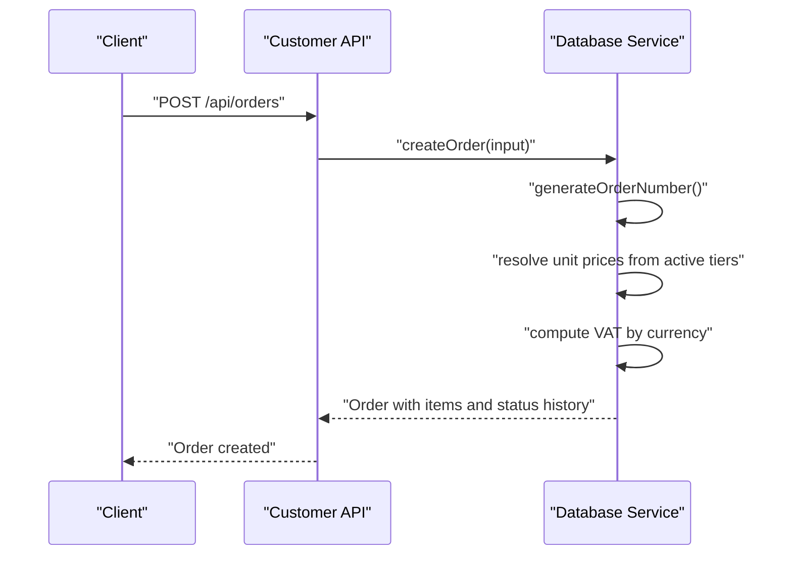
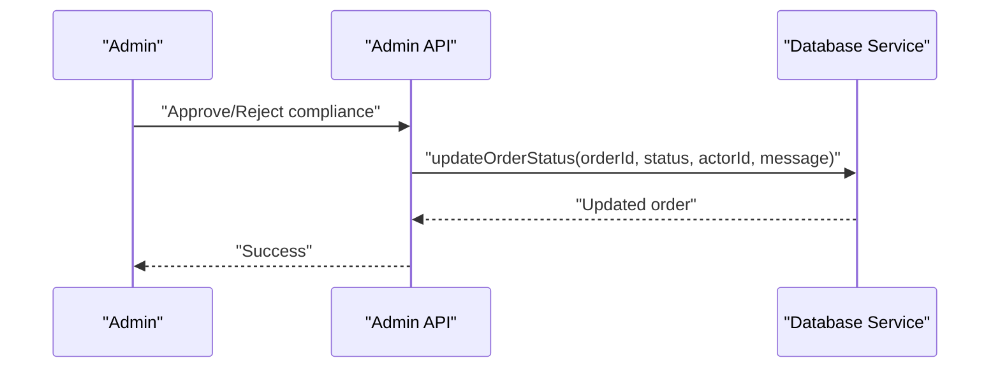
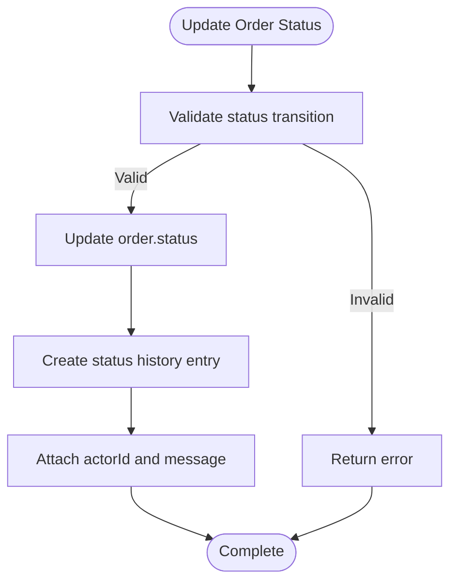
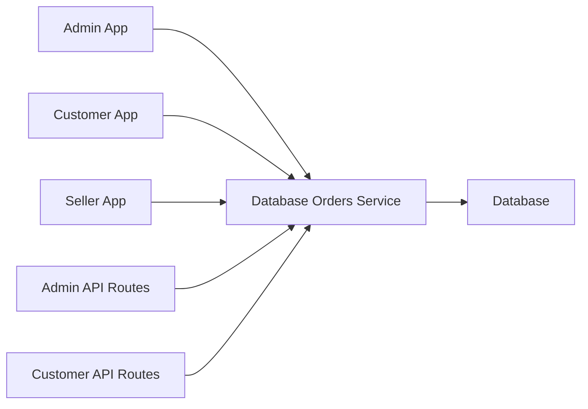

# Order Processing

<cite>
**Referenced Files in This Document**
- [MODULE_04_ORDERS_FULFILLMENT_NOTES.md](file://MODULE_04_ORDERS_FULFILLMENT_NOTES.md)
- [orders.ts](file://packages/database/src/services/orders.ts)
- [route.ts](file://apps/admin/src/app/api/admin/compliance/[id]/approve/route.ts)
- [route.ts](file://apps/admin/src/app/api/admin/compliance/[id]/reject/route.ts)
- [page.tsx](file://apps/admin/src/app/disputes/page.tsx)
- [page.tsx](file://apps/admin/src/app/shipments/page.tsx)
- [page.tsx](file://apps/admin/src/app/warehouse/inbound/page.tsx)
- [page.tsx](file://apps/admin/src/app/warehouse/pickpack/page.tsx)
- [page.tsx](file://apps/admin/src/app/warehouse/stock/page.tsx)
- [page.tsx](file://apps/admin/src/app/returns/page.tsx)
- [page.tsx](file://apps/customer/src/app/account/orders/page.tsx)
- [page.tsx](file://apps/customer/src/app/orders/[id]/page.tsx)
- [actions.ts](file://apps/seller/src/app/orders/actions.ts)
- [page.tsx](file://apps/seller/src/app/orders/page.tsx)
- [actions.ts](file://apps/seller/src/app/shipments/actions.ts)
- [page.tsx](file://apps/seller/src/app/shipments/page.tsx)
- [page.tsx](file://apps/seller/src/app/returns/actions.ts)
- [page.tsx](file://apps/seller/src/app/returns/page.tsx)
- [route.ts](file://apps/customer/src/app/api/orders/route.ts)
- [route.ts](file://apps/customer/src/app/api/payments/webhook/route.ts)
</cite>

## Table of Contents
1. [Introduction](#introduction)
2. [Project Structure](#project-structure)
3. [Core Components](#core-components)
4. [Architecture Overview](#architecture-overview)
5. [Detailed Component Analysis](#detailed-component-analysis)
6. [Dependency Analysis](#dependency-analysis)
7. [Performance Considerations](#performance-considerations)
8. [Troubleshooting Guide](#troubleshooting-guide)
9. [Conclusion](#con conclusion)
10. [Appendices](#appendices)

## Introduction
This document describes the Order Processing system across the Admin, Customer, Seller, and shared packages. It covers order lifecycle from receipt and verification to fulfillment, status management, tracking updates, customer communication, modifications, cancellations, refunds, analytics, filtering/search/batch operations, shipping provider integrations, label printing, packaging requirements, disputes, quality control, and compliance monitoring. The content synthesizes module notes and service-level implementations to present a practical, accessible guide for both technical and non-technical stakeholders.

## Project Structure
The Order Processing system spans three Next.js applications (Admin, Customer, Seller) and a shared database package. Key areas:
- Admin application: order management, disputes, compliance, shipments, warehouse, returns, performance analytics.
- Customer application: order account, order detail with tracking and timeline, returns flow.
- Seller application: order listing and actions, shipment creation, returns handling.
- Shared database package: order service with creation, status updates, and seller-scoped queries.

**Diagram sources**
- [MODULE_04_ORDERS_FULFILLMENT_NOTES.md](file://MODULE_04_ORDERS_FULFILLMENT_NOTES.md)
- [orders.ts](file://packages/database/src/services/orders.ts)
- [page.tsx](file://apps/admin/src/app/orders/page.tsx)
- [page.tsx](file://apps/admin/src/app/orders/[id]/page.tsx)
- [page.tsx](file://apps/admin/src/app/disputes/page.tsx)
- [page.tsx](file://apps/admin/src/app/shipments/page.tsx)
- [page.tsx](file://apps/admin/src/app/warehouse/inbound/page.tsx)
- [page.tsx](file://apps/admin/src/app/warehouse/pickpack/page.tsx)
- [page.tsx](file://apps/admin/src/app/warehouse/stock/page.tsx)
- [page.tsx](file://apps/admin/src/app/returns/page.tsx)
- [page.tsx](file://apps/customer/src/app/account/orders/page.tsx)
- [page.tsx](file://apps/customer/src/app/orders/[id]/page.tsx)
- [page.tsx](file://apps/seller/src/app/orders/page.tsx)
- [actions.ts](file://apps/seller/src/app/orders/actions.ts)
- [page.tsx](file://apps/seller/src/app/shipments/page.tsx)
- [actions.ts](file://apps/seller/src/app/shipments/actions.ts)
- [page.tsx](file://apps/seller/src/app/returns/page.tsx)
- [page.tsx](file://apps/seller/src/app/returns/actions.ts)

**Section sources**
- [MODULE_04_ORDERS_FULFILLMENT_NOTES.md](file://MODULE_04_ORDERS_FULFILLMENT_NOTES.md)

## Core Components
- Order creation and verification:
  - Order number generation with collision-resistant, human-readable format.
  - Server-side price resolution from active pricing tiers to prevent tampering.
  - VAT calculation by currency jurisdiction.
  - Transactional creation of order, items, and initial status history.
- Status management:
  - Centralized update function that atomically updates status and records history entries.
  - Status history captures actor and optional message for auditability.
- Seller-centric order retrieval:
  - Paginated, filterable queries scoped to a seller’s items.
- Admin/Customer/Seller surfaces:
  - Admin: order listing/detail with status actions, dispute alerts, compliance, shipments, warehouse, returns.
  - Customer: order account with filters and stats, order detail with tracking/timeline.
  - Seller: order list and actions, shipment creation, returns handling.

**Section sources**
- [orders.ts:7-12](file://packages/database/src/services/orders.ts#L7-L12)
- [orders.ts:14-26](file://packages/database/src/services/orders.ts#L14-L26)
- [orders.ts:29-31](file://packages/database/src/services/orders.ts#L29-L31)
- [orders.ts:124-143](file://packages/database/src/services/orders.ts#L124-L143)
- [orders.ts:146-152](file://packages/database/src/services/orders.ts#L146-L152)
- [orders.ts:154-162](file://packages/database/src/services/orders.ts#L154-L162)

## Architecture Overview
The order lifecycle integrates frontend pages with backend APIs and the shared database service. Payments and compliance are handled via dedicated API routes. Admin and Seller apps expose order management surfaces; Customer app exposes order visibility and returns.

**Diagram sources**
- [MODULE_04_ORDERS_FULFILLMENT_NOTES.md](file://MODULE_04_ORDERS_FULFILLMENT_NOTES.md)
- [orders.ts](file://packages/database/src/services/orders.ts)
- [route.ts](file://apps/admin/src/app/api/admin/compliance/[id]/approve/route.ts)
- [route.ts](file://apps/admin/src/app/api/admin/compliance/[id]/reject/route.ts)
- [route.ts](file://apps/customer/src/app/api/orders/route.ts)
- [route.ts](file://apps/customer/src/app/api/payments/webhook/route.ts)

## Detailed Component Analysis

### Order Receipt and Verification
- Receipt:
  - Order number generated with time and random suffix for uniqueness.
  - Items created with unit prices resolved server-side from active pricing tiers.
  - VAT computed per jurisdiction and included in totals.
- Verification:
  - Prices are not accepted from client; enforced server-side to prevent tampering.
  - Initial status set to “pending payment” with a status history entry.

**Diagram sources**
- [orders.ts:7-12](file://packages/database/src/services/orders.ts#L7-L12)
- [orders.ts:14-26](file://packages/database/src/services/orders.ts#L14-L26)
- [orders.ts:29-31](file://packages/database/src/services/orders.ts#L29-L31)
- [orders.ts:124-143](file://packages/database/src/services/orders.ts#L124-L143)
- [route.ts](file://apps/customer/src/app/api/orders/route.ts)

**Section sources**
- [orders.ts:7-12](file://packages/database/src/services/orders.ts#L7-L12)
- [orders.ts:14-26](file://packages/database/src/services/orders.ts#L14-L26)
- [orders.ts:29-31](file://packages/database/src/services/orders.ts#L29-L31)
- [orders.ts:124-143](file://packages/database/src/services/orders.ts#L124-L143)
- [route.ts](file://apps/customer/src/app/api/orders/route.ts)

### Order Fulfillment Workflow
- Status transitions:
  - Centralized update function ensures atomic status change and history logging.
- Admin/Seller actions:
  - Admin: order detail with status action buttons and timeline.
  - Seller: order list and actions for fulfillment.
- Tracking and delivery:
  - Customer order detail includes tracking card and timeline.
  - Shipments page for Admin and Seller to manage logistics.

**Diagram sources**
- [orders.ts:146-152](file://packages/database/src/services/orders.ts#L146-L152)
- [route.ts](file://apps/admin/src/app/api/admin/compliance/[id]/approve/route.ts)
- [route.ts](file://apps/admin/src/app/api/admin/compliance/[id]/reject/route.ts)

**Section sources**
- [orders.ts:146-152](file://packages/database/src/services/orders.ts#L146-L152)
- [MODULE_04_ORDERS_FULFILLMENT_NOTES.md](file://MODULE_04_ORDERS_FULFILLMENT_NOTES.md)
- [page.tsx](file://apps/admin/src/app/orders/[id]/page.tsx)
- [page.tsx](file://apps/seller/src/app/orders/page.tsx)
- [actions.ts](file://apps/seller/src/app/orders/actions.ts)
- [page.tsx](file://apps/admin/src/app/shipments/page.tsx)
- [page.tsx](file://apps/seller/src/app/shipments/page.tsx)
- [actions.ts](file://apps/seller/src/app/shipments/actions.ts)
- [page.tsx](file://apps/customer/src/app/orders/[id]/page.tsx)

### Order Status Management and History
- Status history:
  - Each status change creates a history record with actor and optional message.
- Auditability:
  - Timeline visible in Admin and Customer order detail pages.

**Diagram sources**
- [orders.ts:146-152](file://packages/database/src/services/orders.ts#L146-L152)

**Section sources**
- [orders.ts:146-152](file://packages/database/src/services/orders.ts#L146-L152)
- [MODULE_04_ORDERS_FULFILLMENT_NOTES.md](file://MODULE_04_ORDERS_FULFILLMENT_NOTES.md)

### Customer Communication Features
- Customer order detail:
  - Tracking card with copy/show and timeline.
  - Actions for returns/issues/invoice.
- Public paths:
  - Returns route included in customer public paths.

**Section sources**
- [MODULE_04_ORDERS_FULFILLMENT_NOTES.md](file://MODULE_04_ORDERS_FULFILLMENT_NOTES.md)
- [page.tsx](file://apps/customer/src/app/orders/[id]/page.tsx)

### Order Modification, Cancellation, and Refund Processing
- Modification:
  - Seller actions surface for managing orders.
- Cancellation:
  - Admin and Seller order detail/status action buttons enable cancellation flows.
- Refunds:
  - Admin returns page indicates refund processing in the returns flow.

**Section sources**
- [MODULE_04_ORDERS_FULFILLMENT_NOTES.md](file://MODULE_04_ORDERS_FULFILLMENT_NOTES.md)
- [page.tsx](file://apps/admin/src/app/orders/[id]/page.tsx)
- [page.tsx](file://apps/seller/src/app/orders/page.tsx)
- [actions.ts](file://apps/seller/src/app/orders/actions.ts)
- [page.tsx](file://apps/admin/src/app/returns/page.tsx)

### Analytics, Sales Trends, and Performance Metrics
- Admin dashboard and performance pages:
  - Analytics surfaces for sales trends and performance metrics.
- Customer analytics:
  - B2B analytics page available under customer app.

**Section sources**
- [MODULE_04_ORDERS_FULFILLMENT_NOTES.md](file://MODULE_04_ORDERS_FULFILLMENT_NOTES.md)
- [page.tsx](file://apps/admin/src/app/performance/page.tsx)
- [page.tsx](file://apps/customer/src/app/b2b/analytics/page.tsx)

### Filtering, Search, and Batch Operations
- Admin order listing:
  - Filter by status and type; dispute alerts; stats.
- Customer order account:
  - Filter tabs and stats row for in-progress, shipped, delivered.
- Batch operations:
  - Seller orders page and actions indicate batch-like operations via bulk actions.

**Section sources**
- [MODULE_04_ORDERS_FULFILLMENT_NOTES.md](file://MODULE_04_ORDERS_FULFILLMENT_NOTES.md)
- [page.tsx](file://apps/admin/src/app/orders/page.tsx)
- [page.tsx](file://apps/customer/src/app/account/orders/page.tsx)
- [page.tsx](file://apps/seller/src/app/orders/page.tsx)
- [actions.ts](file://apps/seller/src/app/orders/actions.ts)

### Shipping Provider Integrations, Label Printing, and Packaging
- Shipments:
  - Admin and Seller shipments pages for managing logistics.
  - Seller shipment actions for creating and updating shipment records.
- Label printing and packaging:
  - Warehouse pick/pack page indicates packaging workflows.

**Section sources**
- [MODULE_04_ORDERS_FULFILLMENT_NOTES.md](file://MODULE_04_ORDERS_FULFILLMENT_NOTES.md)
- [page.tsx](file://apps/admin/src/app/shipments/page.tsx)
- [page.tsx](file://apps/seller/src/app/shipments/page.tsx)
- [actions.ts](file://apps/seller/src/app/shipments/actions.ts)
- [page.tsx](file://apps/admin/src/app/warehouse/pickpack/page.tsx)

### Disputes, Quality Control, and Compliance Monitoring
- Disputes:
  - Admin disputes page for managing dispute workflows.
- Compliance:
  - Admin compliance approve/reject API routes for order/product/seller compliance checks.
- Quality control:
  - Admin warehouse stock and inbound pages support quality control processes.

**Section sources**
- [MODULE_04_ORDERS_FULFILLMENT_NOTES.md](file://MODULE_04_ORDERS_FULFILLMENT_NOTES.md)
- [page.tsx](file://apps/admin/src/app/disputes/page.tsx)
- [page.tsx](file://apps/admin/src/app/warehouse/stock/page.tsx)
- [page.tsx](file://apps/admin/src/app/warehouse/inbound/page.tsx)
- [route.ts](file://apps/admin/src/app/api/admin/compliance/[id]/approve/route.ts)
- [route.ts](file://apps/admin/src/app/api/admin/compliance/[id]/reject/route.ts)

## Dependency Analysis
The Admin, Customer, and Seller apps depend on the shared database service for order operations. Admin APIs handle compliance decisions; Customer APIs handle order creation and payment webhooks; Seller APIs manage orders, shipments, and returns.

**Diagram sources**
- [orders.ts](file://packages/database/src/services/orders.ts)
- [route.ts](file://apps/admin/src/app/api/admin/compliance/[id]/approve/route.ts)
- [route.ts](file://apps/admin/src/app/api/admin/compliance/[id]/reject/route.ts)
- [route.ts](file://apps/customer/src/app/api/orders/route.ts)
- [route.ts](file://apps/customer/src/app/api/payments/webhook/route.ts)

**Section sources**
- [orders.ts](file://packages/database/src/services/orders.ts)
- [MODULE_04_ORDERS_FULFILLMENT_NOTES.md](file://MODULE_04_ORDERS_FULFILLMENT_NOTES.md)

## Performance Considerations
- Server-side price resolution and VAT computation occur during order creation to avoid repeated client-server round trips.
- Transactional creation ensures atomicity of order, items, and status history.
- Paginated seller order queries reduce payload sizes for large inventories.
- Status updates leverage single transaction writes to minimize contention.

[No sources needed since this section provides general guidance]

## Troubleshooting Guide
- Order creation fails:
  - Verify server-side pricing tiers exist and match currency/channel.
  - Confirm VAT jurisdiction mapping aligns with currency.
- Status update errors:
  - Ensure status transitions are valid and actor context is provided.
- Payment webhook:
  - Validate webhook endpoint receives and processes payment events to finalize order state.
- Compliance decisions:
  - Approve/reject routes require proper authorization and actor context.

**Section sources**
- [orders.ts:124-143](file://packages/database/src/services/orders.ts#L124-L143)
- [orders.ts:146-152](file://packages/database/src/services/orders.ts#L146-L152)
- [route.ts](file://apps/customer/src/app/api/payments/webhook/route.ts)
- [route.ts](file://apps/admin/src/app/api/admin/compliance/[id]/approve/route.ts)
- [route.ts](file://apps/admin/src/app/api/admin/compliance/[id]/reject/route.ts)

## Conclusion
The Order Processing system integrates Admin, Customer, and Seller experiences with a robust shared database service. It supports secure order creation, auditable status management, customer-centric tracking and returns, and operational workflows for shipping, warehouse, disputes, compliance, and analytics. The modular structure enables scalable enhancements while maintaining clear separation of concerns.

[No sources needed since this section summarizes without analyzing specific files]

## Appendices
- Module notes confirm the addition of order management pages and updates to customer order detail and middleware.

**Section sources**
- [MODULE_04_ORDERS_FULFILLMENT_NOTES.md](file://MODULE_04_ORDERS_FULFILLMENT_NOTES.md)