# Inventory Control

<cite>
**Referenced Files in This Document**
- [page.tsx](file://apps/seller/src/app/inventory/page.tsx)
- [page.tsx](file://apps/admin/src/app/warehouse/stock/page.tsx)
- [page.tsx](file://apps/admin/src/app/warehouse/page.tsx)
- [inventory.ts](file://packages/database/src/services/inventory.ts)
- [schema.prisma](file://packages/database/prisma/schema.prisma)
- [route.ts](file://packages/database/src/services/orders.ts)
- [MODULE_05_WAREHOUSE_3PL_NOTES.md](file://MODULE_05_WAREHOUSE_3PL_NOTES.md)
- [PHASE3_IMPLEMENTATION_NOTES.md](file://PHASE3_IMPLEMENTATION_NOTES.md)
</cite>

## Table of Contents
1. [Introduction](#introduction)
2. [Project Structure](#project-structure)
3. [Core Components](#core-components)
4. [Architecture Overview](#architecture-overview)
5. [Detailed Component Analysis](#detailed-component-analysis)
6. [Dependency Analysis](#dependency-analysis)
7. [Performance Considerations](#performance-considerations)
8. [Troubleshooting Guide](#troubleshooting-guide)
9. [Conclusion](#conclusion)
10. [Appendices](#appendices)

## Introduction
This document describes the Inventory Control system in the commerce platform. It covers stock level tracking, automatic inventory updates from orders, manual stock adjustments, low-stock alerts and thresholds, inventory reservation during order processing, backorder handling, restocking procedures, bulk inventory updates, CSV import/export, inventory synchronization with external systems, analytics such as stock turnover and carrying costs, and warehouse location tracking with multi-location inventory management.

## Project Structure
The Inventory Control system spans three primary areas:
- Frontend pages for sellers and administrators to view and manage inventory
- Database schema modeling inventory, locations, and movements
- Backend services orchestrating inventory reservations and adjustments

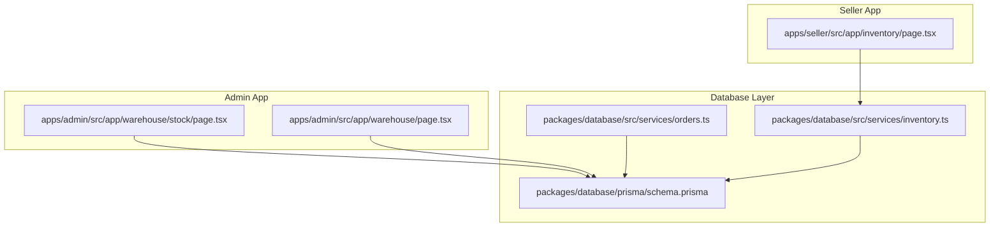

**Diagram sources**
- [page.tsx](file://apps/seller/src/app/inventory/page.tsx)
- [page.tsx](file://apps/admin/src/app/warehouse/stock/page.tsx)
- [page.tsx](file://apps/admin/src/app/warehouse/page.tsx)
- [inventory.ts](file://packages/database/src/services/inventory.ts)
- [schema.prisma](file://packages/database/prisma/schema.prisma)
- [route.ts](file://packages/database/src/services/orders.ts)

**Section sources**
- [page.tsx](file://apps/seller/src/app/inventory/page.tsx)
- [page.tsx](file://apps/admin/src/app/warehouse/stock/page.tsx)
- [page.tsx](file://apps/admin/src/app/warehouse/page.tsx)
- [inventory.ts](file://packages/database/src/services/inventory.ts)
- [schema.prisma](file://packages/database/prisma/schema.prisma)
- [route.ts](file://packages/database/src/services/orders.ts)

## Core Components
- InventoryStock: Tracks on-hand quantities, reserved quantities, reorder point, and warehouse location association.
- InventoryLocation: Represents warehouse locations and bins with unique codes.
- InventoryMovement: Records inventory adjustments and transactions for auditability.
- getSellerInventory: Aggregates stock per product, computes available quantity, and flags low/out-of-stock conditions.
- adjustInventory: Performs atomic stock adjustments and logs movements.
- Order placement: Reserves inventory across stock rows greedily and prevents overselling.

Key capabilities:
- Multi-location tracking via InventoryLocation and InventoryStock
- Low-stock thresholds via reorderPoint and computed flags
- Reservation and backorder prevention during order creation
- Movement audit trail via InventoryMovement

**Section sources**
- [inventory.ts](file://packages/database/src/services/inventory.ts)
- [schema.prisma](file://packages/database/prisma/schema.prisma)
- [route.ts](file://packages/database/src/services/orders.ts)

## Architecture Overview
The system integrates frontend dashboards with Prisma models and backend services. Sellers view their inventory with low/out indicators. Administrators manage stock, apply filters, and trigger replenishment. Orders reserve inventory atomically to prevent overselling.

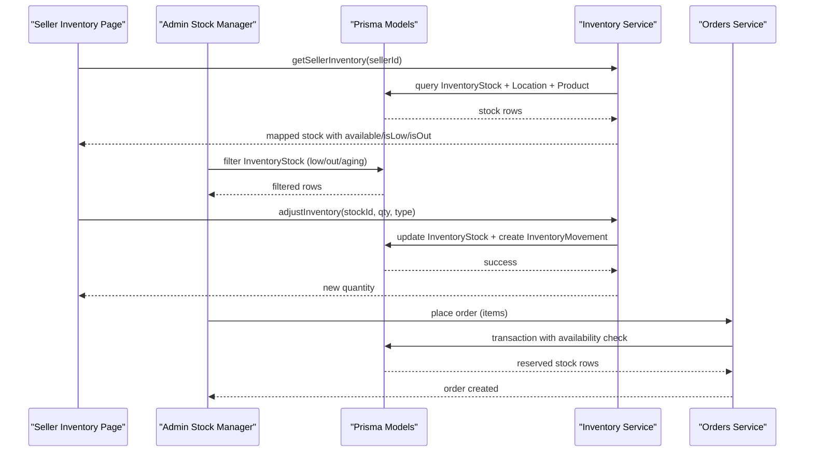

**Diagram sources**
- [page.tsx](file://apps/seller/src/app/inventory/page.tsx)
- [page.tsx](file://apps/admin/src/app/warehouse/stock/page.tsx)
- [inventory.ts](file://packages/database/src/services/inventory.ts)
- [route.ts](file://packages/database/src/services/orders.ts)
- [schema.prisma](file://packages/database/prisma/schema.prisma)

## Detailed Component Analysis

### InventoryStock and Locations
- InventoryStock holds productId/variantId, locationId, qty, reservedQty, and reorderPoint.
- InventoryLocation defines warehouse associations and physical codes (zone/aisle/bin).
- Indexes and relations ensure efficient queries and referential integrity.

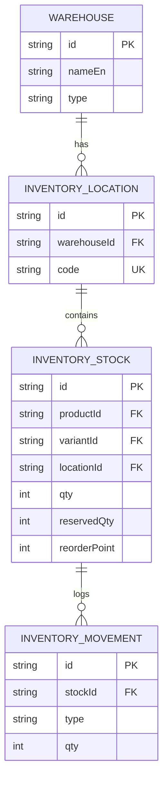

**Diagram sources**
- [schema.prisma](file://packages/database/prisma/schema.prisma)

**Section sources**
- [schema.prisma](file://packages/database/prisma/schema.prisma)

### Seller Inventory Dashboard
- Displays stock rows with product image, SKU, warehouse, on-hand, reserved, available, reorder point, and status.
- Highlights low/out items and provides quick actions to replenish.

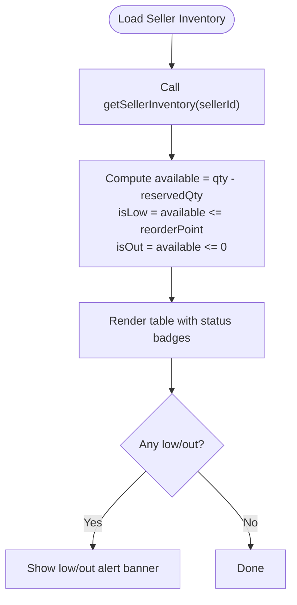

**Diagram sources**
- [page.tsx](file://apps/seller/src/app/inventory/page.tsx)
- [inventory.ts](file://packages/database/src/services/inventory.ts)

**Section sources**
- [page.tsx](file://apps/seller/src/app/inventory/page.tsx)
- [inventory.ts](file://packages/database/src/services/inventory.ts)

### Admin Stock Manager
- Filters: All, Low Stock, Out of Stock, Aging (60+ days).
- Search input (client-side UI with server-side filtering).
- Color-coded Available column and Reorder action for low/out items.

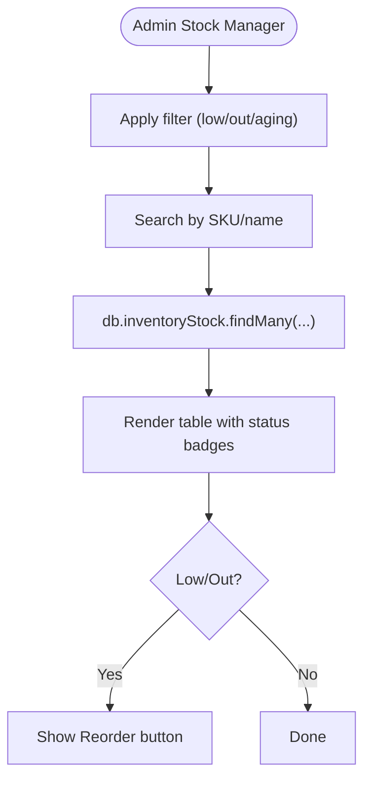

**Diagram sources**
- [page.tsx](file://apps/admin/src/app/warehouse/stock/page.tsx)
- [schema.prisma](file://packages/database/prisma/schema.prisma)

**Section sources**
- [page.tsx](file://apps/admin/src/app/warehouse/stock/page.tsx)
- [MODULE_05_WAREHOUSE_3PL_NOTES.md](file://MODULE_05_WAREHOUSE_3PL_NOTES.md)

### Low-Stock Alerts and Thresholds
- Thresholds: reorderPoint determines low stock; available = qty - reservedQty.
- Alerts: Seller dashboard highlights out-of-stock and low-stock SKUs.
- Aging: Admin dashboard surfaces aging inventory (60+ days) for review.

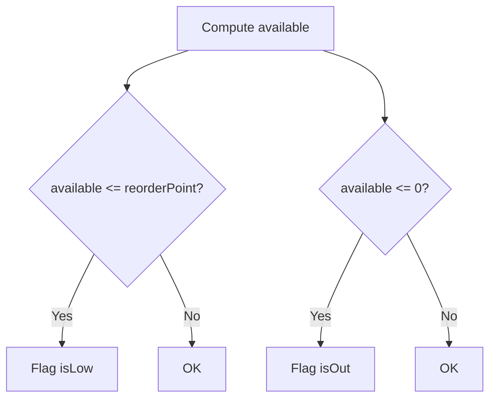

**Diagram sources**
- [inventory.ts](file://packages/database/src/services/inventory.ts)
- [page.tsx](file://apps/admin/src/app/warehouse/page.tsx)

**Section sources**
- [inventory.ts](file://packages/database/src/services/inventory.ts)
- [page.tsx](file://apps/admin/src/app/warehouse/page.tsx)
- [MODULE_05_WAREHOUSE_3PL_NOTES.md](file://MODULE_05_WAREHOUSE_3PL_NOTES.md)

### Automatic Inventory Updates from Orders
- Orders are created atomically with inventory reservation.
- Availability across all matching stock rows is summed; if insufficient, the operation fails.
- Reservation is greedy across rows ordered by last update time to distribute reservations fairly.

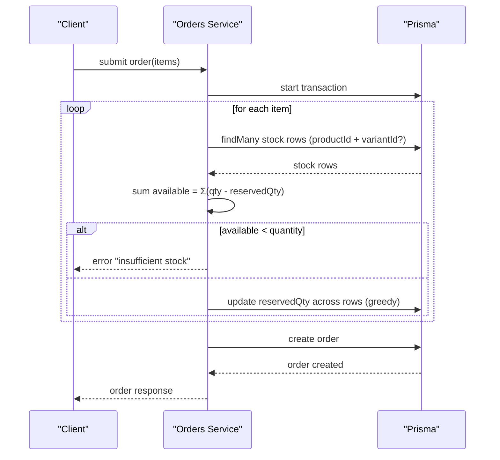

**Diagram sources**
- [route.ts](file://packages/database/src/services/orders.ts)

**Section sources**
- [route.ts](file://packages/database/src/services/orders.ts)
- [PHASE3_IMPLEMENTATION_NOTES.md](file://PHASE3_IMPLEMENTATION_NOTES.md)

### Manual Stock Adjustments
- adjustInventory supports INCREASE, DECREASE, and ADJUSTMENT types.
- Enforces non-negative resulting quantities.
- Logs each adjustment as an InventoryMovement for auditability.

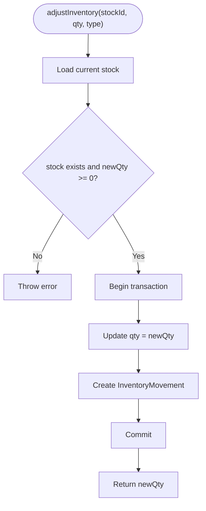

**Diagram sources**
- [inventory.ts](file://packages/database/src/services/inventory.ts)
- [schema.prisma](file://packages/database/prisma/schema.prisma)

**Section sources**
- [inventory.ts](file://packages/database/src/services/inventory.ts)

### Backorder Handling and Restocking
- Backorders occur when available inventory is insufficient at order time; the order creation fails with a clear message.
- After restocking, reserved inventory remains reserved until fulfilled or released; administrators can reconcile and release as needed.
- Movement logs enable tracing of adjustments and resolutions.

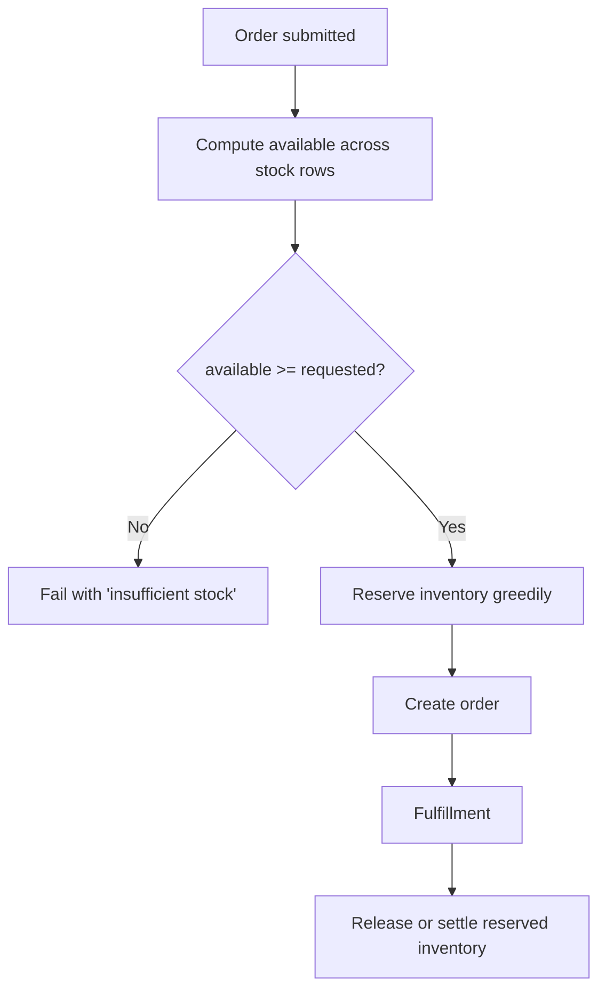

**Diagram sources**
- [route.ts](file://packages/database/src/services/orders.ts)
- [inventory.ts](file://packages/database/src/services/inventory.ts)

**Section sources**
- [route.ts](file://packages/database/src/services/orders.ts)
- [PHASE3_IMPLEMENTATION_NOTES.md](file://PHASE3_IMPLEMENTATION_NOTES.md)

### Bulk Inventory Updates and CSV Import/Export
- CSV import/export is supported in product management contexts, enabling bulk updates to product attributes and stock levels.
- The import process validates headers, parses CSV rows, and applies updates with feedback and error reporting.
- Export generates a CSV with standardized headers for downstream reconciliation.

Note: While dedicated inventory CSV endpoints are not present in the referenced files, the existing product CSV infrastructure demonstrates the capability and can be extended to inventory.

**Section sources**
- [page.tsx](file://apps/seller/src/components/products-table.tsx)
- [MODULE_05_WAREHOUSE_3PL_NOTES.md](file://MODULE_05_WAREHOUSE_3PL_NOTES.md)

### Inventory Analytics
- Aging inventory: Admin dashboard surfaces items aged 60+ days for review.
- Utilization and capacity: Warehouse overview shows utilization percentages and free capacity per location.
- Category stock distribution: Admin dashboard visualizes stock by category for strategic planning.

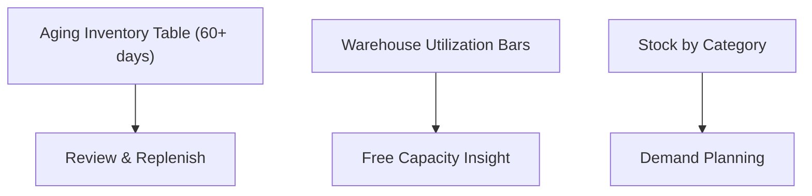

**Diagram sources**
- [page.tsx](file://apps/admin/src/app/warehouse/page.tsx)
- [MODULE_05_WAREHOUSE_3PL_NOTES.md](file://MODULE_05_WAREHOUSE_3PL_NOTES.md)

**Section sources**
- [page.tsx](file://apps/admin/src/app/warehouse/page.tsx)
- [MODULE_05_WAREHOUSE_3PL_NOTES.md](file://MODULE_05_WAREHOUSE_3PL_NOTES.md)

### Warehouse Location Tracking and Multi-Location Management
- InventoryStock references InventoryLocation via locationId.
- InventoryLocation belongs to a Warehouse and includes physical codes (zone/aisle/bin).
- Multi-location inventory enables distributed fulfillment and centralized reporting.

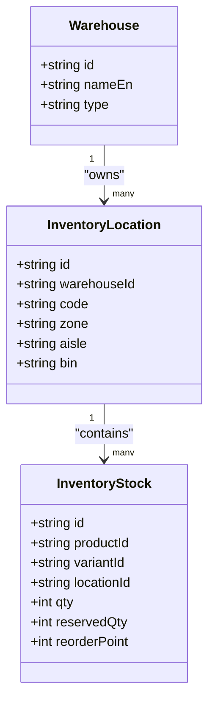

**Diagram sources**
- [schema.prisma](file://packages/database/prisma/schema.prisma)

**Section sources**
- [schema.prisma](file://packages/database/prisma/schema.prisma)

## Dependency Analysis
- Seller Inventory depends on getSellerInventory for aggregated stock and computed flags.
- Admin Stock Manager depends on Prisma models for filtering and rendering.
- Orders Service depends on InventoryStock to enforce availability and reserve inventory.
- Inventory Service encapsulates stock adjustments and movement logging.

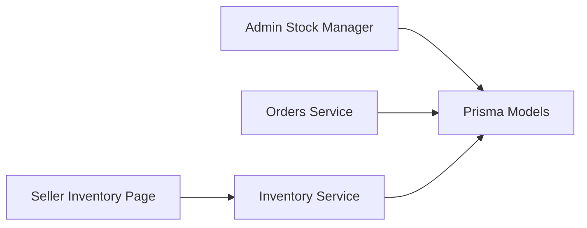

**Diagram sources**
- [page.tsx](file://apps/seller/src/app/inventory/page.tsx)
- [page.tsx](file://apps/admin/src/app/warehouse/stock/page.tsx)
- [inventory.ts](file://packages/database/src/services/inventory.ts)
- [route.ts](file://packages/database/src/services/orders.ts)
- [schema.prisma](file://packages/database/prisma/schema.prisma)

**Section sources**
- [page.tsx](file://apps/seller/src/app/inventory/page.tsx)
- [page.tsx](file://apps/admin/src/app/warehouse/stock/page.tsx)
- [inventory.ts](file://packages/database/src/services/inventory.ts)
- [route.ts](file://packages/database/src/services/orders.ts)
- [schema.prisma](file://packages/database/prisma/schema.prisma)

## Performance Considerations
- Use indexes on productId, variantId, and locationId for fast stock lookups.
- Prefer server-side filtering for large datasets (as seen in Admin Stock Manager).
- Batch operations for bulk updates to reduce round trips.
- Monitor transaction contention during high-order volumes; consider optimistic locking and retry strategies.

## Troubleshooting Guide
Common issues and resolutions:
- Insufficient stock during order placement: Verify available equals or exceeds requested quantity across stock rows; ensure no concurrent oversell conflicts.
- Negative stock after adjustment: adjustInventory prevents negative quantities; confirm inputs and permissions.
- Missing low/out alerts: Confirm reorderPoint values and computed flags; check UI filters.
- Aging inventory not surfaced: Ensure aging thresholds and warehouse filters are configured as intended.

**Section sources**
- [route.ts](file://packages/database/src/services/orders.ts)
- [inventory.ts](file://packages/database/src/services/inventory.ts)
- [page.tsx](file://apps/admin/src/app/warehouse/page.tsx)

## Conclusion
The Inventory Control system provides robust multi-location tracking, automated reservations during order processing, and clear low-stock and aging insights. Manual adjustments and movement logging ensure auditability, while the modular design supports future extensions such as dedicated inventory CSV endpoints and deeper analytics.

## Appendices
- Implementation notes confirm atomic order creation with oversell guards and improved error semantics.
- Module notes document warehouse pages, filters, and UI behaviors.

**Section sources**
- [PHASE3_IMPLEMENTATION_NOTES.md](file://PHASE3_IMPLEMENTATION_NOTES.md)
- [MODULE_05_WAREHOUSE_3PL_NOTES.md](file://MODULE_05_WAREHOUSE_3PL_NOTES.md)