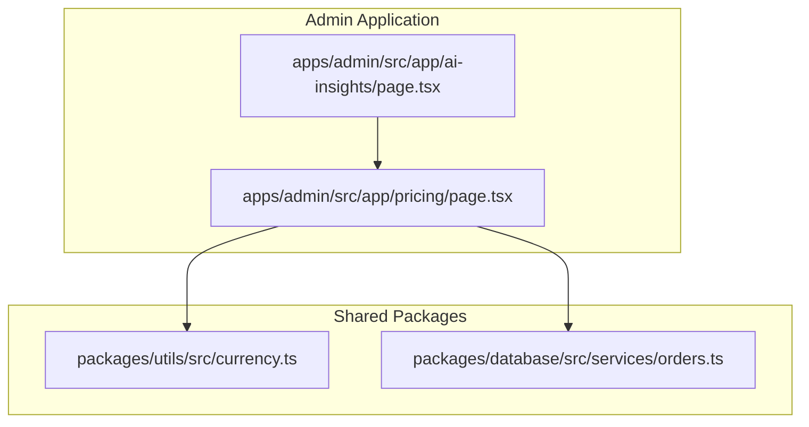
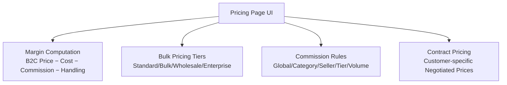
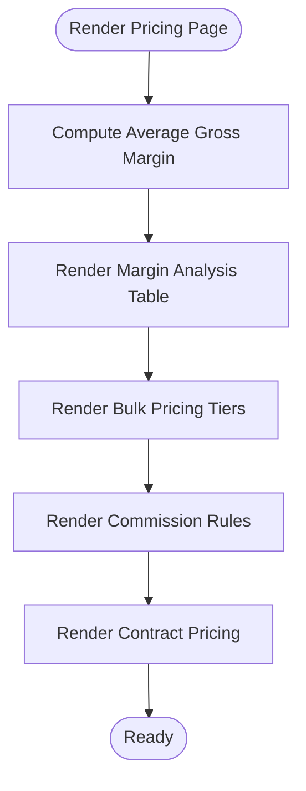
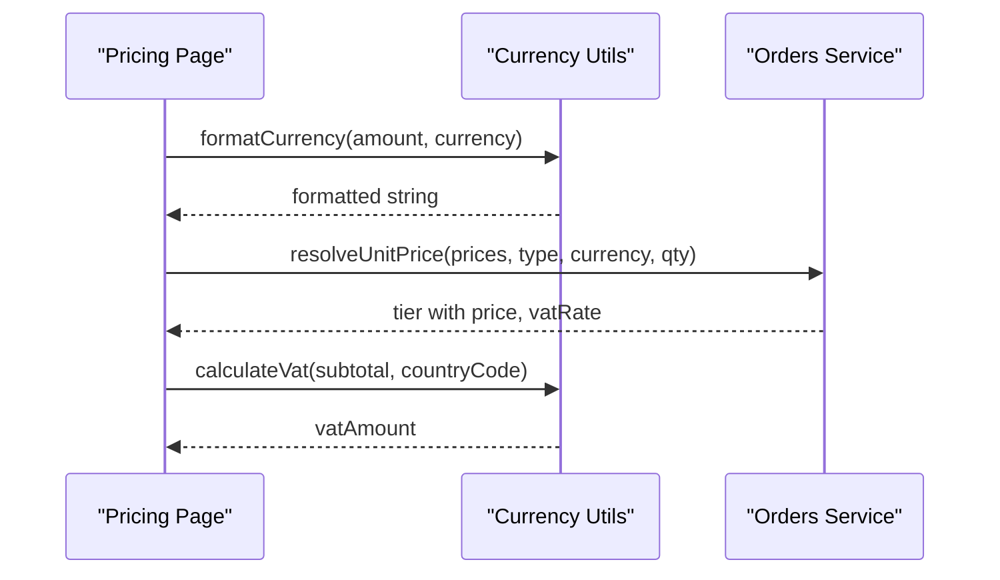
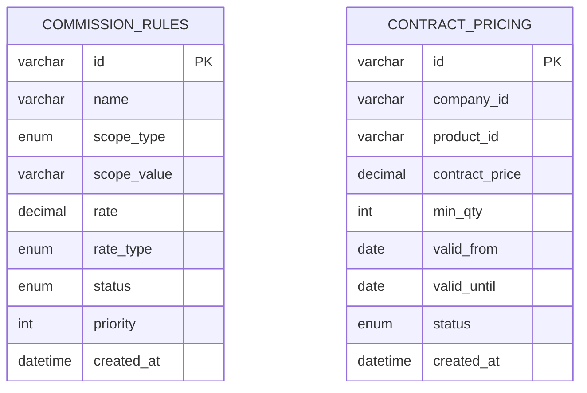
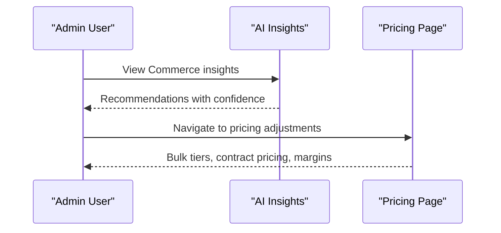
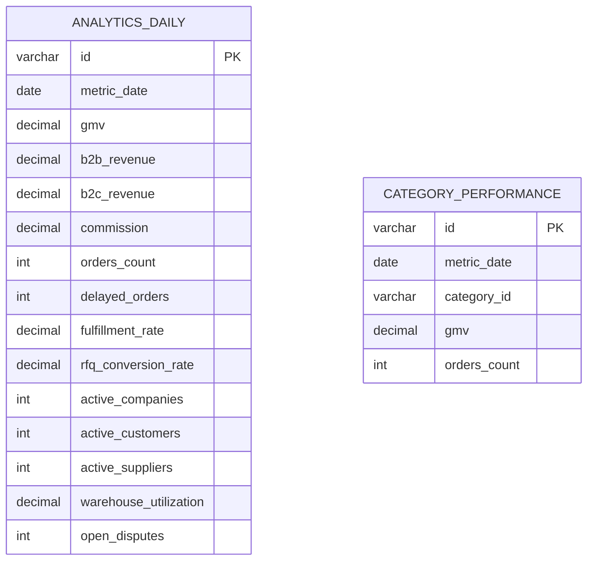
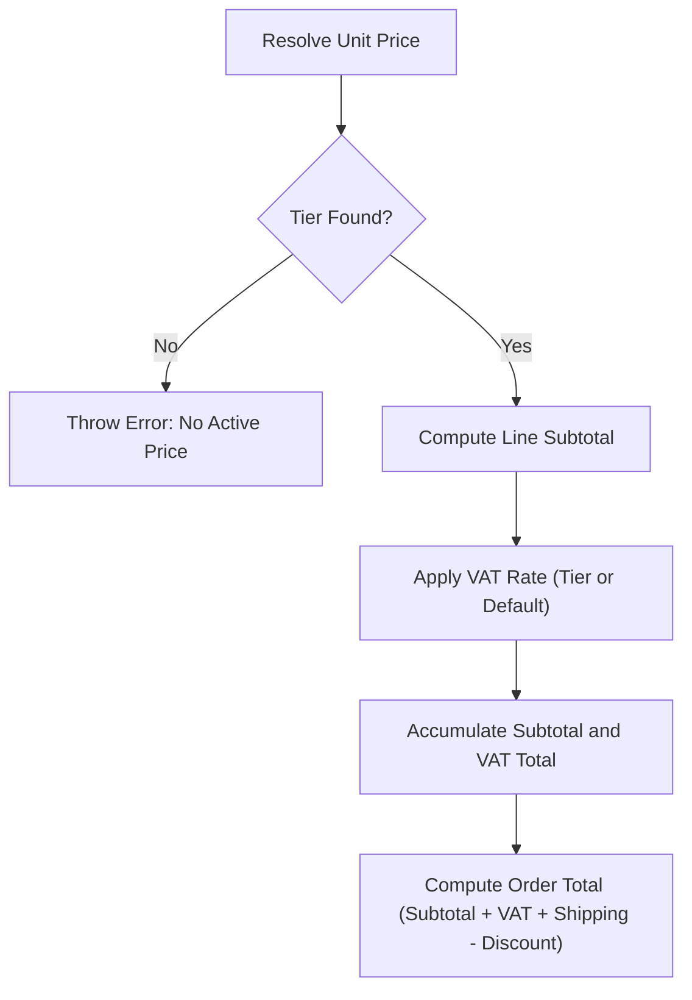
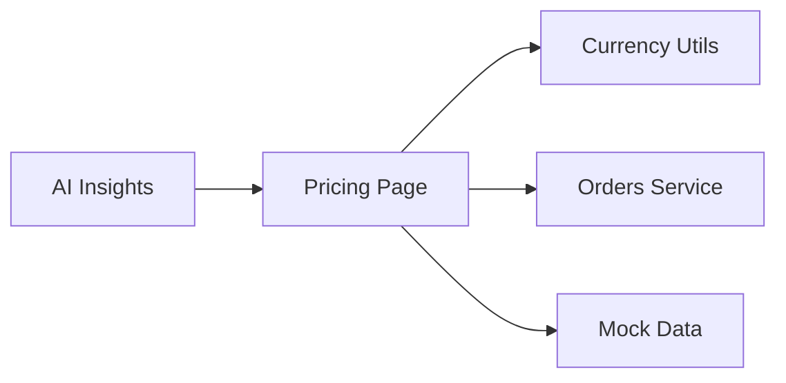

# Pricing Management

<cite>
**Referenced Files in This Document**
- [page.tsx](file://apps/admin/src/app/pricing/page.tsx)
- [MODULE_10_PRICING_COMMISSION_NOTES.md](file://MODULE_10_PRICING_COMMISSION_NOTES.md)
- [orders.ts](file://packages/database/src/services/orders.ts)
- [currency.ts](file://packages/utils/src/currency.ts)
- [page.tsx](file://apps/admin/src/app/ai-insights/page.tsx)
- [EXECUTIVE_DASHBOARD_NOTES.md](file://EXECUTIVE_DASHBOARD_NOTES.md)
</cite>

## Table of Contents
1. [Introduction](#introduction)
2. [Project Structure](#project-structure)
3. [Core Components](#core-components)
4. [Architecture Overview](#architecture-overview)
5. [Detailed Component Analysis](#detailed-component-analysis)
6. [Dependency Analysis](#dependency-analysis)
7. [Performance Considerations](#performance-considerations)
8. [Troubleshooting Guide](#troubleshooting-guide)
9. [Conclusion](#conclusion)
10. [Appendices](#appendices)

## Introduction
This document describes the Pricing Management system within the commerce platform. It covers base price setting, currency management, multi-currency pricing strategies, bulk pricing configurations, volume discounts, promotional pricing rules, dynamic pricing features, market price comparison, competitive pricing analysis, AI-powered price optimization recommendations, historical pricing trends, demand forecasting, pricing validation rules, tax calculations, shipping cost integration, price history tracking, markdown management, and seasonal pricing adjustments. The content synthesizes the current implementation and future roadmap as documented in the repository.

## Project Structure
The Pricing Management system is primarily implemented in the Admin application under the `/pricing` route. Supporting utilities for currency formatting and VAT calculation reside in the shared packages. Mock data for demonstration is provided by the database package. The AI Insights module surfaces price optimization recommendations.

**Diagram sources**
- [page.tsx](file://apps/admin/src/app/pricing/page.tsx)
- [page.tsx](file://apps/admin/src/app/ai-insights/page.tsx)
- [currency.ts](file://packages/utils/src/currency.ts)
- [orders.ts](file://packages/database/src/services/orders.ts)

**Section sources**
- [page.tsx](file://apps/admin/src/app/pricing/page.tsx)
- [MODULE_10_PRICING_COMMISSION_NOTES.md](file://MODULE_10_PRICING_COMMISSION_NOTES.md)

## Core Components
- Pricing & Commission Dashboard: Live margin computation, bulk pricing tiers, commission rules, and contract pricing.
- Currency and Tax Utilities: Formatting, VAT calculation, and order total computation.
- AI Commerce Advisor: Price optimization insights and actionable recommendations.
- Future Data Models: Commission rules, contract pricing, and analytics tables.

Key capabilities currently demonstrated:
- Base price and cost inputs with live gross margin computation.
- Bulk pricing tiers with savings vs. base tier.
- Commission rules with multiple scopes and statuses.
- Contract pricing with discount vs. standard and expiration highlighting.
- VAT/tax pass-through and currency formatting.

Known limitations and future work:
- All pricing data is mocked; real integration requires ProductPrice and related tables.
- Margin calculation is illustrative; production logic should use actual ProductPrice and commission rates.
- New/edit/renew actions are UI-only; backend persistence is pending.
- Price change history and audit integration are planned.

**Section sources**
- [page.tsx](file://apps/admin/src/app/pricing/page.tsx)
- [MODULE_10_PRICING_COMMISSION_NOTES.md](file://MODULE_10_PRICING_COMMISSION_NOTES.md)

## Architecture Overview
The Pricing Management UI composes three primary areas:
- Margin Analysis: Computes per-product gross margin using B2C price, supplier cost, commission rate, and handling fee.
- Bulk Pricing Tiers: Displays tiered pricing with savings percentage versus the base tier.
- Commission Rules and Contract Pricing: Shows active/scheduled rules and customer-specific negotiated pricing with expiration highlights.

**Diagram sources**
- [page.tsx](file://apps/admin/src/app/pricing/page.tsx)

## Detailed Component Analysis

### Pricing & Commission Dashboard
Responsibilities:
- Compute and display average gross margin across products.
- Render margin analysis table with supplier cost, B2C/B2B price, commission (amount and rate), handling fee, VAT, and gross margin.
- Present bulk pricing tiers with savings vs. base tier.
- Display commission rules with active/scheduled status.
- Show contract pricing with discount vs. standard and expiring highlights.

Implementation highlights:
- Margin calculation function accepts B2C price, supplier cost, commission rate, and handling fee, returning commission amount, gross margin, and margin percentage.
- Color-coded margin percentages for quick visual assessment.
- Savings percentage computed against the base tier price for bulk tiers.
- Contract pricing rows visually highlight expiring items.

**Diagram sources**
- [page.tsx](file://apps/admin/src/app/pricing/page.tsx)

**Section sources**
- [page.tsx](file://apps/admin/src/app/pricing/page.tsx)

### Currency Management and Multi-Currency Pricing Strategies
Capabilities:
- Currency formatting utility supports locale-aware display and decimal handling.
- VAT calculation utility derives VAT amounts based on country-specific rates.
- Order service resolves unit pricing by type, currency, and quantity, applying VAT per tier or default VAT.

Multi-currency considerations:
- Currency formatting ensures consistent presentation across locales.
- VAT rates are country-based; order totals incorporate VAT accordingly.
- Contract pricing and bulk tiers demonstrate AED formatting in the UI.

**Diagram sources**
- [page.tsx](file://apps/admin/src/app/pricing/page.tsx)
- [currency.ts](file://packages/utils/src/currency.ts)
- [orders.ts](file://packages/database/src/services/orders.ts)

**Section sources**
- [currency.ts](file://packages/utils/src/currency.ts)
- [orders.ts](file://packages/database/src/services/orders.ts)

### Volume Discounts and Promotional Pricing Rules
Current UI coverage:
- Bulk pricing tiers illustrate volume-based discounts with savings vs. base tier.
- Commission rules support multiple scopes (global, category, seller, tier, volume) and statuses (active/scheduled).

Future schema support:
- Commission rules table supports scope types, rate types, status, and priority.
- Contract pricing table supports customer-specific negotiated prices, minimum quantities, validity dates, and status.

**Diagram sources**
- [MODULE_10_PRICING_COMMISSION_NOTES.md](file://MODULE_10_PRICING_COMMISSION_NOTES.md)

**Section sources**
- [MODULE_10_PRICING_COMMISSION_NOTES.md](file://MODULE_10_PRICING_COMMISSION_NOTES.md)

### Dynamic Pricing Features and Competitive Pricing Analysis
AI-driven insights:
- The AI Commerce Advisor provides price optimization opportunities, category growth signals, and risk alerts.
- Confidence scores and suggested actions guide pricing adjustments and inventory planning.

Integration points:
- Recommendations reference product and inventory pages for follow-up actions.
- Market comparisons and competitive analysis inform dynamic pricing decisions.

**Diagram sources**
- [page.tsx](file://apps/admin/src/app/ai-insights/page.tsx)
- [page.tsx](file://apps/admin/src/app/pricing/page.tsx)

**Section sources**
- [page.tsx](file://apps/admin/src/app/ai-insights/page.tsx)

### Historical Pricing Trends and Demand Forecasting
Planned analytics:
- Analytics daily table aggregates GMV, revenue, orders, and key metrics for dashboard reads.
- Category performance table tracks category-level GMV and order counts over time.
- These tables enable historical trend analysis and demand forecasting for pricing decisions.

**Diagram sources**
- [EXECUTIVE_DASHBOARD_NOTES.md](file://EXECUTIVE_DASHBOARD_NOTES.md)

**Section sources**
- [EXECUTIVE_DASHBOARD_NOTES.md](file://EXECUTIVE_DASHBOARD_NOTES.md)

### Pricing Validation Rules, Tax Calculations, and Shipping Integration
Validation and tax:
- Pricing page validates presence of active pricing tiers and throws descriptive errors when missing.
- VAT calculation uses country-specific rates; order totals incorporate VAT, shipping, and discount adjustments.

Shipping integration:
- Order total computation accepts shipping and discount amounts for consolidated totals.
- Delivery fees are handled in cart/checkout flows (as noted in module documentation).

**Diagram sources**
- [orders.ts](file://packages/database/src/services/orders.ts)

**Section sources**
- [orders.ts](file://packages/database/src/services/orders.ts)

### Price History Tracking, Markdown Management, and Seasonal Adjustments
Planned features:
- Price change history and audit integration are noted as future enhancements.
- Markdown management and seasonal pricing adjustments are part of the broader pricing strategy roadmap.

**Section sources**
- [MODULE_10_PRICING_COMMISSION_NOTES.md](file://MODULE_10_PRICING_COMMISSION_NOTES.md)

## Dependency Analysis
The Pricing Management UI depends on:
- Shared currency utilities for formatting and VAT calculations.
- Database services for resolving unit pricing and applying VAT.
- Mock data for demonstration of pricing concepts.

**Diagram sources**
- [page.tsx](file://apps/admin/src/app/pricing/page.tsx)
- [currency.ts](file://packages/utils/src/currency.ts)
- [orders.ts](file://packages/database/src/services/orders.ts)
- [page.tsx](file://apps/admin/src/app/ai-insights/page.tsx)

**Section sources**
- [page.tsx](file://apps/admin/src/app/pricing/page.tsx)
- [currency.ts](file://packages/utils/src/currency.ts)
- [orders.ts](file://packages/database/src/services/orders.ts)
- [page.tsx](file://apps/admin/src/app/ai-insights/page.tsx)

## Performance Considerations
- UI computations (margin, savings percentages) are client-side and lightweight.
- Currency formatting and VAT calculations are O(1) operations.
- Order total computation aggregates line items; ensure minimal re-renders by memoizing derived values.
- Future analytics queries should leverage pre-aggregated tables to reduce read latency.

## Troubleshooting Guide
Common issues and resolutions:
- Missing active pricing tiers during checkout: Verify that product pricing tiers exist and are active for the selected currency and type.
- Incorrect VAT amounts: Confirm country-specific VAT rates and tier-level VAT overrides.
- Currency formatting inconsistencies: Ensure consistent use of the currency formatting utility across components.
- Expiring contract pricing: Monitor contract status and renew or adjust pricing before expiration.

**Section sources**
- [orders.ts](file://packages/database/src/services/orders.ts)
- [currency.ts](file://packages/utils/src/currency.ts)
- [MODULE_10_PRICING_COMMISSION_NOTES.md](file://MODULE_10_PRICING_COMMISSION_NOTES.md)

## Conclusion
The Pricing Management system provides a comprehensive foundation for managing base prices, bulk tiers, commission rules, and contract pricing, with live margin previews and multi-currency support. The AI Commerce Advisor offers actionable price optimization recommendations, while future analytics tables will enable historical trend analysis and demand forecasting. Current limitations include mocked data and UI-only actions, with backend persistence and audit trails planned for future phases.

## Appendices
- Data Model Roadmap: Commission rules and contract pricing tables define the schema for advanced pricing controls.
- Executive Dashboard Analytics: Daily and category performance tables support strategic pricing decisions.

**Section sources**
- [MODULE_10_PRICING_COMMISSION_NOTES.md](file://MODULE_10_PRICING_COMMISSION_NOTES.md)
- [EXECUTIVE_DASHBOARD_NOTES.md](file://EXECUTIVE_DASHBOARD_NOTES.md)