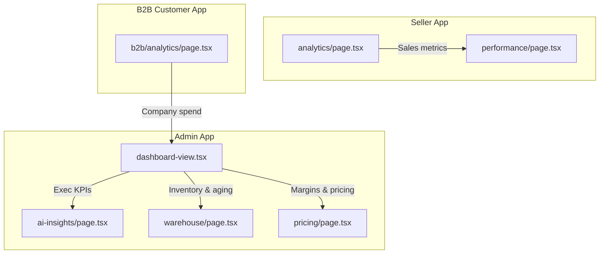
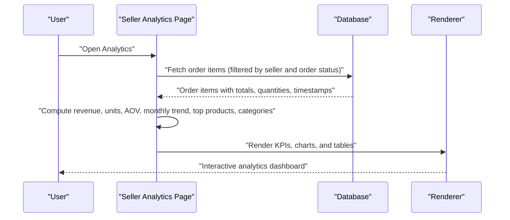
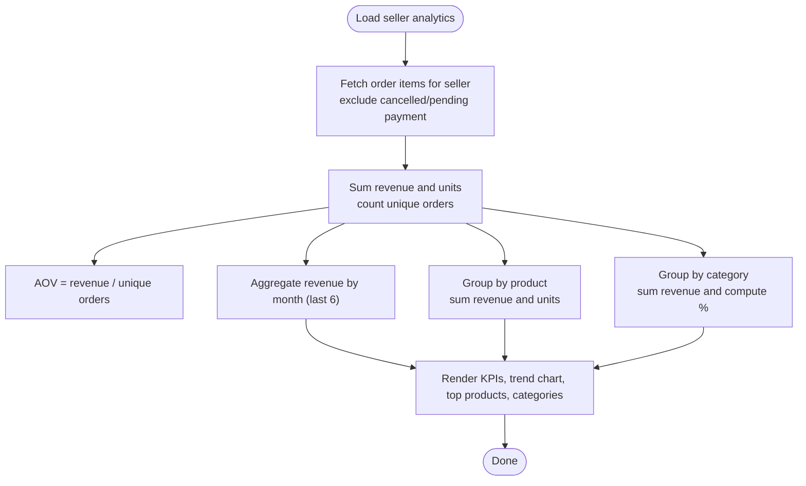
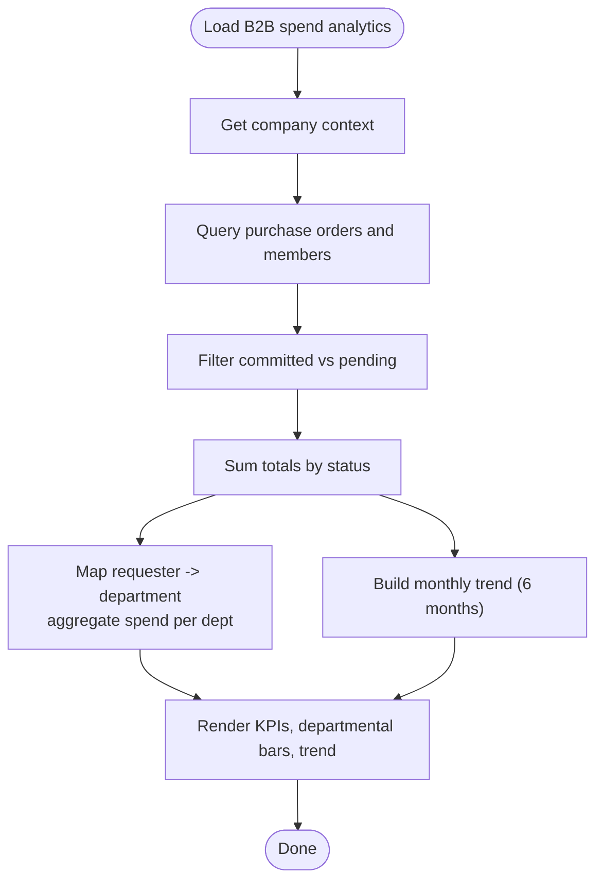
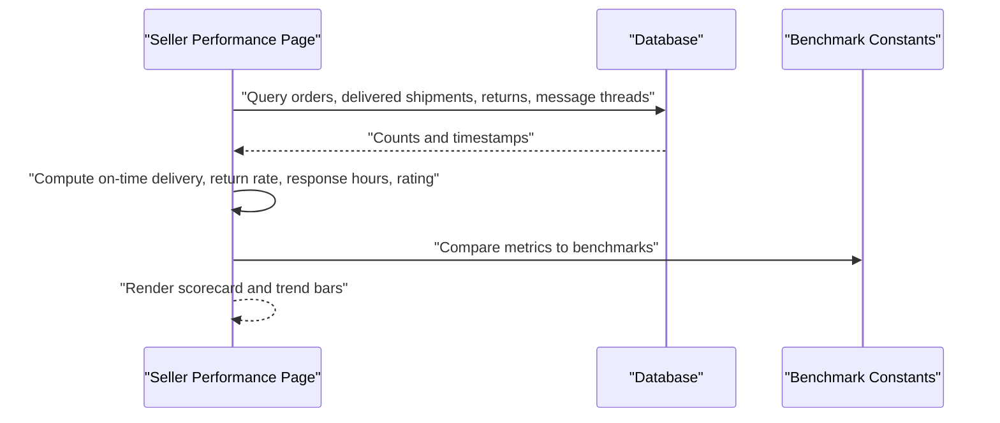
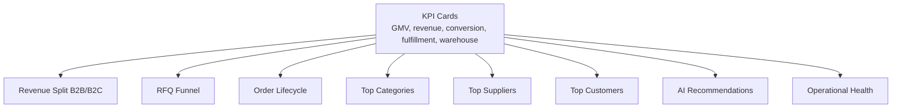
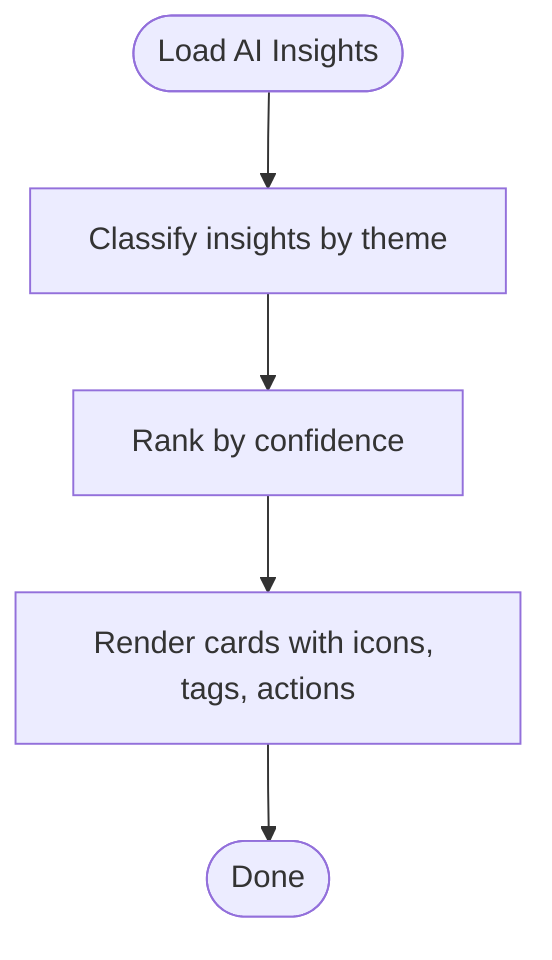
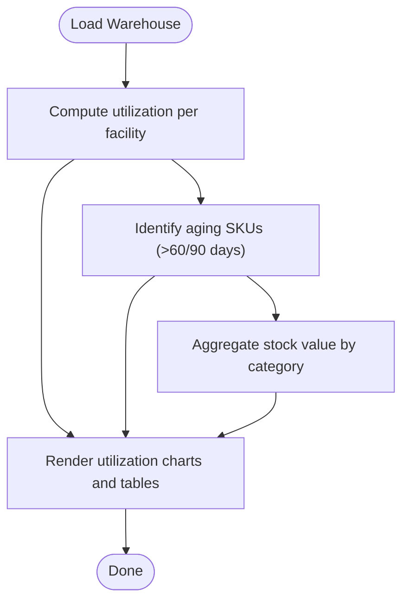
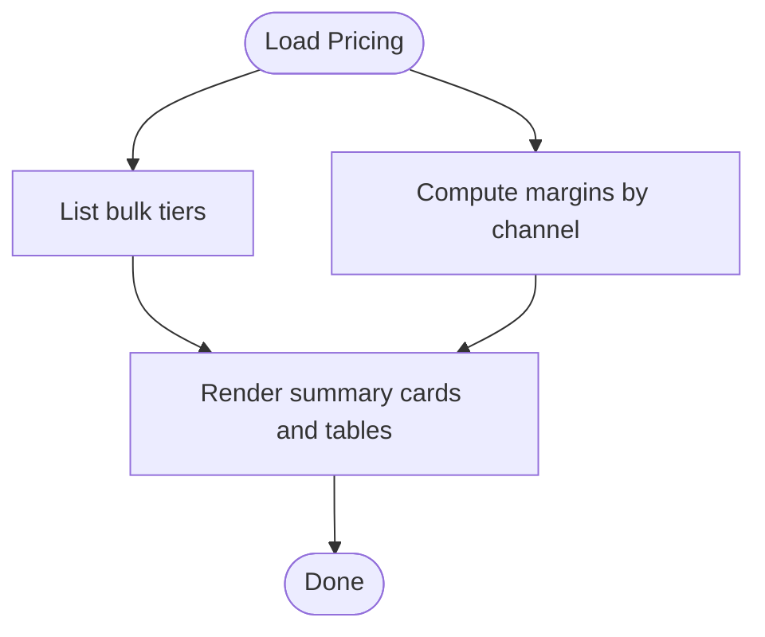
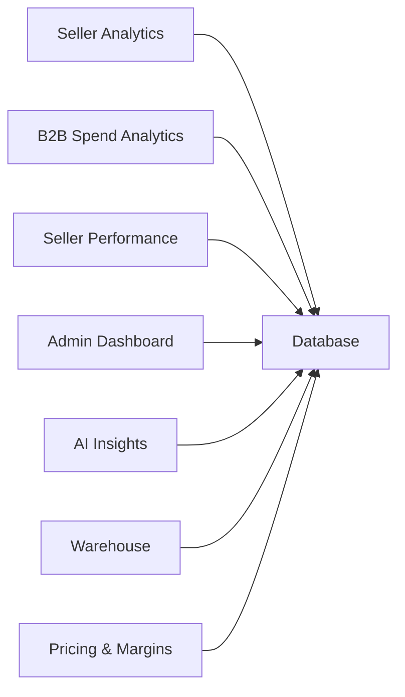

# Product Analytics

<cite>
**Referenced Files in This Document**
- [apps/seller/src/app/analytics/page.tsx](file://apps/seller/src/app/analytics/page.tsx)
- [apps/customer/src/app/b2b/analytics/page.tsx](file://apps/customer/src/app/b2b/analytics/page.tsx)
- [apps/seller/src/app/performance/page.tsx](file://apps/seller/src/app/performance/page.tsx)
- [apps/admin/src/app/dashboard/dashboard-view.tsx](file://apps/admin/src/app/dashboard/dashboard-view.tsx)
- [apps/admin/src/app/ai-insights/page.tsx](file://apps/admin/src/app/ai-insights/page.tsx)
- [apps/admin/src/app/warehouse/page.tsx](file://apps/admin/src/app/warehouse/page.tsx)
- [apps/admin/src/app/pricing/page.tsx](file://apps/admin/src/app/pricing/page.tsx)
- [EXECUTIVE_DASHBOARD_NOTES.md](file://EXECUTIVE_DASHBOARD_NOTES.md)
- [MODULE_10_PRICING_COMMISSION_NOTES.md](file://MODULE_10_PRICING_COMMISSION_NOTES.md)
- [DATABASE_NOTES.md](file://DATABASE_NOTES.md)
</cite>

## Table of Contents
1. [Introduction](#introduction)
2. [Project Structure](#project-structure)
3. [Core Components](#core-components)
4. [Architecture Overview](#architecture-overview)
5. [Detailed Component Analysis](#detailed-component-analysis)
6. [Dependency Analysis](#dependency-analysis)
7. [Performance Considerations](#performance-considerations)
8. [Troubleshooting Guide](#troubleshooting-guide)
9. [Conclusion](#conclusion)
10. [Appendices](#appendices)

## Introduction
This document describes the Product Analytics system across the marketplace’s Admin, Seller, and B2B Customer applications. It focuses on:
- Sales performance metrics: revenue, units sold, conversion rates, average order value
- Traffic analytics: views, add-to-cart rates, bounce rates
- Product ranking and visibility: top products, category positioning
- Search performance and category positioning
- Customer sentiment: buyer ratings, return rates, response times
- Inventory analytics: stock efficiency, turnover ratios, carrying costs
- Competitive benchmarking, market share analysis, and trend identification
- Report generation, export capabilities, and custom dashboard creation

Where applicable, we map UI components and backend queries to actual source files and explain how analytics are computed and presented.

## Project Structure
The analytics surface spans three Next.js apps:
- Admin: Executive dashboards, AI insights, warehouse analytics, pricing and margins
- Seller: Sales performance, top products, category breakdown, performance benchmarking
- B2B Customer: Spend analytics by company and departments

**Diagram sources**
- [apps/admin/src/app/dashboard/dashboard-view.tsx](file://apps/admin/src/app/dashboard/dashboard-view.tsx)
- [apps/admin/src/app/ai-insights/page.tsx](file://apps/admin/src/app/ai-insights/page.tsx)
- [apps/admin/src/app/warehouse/page.tsx](file://apps/admin/src/app/warehouse/page.tsx)
- [apps/admin/src/app/pricing/page.tsx](file://apps/admin/src/app/pricing/page.tsx)
- [apps/seller/src/app/analytics/page.tsx](file://apps/seller/src/app/analytics/page.tsx)
- [apps/seller/src/app/performance/page.tsx](file://apps/seller/src/app/performance/page.tsx)
- [apps/customer/src/app/b2b/analytics/page.tsx](file://apps/customer/src/app/b2b/analytics/page.tsx)

**Section sources**
- [apps/admin/src/app/dashboard/dashboard-view.tsx](file://apps/admin/src/app/dashboard/dashboard-view.tsx)
- [apps/admin/src/app/ai-insights/page.tsx](file://apps/admin/src/app/ai-insights/page.tsx)
- [apps/admin/src/app/warehouse/page.tsx](file://apps/admin/src/app/warehouse/page.tsx)
- [apps/admin/src/app/pricing/page.tsx](file://apps/admin/src/app/pricing/page.tsx)
- [apps/seller/src/app/analytics/page.tsx](file://apps/seller/src/app/analytics/page.tsx)
- [apps/seller/src/app/performance/page.tsx](file://apps/seller/src/app/performance/page.tsx)
- [apps/customer/src/app/b2b/analytics/page.tsx](file://apps/customer/src/app/b2b/analytics/page.tsx)

## Core Components
- Sales Analytics (Seller): Computes total revenue, units sold, monthly revenue trend, top products, and revenue by category. Also calculates average order value and order counts.
- Spend Analytics (B2B Customer): Aggregates committed spend, pending approvals, monthly trends, and departmental spend distribution.
- Performance Benchmarking (Seller): Compares seller metrics against marketplace benchmarks for on-time delivery, return rate, response time, and buyer rating.
- Executive Dashboard (Admin): Presents high-level KPIs, revenue split, RFQ funnel, order lifecycle, top categories/suppliers/customers, AI recommendations, and operational health.
- AI Insights (Admin): Provides actionable recommendations around pricing, inventory, and growth signals.
- Warehouse Analytics (Admin): Shows warehouse utilization, aging inventory, and stock by category/value.
- Pricing & Margins (Admin): Summarizes pricing tiers and margin analysis for B2C/B2B pricing.

**Section sources**
- [apps/seller/src/app/analytics/page.tsx](file://apps/seller/src/app/analytics/page.tsx)
- [apps/customer/src/app/b2b/analytics/page.tsx](file://apps/customer/src/app/b2b/analytics/page.tsx)
- [apps/seller/src/app/performance/page.tsx](file://apps/seller/src/app/performance/page.tsx)
- [apps/admin/src/app/dashboard/dashboard-view.tsx](file://apps/admin/src/app/dashboard/dashboard-view.tsx)
- [apps/admin/src/app/ai-insights/page.tsx](file://apps/admin/src/app/ai-insights/page.tsx)
- [apps/admin/src/app/warehouse/page.tsx](file://apps/admin/src/app/warehouse/page.tsx)
- [apps/admin/src/app/pricing/page.tsx](file://apps/admin/src/app/pricing/page.tsx)

## Architecture Overview
The analytics system is composed of:
- Data sources: database queries in server-side components
- Computation: client-side aggregation and chart rendering
- Presentation: reusable UI components and responsive layouts
- Executive pipeline: mock-driven dashboards with fallbacks for demo environments

**Diagram sources**
- [apps/seller/src/app/analytics/page.tsx](file://apps/seller/src/app/analytics/page.tsx)

**Section sources**
- [apps/seller/src/app/analytics/page.tsx](file://apps/seller/src/app/analytics/page.tsx)
- [apps/admin/src/app/dashboard/dashboard-view.tsx](file://apps/admin/src/app/dashboard/dashboard-view.tsx)

## Detailed Component Analysis

### Sales Analytics (Seller)
Key metrics and computations:
- Revenue: sum of order item totals
- Units sold: sum of quantities
- Average Order Value (AOV): revenue / unique order count
- Monthly trend: revenue per calendar month over last six months
- Top products: revenue and units per product (top 6)
- Revenue by category: revenue and percentage share

**Diagram sources**
- [apps/seller/src/app/analytics/page.tsx](file://apps/seller/src/app/analytics/page.tsx)

**Section sources**
- [apps/seller/src/app/analytics/page.tsx](file://apps/seller/src/app/analytics/page.tsx)

### Spend Analytics (B2B Customer)
Key metrics and computations:
- Committed spend: sum of approved/ordered purchase orders
- Pending approvals: sum of purchase orders awaiting approval
- Monthly spend: current month’s committed spend
- Departmental spend: grouped by requester department
- Monthly trend: last six months of committed spend

**Diagram sources**
- [apps/customer/src/app/b2b/analytics/page.tsx](file://apps/customer/src/app/b2b/analytics/page.tsx)

**Section sources**
- [apps/customer/src/app/b2b/analytics/page.tsx](file://apps/customer/src/app/b2b/analytics/page.tsx)

### Performance Benchmarking (Seller)
Metrics compared to marketplace benchmarks:
- On-time delivery: % of delivered shipments within promised window
- Return rate: % of returned items
- Average response time: hours to first message response
- Buyer rating: average star rating

**Diagram sources**
- [apps/seller/src/app/performance/page.tsx](file://apps/seller/src/app/performance/page.tsx)

**Section sources**
- [apps/seller/src/app/performance/page.tsx](file://apps/seller/src/app/performance/page.tsx)

### Executive Dashboard (Admin)
Highlights:
- KPIs: GMV, B2B/B2C revenue, commission, active companies/customers/suppliers, RFQ conversion, fulfillment rate, warehouse utilization
- Revenue split: B2B vs B2C segmented bar
- RFQ funnel: stages with counts
- Order lifecycle: stages with counts
- Top categories, suppliers, customers
- AI recommendations panel
- Operational health indicators

**Diagram sources**
- [apps/admin/src/app/dashboard/dashboard-view.tsx](file://apps/admin/src/app/dashboard/dashboard-view.tsx)
- [EXECUTIVE_DASHBOARD_NOTES.md](file://EXECUTIVE_DASHBOARD_NOTES.md)

**Section sources**
- [apps/admin/src/app/dashboard/dashboard-view.tsx](file://apps/admin/src/app/dashboard/dashboard-view.tsx)
- [EXECUTIVE_DASHBOARD_NOTES.md](file://EXECUTIVE_DASHBOARD_NOTES.md)

### AI Insights (Admin)
Capabilities:
- Price optimization opportunities
- Category growth signals
- Inventory replenishment alerts
- Risk and opportunity insights
- Confidence scores and action links

**Diagram sources**
- [apps/admin/src/app/ai-insights/page.tsx](file://apps/admin/src/app/ai-insights/page.tsx)

**Section sources**
- [apps/admin/src/app/ai-insights/page.tsx](file://apps/admin/src/app/ai-insights/page.tsx)

### Warehouse Analytics (Admin)
Capabilities:
- Warehouse utilization and capacity
- Aging inventory with days in stock and value
- Stock by category/value
- Alerts for high-risk aging SKUs

**Diagram sources**
- [apps/admin/src/app/warehouse/page.tsx](file://apps/admin/src/app/warehouse/page.tsx)

**Section sources**
- [apps/admin/src/app/warehouse/page.tsx](file://apps/admin/src/app/warehouse/page.tsx)

### Pricing & Margins (Admin)
Capabilities:
- Bulk pricing tiers
- Price and margin analysis across B2C/B2B
- Commission rule overview

**Diagram sources**
- [apps/admin/src/app/pricing/page.tsx](file://apps/admin/src/app/pricing/page.tsx)
- [MODULE_10_PRICING_COMMISSION_NOTES.md](file://MODULE_10_PRICING_COMMISSION_NOTES.md)

**Section sources**
- [apps/admin/src/app/pricing/page.tsx](file://apps/admin/src/app/pricing/page.tsx)
- [MODULE_10_PRICING_COMMISSION_NOTES.md](file://MODULE_10_PRICING_COMMISSION_NOTES.md)

## Dependency Analysis
- Seller Analytics depends on order items and order timestamps to compute revenue, units, and trends.
- B2B Spend Analytics depends on purchase orders and company member mappings to compute departmental spend.
- Performance Benchmarking compares seller metrics to hardcoded marketplace benchmarks.
- Executive Dashboard composes multiple data sources and uses mock data for KPIs and funnels when live data is unavailable.
- AI Insights and Warehouse rely on administrative datasets and mock data for demonstration.

**Diagram sources**
- [apps/seller/src/app/analytics/page.tsx](file://apps/seller/src/app/analytics/page.tsx)
- [apps/customer/src/app/b2b/analytics/page.tsx](file://apps/customer/src/app/b2b/analytics/page.tsx)
- [apps/seller/src/app/performance/page.tsx](file://apps/seller/src/app/performance/page.tsx)
- [apps/admin/src/app/dashboard/dashboard-view.tsx](file://apps/admin/src/app/dashboard/dashboard-view.tsx)
- [apps/admin/src/app/ai-insights/page.tsx](file://apps/admin/src/app/ai-insights/page.tsx)
- [apps/admin/src/app/warehouse/page.tsx](file://apps/admin/src/app/warehouse/page.tsx)
- [apps/admin/src/app/pricing/page.tsx](file://apps/admin/src/app/pricing/page.tsx)

**Section sources**
- [apps/seller/src/app/analytics/page.tsx](file://apps/seller/src/app/analytics/page.tsx)
- [apps/customer/src/app/b2b/analytics/page.tsx](file://apps/customer/src/app/b2b/analytics/page.tsx)
- [apps/seller/src/app/performance/page.tsx](file://apps/seller/src/app/performance/page.tsx)
- [apps/admin/src/app/dashboard/dashboard-view.tsx](file://apps/admin/src/app/dashboard/dashboard-view.tsx)
- [apps/admin/src/app/ai-insights/page.tsx](file://apps/admin/src/app/ai-insights/page.tsx)
- [apps/admin/src/app/warehouse/page.tsx](file://apps/admin/src/app/warehouse/page.tsx)
- [apps/admin/src/app/pricing/page.tsx](file://apps/admin/src/app/pricing/page.tsx)

## Performance Considerations
- Efficient filtering: exclude cancelled/pending-payment orders to reduce computation overhead.
- Aggregation windows: limit rolling windows (e.g., last six months) to minimize dataset size.
- Memoization: cache department mappings and category totals to avoid repeated scans.
- Rendering: use responsive grid layouts and segmented bars to maintain interactivity without heavy libraries.
- Demo safety: fallbacks to mock data ensure consistent rendering even when live data is unavailable.

[No sources needed since this section provides general guidance]

## Troubleshooting Guide
- Blank analytics cards: verify session requirements and context availability (company context for B2B).
- Missing revenue data: confirm order statuses are excluded appropriately and items are included with totals and timestamps.
- Performance benchmarks not updating: ensure benchmark constants are aligned with intended targets and invert flags are set for rate metrics.
- Executive dashboard gaps: check mock data fallbacks and ensure mock datasets are loaded when live queries return no results.

**Section sources**
- [apps/seller/src/app/analytics/page.tsx](file://apps/seller/src/app/analytics/page.tsx)
- [apps/customer/src/app/b2b/analytics/page.tsx](file://apps/customer/src/app/b2b/analytics/page.tsx)
- [apps/seller/src/app/performance/page.tsx](file://apps/seller/src/app/performance/page.tsx)
- [apps/admin/src/app/dashboard/dashboard-view.tsx](file://apps/admin/src/app/dashboard/dashboard-view.tsx)

## Conclusion
The Product Analytics system integrates seller, B2B, and admin perspectives to deliver actionable insights:
- Sellers gain sales performance, top product/category visibility, and competitive benchmarking.
- Buyers and procurement teams see spend trends and departmental allocations.
- Administrators receive executive KPIs, AI-driven recommendations, warehouse insights, and pricing/margins summaries.

Future enhancements can include pre-aggregated analytics tables, export capabilities, and custom dashboard builder components.

[No sources needed since this section summarizes without analyzing specific files]

## Appendices

### Metrics Reference
- Sales: revenue, units sold, AOV, monthly trend, top products, category share
- Traffic: views, add-to-cart rates, bounce rates (conceptual; implementation depends on event tracking)
- Visibility: top products, category positioning, search performance (conceptual)
- Sentiment: buyer rating, return rate, response time
- Inventory: stock efficiency, turnover ratios, carrying costs, aging inventory
- Benchmarking: seller vs marketplace benchmarks
- Reports: export capabilities and custom dashboards (conceptual)

[No sources needed since this section provides general guidance]