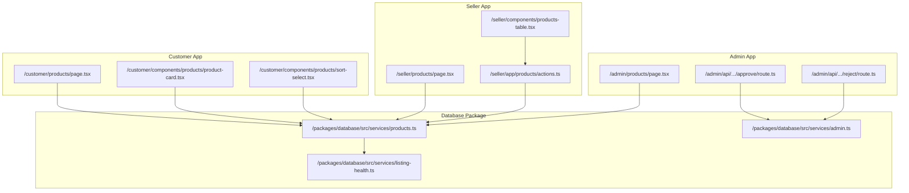
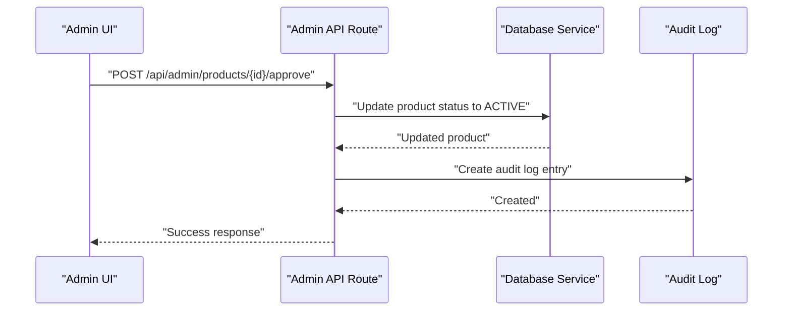
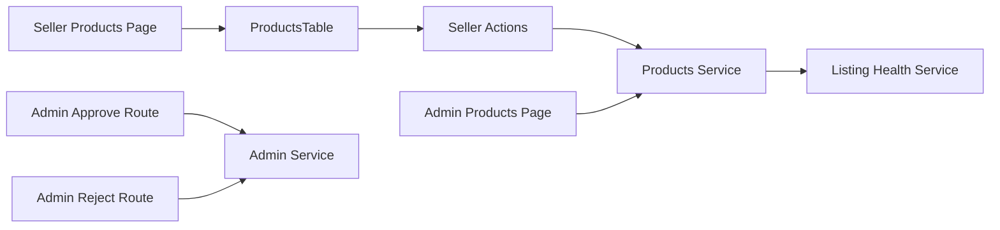

# Product Listings

<cite>
**Referenced Files in This Document**
- [apps/admin/src/app/products/page.tsx](file://apps/admin/src/app/products/page.tsx)
- [apps/admin/src/app/api/admin/products/[id]/approve/route.ts](file://apps/admin/src/app/api/admin/products/[id]/approve/route.ts)
- [apps/admin/src/app/api/admin/compliance/[id]/reject/route.ts](file://apps/admin/src/app/api/admin/compliance/[id]/reject/route.ts)
- [apps/customer/src/app/products/page.tsx](file://apps/customer/src/app/products/page.tsx)
- [apps/customer/src/components/products/product-card.tsx](file://apps/customer/src/components/products/product-card.tsx)
- [apps/customer/src/components/products/sort-select.tsx](file://apps/customer/src/components/products/sort-select.tsx)
- [apps/seller/src/app/products/page.tsx](file://apps/seller/src/app/products/page.tsx)
- [apps/seller/src/components/products-table.tsx](file://apps/seller/src/components/products-table.tsx)
- [apps/seller/src/app/products/actions.ts](file://apps/seller/src/app/products/actions.ts)
- [packages/database/src/services/products.ts](file://packages/database/src/services/products.ts)
- [packages/database/src/services/admin.ts](file://packages/database/src/services/admin.ts)
- [packages/database/src/services/listing-health.ts](file://packages/database/src/services/listing-health.ts)
- [packages/types/src/schemas.ts](file://packages/types/src/schemas.ts)
</cite>

## Table of Contents
1. [Introduction](#introduction)
2. [Project Structure](#project-structure)
3. [Core Components](#core-components)
4. [Architecture Overview](#architecture-overview)
5. [Detailed Component Analysis](#detailed-component-analysis)
6. [Dependency Analysis](#dependency-analysis)
7. [Performance Considerations](#performance-considerations)
8. [Troubleshooting Guide](#troubleshooting-guide)
9. [Conclusion](#conclusion)
10. [Appendices](#appendices)

## Introduction
This document describes the Product Listings system across the Admin, Seller, and Customer applications. It covers:
- Product creation workflow and validation
- Product editing interface and metadata updates
- Product deletion and cleanup
- Products table views with filtering, sorting, and bulk operations
- Status management (active, inactive, draft, published, suppressed, rejected) and approval workflows
- Search, batch operations, and export capabilities

## Project Structure
The Product Listings system spans three Next.js apps and a shared database package:
- Admin app: moderation, approvals, and status management
- Seller app: product catalog, bulk operations, and exports
- Customer app: public product browsing and search
- Database package: product listing service, health scoring, and admin actions

**Diagram sources**
- [apps/admin/src/app/products/page.tsx:1-103](file://apps/admin/src/app/products/page.tsx#L1-L103)
- [apps/admin/src/app/api/admin/products/[id]/approve/route.ts](file://apps/admin/src/app/api/admin/products/[id]/approve/route.ts)
- [apps/admin/src/app/api/admin/compliance/[id]/reject/route.ts](file://apps/admin/src/app/api/admin/compliance/[id]/reject/route.ts)
- [apps/seller/src/app/products/page.tsx:1-60](file://apps/seller/src/app/products/page.tsx#L1-L60)
- [apps/seller/src/components/products-table.tsx:1-254](file://apps/seller/src/components/products-table.tsx#L1-L254)
- [apps/seller/src/app/products/actions.ts:1-115](file://apps/seller/src/app/products/actions.ts#L1-L115)
- [apps/customer/src/app/products/page.tsx](file://apps/customer/src/app/products/page.tsx)
- [apps/customer/src/components/products/product-card.tsx](file://apps/customer/src/components/products/product-card.tsx)
- [apps/customer/src/components/products/sort-select.tsx](file://apps/customer/src/components/products/sort-select.tsx)
- [packages/database/src/services/products.ts:1-133](file://packages/database/src/services/products.ts#L1-L133)
- [packages/database/src/services/admin.ts:88-99](file://packages/database/src/services/admin.ts#L88-L99)
- [packages/database/src/services/listing-health.ts:70-98](file://packages/database/src/services/listing-health.ts#L70-L98)

**Section sources**
- [apps/admin/src/app/products/page.tsx:1-103](file://apps/admin/src/app/products/page.tsx#L1-L103)
- [apps/seller/src/app/products/page.tsx:1-60](file://apps/seller/src/app/products/page.tsx#L1-L60)
- [apps/customer/src/app/products/page.tsx](file://apps/customer/src/app/products/page.tsx)

## Core Components
- Admin Products Page: Lists products by status, shows health indicators, and exposes approve/reject actions.
- Seller Products Page: Renders product rows for the current seller and delegates to ProductsTable.
- ProductsTable: Provides filtering, sorting, bulk selection, CSV import/export, and bulk status updates.
- Product Actions (seller): Implements bulk status updates and CSV import with validation and transactions.
- Product Listing Service: Centralized listing with search, filters, pagination, and inclusion of related data.
- Admin Actions: Approve/reject product endpoints and audit logging.
- Listing Health Service: Computes listing completeness and creates issues for missing metadata.

**Section sources**
- [apps/admin/src/app/products/page.tsx:7-102](file://apps/admin/src/app/products/page.tsx#L7-L102)
- [apps/seller/src/app/products/page.tsx:9-60](file://apps/seller/src/app/products/page.tsx#L9-L60)
- [apps/seller/src/components/products-table.tsx:93-254](file://apps/seller/src/components/products-table.tsx#L93-L254)
- [apps/seller/src/app/products/actions.ts:14-115](file://apps/seller/src/app/products/actions.ts#L14-L115)
- [packages/database/src/services/products.ts:16-56](file://packages/database/src/services/products.ts#L16-L56)
- [packages/database/src/services/admin.ts:92-99](file://packages/database/src/services/admin.ts#L92-L99)
- [packages/database/src/services/listing-health.ts:70-98](file://packages/database/src/services/listing-health.ts#L70-L98)

## Architecture Overview
The system follows a layered architecture:
- UI pages fetch product data via server-side queries
- Shared database service encapsulates listing logic and joins
- Seller actions are server actions scoped to the authenticated seller
- Admin endpoints manage product approvals and rejections
- Listing health is computed and surfaced in both seller and admin views

**Diagram sources**
- [apps/admin/src/app/api/admin/products/[id]/approve/route.ts](file://apps/admin/src/app/api/admin/products/[id]/approve/route.ts)
- [packages/database/src/services/admin.ts:92-99](file://packages/database/src/services/admin.ts#L92-L99)

## Detailed Component Analysis

### Product Creation Workflow
- Validation and required fields are defined in the product schema.
- Required fields include SKU, English and Arabic names, category ID, and enable flags for B2C/B2B.
- Pricing tiers support minimum quantity and optional maximum quantity.
- Optional fields include descriptions, brand, origin, weight, tags, and enable flags.

Implementation highlights:
- Schema enforces minimum/maximum lengths and positive numeric constraints.
- Pricing tiers array supports flexible volume discounts.

**Section sources**
- [packages/types/src/schemas.ts:47-63](file://packages/types/src/schemas.ts#L47-L63)

### Product Editing Interface
- Seller Products Page builds rows with name, SKU, status, health, stock, price, and issue counts.
- ProductsTable renders a sortable, filterable table with per-row edit links.
- Bulk selection enables mass status updates and export operations.

Key behaviors:
- HealthBar displays listing completeness score.
- Issue count indicates unresolved issues affecting activation.
- Edit links navigate to per-product edit routes.

**Section sources**
- [apps/seller/src/app/products/page.tsx:24-40](file://apps/seller/src/app/products/page.tsx#L24-L40)
- [apps/seller/src/components/products-table.tsx:196-225](file://apps/seller/src/components/products-table.tsx#L196-L225)

### Media Management and Attribute Modifications
- Listing service includes images, prices, inventory, category, brand, seller, issues, variants, and reviews.
- Seller actions support updating product attributes (names, status) and modifying price/stock within a transaction.

Operational notes:
- Price updates leverage an active price record; otherwise a new price is created.
- Stock updates require an existing inventory record; otherwise the operation is skipped to avoid creating inventory without location context.

**Section sources**
- [packages/database/src/services/products.ts:42-76](file://packages/database/src/services/products.ts#L42-L76)
- [apps/seller/src/app/products/actions.ts:80-104](file://apps/seller/src/app/products/actions.ts#L80-L104)

### Product Deletion Process
- Soft-deleted products are excluded from listings via a deletedAt filter.
- Bulk suppression action sets status to SUPPRESSED for selected products owned by the seller.

Note: Hard deletion is not exposed in the analyzed files; soft-delete semantics are used.

**Section sources**
- [apps/seller/src/app/products/actions.ts:19-22](file://apps/seller/src/app/products/actions.ts#L19-L22)
- [packages/database/src/services/products.ts:20-34](file://packages/database/src/services/products.ts#L20-L34)

### Products Table View: Filtering, Sorting, and Bulk Selection
- Filtering: Admin view filters by status; listing service supports category, seller, status, B2C/B2B flags, and text search across names and SKU.
- Sorting: Default ordering by creation date descending; sort controls are present in the customer sort component.
- Bulk selection: Multi-select checkboxes, floating toolbar for bulk actions (activate/deactivate/suppress), and CSV export of selected or all rows.

Bulk operations:
- Bulk status updates are executed server-side with revalidation.
- CSV import parses RFC-4180-like format, validates headers, and applies updates per SKU within the seller’s catalog.

**Section sources**
- [apps/admin/src/app/products/page.tsx:11-23](file://apps/admin/src/app/products/page.tsx#L11-L23)
- [packages/database/src/services/products.ts:16-56](file://packages/database/src/services/products.ts#L16-L56)
- [apps/customer/src/components/products/sort-select.tsx](file://apps/customer/src/components/products/sort-select.tsx)
- [apps/seller/src/components/products-table.tsx:107-156](file://apps/seller/src/components/products-table.tsx#L107-L156)
- [apps/seller/src/app/products/actions.ts:49-115](file://apps/seller/src/app/products/actions.ts#L49-L115)

### Product Status Management and Approval Workflows
- Status values include DRAFT, ACTIVE, SUPPRESSED, INACTIVE, PENDING_REVIEW, and REJECTED.
- Admin approval flow:
  - Admin view shows pending review products with approve button.
  - Approve endpoint updates product status to ACTIVE and records audit log.
- Admin rejection flow:
  - Reject endpoint updates status to REJECTED, records audit log, and creates a product issue indicating rejection reason.

Seller-triggered status changes:
- Bulk status updates are restricted to the authenticated seller’s products.
- Publishing timestamp is recorded when transitioning to ACTIVE.

**Section sources**
- [apps/admin/src/app/products/page.tsx:83-89](file://apps/admin/src/app/products/page.tsx#L83-L89)
- [apps/admin/src/app/api/admin/products/[id]/approve/route.ts](file://apps/admin/src/app/api/admin/products/[id]/approve/route.ts)
- [packages/database/src/services/admin.ts:92-99](file://packages/database/src/services/admin.ts#L92-L99)
- [apps/seller/src/app/products/actions.ts:14-26](file://apps/seller/src/app/products/actions.ts#L14-L26)

### Product Search Functionality
- Listing service supports text search across English name, Arabic name, and SKU (case-insensitive).
- Pagination is supported with page and limit parameters.

**Section sources**
- [packages/database/src/services/products.ts:27-33](file://packages/database/src/services/products.ts#L27-L33)

### Batch Operations and Export Capabilities
- CSV Export:
  - Selected or all rows exported as CSV with predefined headers.
  - RFC-4180-like quoting and escaping.
- CSV Import:
  - Validates presence of SKU column.
  - Updates product attributes (names, status) and price/stock within a transaction.
  - Skips unknown SKUs and reports errors; limits batch size for safety.

**Section sources**
- [apps/seller/src/components/products-table.tsx:42-54](file://apps/seller/src/components/products-table.tsx#L42-L54)
- [apps/seller/src/components/products-table.tsx:116-156](file://apps/seller/src/components/products-table.tsx#L116-L156)
- [apps/seller/src/app/products/actions.ts:49-115](file://apps/seller/src/app/products/actions.ts#L49-L115)

### Listing Health and Metadata Management
- Health computation considers presence of images, Arabic title/description, price, and available stock.
- Issues are cleared and re-evaluated; unresolved issues impact activation readiness.
- Health score and issues are surfaced in both seller and admin views.

**Section sources**
- [packages/database/src/services/listing-health.ts:70-98](file://packages/database/src/services/listing-health.ts#L70-L98)
- [apps/admin/src/app/products/page.tsx:68-77](file://apps/admin/src/app/products/page.tsx#L68-L77)
- [apps/seller/src/components/products-table.tsx:79-91](file://apps/seller/src/components/products-table.tsx#L79-L91)

## Dependency Analysis

**Diagram sources**
- [apps/seller/src/app/products/page.tsx:24-40](file://apps/seller/src/app/products/page.tsx#L24-L40)
- [apps/seller/src/components/products-table.tsx:93-254](file://apps/seller/src/components/products-table.tsx#L93-L254)
- [apps/seller/src/app/products/actions.ts:14-115](file://apps/seller/src/app/products/actions.ts#L14-L115)
- [apps/admin/src/app/products/page.tsx:11-23](file://apps/admin/src/app/products/page.tsx#L11-L23)
- [apps/admin/src/app/api/admin/products/[id]/approve/route.ts](file://apps/admin/src/app/api/admin/products/[id]/approve/route.ts)
- [apps/admin/src/app/api/admin/compliance/[id]/reject/route.ts](file://apps/admin/src/app/api/admin/compliance/[id]/reject/route.ts)
- [packages/database/src/services/products.ts:16-56](file://packages/database/src/services/products.ts#L16-L56)
- [packages/database/src/services/admin.ts:92-99](file://packages/database/src/services/admin.ts#L92-L99)
- [packages/database/src/services/listing-health.ts:70-98](file://packages/database/src/services/listing-health.ts#L70-L98)

**Section sources**
- [apps/seller/src/app/products/page.tsx:24-40](file://apps/seller/src/app/products/page.tsx#L24-L40)
- [apps/seller/src/components/products-table.tsx:93-254](file://apps/seller/src/components/products-table.tsx#L93-L254)
- [apps/seller/src/app/products/actions.ts:14-115](file://apps/seller/src/app/products/actions.ts#L14-L115)
- [apps/admin/src/app/products/page.tsx:11-23](file://apps/admin/src/app/products/page.tsx#L11-L23)
- [packages/database/src/services/products.ts:16-56](file://packages/database/src/services/products.ts#L16-L56)

## Performance Considerations
- Pagination and limiting: Listing service uses skip/take with default page size to bound query cost.
- Selective includes: Product queries include only necessary relations (images, prices, inventory, category, brand, seller, issues).
- Transaction batching: CSV import batches up to a safe limit to prevent oversized requests.
- Revalidation: Server actions trigger path revalidation to keep UI consistent without full page reloads.

[No sources needed since this section provides general guidance]

## Troubleshooting Guide
Common issues and remedies:
- CSV import fails due to missing SKU column: Ensure the exported CSV format is imported; the importer requires SKU.
- Unknown SKU during import: The SKU must exist in the seller’s catalog; the system skips unknown SKUs and reports errors.
- Bulk status update has no effect: Verify the products belong to the authenticated seller; updates are scoped by sellerId.
- Approve/Reject actions unavailable: Approve is only shown for PENDING_REVIEW; Reject is handled via admin reject endpoint.

**Section sources**
- [apps/seller/src/components/products-table.tsx:125-135](file://apps/seller/src/components/products-table.tsx#L125-L135)
- [apps/seller/src/app/products/actions.ts:68-72](file://apps/seller/src/app/products/actions.ts#L68-L72)
- [apps/admin/src/app/products/page.tsx:83-89](file://apps/admin/src/app/products/page.tsx#L83-L89)
- [packages/database/src/services/admin.ts:92-99](file://packages/database/src/services/admin.ts#L92-L99)

## Conclusion
The Product Listings system integrates Admin moderation, Seller catalog management, and Customer discovery with robust validation, health scoring, and batch operations. Status workflows and approvals are enforced, while CSV import/export and bulk actions streamline day-to-day operations.

[No sources needed since this section summarizes without analyzing specific files]

## Appendices

### Status Definitions
- DRAFT: Unpublished listing under preparation
- ACTIVE: Published and available for sale
- INACTIVE: Temporarily unavailable
- SUPPRESSED: Suppressed by admin/seller
- PENDING_REVIEW: Awaiting admin approval
- REJECTED: Rejected by admin

**Section sources**
- [apps/seller/src/app/products/actions.ts:7-8](file://apps/seller/src/app/products/actions.ts#L7-L8)
- [apps/admin/src/app/products/page.tsx:78-79](file://apps/admin/src/app/products/page.tsx#L78-L79)