# Product Management

<cite>
**Referenced Files in This Document**
- [route.ts](file://apps/customer/src/app/api/products/route.ts)
- [route.ts](file://apps/admin/src/app/api/admin/products/[id]/approve/route.ts)
- [inventory.ts](file://packages/database/src/services/inventory.ts)
- [page.tsx](file://apps/admin/src/app/warehouse/stock/page.tsx)
- [page.tsx](file://apps/seller/src/app/inventory/page.tsx)
- [page.tsx](file://apps/seller/src/app/dashboard/page.tsx)
- [page.tsx](file://apps/admin/src/app/pricing/page.tsx)
- [MODULE_10_PRICING_COMMISSION_NOTES.md](file://MODULE_10_PRICING_COMMISSION_NOTES.md)
- [orders.ts](file://packages/database/src/services/orders.ts)
- [page.tsx](file://apps/admin/src/app/ai-insights/page.tsx)
- [route.ts](file://apps/seller/src/app/api/ai/draft/route.ts)
- [page.tsx](file://apps/seller/src/app/products/actions.ts)
- [page.tsx](file://apps/admin/src/app/categories/page.tsx)
- [page.tsx](file://apps/admin/src/app/compliance/page.tsx)
- [route.ts](file://apps/admin/src/app/api/admin/compliance[id]/approve/route.ts)
- [route.ts](file://apps/admin/src/app/api/admin/compliance[id]/reject/route.ts)
- [page.tsx](file://apps/admin/src/app/audits/page.tsx)
</cite>

## Table of Contents
1. [Introduction](#introduction)
2. [Project Structure](#project-structure)
3. [Core Components](#core-components)
4. [Architecture Overview](#architecture-overview)
5. [Detailed Component Analysis](#detailed-component-analysis)
6. [Dependency Analysis](#dependency-analysis)
7. [Performance Considerations](#performance-considerations)
8. [Troubleshooting Guide](#troubleshooting-guide)
9. [Conclusion](#conclusion)
10. [Appendices](#appendices)

## Introduction
This document describes the Product Management system across the Admin, Seller, and Customer applications. It covers product listing lifecycle (create, edit, delete), inventory control and low-stock alerts, pricing management (bulk tiers, contract pricing, commission rules), analytics and insights, AI-powered suggestions and SEO enhancements, bulk operations, categorization, and compliance workflows. The content is derived from the repository’s routes, pages, services, and module notes.

## Project Structure
The Product Management system spans three Next.js apps:
- Admin: central control plane for pricing, compliance, warehouse stock, categories, and audits.
- Seller: product and inventory operations, draft AI assistance, and performance views.
- Customer: product browsing and search APIs.

Key areas:
- Product listing API for customers
- Admin product approval API
- Inventory service and UI dashboards
- Pricing and commission center
- AI insights and draft generation
- Compliance and approval workflows
- Categories and audits

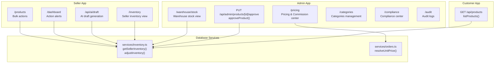

**Diagram sources**
- [route.ts:1-21](file://apps/customer/src/app/api/products/route.ts#L1-L21)
- [route.ts:1-20](file://apps/admin/src/app/api/admin/products/[id]/approve/route.ts#L1-L20)
- [page.tsx:1-105](file://apps/admin/src/app/pricing/page.tsx#L1-L105)
- [page.tsx:35-113](file://apps/admin/src/app/warehouse/stock/page.tsx#L35-L113)
- [page.tsx:1-44](file://apps/seller/src/app/inventory/page.tsx#L1-L44)
- [page.tsx:59-77](file://apps/seller/src/app/dashboard/page.tsx#L59-L77)
- [page.tsx:1-200](file://apps/seller/src/app/products/actions.ts#L1-L200)
- [route.ts:1-200](file://apps/seller/src/app/api/ai/draft/route.ts#L1-L200)
- [inventory.ts:1-43](file://packages/database/src/services/inventory.ts#L1-L43)
- [orders.ts:34-64](file://packages/database/src/services/orders.ts#L34-L64)

**Section sources**
- [route.ts:1-21](file://apps/customer/src/app/api/products/route.ts#L1-L21)
- [route.ts:1-20](file://apps/admin/src/app/api/admin/products/[id]/approve/route.ts#L1-L20)
- [inventory.ts:1-43](file://packages/database/src/services/inventory.ts#L1-L43)
- [page.tsx:35-113](file://apps/admin/src/app/warehouse/stock/page.tsx#L35-L113)
- [page.tsx:1-44](file://apps/seller/src/app/inventory/page.tsx#L1-L44)
- [page.tsx:59-77](file://apps/seller/src/app/dashboard/page.tsx#L59-L77)
- [page.tsx:1-105](file://apps/admin/src/app/pricing/page.tsx#L1-L105)
- [MODULE_10_PRICING_COMMISSION_NOTES.md:1-93](file://MODULE_10_PRICING_COMMISSION_NOTES.md#L1-L93)
- [orders.ts:34-64](file://packages/database/src/services/orders.ts#L34-L64)

## Core Components
- Product Listing API: Fetches paginated, searchable, and filterable product listings with ACTIVE status for B2C/B2B channels.
- Admin Product Approval: Approve or reject product listings via dedicated endpoints guarded by admin roles.
- Inventory Control: Centralized stock retrieval, low/out-of-stock computation, and adjustments with reference tracking.
- Pricing & Commission Center: Margin analysis, bulk pricing tiers, contract pricing, and commission rules.
- AI Insights and Draft Generation: AI-assisted product draft creation and suggestions.
- Compliance Workflows: Approve or reject compliance documents for products and sellers.
- Categories and Audits: Category management and audit trails for product-related changes.

**Section sources**
- [route.ts:1-21](file://apps/customer/src/app/api/products/route.ts#L1-L21)
- [route.ts:1-20](file://apps/admin/src/app/api/admin/products/[id]/approve/route.ts#L1-L20)
- [inventory.ts:1-43](file://packages/database/src/services/inventory.ts#L1-L43)
- [page.tsx:1-105](file://apps/admin/src/app/pricing/page.tsx#L1-L105)
- [page.tsx:1-200](file://apps/admin/src/app/ai-insights/page.tsx#L1-L200)
- [route.ts:1-200](file://apps/seller/src/app/api/ai/draft/route.ts#L1-L200)
- [page.tsx:1-200](file://apps/admin/src/app/compliance/page.tsx#L1-L200)
- [route.ts:1-200](file://apps/admin/src/app/api/admin/compliance[id]/approve/route.ts#L1-L200)
- [route.ts:1-200](file://apps/admin/src/app/api/admin/compliance[id]/reject/route.ts#L1-L200)
- [page.tsx:1-200](file://apps/admin/src/app/categories/page.tsx#L1-L200)
- [page.tsx:1-200](file://apps/admin/src/app/audits/page.tsx#L1-L200)

## Architecture Overview
The system integrates frontend pages with backend services and database operations. Admin controls pricing, compliance, and product approvals. Sellers manage inventory and receive actionable alerts. Customers consume product listings via a public API.

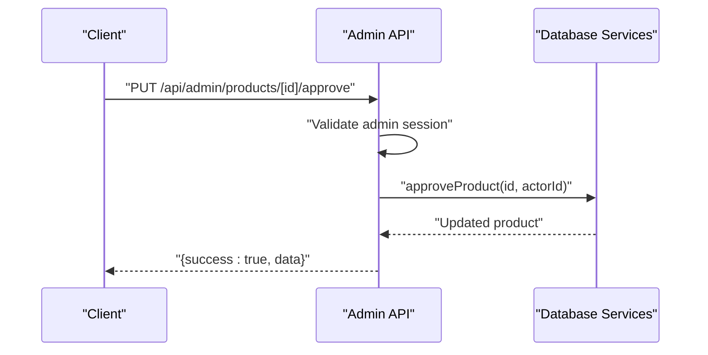

**Diagram sources**
- [route.ts:1-20](file://apps/admin/src/app/api/admin/products/[id]/approve/route.ts#L1-L20)

## Detailed Component Analysis

### Product Listing Creation, Editing, and Deletion
- Creation/Edit/Delete workflows are orchestrated in the Admin and Seller apps. While the exact CRUD handlers are not shown here, the Admin Pricing page demonstrates centralized product data handling and the Seller Products page indicates bulk operations for product records.
- The Admin Pricing page consumes mock product datasets and supports margin computations, implying structured product entities with pricing attributes.
- The Seller Products page exposes actions for bulk operations, indicating a product table with selection and batch actions.

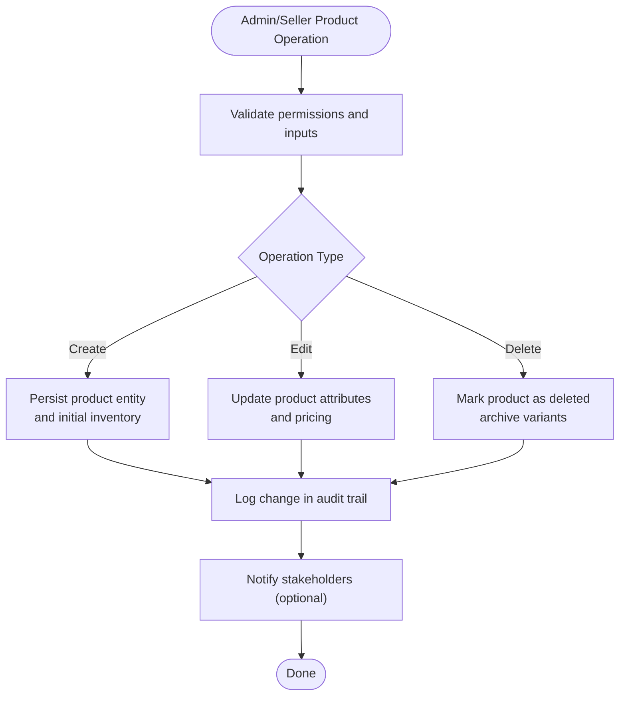

**Section sources**
- [page.tsx:1-105](file://apps/admin/src/app/pricing/page.tsx#L1-L105)
- [page.tsx:1-200](file://apps/seller/src/app/products/actions.ts#L1-L200)

### Inventory Control and Low-Stock Alerts
- Inventory retrieval aggregates product, location, and warehouse data, computing available stock and low/out-of-stock flags.
- The Admin Warehouse Stock page displays summary stats and filters for low/out stock items.
- The Seller Inventory page surfaces real-time low-stock conditions and provides replenishment guidance.
- The Seller Dashboard highlights low-stock items as action alerts.

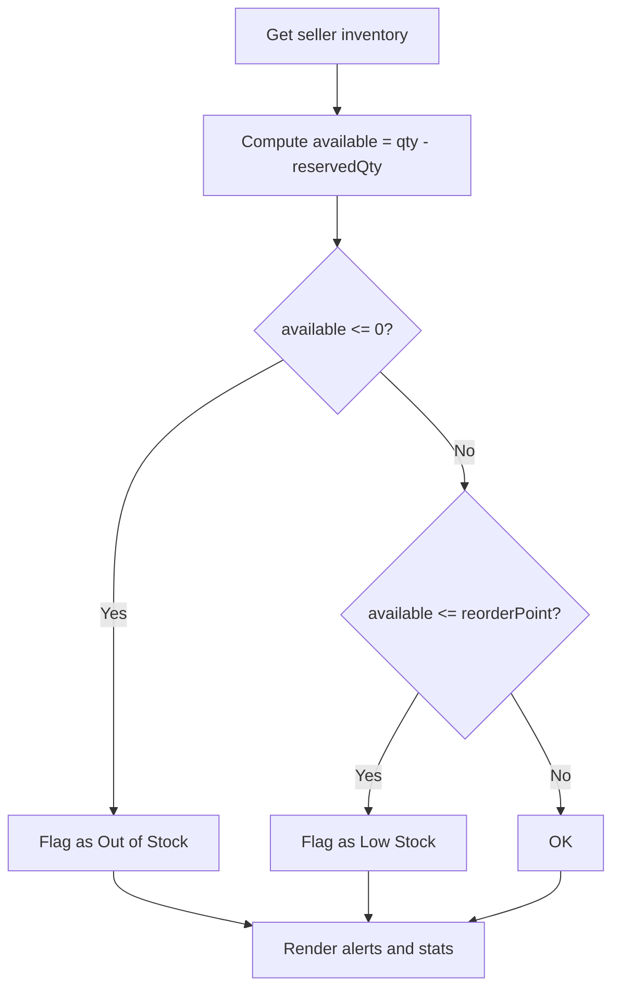

**Diagram sources**
- [inventory.ts:1-43](file://packages/database/src/services/inventory.ts#L1-L43)
- [page.tsx:35-113](file://apps/admin/src/app/warehouse/stock/page.tsx#L35-L113)
- [page.tsx:1-44](file://apps/seller/src/app/inventory/page.tsx#L1-L44)
- [page.tsx:59-77](file://apps/seller/src/app/dashboard/page.tsx#L59-L77)

**Section sources**
- [inventory.ts:1-43](file://packages/database/src/services/inventory.ts#L1-L43)
- [page.tsx:35-113](file://apps/admin/src/app/warehouse/stock/page.tsx#L35-L113)
- [page.tsx:1-44](file://apps/seller/src/app/inventory/page.tsx#L1-L44)
- [page.tsx:59-77](file://apps/seller/src/app/dashboard/page.tsx#L59-L77)

### Pricing Management (Bulk, Promotional, Commission)
- Pricing & Commission center computes gross margin per product and displays commission, handling fees, VAT, and margin percent.
- Bulk pricing tiers and contract pricing are presented with savings vs base and expiring status.
- The Orders service resolves unit pricing using product prices filtered by channel, currency, and quantity tiers.

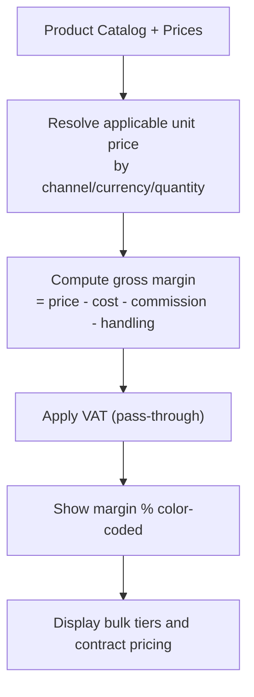

**Diagram sources**
- [page.tsx:1-105](file://apps/admin/src/app/pricing/page.tsx#L1-L105)
- [orders.ts:34-64](file://packages/database/src/services/orders.ts#L34-L64)
- [MODULE_10_PRICING_COMMISSION_NOTES.md:1-93](file://MODULE_10_PRICING_COMMISSION_NOTES.md#L1-L93)

**Section sources**
- [page.tsx:1-105](file://apps/admin/src/app/pricing/page.tsx#L1-L105)
- [orders.ts:34-64](file://packages/database/src/services/orders.ts#L34-L64)
- [MODULE_10_PRICING_COMMISSION_NOTES.md:1-93](file://MODULE_10_PRICING_COMMISSION_NOTES.md#L1-L93)

### Product Analytics and Insights
- The Admin Pricing page includes margin analysis and stat cards for active contracts and commission rules.
- The Seller Dashboard aggregates issues, compliance, and low-stock counts into action alerts.
- AI Insights and AI Assist components suggest improvements and draft content for listings.

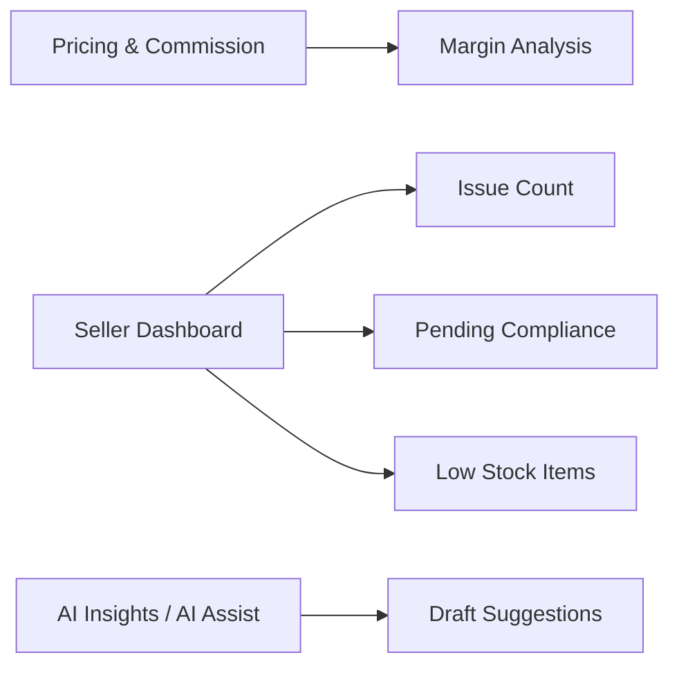

**Diagram sources**
- [page.tsx:1-105](file://apps/admin/src/app/pricing/page.tsx#L1-L105)
- [page.tsx:59-77](file://apps/seller/src/app/dashboard/page.tsx#L59-L77)
- [page.tsx:1-200](file://apps/admin/src/app/ai-insights/page.tsx#L1-L200)
- [page.tsx:1-200](file://apps/seller/src/app/products/actions.ts#L1-L200)

**Section sources**
- [page.tsx:1-105](file://apps/admin/src/app/pricing/page.tsx#L1-L105)
- [page.tsx:59-77](file://apps/seller/src/app/dashboard/page.tsx#L59-L77)
- [page.tsx:1-200](file://apps/admin/src/app/ai-insights/page.tsx#L1-L200)
- [page.tsx:1-200](file://apps/seller/src/app/products/actions.ts#L1-L200)

### AI-Powered Product Suggestions and SEO Enhancement
- AI draft generation endpoint supports listing creation assistance.
- AI Insights page provides suggestions for product optimization.
- SEO enhancements are implied by listing visibility and approval workflows.

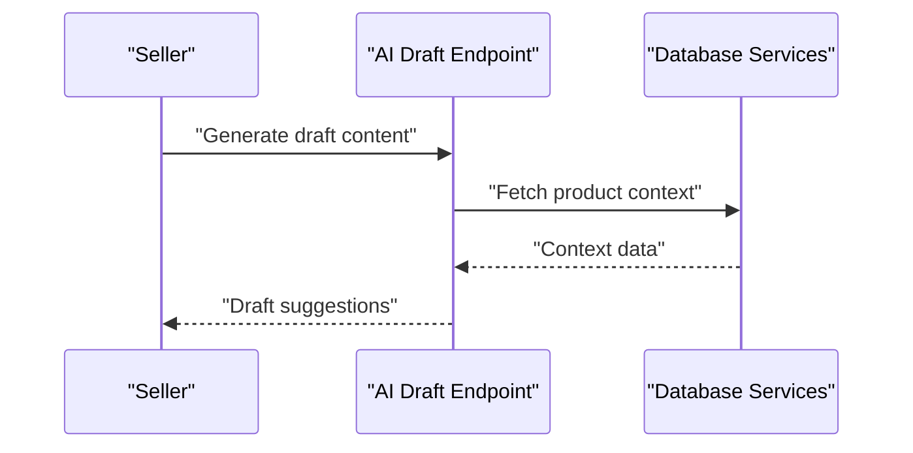

**Diagram sources**
- [route.ts:1-200](file://apps/seller/src/app/api/ai/draft/route.ts#L1-L200)
- [page.tsx:1-200](file://apps/admin/src/app/ai-insights/page.tsx#L1-L200)

**Section sources**
- [route.ts:1-200](file://apps/seller/src/app/api/ai/draft/route.ts#L1-L200)
- [page.tsx:1-200](file://apps/admin/src/app/ai-insights/page.tsx#L1-L200)

### Bulk Operations and Import/Export
- The Seller Products page exposes bulk actions for product records, enabling mass updates or deletions.
- Import/export capabilities are not explicitly implemented in the examined files; they can be introduced via CSV handlers and batch processors.

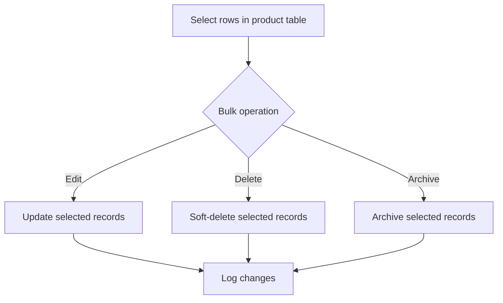

**Section sources**
- [page.tsx:1-200](file://apps/seller/src/app/products/actions.ts#L1-L200)

### Product Categorization Systems
- Categories management page exists in Admin, enabling hierarchical or flat categorization of products.
- Product listings can be filtered by category in the customer API.

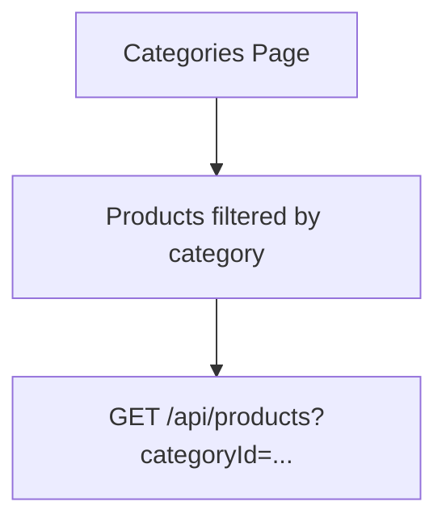

**Diagram sources**
- [page.tsx:1-200](file://apps/admin/src/app/categories/page.tsx#L1-L200)
- [route.ts:1-21](file://apps/customer/src/app/api/products/route.ts#L1-L21)

**Section sources**
- [page.tsx:1-200](file://apps/admin/src/app/categories/page.tsx#L1-L200)
- [route.ts:1-21](file://apps/customer/src/app/api/products/route.ts#L1-L21)

### Compliance Requirements and Approval Workflows
- Admin endpoints approve or reject compliance items for products and sellers.
- Compliance center and audit logs provide oversight and traceability.

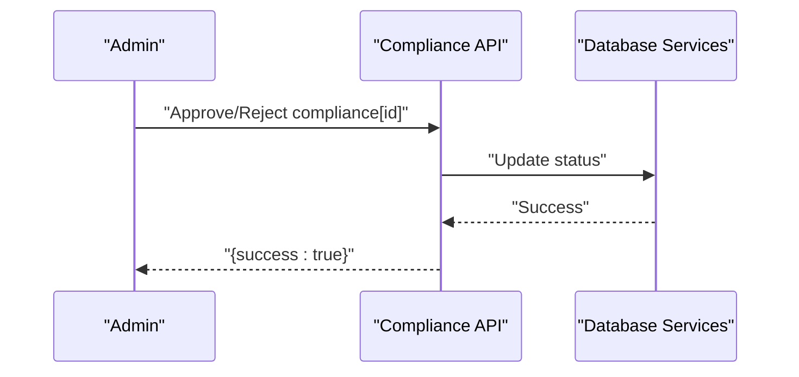

**Diagram sources**
- [route.ts:1-200](file://apps/admin/src/app/api/admin/compliance[id]/approve/route.ts#L1-L200)
- [route.ts:1-200](file://apps/admin/src/app/api/admin/compliance[id]/reject/route.ts#L1-L200)
- [page.tsx:1-200](file://apps/admin/src/app/compliance/page.tsx#L1-L200)
- [page.tsx:1-200](file://apps/admin/src/app/audits/page.tsx#L1-L200)

**Section sources**
- [route.ts:1-200](file://apps/admin/src/app/api/admin/compliance[id]/approve/route.ts#L1-L200)
- [route.ts:1-200](file://apps/admin/src/app/api/admin/compliance[id]/reject/route.ts#L1-L200)
- [page.tsx:1-200](file://apps/admin/src/app/compliance/page.tsx#L1-L200)
- [page.tsx:1-200](file://apps/admin/src/app/audits/page.tsx#L1-L200)

## Dependency Analysis
- Admin Pricing depends on pricing and commission data structures and computes margins.
- Orders service depends on product prices to resolve unit pricing by channel and quantity.
- Inventory service computes availability and low/out flags for UI dashboards.
- Compliance and approval endpoints depend on database services to update statuses.

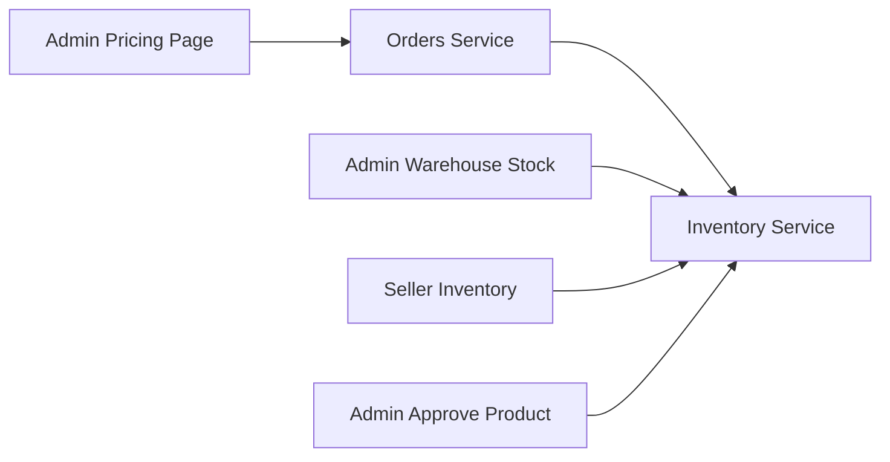

**Diagram sources**
- [page.tsx:1-105](file://apps/admin/src/app/pricing/page.tsx#L1-L105)
- [orders.ts:34-64](file://packages/database/src/services/orders.ts#L34-L64)
- [inventory.ts:1-43](file://packages/database/src/services/inventory.ts#L1-L43)
- [route.ts:1-20](file://apps/admin/src/app/api/admin/products/[id]/approve/route.ts#L1-L20)

**Section sources**
- [page.tsx:1-105](file://apps/admin/src/app/pricing/page.tsx#L1-L105)
- [orders.ts:34-64](file://packages/database/src/services/orders.ts#L34-L64)
- [inventory.ts:1-43](file://packages/database/src/services/inventory.ts#L1-L43)
- [route.ts:1-20](file://apps/admin/src/app/api/admin/products/[id]/approve/route.ts#L1-L20)

## Performance Considerations
- Centralized reads: The Orders service performs a single authoritative read of product catalog and pricing to compute line items, reducing inconsistency and improving throughput.
- Inventory filtering: Low/out-of-stock filters are applied after fetching, suitable for moderate datasets; consider pre-filtering at scale.
- Pagination: Product listing API supports pagination and limits to control payload sizes.

[No sources needed since this section provides general guidance]

## Troubleshooting Guide
- Product listing failures: Verify the customer API parameters (page, limit, search, categoryId) and ACTIVE status filtering.
- Approval errors: Confirm admin session and role checks before invoking approve endpoints.
- Inventory discrepancies: Recompute available stock and confirm reorder points; check reserved quantities and adjustments.
- Pricing anomalies: Validate bulk tiers and contract pricing validity dates; ensure channel/currency/quantity match.

**Section sources**
- [route.ts:1-21](file://apps/customer/src/app/api/products/route.ts#L1-L21)
- [route.ts:1-20](file://apps/admin/src/app/api/admin/products/[id]/approve/route.ts#L1-L20)
- [inventory.ts:1-43](file://packages/database/src/services/inventory.ts#L1-L43)
- [orders.ts:34-64](file://packages/database/src/services/orders.ts#L34-L64)

## Conclusion
The Product Management system integrates Admin oversight, Seller operations, and Customer consumption with robust inventory control, pricing transparency, and compliance workflows. AI-driven insights and categorization further enhance listing quality and discoverability. Extending bulk import/export and deepening audit granularity would strengthen operational efficiency.

[No sources needed since this section summarizes without analyzing specific files]

## Appendices
- Product listing API parameters: page, limit, search, categoryId, status, b2c/b2b flags.
- Admin approval roles: ADMIN and SUPER_ADMIN.
- Pricing concepts: supplier cost, B2C/B2B price, commission, handling, VAT, gross margin.

[No sources needed since this section provides general guidance]