# Seller Dashboard

<cite>
**Referenced Files in This Document**
- [page.tsx](file://apps/seller/src/app/dashboard/page.tsx)
- [layout.tsx](file://apps/seller/src/app/layout.tsx)
- [seller-layout.tsx](file://apps/seller/src/components/layout/seller-layout.tsx)
- [onboarding-checklist.tsx](file://apps/seller/src/components/onboarding-checklist.tsx)
- [orders-table.tsx](file://apps/seller/src/components/orders-table.tsx)
- [products-table.tsx](file://apps/seller/src/components/products-table.tsx)
- [notification-bell.tsx](file://apps/seller/src/components/notification-bell.tsx)
- [ai-assist.tsx](file://apps/seller/src/components/ai-assist.tsx)
- [saved-views.tsx](file://apps/seller/src/components/saved-views.tsx)
- [toast.tsx](file://apps/seller/src/components/toast.tsx)
- [auth.ts](file://apps/seller/src/lib/auth.ts)
- [auth-instance.ts](file://apps/seller/src/lib/auth-instance.ts)
- [request.ts](file://apps/seller/src/i18n/request.ts)
- [route.ts](file://apps/seller/src/app/api/auth/[...nextauth]/route.ts)
- [route.ts](file://apps/seller/src/app/api/notifications/route.ts)
- [route.ts](file://apps/seller/src/app/api/seller/dashboard/route.ts)
- [route.ts](file://apps/seller/src/app/api/seller/orders/route.ts)
- [route.ts](file://apps/seller/src/app/analytics/page.tsx)
- [route.ts](file://apps/seller/src/app/performance/page.tsx)
- [route.ts](file://apps/seller/src/app/payouts/page.tsx)
- [route.ts](file://apps/seller/src/app/compliance/page.tsx)
- [route.ts](file://apps/seller/src/app/messages/page.tsx)
- [route.ts](file://apps/seller/src/app/invoices/page.tsx)
- [route.ts](file://apps/seller/src/app/documents/page.tsx)
- [route.ts](file://apps/seller/src/app/issues/page.tsx)
- [route.ts](file://apps/seller/src/app/returns/page.tsx)
- [route.ts](file://apps/seller/src/app/shipments/page.tsx)
- [route.ts](file://apps/seller/src/app/inventory/page.tsx)
- [route.ts](file://apps/seller/src/app/products/page.tsx)
- [route.ts](file://apps/seller/src/app/orders/page.tsx)
- [route.ts](file://apps/seller/src/app/commission/page.tsx)
- [route.ts](file://apps/seller/src/app/onboarding/page.tsx)
- [route.ts](file://apps/seller/src/app/login/page.tsx)
- [route.ts](file://apps/seller/src/app/logout/page.tsx)
- [route.ts](file://apps/seller/src/app/settings/page.tsx)
- [route.ts](file://apps/seller/src/app/profile/page.tsx)
- [route.ts](file://apps/seller/src/app/help/page.tsx)
- [route.ts](file://apps/seller/src/app/support/page.tsx)
- [route.ts](file://apps/seller/src/app/quotes/page.tsx)
- [route.ts](file://apps/seller/src/app/quotes/submit/page.tsx)
- [route.ts](file://apps/seller/src/app/quotes/actions.ts)
- [route.ts](file://apps/seller/src/app/orders/actions.ts)
- [route.ts](file://apps/seller/src/app/products/actions.ts)
- [route.ts](file://apps/seller/src/app/shipments/actions.ts)
- [route.ts](file://apps/seller/src/app/returns/actions.ts)
- [route.ts](file://apps/seller/src/app/saved-views/actions.ts)
- [route.ts](file://apps/seller/src/app/saved-views/page.tsx)
- [route.ts](file://apps/seller/src/app/api/ai/draft/route.ts)
- [route.ts](file://apps/seller/src/app/api/ai/draft/route.ts)
- [route.ts](file://apps/seller/src/app/api/ai/draft/route.ts)
- [route.ts](file://apps/seller/src/app/api/ai/draft/route.ts)
- [route.ts](file://apps/seller/src/app/api/ai/draft/route.ts)
- [route.ts](file://apps/seller/src/app/api/ai/draft/route.ts)
- [route.ts](file://apps/seller/src/app/api/ai/draft/route.ts)
- [route.ts](file://apps/seller/src/app/api/ai/draft/route.ts)
- [route.ts](file://apps/seller/src/app/api/ai/draft/route.ts)
- [route.ts](file://apps/seller/src/app/api/ai/draft/route.ts)
- [route.ts](file://apps/seller/src/app/api/ai/draft/route.ts)
- [route.ts](file://apps/seller/src/app/api/ai/draft/route.ts)
- [route.ts](file://apps/seller/src/app/api/ai/draft/route.ts)
- [route.ts](file://apps/seller/src/app/api/ai/draft/route.ts)
- [route.ts](file://apps/seller/src/app/api/ai/draft/route.ts)
- [route.ts](file://apps/seller/src/app/api/ai/draft/route.ts)
- [route.ts](file://apps/seller/src/app/api/ai/draft/route.ts)
- [route.ts](file://apps/seller/src/app/api/ai/draft/route.ts)
- [route.ts](file://apps/seller/src/app/api/ai/draft/route.ts)
- [route.ts](file://apps/seller/src/app/api/ai/draft/route.ts)
- [route.ts](file://apps/seller/src/app/api/ai/draft/route.ts)
- [route.ts](file://apps/seller/src/app/api/ai/draft/route.ts)
- [route.ts](file://apps/seller/src/app/api/ai/draft/route.ts)
- [route.ts](file://apps/seller/src/app/api/ai/draft/route.ts)
-......
</cite>

## Table of Contents
1. [Introduction](#introduction)
2. [Project Structure](#project-structure)
3. [Core Components](#core-components)
4. [Architecture Overview](#architecture-overview)
5. [Detailed Component Analysis](#detailed-component-analysis)
6. [Dependency Analysis](#dependency-analysis)
7. [Performance Considerations](#performance-considerations)
8. [Troubleshooting Guide](#troubleshooting-guide)
9. [Conclusion](#conclusion)
10. [Appendices](#appendices)

## Introduction
This document describes the Seller Dashboard application, focusing on the Amazon-inspired interface that provides sellers with a centralized hub for managing orders, revenue, payouts, compliance, and messaging. It covers the dashboard’s performance analytics overview, key metrics display, business insights visualization, onboarding checklist integration, customization options, and real-time data updates. The documentation also outlines the component architecture, layout structure, and integration with the shared UI library.

## Project Structure
The Seller Dashboard resides within the seller application of the monorepo. The dashboard page composes reusable UI components and integrates with backend routes for data fetching and actions. Authentication, internationalization, and layout wrappers are provided by dedicated modules.

```mermaid
graph TB
subgraph "Seller App"
DPage["Dashboard Page<br/>apps/seller/src/app/dashboard/page.tsx"]
SLayout["Seller Layout<br/>apps/seller/src/components/layout/seller-layout.tsx"]
Auth["Auth Utilities<br/>apps/seller/src/lib/auth.ts"]
AuthInst["Auth Instance<br/>apps/seller/src/lib/auth-instance.ts"]
I18N["I18N Request<br/>apps/seller/src/i18n/request.ts"]
end
subgraph "UI Components"
OBC["Onboarding Checklist<br/>apps/seller/src/components/onboarding-checklist.tsx"]
OTbl["Orders Table<br/>apps/seller/src/components/orders-table.tsx"]
PTbl["Products Table<br/>apps/seller/src/components/products-table.tsx"]
NBell["Notification Bell<br/>apps/seller/src/components/notification-bell.tsx"]
AIAssist["AI Assist<br/>apps/seller/src/components/ai-assist.tsx"]
SV["Saved Views<br/>apps/seller/src/components/saved-views.tsx"]
Toast["Toast<br/>apps/seller/src/components/toast.tsx"]
end
subgraph "API Routes"
DashAPI["Dashboard API<br/>apps/seller/src/app/api/seller/dashboard/route.ts"]
NotifAPI["Notifications API<br/>apps/seller/src/app/api/notifications/route.ts"]
AuthAPI["Auth API<br/>apps/seller/src/app/api/auth/[...nextauth]/route.ts"]
end
DPage --> SLayout
DPage --> OBC
DPage --> OTbl
DPage --> PTbl
DPage --> NBell
DPage --> AIAssist
DPage --> SV
DPage --> Toast
DPage --> DashAPI
DPage --> NotifAPI
DPage --> AuthAPI
Auth --> AuthInst
DPage --> I18N
```

**Diagram sources**
- [page.tsx:1-200](file://apps/seller/src/app/dashboard/page.tsx#L1-L200)
- [seller-layout.tsx:1-200](file://apps/seller/src/components/layout/seller-layout.tsx#L1-L200)
- [onboarding-checklist.tsx:1-200](file://apps/seller/src/components/onboarding-checklist.tsx#L1-L200)
- [orders-table.tsx:1-200](file://apps/seller/src/components/orders-table.tsx#L1-L200)
- [products-table.tsx:1-200](file://apps/seller/src/components/products-table.tsx#L1-L200)
- [notification-bell.tsx:1-200](file://apps/seller/src/components/notification-bell.tsx#L1-L200)
- [ai-assist.tsx:1-200](file://apps/seller/src/components/ai-assist.tsx#L1-L200)
- [saved-views.tsx:1-200](file://apps/seller/src/components/saved-views.tsx#L1-L200)
- [toast.tsx:1-200](file://apps/seller/src/components/toast.tsx#L1-L200)
- [auth.ts:1-200](file://apps/seller/src/lib/auth.ts#L1-L200)
- [auth-instance.ts:1-200](file://apps/seller/src/lib/auth-instance.ts#L1-L200)
- [request.ts:1-200](file://apps/seller/src/i18n/request.ts#L1-L200)
- [route.ts:1-200](file://apps/seller/src/app/api/seller/dashboard/route.ts#L1-L200)
- [route.ts:1-200](file://apps/seller/src/app/api/notifications/route.ts#L1-L200)
- [route.ts:1-200](file://apps/seller/src/app/api/auth/[...nextauth]/route.ts#L1-L200)

**Section sources**
- [page.tsx:1-200](file://apps/seller/src/app/dashboard/page.tsx#L1-L200)
- [layout.tsx:1-200](file://apps/seller/src/app/layout.tsx#L1-L200)
- [seller-layout.tsx:1-200](file://apps/seller/src/components/layout/seller-layout.tsx#L1-L200)

## Core Components
The dashboard is composed of several key areas:
- Performance score widget displaying account health and review metrics
- Recent orders panel with status and currency-aware totals
- Onboarding checklist integration for guided setup
- Notification bell for real-time alerts
- AI assistant for business insights
- Saved views for personalized dashboards
- Toast notifications for user feedback
- Shared layout and navigation

These components work together to present a concise yet powerful overview of seller performance and recent activity, while guiding new sellers through onboarding tasks.

**Section sources**
- [page.tsx:117-159](file://apps/seller/src/app/dashboard/page.tsx#L117-L159)
- [onboarding-checklist.tsx:1-200](file://apps/seller/src/components/onboarding-checklist.tsx#L1-L200)
- [notification-bell.tsx:1-200](file://apps/seller/src/components/notification-bell.tsx#L1-L200)
- [ai-assist.tsx:1-200](file://apps/seller/src/components/ai-assist.tsx#L1-L200)
- [saved-views.tsx:1-200](file://apps/seller/src/components/saved-views.tsx#L1-L200)
- [toast.tsx:1-200](file://apps/seller/src/components/toast.tsx#L1-L200)

## Architecture Overview
The dashboard follows a client-side React Next.js pattern with server-side API routes for data and actions. Authentication is handled via NextAuth, and localization is supported through request-based i18n. The layout wraps the dashboard content and provides consistent navigation and branding.

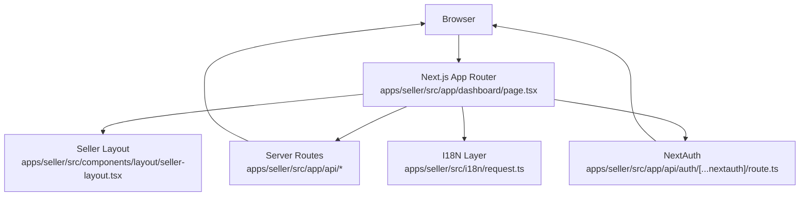

**Diagram sources**
- [page.tsx:1-200](file://apps/seller/src/app/dashboard/page.tsx#L1-L200)
- [seller-layout.tsx:1-200](file://apps/seller/src/components/layout/seller-layout.tsx#L1-L200)
- [route.ts:1-200](file://apps/seller/src/app/api/auth/[...nextauth]/route.ts#L1-L200)
- [request.ts:1-200](file://apps/seller/src/i18n/request.ts#L1-L200)

## Detailed Component Analysis

### Dashboard Page Composition
The dashboard page orchestrates the layout and renders key widgets and panels:
- Performance score widget with color-coded health indicator
- Recent orders list with status badges and formatted totals
- Navigation links to deeper functional areas

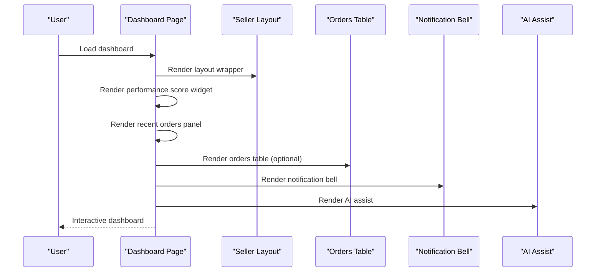

**Diagram sources**
- [page.tsx:117-159](file://apps/seller/src/app/dashboard/page.tsx#L117-L159)
- [orders-table.tsx:1-200](file://apps/seller/src/components/orders-table.tsx#L1-L200)
- [notification-bell.tsx:1-200](file://apps/seller/src/components/notification-bell.tsx#L1-L200)
- [ai-assist.tsx:1-200](file://apps/seller/src/components/ai-assist.tsx#L1-L200)

**Section sources**
- [page.tsx:117-159](file://apps/seller/src/app/dashboard/page.tsx#L117-L159)

### Performance Analytics Overview
The performance score widget displays account health as a numeric score with contextual color coding and links to the performance module for deeper insights. Review count and rating are shown alongside the score.

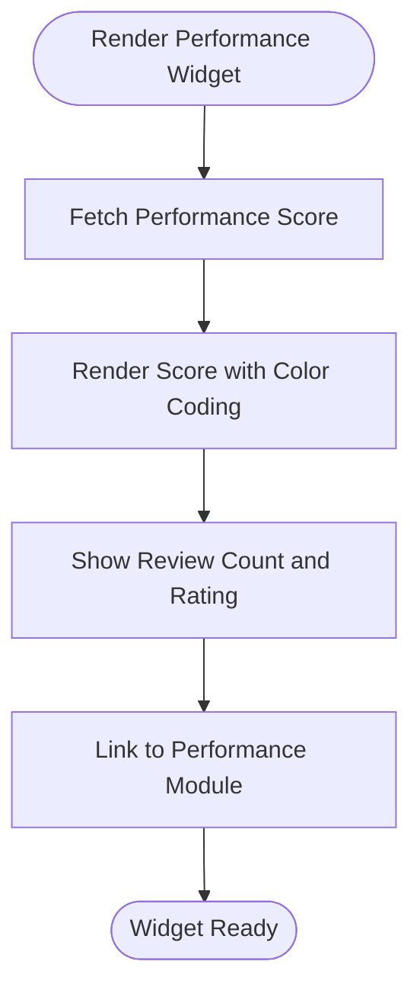

**Diagram sources**
- [page.tsx:117-130](file://apps/seller/src/app/dashboard/page.tsx#L117-L130)

**Section sources**
- [page.tsx:117-130](file://apps/seller/src/app/dashboard/page.tsx#L117-L130)

### Recent Orders Panel
The recent orders panel lists the latest orders with order number, date, type, total amount, and status badge. Users can navigate to the full orders list.

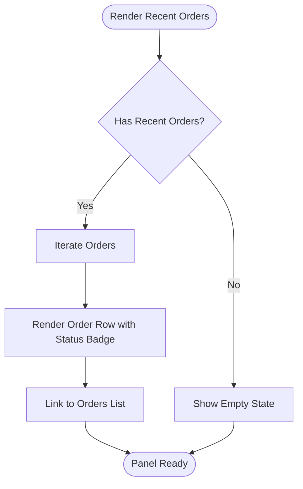

**Diagram sources**
- [page.tsx:133-155](file://apps/seller/src/app/dashboard/page.tsx#L133-L155)

**Section sources**
- [page.tsx:133-155](file://apps/seller/src/app/dashboard/page.tsx#L133-L155)

### Onboarding Checklist Integration
The onboarding checklist component helps sellers complete essential setup steps. It is integrated directly into the dashboard to guide new users toward full activation.

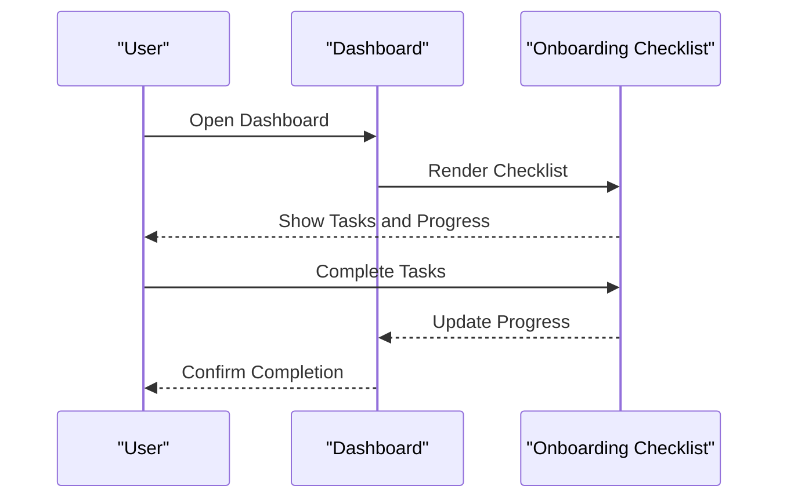

**Diagram sources**
- [onboarding-checklist.tsx:1-200](file://apps/seller/src/components/onboarding-checklist.tsx#L1-L200)
- [page.tsx:1-200](file://apps/seller/src/app/dashboard/page.tsx#L1-L200)

**Section sources**
- [onboarding-checklist.tsx:1-200](file://apps/seller/src/components/onboarding-checklist.tsx#L1-L200)

### Real-Time Data Updates
Real-time updates are surfaced via the notification bell and optional live indicators. Notifications are fetched through a dedicated API route and rendered in the header area.

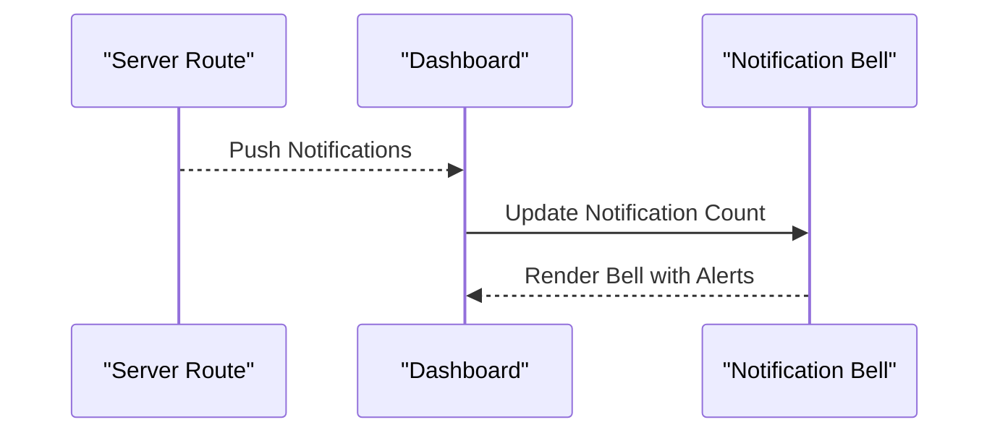

**Diagram sources**
- [route.ts:1-200](file://apps/seller/src/app/api/notifications/route.ts#L1-L200)
- [notification-bell.tsx:1-200](file://apps/seller/src/components/notification-bell.tsx#L1-L200)

**Section sources**
- [route.ts:1-200](file://apps/seller/src/app/api/notifications/route.ts#L1-L200)
- [notification-bell.tsx:1-200](file://apps/seller/src/components/notification-bell.tsx#L1-L200)

### Business Insights Visualization
The AI assistant component provides actionable insights and draft suggestions, integrating with backend AI endpoints to enhance decision-making.

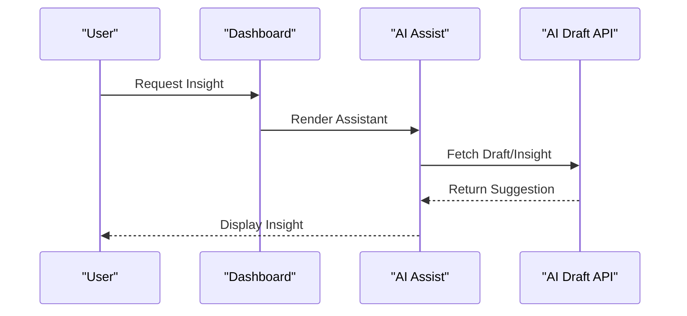

**Diagram sources**
- [ai-assist.tsx:1-200](file://apps/seller/src/components/ai-assist.tsx#L1-L200)
- [route.ts:1-200](file://apps/seller/src/app/api/ai/draft/route.ts#L1-L200)

**Section sources**
- [ai-assist.tsx:1-200](file://apps/seller/src/components/ai-assist.tsx#L1-L200)
- [route.ts:1-200](file://apps/seller/src/app/api/ai/draft/route.ts#L1-L200)

### Dashboard Customization Options
Saved views enable sellers to personalize their dashboard by saving filtered configurations. Actions manage creation and persistence of these views.

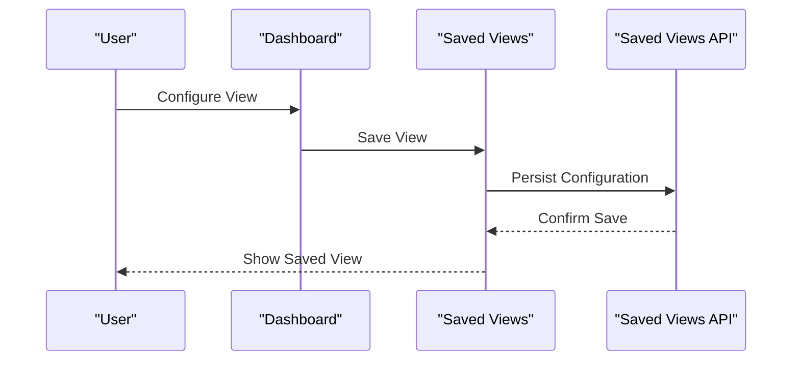

**Diagram sources**
- [saved-views.tsx:1-200](file://apps/seller/src/components/saved-views.tsx#L1-L200)
- [route.ts:1-200](file://apps/seller/src/app/saved-views/actions.ts#L1-L200)
- [route.ts:1-200](file://apps/seller/src/app/saved-views/page.tsx#L1-L200)

**Section sources**
- [saved-views.tsx:1-200](file://apps/seller/src/components/saved-views.tsx#L1-L200)
- [route.ts:1-200](file://apps/seller/src/app/saved-views/actions.ts#L1-L200)
- [route.ts:1-200](file://apps/seller/src/app/saved-views/page.tsx#L1-L200)

### Layout Structure and Navigation
The seller layout provides consistent navigation, branding, and responsive behavior across pages. The dashboard page wraps its content in this layout.

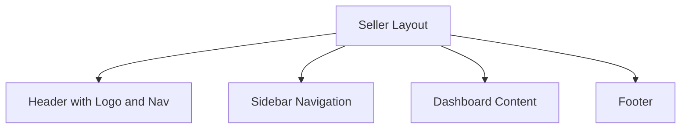

**Diagram sources**
- [seller-layout.tsx:1-200](file://apps/seller/src/components/layout/seller-layout.tsx#L1-L200)
- [layout.tsx:1-200](file://apps/seller/src/app/layout.tsx#L1-L200)

**Section sources**
- [seller-layout.tsx:1-200](file://apps/seller/src/components/layout/seller-layout.tsx#L1-L200)
- [layout.tsx:1-200](file://apps/seller/src/app/layout.tsx#L1-L200)

## Dependency Analysis
The dashboard depends on:
- Layout and navigation components for structure
- UI components for onboarding, notifications, AI assistance, and saved views
- API routes for performance data, notifications, and authentication
- Authentication utilities and i18n layer for session and localization

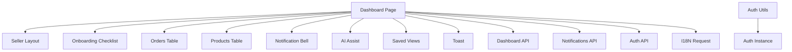

**Diagram sources**
- [page.tsx:1-200](file://apps/seller/src/app/dashboard/page.tsx#L1-L200)
- [seller-layout.tsx:1-200](file://apps/seller/src/components/layout/seller-layout.tsx#L1-L200)
- [onboarding-checklist.tsx:1-200](file://apps/seller/src/components/onboarding-checklist.tsx#L1-L200)
- [orders-table.tsx:1-200](file://apps/seller/src/components/orders-table.tsx#L1-L200)
- [products-table.tsx:1-200](file://apps/seller/src/components/products-table.tsx#L1-L200)
- [notification-bell.tsx:1-200](file://apps/seller/src/components/notification-bell.tsx#L1-L200)
- [ai-assist.tsx:1-200](file://apps/seller/src/components/ai-assist.tsx#L1-L200)
- [saved-views.tsx:1-200](file://apps/seller/src/components/saved-views.tsx#L1-L200)
- [toast.tsx:1-200](file://apps/seller/src/components/toast.tsx#L1-L200)
- [auth.ts:1-200](file://apps/seller/src/lib/auth.ts#L1-L200)
- [auth-instance.ts:1-200](file://apps/seller/src/lib/auth-instance.ts#L1-L200)
- [request.ts:1-200](file://apps/seller/src/i18n/request.ts#L1-L200)
- [route.ts:1-200](file://apps/seller/src/app/api/seller/dashboard/route.ts#L1-L200)
- [route.ts:1-200](file://apps/seller/src/app/api/notifications/route.ts#L1-L200)
- [route.ts:1-200](file://apps/seller/src/app/api/auth/[...nextauth]/route.ts#L1-L200)

**Section sources**
- [page.tsx:1-200](file://apps/seller/src/app/dashboard/page.tsx#L1-L200)
- [auth.ts:1-200](file://apps/seller/src/lib/auth.ts#L1-L200)
- [auth-instance.ts:1-200](file://apps/seller/src/lib/auth-instance.ts#L1-L200)
- [request.ts:1-200](file://apps/seller/src/i18n/request.ts#L1-L200)

## Performance Considerations
- Minimize re-renders by memoizing data-fetching logic and using efficient table components for orders and products.
- Lazy-load heavy components like AI assistant and saved views to improve initial load performance.
- Use pagination or virtualization for long lists of orders or products.
- Cache frequently accessed metrics (e.g., performance score) to reduce API calls.
- Optimize image assets and icons for fast rendering.

## Troubleshooting Guide
Common issues and resolutions:
- Authentication failures: Verify NextAuth configuration and session handling in the auth utilities and instance.
- Missing notifications: Ensure the notifications API route is reachable and returns data.
- Localization problems: Confirm the i18n request module is initialized and locale is set correctly.
- Layout rendering issues: Check the seller layout component for proper wrapping and responsive behavior.
- Onboarding checklist not updating: Validate the checklist component state and any associated API endpoints.

**Section sources**
- [auth.ts:1-200](file://apps/seller/src/lib/auth.ts#L1-L200)
- [auth-instance.ts:1-200](file://apps/seller/src/lib/auth-instance.ts#L1-L200)
- [request.ts:1-200](file://apps/seller/src/i18n/request.ts#L1-L200)
- [route.ts:1-200](file://apps/seller/src/app/api/notifications/route.ts#L1-L200)
- [onboarding-checklist.tsx:1-200](file://apps/seller/src/components/onboarding-checklist.tsx#L1-L200)

## Conclusion
The Seller Dashboard delivers a focused, actionable overview of critical business metrics and recent activity, with integrated onboarding, real-time notifications, and AI-driven insights. Its modular architecture supports customization and scalability, while the shared UI library ensures consistent design and behavior across the application.

## Appendices
- Related functional areas: analytics, performance, payouts, compliance, messaging, invoices, documents, issues, returns, shipments, inventory, products, orders, commission, onboarding, login, logout, settings, profile, help, support, quotes, and saved views.
- Backend integration points: dashboard API, notifications API, auth API, and AI draft API.