# Seller Portal

<cite>
**Referenced Files in This Document**
- [apps/seller/src/app/dashboard/page.tsx](file://apps/seller/src/app/dashboard/page.tsx)
- [apps/seller/src/app/analytics/page.tsx](file://apps/seller/src/app/analytics/page.tsx)
- [apps/seller/src/app/products/page.tsx](file://apps/seller/src/app/products/page.tsx)
- [apps/seller/src/app/orders/page.tsx](file://apps/seller/src/app/orders/page.tsx)
- [apps/seller/src/app/inventory/page.tsx](file://apps/seller/src/app/inventory/page.tsx)
- [apps/seller/src/app/commission/page.tsx](file://apps/seller/src/app/commission/page.tsx)
- [apps/seller/src/app/payouts/page.tsx](file://apps/seller/src/app/payouts/page.tsx)
- [apps/seller/src/app/invoices/page.tsx](file://apps/seller/src/app/invoices/page.tsx)
- [apps/seller/src/app/compliance/page.tsx](file://apps/seller/src/app/compliance/page.tsx)
- [apps/seller/src/app/documents/page.tsx](file://apps/seller/src/app/documents/page.tsx)
- [apps/seller/src/app/messages/page.tsx](file://apps/seller/src/app/messages/page.tsx)
- [apps/seller/src/app/performance/page.tsx](file://apps/seller/src/app/performance/page.tsx)
- [apps/seller/src/app/onboarding/page.tsx](file://apps/seller/src/app/onboarding/page.tsx)
- [apps/seller/src/app/shipments/page.tsx](file://apps/seller/src/app/shipments/page.tsx)
- [apps/seller/src/app/returns/page.tsx](file://apps/seller/src/app/returns/page.tsx)
- [apps/seller/src/app/issues/page.tsx](file://apps/seller/src/app/issues/page.tsx)
- [apps/seller/src/components/layout/seller-layout.tsx](file://apps/seller/src/components/layout/seller-layout.tsx)
- [apps/seller/src/components/ai-assist.tsx](file://apps/seller/src/components/ai-assist.tsx)
- [apps/seller/src/components/onboarding-checklist.tsx](file://apps/seller/src/components/onboarding-checklist.tsx)
- [apps/seller/src/components/command-palette.tsx](file://apps/seller/src/components/command-palette.tsx)
- [apps/seller/src/components/notification-bell.tsx](file://apps/seller/src/components/notification-bell.tsx)
- [apps/seller/src/components/orders-table.tsx](file://apps/seller/src/components/orders-table.tsx)
- [apps/seller/src/components/products-table.tsx](file://apps/seller/src/components/products-table.tsx)
- [apps/seller/src/lib/auth.ts](file://apps/seller/src/lib/auth.ts)
- [apps/seller/src/lib/auth-instance.ts](file://apps/seller/src/lib/auth-instance.ts)
- [apps/seller/src/lib/ai.ts](file://apps/seller/src/lib/ai.ts)
- [apps/seller/src/middleware.ts](file://apps/seller/src/middleware.ts)
- [apps/seller/src/i18n/request.ts](file://apps/seller/src/i18n/request.ts)
- [apps/seller/messages/en.json](file://apps/seller/messages/en.json)
- [apps/admin/src/app/dashboard/page.tsx](file://apps/admin/src/app/dashboard/page.tsx)
- [apps/admin/src/app/api/seller/[id]/route.ts](file://apps/admin/src/app/api/seller/[id]/route.ts)
- [apps/admin/src/app/api/admin/sellers/[id]/approve/route.ts](file://apps/admin/src/app/api/admin/sellers/[id]/approve/route.ts)
- [apps/admin/src/app/api/admin/sellers/[id]/reject/route.ts](file://apps/admin/src/app/api/admin/sellers/[id]/reject/route.ts)
- [apps/admin/src/app/api/admin/compliance/[id]/approve/route.ts](file://apps/admin/src/app/api/admin/compliance/[id]/approve/route.ts)
- [apps/admin/src/app/api/admin/compliance/[id]/reject/route.ts](file://apps/admin/src/app/api/admin/compliance/[id]/reject/route.ts)
- [apps/admin/src/app/api/admin/products/[id]/approve/route.ts](file://apps/admin/src/app/api/admin/products/[id]/approve/route.ts)
- [apps/admin/src/app/api/admin/dashboard/route.ts](file://apps/admin/src/app/api/admin/dashboard/route.ts)
- [apps/admin/src/app/api/auth/[...nextauth]/route.ts](file://apps/admin/src/app/api/auth/[...nextauth]/route.ts)
- [apps/admin/src/app/sellers/page.tsx](file://apps/admin/src/app/sellers/page.tsx)
- [apps/admin/src/app/sellers/pending/page.tsx](file://apps/admin/src/app/sellers/pending/page.tsx)
- [apps/admin/src/app/compliance/page.tsx](file://apps/admin/src/app/compliance/page.tsx)
- [apps/admin/src/app/finance/page.tsx](file://apps/admin/src/app/finance/page.tsx)
- [apps/admin/src/app/integrations/page.tsx](file://apps/admin/src/app/integrations/page.tsx)
- [apps/admin/src/app/warehouse/stock/page.tsx](file://apps/admin/src/app/warehouse/stock/page.tsx)
- [apps/admin/src/app/warehouse/inbound/page.tsx](file://apps/admin/src/app/warehouse/inbound/page.tsx)
- [apps/admin/src/app/warehouse/pickpack/page.tsx](file://apps/admin/src/app/warehouse/pickpack/page.tsx)
- [apps/admin/src/app/shipments/page.tsx](file://apps/admin/src/app/shipments/page.tsx)
- [apps/admin/src/app/returns/page.tsx](file://apps/admin/src/app/returns/page.tsx)
- [apps/admin/src/app/support/[id]/page.tsx](file://apps/admin/src/app/support/[id]/page.tsx)
- [apps/admin/src/app/support/actions.ts](file://apps/admin/src/app/support/actions.ts)
- [apps/admin/src/app/quotes/page.tsx](file://apps/admin/src/app/quotes/page.tsx)
- [apps/admin/src/app/pricing/page.tsx](file://apps/admin/src/app/pricing/page.tsx)
- [apps/admin/src/app/campaigns/page.tsx](file://apps/admin/src/app/campaigns/page.tsx)
- [apps/admin/src/app/deals/page.tsx](file://apps/admin/src/app/deals/page.tsx)
- [apps/admin/src/app/segments/page.tsx](file://apps/admin/src/app/segments/page.tsx)
- [apps/admin/src/app/brands/page.tsx](file://apps/admin/src/app/brands/page.tsx)
- [apps/admin/src/app/categories/page.tsx](file://apps/admin/src/app/categories/page.tsx)
- [apps/admin/src/app/users/page.tsx](file://apps/admin/src/app/users/page.tsx)
- [apps/admin/src/app/settings/page.tsx](file://apps/admin/src/app/settings/page.tsx)
- [apps/admin/src/app/automation/page.tsx](file://apps/admin/src/app/automation/page.tsx)
- [apps/admin/src/app/audit/page.tsx](file://apps/admin/src/app/audit/page.tsx)
- [apps/admin/src/app/disputes/page.tsx](file://apps/admin/src/app/disputes/page.tsx)
- [apps/admin/src/app/vat/page.tsx](file://apps/admin/src/app/vat/page.tsx)
- [apps/admin/src/app/settlements/page.tsx](file://apps/admin/src/app/settlements/page.tsx)
- [apps/admin/src/app/sla/page.tsx](file://apps/admin/src/app/sla/page.tsx)
- [apps/admin/src/app/performance/page.tsx](file://apps/admin/src/app/performance/page.tsx)
- [apps/admin/src/app/crm/page.tsx](file://apps/admin/src/app/crm/page.tsx)
- [apps/admin/src/app/ai-insights/page.tsx](file://apps/admin/src/app/ai-insights/page.tsx)
- [apps/admin/src/app/api/notifications/route.ts](file://apps/admin/src/app/api/notifications/route.ts)
- [apps/admin/src/app/api/ai/draft/route.ts](file://apps/admin/src/app/api/ai/draft/route.ts)
- [apps/admin/src/app/ai-insights/page.tsx](file://apps/admin/src/app/ai-insights/page.tsx)
- [apps/admin/src/app/ai-insights/page.tsx](file://apps/admin/src/app/ai-insights/page.tsx)
- [apps/admin/src/app/api/ai/draft/route.ts](file://apps/admin/src/app/api/ai/draft/route.ts)
- [apps/admin/src/app/api/notifications/route.ts](file://apps/admin/src/app/api/notifications/route.ts)
- [apps/admin/src/app/api/admin/dashboard/route.ts](file://apps/admin/src/app/api/admin/dashboard/route.ts)
- [apps/admin/src/app/api/admin/sellers/[id]/approve/route.ts](file://apps/admin/src/app/api/admin/sellers/[id]/approve/route.ts)
- [apps/admin/src/app/api/admin/sellers/[id]/reject/route.ts](file://apps/admin/src/app/api/admin/sellers/[id]/reject/route.ts)
- [apps/admin/src/app/api/admin/compliance/[id]/approve/route.ts](file://apps/admin/src/app/api/admin/compliance/[id]/approve/route.ts)
- [apps/admin/src/app/api/admin/compliance/[id]/reject/route.ts](file://apps/admin/src/app/api/admin/compliance/[id]/reject/route.ts)
- [apps/admin/src/app/api/admin/products/[id]/approve/route.ts](file://apps/admin/src/app/api/admin/products/[id]/approve/route.ts)
- [apps/admin/src/app/api/auth/[...nextauth]/route.ts](file://apps/admin/src/app/api/auth/[...nextauth]/route.ts)
- [apps/admin/src/app/sellers/page.tsx](file://apps/admin/src/app/sellers/page.tsx)
- [apps/admin/src/app/sellers/pending/page.tsx](file://apps/admin/src/app/sellers/pending/page.tsx)
- [apps/admin/src/app/compliance/page.tsx](file://apps/admin/src/app/compliance/page.tsx)
- [apps/admin/src/app/finance/page.tsx](file://apps/admin/src/app/finance/page.tsx)
- [apps/admin/src/app/integrations/page.tsx](file://apps/admin/src/app/integrations/page.tsx)
- [apps/admin/src/app/warehouse/stock/page.tsx](file://apps/admin/src/app/warehouse/stock/page.tsx)
- [apps/admin/src/app/warehouse/inbound/page.tsx](file://apps/admin/src/app/warehouse/inbound/page.tsx)
- [apps/admin/src/app/warehouse/pickpack/page.tsx](file://apps/admin/src/app/warehouse/pickpack/page.tsx)
- [apps/admin/src/app/shipments/page.tsx](file://apps/admin/src/app/shipments/page.tsx)
- [apps/admin/src/app/returns/page.tsx](file://apps/admin/src/app/returns/page.tsx)
- [apps/admin/src/app/support/[id]/page.tsx](file://apps/admin/src/app/support/[id]/page.tsx)
- [apps/admin/src/app/support/actions.ts](file://apps/admin/src/app/support/actions.ts)
- [apps/admin/src/app/quotes/page.tsx](file://apps/admin/src/app/quotes/page.tsx)
- [apps/admin/src/app/pricing/page.tsx](file://apps/admin/src/app/pricing/page.tsx)
- [apps/admin/src/app/campaigns/page.tsx](file://apps/admin/src/app/campaigns/page.tsx)
- [apps/admin/src/app/deals/page.tsx](file://apps/admin/src/app/deals/page.tsx)
- [apps/admin/src/app/segments/page.tsx](file://apps/admin/src/app/segments/page.tsx)
- [apps/admin/src/app/brands/page.tsx](file://apps/admin/src/app/brands/page.tsx)
- [apps/admin/src/app/categories/page.tsx](file://apps/admin/src/app/categories/page.tsx)
- [apps/admin/src/app/users/page.tsx](file://apps/admin/src/app/users/page.tsx)
- [apps/admin/src/app/settings/page.tsx](file://apps/admin/src/app/settings/page.tsx)
- [apps/admin/src/app/automation/page.tsx](file://apps/admin/src/app/automation/page.tsx)
- [apps/admin/src/app/audit/page.tsx](file://apps/admin/src/app/audit/page.tsx)
- [apps/admin/src/app/disputes/page.tsx](file://apps/admin/src/app/disputes/page.tsx)
- [apps/admin/src/app/vat/page.tsx](file://apps/admin/src/app/vat/page.tsx)
- [apps/admin/src/app/settlements/page.tsx](file://apps/admin/src/app/settlements/page.tsx)
- [apps/admin/src/app/sla/page.tsx](file://apps/admin/src/app/sla/page.tsx)
- [apps/admin/src/app/performance/page.tsx](file://apps/admin/src/app/performance/page.tsx)
- [apps/admin/src/app/crm/page.tsx](file://apps/admin/src/app/crm/page.tsx)
- [apps/admin/src/app/ai-insights/page.tsx](file://apps/admin/src/app/ai-insights/page.tsx)
- [apps/admin/src/app/api/notifications/route.ts](file://apps/admin/src/app/api/notifications/route.ts)
- [apps/admin/src/app/api/ai/draft/route.ts](file://apps/admin/src/app/api/ai/draft/route.ts)
- [apps/admin/src/app/api/admin/dashboard/route.ts](file://apps/admin/src/app/api/admin/dashboard/route.ts)
- [apps/admin/src/app/api/admin/sellers/[id]/approve/route.ts](file://apps/admin/src/app/api/admin/sellers/[id]/approve/route.ts)
- [apps/admin/src/app/api/admin/sellers/[id]/reject/route.ts](file://apps/admin/src/app/api/admin/sellers/[id]/reject/route.ts)
- [apps/admin/src/app/api/admin/compliance/[id]/approve/route.ts](file://apps/admin/src/app/api/admin/compliance/[id]/approve/route.ts)
- [apps/admin/src/app/api/admin/compliance/[id]/reject/route.ts](file://apps/admin/src/app/api/admin/compliance/[id]/reject/route.ts)
- [apps/admin/src/app/api/admin/products/[id]/approve/route.ts](file://apps/admin/src/app/api/admin/products/[id]/approve/route.ts)
- [apps/admin/src/app/api/auth/[...nextauth]/route.ts](file://apps/admin/src/app/api/auth/[...nextauth]/route.ts)
- [apps/admin/src/app/sellers/page.tsx](file://apps/admin/src/app/sellers/page.tsx)
- [apps/admin/src/app/sellers/pending/page.tsx](file://apps/admin/src/app/sellers/pending/page.tsx)
- [apps/admin/src/app/compliance/page.tsx](file://apps/admin/src/app/compliance/page.tsx)
- [apps/admin/src/app/finance/page.tsx](file://apps/admin/src/app/finance/page.tsx)
- [apps/admin/src/app/integrations/page.tsx](file://apps/admin/src/app/integrations/page.tsx)
- [apps/admin/src/app/warehouse/stock/page.tsx](file://apps/admin/src/app/warehouse/stock/page.tsx)
- [apps/admin/src/app/warehouse/inbound/page.tsx](file://apps/admin/src/app/warehouse/inbound/page.tsx)
- [apps/admin/src/app/warehouse/pickpack/page.tsx](file://apps/admin/src/app/warehouse/pickpack/page.tsx)
- [apps/admin/src/app/shipments/page.tsx](file://apps/admin/src/app/shipments/page.tsx)
- [apps/admin/src/app/returns/page.tsx](file://apps/admin/src/app/returns/page.tsx)
- [apps/admin/src/app/support/[id]/page.tsx](file://apps/admin/src/app/support/[id]/page.tsx)
- [apps/admin/src/app/support/actions.ts](file://apps/admin/src/app/support/actions.ts)
- [apps/admin/src/app/quotes/page.tsx](file://apps/admin/src/app/quotes/page.tsx)
- [apps/admin/src/app/pricing/page.tsx](file://apps/admin/src/app/pricing/page.tsx)
- [apps/admin/src/app/campaigns/page.tsx](file://apps/admin/src/app/campaigns/page.tsx)
- [apps/admin/src/app/deals/page.tsx](file://apps/admin/src/app/deals/page.tsx)
- [apps/admin/src/app/segments/page.tsx](file://apps/admin/src/app/segments/page.tsx)
- [apps/admin/src/app/brands/page.tsx](file://apps/admin/src/app/brands/page.tsx)
- [apps/admin/src/app/categories/page.tsx](file://apps/admin/src/app/categories/page.tsx)
- [apps/admin/src/app/users/page.tsx](file://apps/admin/src/app/users/page.tsx)
- [apps/admin/src/app/settings/page.tsx](file://apps/admin/src/app/settings/page.tsx)
- [apps/admin/src/app/automation/page.tsx](file://apps/admin/src/app/automation/page.tsx)
- [apps/admin/src/app/audit/page.tsx](file://apps/admin/src/app/audit/page.tsx)
- [apps/admin/src/app/disputes/page.tsx](file://apps/admin/src/app/disputes/page.tsx)
- [apps/admin/src/app/vat/page.tsx](file://apps/admin/src/app/vat/page.tsx)
- [apps/admin/src/app/settlements/page.tsx](file://apps/admin/src/app/settlements/page.tsx)
- [apps/admin/src/app/sla/page.tsx](file://apps/admin/src/app/sla/page.tsx)
- [apps/admin/src/app/performance/page.tsx](file://apps/admin/src/app/performance/page.tsx)
- [apps/admin/src/app/crm/page.tsx](file://apps/admin/src/app/crm/page.tsx)
- [apps/admin/src/app/ai-insights/page.tsx](file://apps/admin/src/app/ai-insights/page.tsx)
- [apps/admin/src/app/api/notifications/route.ts](file://apps/admin/src/app/api/notifications/route.ts)
- [apps/admin/src/app/api/ai/draft/route.ts](file://apps/admin/src/app/api/ai/draft/route.ts)
</cite>

## Table of Contents
1. [Introduction](#introduction)
2. [Project Structure](#project-structure)
3. [Core Components](#core-components)
4. [Architecture Overview](#architecture-overview)
5. [Detailed Component Analysis](#detailed-component-analysis)
6. [Dependency Analysis](#dependency-analysis)
7. [Performance Considerations](#performance-considerations)
8. [Troubleshooting Guide](#troubleshooting-guide)
9. [Conclusion](#conclusion)
10. [Appendices](#appendices)

## Introduction
This document describes the Seller Portal application, a Next.js-based marketplace solution tailored for sellers. It focuses on the Amazon-inspired dashboard, action cards for orders, revenue, payouts, compliance, and messaging, along with product management, order processing, returns, shipment tracking, compliance documents, financial management (commissions, payouts, invoices), AI-powered assistance, onboarding checklist, and performance analytics. It also outlines the component architecture and integration patterns with the shared UI library.

## Project Structure
The Seller Portal is organized as a Next.js app under apps/seller. Key areas include:
- Dashboard and analytics pages
- Product management (listing, pricing, inventory)
- Orders, returns, shipments
- Compliance and documents
- Financial management (commission, payouts, invoices)
- Messaging and performance analytics
- Onboarding and AI assistance
- Shared UI integration via a dedicated layout and components

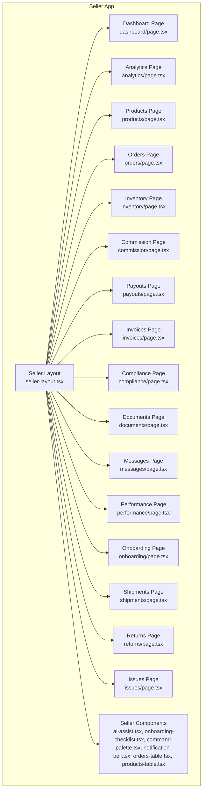

**Diagram sources**
- [apps/seller/src/components/layout/seller-layout.tsx](file://apps/seller/src/components/layout/seller-layout.tsx)
- [apps/seller/src/app/dashboard/page.tsx](file://apps/seller/src/app/dashboard/page.tsx)
- [apps/seller/src/app/analytics/page.tsx](file://apps/seller/src/app/analytics/page.tsx)
- [apps/seller/src/app/products/page.tsx](file://apps/seller/src/app/products/page.tsx)
- [apps/seller/src/app/orders/page.tsx](file://apps/seller/src/app/orders/page.tsx)
- [apps/seller/src/app/inventory/page.tsx](file://apps/seller/src/app/inventory/page.tsx)
- [apps/seller/src/app/commission/page.tsx](file://apps/seller/src/app/commission/page.tsx)
- [apps/seller/src/app/payouts/page.tsx](file://apps/seller/src/app/payouts/page.tsx)
- [apps/seller/src/app/invoices/page.tsx](file://apps/seller/src/app/invoices/page.tsx)
- [apps/seller/src/app/compliance/page.tsx](file://apps/seller/src/app/compliance/page.tsx)
- [apps/seller/src/app/documents/page.tsx](file://apps/seller/src/app/documents/page.tsx)
- [apps/seller/src/app/messages/page.tsx](file://apps/seller/src/app/messages/page.tsx)
- [apps/seller/src/app/performance/page.tsx](file://apps/seller/src/app/performance/page.tsx)
- [apps/seller/src/app/onboarding/page.tsx](file://apps/seller/src/app/onboarding/page.tsx)
- [apps/seller/src/app/shipments/page.tsx](file://apps/seller/src/app/shipments/page.tsx)
- [apps/seller/src/app/returns/page.tsx](file://apps/seller/src/app/returns/page.tsx)
- [apps/seller/src/app/issues/page.tsx](file://apps/seller/src/app/issues/page.tsx)
- [apps/seller/src/components/ai-assist.tsx](file://apps/seller/src/components/ai-assist.tsx)
- [apps/seller/src/components/onboarding-checklist.tsx](file://apps/seller/src/components/onboarding-checklist.tsx)
- [apps/seller/src/components/command-palette.tsx](file://apps/seller/src/components/command-palette.tsx)
- [apps/seller/src/components/notification-bell.tsx](file://apps/seller/src/components/notification-bell.tsx)
- [apps/seller/src/components/orders-table.tsx](file://apps/seller/src/components/orders-table.tsx)
- [apps/seller/src/components/products-table.tsx](file://apps/seller/src/components/products-table.tsx)

**Section sources**
- [apps/seller/src/app/dashboard/page.tsx](file://apps/seller/src/app/dashboard/page.tsx)
- [apps/seller/src/components/layout/seller-layout.tsx](file://apps/seller/src/components/layout/seller-layout.tsx)

## Core Components
- Seller Layout: Provides navigation and shell for the seller app.
- AI Assist: AI-powered assistant integration for copywriting and insights.
- Onboarding Checklist: Guided steps for new sellers.
- Command Palette: Quick-access command interface.
- Notification Bell: Centralized notifications hub.
- Orders Table and Products Table: Data presentation components for actionable views.

These components integrate with the shared UI library and are reused across pages to maintain consistency.

**Section sources**
- [apps/seller/src/components/layout/seller-layout.tsx](file://apps/seller/src/components/layout/seller-layout.tsx)
- [apps/seller/src/components/ai-assist.tsx](file://apps/seller/src/components/ai-assist.tsx)
- [apps/seller/src/components/onboarding-checklist.tsx](file://apps/seller/src/components/onboarding-checklist.tsx)
- [apps/seller/src/components/command-palette.tsx](file://apps/seller/src/components/command-palette.tsx)
- [apps/seller/src/components/notification-bell.tsx](file://apps/seller/src/components/notification-bell.tsx)
- [apps/seller/src/components/orders-table.tsx](file://apps/seller/src/components/orders-table.tsx)
- [apps/seller/src/components/products-table.tsx](file://apps/seller/src/components/products-table.tsx)

## Architecture Overview
The Seller Portal follows a layered architecture:
- Presentation Layer: Next.js app pages and components.
- UI Library Integration: Shared components and layout.
- Authentication: NextAuth integration for seller sessions.
- API Surface: Route handlers under apps/seller/src/app/api and admin APIs for governance and oversight.
- Middleware: Role-aware routing and localization.

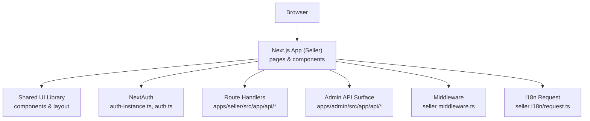

**Diagram sources**
- [apps/seller/src/lib/auth-instance.ts](file://apps/seller/src/lib/auth-instance.ts)
- [apps/seller/src/lib/auth.ts](file://apps/seller/src/lib/auth.ts)
- [apps/seller/src/middleware.ts](file://apps/seller/src/middleware.ts)
- [apps/seller/src/i18n/request.ts](file://apps/seller/src/i18n/request.ts)
- [apps/seller/src/app/api/...](file://apps/seller/src/app/api/ai/draft/route.ts)
- [apps/admin/src/app/api/...](file://apps/admin/src/app/api/admin/dashboard/route.ts)

## Detailed Component Analysis

### Dashboard and Analytics
- Dashboard page renders an Amazon-inspired overview with action cards for key metrics and quick actions.
- Analytics page provides performance insights and KPIs for product and sales performance.

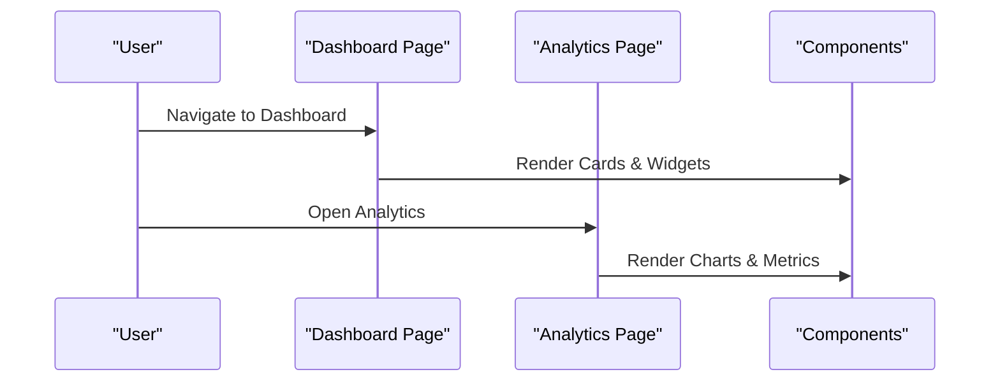

**Diagram sources**
- [apps/seller/src/app/dashboard/page.tsx](file://apps/seller/src/app/dashboard/page.tsx)
- [apps/seller/src/app/analytics/page.tsx](file://apps/seller/src/app/analytics/page.tsx)
- [apps/seller/src/components/...](file://apps/seller/src/components/ai-assist.tsx)

**Section sources**
- [apps/seller/src/app/dashboard/page.tsx](file://apps/seller/src/app/dashboard/page.tsx)
- [apps/seller/src/app/analytics/page.tsx](file://apps/seller/src/app/analytics/page.tsx)

### Product Management
- Products page manages listings, pricing, and analytics.
- Inventory page controls stock levels and health indicators.
- Pricing page supports dynamic pricing strategies.
- Listing health scoring is surfaced via analytics and product tables.

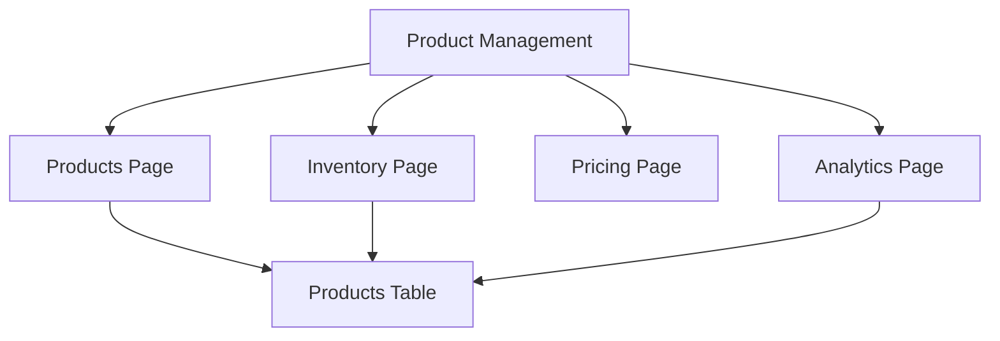

**Diagram sources**
- [apps/seller/src/app/products/page.tsx](file://apps/seller/src/app/products/page.tsx)
- [apps/seller/src/app/inventory/page.tsx](file://apps/seller/src/app/inventory/page.tsx)
- [apps/seller/src/app/analytics/page.tsx](file://apps/seller/src/app/analytics/page.tsx)
- [apps/seller/src/components/products-table.tsx](file://apps/seller/src/components/products-table.tsx)

**Section sources**
- [apps/seller/src/app/products/page.tsx](file://apps/seller/src/app/products/page.tsx)
- [apps/seller/src/app/inventory/page.tsx](file://apps/seller/src/app/inventory/page.tsx)
- [apps/seller/src/app/analytics/page.tsx](file://apps/seller/src/app/analytics/page.tsx)
- [apps/seller/src/components/products-table.tsx](file://apps/seller/src/components/products-table.tsx)

### Order Processing and Returns
- Orders page displays order history and statuses with actionable actions.
- Returns page handles return requests, decisions, and resolutions.
- Shipments page tracks fulfillment and logistics.

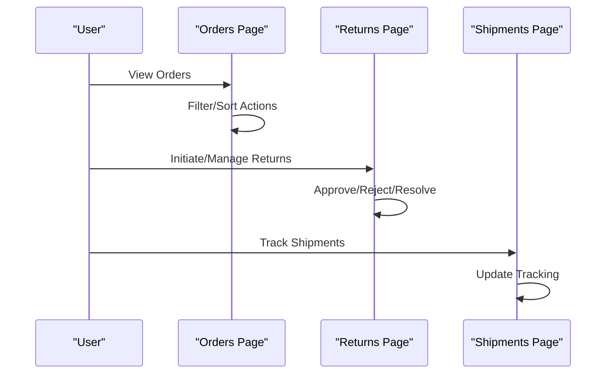

**Diagram sources**
- [apps/seller/src/app/orders/page.tsx](file://apps/seller/src/app/orders/page.tsx)
- [apps/seller/src/app/returns/page.tsx](file://apps/seller/src/app/returns/page.tsx)
- [apps/seller/src/app/shipments/page.tsx](file://apps/seller/src/app/shipments/page.tsx)
- [apps/seller/src/components/orders-table.tsx](file://apps/seller/src/components/orders-table.tsx)

**Section sources**
- [apps/seller/src/app/orders/page.tsx](file://apps/seller/src/app/orders/page.tsx)
- [apps/seller/src/app/returns/page.tsx](file://apps/seller/src/app/returns/page.tsx)
- [apps/seller/src/app/shipments/page.tsx](file://apps/seller/src/app/shipments/page.tsx)
- [apps/seller/src/components/orders-table.tsx](file://apps/seller/src/components/orders-table.tsx)

### Compliance and Documents
- Compliance page centralizes regulatory and listing compliance tasks.
- Documents page aggregates required and submitted compliance materials.

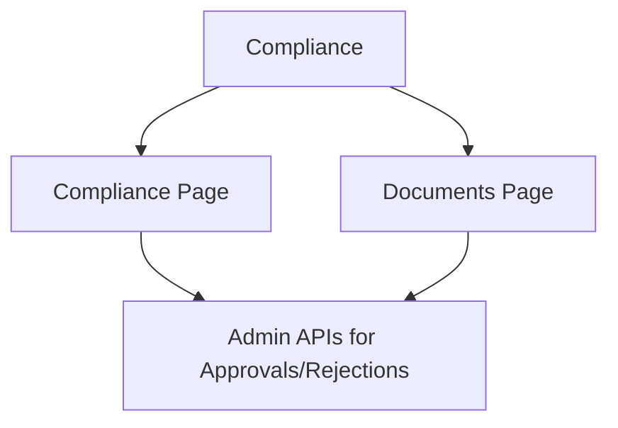

**Diagram sources**
- [apps/seller/src/app/compliance/page.tsx](file://apps/seller/src/app/compliance/page.tsx)
- [apps/seller/src/app/documents/page.tsx](file://apps/seller/src/app/documents/page.tsx)
- [apps/admin/src/app/api/admin/compliance/[id]/approve/route.ts](file://apps/admin/src/app/api/admin/compliance/[id]/approve/route.ts)
- [apps/admin/src/app/api/admin/compliance/[id]/reject/route.ts](file://apps/admin/src/app/api/admin/compliance/[id]/reject/route.ts)

**Section sources**
- [apps/seller/src/app/compliance/page.tsx](file://apps/seller/src/app/compliance/page.tsx)
- [apps/seller/src/app/documents/page.tsx](file://apps/seller/src/app/documents/page.tsx)

### Financial Management
- Commission page tracks earnings and commission calculations.
- Payouts page manages disbursement schedules and statuses.
- Invoices page generates and organizes tax and transactional invoices.

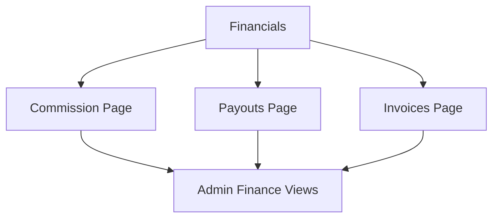

**Diagram sources**
- [apps/seller/src/app/commission/page.tsx](file://apps/seller/src/app/commission/page.tsx)
- [apps/seller/src/app/payouts/page.tsx](file://apps/seller/src/app/payouts/page.tsx)
- [apps/seller/src/app/invoices/page.tsx](file://apps/seller/src/app/invoices/page.tsx)
- [apps/admin/src/app/finance/page.tsx](file://apps/admin/src/app/finance/page.tsx)

**Section sources**
- [apps/seller/src/app/commission/page.tsx](file://apps/seller/src/app/commission/page.tsx)
- [apps/seller/src/app/payouts/page.tsx](file://apps/seller/src/app/payouts/page.tsx)
- [apps/seller/src/app/invoices/page.tsx](file://apps/seller/src/app/invoices/page.tsx)

### Messaging and Performance Analytics
- Messages page provides communication channels with buyers and support.
- Performance page aggregates KPIs and trends for strategic insights.

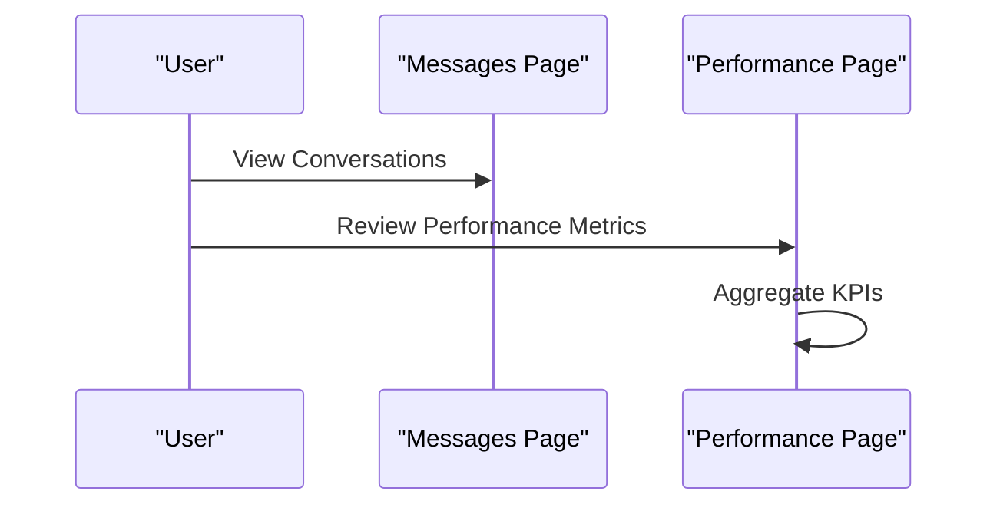

**Diagram sources**
- [apps/seller/src/app/messages/page.tsx](file://apps/seller/src/app/messages/page.tsx)
- [apps/seller/src/app/performance/page.tsx](file://apps/seller/src/app/performance/page.tsx)

**Section sources**
- [apps/seller/src/app/messages/page.tsx](file://apps/seller/src/app/messages/page.tsx)
- [apps/seller/src/app/performance/page.tsx](file://apps/seller/src/app/performance/page.tsx)

### AI-Powered Assistance and Onboarding
- AI Assist integrates AI capabilities for copywriting and insights.
- Onboarding Checklist guides new sellers through essential setup steps.

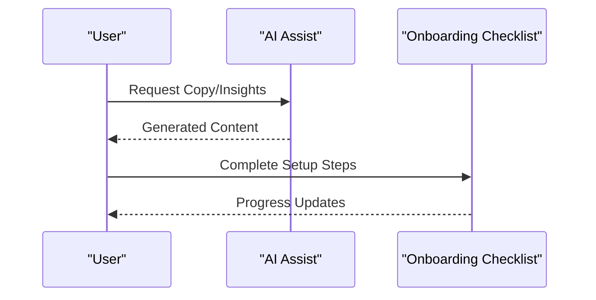

**Diagram sources**
- [apps/seller/src/components/ai-assist.tsx](file://apps/seller/src/components/ai-assist.tsx)
- [apps/seller/src/components/onboarding-checklist.tsx](file://apps/seller/src/components/onboarding-checklist.tsx)

**Section sources**
- [apps/seller/src/components/ai-assist.tsx](file://apps/seller/src/components/ai-assist.tsx)
- [apps/seller/src/components/onboarding-checklist.tsx](file://apps/seller/src/components/onboarding-checklist.tsx)

### Command Palette and Notifications
- Command Palette enables quick navigation and actions.
- Notification Bell centralizes alerts and updates.

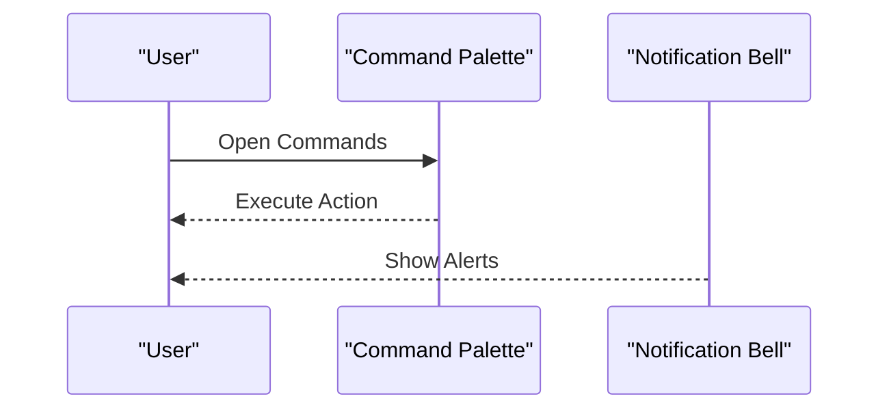

**Diagram sources**
- [apps/seller/src/components/command-palette.tsx](file://apps/seller/src/components/command-palette.tsx)
- [apps/seller/src/components/notification-bell.tsx](file://apps/seller/src/components/notification-bell.tsx)

**Section sources**
- [apps/seller/src/components/command-palette.tsx](file://apps/seller/src/components/command-palette.tsx)
- [apps/seller/src/components/notification-bell.tsx](file://apps/seller/src/components/notification-bell.tsx)

## Dependency Analysis
Key dependencies and integration patterns:
- Authentication: NextAuth integration via auth-instance and auth helpers.
- Localization: i18n request module for locale-aware rendering.
- Middleware: Role-aware routing and session enforcement.
- Admin APIs: Governance endpoints for approvals, compliance, and product moderation.
- Shared UI: Reusable components and layout for consistent UX.

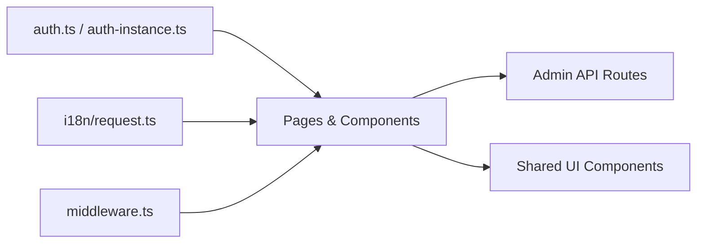

**Diagram sources**
- [apps/seller/src/lib/auth.ts](file://apps/seller/src/lib/auth.ts)
- [apps/seller/src/lib/auth-instance.ts](file://apps/seller/src/lib/auth-instance.ts)
- [apps/seller/src/i18n/request.ts](file://apps/seller/src/i18n/request.ts)
- [apps/seller/src/middleware.ts](file://apps/seller/src/middleware.ts)
- [apps/admin/src/app/api/admin/dashboard/route.ts](file://apps/admin/src/app/api/admin/dashboard/route.ts)

**Section sources**
- [apps/seller/src/lib/auth.ts](file://apps/seller/src/lib/auth.ts)
- [apps/seller/src/lib/auth-instance.ts](file://apps/seller/src/lib/auth-instance.ts)
- [apps/seller/src/i18n/request.ts](file://apps/seller/src/i18n/request.ts)
- [apps/seller/src/middleware.ts](file://apps/seller/src/middleware.ts)

## Performance Considerations
- Use server-side rendering and static generation where appropriate to reduce client load.
- Lazy-load heavy analytics and tables to improve initial render performance.
- Implement pagination and virtualization for large datasets in orders and products tables.
- Optimize image assets and leverage responsive images for product listings.
- Minimize re-renders by structuring components to accept memoized props.

## Troubleshooting Guide
Common issues and remedies:
- Authentication failures: Verify NextAuth configuration and session persistence.
- Navigation errors: Confirm middleware routes and protected pages.
- Localization problems: Ensure i18n request is initialized and messages are present.
- API connectivity: Check route handler paths and CORS settings for cross-app API calls.
- Component rendering: Validate shared UI component imports and prop shapes.

**Section sources**
- [apps/seller/src/lib/auth.ts](file://apps/seller/src/lib/auth.ts)
- [apps/seller/src/middleware.ts](file://apps/seller/src/middleware.ts)
- [apps/seller/src/i18n/request.ts](file://apps/seller/src/i18n/request.ts)

## Conclusion
The Seller Portal delivers a comprehensive, Amazon-inspired dashboard and robust operational workflows for sellers. It integrates AI assistance, onboarding, compliance, financial management, and performance analytics while leveraging shared UI components and secure NextAuth-based authentication. Admin APIs complement seller-facing features to enable governance and oversight.

## Appendices
- Localization: English messages are available for the seller app.
- Admin Integration: Extensive admin routes support approvals, compliance, and financial oversight.

**Section sources**
- [apps/seller/messages/en.json](file://apps/seller/messages/en.json)
- [apps/admin/src/app/api/admin/dashboard/route.ts](file://apps/admin/src/app/api/admin/dashboard/route.ts)