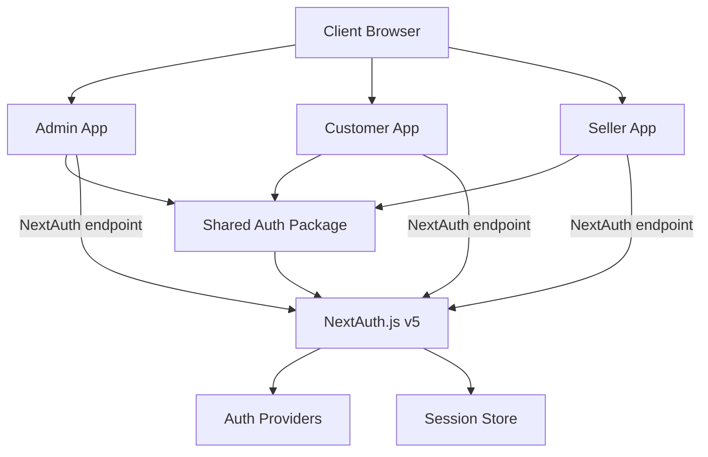
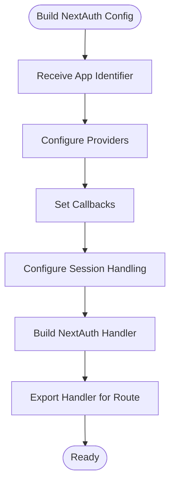
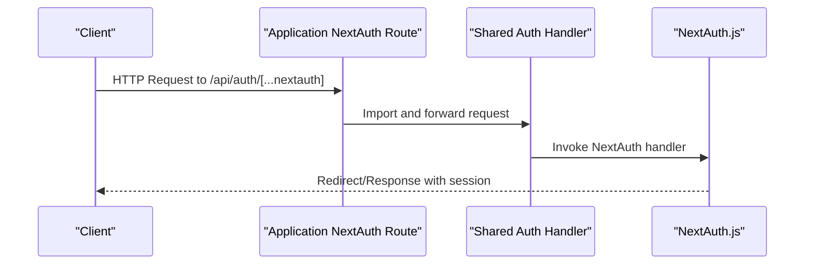
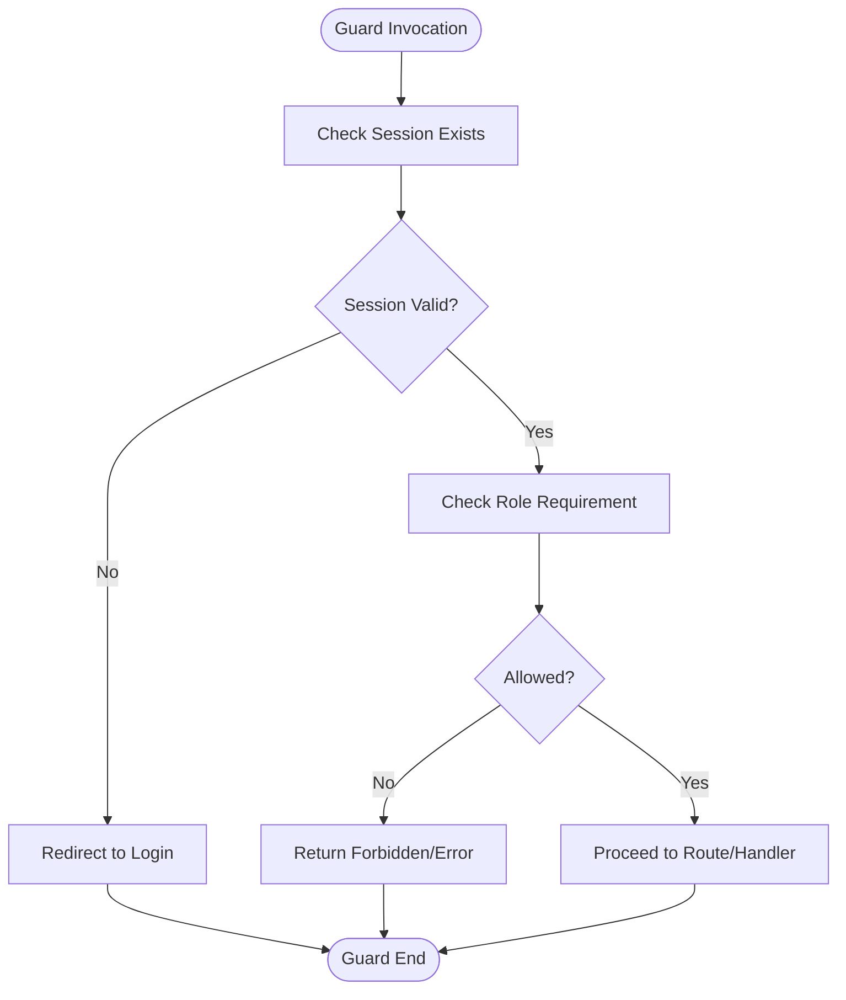
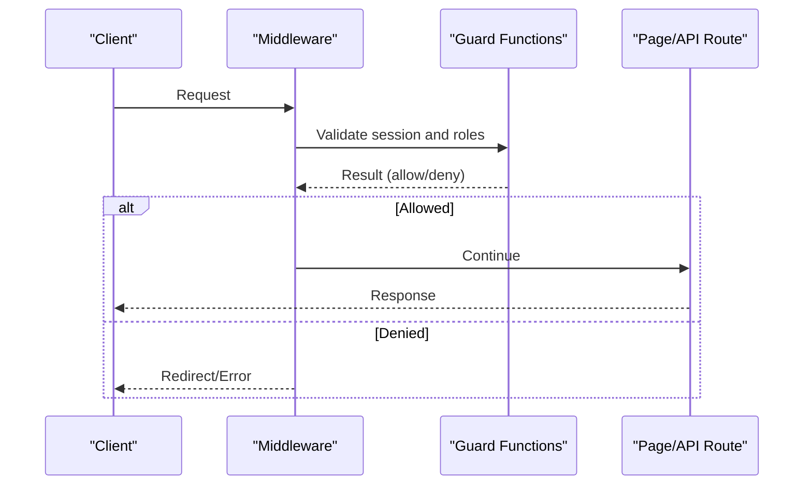
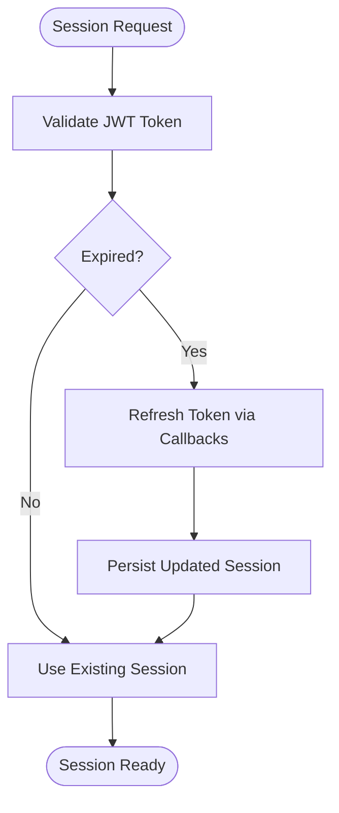
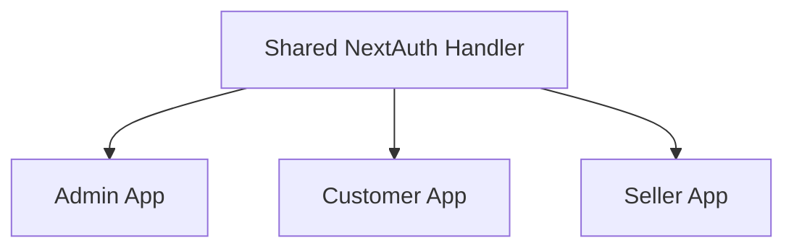
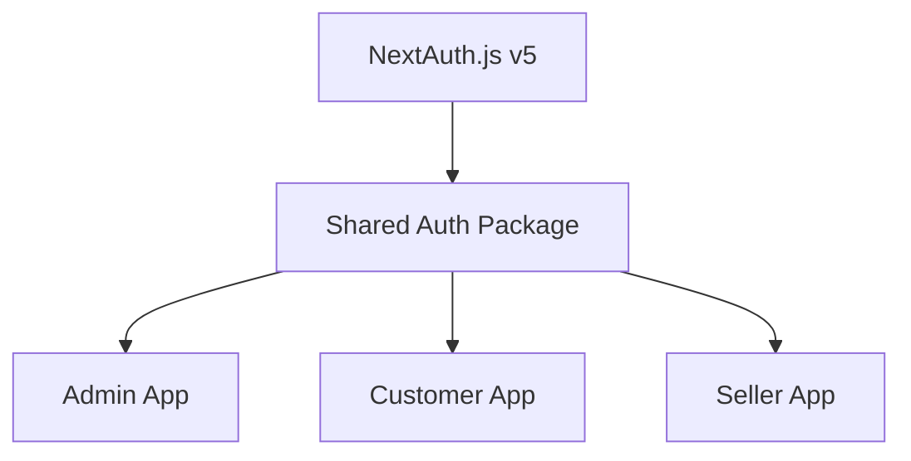

# Authentication Package

<cite>
**Referenced Files in This Document**
- [admin route.ts](file://apps/admin/src/app/api/auth/[...nextauth]/route.ts)
- [customer route.ts](file://apps/customer/src/app/api/auth/[...nextauth]/route.ts)
- [seller route.ts](file://apps/seller/src/app/api/auth/[...nextauth]/route.ts)
- [admin auth-instance.ts](file://apps/admin/src/lib/auth-instance.ts)
- [admin auth.ts](file://apps/admin/src/lib/auth.ts)
- [customer auth-instance.ts](file://apps/customer/src/lib/auth-instance.ts)
- [customer auth.ts](file://apps/customer/src/lib/auth.ts)
- [seller auth-instance.ts](file://apps/seller/src/lib/auth-instance.ts)
- [seller auth.ts](file://apps/seller/src/lib/auth.ts)
- [admin middleware.ts](file://apps/admin/src/middleware.ts)
- [customer middleware.ts](file://apps/customer/src/middleware.ts)
- [seller middleware.ts](file://apps/seller/src/middleware.ts)
- [auth config.ts](file://packages/auth/src/config.ts)
- [auth guards.ts](file://packages/auth/src/guards.ts)
- [auth middleware.ts](file://packages/auth/src/middleware.ts)
- [auth index.ts](file://packages/auth/src/index.ts)
- [admin package.json](file://apps/admin/package.json)
- [customer package.json](file://apps/customer/package.json)
- [seller package.json](file://apps/seller/package.json)
- [auth package.json](file://packages/auth/package.json)
</cite>

## Table of Contents
1. [Introduction](#introduction)
2. [Project Structure](#project-structure)
3. [Core Components](#core-components)
4. [Architecture Overview](#architecture-overview)
5. [Detailed Component Analysis](#detailed-component-analysis)
6. [Dependency Analysis](#dependency-analysis)
7. [Performance Considerations](#performance-considerations)
8. [Troubleshooting Guide](#troubleshooting-guide)
9. [Conclusion](#conclusion)

## Introduction
This document describes the authentication package and integration used across the Avenick Commerce platform. It covers the NextAuth.js v5 configuration, centralized authentication utilities, role-based access control, authentication guards, middleware, and cross-application session sharing among the admin, customer, and seller portals. It also outlines session management, token handling, and security best practices, with practical guidance for extending the system to new applications.

## Project Structure
The authentication system is implemented as a shared package and complemented by per-application configurations and utilities. The structure is organized by application with shared logic in a dedicated package.

```mermaid
graph TB
subgraph "Shared Package"
PkgAuth["packages/auth"]
PkgAuthCfg["packages/auth/src/config.ts"]
PkgAuthGuards["packages/auth/src/guards.ts"]
PkgAuthMW["packages/auth/src/middleware.ts"]
PkgAuthIndex["packages/auth/src/index.ts"]
end
subgraph "Admin Application"
AdminRoute["apps/admin/src/app/api/auth/[...nextauth]/route.ts"]
AdminAuthInstance["apps/admin/src/lib/auth-instance.ts"]
AdminAuthLib["apps/admin/src/lib/auth.ts"]
AdminMW["apps/admin/src/middleware.ts"]
end
subgraph "Customer Application"
CustRoute["apps/customer/src/app/api/auth/[...nextauth]/route.ts"]
CustAuthInstance["apps/customer/src/lib/auth-instance.ts"]
CustAuthLib["apps/customer/src/lib/auth.ts"]
CustMW["apps/customer/src/middleware.ts"]
end
subgraph "Seller Application"
SellRoute["apps/seller/src/app/api/auth/[...nextauth]/route.ts"]
SellAuthInstance["apps/seller/src/lib/auth-instance.ts"]
SellAuthLib["apps/seller/src/lib/auth.ts"]
SellMW["apps/seller/src/middleware.ts"]
end
PkgAuthCfg --> AdminAuthInstance
PkgAuthCfg --> CustAuthInstance
PkgAuthCfg --> SellAuthInstance
PkgAuthGuards --> AdminAuthLib
PkgAuthGuards --> CustAuthLib
PkgAuthGuards --> SellAuthLib
PkgAuthMW --> AdminMW
PkgAuthMW --> CustMW
PkgAuthMW --> SellMW
PkgAuthIndex --> AdminAuthInstance
PkgAuthIndex --> CustAuthInstance
PkgAuthIndex --> SellAuthInstance
AdminRoute --> AdminAuthInstance
CustRoute --> CustAuthInstance
SellRoute --> SellAuthInstance
```

**Diagram sources**
- [auth config.ts:1-120](file://packages/auth/src/config.ts#L1-L120)
- [auth guards.ts:1-120](file://packages/auth/src/guards.ts#L1-L120)
- [auth middleware.ts:1-120](file://packages/auth/src/middleware.ts#L1-L120)
- [auth index.ts:1-120](file://packages/auth/src/index.ts#L1-L120)
- [admin route.ts:1-120](file://apps/admin/src/app/api/auth/[...nextauth]/route.ts#L1-L120)
- [customer route.ts:1-120](file://apps/customer/src/app/api/auth/[...nextauth]/route.ts#L1-L120)
- [seller route.ts:1-120](file://apps/seller/src/app/api/auth/[...nextauth]/route.ts#L1-L120)
- [admin auth-instance.ts:1-120](file://apps/admin/src/lib/auth-instance.ts#L1-L120)
- [customer auth-instance.ts:1-120](file://apps/customer/src/lib/auth-instance.ts#L1-L120)
- [seller auth-instance.ts:1-120](file://apps/seller/src/lib/auth-instance.ts#L1-L120)
- [admin auth.ts:1-120](file://apps/admin/src/lib/auth.ts#L1-L120)
- [customer auth.ts:1-120](file://apps/customer/src/lib/auth.ts#L1-L120)
- [seller auth.ts:1-120](file://apps/seller/src/lib/auth.ts#L1-L120)
- [admin middleware.ts:1-120](file://apps/admin/src/middleware.ts#L1-L120)
- [customer middleware.ts:1-120](file://apps/customer/src/middleware.ts#L1-L120)
- [seller middleware.ts:1-120](file://apps/seller/src/middleware.ts#L1-L120)

**Section sources**
- [admin route.ts:1-120](file://apps/admin/src/app/api/auth/[...nextauth]/route.ts#L1-L120)
- [customer route.ts:1-120](file://apps/customer/src/app/api/auth/[...nextauth]/route.ts#L1-L120)
- [seller route.ts:1-120](file://apps/seller/src/app/api/auth/[...nextauth]/route.ts#L1-L120)
- [admin auth-instance.ts:1-120](file://apps/admin/src/lib/auth-instance.ts#L1-L120)
- [customer auth-instance.ts:1-120](file://apps/customer/src/lib/auth-instance.ts#L1-L120)
- [seller auth-instance.ts:1-120](file://apps/seller/src/lib/auth-instance.ts#L1-L120)
- [admin auth.ts:1-120](file://apps/admin/src/lib/auth.ts#L1-L120)
- [customer auth.ts:1-120](file://apps/customer/src/lib/auth.ts#L1-L120)
- [seller auth.ts:1-120](file://apps/seller/src/lib/auth.ts#L1-L120)
- [admin middleware.ts:1-120](file://apps/admin/src/middleware.ts#L1-L120)
- [customer middleware.ts:1-120](file://apps/customer/src/middleware.ts#L1-L120)
- [seller middleware.ts:1-120](file://apps/seller/src/middleware.ts#L1-L120)
- [auth config.ts:1-120](file://packages/auth/src/config.ts#L1-L120)
- [auth guards.ts:1-120](file://packages/auth/src/guards.ts#L1-L120)
- [auth middleware.ts:1-120](file://packages/auth/src/middleware.ts#L1-L120)
- [auth index.ts:1-120](file://packages/auth/src/index.ts#L1-L120)

## Core Components
- Centralized NextAuth configuration builder: constructs provider-specific configurations and returns a NextAuth handler tailored to each application.
- Authentication guards: enforce role-based access control and session validation for protected routes and API handlers.
- Middleware: applies route-based protection and session enforcement across applications.
- Shared authentication utilities: provide consistent session retrieval, guard invocation, and NextAuth handler exposure across portals.
- Application-specific NextAuth endpoints: expose the NextAuth handler under a catch-all route per application.

Key responsibilities:
- Provider configuration and session management via NextAuth.js v5.
- Role-based routing and API protection using shared guards.
- Cross-application session sharing through a unified NextAuth setup pattern.
- Security posture via session serialization, token handling, and middleware enforcement.

**Section sources**
- [auth config.ts:1-120](file://packages/auth/src/config.ts#L1-L120)
- [auth guards.ts:1-120](file://packages/auth/src/guards.ts#L1-L120)
- [auth middleware.ts:1-120](file://packages/auth/src/middleware.ts#L1-L120)
- [auth index.ts:1-120](file://packages/auth/src/index.ts#L1-L120)
- [admin auth.ts:1-120](file://apps/admin/src/lib/auth.ts#L1-L120)
- [customer auth.ts:1-120](file://apps/customer/src/lib/auth.ts#L1-L120)
- [seller auth.ts:1-120](file://apps/seller/src/lib/auth.ts#L1-L120)

## Architecture Overview
The authentication architecture centers on a shared package that builds NextAuth configurations and exposes guards and middleware. Each application registers a NextAuth endpoint and consumes shared utilities for session enforcement and role checks.

**Diagram sources**
- [auth config.ts:1-120](file://packages/auth/src/config.ts#L1-L120)
- [auth guards.ts:1-120](file://packages/auth/src/guards.ts#L1-L120)
- [auth middleware.ts:1-120](file://packages/auth/src/middleware.ts#L1-L120)
- [admin route.ts:1-120](file://apps/admin/src/app/api/auth/[...nextauth]/route.ts#L1-L120)
- [customer route.ts:1-120](file://apps/customer/src/app/api/auth/[...nextauth]/route.ts#L1-L120)
- [seller route.ts:1-120](file://apps/seller/src/app/api/auth/[...nextauth]/route.ts#L1-L120)

## Detailed Component Analysis

### Centralized NextAuth Configuration Builder
The shared configuration builder constructs a NextAuthConfig tailored to each application. It sets up providers, callbacks, and session handling, returning a NextAuth handler that is exported by each application’s NextAuth route.

Implementation highlights:
- Accepts an application identifier to customize provider and callback behavior.
- Returns a NextAuth handler configured with credentials provider and application-specific settings.
- Exposes the handler via a named export for use in application routes.

**Diagram sources**
- [auth config.ts:1-120](file://packages/auth/src/config.ts#L1-L120)

**Section sources**
- [auth config.ts:1-120](file://packages/auth/src/config.ts#L1-L120)

### Application-Specific NextAuth Routes
Each application exposes a NextAuth route that imports the shared handler and forwards incoming requests to NextAuth. This ensures consistent behavior while allowing per-app customization through the shared configuration builder.

**Diagram sources**
- [admin route.ts:1-120](file://apps/admin/src/app/api/auth/[...nextauth]/route.ts#L1-L120)
- [customer route.ts:1-120](file://apps/customer/src/app/api/auth/[...nextauth]/route.ts#L1-L120)
- [seller route.ts:1-120](file://apps/seller/src/app/api/auth/[...nextauth]/route.ts#L1-L120)
- [auth index.ts:1-120](file://packages/auth/src/index.ts#L1-L120)

**Section sources**
- [admin route.ts:1-120](file://apps/admin/src/app/api/auth/[...nextauth]/route.ts#L1-L120)
- [customer route.ts:1-120](file://apps/customer/src/app/api/auth/[...nextauth]/route.ts#L1-L120)
- [seller route.ts:1-120](file://apps/seller/src/app/api/auth/[...nextauth]/route.ts#L1-L120)
- [auth index.ts:1-120](file://packages/auth/src/index.ts#L1-L120)

### Authentication Guards and Role-Based Access Control
The shared guards module provides functions to validate sessions and enforce role-based access control. Applications import these guards to protect pages and API routes.

Guard responsibilities:
- Validate presence and freshness of session.
- Enforce role-based restrictions (e.g., admin-only routes).
- Provide consistent error handling and redirect behavior.

**Diagram sources**
- [auth guards.ts:1-120](file://packages/auth/src/guards.ts#L1-L120)
- [admin auth.ts:1-120](file://apps/admin/src/lib/auth.ts#L1-L120)
- [customer auth.ts:1-120](file://apps/customer/src/lib/auth.ts#L1-L120)
- [seller auth.ts:1-120](file://apps/seller/src/lib/auth.ts#L1-L120)

**Section sources**
- [auth guards.ts:1-120](file://packages/auth/src/guards.ts#L1-L120)
- [admin auth.ts:1-120](file://apps/admin/src/lib/auth.ts#L1-L120)
- [customer auth.ts:1-120](file://apps/customer/src/lib/auth.ts#L1-L120)
- [seller auth.ts:1-120](file://apps/seller/src/lib/auth.ts#L1-L120)

### Middleware Implementation
Middleware applies session enforcement and optional role checks at the route level. It runs before page rendering or API execution, ensuring protected resources remain inaccessible without a valid session.

Middleware responsibilities:
- Extract session from cookies or headers.
- Validate session and redirect unauthenticated users.
- Optionally enforce role-based restrictions.
- Allow or block request progression.

**Diagram sources**
- [auth middleware.ts:1-120](file://packages/auth/src/middleware.ts#L1-L120)
- [admin middleware.ts:1-120](file://apps/admin/src/middleware.ts#L1-L120)
- [customer middleware.ts:1-120](file://apps/customer/src/middleware.ts#L1-L120)
- [seller middleware.ts:1-120](file://apps/seller/src/middleware.ts#L1-L120)

**Section sources**
- [auth middleware.ts:1-120](file://packages/auth/src/middleware.ts#L1-L120)
- [admin middleware.ts:1-120](file://apps/admin/src/middleware.ts#L1-L120)
- [customer middleware.ts:1-120](file://apps/customer/src/middleware.ts#L1-L120)
- [seller middleware.ts:1-120](file://apps/seller/src/middleware.ts#L1-L120)

### Session Management and Token Handling
Session management is handled centrally by NextAuth.js v5. The shared configuration defines session behavior, callbacks, and token handling. Applications rely on the shared handler to maintain consistent session semantics across portals.

Key aspects:
- Session storage and serialization are configured in the shared builder.
- Token refresh and expiration policies are enforced by NextAuth.
- Cross-application session sharing is achieved by aligning provider and session settings.

**Diagram sources**
- [auth config.ts:1-120](file://packages/auth/src/config.ts#L1-L120)

**Section sources**
- [auth config.ts:1-120](file://packages/auth/src/config.ts#L1-L120)

### Multi-Application Authentication Sharing
All three applications share the same authentication domain and provider configuration through the shared package. This enables seamless cross-application session sharing and consistent user experiences across admin, customer, and seller portals.

Implementation pattern:
- Each app imports the shared NextAuth handler.
- The shared handler is built with a configuration that supports cross-application session continuity.
- Guards and middleware are consistently applied across apps.

**Diagram sources**
- [auth index.ts:1-120](file://packages/auth/src/index.ts#L1-L120)
- [admin auth-instance.ts:1-120](file://apps/admin/src/lib/auth-instance.ts#L1-L120)
- [customer auth-instance.ts:1-120](file://apps/customer/src/lib/auth-instance.ts#L1-L120)
- [seller auth-instance.ts:1-120](file://apps/seller/src/lib/auth-instance.ts#L1-L120)

**Section sources**
- [auth index.ts:1-120](file://packages/auth/src/index.ts#L1-L120)
- [admin auth-instance.ts:1-120](file://apps/admin/src/lib/auth-instance.ts#L1-L120)
- [customer auth-instance.ts:1-120](file://apps/customer/src/lib/auth-instance.ts#L1-L120)
- [seller auth-instance.ts:1-120](file://apps/seller/src/lib/auth-instance.ts#L1-L120)

### Practical Examples and Extensibility
- Implementing authentication guards:
  - Import guard functions from the shared library.
  - Apply guards to protected pages and API routes to enforce session and role checks.
- Customizing authentication flows:
  - Extend the shared configuration builder to add new providers or adjust callbacks per application.
  - Modify the handler export to incorporate application-specific logic.
- Extending the authentication system for new applications:
  - Add a new NextAuth route under the application’s API surface.
  - Import and export the shared handler.
  - Integrate guards and middleware as needed.

**Section sources**
- [auth guards.ts:1-120](file://packages/auth/src/guards.ts#L1-L120)
- [auth middleware.ts:1-120](file://packages/auth/src/middleware.ts#L1-L120)
- [auth config.ts:1-120](file://packages/auth/src/config.ts#L1-L120)
- [auth index.ts:1-120](file://packages/auth/src/index.ts#L1-L120)

## Dependency Analysis
The authentication system exhibits low coupling and high cohesion:
- Shared package encapsulates NextAuth configuration, guards, and middleware.
- Applications depend on the shared package but remain decoupled from each other.
- Dependencies are primarily runtime (NextAuth.js) and compile-time (shared package exports).

**Diagram sources**
- [auth config.ts:1-120](file://packages/auth/src/config.ts#L1-L120)
- [auth guards.ts:1-120](file://packages/auth/src/guards.ts#L1-L120)
- [auth middleware.ts:1-120](file://packages/auth/src/middleware.ts#L1-L120)
- [admin package.json:1-120](file://apps/admin/package.json#L1-L120)
- [customer package.json:1-120](file://apps/customer/package.json#L1-L120)
- [seller package.json:1-120](file://apps/seller/package.json#L1-L120)
- [auth package.json:1-120](file://packages/auth/package.json#L1-L120)

**Section sources**
- [auth config.ts:1-120](file://packages/auth/src/config.ts#L1-L120)
- [auth guards.ts:1-120](file://packages/auth/src/guards.ts#L1-L120)
- [auth middleware.ts:1-120](file://packages/auth/src/middleware.ts#L1-L120)
- [admin package.json:1-120](file://apps/admin/package.json#L1-L120)
- [customer package.json:1-120](file://apps/customer/package.json#L1-L120)
- [seller package.json:1-120](file://apps/seller/package.json#L1-L120)
- [auth package.json:1-120](file://packages/auth/package.json#L1-L120)

## Performance Considerations
- Minimize session reads by caching validated sessions in memory where appropriate.
- Use efficient guard checks and avoid redundant database lookups during middleware.
- Keep provider configurations lean and avoid heavy computations in callbacks.
- Ensure token size remains small to reduce cookie overhead.

## Troubleshooting Guide
Common issues and resolutions:
- Session not persisting across applications:
  - Verify shared NextAuth configuration and handler exports are aligned across apps.
  - Confirm provider settings and session serialization are consistent.
- Guards not enforcing properly:
  - Ensure guards are imported and invoked before route execution.
  - Check middleware order and precedence.
- NextAuth endpoint not responding:
  - Confirm the application NextAuth route imports and forwards to the shared handler.
  - Validate that the handler is exported correctly from the shared package.

**Section sources**
- [auth config.ts:1-120](file://packages/auth/src/config.ts#L1-L120)
- [auth guards.ts:1-120](file://packages/auth/src/guards.ts#L1-L120)
- [auth middleware.ts:1-120](file://packages/auth/src/middleware.ts#L1-L120)
- [admin route.ts:1-120](file://apps/admin/src/app/api/auth/[...nextauth]/route.ts#L1-L120)
- [customer route.ts:1-120](file://apps/customer/src/app/api/auth/[...nextauth]/route.ts#L1-L120)
- [seller route.ts:1-120](file://apps/seller/src/app/api/auth/[...nextauth]/route.ts#L1-L120)

## Conclusion
The Avenick Commerce authentication system leverages a shared NextAuth.js v5 package to deliver consistent, secure, and extensible authentication across the admin, customer, and seller portals. Through centralized configuration, guards, and middleware, the system enforces role-based access control, manages sessions effectively, and supports cross-application session sharing. The documented patterns enable straightforward extension to new applications and maintenance of a robust security posture.