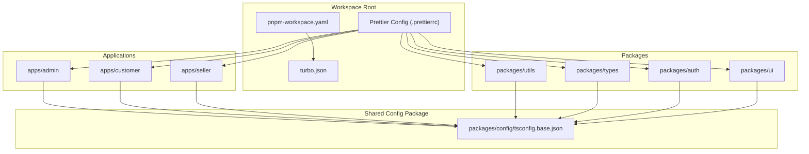
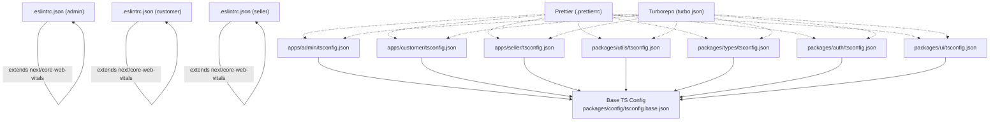
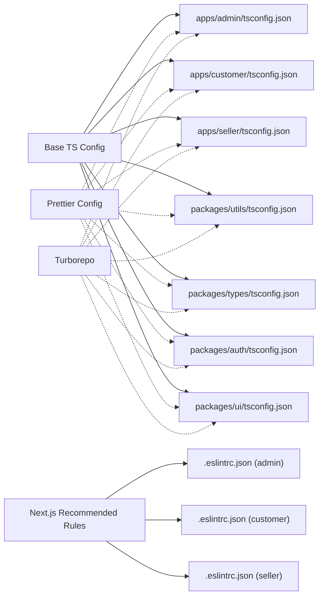

# Configuration Standards

<cite>
**Referenced Files in This Document**
- [turbo.json](file://turbo.json)
- [pnpm-workspace.yaml](file://pnpm-workspace.yaml)
- [.prettierrc](file://.prettierrc)
- [apps/admin/.eslintrc.json](file://apps/admin/.eslintrc.json)
- [apps/customer/.eslintrc.json](file://apps/customer/.eslintrc.json)
- [apps/seller/.eslintrc.json](file://apps/seller/.eslintrc.json)
- [apps/admin/tsconfig.json](file://apps/admin/tsconfig.json)
- [apps/customer/tsconfig.json](file://apps/customer/tsconfig.json)
- [apps/seller/tsconfig.json](file://apps/seller/tsconfig.json)
- [packages/utils/tsconfig.json](file://packages/utils/tsconfig.json)
- [packages/types/tsconfig.json](file://packages/types/tsconfig.json)
- [packages/auth/tsconfig.json](file://packages/auth/tsconfig.json)
- [packages/ui/tsconfig.json](file://packages/ui/tsconfig.json)
- [packages/config/tsconfig.base.json](file://packages/config/tsconfig.base.json)
</cite>

## Table of Contents
1. [Introduction](#introduction)
2. [Project Structure](#project-structure)
3. [Core Components](#core-components)
4. [Architecture Overview](#architecture-overview)
5. [Detailed Component Analysis](#detailed-component-analysis)
6. [Dependency Analysis](#dependency-analysis)
7. [Performance Considerations](#performance-considerations)
8. [Troubleshooting Guide](#troubleshooting-guide)
9. [Conclusion](#conclusion)
10. [Appendices](#appendices)

## Introduction
This document defines the configuration standards for Avenick Commerce’s monorepo, focusing on shared development configurations, linting rules, and coding standards. It explains how TypeScript configurations are centralized and inherited, how ESLint is configured for Next.js applications, and how formatting and caching policies are enforced. It also covers environment variable standards, development workflow optimization, and integration points with CI/CD pipelines and pre-commit hooks. Practical guidance is included for customizing configurations, adding new lint rules, and maintaining consistency across applications.

## Project Structure
The monorepo uses a workspace manager and a shared configuration package to enforce consistent tooling across applications and packages. The key configuration touchpoints are:
- Shared base TypeScript configuration in the packages/config directory
- Application-specific TypeScript configurations extending the base
- Package-specific TypeScript configurations extending shared presets
- Application-level ESLint configurations extending Next.js recommended rules
- Formatting policy via Prettier
- Workspace and build orchestration via Turborepo

**Diagram sources**
- [pnpm-workspace.yaml](file://pnpm-workspace.yaml)
- [turbo.json](file://turbo.json)
- [.prettierrc](file://.prettierrc)
- [packages/config/tsconfig.base.json](file://packages/config/tsconfig.base.json)
- [apps/admin/tsconfig.json](file://apps/admin/tsconfig.json)
- [apps/customer/tsconfig.json](file://apps/customer/tsconfig.json)
- [apps/seller/tsconfig.json](file://apps/seller/tsconfig.json)
- [packages/utils/tsconfig.json](file://packages/utils/tsconfig.json)
- [packages/types/tsconfig.json](file://packages/types/tsconfig.json)
- [packages/auth/tsconfig.json](file://packages/auth/tsconfig.json)
- [packages/ui/tsconfig.json](file://packages/ui/tsconfig.json)

**Section sources**
- [pnpm-workspace.yaml](file://pnpm-workspace.yaml)
- [turbo.json](file://turbo.json)
- [.prettierrc](file://.prettierrc)
- [packages/config/tsconfig.base.json](file://packages/config/tsconfig.base.json)

## Core Components
- Shared base TypeScript configuration: Centralized compiler options and module resolution used by all applications and packages.
- Application TypeScript configurations: Extend the base and enable Next.js plugin and path aliases.
- Package TypeScript configurations: Extend shared presets or the base configuration depending on the package’s purpose.
- ESLint configurations: Extend Next.js core-web-vitals and apply per-app overrides.
- Formatting policy: Enforced via Prettier configuration at the repository root.
- Build and cache orchestration: Managed by Turborepo to optimize incremental builds and caching.

**Section sources**
- [packages/config/tsconfig.base.json](file://packages/config/tsconfig.base.json)
- [apps/admin/tsconfig.json](file://apps/admin/tsconfig.json)
- [apps/customer/tsconfig.json](file://apps/customer/tsconfig.json)
- [apps/seller/tsconfig.json](file://apps/seller/tsconfig.json)
- [packages/utils/tsconfig.json](file://packages/utils/tsconfig.json)
- [packages/types/tsconfig.json](file://packages/types/tsconfig.json)
- [packages/auth/tsconfig.json](file://packages/auth/tsconfig.json)
- [packages/ui/tsconfig.json](file://packages/ui/tsconfig.json)
- [apps/admin/.eslintrc.json](file://apps/admin/.eslintrc.json)
- [apps/customer/.eslintrc.json](file://apps/customer/.eslintrc.json)
- [apps/seller/.eslintrc.json](file://apps/seller/.eslintrc.json)
- [.prettierrc](file://.prettierrc)
- [turbo.json](file://turbo.json)

## Architecture Overview
The configuration architecture ensures consistency and minimal duplication:
- Applications inherit a common TypeScript base and enable Next.js specifics.
- Packages inherit either the shared preset or the base TS config depending on their role.
- ESLint extends Next.js recommended rules with per-app exceptions.
- Formatting is standardized via Prettier.
- Turborepo orchestrates caching and incremental builds across the monorepo.

**Diagram sources**
- [packages/config/tsconfig.base.json](file://packages/config/tsconfig.base.json)
- [apps/admin/tsconfig.json](file://apps/admin/tsconfig.json)
- [apps/customer/tsconfig.json](file://apps/customer/tsconfig.json)
- [apps/seller/tsconfig.json](file://apps/seller/tsconfig.json)
- [packages/utils/tsconfig.json](file://packages/utils/tsconfig.json)
- [packages/types/tsconfig.json](file://packages/types/tsconfig.json)
- [packages/auth/tsconfig.json](file://packages/auth/tsconfig.json)
- [packages/ui/tsconfig.json](file://packages/ui/tsconfig.json)
- [apps/admin/.eslintrc.json](file://apps/admin/.eslintrc.json)
- [apps/customer/.eslintrc.json](file://apps/customer/.eslintrc.json)
- [apps/seller/.eslintrc.json](file://apps/seller/.eslintrc.json)
- [.prettierrc](file://.prettierrc)
- [turbo.json](file://turbo.json)

## Detailed Component Analysis

### Shared Base TypeScript Configuration
The base TypeScript configuration centralizes compiler options and module resolution:
- Targets modern JavaScript environments while enabling strictness and incremental compilation.
- Uses bundler module resolution and isolated modules for improved reliability.
- Disables certain strictness features to balance safety and developer ergonomics.
- Excludes node_modules globally.

Key characteristics:
- Module resolution: bundler
- JSX handling: preserve
- Strictness: enabled with selected relaxations
- Incremental builds: enabled
- Isolated modules: enabled
- JSON module resolution: enabled
- Allow JS: disabled

Practical implications:
- Ensures consistent transpile targets and module resolution across all projects.
- Reduces build inconsistencies by enforcing identical compiler options.

**Section sources**
- [packages/config/tsconfig.base.json](file://packages/config/tsconfig.base.json)

### Application TypeScript Configurations (Next.js Apps)
Each Next.js application extends the base configuration and adds:
- Next.js plugin activation
- Path aliasing (@/* -> ./src/*)
- No emit for development
- Inclusion of generated Next.js types

Implications:
- Uniform Next.js behavior across admin, customer, and seller apps.
- Consistent path mapping simplifies imports.
- Development builds remain fast with no emit.

**Section sources**
- [apps/admin/tsconfig.json](file://apps/admin/tsconfig.json)
- [apps/customer/tsconfig.json](file://apps/customer/tsconfig.json)
- [apps/seller/tsconfig.json](file://apps/seller/tsconfig.json)

### Package TypeScript Configurations
Packages inherit either:
- The shared preset for libraries (e.g., @avenick/config/typescript) via a dedicated field in tsconfig.json
- Or the base configuration directly

Examples:
- packages/utils, packages/types, packages/auth: extend the shared preset and set composite builds for efficient builds.
- packages/ui: extends the base configuration and sets JSX handling for React.

Best practices:
- Use composite builds for packages intended to be built as part of the monorepo.
- Keep package configs minimal and rely on shared presets for consistency.

**Section sources**
- [packages/utils/tsconfig.json](file://packages/utils/tsconfig.json)
- [packages/types/tsconfig.json](file://packages/types/tsconfig.json)
- [packages/auth/tsconfig.json](file://packages/auth/tsconfig.json)
- [packages/ui/tsconfig.json](file://packages/ui/tsconfig.json)

### ESLint Configuration for Next.js Applications
All applications extend the Next.js recommended configuration and apply targeted overrides:
- Disables specific rules that are intentionally relaxed in the monorepo.
- Maintains core web vitals and accessibility recommendations.

Customization pattern:
- Add or override rules per application in the .eslintrc.json file located under each app.
- Keep overrides minimal and documented.

**Section sources**
- [apps/admin/.eslintrc.json](file://apps/admin/.eslintrc.json)
- [apps/customer/.eslintrc.json](file://apps/customer/.eslintrc.json)
- [apps/seller/.eslintrc.json](file://apps/seller/.eslintrc.json)

### Formatting Policy (Prettier)
Formatting is enforced via a single Prettier configuration at the repository root. This ensures:
- Consistent code style across all applications and packages.
- Deterministic formatting in local and CI environments.

Integration:
- Run formatting as part of pre-commit hooks and CI checks.
- Keep the configuration minimal to avoid bikeshedding.

**Section sources**
- [.prettierrc](file://.prettierrc)

### Environment Variable Standards
Environment variables are managed centrally and validated consistently:
- Define environment variables in each application’s deployment configuration.
- Use consistent naming and grouping across admin, customer, and seller apps.
- Validate required variables during build and runtime.

Note: Specific environment variable schemas are not present in the provided files. Maintain a shared schema or validation layer in a package if needed.

[No sources needed since this section does not analyze specific files]

### Development Workflow Optimization
- Use Turborepo to cache and incrementally rebuild only affected tasks.
- Keep TypeScript configurations aligned to minimize recompilation cascades.
- Prefer shared presets for packages to reduce divergence.

**Section sources**
- [turbo.json](file://turbo.json)

### CI/CD and Pre-commit Hooks Integration
- Linting and formatting checks should run in CI to prevent low-quality changes.
- Pre-commit hooks can run formatting and linting locally to catch issues early.
- Cache artifacts in CI to speed up subsequent runs.

[No sources needed since this section does not analyze specific files]

## Dependency Analysis
The configuration dependencies form a layered hierarchy:
- Applications depend on the base TS configuration.
- Packages depend on either the shared preset or the base TS configuration.
- ESLint configurations depend on Next.js recommended rules.
- Formatting depends on Prettier configuration.
- Turborepo orchestrates caching and incremental builds.

**Diagram sources**
- [packages/config/tsconfig.base.json](file://packages/config/tsconfig.base.json)
- [apps/admin/tsconfig.json](file://apps/admin/tsconfig.json)
- [apps/customer/tsconfig.json](file://apps/customer/tsconfig.json)
- [apps/seller/tsconfig.json](file://apps/seller/tsconfig.json)
- [packages/utils/tsconfig.json](file://packages/utils/tsconfig.json)
- [packages/types/tsconfig.json](file://packages/types/tsconfig.json)
- [packages/auth/tsconfig.json](file://packages/auth/tsconfig.json)
- [packages/ui/tsconfig.json](file://packages/ui/tsconfig.json)
- [apps/admin/.eslintrc.json](file://apps/admin/.eslintrc.json)
- [apps/customer/.eslintrc.json](file://apps/customer/.eslintrc.json)
- [apps/seller/.eslintrc.json](file://apps/seller/.eslintrc.json)
- [.prettierrc](file://.prettierrc)
- [turbo.json](file://turbo.json)

**Section sources**
- [packages/config/tsconfig.base.json](file://packages/config/tsconfig.base.json)
- [apps/admin/tsconfig.json](file://apps/admin/tsconfig.json)
- [apps/customer/tsconfig.json](file://apps/customer/tsconfig.json)
- [apps/seller/tsconfig.json](file://apps/seller/tsconfig.json)
- [packages/utils/tsconfig.json](file://packages/utils/tsconfig.json)
- [packages/types/tsconfig.json](file://packages/types/tsconfig.json)
- [packages/auth/tsconfig.json](file://packages/auth/tsconfig.json)
- [packages/ui/tsconfig.json](file://packages/ui/tsconfig.json)
- [apps/admin/.eslintrc.json](file://apps/admin/.eslintrc.json)
- [apps/customer/.eslintrc.json](file://apps/customer/.eslintrc.json)
- [apps/seller/.eslintrc.json](file://apps/seller/.eslintrc.json)
- [.prettierrc](file://.prettierrc)
- [turbo.json](file://turbo.json)

## Performance Considerations
- Incremental builds: Enabled via the base TS configuration and Turborepo caching.
- Isolated modules: Improves reliability and speeds up type checking.
- Bundler module resolution: Aligns with Next.js toolchain for optimal performance.
- Composite builds for packages: Reduces rebuild time for library packages.

[No sources needed since this section provides general guidance]

## Troubleshooting Guide
Common issues and resolutions:
- TypeScript errors after adding a new package:
  - Ensure the package extends the correct preset or base configuration.
  - Verify composite builds are enabled for packages intended to be built as libraries.
- ESLint violations in CI but not locally:
  - Confirm ESLint extends the Next.js recommended rules and that overrides are consistent across apps.
  - Re-run linting with the same version as CI.
- Formatting differences across contributors:
  - Run the repository’s Prettier configuration locally and ensure pre-commit hooks enforce formatting.
- Slow builds:
  - Verify Turborepo cache is enabled and working.
  - Keep TypeScript configurations aligned to minimize rebuild cascades.

**Section sources**
- [packages/config/tsconfig.base.json](file://packages/config/tsconfig.base.json)
- [apps/admin/.eslintrc.json](file://apps/admin/.eslintrc.json)
- [apps/customer/.eslintrc.json](file://apps/customer/.eslintrc.json)
- [apps/seller/.eslintrc.json](file://apps/seller/.eslintrc.json)
- [.prettierrc](file://.prettierrc)
- [turbo.json](file://turbo.json)

## Conclusion
Avenick Commerce’s configuration standards provide a robust, scalable foundation for consistent development across the monorepo. By centralizing TypeScript configuration, standardizing ESLint rules, enforcing formatting, and leveraging Turborepo for caching, teams can maintain high code quality while optimizing development velocity. Adhering to these standards and following the customization and maintenance procedures outlined here ensures long-term consistency and reliability.

[No sources needed since this section summarizes without analyzing specific files]

## Appendices

### Practical Examples and Procedures

- Customizing ESLint rules per application:
  - Modify the application’s .eslintrc.json to add or adjust rules while keeping the extends intact.
  - Example reference: [apps/admin/.eslintrc.json](file://apps/admin/.eslintrc.json)
  - Example reference: [apps/customer/.eslintrc.json](file://apps/customer/.eslintrc.json)
  - Example reference: [apps/seller/.eslintrc.json](file://apps/seller/.eslintrc.json)

- Adding a new package with a shared preset:
  - Set the package’s tsconfig.json to extend the shared preset.
  - Enable composite builds if the package is a library.
  - Example reference: [packages/utils/tsconfig.json](file://packages/utils/tsconfig.json)
  - Example reference: [packages/types/tsconfig.json](file://packages/types/tsconfig.json)
  - Example reference: [packages/auth/tsconfig.json](file://packages/auth/tsconfig.json)

- Extending the base configuration for a new application:
  - Extend the base TS config and add Next.js plugin, path aliases, and dev no-emit settings.
  - Example reference: [apps/admin/tsconfig.json](file://apps/admin/tsconfig.json)
  - Example reference: [apps/customer/tsconfig.json](file://apps/customer/tsconfig.json)
  - Example reference: [apps/seller/tsconfig.json](file://apps/seller/tsconfig.json)

- Maintaining consistency across applications:
  - Keep shared TS options in the base configuration.
  - Standardize ESLint overrides to a minimum set per app.
  - Enforce Prettier formatting via pre-commit hooks and CI checks.

[No sources needed since this section provides general guidance]