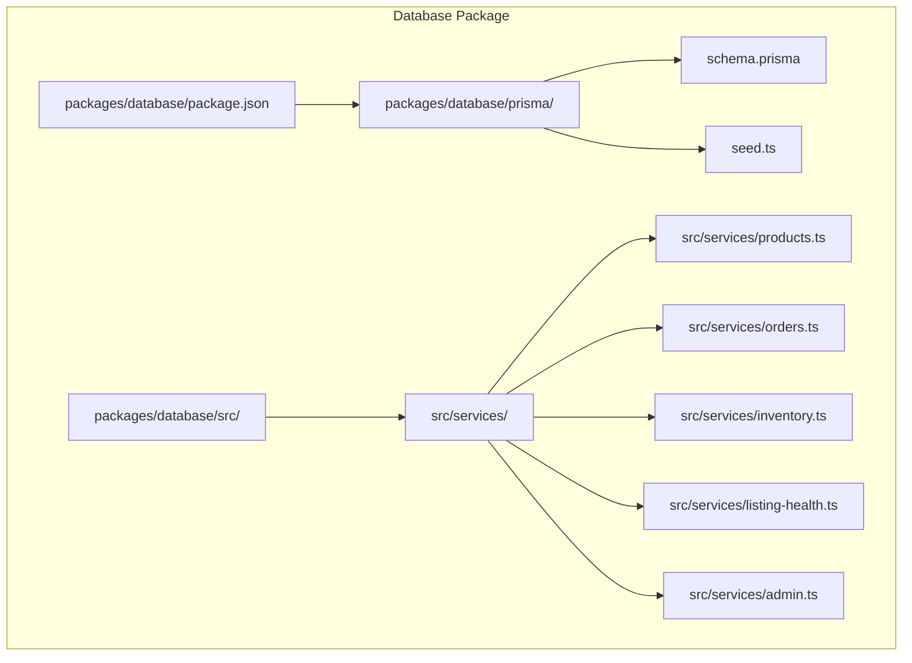
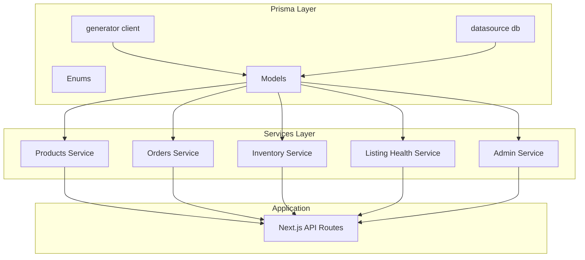
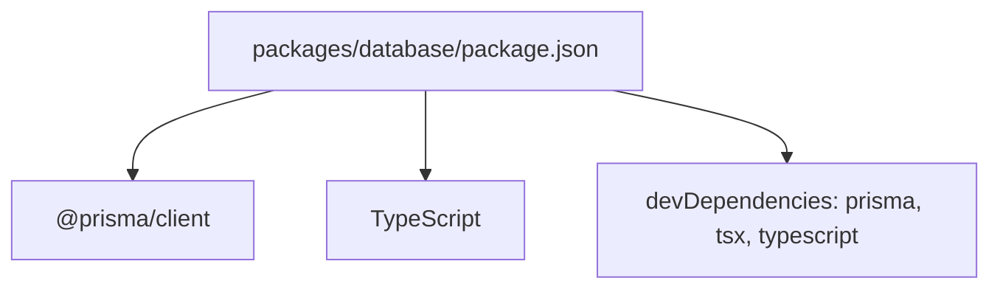

# Database Package

<cite>
**Referenced Files in This Document**
- [package.json](file://packages/database/package.json)
- [schema.prisma](file://packages/database/prisma/schema.prisma)
- [seed.ts](file://packages/database/prisma/seed.ts)
- [products.ts](file://packages/database/src/services/products.ts)
- [orders.ts](file://packages/database/src/services/orders.ts)
- [inventory.ts](file://packages/database/src/services/inventory.ts)
- [listing-health.ts](file://packages/database/src/services/listing-health.ts)
- [admin.ts](file://packages/database/src/services/admin.ts)
</cite>

## Table of Contents
1. [Introduction](#introduction)
2. [Project Structure](#project-structure)
3. [Core Components](#core-components)
4. [Architecture Overview](#architecture-overview)
5. [Detailed Component Analysis](#detailed-component-analysis)
6. [Dependency Analysis](#dependency-analysis)
7. [Performance Considerations](#performance-considerations)
8. [Troubleshooting Guide](#troubleshooting-guide)
9. [Conclusion](#conclusion)
10. [Appendices](#appendices)

## Introduction
This document describes the database package for Avenick Commerce. It covers the Prisma ORM schema with 20+ models, entity relationships, and data modeling patterns; the service layer abstraction for CRUD and business logic; the mock data system and seeding strategies; and practical examples of queries, transactions, and validations. It also documents Prisma client configuration, connection handling, and performance optimization strategies.

## Project Structure
The database package is organized around a Prisma schema defining the domain models and enums, a seed script for development data, and a services layer that encapsulates data access and business logic.

**Diagram sources**
- [package.json:1-34](file://packages/database/package.json#L1-L34)
- [schema.prisma:1-1341](file://packages/database/prisma/schema.prisma#L1-L1341)
- [seed.ts:1-1056](file://packages/database/prisma/seed.ts#L1-L1056)
- [products.ts:1-133](file://packages/database/src/services/products.ts#L1-L133)
- [orders.ts](file://packages/database/src/services/orders.ts)
- [inventory.ts](file://packages/database/src/services/inventory.ts)
- [listing-health.ts](file://packages/database/src/services/listing-health.ts)
- [admin.ts](file://packages/database/src/services/admin.ts)

**Section sources**
- [package.json:1-34](file://packages/database/package.json#L1-L34)
- [schema.prisma:1-1341](file://packages/database/prisma/schema.prisma#L1-L1341)

## Core Components
- Prisma client configuration and environment variables
- Enumerations for statuses, roles, currencies, and more
- Domain models for users, companies, sellers, catalog, inventory, orders, payments, CRM, messaging, and audit
- Seed script for development data
- Service layer with typed parameters and optimized queries

Key capabilities:
- Strongly-typed model definitions with relations and indexes
- Comprehensive enums for domain states
- Seed script covering users, categories, brands, warehouses, products, reviews, support tickets, orders, RFQs, messages, CRM, and audit logs
- Services for listing products, retrieving product details, seller dashboard metrics, order management, inventory tracking, listing health, and admin operations

**Section sources**
- [schema.prisma:1-1341](file://packages/database/prisma/schema.prisma#L1-L1341)
- [seed.ts:1-1056](file://packages/database/prisma/seed.ts#L1-L1056)
- [products.ts:1-133](file://packages/database/src/services/products.ts#L1-L133)

## Architecture Overview
The database package centers on Prisma’s client generation and a service layer that abstracts data access. The Prisma schema defines models and relationships; the seed script initializes development data; and services encapsulate business logic and expose typed APIs.

**Diagram sources**
- [schema.prisma:1-1341](file://packages/database/prisma/schema.prisma#L1-L1341)
- [products.ts:1-133](file://packages/database/src/services/products.ts#L1-L133)
- [orders.ts](file://packages/database/src/services/orders.ts)
- [inventory.ts](file://packages/database/src/services/inventory.ts)
- [listing-health.ts](file://packages/database/src/services/listing-health.ts)
- [admin.ts](file://packages/database/src/services/admin.ts)

## Detailed Component Analysis

### Prisma Schema and Data Modeling
The schema defines 20+ models with rich relationships and indexes. Notable domains:
- Identity and access: User, Session, AdminProfile
- B2B: Company, CompanyMember, ApprovalPolicy, PurchaseOrder
- Sellers: SellerProfile, SellerDocument, SellerPayout, SellerPayoutItem, SavedView
- Catalog: Category, Brand, Product, ProductImage, ProductVariant, ProductPrice, ProductComplianceDocument, ProductIssue, ListingHealthSnapshot
- Inventory: Warehouse, InventoryLocation, InventoryStock, InventoryMovement
- Shopping: Cart, CartItem
- Addresses and Orders: Address, Order, OrderItem, OrderStatusHistory
- Payments and Finance: Payment, Refund, Commission, TaxInvoice
- RFQ: RFQRequest, RFQItem
- Messaging: MessageThread, Message
- CRM: SellerCustomer, CustomerActivity
- Requisition Lists: RequisitionList, RequisitionListItem
- Reviews and Support: ProductReview, SupportTicket
- Fulfillment: Shipment, ShipmentEvent, ReturnRequest
- Notifications and Audit: Notification, AuditLog

Patterns:
- Enums for statuses, roles, currencies, and more
- Rich indexes for frequent filters and joins
- Relations with foreign keys and cascading deletes
- JSON fields for flexible attributes (e.g., tax invoice, compliance docs)
- Aggregation and computed fields (e.g., listing health)

**Section sources**
- [schema.prisma:1-1341](file://packages/database/prisma/schema.prisma#L1-L1341)

### Service Layer Abstractions
The services module exposes typed functions for common operations. Highlights:
- Products service: listProducts, getProductBySlug, getSellerDashboard
- Orders service: placeholder for order management
- Inventory service: placeholder for stock and movement
- Listing health service: placeholder for health metrics
- Admin service: placeholder for administrative tasks

Example patterns:
- Parameterized queries with pagination and filtering
- Includes for related entities
- Aggregations and raw SQL for complex counts
- Typed return shapes

**Section sources**
- [products.ts:1-133](file://packages/database/src/services/products.ts#L1-L133)

### Mock Data System and Seeding Strategies
The seed script initializes realistic development data:
- Users: admin, seller, buyer, company admin, pending seller
- Companies and memberships
- Categories and brands
- Warehouses and inventory locations
- Products with images, pricing tiers, stock, reviews, issues, and listing health snapshots
- Orders (B2B/B2C), payments, commissions, payouts
- RFQs, messages, CRM, support tickets, audit logs

Strategies:
- Upsert patterns to avoid duplication
- Conditional pricing creation based on availability
- Inventory creation per product
- Cross-entity seeding (e.g., linking orders to items and payments)
- Demo data for product issues and suppressed listings

**Section sources**
- [seed.ts:1-1056](file://packages/database/prisma/seed.ts#L1-L1056)

### Practical Examples

#### Example: List Products with Filters and Pagination
- Parameters include page, limit, search term, category, seller, status, and B2B/B2C flags
- Uses includes for images, prices, inventory, category, brand, seller, and unresolved issues
- Returns paginated results with total and page metadata

**Section sources**
- [products.ts:16-56](file://packages/database/src/services/products.ts#L16-L56)

#### Example: Get Product Details by Slug
- Fetches product with ordered images, active prices, inventory with location and warehouse, approved compliance docs, variants with active prices, and recent reviews
- Useful for product pages and storefronts

**Section sources**
- [products.ts:58-77](file://packages/database/src/services/products.ts#L58-L77)

#### Example: Seller Dashboard Metrics
- Computes daily order count, pending orders, low-stock items, unresolved issues, pending compliance, pending payouts, active listings, monthly revenue, recent orders, unread buyer messages, and open RFQs
- Uses aggregated counts and raw SQL for low-stock items

**Section sources**
- [products.ts:79-132](file://packages/database/src/services/products.ts#L79-L132)

#### Example: Seed Script Workflows
- Seeds users, companies, categories, brands, warehouses, products, inventory, reviews, support tickets, orders, payments, commissions, payouts, RFQs, messages, CRM, and audit logs
- Demonstrates upserts, conditional pricing, and cross-entity relationships

**Section sources**
- [seed.ts:35-1056](file://packages/database/prisma/seed.ts#L35-L1056)

### Transactions and Data Validation
- Transactions: Use Prisma client transaction APIs for multi-step operations (e.g., order creation with items, payments, inventory updates). Wrap related writes in a single transaction to maintain consistency.
- Data validation: Validate inputs at service boundaries (e.g., ensuring product exists before adding to cart, checking stock availability before checkout). Use Prisma’s strict typing to prevent invalid states.
- Idempotency: Prefer upserts in seeding and reconciliation flows to avoid duplicates.

[No sources needed since this section provides general guidance]

## Dependency Analysis
The database package depends on Prisma client and TypeScript. Scripts automate schema generation, migrations, seeding, and studio access. The services layer depends on the generated Prisma client.

**Diagram sources**
- [package.json:22-32](file://packages/database/package.json#L22-L32)

**Section sources**
- [package.json:1-34](file://packages/database/package.json#L1-L34)

## Performance Considerations
- Indexes: The schema includes targeted indexes on frequently filtered columns (e.g., user role/status, product slugs, order status, inventory stock). Keep indexes aligned with query patterns.
- Includes vs. Joins: Use includes selectively to avoid loading unnecessary data; prefer targeted selects for high-volume reads.
- Pagination: Always paginate lists (as shown in the products service) to limit payload sizes.
- Aggregations: Use Prisma aggregations for counts and sums instead of loading full datasets.
- Raw SQL: For complex cross-column comparisons (e.g., low-stock items), use raw SQL within transactions to keep performance optimal.
- Caching: Consider caching static or slowly changing data (e.g., categories, brands) at the application level.

[No sources needed since this section provides general guidance]

## Troubleshooting Guide
Common issues and resolutions:
- Migration errors: Run schema checks and apply migrations using the provided scripts. Ensure environment variables for DATABASE_URL and DIRECT_URL are configured.
- Seed failures: Verify seed prerequisites (e.g., warehouse locations) and rerun seeding with proper cleanup if needed.
- Query timeouts: Review query plans and add missing indexes. Optimize includes and pagination.
- Transaction conflicts: Wrap concurrent writes in transactions and handle deadlocks gracefully.

**Section sources**
- [package.json:11-21](file://packages/database/package.json#L11-L21)

## Conclusion
The database package provides a robust, strongly-typed foundation for Avenick Commerce. The Prisma schema models the full business domain with clear relationships and enums. The service layer offers practical abstractions for listing, querying, and managing core entities. The seed script accelerates development with realistic data. Following the performance and troubleshooting recommendations ensures scalable and reliable operations.

## Appendices

### Prisma Client Configuration and Environment
- Provider: PostgreSQL
- Binary targets: native and rhel-openssl-3.0.x for compatibility
- Environment variables: DATABASE_URL and DIRECT_URL

**Section sources**
- [schema.prisma:1-11](file://packages/database/prisma/schema.prisma#L1-L11)

### Service Layer Implementation Notes
- Products service: Implements listing, detail retrieval, and seller dashboard metrics
- Orders service: Placeholder for order lifecycle management
- Inventory service: Placeholder for stock and movement tracking
- Listing health service: Placeholder for product health monitoring
- Admin service: Placeholder for administrative dashboards and controls

**Section sources**
- [products.ts:1-133](file://packages/database/src/services/products.ts#L1-L133)
- [orders.ts](file://packages/database/src/services/orders.ts)
- [inventory.ts](file://packages/database/src/services/inventory.ts)
- [listing-health.ts](file://packages/database/src/services/listing-health.ts)
- [admin.ts](file://packages/database/src/services/admin.ts)