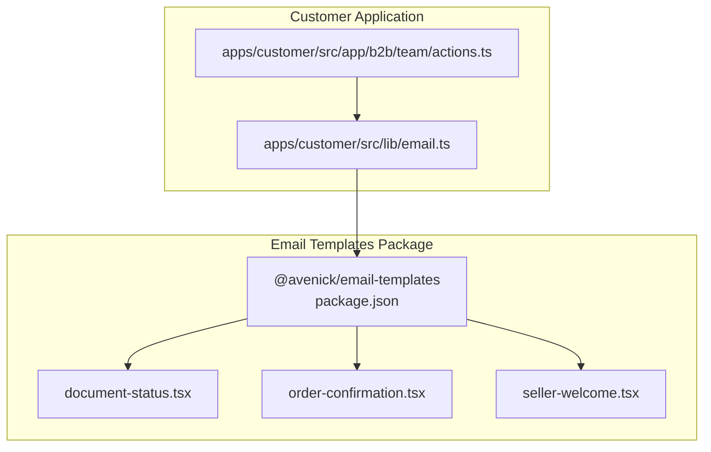
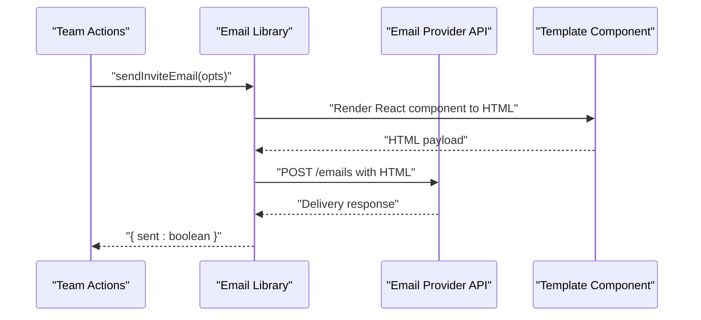
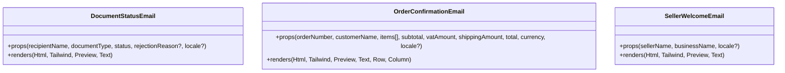
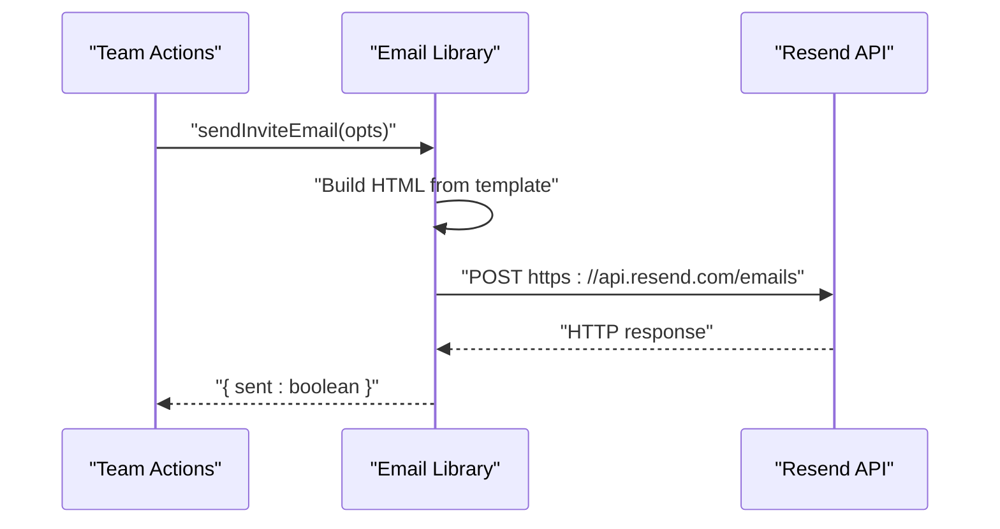
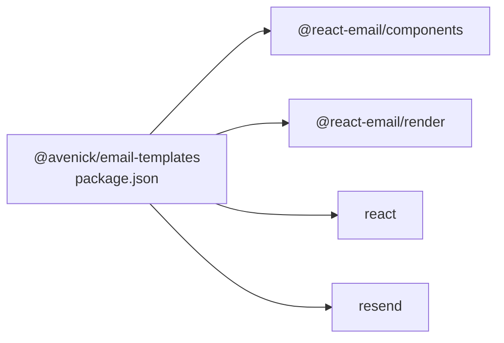

# Email Template System

<cite>
**Referenced Files in This Document**
- [package.json](file://packages/email-templates/package.json)
- [document-status.tsx](file://packages/email-templates/src/document-status.tsx)
- [order-confirmation.tsx](file://packages/email-templates/src/order-confirmation.tsx)
- [seller-welcome.tsx](file://packages/email-templates/src/seller-welcome.tsx)
- [email.ts](file://apps/customer/src/lib/email.ts)
- [actions.ts](file://apps/customer/src/app/b2b/team/actions.ts)
</cite>

## Table of Contents
1. [Introduction](#introduction)
2. [Project Structure](#project-structure)
3. [Core Components](#core-components)
4. [Architecture Overview](#architecture-overview)
5. [Detailed Component Analysis](#detailed-component-analysis)
6. [Dependency Analysis](#dependency-analysis)
7. [Performance Considerations](#performance-considerations)
8. [Troubleshooting Guide](#troubleshooting-guide)
9. [Conclusion](#conclusion)
10. [Appendices](#appendices)

## Introduction
This document describes the email template system used in Avenick Commerce. It covers the template architecture built with React Email, HTML rendering, dynamic content generation, localization support, and integration with an email service provider. It also documents template categorization for different email types, customization options, brand consistency, testing strategies, preview functionality, and compatibility considerations. Practical examples demonstrate creating new templates, customizing existing ones, and integrating with email providers.

## Project Structure
The email template system is organized as a reusable package that exports React Email components. The customer application integrates with an email service provider to send transactional emails.

**Diagram sources**
- [package.json:1-22](file://packages/email-templates/package.json#L1-L22)
- [document-status.tsx:1-43](file://packages/email-templates/src/document-status.tsx#L1-L43)
- [order-confirmation.tsx:1-93](file://packages/email-templates/src/order-confirmation.tsx#L1-L93)
- [seller-welcome.tsx:1-37](file://packages/email-templates/src/seller-welcome.tsx#L1-L37)
- [email.ts:1-58](file://apps/customer/src/lib/email.ts#L1-L58)
- [actions.ts:25-58](file://apps/customer/src/app/b2b/team/actions.ts#L25-L58)

**Section sources**
- [package.json:1-22](file://packages/email-templates/package.json#L1-L22)

## Core Components
- @avenick/email-templates package: Provides React Email components for various transactional emails.
- Customer app email integration: Sends emails via an external provider using a dedicated library.
- Template exports: Each template is exported as a React component that renders structured HTML for email clients.

Key capabilities:
- Dynamic content rendering with props for recipients, order details, and localization.
- RTL/LTR directionality and localized text for Arabic and English.
- Preview text for email clients.
- Tailwind-based styling for consistent visuals.

**Section sources**
- [package.json:1-22](file://packages/email-templates/package.json#L1-L22)
- [document-status.tsx:1-43](file://packages/email-templates/src/document-status.tsx#L1-L43)
- [order-confirmation.tsx:1-93](file://packages/email-templates/src/order-confirmation.tsx#L1-L93)
- [seller-welcome.tsx:1-37](file://packages/email-templates/src/seller-welcome.tsx#L1-L37)
- [email.ts:1-58](file://apps/customer/src/lib/email.ts#L1-L58)

## Architecture Overview
The system follows a layered architecture:
- Template Layer: React Email components define structure, localization, and styling.
- Rendering Layer: The React Email renderer converts components to HTML suitable for email clients.
- Delivery Layer: The customer app sends rendered HTML via an email service provider.

**Diagram sources**
- [actions.ts:25-58](file://apps/customer/src/app/b2b/team/actions.ts#L25-L58)
- [email.ts:1-58](file://apps/customer/src/lib/email.ts#L1-L58)
- [document-status.tsx:1-43](file://packages/email-templates/src/document-status.tsx#L1-L43)
- [order-confirmation.tsx:1-93](file://packages/email-templates/src/order-confirmation.tsx#L1-L93)
- [seller-welcome.tsx:1-37](file://packages/email-templates/src/seller-welcome.tsx#L1-L37)

## Detailed Component Analysis

### Template Components
Each template is a React component that:
- Accepts props for dynamic content (e.g., recipient name, order number, items).
- Supports localization with an optional locale prop.
- Uses Tailwind classes for consistent styling.
- Includes preview text for email clients.

Representative templates:
- Document Status: Notifies recipients of document approval or rejection with optional rejection reason.
- Order Confirmation: Renders order details including items, pricing breakdown, and currency.
- Seller Welcome: Welcomes sellers/businesses with localized messaging.

**Diagram sources**
- [document-status.tsx:1-43](file://packages/email-templates/src/document-status.tsx#L1-L43)
- [order-confirmation.tsx:1-93](file://packages/email-templates/src/order-confirmation.tsx#L1-L93)
- [seller-welcome.tsx:1-37](file://packages/email-templates/src/seller-welcome.tsx#L1-L37)

**Section sources**
- [document-status.tsx:1-43](file://packages/email-templates/src/document-status.tsx#L1-L43)
- [order-confirmation.tsx:1-93](file://packages/email-templates/src/order-confirmation.tsx#L1-L93)
- [seller-welcome.tsx:1-37](file://packages/email-templates/src/seller-welcome.tsx#L1-L37)

### Email Sending Integration
The customer app integrates with an email provider using a lightweight HTTP client:
- Environment-driven configuration: API key and sender address.
- Graceful fallback when the API key is missing.
- Request payload includes sender, recipient, subject, and HTML body.
- Error handling logs failures and returns a sent status.

**Diagram sources**
- [actions.ts:25-58](file://apps/customer/src/app/b2b/team/actions.ts#L25-L58)
- [email.ts:1-58](file://apps/customer/src/lib/email.ts#L1-L58)

**Section sources**
- [email.ts:1-58](file://apps/customer/src/lib/email.ts#L1-L58)
- [actions.ts:25-58](file://apps/customer/src/app/b2b/team/actions.ts#L25-L58)

### Localization Support
Templates support two locales:
- English (default): Left-to-right layout and English text.
- Arabic: Right-to-left layout and Arabic translations for all visible text.

Localization patterns:
- Directionality controlled via HTML attributes.
- Conditional translation blocks for all visible strings.
- Preview text adapts to the selected locale.

**Section sources**
- [document-status.tsx:20-27](file://packages/email-templates/src/document-status.tsx#L20-L27)
- [order-confirmation.tsx:48-83](file://packages/email-templates/src/order-confirmation.tsx#L48-L83)
- [seller-welcome.tsx:16-18](file://packages/email-templates/src/seller-welcome.tsx#L16-L18)

### Brand Consistency
Brand elements are consistently applied:
- Tailwind-based color palette (e.g., accent colors).
- Typography and spacing aligned with Tailwind utilities.
- Preview text and headings maintain brand voice.

**Section sources**
- [order-confirmation.tsx:86-93](file://packages/email-templates/src/order-confirmation.tsx#L86-L93)
- [seller-welcome.tsx:20-37](file://packages/email-templates/src/seller-welcome.tsx#L20-L37)

### Template Categorization
- Document Status: Used for administrative notifications (approval/rejection).
- Order Confirmation: Used after purchase completion.
- Seller Welcome: Used for onboarding new sellers.

These categories guide content structure and localization choices.

**Section sources**
- [document-status.tsx:1-43](file://packages/email-templates/src/document-status.tsx#L1-L43)
- [order-confirmation.tsx:1-93](file://packages/email-templates/src/order-confirmation.tsx#L1-L93)
- [seller-welcome.tsx:1-37](file://packages/email-templates/src/seller-welcome.tsx#L1-L37)

### Template Inheritance Patterns
There is no explicit inheritance hierarchy among templates. Instead, each template is self-contained and defines its own structure and localization. This approach simplifies customization and reduces coupling.

[No sources needed since this section provides conceptual guidance]

### Dynamic Content Generation
Templates receive props for dynamic content:
- Recipient-specific fields (names, roles).
- Transaction-specific fields (order numbers, totals, items).
- Localization preferences.

Rendering logic selects appropriate strings and layouts based on props.

**Section sources**
- [document-status.tsx:6-20](file://packages/email-templates/src/document-status.tsx#L6-L20)
- [order-confirmation.tsx:25-47](file://packages/email-templates/src/order-confirmation.tsx#L25-L47)
- [seller-welcome.tsx:6-16](file://packages/email-templates/src/seller-welcome.tsx#L6-L16)

### Preview Functionality
Each template sets preview text to improve email client appearance. This is defined alongside the HTML structure.

**Section sources**
- [document-status.tsx:30-32](file://packages/email-templates/src/document-status.tsx#L30-L32)
- [order-confirmation.tsx:85-88](file://packages/email-templates/src/order-confirmation.tsx#L85-L88)
- [seller-welcome.tsx:20-23](file://packages/email-templates/src/seller-welcome.tsx#L20-L23)

### Email Client Compatibility
- Uses React Email primitives designed for cross-client compatibility.
- Avoids unsupported CSS/HTML features typical of email clients.
- Employs Tailwind utilities known to render reliably in email clients.

**Section sources**
- [document-status.tsx:2-4](file://packages/email-templates/src/document-status.tsx#L2-L4)
- [order-confirmation.tsx:2-15](file://packages/email-templates/src/order-confirmation.tsx#L2-L15)
- [seller-welcome.tsx:2-4](file://packages/email-templates/src/seller-welcome.tsx#L2-L4)

### Practical Examples

#### Creating a New Email Template
Steps:
1. Define a new React component in the templates package with required props.
2. Add localization logic for English and Arabic.
3. Include preview text and Tailwind-based styling.
4. Export the component from the package.

Reference paths:
- [New template component:1-43](file://packages/email-templates/src/document-status.tsx#L1-L43)
- [Package exports:5-7](file://packages/email-templates/package.json#L5-L7)

**Section sources**
- [document-status.tsx:1-43](file://packages/email-templates/src/document-status.tsx#L1-L43)
- [package.json:5-7](file://packages/email-templates/package.json#L5-L7)

#### Customizing an Existing Template
Steps:
1. Modify props to include new dynamic fields.
2. Extend localization blocks for additional strings.
3. Adjust Tailwind classes for layout changes.
4. Verify preview text remains accurate.

Reference paths:
- [Order confirmation props and localization:25-83](file://packages/email-templates/src/order-confirmation.tsx#L25-L83)

**Section sources**
- [order-confirmation.tsx:25-83](file://packages/email-templates/src/order-confirmation.tsx#L25-L83)

#### Integrating with an Email Service Provider
Steps:
1. Configure environment variables for API key and sender.
2. Build HTML from the template component.
3. Send via the provider’s API endpoint.
4. Handle errors and return a sent status.

Reference paths:
- [Email library implementation:1-58](file://apps/customer/src/lib/email.ts#L1-L58)
- [Usage in actions:43-48](file://apps/customer/src/app/b2b/team/actions.ts#L43-L48)

**Section sources**
- [email.ts:1-58](file://apps/customer/src/lib/email.ts#L1-L58)
- [actions.ts:43-48](file://apps/customer/src/app/b2b/team/actions.ts#L43-L48)

### Template Versioning and Maintenance
- Package versioning: Managed by the templates package metadata.
- Maintenance: Changes to templates should update localization and preview text accordingly.
- Testing: Validate rendering across email clients and locales.

[No sources needed since this section provides general guidance]

## Dependency Analysis
External dependencies used by the email templates package:
- React Email components and renderer for building and rendering email-friendly HTML.
- React for component model.
- Resend for email delivery integration in the customer app.

**Diagram sources**
- [package.json:8-12](file://packages/email-templates/package.json#L8-L12)

**Section sources**
- [package.json:8-12](file://packages/email-templates/package.json#L8-L12)

## Performance Considerations
- Keep templates lightweight to minimize rendering overhead.
- Prefer Tailwind utilities that are well-supported by email clients.
- Avoid heavy JavaScript or dynamic styles that may degrade rendering.

[No sources needed since this section provides general guidance]

## Troubleshooting Guide
Common issues and resolutions:
- Missing API key: The email library logs a message and returns a sent status of false. Set the API key to enable delivery.
- Provider errors: Errors are logged with status and response text. Inspect logs for details.
- Locale mismatches: Ensure the locale prop matches supported values and that all strings are localized.

**Section sources**
- [email.ts:17-20](file://apps/customer/src/lib/email.ts#L17-L20)
- [email.ts:49-56](file://apps/customer/src/lib/email.ts#L49-L56)

## Conclusion
The email template system leverages React Email to produce reliable, localized HTML for transactional communications. It integrates cleanly with an email service provider, supports RTL/LTR layouts and dual-language content, and maintains brand consistency through shared styling. The modular design enables easy creation and customization of templates while preserving compatibility across email clients.

## Appendices

### Email Client Compatibility Checklist
- Validate rendering in major email clients.
- Confirm preview text displays correctly.
- Test RTL languages for proper directionality.
- Ensure links and buttons are clickable.

[No sources needed since this section provides general guidance]