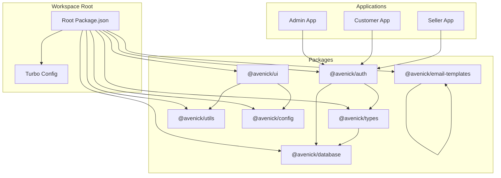
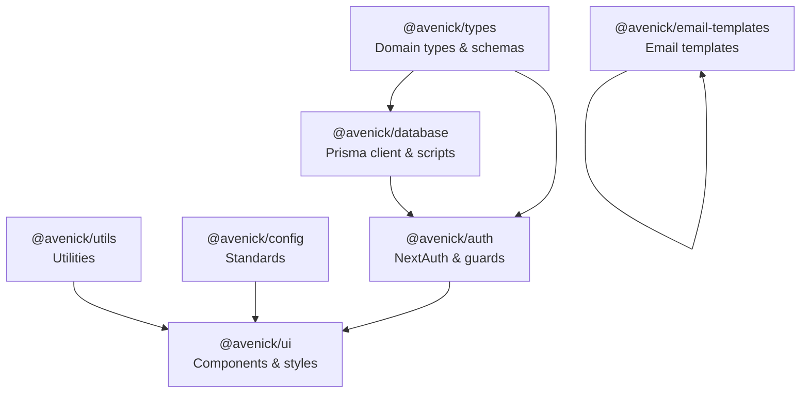
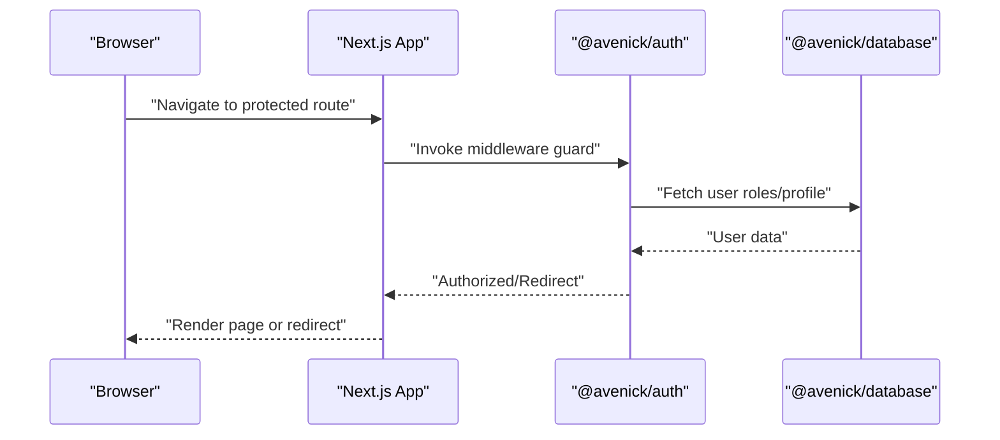
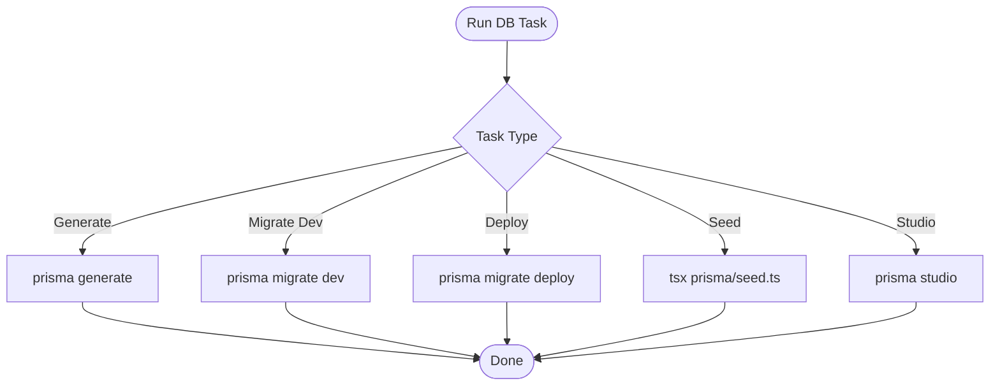
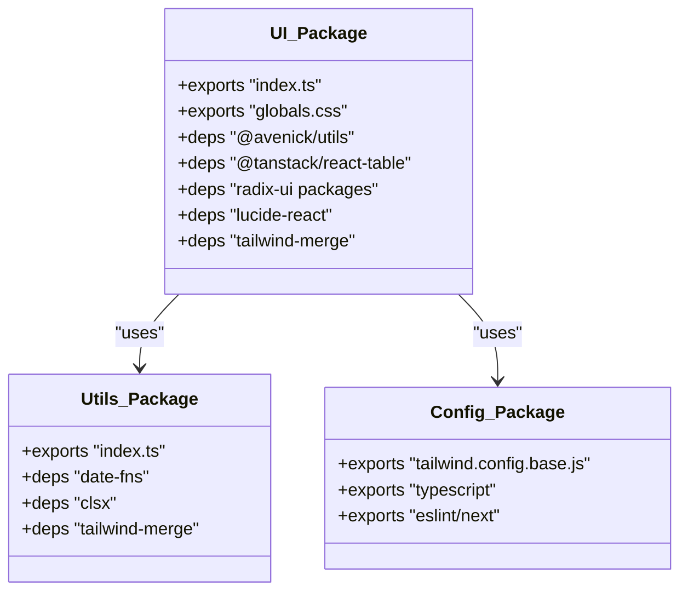
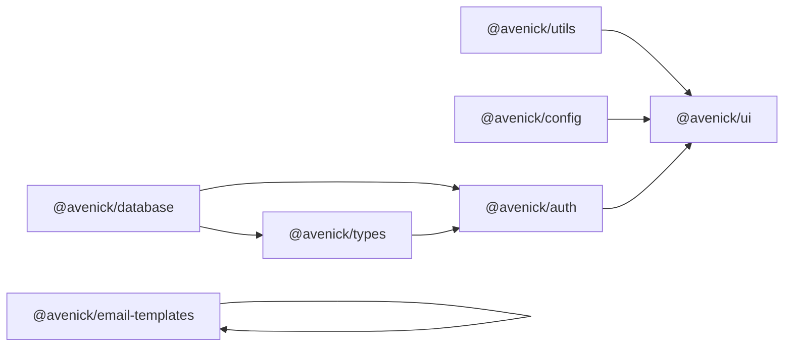

# Shared Packages Architecture

<cite>
**Referenced Files in This Document**
- [package.json](file://package.json)
- [turbo.json](file://turbo.json)
- [packages/auth/package.json](file://packages/auth/package.json)
- [packages/database/package.json](file://packages/database/package.json)
- [packages/ui/package.json](file://packages/ui/package.json)
- [packages/types/package.json](file://packages/types/package.json)
- [packages/utils/package.json](file://packages/utils/package.json)
- [packages/config/package.json](file://packages/config/package.json)
- [packages/email-templates/package.json](file://packages/email-templates/package.json)
- [apps/admin/src/lib/auth-instance.ts](file://apps/admin/src/lib/auth-instance.ts)
- [apps/customer/src/lib/auth-instance.ts](file://apps/customer/src/lib/auth-instance.ts)
- [apps/seller/src/lib/auth-instance.ts](file://apps/seller/src/lib/auth-instance.ts)
- [apps/admin/src/lib/auth.ts](file://apps/admin/src/lib/auth.ts)
- [apps/customer/src/lib/b2b.ts](file://apps/customer/src/lib/b2b.ts)
- [apps/customer/src/lib/email.ts](file://apps/customer/src/lib/email.ts)
- [apps/admin/src/middleware.ts](file://apps/admin/src/middleware.ts)
- [apps/customer/src/middleware.ts](file://apps/customer/src/middleware.ts)
- [apps/seller/src/middleware.ts](file://apps/seller/src/middleware.ts)
</cite>

## Table of Contents
1. [Introduction](#introduction)
2. [Project Structure](#project-structure)
3. [Core Components](#core-components)
4. [Architecture Overview](#architecture-overview)
5. [Detailed Component Analysis](#detailed-component-analysis)
6. [Dependency Analysis](#dependency-analysis)
7. [Performance Considerations](#performance-considerations)
8. [Troubleshooting Guide](#troubleshooting-guide)
9. [Conclusion](#conclusion)
10. [Appendices](#appendices)

## Introduction
This document describes the shared packages architecture used across the Avenick Commerce monorepo. It focuses on the package organization and interdependencies among auth, database, ui, types, utils, config, and email-templates packages. It also explains how these packages integrate with the Next.js applications (admin, customer, seller) via NextAuth, middleware, and shared libraries.

## Project Structure
The monorepo uses a Turborepo-based workspace with a packages directory containing shared packages and three Next.js applications. The shared packages provide reusable building blocks for authentication, database access, UI components, type definitions, utilities, configuration standards, and email templates.

**Diagram sources**
- [package.json:1-28](file://package.json#L1-L28)
- [turbo.json:1-69](file://turbo.json#L1-L69)
- [packages/auth/package.json:1-23](file://packages/auth/package.json#L1-L23)
- [packages/database/package.json:1-34](file://packages/database/package.json#L1-L34)
- [packages/ui/package.json:1-45](file://packages/ui/package.json#L1-L45)
- [packages/types/package.json:1-18](file://packages/types/package.json#L1-L18)
- [packages/utils/package.json:1-19](file://packages/utils/package.json#L1-L19)
- [packages/config/package.json:1-11](file://packages/config/package.json#L1-L11)
- [packages/email-templates/package.json:1-23](file://packages/email-templates/package.json#L1-L23)

**Section sources**
- [package.json:1-28](file://package.json#L1-L28)
- [turbo.json:1-69](file://turbo.json#L1-L69)

## Core Components
This section outlines the purpose and exports of each shared package and how they are consumed by the applications.

- @avenick/auth
  - Purpose: Authentication and authorization utilities, NextAuth integration, and role guards.
  - Exports: Main index, middleware utilities, and guards.
  - Dependencies: @avenick/database, @avenick/types, next, next-auth, bcryptjs.
  - Applications: Used by all apps for authentication routes and middleware.

- @avenick/database
  - Purpose: Prisma client generation, migrations, and seed scripts.
  - Exports: Main index.
  - Scripts: db:generate, db:push, db:migrate, db:deploy, db:seed, db:studio, db:reset.
  - Dependencies: @prisma/client, bcryptjs.

- @avenick/ui
  - Purpose: Shared UI component library built with Radix UI primitives, Tailwind, and icons.
  - Exports: Main index and global styles.
  - Dependencies: @avenick/utils, @tanstack/react-table, date-fns, radix-ui packages, lucide-react, react, tailwind-merge.

- @avenick/types
  - Purpose: Shared type definitions and Zod schemas that depend on @avenick/database.
  - Exports: Main index.
  - Dependencies: @avenick/database, zod.

- @avenick/utils
  - Purpose: Utility functions for date formatting, class merging, and testing helpers.
  - Exports: Main index.
  - Dependencies: date-fns, clsx, tailwind-merge.

- @avenick/config
  - Purpose: Centralized configuration standards for TypeScript, ESLint, and Tailwind.
  - Exports: TypeScript base config, ESLint config for Next.js, Tailwind base config.
  - No runtime dependencies.

- @avenick/email-templates
  - Purpose: React email templates with Resend integration using @react-email.
  - Exports: Main index.
  - Dependencies: @react-email/components, @react-email/render, react, resend.

**Section sources**
- [packages/auth/package.json:1-23](file://packages/auth/package.json#L1-L23)
- [packages/database/package.json:1-34](file://packages/database/package.json#L1-L34)
- [packages/ui/package.json:1-45](file://packages/ui/package.json#L1-L45)
- [packages/types/package.json:1-18](file://packages/types/package.json#L1-L18)
- [packages/utils/package.json:1-19](file://packages/utils/package.json#L1-L19)
- [packages/config/package.json:1-11](file://packages/config/package.json#L1-L11)
- [packages/email-templates/package.json:1-23](file://packages/email-templates/package.json#L1-L23)

## Architecture Overview
The shared packages form a layered architecture:
- Types define domain models and validation schemas.
- Database provides Prisma client and schema-related scripts.
- Auth integrates NextAuth and uses database and types for user/session management.
- UI composes reusable components and consumes utils and config for styling.
- Email templates encapsulate presentation logic for transactional emails.
- Applications consume these packages for consistent behavior and UI.

**Diagram sources**
- [packages/types/package.json:1-18](file://packages/types/package.json#L1-L18)
- [packages/database/package.json:1-34](file://packages/database/package.json#L1-L34)
- [packages/auth/package.json:1-23](file://packages/auth/package.json#L1-L23)
- [packages/ui/package.json:1-45](file://packages/ui/package.json#L1-L45)
- [packages/utils/package.json:1-19](file://packages/utils/package.json#L1-L19)
- [packages/config/package.json:1-11](file://packages/config/package.json#L1-L11)
- [packages/email-templates/package.json:1-23](file://packages/email-templates/package.json#L1-L23)

## Detailed Component Analysis

### Authentication Package (@avenick/auth)
- NextAuth Integration
  - Applications expose NextAuth routes under their API paths to handle sign-in, sign-out, and callbacks.
  - Auth instances in each app configure providers and session handling.
- Role Guards
  - Guards enforce role-based access control using Next.js middleware.
  - Middleware checks roles against the current session and redirects unauthorized users.

**Diagram sources**
- [apps/admin/src/middleware.ts](file://apps/admin/src/middleware.ts)
- [apps/customer/src/middleware.ts](file://apps/customer/src/middleware.ts)
- [apps/seller/src/middleware.ts](file://apps/seller/src/middleware.ts)
- [apps/admin/src/lib/auth-instance.ts](file://apps/admin/src/lib/auth-instance.ts)
- [apps/customer/src/lib/auth-instance.ts](file://apps/customer/src/lib/auth-instance.ts)
- [apps/seller/src/lib/auth-instance.ts](file://apps/seller/src/lib/auth-instance.ts)
- [packages/auth/package.json:10-16](file://packages/auth/package.json#L10-L16)

**Section sources**
- [packages/auth/package.json:1-23](file://packages/auth/package.json#L1-L23)
- [apps/admin/src/middleware.ts](file://apps/admin/src/middleware.ts)
- [apps/customer/src/middleware.ts](file://apps/customer/src/middleware.ts)
- [apps/seller/src/middleware.ts](file://apps/seller/src/middleware.ts)
- [apps/admin/src/lib/auth-instance.ts](file://apps/admin/src/lib/auth-instance.ts)
- [apps/customer/src/lib/auth-instance.ts](file://apps/customer/src/lib/auth-instance.ts)
- [apps/seller/src/lib/auth-instance.ts](file://apps/seller/src/lib/auth-instance.ts)

### Database Package (@avenick/database)
- Prisma Schema and Client
  - Provides Prisma client generation and migration commands.
  - Includes seed script execution via Turbo tasks.
- Scripts and Commands
  - db:generate, db:push, db:migrate, db:deploy, db:seed, db:studio, db:reset.
- Integration
  - Consumed by @avenick/types and @avenick/auth for user and entity access.

**Diagram sources**
- [packages/database/package.json:11-21](file://packages/database/package.json#L11-L21)

**Section sources**
- [packages/database/package.json:1-34](file://packages/database/package.json#L1-L34)

### UI Package (@avenick/ui)
- Component Library
  - Built with Radix UI primitives, Tailwind, and Lucide icons.
  - Provides tables, dialogs, forms, and common UI patterns.
- Globals and Styles
  - Exports global CSS for consistent styling across apps.
- Dependencies
  - Uses @avenick/utils for utilities and @avenick/config for Tailwind standards.

**Diagram sources**
- [packages/ui/package.json:1-45](file://packages/ui/package.json#L1-L45)
- [packages/utils/package.json:1-19](file://packages/utils/package.json#L1-L19)
- [packages/config/package.json:1-11](file://packages/config/package.json#L1-L11)

**Section sources**
- [packages/ui/package.json:1-45](file://packages/ui/package.json#L1-L45)

### Types Package (@avenick/types)
- Purpose
  - Defines shared domain types and Zod schemas.
  - Depends on @avenick/database for Prisma model references.
- Usage
  - Consumed by @avenick/auth and other packages for typed operations.

**Section sources**
- [packages/types/package.json:1-18](file://packages/types/package.json#L1-L18)

### Utilities Package (@avenick/utils)
- Purpose
  - Provides utility functions for date formatting, class merging, and testing helpers.
- Usage
  - Consumed by @avenick/ui for styling and formatting.

**Section sources**
- [packages/utils/package.json:1-19](file://packages/utils/package.json#L1-L19)

### Configuration Package (@avenick/config)
- Purpose
  - Centralizes TypeScript base config, ESLint rules for Next.js, and Tailwind base config.
- Usage
  - Consumed by @avenick/ui for consistent tooling across apps.

**Section sources**
- [packages/config/package.json:1-11](file://packages/config/package.json#L1-L11)

### Email Templates Package (@avenick/email-templates)
- Purpose
  - Provides React-based email templates integrated with Resend.
  - Uses @react-email components and render utilities.
- Usage
  - Applications can render and send transactional emails consistently.

**Section sources**
- [packages/email-templates/package.json:1-23](file://packages/email-templates/package.json#L1-L23)

## Dependency Analysis
The packages exhibit a layered dependency graph:
- database is foundational and consumed by types and auth.
- auth depends on database and types for user/session management.
- ui depends on utils and config for styling and composition.
- email-templates is standalone but can be used by any app.

**Diagram sources**
- [packages/database/package.json:1-34](file://packages/database/package.json#L1-L34)
- [packages/types/package.json:1-18](file://packages/types/package.json#L1-L18)
- [packages/auth/package.json:1-23](file://packages/auth/package.json#L1-L23)
- [packages/ui/package.json:1-45](file://packages/ui/package.json#L1-L45)
- [packages/utils/package.json:1-19](file://packages/utils/package.json#L1-L19)
- [packages/config/package.json:1-11](file://packages/config/package.json#L1-L11)
- [packages/email-templates/package.json:1-23](file://packages/email-templates/package.json#L1-L23)

**Section sources**
- [packages/auth/package.json:10-16](file://packages/auth/package.json#L10-L16)
- [packages/database/package.json:22-25](file://packages/database/package.json#L22-L25)
- [packages/ui/package.json:9-32](file://packages/ui/package.json#L9-L32)
- [packages/types/package.json:9-12](file://packages/types/package.json#L9-L12)
- [packages/utils/package.json:8-12](file://packages/utils/package.json#L8-L12)
- [packages/config/package.json:5-9](file://packages/config/package.json#L5-L9)
- [packages/email-templates/package.json:8-13](file://packages/email-templates/package.json#L8-L13)

## Performance Considerations
- Lazy loading of UI components to reduce initial bundle size.
- Use of Radix UI primitives for efficient rendering and accessibility.
- Centralized Tailwind configuration reduces duplication and improves build performance.
- Prisma client generation should be cached and run during CI builds to avoid repeated work.
- Email template rendering should be optimized and cached where appropriate.

## Troubleshooting Guide
- Authentication Issues
  - Verify NextAuth routes are properly exposed in each app.
  - Ensure auth instances are configured with correct providers and secrets.
  - Check middleware guards for role mismatches.
- Database Issues
  - Run db:generate and db:migrate to align schema with Prisma client.
  - Use db:studio for local schema inspection.
- UI Problems
  - Confirm Tailwind base config is applied via @avenick/config.
  - Ensure global CSS is imported in app layouts.
- Email Template Rendering
  - Validate React Email components and Resend credentials.
  - Test render locally before sending.

**Section sources**
- [turbo.json:41-53](file://turbo.json#L41-L53)
- [apps/admin/src/middleware.ts](file://apps/admin/src/middleware.ts)
- [apps/customer/src/middleware.ts](file://apps/customer/src/middleware.ts)
- [apps/seller/src/middleware.ts](file://apps/seller/src/middleware.ts)
- [apps/admin/src/lib/auth-instance.ts](file://apps/admin/src/lib/auth-instance.ts)
- [apps/customer/src/lib/auth-instance.ts](file://apps/customer/src/lib/auth-instance.ts)
- [apps/seller/src/lib/auth-instance.ts](file://apps/seller/src/lib/auth-instance.ts)

## Conclusion
The shared packages architecture enables consistent authentication, database access, UI composition, typing, utilities, configuration, and email templating across the admin, customer, and seller applications. By adhering to the layered dependencies and centralized configurations, teams can maintain uniform behavior, improve developer velocity, and simplify maintenance across the monorepo.

## Appendices
- Package Development Workflow
  - Use Turbo tasks for building, linting, type checking, and database operations.
  - Keep exports minimal and focused on public APIs.
  - Add unit tests for utilities and validation schemas.
  - Document package usage in READMEs and update changelogs when publishing.
- Best Practices
  - Prefer compositional UI components over ad-hoc styling.
  - Centralize configuration in @avenick/config to avoid drift.
  - Keep Prisma schema and migrations synchronized with @avenick/database scripts.
  - Use Zod schemas from @avenick/types for runtime validation.
  - Leverage @avenick/utils for cross-cutting concerns like formatting and merging classes.