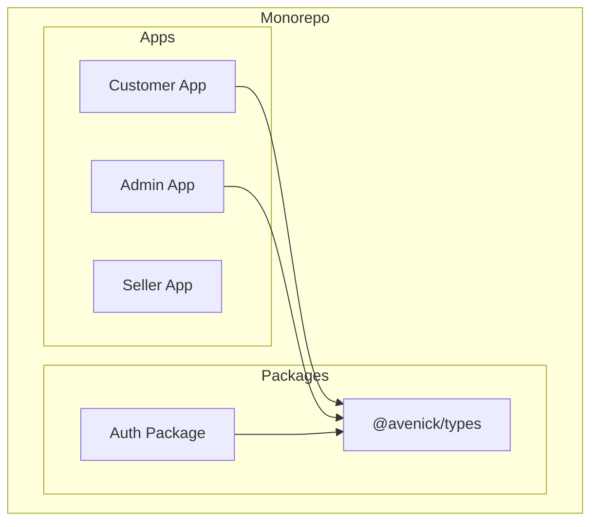
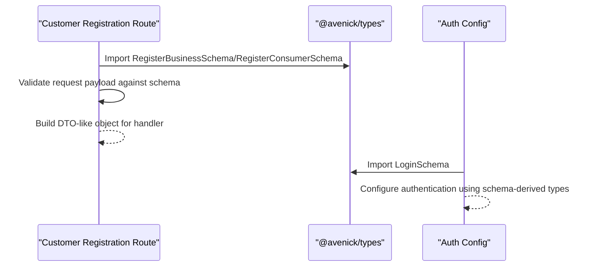
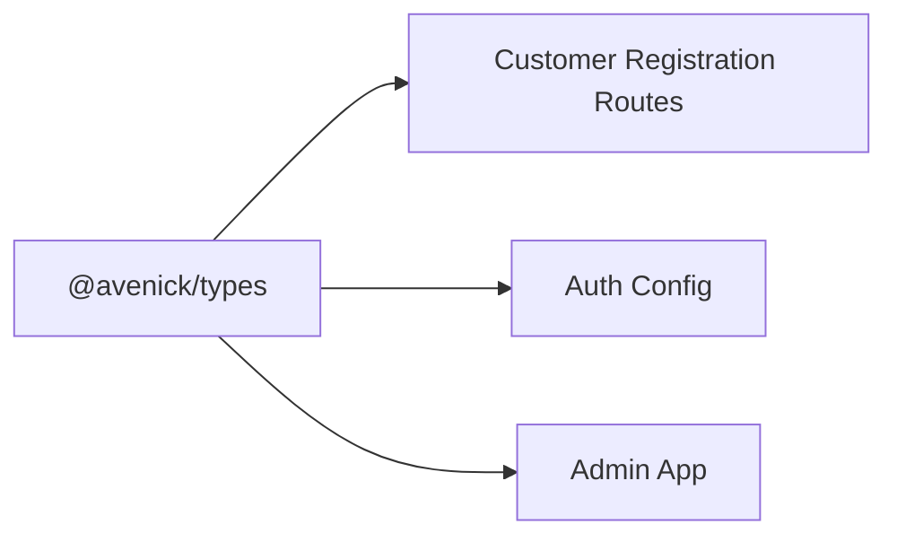

# Type Definitions

<cite>
**Referenced Files in This Document**
- [packages/types/tsconfig.json](file://packages/types/tsconfig.json)
- [apps/customer/src/app/api/auth/register/business/route.ts](file://apps/customer/src/app/api/auth/register/business/route.ts)
- [apps/customer/src/app/api/auth/register/consumer/route.ts](file://apps/customer/src/app/api/auth/register/consumer/route.ts)
- [packages/auth/src/config.ts](file://packages/auth/src/config.ts)
- [packages/config/tsconfig.base.json](file://packages/config/tsconfig.base.json)
- [packages/config/eslint-next.js](file://packages/config/eslint-next.js)
- [apps/admin/next-env.d.ts](file://apps/admin/next-env.d.ts)
- [apps/customer/next-env.d.ts](file://apps/customer/next-env.d.ts)
- [apps/seller/next-env.d.ts](file://apps/seller/next-env.d.ts)
</cite>

## Table of Contents
1. [Introduction](#introduction)
2. [Project Structure](#project-structure)
3. [Core Components](#core-components)
4. [Architecture Overview](#architecture-overview)
5. [Detailed Component Analysis](#detailed-component-analysis)
6. [Dependency Analysis](#dependency-analysis)
7. [Performance Considerations](#performance-considerations)
8. [Troubleshooting Guide](#troubleshooting-guide)
9. [Conclusion](#conclusion)
10. [Appendices](#appendices)

## Introduction
This document describes the shared type definitions and schemas used across the Avenick Commerce monorepo, focusing on the @avenick/types package and its integration with application APIs. It explains how request validation types and DTO-like patterns are structured, how they are consumed by Next.js routes, and how type safety is enforced across the workspace. It also outlines extension strategies, testing approaches, and maintenance practices for ensuring consistency across apps and packages.

## Project Structure
The types package is defined under packages/types and is consumed by multiple applications and packages:
- packages/types: Shared type definitions and schemas used across the monorepo
- apps/customer: Uses @avenick/types for authentication registration routes
- apps/admin: Consumes @avenick/types via node_modules installed package
- packages/auth: Imports LoginSchema from @avenick/types for authentication configuration

**Section sources**
- [packages/types/tsconfig.json:1-9](file://packages/types/tsconfig.json#L1-L9)
- [apps/customer/src/app/api/auth/register/business/route.ts:1-10](file://apps/customer/src/app/api/auth/register/business/route.ts#L1-L10)
- [apps/customer/src/app/api/auth/register/consumer/route.ts:1-10](file://apps/customer/src/app/api/auth/register/consumer/route.ts#L1-L10)
- [packages/auth/src/config.ts:1-10](file://packages/auth/src/config.ts#L1-L10)

## Core Components
This section outlines the primary type categories and their roles:
- Request validation schemas: Strongly-typed DTOs for API endpoints (e.g., registration forms)
- Authentication-related types: Login and registration schemas used by auth configuration
- Shared configuration: TypeScript base configuration and linting rules that enforce consistent type behavior across the monorepo

Key observations:
- The @avenick/types package exposes validation schemas such as RegisterBusinessSchema and RegisterConsumerSchema to application routes
- The auth package consumes LoginSchema from @avenick/types to configure authentication behavior
- Workspace-wide TypeScript and ESLint configurations ensure consistent type checking and import styles

**Section sources**
- [apps/customer/src/app/api/auth/register/business/route.ts:1-10](file://apps/customer/src/app/api/auth/register/business/route.ts#L1-L10)
- [apps/customer/src/app/api/auth/register/consumer/route.ts:1-10](file://apps/customer/src/app/api/auth/register/consumer/route.ts#L1-L10)
- [packages/auth/src/config.ts:1-10](file://packages/auth/src/config.ts#L1-L10)
- [packages/config/tsconfig.base.json:1-23](file://packages/config/tsconfig.base.json#L1-L23)
- [packages/config/eslint-next.js:1-17](file://packages/config/eslint-next.js#L1-L17)

## Architecture Overview
The type architecture centers on a shared package that defines schemas and types used by application routes and packages. Consumers import these types to validate inputs and maintain consistent DTO patterns across endpoints.

**Diagram sources**
- [apps/customer/src/app/api/auth/register/business/route.ts:1-10](file://apps/customer/src/app/api/auth/register/business/route.ts#L1-L10)
- [apps/customer/src/app/api/auth/register/consumer/route.ts:1-10](file://apps/customer/src/app/api/auth/register/consumer/route.ts#L1-L10)
- [packages/auth/src/config.ts:1-10](file://packages/auth/src/config.ts#L1-L10)

## Detailed Component Analysis

### Request Validation Schemas (DTO Patterns)
- Purpose: Provide strongly-typed validation for API requests, enabling safe extraction of DTO-like objects from incoming payloads
- Usage pattern: Routes import schema types and validate request bodies before proceeding with business logic
- Benefits: Centralized validation rules, consistent error handling, and improved developer experience through type inference

Integration points:
- Customer app registration routes consume RegisterBusinessSchema and RegisterConsumerSchema from @avenick/types
- These schemas are used to construct DTO-like objects passed to handlers

Practical usage examples (paths):
- [apps/customer/src/app/api/auth/register/business/route.ts](file://apps/customer/src/app/api/auth/register/business/route.ts)
- [apps/customer/src/app/api/auth/register/consumer/route.ts](file://apps/customer/src/app/api/auth/register/consumer/route.ts)

**Section sources**
- [apps/customer/src/app/api/auth/register/business/route.ts:1-10](file://apps/customer/src/app/api/auth/register/business/route.ts#L1-L10)
- [apps/customer/src/app/api/auth/register/consumer/route.ts:1-10](file://apps/customer/src/app/api/auth/register/consumer/route.ts#L1-L10)

### Authentication Schema Integration
- Purpose: Provide LoginSchema for configuring authentication behavior consistently across the auth package
- Integration: The auth package imports LoginSchema from @avenick/types to align login DTO shapes with shared types

Practical usage example (path):
- [packages/auth/src/config.ts](file://packages/auth/src/config.ts)

**Section sources**
- [packages/auth/src/config.ts:1-10](file://packages/auth/src/config.ts#L1-L10)

### Shared TypeScript Configuration
- Purpose: Establish consistent compiler options and strictness settings across the monorepo
- Impact: Ensures uniform type checking behavior in apps and packages that depend on @avenick/types

Relevant configuration files:
- [packages/config/tsconfig.base.json](file://packages/config/tsconfig.base.json)
- [packages/types/tsconfig.json](file://packages/types/tsconfig.json)

**Section sources**
- [packages/config/tsconfig.base.json:1-23](file://packages/config/tsconfig.base.json#L1-L23)
- [packages/types/tsconfig.json:1-9](file://packages/types/tsconfig.json#L1-L9)

### Linting and Type Safety Enforcement
- Purpose: Enforce consistent type imports and catch potential type-related issues early
- Key rules:
  - Prefer type-only imports and inline type imports
  - Disallow explicit any
  - Report unused variables with underscore prefix ignore

Relevant configuration file:
- [packages/config/eslint-next.js](file://packages/config/eslint-next.js)

**Section sources**
- [packages/config/eslint-next.js:1-17](file://packages/config/eslint-next.js#L1-L17)

### Environment Declarations
- Purpose: Provide ambient type declarations for Next.js environments across apps
- Impact: Ensures type-safe usage of environment-specific features and metadata

Relevant files:
- [apps/admin/next-env.d.ts](file://apps/admin/next-env.d.ts)
- [apps/customer/next-env.d.ts](file://apps/customer/next-env.d.ts)
- [apps/seller/next-env.d.ts](file://apps/seller/next-env.d.ts)

**Section sources**
- [apps/admin/next-env.d.ts:1-20](file://apps/admin/next-env.d.ts#L1-L20)
- [apps/customer/next-env.d.ts:1-20](file://apps/customer/next-env.d.ts#L1-L20)
- [apps/seller/next-env.d.ts:1-20](file://apps/seller/next-env.d.ts#L1-L20)

## Dependency Analysis
The @avenick/types package acts as a central dependency for:
- Application routes requiring request validation schemas
- Packages that need authentication-related types

**Diagram sources**
- [apps/customer/src/app/api/auth/register/business/route.ts:1-10](file://apps/customer/src/app/api/auth/register/business/route.ts#L1-L10)
- [apps/customer/src/app/api/auth/register/consumer/route.ts:1-10](file://apps/customer/src/app/api/auth/register/consumer/route.ts#L1-L10)
- [packages/auth/src/config.ts:1-10](file://packages/auth/src/config.ts#L1-L10)

**Section sources**
- [apps/customer/src/app/api/auth/register/business/route.ts:1-10](file://apps/customer/src/app/api/auth/register/business/route.ts#L1-L10)
- [apps/customer/src/app/api/auth/register/consumer/route.ts:1-10](file://apps/customer/src/app/api/auth/register/consumer/route.ts#L1-L10)
- [packages/auth/src/config.ts:1-10](file://packages/auth/src/config.ts#L1-L10)

## Performance Considerations
- Centralized validation reduces duplication and improves maintainability
- Strong typing minimizes runtime errors and speeds up development through better IDE support
- Consistent compiler options and linting rules help prevent subtle type-related regressions

## Troubleshooting Guide
Common issues and resolutions:
- Import mismatches: Ensure consumers import types from @avenick/types and not duplicating definitions locally
- Schema drift: When updating schemas, propagate changes across all consumers and update tests accordingly
- Type inference failures: Verify that TypeScript base configuration is extended properly in dependent packages

Diagnostic steps:
- Confirm that packages/types extends the shared base TS config
- Verify ESLint rules are applied consistently across the monorepo
- Check that Next.js environment declarations are present in each app

**Section sources**
- [packages/types/tsconfig.json:1-9](file://packages/types/tsconfig.json#L1-L9)
- [packages/config/tsconfig.base.json:1-23](file://packages/config/tsconfig.base.json#L1-L23)
- [packages/config/eslint-next.js:1-17](file://packages/config/eslint-next.js#L1-L17)
- [apps/admin/next-env.d.ts:1-20](file://apps/admin/next-env.d.ts#L1-L20)
- [apps/customer/next-env.d.ts:1-20](file://apps/customer/next-env.d.ts#L1-L20)
- [apps/seller/next-env.d.ts:1-20](file://apps/seller/next-env.d.ts#L1-L20)

## Conclusion
The @avenick/types package provides a centralized foundation for shared type definitions and validation schemas across the Avenick Commerce monorepo. By enforcing consistent TypeScript and ESLint configurations, the workspace maintains strong type safety and predictable behavior. Integrations in customer registration routes and the auth package demonstrate practical usage of DTO-like patterns and schema-driven validation.

## Appendices
- Extending types for new features:
  - Add new schemas to @avenick/types and export them from the package’s public API
  - Update consumers to import and use the new types
  - Align Next.js routes and packages with the new schema shapes
- Type testing strategies:
  - Use unit tests to validate schema transformations and DTO construction
  - Leverage TypeScript’s type-only checks to ensure compile-time correctness
  - Apply snapshot-style tests for serialized DTO outputs to detect unintended changes
- Maintaining type consistency:
  - Keep shared base TS config and ESLint rules synchronized across the monorepo
  - Regularly audit imports to avoid duplication and ensure alignment with @avenick/types