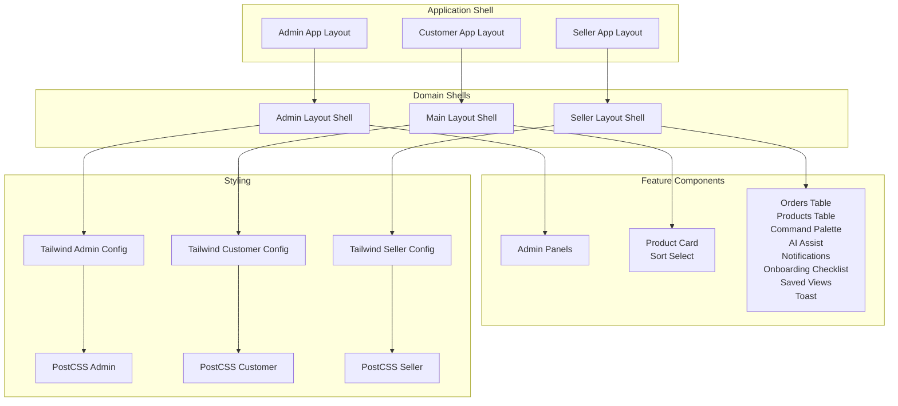
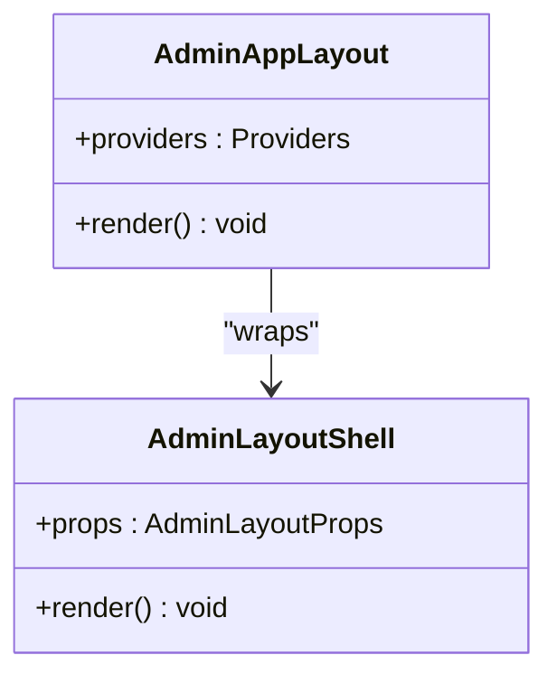
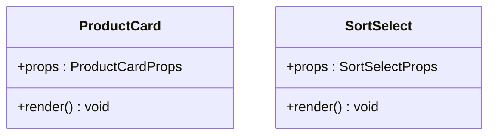
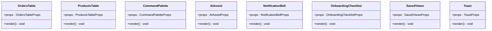
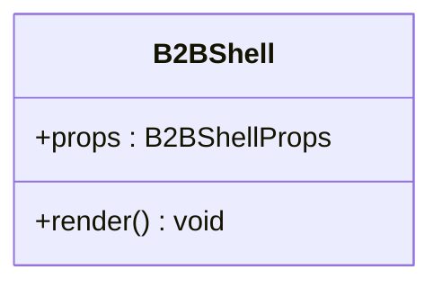
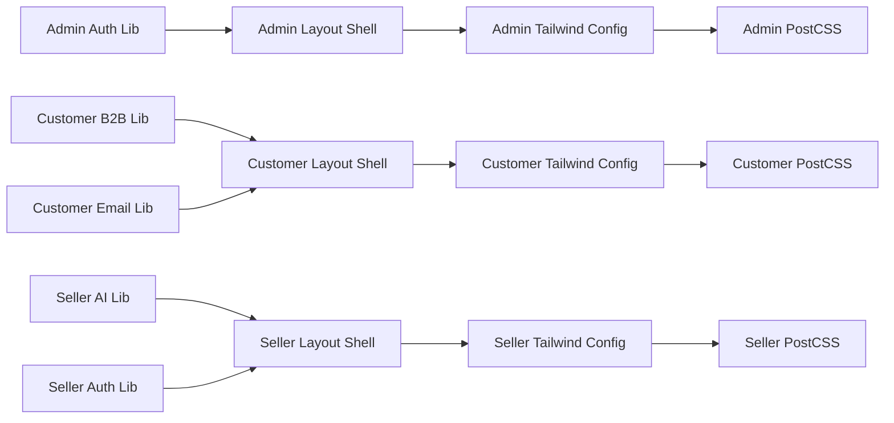

# UI Component Library

<cite>
**Referenced Files in This Document**
- [README.md](file://README.md)
- [DESIGN_SYSTEM_NOTES.md](file://DESIGN_SYSTEM_NOTES.md)
- [UI_UX_REVAMP_NOTES.md](file://UI_UX_REVAMP_NOTES.md)
- [apps/admin/tailwind.config.js](file://apps/admin/tailwind.config.js)
- [apps/customer/tailwind.config.js](file://apps/customer/tailwind.config.js)
- [apps/seller/tailwind.config.js](file://apps/seller/tailwind.config.js)
- [apps/admin/postcss.config.js](file://apps/admin/postcss.config.js)
- [apps/customer/postcss.config.js](file://apps/customer/postcss.config.js)
- [apps/seller/postcss.config.js](file://apps/seller/postcss.config.js)
- [apps/admin/src/app/layout.tsx](file://apps/admin/src/app/layout.tsx)
- [apps/customer/src/app/layout.tsx](file://apps/customer/src/app/layout.tsx)
- [apps/seller/src/app/layout.tsx](file://apps/seller/src/app/layout.tsx)
- [apps/admin/src/components/layout/admin-layout.tsx](file://apps/admin/src/components/layout/admin-layout.tsx)
- [apps/customer/src/components/layout/main-layout.tsx](file://apps/customer/src/components/layout/main-layout.tsx)
- [apps/seller/src/components/layout/seller-layout.tsx](file://apps/seller/src/components/layout/seller-layout.tsx)
- [apps/admin/src/components/b2b/b2b-shell.tsx](file://apps/admin/src/components/b2b/b2b-shell.tsx)
- [apps/customer/src/components/products/product-card.tsx](file://apps/customer/src/components/products/product-card.tsx)
- [apps/customer/src/components/products/sort-select.tsx](file://apps/customer/src/components/products/sort-select.tsx)
- [apps/seller/src/components/orders-table.tsx](file://apps/seller/src/components/orders-table.tsx)
- [apps/seller/src/components/products-table.tsx](file://apps/seller/src/components/products-table.tsx)
- [apps/seller/src/components/command-palette.tsx](file://apps/seller/src/components/command-palette.tsx)
- [apps/seller/src/components/ai-assist.tsx](file://apps/seller/src/components/ai-assist.tsx)
- [apps/seller/src/components/notification-bell.tsx](file://apps/seller/src/components/notification-bell.tsx)
- [apps/seller/src/components/onboarding-checklist.tsx](file://apps/seller/src/components/onboarding-checklist.tsx)
- [apps/seller/src/components/saved-views.tsx](file://apps/seller/src/components/saved-views.tsx)
- [apps/seller/src/components/toast.tsx](file://apps/seller/src/components/toast.tsx)
- [apps/admin/src/lib/auth.ts](file://apps/admin/src/lib/auth.ts)
- [apps/customer/src/lib/b2b.ts](file://apps/customer/src/lib/b2b.ts)
- [apps/customer/src/lib/email.ts](file://apps/customer/src/lib/email.ts)
- [apps/seller/src/lib/ai.ts](file://apps/seller/src/lib/ai.ts)
- [apps/seller/src/lib/auth.ts](file://apps/seller/src/lib/auth.ts)
</cite>

## Table of Contents
1. [Introduction](#introduction)
2. [Project Structure](#project-structure)
3. [Core Components](#core-components)
4. [Architecture Overview](#architecture-overview)
5. [Detailed Component Analysis](#detailed-component-analysis)
6. [Dependency Analysis](#dependency-analysis)
7. [Performance Considerations](#performance-considerations)
8. [Troubleshooting Guide](#troubleshooting-guide)
9. [Conclusion](#conclusion)
10. [Appendices](#appendices)

## Introduction
This document describes the UI component library and shared design system across the Avenick Commerce platform. It explains the component architecture, design system foundation, Tailwind CSS configuration, and reusable patterns used by the three main applications: Admin, Customer, and Seller. It also covers component composition strategies, prop interfaces, customization options, responsive design, accessibility considerations, and testing approaches grounded in the repository’s design notes and application layouts.

## Project Structure
The UI ecosystem is organized around three Next.js applications, each with its own Tailwind and PostCSS configuration, shared layout components, and domain-specific components. The Admin, Customer, and Seller apps define distinct UI shells and feature components while sharing common layout scaffolding and styling foundations.

```mermaid
graph TB
subgraph "Admin Application"
A_L["apps/admin/src/app/layout.tsx"]
A_LL["apps/admin/src/components/layout/admin-layout.tsx"]
A_T["apps/admin/tailwind.config.js"]
A_P["apps/admin/postcss.config.js"]
end
subgraph "Customer Application"
C_L["apps/customer/src/app/layout.tsx"]
C_LL["apps/customer/src/components/layout/main-layout.tsx"]
C_T["apps/customer/tailwind.config.js"]
C_P["apps/customer/postcss.config.js"]
end
subgraph "Seller Application"
S_L["apps/seller/src/app/layout.tsx"]
S_LL["apps/seller/src/components/layout/seller-layout.tsx"]
S_T["apps/seller/tailwind.config.js"]
S_P["apps/seller/postcss.config.js"]
end
A_L --> A_LL
C_L --> C_LL
S_L --> S_LL
A_LL --> A_T
C_LL --> C_T
S_LL --> S_T
A_T --> A_P
C_T --> C_P
S_T --> S_P
```

**Diagram sources**
- [apps/admin/src/app/layout.tsx:1-200](file://apps/admin/src/app/layout.tsx#L1-L200)
- [apps/admin/src/components/layout/admin-layout.tsx:1-200](file://apps/admin/src/components/layout/admin-layout.tsx#L1-L200)
- [apps/admin/tailwind.config.js:1-200](file://apps/admin/tailwind.config.js#L1-L200)
- [apps/admin/postcss.config.js:1-200](file://apps/admin/postcss.config.js#L1-L200)
- [apps/customer/src/app/layout.tsx:1-200](file://apps/customer/src/app/layout.tsx#L1-L200)
- [apps/customer/src/components/layout/main-layout.tsx:1-200](file://apps/customer/src/components/layout/main-layout.tsx#L1-L200)
- [apps/customer/tailwind.config.js:1-200](file://apps/customer/tailwind.config.js#L1-L200)
- [apps/customer/postcss.config.js:1-200](file://apps/customer/postcss.config.js#L1-L200)
- [apps/seller/src/app/layout.tsx:1-200](file://apps/seller/src/app/layout.tsx#L1-L200)
- [apps/seller/src/components/layout/seller-layout.tsx:1-200](file://apps/seller/src/components/layout/seller-layout.tsx#L1-L200)
- [apps/seller/tailwind.config.js:1-200](file://apps/seller/tailwind.config.js#L1-L200)
- [apps/seller/postcss.config.js:1-200](file://apps/seller/postcss.config.js#L1-L200)

**Section sources**
- [apps/admin/src/app/layout.tsx:1-200](file://apps/admin/src/app/layout.tsx#L1-L200)
- [apps/customer/src/app/layout.tsx:1-200](file://apps/customer/src/app/layout.tsx#L1-L200)
- [apps/seller/src/app/layout.tsx:1-200](file://apps/seller/src/app/layout.tsx#L1-L200)
- [apps/admin/tailwind.config.js:1-200](file://apps/admin/tailwind.config.js#L1-L200)
- [apps/customer/tailwind.config.js:1-200](file://apps/customer/tailwind.config.js#L1-L200)
- [apps/seller/tailwind.config.js:1-200](file://apps/seller/tailwind.config.js#L1-L200)
- [apps/admin/postcss.config.js:1-200](file://apps/admin/postcss.config.js#L1-L200)
- [apps/customer/postcss.config.js:1-200](file://apps/customer/postcss.config.js#L1-L200)
- [apps/seller/postcss.config.js:1-200](file://apps/seller/postcss.config.js#L1-L200)

## Core Components
The UI library centers on shared layout components and domain-specific widgets that compose into cohesive pages. The Admin application provides an administrative shell and specialized panels. The Customer application offers a B2C/B2B product browsing experience with product cards and sorting controls. The Seller application exposes operational dashboards, tables, and assistant tools.

Key shared patterns:
- Layout composition via top-level app layout and dedicated shell components
- Domain-specific components encapsulating UI logic and presentation
- Tailwind-based styling with per-app configuration and PostCSS pipeline

Representative components:
- Admin layout shell and navigation
- Customer product card and sort selector
- Seller order/product tables, command palette, AI assist, notifications, onboarding checklist, saved views, and toast

**Section sources**
- [apps/admin/src/components/layout/admin-layout.tsx:1-200](file://apps/admin/src/components/layout/admin-layout.tsx#L1-L200)
- [apps/customer/src/components/products/product-card.tsx:1-200](file://apps/customer/src/components/products/product-card.tsx#L1-L200)
- [apps/customer/src/components/products/sort-select.tsx:1-200](file://apps/customer/src/components/products/sort-select.tsx#L1-L200)
- [apps/seller/src/components/orders-table.tsx:1-200](file://apps/seller/src/components/orders-table.tsx#L1-L200)
- [apps/seller/src/components/products-table.tsx:1-200](file://apps/seller/src/components/products-table.tsx#L1-L200)
- [apps/seller/src/components/command-palette.tsx:1-200](file://apps/seller/src/components/command-palette.tsx#L1-L200)
- [apps/seller/src/components/ai-assist.tsx:1-200](file://apps/seller/src/components/ai-assist.tsx#L1-L200)
- [apps/seller/src/components/notification-bell.tsx:1-200](file://apps/seller/src/components/notification-bell.tsx#L1-L200)
- [apps/seller/src/components/onboarding-checklist.tsx:1-200](file://apps/seller/src/components/onboarding-checklist.tsx#L1-L200)
- [apps/seller/src/components/saved-views.tsx:1-200](file://apps/seller/src/components/saved-views.tsx#L1-L200)
- [apps/seller/src/components/toast.tsx:1-200](file://apps/seller/src/components/toast.tsx#L1-L200)

## Architecture Overview
The UI architecture follows a layered pattern:
- Application shell: Each app defines a top-level layout that sets global styles and providers.
- Domain shells: Dedicated layout components wrap page-level routes with consistent navigation and branding.
- Feature components: Reusable widgets encapsulate UI behavior and rendering for specific domains.
- Styling pipeline: Tailwind CSS configured per app with PostCSS for build-time transformations.

**Diagram sources**
- [apps/admin/src/app/layout.tsx:1-200](file://apps/admin/src/app/layout.tsx#L1-L200)
- [apps/customer/src/app/layout.tsx:1-200](file://apps/customer/src/app/layout.tsx#L1-L200)
- [apps/seller/src/app/layout.tsx:1-200](file://apps/seller/src/app/layout.tsx#L1-L200)
- [apps/admin/src/components/layout/admin-layout.tsx:1-200](file://apps/admin/src/components/layout/admin-layout.tsx#L1-L200)
- [apps/customer/src/components/layout/main-layout.tsx:1-200](file://apps/customer/src/components/layout/main-layout.tsx#L1-L200)
- [apps/seller/src/components/layout/seller-layout.tsx:1-200](file://apps/seller/src/components/layout/seller-layout.tsx#L1-L200)
- [apps/admin/tailwind.config.js:1-200](file://apps/admin/tailwind.config.js#L1-L200)
- [apps/customer/tailwind.config.js:1-200](file://apps/customer/tailwind.config.js#L1-L200)
- [apps/seller/tailwind.config.js:1-200](file://apps/seller/tailwind.config.js#L1-L200)
- [apps/admin/postcss.config.js:1-200](file://apps/admin/postcss.config.js#L1-L200)
- [apps/customer/postcss.config.js:1-200](file://apps/customer/postcss.config.js#L1-L200)
- [apps/seller/postcss.config.js:1-200](file://apps/seller/postcss.config.js#L1-L200)

## Detailed Component Analysis

### Admin Layout Shell
The Admin layout shell establishes the administrative UI framework, integrating navigation, branding, and page containers. It composes with the app layout to ensure consistent global styles and providers.

**Diagram sources**
- [apps/admin/src/components/layout/admin-layout.tsx:1-200](file://apps/admin/src/components/layout/admin-layout.tsx#L1-L200)
- [apps/admin/src/app/layout.tsx:1-200](file://apps/admin/src/app/layout.tsx#L1-L200)

**Section sources**
- [apps/admin/src/components/layout/admin-layout.tsx:1-200](file://apps/admin/src/components/layout/admin-layout.tsx#L1-L200)
- [apps/admin/src/app/layout.tsx:1-200](file://apps/admin/src/app/layout.tsx#L1-L200)

### Customer Product Card and Sort Selector
The Customer application includes a product card component for displaying product metadata and actions, and a sort selector for filtering and ordering product listings. These components demonstrate reusable UI patterns for product discovery and selection.

**Diagram sources**
- [apps/customer/src/components/products/product-card.tsx:1-200](file://apps/customer/src/components/products/product-card.tsx#L1-L200)
- [apps/customer/src/components/products/sort-select.tsx:1-200](file://apps/customer/src/components/products/sort-select.tsx#L1-L200)

**Section sources**
- [apps/customer/src/components/products/product-card.tsx:1-200](file://apps/customer/src/components/products/product-card.tsx#L1-L200)
- [apps/customer/src/components/products/sort-select.tsx:1-200](file://apps/customer/src/components/products/sort-select.tsx#L1-L200)

### Seller Operational Components
The Seller application provides several operational components:
- Orders table and products table for listing and managing records
- Command palette for quick navigation and actions
- AI assist for content generation and suggestions
- Notification bell for alerts
- Onboarding checklist for guided setup
- Saved views for custom filters and layouts
- Toast for ephemeral notifications

**Diagram sources**
- [apps/seller/src/components/orders-table.tsx:1-200](file://apps/seller/src/components/orders-table.tsx#L1-L200)
- [apps/seller/src/components/products-table.tsx:1-200](file://apps/seller/src/components/products-table.tsx#L1-L200)
- [apps/seller/src/components/command-palette.tsx:1-200](file://apps/seller/src/components/command-palette.tsx#L1-L200)
- [apps/seller/src/components/ai-assist.tsx:1-200](file://apps/seller/src/components/ai-assist.tsx#L1-L200)
- [apps/seller/src/components/notification-bell.tsx:1-200](file://apps/seller/src/components/notification-bell.tsx#L1-L200)
- [apps/seller/src/components/onboarding-checklist.tsx:1-200](file://apps/seller/src/components/onboarding-checklist.tsx#L1-L200)
- [apps/seller/src/components/saved-views.tsx:1-200](file://apps/seller/src/components/saved-views.tsx#L1-L200)
- [apps/seller/src/components/toast.tsx:1-200](file://apps/seller/src/components/toast.tsx#L1-L200)

**Section sources**
- [apps/seller/src/components/orders-table.tsx:1-200](file://apps/seller/src/components/orders-table.tsx#L1-L200)
- [apps/seller/src/components/products-table.tsx:1-200](file://apps/seller/src/components/products-table.tsx#L1-L200)
- [apps/seller/src/components/command-palette.tsx:1-200](file://apps/seller/src/components/command-palette.tsx#L1-L200)
- [apps/seller/src/components/ai-assist.tsx:1-200](file://apps/seller/src/components/ai-assist.tsx#L1-L200)
- [apps/seller/src/components/notification-bell.tsx:1-200](file://apps/seller/src/components/notification-bell.tsx#L1-L200)
- [apps/seller/src/components/onboarding-checklist.tsx:1-200](file://apps/seller/src/components/onboarding-checklist.tsx#L1-L200)
- [apps/seller/src/components/saved-views.tsx:1-200](file://apps/seller/src/components/saved-views.tsx#L1-L200)
- [apps/seller/src/components/toast.tsx:1-200](file://apps/seller/src/components/toast.tsx#L1-L200)

### B2B Shell Component
The B2B shell integrates administrative and business workflows into a unified interface, enabling streamlined B2B operations within the Admin application.

**Diagram sources**
- [apps/admin/src/components/b2b/b2b-shell.tsx:1-200](file://apps/admin/src/components/b2b/b2b-shell.tsx#L1-L200)

**Section sources**
- [apps/admin/src/components/b2b/b2b-shell.tsx:1-200](file://apps/admin/src/components/b2b/b2b-shell.tsx#L1-L200)

## Dependency Analysis
The UI components depend on:
- Application-level layouts for global structure and providers
- Tailwind configurations for design tokens and utilities
- PostCSS for build-time CSS transformations
- Domain libraries for authentication, B2B logic, email, and AI assistance

**Diagram sources**
- [apps/admin/src/components/layout/admin-layout.tsx:1-200](file://apps/admin/src/components/layout/admin-layout.tsx#L1-L200)
- [apps/customer/src/components/layout/main-layout.tsx:1-200](file://apps/customer/src/components/layout/main-layout.tsx#L1-L200)
- [apps/seller/src/components/layout/seller-layout.tsx:1-200](file://apps/seller/src/components/layout/seller-layout.tsx#L1-L200)
- [apps/admin/tailwind.config.js:1-200](file://apps/admin/tailwind.config.js#L1-L200)
- [apps/customer/tailwind.config.js:1-200](file://apps/customer/tailwind.config.js#L1-L200)
- [apps/seller/tailwind.config.js:1-200](file://apps/seller/tailwind.config.js#L1-L200)
- [apps/admin/postcss.config.js:1-200](file://apps/admin/postcss.config.js#L1-L200)
- [apps/customer/postcss.config.js:1-200](file://apps/customer/postcss.config.js#L1-L200)
- [apps/seller/postcss.config.js:1-200](file://apps/seller/postcss.config.js#L1-L200)
- [apps/admin/src/lib/auth.ts:1-200](file://apps/admin/src/lib/auth.ts#L1-L200)
- [apps/customer/src/lib/b2b.ts:1-200](file://apps/customer/src/lib/b2b.ts#L1-L200)
- [apps/customer/src/lib/email.ts:1-200](file://apps/customer/src/lib/email.ts#L1-L200)
- [apps/seller/src/lib/ai.ts:1-200](file://apps/seller/src/lib/ai.ts#L1-L200)
- [apps/seller/src/lib/auth.ts:1-200](file://apps/seller/src/lib/auth.ts#L1-L200)

**Section sources**
- [apps/admin/src/lib/auth.ts:1-200](file://apps/admin/src/lib/auth.ts#L1-L200)
- [apps/customer/src/lib/b2b.ts:1-200](file://apps/customer/src/lib/b2b.ts#L1-L200)
- [apps/customer/src/lib/email.ts:1-200](file://apps/customer/src/lib/email.ts#L1-L200)
- [apps/seller/src/lib/ai.ts:1-200](file://apps/seller/src/lib/ai.ts#L1-L200)
- [apps/seller/src/lib/auth.ts:1-200](file://apps/seller/src/lib/auth.ts#L1-L200)

## Performance Considerations
- Prefer lightweight components with minimal re-renders; leverage memoization and stable prop references where appropriate.
- Use Tailwind utilities efficiently to avoid bloated CSS; remove unused utilities during builds.
- Defer heavy computations to background threads or server-side where feasible.
- Optimize images and assets; lazy-load non-critical resources.
- Keep component trees shallow for frequently updated areas to reduce render pressure.

## Troubleshooting Guide
Common UI issues and resolutions:
- Styling inconsistencies: Verify Tailwind configuration and PostCSS pipeline match the intended design tokens and utilities.
- Layout shifts: Ensure consistent sizing and spacing using design tokens; avoid dynamic height changes without proper container constraints.
- Accessibility barriers: Confirm components meet WCAG guidelines for color contrast, focus management, and keyboard navigation.
- Responsive breakpoints: Test across device sizes; adjust component layouts and typography scales accordingly.
- Build errors: Validate Tailwind and PostCSS configurations; ensure plugins and presets are compatible with the current toolchain.

## Conclusion
The Avenick Commerce UI component library is structured around shared layout shells and domain-specific components, unified by Tailwind CSS and PostCSS. The Admin, Customer, and Seller applications each maintain tailored configurations while adhering to consistent design principles. By following the documented patterns for composition, styling, and accessibility, teams can build scalable, maintainable, and user-friendly interfaces across all applications.

## Appendices

### Design Tokens and Tailwind Configuration
- Each application defines its own Tailwind configuration to tailor design tokens, breakpoints, and plugin settings.
- PostCSS configuration ensures build-time processing and optimization of styles.

**Section sources**
- [apps/admin/tailwind.config.js:1-200](file://apps/admin/tailwind.config.js#L1-L200)
- [apps/customer/tailwind.config.js:1-200](file://apps/customer/tailwind.config.js#L1-L200)
- [apps/seller/tailwind.config.js:1-200](file://apps/seller/tailwind.config.js#L1-L200)
- [apps/admin/postcss.config.js:1-200](file://apps/admin/postcss.config.js#L1-L200)
- [apps/customer/postcss.config.js:1-200](file://apps/customer/postcss.config.js#L1-L200)
- [apps/seller/postcss.config.js:1-200](file://apps/seller/postcss.config.js#L1-L200)

### Component Naming Conventions
- Components are named descriptively by function and domain (e.g., OrdersTable, ProductCard, CommandPalette).
- Layout components reflect application scope (e.g., AdminLayoutShell, MainLayoutShell, SellerLayoutShell).

### Integration Patterns with Applications
- Application layouts wrap domain shells to establish global providers and styles.
- Domain shells integrate feature components to deliver cohesive user experiences.
- Libraries provide cross-cutting concerns (authentication, B2B logic, AI assistance, email) consumed by components.

**Section sources**
- [apps/admin/src/app/layout.tsx:1-200](file://apps/admin/src/app/layout.tsx#L1-L200)
- [apps/customer/src/app/layout.tsx:1-200](file://apps/customer/src/app/layout.tsx#L1-L200)
- [apps/seller/src/app/layout.tsx:1-200](file://apps/seller/src/app/layout.tsx#L1-L200)
- [apps/admin/src/components/layout/admin-layout.tsx:1-200](file://apps/admin/src/components/layout/admin-layout.tsx#L1-L200)
- [apps/customer/src/components/layout/main-layout.tsx:1-200](file://apps/customer/src/components/layout/main-layout.tsx#L1-L200)
- [apps/seller/src/components/layout/seller-layout.tsx:1-200](file://apps/seller/src/components/layout/seller-layout.tsx#L1-L200)

### Practical Examples and Usage Guidance
- Admin: Compose the Admin layout shell within the app layout to provide administrative navigation and branding.
- Customer: Use the product card and sort select components to present product listings with filtering capabilities.
- Seller: Integrate tables, command palette, AI assist, notifications, onboarding checklist, saved views, and toast to streamline operational tasks.

### Theme Customization and Responsive Design
- Customize Tailwind tokens per application to align with brand guidelines and user needs.
- Apply responsive utilities consistently; test across breakpoints to ensure readability and usability.
- Maintain consistent spacing, typography scales, and color palettes across components.

### Accessibility Compliance Patterns
- Ensure sufficient color contrast, semantic markup, and keyboard navigability.
- Provide focus indicators and ARIA attributes where interactive elements lack visible affordances.
- Test with screen readers and automated accessibility tools to validate compliance.

### Testing Strategies
- Unit tests for component rendering and prop-driven behavior.
- Integration tests for layout shells and domain-specific flows.
- Visual regression testing for responsive designs and theme variants.
- Accessibility audits integrated into CI pipelines.