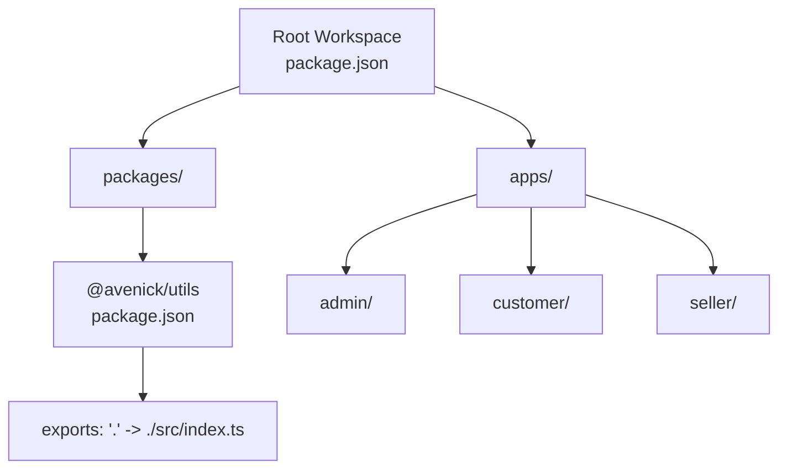
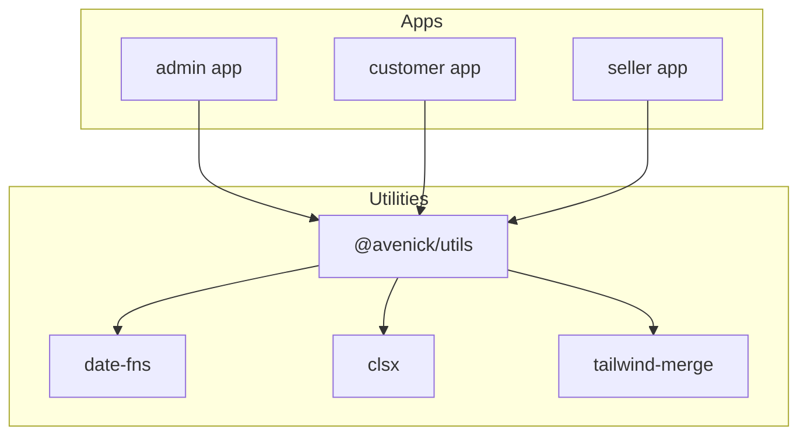
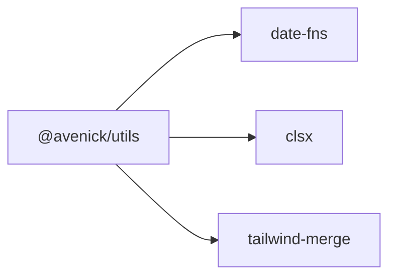

# Utility Functions

<cite>
**Referenced Files in This Document**
- [package.json](file://packages/utils/package.json)
- [turbo.json](file://turbo.json)
- [pnpm-workspace.yaml](file://pnpm-workspace.yaml)
- [package.json](file://package.json)
- [README.md](file://README.md)
</cite>

## Table of Contents
1. [Introduction](#introduction)
2. [Project Structure](#project-structure)
3. [Core Components](#core-components)
4. [Architecture Overview](#architecture-overview)
5. [Detailed Component Analysis](#detailed-component-analysis)
6. [Dependency Analysis](#dependency-analysis)
7. [Performance Considerations](#performance-considerations)
8. [Troubleshooting Guide](#troubleshooting-guide)
9. [Conclusion](#conclusion)
10. [Appendices](#appendices)

## Introduction
This document describes the utilities package in Avenick Commerce, focusing on shared utility functions, helper modules, and common algorithms used across applications. It explains categorization, naming conventions, performance considerations, integration patterns, testing strategies, and backward compatibility practices. Practical examples and guidance for extending the utility library are included.

## Project Structure
The monorepo is organized with a packages directory containing reusable libraries and apps representing the Next.js applications. The utilities package is defined under packages/utils with a single export pointing to its index module. The workspace is configured via pnpm and orchestrated by Turbo.

**Diagram sources**
- [package.json:1-19](file://packages/utils/package.json#L1-L19)
- [pnpm-workspace.yaml:1-14](file://pnpm-workspace.yaml#L1-L14)
- [turbo.json:1-69](file://turbo.json#L1-L69)

**Section sources**
- [package.json:1-19](file://packages/utils/package.json#L1-L19)
- [pnpm-workspace.yaml:1-14](file://pnpm-workspace.yaml#L1-L14)
- [turbo.json:1-69](file://turbo.json#L1-L69)

## Core Components
The utilities package currently defines:
- Package identity and exports: The package name, private flag, and export mapping to the index module.
- Dependencies: date-fns for date/time helpers, clsx for conditional class name composition, and tailwind-merge for Tailwind CSS class merging.
- Dev dependencies: @types/node, TypeScript, and Vitest for type checking and unit testing.

These dependencies indicate the utility library’s focus areas:
- Date/time formatting and manipulation
- Class name composition and merging for UI components
- Tailwind CSS class deduplication and ordering

Integration pattern:
- Applications import from @avenick/utils to consume shared utilities.
- The package is private, so it is intended for internal use within the monorepo.

Naming conventions observed:
- The package name follows the @avenick scope.
- Export mapping uses a single dot (“.”) to refer to the index module.

Backward compatibility considerations:
- As a private package, semantic versioning is not enforced externally.
- Maintain minimal breaking changes; prefer additive APIs and deprecation notices when refactoring.

**Section sources**
- [package.json:1-19](file://packages/utils/package.json#L1-L19)

## Architecture Overview
The utilities package acts as a centralized library consumed by the admin, customer, and seller applications. The Turbo pipeline builds and tests packages and apps consistently, ensuring utilities remain stable across environments.

**Diagram sources**
- [package.json:1-19](file://packages/utils/package.json#L1-L19)
- [turbo.json:1-69](file://turbo.json#L1-L69)

**Section sources**
- [package.json:1-19](file://packages/utils/package.json#L1-L19)
- [turbo.json:1-69](file://turbo.json#L1-L69)

## Detailed Component Analysis
This section outlines how the utilities package supports common tasks across applications, categorized by function families.

### String Manipulation Utilities
Purpose:
- Normalize, format, and transform strings consistently across UI and API layers.

Common patterns:
- Use date-fns for formatting dates and times into locale-aware strings.
- Combine and merge Tailwind classes to avoid duplicates and enforce deterministic order.

Performance considerations:
- Prefer memoized formatters for repeated rendering.
- Avoid unnecessary string concatenations; leverage precomputed templates.

Integration examples:
- Apply date formatting in admin dashboards and customer order history.
- Merge dynamic Tailwind classes for responsive layouts.

Testing strategies:
- Unit tests for format functions with representative inputs and locales.
- Snapshot tests for rendered class strings to prevent regressions.

### Formatting Functions
Purpose:
- Provide consistent number, currency, and percentage formatting across regions.

Common patterns:
- Use date-fns for date/time formatting.
- Compose class names with clsx and merge with tailwind-merge to ensure correctness.

Performance considerations:
- Cache formatters per locale to reduce overhead.
- Minimize DOM reflows by batching class updates.

Integration examples:
- Display prices and totals in customer and seller contexts.
- Render timestamps in admin audit logs.

Testing strategies:
- Parameterized tests covering edge cases (zero, negative, large numbers).
- Locale-specific tests for internationalization.

### Validation Helpers
Purpose:
- Validate inputs for forms, API requests, and business rules.

Common patterns:
- Use date-fns to validate date ranges and formats.
- Combine class composition utilities to validate UI state classes.

Performance considerations:
- Short-circuit validation on invalid types early.
- Use efficient regular expressions and avoid expensive computations.

Integration examples:
- Validate address forms in B2B flows.
- Sanitize and normalize user inputs before persistence.

Testing strategies:
- Exhaustive tests for valid and invalid inputs.
- Fuzzing with malformed data to uncover edge-case bugs.

### Mathematical Calculations
Purpose:
- Perform financial and statistical computations with precision.

Common patterns:
- Use date-fns for time-based calculations (e.g., durations, intervals).
- Combine class utilities to compute derived UI states.

Performance considerations:
- Use integer arithmetic for currency when possible to avoid floating-point errors.
- Cache computed aggregates to avoid recomputation.

Integration examples:
- Compute discount amounts and totals in pricing modules.
- Aggregate metrics for performance dashboards.

Testing strategies:
- Unit tests for formulas with known results.
- Regression tests for boundary conditions.

### UI Class Composition and Merging
Purpose:
- Build robust, maintainable Tailwind CSS class strings.

Common patterns:
- Use clsx to conditionally include classes.
- Use tailwind-merge to resolve conflicts and deduplicate classes.

Performance considerations:
- Avoid excessive class recomposition in hot loops.
- Precompute static class sets outside render paths.

Integration examples:
- Dynamic button styles based on state.
- Responsive layout classes in cards and tables.

Testing strategies:
- Tests for class precedence and conflict resolution.
- Visual regression tests for UI snapshots.

**Section sources**
- [package.json:1-19](file://packages/utils/package.json#L1-L19)

## Dependency Analysis
The utilities package depends on three primary libraries:
- date-fns: Provides date/time parsing, formatting, and manipulation.
- clsx: Composes conditional class names efficiently.
- tailwind-merge: Merges Tailwind classes deterministically.

**Diagram sources**
- [package.json:8-12](file://packages/utils/package.json#L8-L12)

**Section sources**
- [package.json:1-19](file://packages/utils/package.json#L1-L19)

## Performance Considerations
- Prefer memoization for frequently called formatting and validation functions.
- Batch UI class updates to minimize reflows.
- Use efficient data structures for aggregations and caches.
- Avoid heavy computations during rendering; defer to background threads when appropriate.
- Profile and monitor utility usage in production to detect hotspots.

## Troubleshooting Guide
Common issues and resolutions:
- Import failures: Verify the export mapping in the package JSON and ensure consumers import from the correct module path.
- Class conflicts: Use tailwind-merge to resolve conflicting Tailwind classes.
- Date formatting inconsistencies: Standardize on date-fns formatters and locales.
- Test flakiness: Add deterministic seeds and stable mocks for time-dependent utilities.

Testing approaches:
- Unit tests with Vitest for pure functions.
- Snapshot tests for class strings and formatted outputs.
- Integration tests validating end-to-end flows using utilities.

**Section sources**
- [package.json:13-17](file://packages/utils/package.json#L13-L17)

## Conclusion
The @avenick/utils package centralizes shared logic for date/time formatting, class composition, and Tailwind merging. By adopting consistent patterns, rigorous testing, and performance-conscious designs, teams can extend the utility library safely while maintaining backward compatibility within the monorepo.

## Appendices
- Example usage patterns:
  - Date formatting in admin dashboards
  - Conditional class composition for UI components
  - Tailwind class merging for responsive layouts
- Extending the library:
  - Add new modules under src and update exports
  - Write unit and integration tests
  - Document public APIs and migration notes

[No sources needed since this section provides general guidance]