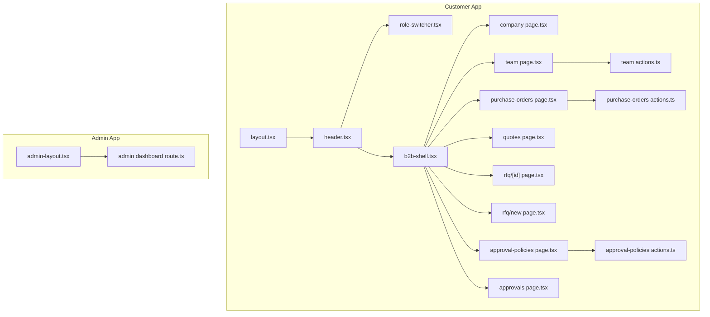
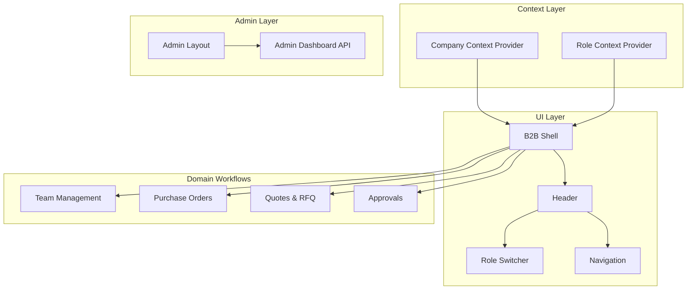
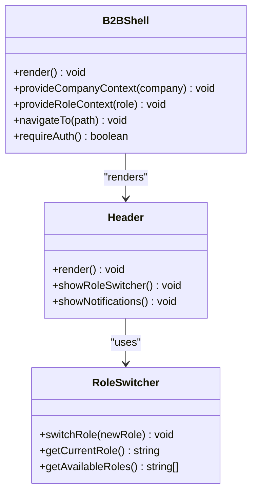
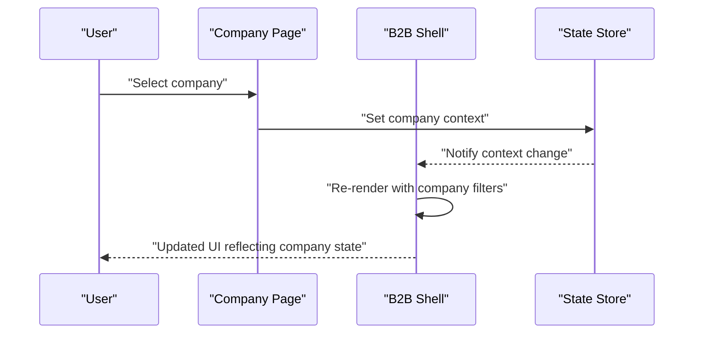
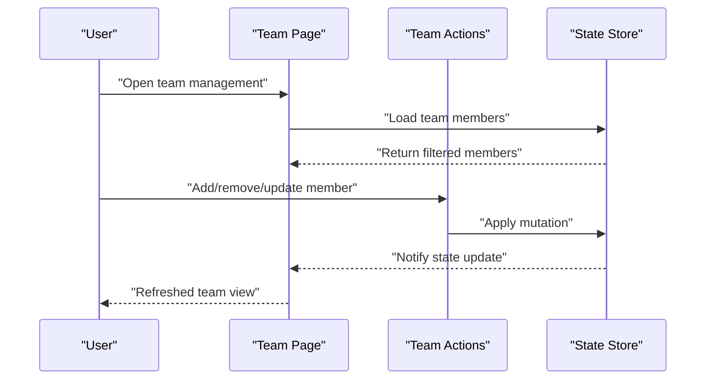
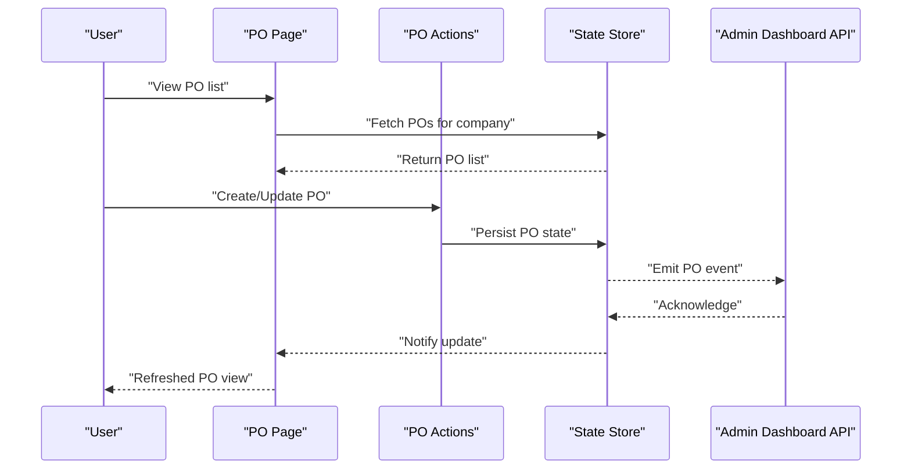
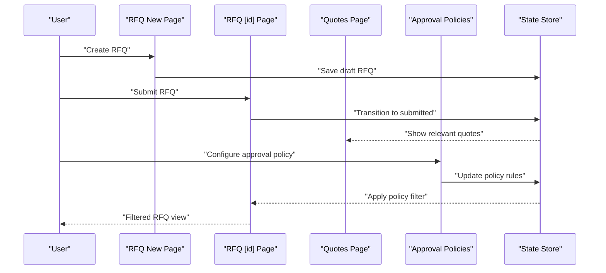
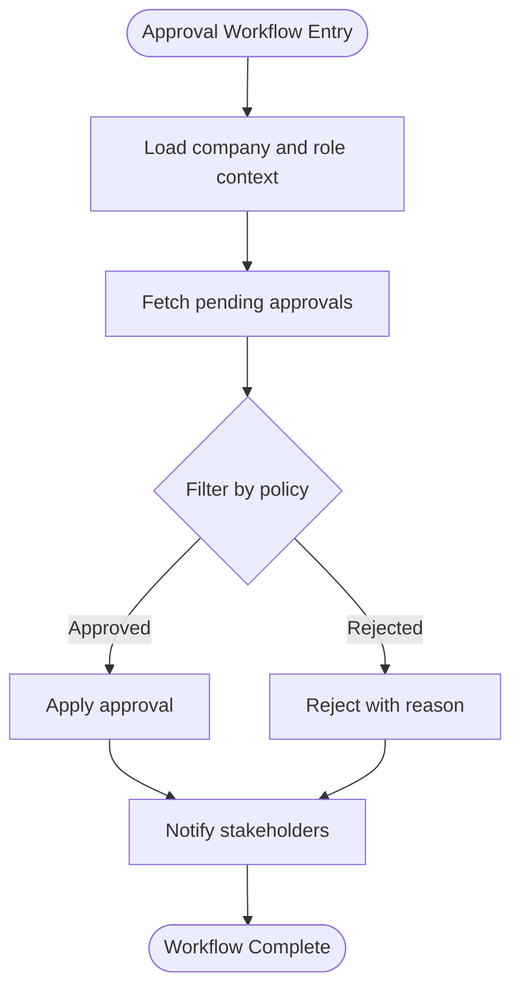
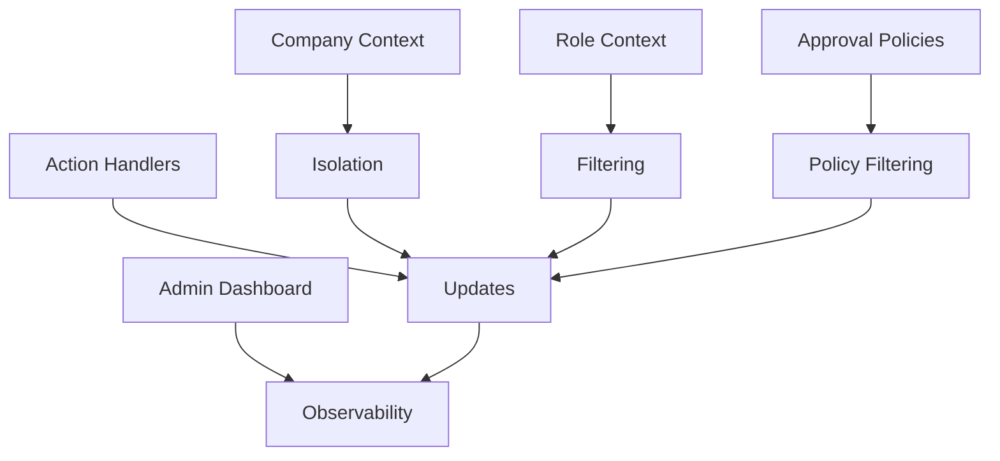
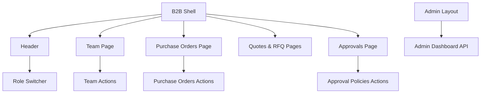

# B2B State Management Patterns

<cite>
**Referenced Files in This Document**
- [b2b-shell.tsx](file://apps/customer/src/components/b2b/b2b-shell.tsx)
- [b2b.ts](file://apps/customer/src/lib/b2b.ts)
- [layout.tsx](file://apps/customer/src/app/layout.tsx)
- [header.tsx](file://apps/customer/src/components/layout/header.tsx)
- [role-switcher.tsx](file://apps/customer/src/components/layout/role-switcher.tsx)
- [company page.tsx](file://apps/customer/src/app/b2b/company/page.tsx)
- [team page.tsx](file://apps/customer/src/app/b2b/team/page.tsx)
- [team actions.ts](file://apps/customer/src/app/b2b/team/actions.ts)
- [purchase-orders page.tsx](file://apps/customer/src/app/b2b/purchase-orders/page.tsx)
- [purchase-orders actions.ts](file://apps/customer/src/app/b2b/purchase-orders/actions.ts)
- [quotes page.tsx](file://apps/customer/src/app/b2b/quotes/page.tsx)
- [rfq page.tsx](file://apps/customer/src/app/b2b/rfq/[id]/page.tsx)
- [rfq new page.tsx](file://apps/customer/src/app/b2b/rfq/new/page.tsx)
- [approval-policies page.tsx](file://apps/customer/src/app/b2b/approval-policies/page.tsx)
- [approval-policies actions.ts](file://apps/customer/src/app/b2b/approval-policies/actions.ts)
- [approvals page.tsx](file://apps/customer/src/app/b2b/approvals/page.tsx)
- [admin-layout.tsx](file://apps/admin/src/app/components/layout/admin-layout.tsx)
- [admin dashboard route.ts](file://apps/admin/src/app/api/admin/dashboard/route.ts)
</cite>

## Table of Contents
1. [Introduction](#introduction)
2. [Project Structure](#project-structure)
3. [Core Components](#core-components)
4. [Architecture Overview](#architecture-overview)
5. [Detailed Component Analysis](#detailed-component-analysis)
6. [Dependency Analysis](#dependency-analysis)
7. [Performance Considerations](#performance-considerations)
8. [Troubleshooting Guide](#troubleshooting-guide)
9. [Conclusion](#conclusion)

## Introduction
This document explains B2B state management patterns in Avenick Commerce, focusing on the B2B shell component architecture, company context handling, and team management state coordination. It details how customer and business contexts synchronize, including company switching, role-based state filtering, and approval workflow state management. The guide also covers state patterns for purchase orders, quoting systems, and team collaboration, with practical examples for implementing company context providers, managing business-specific state updates, and coordinating state across multiple B2B workflows. Guidance on state isolation, context switching, and data consistency in multi-user B2B environments is included.

## Project Structure
The B2B state management spans the customer application’s B2B module, shared layout components, and supporting libraries. Key areas include:
- B2B shell wrapper and context provider
- Company context and role switching
- Team management and collaboration
- Purchase orders and quoting workflows
- Approval policies and approvals

**Diagram sources**
- [layout.tsx:1-200](file://apps/customer/src/app/layout.tsx#L1-L200)
- [header.tsx:1-200](file://apps/customer/src/components/layout/header.tsx#L1-L200)
- [role-switcher.tsx:1-200](file://apps/customer/src/components/layout/role-switcher.tsx#L1-L200)
- [b2b-shell.tsx:1-200](file://apps/customer/src/components/b2b/b2b-shell.tsx#L1-L200)
- [company page.tsx:1-200](file://apps/customer/src/app/b2b/company/page.tsx#L1-L200)
- [team page.tsx:1-200](file://apps/customer/src/app/b2b/team/page.tsx#L1-L200)
- [team actions.ts:1-200](file://apps/customer/src/app/b2b/team/actions.ts#L1-L200)
- [purchase-orders page.tsx:1-200](file://apps/customer/src/app/b2b/purchase-orders/page.tsx#L1-L200)
- [purchase-orders actions.ts:1-200](file://apps/customer/src/app/b2b/purchase-orders/actions.ts#L1-L200)
- [quotes page.tsx:1-200](file://apps/customer/src/app/b2b/quotes/page.tsx#L1-L200)
- [rfq page.tsx:1-200](file://apps/customer/src/app/b2b/rfq/[id]/page.tsx#L1-L200)
- [rfq new page.tsx:1-200](file://apps/customer/src/app/b2b/rfq/new/page.tsx#L1-L200)
- [approval-policies page.tsx:1-200](file://apps/customer/src/app/b2b/approval-policies/page.tsx#L1-L200)
- [approval-policies actions.ts:1-200](file://apps/customer/src/app/b2b/approval-policies/actions.ts#L1-L200)
- [approvals page.tsx:1-200](file://apps/customer/src/app/b2b/approvals/page.tsx#L1-L200)
- [admin-layout.tsx:1-200](file://apps/admin/src/app/components/layout/admin-layout.tsx#L1-L200)
- [admin dashboard route.ts:1-200](file://apps/admin/src/app/api/admin/dashboard/route.ts#L1-L200)

**Section sources**
- [layout.tsx:1-200](file://apps/customer/src/app/layout.tsx#L1-L200)
- [b2b-shell.tsx:1-200](file://apps/customer/src/components/b2b/b2b-shell.tsx#L1-L200)

## Core Components
- B2B Shell: Wraps B2B pages with context providers and navigation, enabling company and role-aware rendering.
- Company Context Provider: Manages current company selection and related state for business workflows.
- Role Switcher: Enables switching roles within a company context, driving role-based state filtering.
- Team Management: Provides state coordination for team members, permissions, and collaboration.
- Purchase Orders: Centralized state for PO creation, updates, and synchronization with supplier workflows.
- Quoting and RFQ: State handling for quote requests, submissions, and approvals.
- Approvals: Workflow state management for policy-driven approvals across purchase orders and RFQs.

**Section sources**
- [b2b-shell.tsx:1-200](file://apps/customer/src/components/b2b/b2b-shell.tsx#L1-L200)
- [b2b.ts:1-200](file://apps/customer/src/lib/b2b.ts#L1-L200)
- [role-switcher.tsx:1-200](file://apps/customer/src/components/layout/role-switcher.tsx#L1-L200)
- [team page.tsx:1-200](file://apps/customer/src/app/b2b/team/page.tsx#L1-L200)
- [team actions.ts:1-200](file://apps/customer/src/app/b2b/team/actions.ts#L1-L200)
- [purchase-orders page.tsx:1-200](file://apps/customer/src/app/b2b/purchase-orders/page.tsx#L1-L200)
- [purchase-orders actions.ts:1-200](file://apps/customer/src/app/b2b/purchase-orders/actions.ts#L1-L200)
- [quotes page.tsx:1-200](file://apps/customer/src/app/b2b/quotes/page.tsx#L1-L200)
- [rfq page.tsx:1-200](file://apps/customer/src/app/b2b/rfq/[id]/page.tsx#L1-L200)
- [rfq new page.tsx:1-200](file://apps/customer/src/app/b2b/rfq/new/page.tsx#L1-L200)
- [approval-policies page.tsx:1-200](file://apps/customer/src/app/b2b/approval-policies/page.tsx#L1-L200)
- [approval-policies actions.ts:1-200](file://apps/customer/src/app/b2b/approval-policies/actions.ts#L1-L200)
- [approvals page.tsx:1-200](file://apps/customer/src/app/b2b/approvals/page.tsx#L1-L200)

## Architecture Overview
The B2B state architecture centers on a shell component that injects company and role context into B2B pages. Navigation and state updates flow through action handlers and shared utilities. Admin dashboards coordinate cross-application visibility for compliance and approvals.

**Diagram sources**
- [b2b-shell.tsx:1-200](file://apps/customer/src/components/b2b/b2b-shell.tsx#L1-L200)
- [header.tsx:1-200](file://apps/customer/src/components/layout/header.tsx#L1-L200)
- [role-switcher.tsx:1-200](file://apps/customer/src/components/layout/role-switcher.tsx#L1-L200)
- [admin-layout.tsx:1-200](file://apps/admin/src/app/components/layout/admin-layout.tsx#L1-L200)
- [admin dashboard route.ts:1-200](file://apps/admin/src/app/api/admin/dashboard/route.ts#L1-L200)

## Detailed Component Analysis

### B2B Shell Component Architecture
The B2B shell acts as a context provider and layout wrapper for B2B pages. It ensures consistent navigation, role-aware rendering, and access to company context across all B2B features.

Key responsibilities:
- Inject company and role context providers
- Render header with role switcher and navigation
- Gate access to B2B routes based on authentication and company context
- Coordinate state updates for team, purchase orders, quotes, and approvals

**Diagram sources**
- [b2b-shell.tsx:1-200](file://apps/customer/src/components/b2b/b2b-shell.tsx#L1-L200)
- [header.tsx:1-200](file://apps/customer/src/components/layout/header.tsx#L1-L200)
- [role-switcher.tsx:1-200](file://apps/customer/src/components/layout/role-switcher.tsx#L1-L200)

**Section sources**
- [b2b-shell.tsx:1-200](file://apps/customer/src/components/b2b/b2b-shell.tsx#L1-L200)
- [header.tsx:1-200](file://apps/customer/src/components/layout/header.tsx#L1-L200)
- [role-switcher.tsx:1-200](file://apps/customer/src/components/layout/role-switcher.tsx#L1-L200)

### Company Context Handling
Company context drives state isolation and filtering across B2B features. The company page coordinates selection and persistence, while the B2B shell consumes this context to tailor UI and workflows.

**Diagram sources**
- [company page.tsx:1-200](file://apps/customer/src/app/b2b/company/page.tsx#L1-L200)
- [b2b-shell.tsx:1-200](file://apps/customer/src/components/b2b/b2b-shell.tsx#L1-L200)

**Section sources**
- [company page.tsx:1-200](file://apps/customer/src/app/b2b/company/page.tsx#L1-L200)
- [b2b-shell.tsx:1-200](file://apps/customer/src/components/b2b/b2b-shell.tsx#L1-L200)

### Team Management State Coordination
Team management coordinates member states, permissions, and collaboration. Actions encapsulate mutations, while the page renders filtered views based on role and company context.

**Diagram sources**
- [team page.tsx:1-200](file://apps/customer/src/app/b2b/team/page.tsx#L1-L200)
- [team actions.ts:1-200](file://apps/customer/src/app/b2b/team/actions.ts#L1-L200)

**Section sources**
- [team page.tsx:1-200](file://apps/customer/src/app/b2b/team/page.tsx#L1-L200)
- [team actions.ts:1-200](file://apps/customer/src/app/b2b/team/actions.ts#L1-L200)

### Purchase Orders State Management
Purchase order state is synchronized across customer and supplier contexts. Actions handle creation, updates, and approval transitions, while the page renders PO lists and details filtered by company and role.

**Diagram sources**
- [purchase-orders page.tsx:1-200](file://apps/customer/src/app/b2b/purchase-orders/page.tsx#L1-L200)
- [purchase-orders actions.ts:1-200](file://apps/customer/src/app/b2b/purchase-orders/actions.ts#L1-L200)
- [admin dashboard route.ts:1-200](file://apps/admin/src/app/api/admin/dashboard/route.ts#L1-L200)

**Section sources**
- [purchase-orders page.tsx:1-200](file://apps/customer/src/app/b2b/purchase-orders/page.tsx#L1-L200)
- [purchase-orders actions.ts:1-200](file://apps/customer/src/app/b2b/purchase-orders/actions.ts#L1-L200)
- [admin dashboard route.ts:1-200](file://apps/admin/src/app/api/admin/dashboard/route.ts#L1-L200)

### Quoting Systems and RFQ State
RFQ and quoting workflows manage request states, submissions, and approvals. The system filters states by company and role, ensuring appropriate visibility and actions.

**Diagram sources**
- [rfq new page.tsx:1-200](file://apps/customer/src/app/b2b/rfq/new/page.tsx#L1-L200)
- [rfq page.tsx:1-200](file://apps/customer/src/app/b2b/rfq/[id]/page.tsx#L1-L200)
- [quotes page.tsx:1-200](file://apps/customer/src/app/b2b/quotes/page.tsx#L1-L200)
- [approval-policies actions.ts:1-200](file://apps/customer/src/app/b2b/approval-policies/actions.ts#L1-L200)

**Section sources**
- [rfq new page.tsx:1-200](file://apps/customer/src/app/b2b/rfq/new/page.tsx#L1-L200)
- [rfq page.tsx:1-200](file://apps/customer/src/app/b2b/rfq/[id]/page.tsx#L1-L200)
- [quotes page.tsx:1-200](file://apps/customer/src/app/b2b/quotes/page.tsx#L1-L200)
- [approval-policies actions.ts:1-200](file://apps/customer/src/app/b2b/approval-policies/actions.ts#L1-L200)

### Approval Workflow State Management
Approvals integrate with company and role contexts to enforce policy-driven transitions. The approvals page aggregates actionable items filtered by current context.

**Diagram sources**
- [approvals page.tsx:1-200](file://apps/customer/src/app/b2b/approvals/page.tsx#L1-L200)
- [approval-policies page.tsx:1-200](file://apps/customer/src/app/b2b/approval-policies/page.tsx#L1-L200)

**Section sources**
- [approvals page.tsx:1-200](file://apps/customer/src/app/b2b/approvals/page.tsx#L1-L200)
- [approval-policies page.tsx:1-200](file://apps/customer/src/app/b2b/approval-policies/page.tsx#L1-L200)

### Conceptual Overview
The B2B state model emphasizes:
- Context isolation per company and role
- Event-driven state updates via actions
- Policy-driven filtering for approvals
- Cross-application admin visibility for oversight

[No sources needed since this diagram shows conceptual workflow, not actual code structure]

[No sources needed since this section doesn't analyze specific source files]

## Dependency Analysis
B2B state management depends on:
- Shared layout components for consistent navigation and role switching
- Action modules for domain-specific mutations
- Admin APIs for cross-application observability
- Context providers for company and role scoping

**Diagram sources**
- [b2b-shell.tsx:1-200](file://apps/customer/src/components/b2b/b2b-shell.tsx#L1-L200)
- [header.tsx:1-200](file://apps/customer/src/components/layout/header.tsx#L1-L200)
- [role-switcher.tsx:1-200](file://apps/customer/src/components/layout/role-switcher.tsx#L1-L200)
- [team page.tsx:1-200](file://apps/customer/src/app/b2b/team/page.tsx#L1-L200)
- [team actions.ts:1-200](file://apps/customer/src/app/b2b/team/actions.ts#L1-L200)
- [purchase-orders page.tsx:1-200](file://apps/customer/src/app/b2b/purchase-orders/page.tsx#L1-L200)
- [purchase-orders actions.ts:1-200](file://apps/customer/src/app/b2b/purchase-orders/actions.ts#L1-L200)
- [quotes page.tsx:1-200](file://apps/customer/src/app/b2b/quotes/page.tsx#L1-L200)
- [rfq page.tsx:1-200](file://apps/customer/src/app/b2b/rfq/[id]/page.tsx#L1-L200)
- [rfq new page.tsx:1-200](file://apps/customer/src/app/b2b/rfq/new/page.tsx#L1-L200)
- [approvals page.tsx:1-200](file://apps/customer/src/app/b2b/approvals/page.tsx#L1-L200)
- [approval-policies actions.ts:1-200](file://apps/customer/src/app/b2b/approval-policies/actions.ts#L1-L200)
- [admin-layout.tsx:1-200](file://apps/admin/src/app/components/layout/admin-layout.tsx#L1-L200)
- [admin dashboard route.ts:1-200](file://apps/admin/src/app/api/admin/dashboard/route.ts#L1-L200)

**Section sources**
- [b2b-shell.tsx:1-200](file://apps/customer/src/components/b2b/b2b-shell.tsx#L1-L200)
- [header.tsx:1-200](file://apps/customer/src/components/layout/header.tsx#L1-L200)
- [role-switcher.tsx:1-200](file://apps/customer/src/components/layout/role-switcher.tsx#L1-L200)
- [team page.tsx:1-200](file://apps/customer/src/app/b2b/team/page.tsx#L1-L200)
- [team actions.ts:1-200](file://apps/customer/src/app/b2b/team/actions.ts#L1-L200)
- [purchase-orders page.tsx:1-200](file://apps/customer/src/app/b2b/purchase-orders/page.tsx#L1-L200)
- [purchase-orders actions.ts:1-200](file://apps/customer/src/app/b2b/purchase-orders/actions.ts#L1-L200)
- [quotes page.tsx:1-200](file://apps/customer/src/app/b2b/quotes/page.tsx#L1-L200)
- [rfq page.tsx:1-200](file://apps/customer/src/app/b2b/rfq/[id]/page.tsx#L1-L200)
- [rfq new page.tsx:1-200](file://apps/customer/src/app/b2b/rfq/new/page.tsx#L1-L200)
- [approvals page.tsx:1-200](file://apps/customer/src/app/b2b/approvals/page.tsx#L1-L200)
- [approval-policies actions.ts:1-200](file://apps/customer/src/app/b2b/approval-policies/actions.ts#L1-L200)
- [admin-layout.tsx:1-200](file://apps/admin/src/app/components/layout/admin-layout.tsx#L1-L200)
- [admin dashboard route.ts:1-200](file://apps/admin/src/app/api/admin/dashboard/route.ts#L1-L200)

## Performance Considerations
- Minimize re-renders by scoping state updates to affected components within the B2B shell.
- Use selective fetching and caching for company-specific data to reduce network overhead.
- Debounce frequent actions (e.g., team member updates) to avoid redundant state transitions.
- Leverage role-based filtering client-side to reduce server load and improve responsiveness.

[No sources needed since this section provides general guidance]

## Troubleshooting Guide
Common issues and resolutions:
- Company context not persisting: Verify the company context provider is initialized early in the shell and that state updates are dispatched after context selection.
- Role-based UI not updating: Ensure the role switcher triggers context refresh and that dependent components subscribe to role changes.
- Approval state inconsistencies: Confirm approval policy actions are applied before state transitions and that admin dashboard events are acknowledged before rendering updated states.
- Team state desynchronization: Validate that team actions are idempotent and that state updates are batched to prevent race conditions.

**Section sources**
- [b2b-shell.tsx:1-200](file://apps/customer/src/components/b2b/b2b-shell.tsx#L1-L200)
- [role-switcher.tsx:1-200](file://apps/customer/src/components/layout/role-switcher.tsx#L1-L200)
- [team actions.ts:1-200](file://apps/customer/src/app/b2b/team/actions.ts#L1-L200)
- [approval-policies actions.ts:1-200](file://apps/customer/src/app/b2b/approval-policies/actions.ts#L1-L200)

## Conclusion
Avenick Commerce implements robust B2B state management through a shell-based architecture that isolates company and role contexts, synchronizes state across workflows, and integrates with admin oversight. By following the patterns outlined—context providers, action-driven updates, policy-based filtering, and coordinated admin visibility—teams can maintain consistency and scalability in multi-user B2B environments.