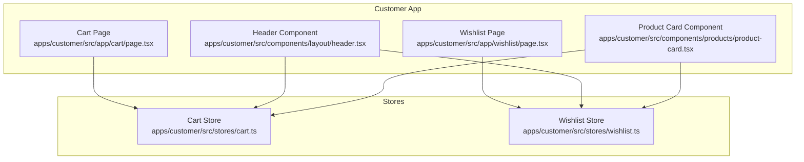
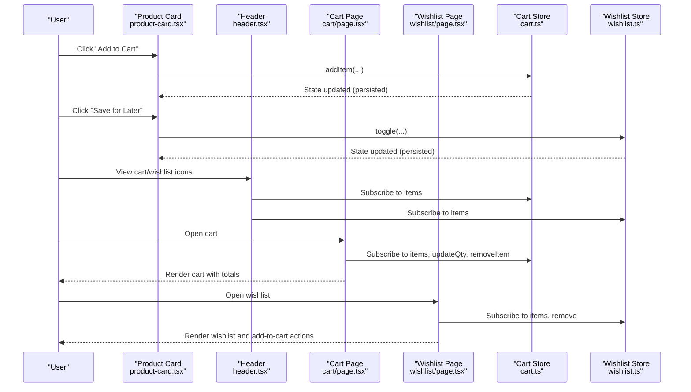
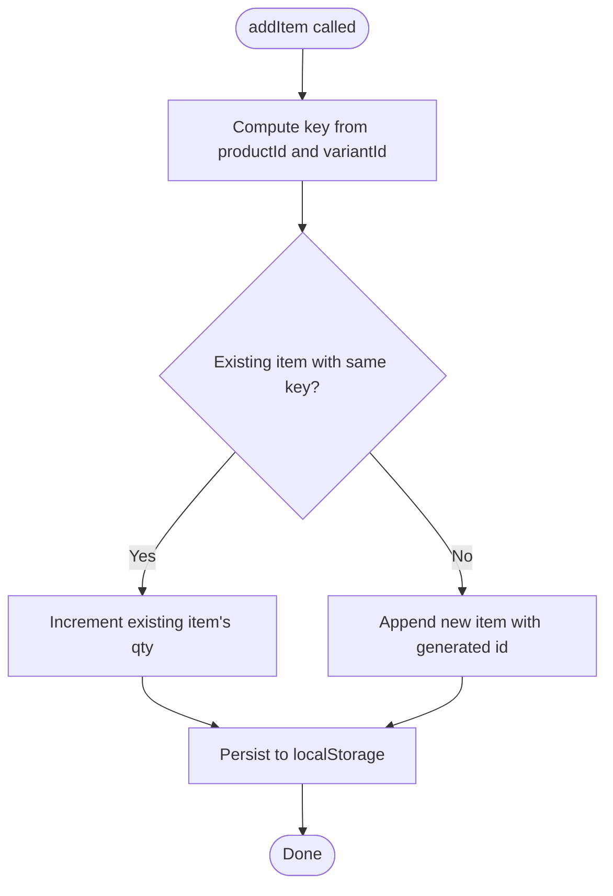
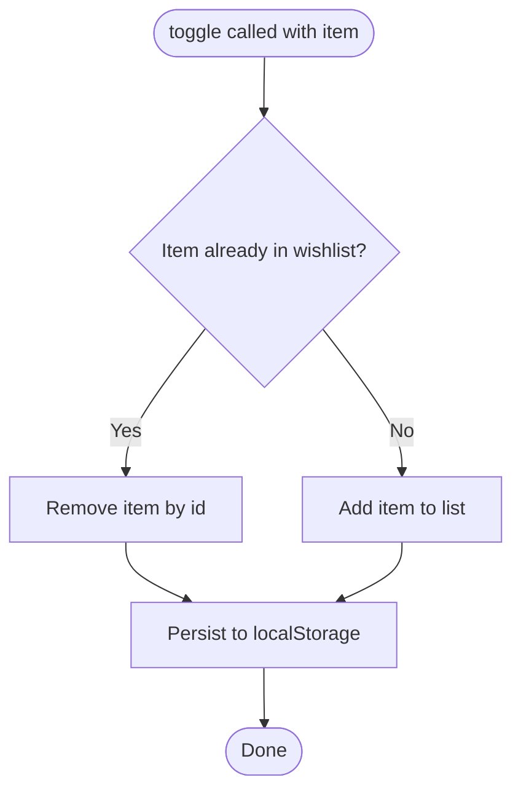
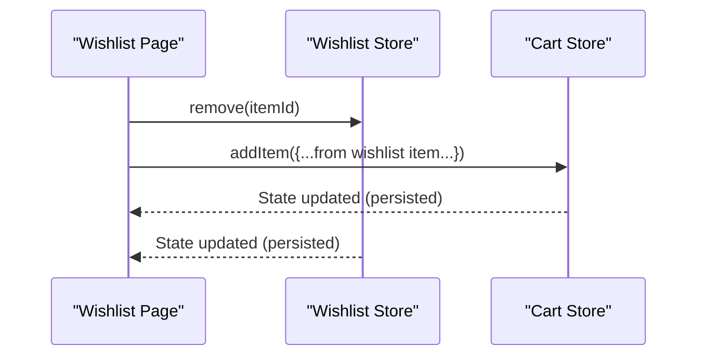
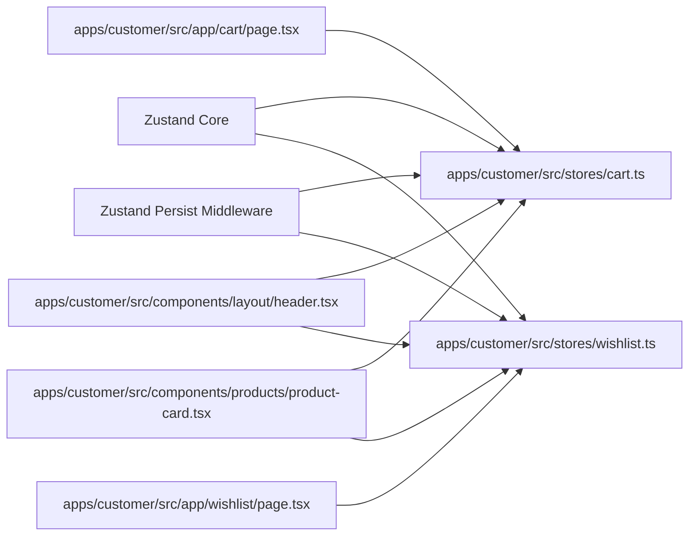

# Cart & Wishlist State Management

<cite>
**Referenced Files in This Document**
- [cart.ts](file://apps/customer/src/stores/cart.ts)
- [wishlist.ts](file://apps/customer/src/stores/wishlist.ts)
- [page.tsx](file://apps/customer/src/app/cart/page.tsx)
- [page.tsx](file://apps/customer/src/app/wishlist/page.tsx)
- [header.tsx](file://apps/customer/src/components/layout/header.tsx)
- [product-card.tsx](file://apps/customer/src/components/products/product-card.tsx)
</cite>

## Table of Contents
1. [Introduction](#introduction)
2. [Project Structure](#project-structure)
3. [Core Components](#core-components)
4. [Architecture Overview](#architecture-overview)
5. [Detailed Component Analysis](#detailed-component-analysis)
6. [Dependency Analysis](#dependency-analysis)
7. [Performance Considerations](#performance-considerations)
8. [Troubleshooting Guide](#troubleshooting-guide)
9. [Conclusion](#conclusion)

## Introduction
This document explains the cart and wishlist state management in Avenick Commerce, focusing on the Zustand-based implementation for shopping cart functionality and the wishlist system. It covers the CartItem and WishlistItem interfaces, store actions, persistence via localStorage, state synchronization patterns, and integration with the broader application state. Practical examples demonstrate adding items, updating quantities, removing items, applying promotions, and moving items between cart and wishlist. Guidance is also provided for performance considerations, state hydration from localStorage, and cross-store interactions.

## Project Structure
The state management is implemented in two dedicated Zustand stores located under the customer application:
- Cart store: manages shopping cart items, totals, and persistence
- Wishlist store: manages saved items and persistence

These stores are consumed by dedicated pages and shared UI components.

**Diagram sources**
- [cart.ts](file://apps/customer/src/stores/cart.ts)
- [wishlist.ts](file://apps/customer/src/stores/wishlist.ts)
- [page.tsx](file://apps/customer/src/app/cart/page.tsx)
- [page.tsx](file://apps/customer/src/app/wishlist/page.tsx)
- [header.tsx](file://apps/customer/src/components/layout/header.tsx)
- [product-card.tsx](file://apps/customer/src/components/products/product-card.tsx)

**Section sources**
- [cart.ts](file://apps/customer/src/stores/cart.ts)
- [wishlist.ts](file://apps/customer/src/stores/wishlist.ts)
- [page.tsx](file://apps/customer/src/app/cart/page.tsx)
- [page.tsx](file://apps/customer/src/app/wishlist/page.tsx)

## Core Components
This section introduces the data models and store interfaces that define cart and wishlist behavior.

- CartItem interface
  - Fields: identifiers, product metadata, pricing, quantity, seller, and currency
  - Used to represent individual items in the shopping cart
  - See [cart.ts](file://apps/customer/src/stores/cart.ts)

- CartStore actions
  - addItem: adds a new item or increments quantity if the same product/variant exists
  - updateQty: updates item quantity; removes item if quantity drops to zero
  - removeItem: deletes an item by ID
  - clearCart: empties the cart
  - total: computes the monetary total across items
  - itemCount: counts total units across items
  - See [cart.ts](file://apps/customer/src/stores/cart.ts)

- WishlistItem interface
  - Fields: identifiers, product metadata, pricing, stock status, seller, and currency
  - Used to represent saved items in the wishlist
  - See [wishlist.ts](file://apps/customer/src/stores/wishlist.ts)

- WishlistStore actions
  - toggle: adds or removes an item by ID
  - has: checks if an item is present
  - remove: deletes an item by ID
  - clear: empties the wishlist
  - See [wishlist.ts](file://apps/customer/src/stores/wishlist.ts)

Persistence
- Both stores use Zustand’s persist middleware with distinct storage keys:
  - Cart: "avenick-cart"
  - Wishlist: "avenick-wishlist"
- This ensures cart and wishlist data persist across browser sessions independently.

**Section sources**
- [cart.ts](file://apps/customer/src/stores/cart.ts)
- [wishlist.ts](file://apps/customer/src/stores/wishlist.ts)

## Architecture Overview
The cart and wishlist systems are coordinated through Zustand stores and consumed by React components. The stores encapsulate state and side effects (persistence), while pages and components subscribe to the relevant slices of state.

**Diagram sources**
- [cart.ts](file://apps/customer/src/stores/cart.ts)
- [wishlist.ts](file://apps/customer/src/stores/wishlist.ts)
- [page.tsx](file://apps/customer/src/app/cart/page.tsx)
- [page.tsx](file://apps/customer/src/app/wishlist/page.tsx)
- [header.tsx](file://apps/customer/src/components/layout/header.tsx)
- [product-card.tsx](file://apps/customer/src/components/products/product-card.tsx)

## Detailed Component Analysis

### Cart Store Implementation
The cart store defines the CartItem model and exposes actions to manage items, compute totals, and persist state.

Key behaviors
- Item identification and grouping
  - Items are grouped by productId and variantId to merge duplicates
  - See [cart.ts](file://apps/customer/src/stores/cart.ts)

- Quantity updates
  - updateQty enforces non-positive quantities by removing the item
  - See [cart.ts](file://apps/customer/src/stores/cart.ts)

- Totals computation
  - total multiplies unitPrice by qty per item and sums across the cart
  - itemCount sums quantities for quick UI counters
  - See [cart.ts](file://apps/customer/src/stores/cart.ts)

- Persistence
  - Uses persist middleware with storage key "avenick-cart"
  - Automatically hydrates state on mount
  - See [cart.ts](file://apps/customer/src/stores/cart.ts)

Integration points
- Cart page subscribes to items, updateQty, removeItem, and total
- The cart page also demonstrates promotional discount logic and shipping rules
  - See [page.tsx](file://apps/customer/src/app/cart/page.tsx)

**Diagram sources**
- [cart.ts](file://apps/customer/src/stores/cart.ts)

**Section sources**
- [cart.ts](file://apps/customer/src/stores/cart.ts)
- [page.tsx](file://apps/customer/src/app/cart/page.tsx)

### Wishlist Store Implementation
The wishlist store defines the WishlistItem model and exposes actions to toggle items, check presence, remove items, and clear the list.

Key behaviors
- Toggle logic
  - Adds item if absent; removes item if present
  - See [wishlist.ts](file://apps/customer/src/stores/wishlist.ts)

- Presence checks
  - has returns whether an item exists by ID
  - See [wishlist.ts](file://apps/customer/src/stores/wishlist.ts)

- Persistence
  - Uses persist middleware with storage key "avenick-wishlist"
  - Hydrates state automatically on mount
  - See [wishlist.ts](file://apps/customer/src/stores/wishlist.ts)

Integration points
- Wishlist page subscribes to items and remove
- Wishlist page uses cart store’s addItem to move items to cart
  - See [page.tsx](file://apps/customer/src/app/wishlist/page.tsx)

**Diagram sources**
- [wishlist.ts](file://apps/customer/src/stores/wishlist.ts)

**Section sources**
- [wishlist.ts](file://apps/customer/src/stores/wishlist.ts)
- [page.tsx](file://apps/customer/src/app/wishlist/page.tsx)

### Cross-Store Interactions
The cart and wishlist stores interact through direct store subscriptions in pages:
- From the wishlist page, items can be added to the cart using the cart store’s addItem action
- From the cart page, items can be saved for later by toggling the wishlist store
- These interactions are visible in the respective page components

**Diagram sources**
- [page.tsx](file://apps/customer/src/app/wishlist/page.tsx)
- [cart.ts](file://apps/customer/src/stores/cart.ts)
- [wishlist.ts](file://apps/customer/src/stores/wishlist.ts)

**Section sources**
- [page.tsx](file://apps/customer/src/app/wishlist/page.tsx)
- [page.tsx](file://apps/customer/src/app/cart/page.tsx)

### UI Integration Examples
Practical usage patterns observed in the application:

- Cart page
  - Subscribes to items, updateQty, removeItem, and total
  - Computes and displays subtotal, VAT, shipping, and order total
  - Provides promo code application and “save for later” functionality
  - Reference: [page.tsx](file://apps/customer/src/app/cart/page.tsx)

- Wishlist page
  - Subscribes to items and remove
  - Adds selected items to the cart via cart store
  - Provides “add all to cart” for in-stock items
  - Reference: [page.tsx](file://apps/customer/src/app/wishlist/page.tsx)

- Shared components
  - Header and product card components consume both stores for cart and wishlist indicators
  - References: [header.tsx](file://apps/customer/src/components/layout/header.tsx), [product-card.tsx](file://apps/customer/src/components/products/product-card.tsx)

**Section sources**
- [page.tsx](file://apps/customer/src/app/cart/page.tsx)
- [page.tsx](file://apps/customer/src/app/wishlist/page.tsx)
- [header.tsx](file://apps/customer/src/components/layout/header.tsx)
- [product-card.tsx](file://apps/customer/src/components/products/product-card.tsx)

## Dependency Analysis
The stores depend on Zustand and its persist middleware. Pages and components depend on the stores for state and actions. There is minimal coupling between stores; cross-store operations are performed at the component level.

**Diagram sources**
- [cart.ts](file://apps/customer/src/stores/cart.ts)
- [wishlist.ts](file://apps/customer/src/stores/wishlist.ts)
- [page.tsx](file://apps/customer/src/app/cart/page.tsx)
- [page.tsx](file://apps/customer/src/app/wishlist/page.tsx)
- [header.tsx](file://apps/customer/src/components/layout/header.tsx)
- [product-card.tsx](file://apps/customer/src/components/products/product-card.tsx)

**Section sources**
- [cart.ts](file://apps/customer/src/stores/cart.ts)
- [wishlist.ts](file://apps/customer/src/stores/wishlist.ts)
- [page.tsx](file://apps/customer/src/app/cart/page.tsx)
- [page.tsx](file://apps/customer/src/app/wishlist/page.tsx)
- [header.tsx](file://apps/customer/src/components/layout/header.tsx)
- [product-card.tsx](file://apps/customer/src/components/products/product-card.tsx)

## Performance Considerations
- Store granularity
  - Separate stores reduce unnecessary re-renders by allowing components to subscribe to only the state they need
- Computed values
  - total and itemCount are computed on demand; cache results at render boundaries if needed for heavy computations
- Persistence overhead
  - persist middleware serializes state on every change; batch UI updates to minimize frequent writes
- Rendering optimization
  - Memoize derived values (e.g., formatted totals) and avoid deep equality checks in components
- Hydration timing
  - State hydration occurs on mount; ensure UI gracefully handles empty initial state until hydration completes

## Troubleshooting Guide
Common issues and resolutions:
- Items not persisting across sessions
  - Verify localStorage availability and quota limits
  - Confirm the correct storage keys are used ("avenick-cart", "avenick-wishlist")
  - Ensure the persist middleware is configured and imported correctly
  - References: [cart.ts](file://apps/customer/src/stores/cart.ts), [wishlist.ts](file://apps/customer/src/stores/wishlist.ts)

- Duplicate items not merging
  - Ensure the key is computed consistently using productId and variantId
  - Reference: [cart.ts](file://apps/customer/src/stores/cart.ts)

- Quantity resets unexpectedly
  - updateQty removes items when quantity reaches zero; confirm UI does not call updateQty with non-positive values unintentionally
  - Reference: [cart.ts](file://apps/customer/src/stores/cart.ts)

- Cross-store sync issues
  - When moving items between stores, ensure both stores are subscribed and actions are dispatched in the correct order
  - References: [page.tsx](file://apps/customer/src/app/cart/page.tsx), [page.tsx](file://apps/customer/src/app/wishlist/page.tsx)

- Hydration mismatches
  - On the server, initial state may be empty; hydrate on the client and guard UI rendering until hydration completes
  - References: [cart.ts](file://apps/customer/src/stores/cart.ts), [wishlist.ts](file://apps/customer/src/stores/wishlist.ts)

**Section sources**
- [cart.ts](file://apps/customer/src/stores/cart.ts)
- [wishlist.ts](file://apps/customer/src/stores/wishlist.ts)
- [page.tsx](file://apps/customer/src/app/cart/page.tsx)
- [page.tsx](file://apps/customer/src/app/wishlist/page.tsx)

## Conclusion
Avenick Commerce implements robust cart and wishlist state management using Zustand with persistent storage. The cart store supports item addition, quantity updates, removal, clearing, and totals computation, while the wishlist store enables toggling, checking presence, and removal of saved items. The stores integrate seamlessly with pages and shared components, enabling smooth user experiences such as saving items for later and moving them to the cart. Following the outlined patterns ensures reliable state persistence, efficient updates, and maintainable cross-store interactions.