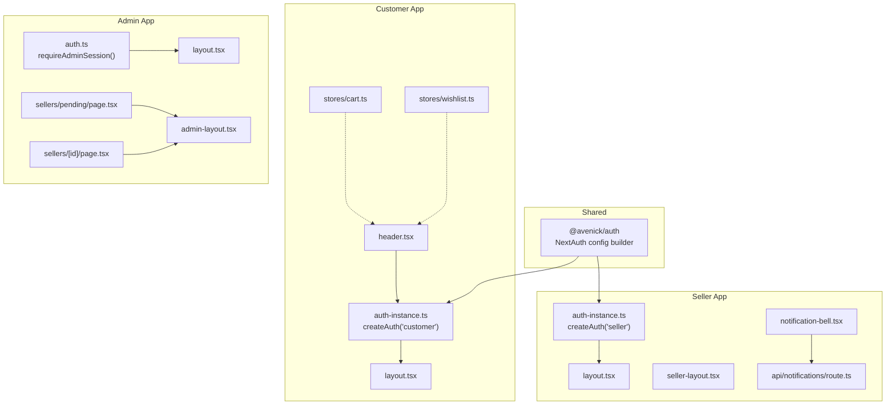
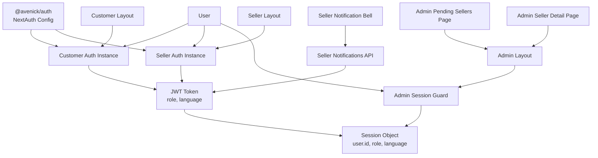
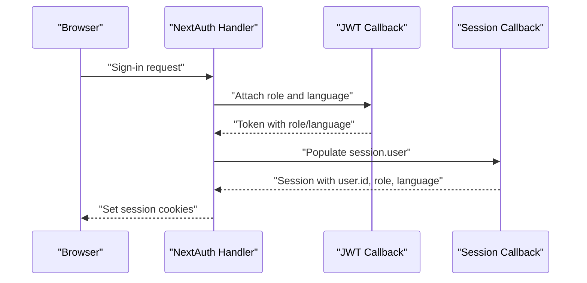
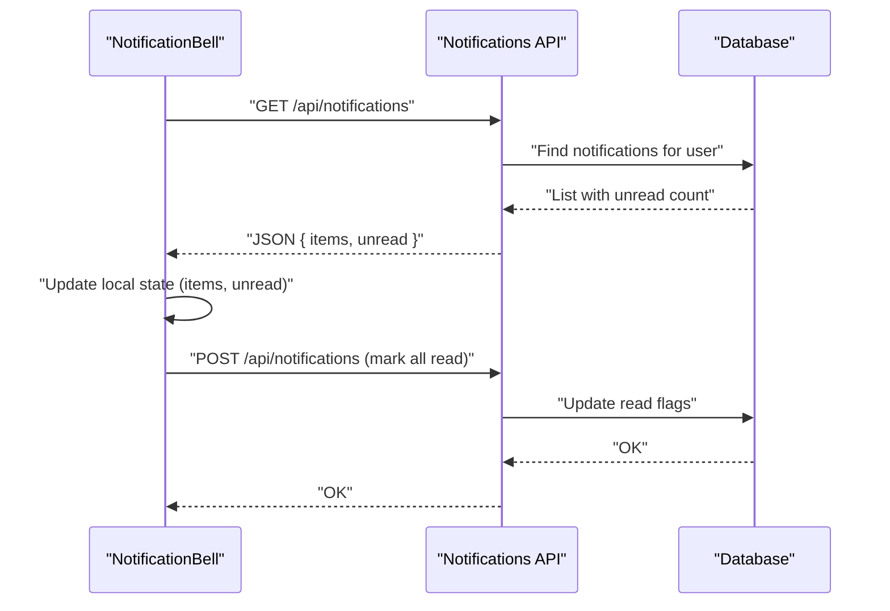
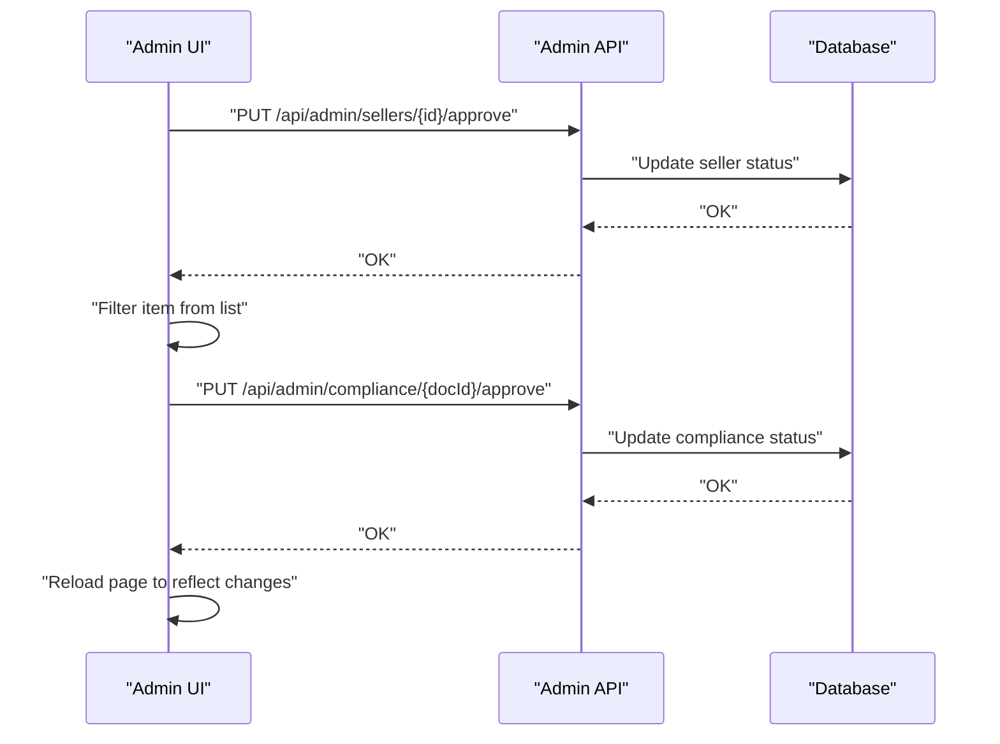
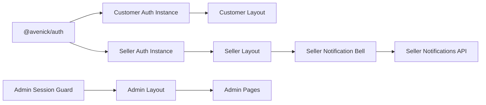

# Global State Coordination

<cite>
**Referenced Files in This Document**
- [config.ts](file://packages/auth/src/config.ts)
- [auth-instance.ts (customer)](file://apps/customer/src/lib/auth-instance.ts)
- [auth-instance.ts (seller)](file://apps/seller/src/lib/auth-instance.ts)
- [auth.ts (admin)](file://apps/admin/src/lib/auth.ts)
- [layout.tsx (admin)](file://apps/admin/src/app/layout.tsx)
- [layout.tsx (customer)](file://apps/customer/src/app/layout.tsx)
- [admin-layout.tsx](file://apps/admin/src/components/layout/admin-layout.tsx)
- [seller-layout.tsx](file://apps/seller/src/components/layout/seller-layout.tsx)
- [header.tsx (customer)](file://apps/customer/src/components/layout/header.tsx)
- [notification-bell.tsx](file://apps/seller/src/components/notification-bell.tsx)
- [route.ts (seller notifications API)](file://apps/seller/src/app/api/notifications/route.ts)
- [page.tsx (admin pending sellers)](file://apps/admin/src/app/sellers/pending/page.tsx)
- [page.tsx (admin seller detail)](file://apps/admin/src/app/sellers/[id]/page.tsx)
- [cart.ts](file://apps/customer/src/stores/cart.ts)
- [wishlist.ts](file://apps/customer/src/stores/wishlist.ts)
</cite>

## Table of Contents
1. [Introduction](#introduction)
2. [Project Structure](#project-structure)
3. [Core Components](#core-components)
4. [Architecture Overview](#architecture-overview)
5. [Detailed Component Analysis](#detailed-component-analysis)
6. [Dependency Analysis](#dependency-analysis)
7. [Performance Considerations](#performance-considerations)
8. [Troubleshooting Guide](#troubleshooting-guide)
9. [Conclusion](#conclusion)

## Introduction
This document explains how global state is coordinated across Avenick Commerce applications. It focuses on inter-application state sharing patterns, authentication state synchronization, and cross-application data consistency mechanisms. It also covers the role of layout components in state management, including navigation state, user session management, and application-wide preferences. The coordination model spans the customer, seller, and admin portals, with shared authentication state, notification systems, and global UI state. Guidance is included for implementing cross-application state updates, handling state conflicts, maintaining consistency across different user roles, performance optimization for state synchronization, and debugging techniques for cross-application state issues.

## Project Structure
The Avenick Commerce monorepo organizes applications by domain (customer, seller, admin) and a shared authentication package. Authentication is centralized via a shared package that builds NextAuth configurations per application. Each app defines its own authentication instance and layout components. The customer portal exposes application-wide stores for cart and wishlist. The seller portal provides a notification bell component that polls for unread counts and refreshes UI state. The admin portal coordinates cross-application state through server-side APIs and layout components.

**Diagram sources**
- [config.ts:39-93](file://packages/auth/src/config.ts#L39-L93)
- [auth-instance.ts (customer):1-3](file://apps/customer/src/lib/auth-instance.ts#L1-L3)
- [auth-instance.ts (seller):1-3](file://apps/seller/src/lib/auth-instance.ts#L1-L3)
- [auth.ts (admin):1-10](file://apps/admin/src/lib/auth.ts#L1-L10)
- [layout.tsx (admin)](file://apps/admin/src/app/layout.tsx)
- [layout.tsx (customer)](file://apps/customer/src/app/layout.tsx)
- [admin-layout.tsx](file://apps/admin/src/components/layout/admin-layout.tsx)
- [seller-layout.tsx](file://apps/seller/src/components/layout/seller-layout.tsx)
- [header.tsx (customer)](file://apps/customer/src/components/layout/header.tsx)
- [notification-bell.tsx:1-74](file://apps/seller/src/components/notification-bell.tsx#L1-L74)
- [route.ts (seller notifications API):1-32](file://apps/seller/src/app/api/notifications/route.ts#L1-L32)
- [page.tsx (admin pending sellers):1-131](file://apps/admin/src/app/sellers/pending/page.tsx#L1-L131)
- [page.tsx (admin seller detail):1-37](file://apps/admin/src/app/sellers/[id]/page.tsx#L1-L37)
- [cart.ts](file://apps/customer/src/stores/cart.ts)
- [wishlist.ts](file://apps/customer/src/stores/wishlist.ts)

**Section sources**
- [config.ts:39-93](file://packages/auth/src/config.ts#L39-L93)
- [auth-instance.ts (customer):1-3](file://apps/customer/src/lib/auth-instance.ts#L1-L3)
- [auth-instance.ts (seller):1-3](file://apps/seller/src/lib/auth-instance.ts#L1-L3)
- [auth.ts (admin):1-10](file://apps/admin/src/lib/auth.ts#L1-L10)
- [layout.tsx (admin)](file://apps/admin/src/app/layout.tsx)
- [layout.tsx (customer)](file://apps/customer/src/app/layout.tsx)
- [admin-layout.tsx](file://apps/admin/src/components/layout/admin-layout.tsx)
- [seller-layout.tsx](file://apps/seller/src/components/layout/seller-layout.tsx)
- [header.tsx (customer)](file://apps/customer/src/components/layout/header.tsx)
- [notification-bell.tsx:1-74](file://apps/seller/src/components/notification-bell.tsx#L1-L74)
- [route.ts (seller notifications API):1-32](file://apps/seller/src/app/api/notifications/route.ts#L1-L32)
- [page.tsx (admin pending sellers):1-131](file://apps/admin/src/app/sellers/pending/page.tsx#L1-L131)
- [page.tsx (admin seller detail):1-37](file://apps/admin/src/app/sellers/[id]/page.tsx#L1-L37)
- [cart.ts](file://apps/customer/src/stores/cart.ts)
- [wishlist.ts](file://apps/customer/src/stores/wishlist.ts)

## Core Components
- Shared authentication configuration: Centralized NextAuth setup with JWT strategy, cookie naming per app, and session callbacks to propagate role and language to the session token and session object.
- Application-specific authentication instances: Each app creates its own NextAuth handler and hooks using the shared configuration builder.
- Layout components: Provide navigation state and render application-wide UI elements. Admin and seller layouts expose counters and menus; customer header integrates with authentication state.
- Notification system: Seller portal includes a notification bell that polls unread counts and marks notifications as read.
- Cross-application state updates: Admin pages update state server-side and reflect changes client-side; customer stores manage shopping cart and wishlist state.

Key implementation patterns:
- Authentication state synchronization: JWT callbacks synchronize role and language across sessions.
- Navigation state: Layouts maintain active routes and counts (e.g., pending seller reviews).
- Global UI state: Notification bell maintains unread count and local UI state.
- Cross-app data consistency: Admin APIs update backend state; client components re-render with updated data.

**Section sources**
- [config.ts:39-93](file://packages/auth/src/config.ts#L39-L93)
- [auth-instance.ts (customer):1-3](file://apps/customer/src/lib/auth-instance.ts#L1-L3)
- [auth-instance.ts (seller):1-3](file://apps/seller/src/lib/auth-instance.ts#L1-L3)
- [admin-layout.tsx](file://apps/admin/src/components/layout/admin-layout.tsx)
- [seller-layout.tsx](file://apps/seller/src/components/layout/seller-layout.tsx)
- [header.tsx (customer)](file://apps/customer/src/components/layout/header.tsx)
- [notification-bell.tsx:1-74](file://apps/seller/src/components/notification-bell.tsx#L1-L74)
- [route.ts (seller notifications API):1-32](file://apps/seller/src/app/api/notifications/route.ts#L1-L32)
- [page.tsx (admin pending sellers):1-131](file://apps/admin/src/app/sellers/pending/page.tsx#L1-L131)
- [page.tsx (admin seller detail):1-37](file://apps/admin/src/app/sellers/[id]/page.tsx#L1-L37)
- [cart.ts](file://apps/customer/src/stores/cart.ts)
- [wishlist.ts](file://apps/customer/src/stores/wishlist.ts)

## Architecture Overview
The global state coordination architecture centers on shared authentication and per-app state management. Authentication tokens carry role and language, enabling consistent user identity across apps. Layouts and components maintain UI state and trigger cross-app updates via server APIs.

**Diagram sources**
- [config.ts:39-93](file://packages/auth/src/config.ts#L39-L93)
- [auth-instance.ts (customer):1-3](file://apps/customer/src/lib/auth-instance.ts#L1-L3)
- [auth-instance.ts (seller):1-3](file://apps/seller/src/lib/auth-instance.ts#L1-L3)
- [auth.ts (admin):1-10](file://apps/admin/src/lib/auth.ts#L1-L10)
- [layout.tsx (admin)](file://apps/admin/src/app/layout.tsx)
- [layout.tsx (customer)](file://apps/customer/src/app/layout.tsx)
- [admin-layout.tsx](file://apps/admin/src/components/layout/admin-layout.tsx)
- [seller-layout.tsx](file://apps/seller/src/components/layout/seller-layout.tsx)
- [notification-bell.tsx:1-74](file://apps/seller/src/components/notification-bell.tsx#L1-L74)
- [route.ts (seller notifications API):1-32](file://apps/seller/src/app/api/notifications/route.ts#L1-L32)
- [page.tsx (admin pending sellers):1-131](file://apps/admin/src/app/sellers/pending/page.tsx#L1-L131)
- [page.tsx (admin seller detail):1-37](file://apps/admin/src/app/sellers/[id]/page.tsx#L1-L37)

## Detailed Component Analysis

### Authentication State Synchronization
The shared authentication package builds a NextAuth configuration with:
- Cookie naming per application to avoid conflicts.
- JWT callbacks to attach role and language to the token.
- Session callbacks to populate session.user with id, role, and language.
- A default shared instance for backward compatibility.

Application-specific instances:
- Customer app uses the shared package to create its own auth hooks.
- Seller app mirrors the pattern with its own instance.
- Admin guards session and enforces role checks.

**Diagram sources**
- [config.ts:39-93](file://packages/auth/src/config.ts#L39-L93)
- [auth-instance.ts (customer):1-3](file://apps/customer/src/lib/auth-instance.ts#L1-L3)
- [auth-instance.ts (seller):1-3](file://apps/seller/src/lib/auth-instance.ts#L1-L3)
- [auth.ts (admin):1-10](file://apps/admin/src/lib/auth.ts#L1-L10)

**Section sources**
- [config.ts:39-93](file://packages/auth/src/config.ts#L39-L93)
- [auth-instance.ts (customer):1-3](file://apps/customer/src/lib/auth-instance.ts#L1-L3)
- [auth-instance.ts (seller):1-3](file://apps/seller/src/lib/auth-instance.ts#L1-L3)
- [auth.ts (admin):1-10](file://apps/admin/src/lib/auth.ts#L1-L10)

### Layout Components and Navigation State
- Admin layout: Provides navigation and exposes a pending count prop to reflect cross-app state (e.g., number of pending seller reviews).
- Seller layout: Hosts navigation and UI elements that rely on authenticated state.
- Customer header: Integrates with authentication state to render user-specific UI.

These components act as state containers for navigation and UI preferences, leveraging the shared authentication state to conditionally render menus and counters.

**Section sources**
- [layout.tsx (admin)](file://apps/admin/src/app/layout.tsx)
- [layout.tsx (customer)](file://apps/customer/src/app/layout.tsx)
- [admin-layout.tsx](file://apps/admin/src/components/layout/admin-layout.tsx)
- [seller-layout.tsx](file://apps/seller/src/components/layout/seller-layout.tsx)
- [header.tsx (customer)](file://apps/customer/src/components/layout/header.tsx)

### Notification System and Global UI State
The seller notification bell:
- Polls unread notifications from a server endpoint.
- Maintains local UI state for open/closed dropdown and unread count.
- Marks notifications as read via a POST endpoint.

**Diagram sources**
- [notification-bell.tsx:1-74](file://apps/seller/src/components/notification-bell.tsx#L1-L74)
- [route.ts (seller notifications API):1-32](file://apps/seller/src/app/api/notifications/route.ts#L1-L32)

**Section sources**
- [notification-bell.tsx:1-74](file://apps/seller/src/components/notification-bell.tsx#L1-L74)
- [route.ts (seller notifications API):1-32](file://apps/seller/src/app/api/notifications/route.ts#L1-L32)

### Cross-Application State Updates (Admin)
Admin pages demonstrate cross-application state updates:
- Pending sellers page fetches and updates state server-side, then removes items client-side upon approval/rejection.
- Seller detail page approves or rejects compliance documents and reloads the page to reflect changes.

**Diagram sources**
- [page.tsx (admin pending sellers):1-131](file://apps/admin/src/app/sellers/pending/page.tsx#L1-L131)
- [page.tsx (admin seller detail):1-37](file://apps/admin/src/app/sellers/[id]/page.tsx#L1-L37)

**Section sources**
- [page.tsx (admin pending sellers):1-131](file://apps/admin/src/app/sellers/pending/page.tsx#L1-L131)
- [page.tsx (admin seller detail):1-37](file://apps/admin/src/app/sellers/[id]/page.tsx#L1-L37)

### Customer Stores and Application-Wide Preferences
Customer stores manage application-wide preferences and shopping state:
- Cart store: Manages items and quantities.
- Wishlist store: Manages saved items.

These stores enable consistent shopping experiences across customer pages and integrate with layout components for UI feedback.

**Section sources**
- [cart.ts](file://apps/customer/src/stores/cart.ts)
- [wishlist.ts](file://apps/customer/src/stores/wishlist.ts)

### Handling State Conflicts and Consistency Across Roles
- Role enforcement: Admin guard ensures only authorized users can access admin routes.
- Shared auth state: JWT and session callbacks ensure consistent role and language across apps.
- Server-driven updates: Admin APIs update backend state; client components re-render with updated data.

Best practices:
- Always validate roles server-side before rendering sensitive UI or performing mutations.
- Use server responses to drive client UI updates to prevent stale state.
- Keep UI state local (e.g., notification bell) while ensuring server state remains authoritative.

**Section sources**
- [auth.ts (admin):1-10](file://apps/admin/src/lib/auth.ts#L1-L10)
- [config.ts:39-93](file://packages/auth/src/config.ts#L39-L93)
- [page.tsx (admin pending sellers):1-131](file://apps/admin/src/app/sellers/pending/page.tsx#L1-L131)
- [page.tsx (admin seller detail):1-37](file://apps/admin/src/app/sellers/[id]/page.tsx#L1-L37)

## Dependency Analysis
The dependency chain for global state coordination:
- Shared authentication package builds NextAuth configuration with JWT/session callbacks.
- Each app creates its own auth instance using the shared configuration.
- Layouts depend on auth instances to render navigation and UI state.
- Notification bell depends on seller notifications API for unread counts.
- Admin pages depend on server APIs to update cross-application state.

**Diagram sources**
- [config.ts:39-93](file://packages/auth/src/config.ts#L39-L93)
- [auth-instance.ts (customer):1-3](file://apps/customer/src/lib/auth-instance.ts#L1-L3)
- [auth-instance.ts (seller):1-3](file://apps/seller/src/lib/auth-instance.ts#L1-L3)
- [auth.ts (admin):1-10](file://apps/admin/src/lib/auth.ts#L1-L10)
- [layout.tsx (admin)](file://apps/admin/src/app/layout.tsx)
- [layout.tsx (customer)](file://apps/customer/src/app/layout.tsx)
- [admin-layout.tsx](file://apps/admin/src/components/layout/admin-layout.tsx)
- [seller-layout.tsx](file://apps/seller/src/components/layout/seller-layout.tsx)
- [notification-bell.tsx:1-74](file://apps/seller/src/components/notification-bell.tsx#L1-L74)
- [route.ts (seller notifications API):1-32](file://apps/seller/src/app/api/notifications/route.ts#L1-L32)
- [page.tsx (admin pending sellers):1-131](file://apps/admin/src/app/sellers/pending/page.tsx#L1-L131)
- [page.tsx (admin seller detail):1-37](file://apps/admin/src/app/sellers/[id]/page.tsx#L1-L37)

**Section sources**
- [config.ts:39-93](file://packages/auth/src/config.ts#L39-L93)
- [auth-instance.ts (customer):1-3](file://apps/customer/src/lib/auth-instance.ts#L1-L3)
- [auth-instance.ts (seller):1-3](file://apps/seller/src/lib/auth-instance.ts#L1-L3)
- [auth.ts (admin):1-10](file://apps/admin/src/lib/auth.ts#L1-L10)
- [layout.tsx (admin)](file://apps/admin/src/app/layout.tsx)
- [layout.tsx (customer)](file://apps/customer/src/app/layout.tsx)
- [admin-layout.tsx](file://apps/admin/src/components/layout/admin-layout.tsx)
- [seller-layout.tsx](file://apps/seller/src/components/layout/seller-layout.tsx)
- [notification-bell.tsx:1-74](file://apps/seller/src/components/notification-bell.tsx#L1-L74)
- [route.ts (seller notifications API):1-32](file://apps/seller/src/app/api/notifications/route.ts#L1-L32)
- [page.tsx (admin pending sellers):1-131](file://apps/admin/src/app/sellers/pending/page.tsx#L1-L131)
- [page.tsx (admin seller detail):1-37](file://apps/admin/src/app/sellers/[id]/page.tsx#L1-L37)

## Performance Considerations
- Polling intervals: The notification bell polls every 30 seconds; adjust interval based on real-time needs and backend capacity.
- Cache control: Use cache policies appropriate for sensitive data; the notification endpoint explicitly avoids caching.
- Minimizing re-renders: Keep UI state local (e.g., dropdown open state) while relying on server responses for authoritative data.
- Efficient API calls: Batch reads/writes where possible; avoid unnecessary reloads after successful updates.
- Role checks: Perform role checks early in server-side code to reduce downstream processing.

[No sources needed since this section provides general guidance]

## Troubleshooting Guide
Common issues and resolutions:
- Authentication state mismatch: Verify JWT callbacks and session callbacks are applied consistently across apps. Confirm cookie names are unique per app.
- Role-based access failures: Ensure admin guards check roles server-side before rendering protected UI.
- Stale notification counts: Confirm polling is active and POST requests to mark notifications as read are executed.
- Cross-app state inconsistencies: After server-side updates, re-render client UI with fresh data from server endpoints.

Debugging techniques:
- Inspect cookies and tokens to confirm role and language propagation.
- Log server-side session retrieval and role checks.
- Monitor network tab for notification polling and admin API calls.
- Add console logs around state updates to trace UI re-renders.

**Section sources**
- [config.ts:39-93](file://packages/auth/src/config.ts#L39-L93)
- [auth.ts (admin):1-10](file://apps/admin/src/lib/auth.ts#L1-L10)
- [notification-bell.tsx:1-74](file://apps/seller/src/components/notification-bell.tsx#L1-L74)
- [route.ts (seller notifications API):1-32](file://apps/seller/src/app/api/notifications/route.ts#L1-L32)
- [page.tsx (admin pending sellers):1-131](file://apps/admin/src/app/sellers/pending/page.tsx#L1-L131)
- [page.tsx (admin seller detail):1-37](file://apps/admin/src/app/sellers/[id]/page.tsx#L1-L37)

## Conclusion
Avenick Commerce coordinates global state through a shared authentication package, per-app authentication instances, and targeted UI components. Authentication state synchronization ensures consistent user identity across customer, seller, and admin portals. Layout components maintain navigation state, while the seller notification bell demonstrates global UI state management. Admin pages exemplify cross-application state updates via server APIs, reinforcing data consistency. By following the outlined patterns and best practices—role enforcement, server-driven updates, and efficient polling—teams can implement robust, scalable state coordination across the platform.