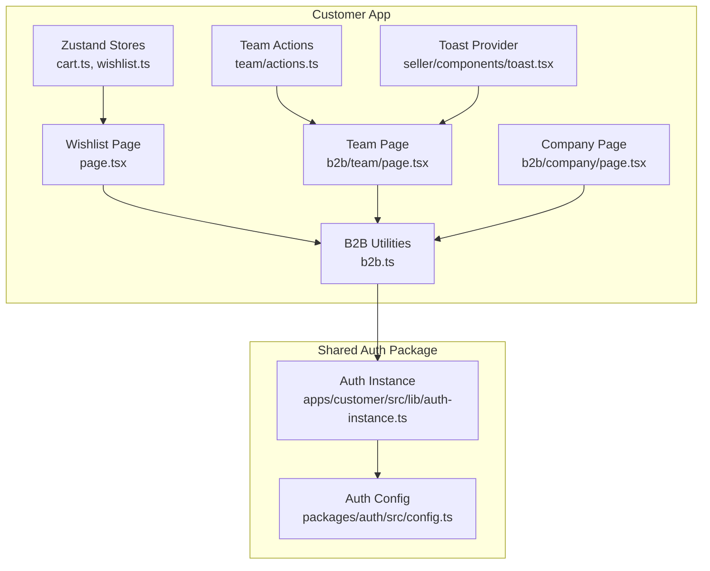
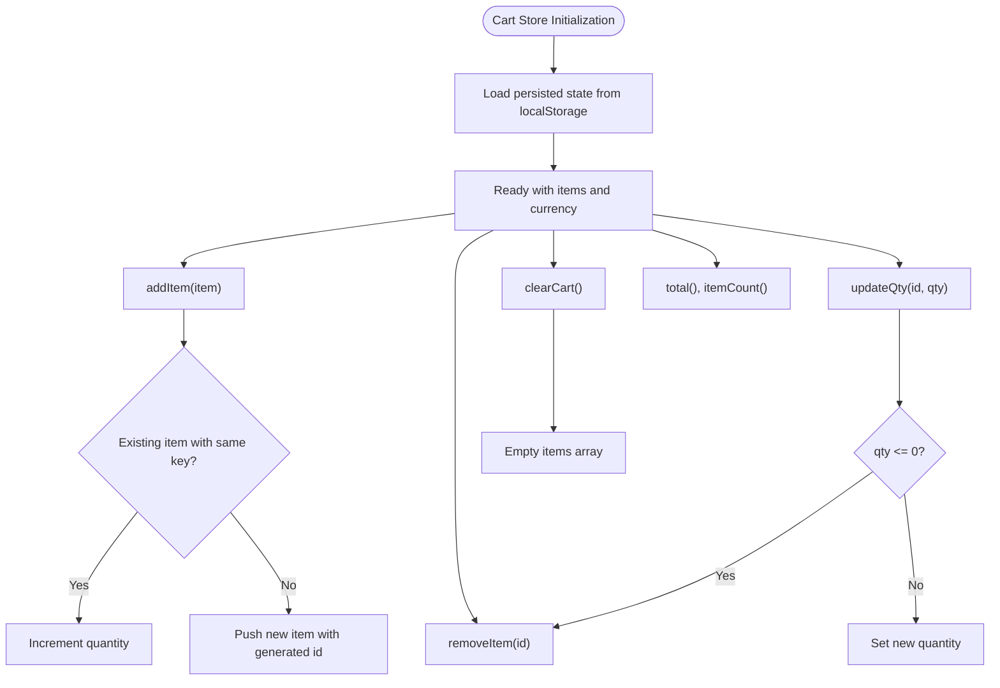
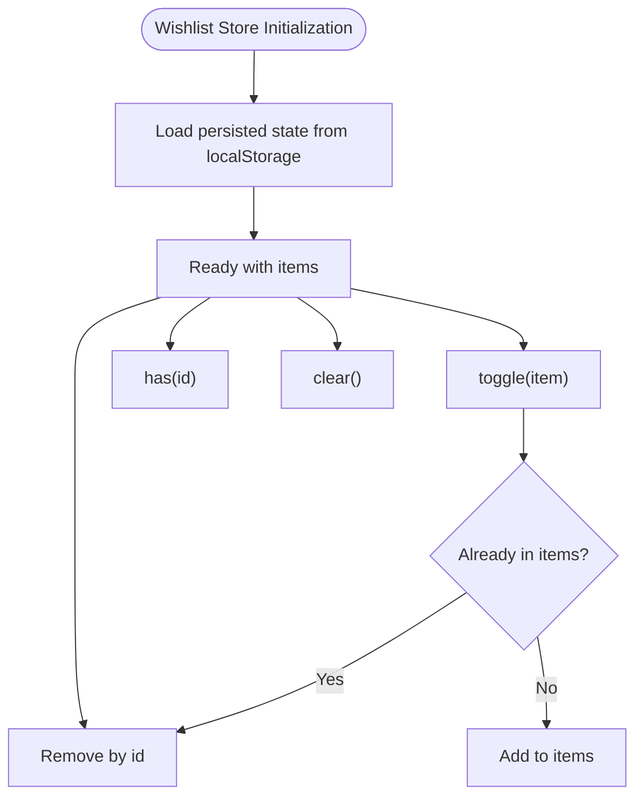
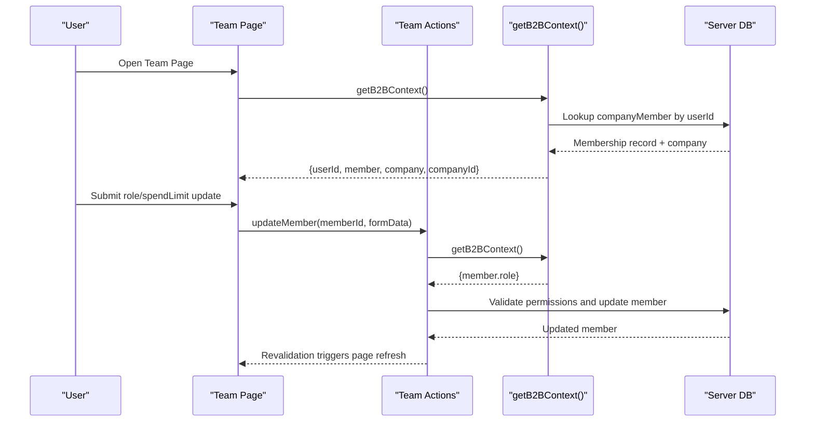
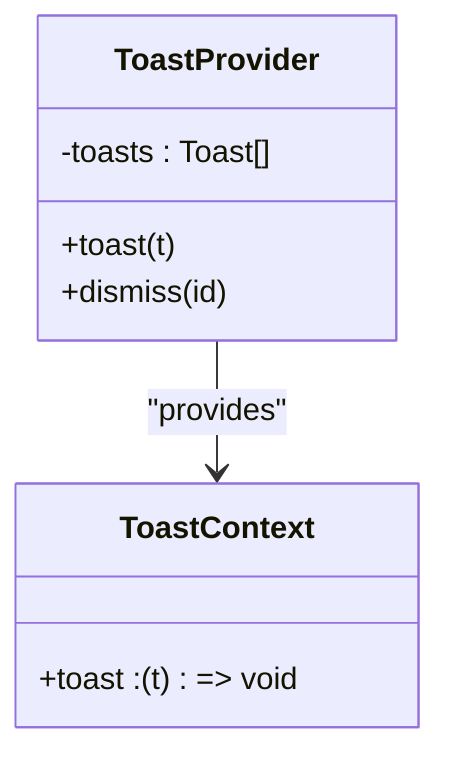

# State Management

<cite>
**Referenced Files in This Document**
- [cart.ts](file://apps/customer/src/stores/cart.ts)
- [wishlist.ts](file://apps/customer/src/stores/wishlist.ts)
- [page.tsx](file://apps/customer/src/app/wishlist/page.tsx)
- [b2b.ts](file://apps/customer/src/lib/b2b.ts)
- [actions.ts](file://apps/customer/src/app/b2b/team/actions.ts)
- [page.tsx](file://apps/customer/src/app/b2b/team/page.tsx)
- [page.tsx](file://apps/customer/src/app/b2b/company/page.tsx)
- [toast.tsx](file://apps/seller/src/components/toast.tsx)
- [auth-instance.ts](file://apps/customer/src/lib/auth-instance.ts)
- [config.ts](file://packages/auth/src/config.ts)
- [pnpm-lock.yaml](file://pnpm-lock.yaml)
</cite>

## Table of Contents
1. [Introduction](#introduction)
2. [Project Structure](#project-structure)
3. [Core Components](#core-components)
4. [Architecture Overview](#architecture-overview)
5. [Detailed Component Analysis](#detailed-component-analysis)
6. [Dependency Analysis](#dependency-analysis)
7. [Performance Considerations](#performance-considerations)
8. [Troubleshooting Guide](#troubleshooting-guide)
9. [Conclusion](#conclusion)
10. [Appendices](#appendices)

## Introduction
This document explains the state management architecture used in Avenick Commerce, focusing on the Zustand-based stores for cart and wishlist, persistence via localStorage, and B2B state patterns. It also covers context providers, local state management, integration with React hooks, and how state synchronization and hydration work across the customer application. Practical guidance is included for building state containers, handling complex updates, and coordinating state across component hierarchies.

## Project Structure
State management is primarily implemented in the customer application under the stores directory. The key elements are:
- Zustand stores for cart and wishlist with persistence
- B2B context helpers to resolve company membership and roles
- Local context provider for toast notifications
- Authentication integration via a shared auth package



**Diagram sources**
- [cart.ts:1-63](file://apps/customer/src/stores/cart.ts#L1-L63)
- [wishlist.ts:1-44](file://apps/customer/src/stores/wishlist.ts#L1-L44)
- [page.tsx:90-106](file://apps/customer/src/app/wishlist/page.tsx#L90-L106)
- [b2b.ts:1-23](file://apps/customer/src/lib/b2b.ts#L1-L23)
- [actions.ts:55-89](file://apps/customer/src/app/b2b/team/actions.ts#L55-L89)
- [page.tsx:24-57](file://apps/customer/src/app/b2b/team/page.tsx#L24-L57)
- [page.tsx:70-93](file://apps/customer/src/app/b2b/company/page.tsx#L70-L93)
- [toast.tsx:1-37](file://apps/seller/src/components/toast.tsx#L1-L37)
- [auth-instance.ts:1-3](file://apps/customer/src/lib/auth-instance.ts#L1-L3)
- [config.ts:75-93](file://packages/auth/src/config.ts#L75-L93)

**Section sources**
- [cart.ts:1-63](file://apps/customer/src/stores/cart.ts#L1-L63)
- [wishlist.ts:1-44](file://apps/customer/src/stores/wishlist.ts#L1-L44)
- [page.tsx:90-106](file://apps/customer/src/app/wishlist/page.tsx#L90-L106)
- [b2b.ts:1-23](file://apps/customer/src/lib/b2b.ts#L1-L23)
- [actions.ts:55-89](file://apps/customer/src/app/b2b/team/actions.ts#L55-L89)
- [page.tsx:24-57](file://apps/customer/src/app/b2b/team/page.tsx#L24-L57)
- [page.tsx:70-93](file://apps/customer/src/app/b2b/company/page.tsx#L70-L93)
- [toast.tsx:1-37](file://apps/seller/src/components/toast.tsx#L1-L37)
- [auth-instance.ts:1-3](file://apps/customer/src/lib/auth-instance.ts#L1-L3)
- [config.ts:75-93](file://packages/auth/src/config.ts#L75-L93)

## Core Components
- Cart Store (Zustand): Manages shopping cart items, quantity updates, totals, and persistence to localStorage.
- Wishlist Store (Zustand): Manages favorite items, toggling, checks, removal, and persistence to localStorage.
- B2B Context Helper: Resolves current user’s company membership and role for B2B features.
- Team Actions: Server actions to update member roles and activity within a company context.
- Toast Provider (Local Context): Provides a lightweight toast notification system via React Context.

Key capabilities:
- Persistence: Both cart and wishlist use Zustand middleware to persist state to localStorage.
- Hydration: On initialization, persisted state is restored from localStorage.
- Hooks Integration: Expose typed Zustand store hooks for consumption in components.
- B2B State Patterns: Centralized context resolution and server action coordination for team and company features.

**Section sources**
- [cart.ts:31-62](file://apps/customer/src/stores/cart.ts#L31-L62)
- [wishlist.ts:28-43](file://apps/customer/src/stores/wishlist.ts#L28-L43)
- [b2b.ts:11-23](file://apps/customer/src/lib/b2b.ts#L11-L23)
- [actions.ts:59-89](file://apps/customer/src/app/b2b/team/actions.ts#L59-L89)
- [toast.tsx:9-37](file://apps/seller/src/components/toast.tsx#L9-L37)

## Architecture Overview
The state management architecture centers on Zustand stores for cart and wishlist, with localStorage persistence. B2B state is coordinated through server actions and a context helper that resolves company membership. Authentication is handled via a shared auth package, enabling consistent session handling across apps.

```mermaid
graph TB
subgraph "Zustand Stores"
ZC["Cart Store<br/>cart.ts"]
ZW["Wishlist Store<br/>wishlist.ts"]
end
subgraph "Pages"
PCW["Wishlist Page<br/>customer/app/wishlist/page.tsx"]
PCT["Team Page<br/>customer/app/b2b/team/page.tsx"]
PCC["Company Page<br/>customer/app/b2b/company/page.tsx"]
end
subgraph "B2B"
B2B["getB2BContext()<br/>lib/b2b.ts"]
ACT["Team Actions<br/>b2b/team/actions.ts"]
end
subgraph "Auth"
AI["Auth Instance<br/>lib/auth-instance.ts"]
AC["Auth Config<br/>packages/auth/src/config.ts"]
end
ZC --> PCW
ZW --> PCW
PCT --> ACT
PCC --> B2B
B2B --> AI
AI --> AC
```

**Diagram sources**
- [cart.ts:31-62](file://apps/customer/src/stores/cart.ts#L31-L62)
- [wishlist.ts:28-43](file://apps/customer/src/stores/wishlist.ts#L28-L43)
- [page.tsx:90-106](file://apps/customer/src/app/wishlist/page.tsx#L90-L106)
- [page.tsx:39-57](file://apps/customer/src/app/b2b/team/page.tsx#L39-L57)
- [page.tsx:84-93](file://apps/customer/src/app/b2b/company/page.tsx#L84-L93)
- [b2b.ts:11-23](file://apps/customer/src/lib/b2b.ts#L11-L23)
- [actions.ts:59-89](file://apps/customer/src/app/b2b/team/actions.ts#L59-L89)
- [auth-instance.ts:1-3](file://apps/customer/src/lib/auth-instance.ts#L1-L3)
- [config.ts:75-93](file://packages/auth/src/config.ts#L75-L93)

## Detailed Component Analysis

### Cart Store (Zustand)
The cart store encapsulates:
- Item model with product identifiers, variant keys, pricing, and quantities
- Methods to add, update, remove, and clear items
- Aggregations for total cost and item count
- Persistence via Zustand middleware to localStorage

Implementation highlights:
- Deduplication by combining productId and variantId into a composite key
- Quantity validation and removal when quantity drops to zero
- Efficient updates using functional set reducers
- Hydration from localStorage on initialization



**Diagram sources**
- [cart.ts:31-62](file://apps/customer/src/stores/cart.ts#L31-L62)

**Section sources**
- [cart.ts:6-29](file://apps/customer/src/stores/cart.ts#L6-L29)
- [cart.ts:31-62](file://apps/customer/src/stores/cart.ts#L31-L62)

### Wishlist Store (Zustand)
The wishlist store manages:
- Item model for favorites with identifiers, pricing, and seller metadata
- Toggle logic to add/remove items
- Existence checks and bulk clearing
- Persistence via Zustand middleware to localStorage



**Diagram sources**
- [wishlist.ts:28-43](file://apps/customer/src/stores/wishlist.ts#L28-L43)

**Section sources**
- [wishlist.ts:6-26](file://apps/customer/src/stores/wishlist.ts#L6-L26)
- [wishlist.ts:28-43](file://apps/customer/src/stores/wishlist.ts#L28-L43)

### B2B State Patterns and Company Context
B2B features rely on resolving the current user’s company membership and role:
- getB2BContext resolves the user’s membership record and associated company
- Server actions enforce role-based access (e.g., COMPANY_ADMIN) and validate cross-company boundaries
- Pages consume the resolved context to render role-specific UI and enable actions



**Diagram sources**
- [page.tsx:32-37](file://apps/customer/src/app/b2b/team/page.tsx#L32-L37)
- [actions.ts:59-89](file://apps/customer/src/app/b2b/team/actions.ts#L59-L89)
- [b2b.ts:11-23](file://apps/customer/src/lib/b2b.ts#L11-L23)

**Section sources**
- [b2b.ts:11-23](file://apps/customer/src/lib/b2b.ts#L11-L23)
- [actions.ts:59-89](file://apps/customer/src/app/b2b/team/actions.ts#L59-L89)
- [page.tsx:39-57](file://apps/customer/src/app/b2b/team/page.tsx#L39-L57)

### Context Providers and Local State Management
- Toast Provider: Demonstrates a minimal local context provider pattern for UI notifications, independent of global state stores.
- Auth Integration: Shared auth package exposes a consistent auth instance used across apps.



**Diagram sources**
- [toast.tsx:9-37](file://apps/seller/src/components/toast.tsx#L9-L37)

**Section sources**
- [toast.tsx:1-37](file://apps/seller/src/components/toast.tsx#L1-L37)
- [auth-instance.ts:1-3](file://apps/customer/src/lib/auth-instance.ts#L1-L3)
- [config.ts:75-93](file://packages/auth/src/config.ts#L75-L93)

## Dependency Analysis
- Zustand version 5.x is used across stores for state management and middleware support.
- Persistence relies on Zustand’s built-in persist middleware, which serializes state to localStorage.
- Authentication is centralized in a shared package and consumed via an app-specific instance.

```mermaid
graph LR
Z["Zustand v5.x"] --> CStore["Cart Store"]
Z --> WStore["Wishlist Store"]
L["localStorage"] <- --> CStore
L <- --> WStore
AInst["Auth Instance"] --> AConf["Auth Config"]
AInst --> B2B["B2B Context"]
```

**Diagram sources**
- [pnpm-lock.yaml:4092-4109](file://pnpm-lock.yaml#L4092-L4109)
- [cart.ts:3-4](file://apps/customer/src/stores/cart.ts#L3-L4)
- [wishlist.ts:3-4](file://apps/customer/src/stores/wishlist.ts#L3-L4)
- [auth-instance.ts:1-3](file://apps/customer/src/lib/auth-instance.ts#L1-L3)
- [config.ts:75-93](file://packages/auth/src/config.ts#L75-L93)

**Section sources**
- [pnpm-lock.yaml:4092-4109](file://pnpm-lock.yaml#L4092-L4109)
- [cart.ts:3-4](file://apps/customer/src/stores/cart.ts#L3-L4)
- [wishlist.ts:3-4](file://apps/customer/src/stores/wishlist.ts#L3-L4)
- [auth-instance.ts:1-3](file://apps/customer/src/lib/auth-instance.ts#L1-L3)
- [config.ts:75-93](file://packages/auth/src/config.ts#L75-L93)

## Performance Considerations
- Prefer functional updates with Zustand’s set/get to minimize re-renders and avoid unnecessary object churn.
- Keep persisted state flat and compact; avoid storing large nested structures in cart/wishlist to reduce serialization overhead.
- Use memoization for derived computations (totals, counts) to prevent recomputation on every render.
- Limit frequent writes to localStorage; batch updates when possible to reduce storage contention.
- For B2B actions, validate early and fail fast to avoid unnecessary database calls.

## Troubleshooting Guide
Common issues and resolutions:
- State not persisting: Verify the persist middleware configuration and localStorage availability.
- Hydration mismatches: Ensure initializers reset state before hydration and that defaults align with persisted data.
- B2B permission errors: Confirm getB2BContext returns a valid membership and that server actions check roles and company boundaries.
- Toast not appearing: Confirm the ToastProvider wraps the consuming components and that the toast function is called within the provider context.

**Section sources**
- [cart.ts:31-62](file://apps/customer/src/stores/cart.ts#L31-L62)
- [wishlist.ts:28-43](file://apps/customer/src/stores/wishlist.ts#L28-L43)
- [b2b.ts:11-23](file://apps/customer/src/lib/b2b.ts#L11-L23)
- [actions.ts:59-89](file://apps/customer/src/app/b2b/team/actions.ts#L59-L89)
- [toast.tsx:24-37](file://apps/seller/src/components/toast.tsx#L24-L37)

## Conclusion
Avenick Commerce employs a pragmatic, scalable state management approach centered on Zustand for cart and wishlist, with localStorage persistence and hydration. B2B state is coordinated through a context helper and server actions, ensuring secure and role-aware operations. The shared auth package provides consistent session handling across applications. Together, these patterns deliver reliable, maintainable state management suitable for both B2C and B2B workflows.

## Appendices
- Practical examples for implementing state containers:
  - Define a typed store interface and export a hook-bound Zustand store with persist middleware.
  - Use functional updates and memoized selectors to optimize performance.
- Managing complex state updates:
  - Normalize state shapes, compute derived values efficiently, and guard against invalid transitions.
- Handling state across component hierarchies:
  - Use local context providers for UI concerns (e.g., toasts) and keep global stores scoped to domain needs (cart, wishlist).
- B2B state patterns:
  - Centralize context resolution and enforce role-based access in server actions.
- Company context and team management:
  - Validate company membership and enforce admin-only operations for sensitive changes.