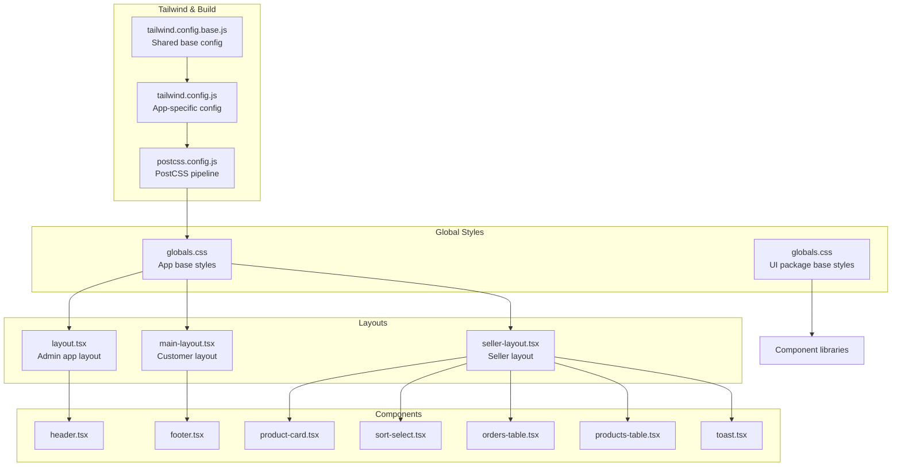
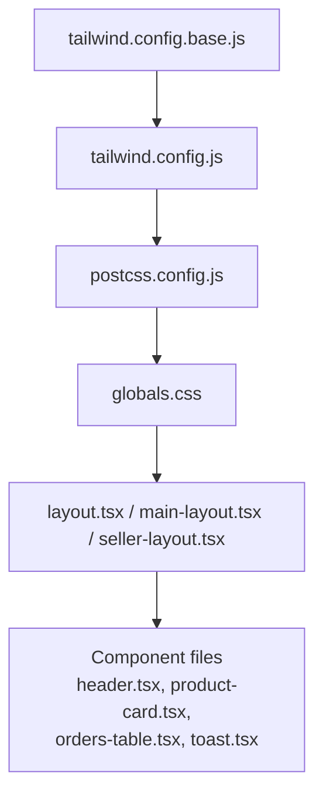
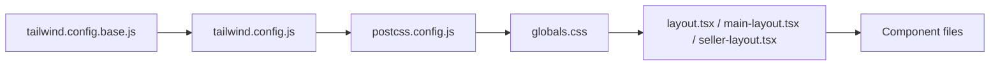

# Component Styling Patterns

<cite>
**Referenced Files in This Document**
- [tailwind.config.js](file://apps/admin/tailwind.config.js)
- [tailwind.config.base.js](file://packages/config/tailwind.config.base.js)
- [postcss.config.js](file://apps/admin/postcss.config.js)
- [globals.css](file://apps/admin/src/app/globals.css)
- [layout.tsx](file://apps/admin/src/app/layout.tsx)
- [header.tsx](file://apps/customer/src/components/layout/header.tsx)
- [footer.tsx](file://apps/customer/src/components/layout/footer.tsx)
- [main-layout.tsx](file://apps/customer/src/components/layout/main-layout.tsx)
- [product-card.tsx](file://apps/customer/src/components/products/product-card.tsx)
- [sort-select.tsx](file://apps/customer/src/components/products/sort-select.tsx)
- [orders-table.tsx](file://apps/seller/src/components/orders-table.tsx)
- [products-table.tsx](file://apps/seller/src/components/products-table.tsx)
- [toast.tsx](file://apps/seller/src/components/toast.tsx)
- [command-palette.tsx](file://apps/seller/src/components/command-palette.tsx)
- [notification-bell.tsx](file://apps/seller/src/components/notification-bell.tsx)
- [b2b-shell.tsx](file://apps/customer/src/components/b2b/b2b-shell.tsx)
- [validated-form.tsx](file://apps/customer/src/components/b2b/validated-form.tsx)
- [reorder-button.tsx](file://apps/customer/src/components/b2b/reorder-button.tsx)
- [seller-layout.tsx](file://apps/seller/src/components/layout/seller-layout.tsx)
- [admin-layout.tsx](file://apps/admin/src/components/layout/admin-layout.tsx)
- [globals.css](file://packages/ui/src/globals.css)
</cite>

## Table of Contents
1. [Introduction](#introduction)
2. [Project Structure](#project-structure)
3. [Core Components](#core-components)
4. [Architecture Overview](#architecture-overview)
5. [Detailed Component Analysis](#detailed-component-analysis)
6. [Dependency Analysis](#dependency-analysis)
7. [Performance Considerations](#performance-considerations)
8. [Troubleshooting Guide](#troubleshooting-guide)
9. [Conclusion](#conclusion)

## Introduction
This document explains the styling architecture and patterns used across Avenick Commerce’s admin, customer, and seller applications. It focuses on how Tailwind CSS integrates with PostCSS, how global styles are applied, and how components compose className strings for consistent, maintainable UI. It also covers utility-first approaches, responsive design, interactive states, and performance considerations for scalable component styling.

## Project Structure
Styling in Avenick Commerce is organized around three primary layers:
- Global base styles and theme tokens via Tailwind configuration and PostCSS
- Application-level layouts that apply global styles and establish base containers
- Component-level styling using Tailwind utilities composed through className strings

Key configuration and global files:
- Tailwind configuration per app and a shared base configuration
- PostCSS configuration enabling Tailwind processing
- Global CSS files that define base styles and typography
- Layout components that wrap pages and inject global styles

**Diagram sources**
- [tailwind.config.js](file://apps/admin/tailwind.config.js)
- [tailwind.config.base.js](file://packages/config/tailwind.config.base.js)
- [postcss.config.js](file://apps/admin/postcss.config.js)
- [globals.css](file://apps/admin/src/app/globals.css)
- [globals.css](file://packages/ui/src/globals.css)
- [layout.tsx](file://apps/admin/src/app/layout.tsx)
- [main-layout.tsx](file://apps/customer/src/components/layout/main-layout.tsx)
- [seller-layout.tsx](file://apps/seller/src/components/layout/seller-layout.tsx)
- [header.tsx](file://apps/customer/src/components/layout/header.tsx)
- [footer.tsx](file://apps/customer/src/components/layout/footer.tsx)
- [product-card.tsx](file://apps/customer/src/components/products/product-card.tsx)
- [sort-select.tsx](file://apps/customer/src/components/products/sort-select.tsx)
- [orders-table.tsx](file://apps/seller/src/components/orders-table.tsx)
- [products-table.tsx](file://apps/seller/src/components/products-table.tsx)
- [toast.tsx](file://apps/seller/src/components/toast.tsx)

**Section sources**
- [tailwind.config.js](file://apps/admin/tailwind.config.js)
- [tailwind.config.base.js](file://packages/config/tailwind.config.base.js)
- [postcss.config.js](file://apps/admin/postcss.config.js)
- [globals.css](file://apps/admin/src/app/globals.css)
- [globals.css](file://packages/ui/src/globals.css)
- [layout.tsx](file://apps/admin/src/app/layout.tsx)
- [main-layout.tsx](file://apps/customer/src/components/layout/main-layout.tsx)
- [seller-layout.tsx](file://apps/seller/src/components/layout/seller-layout.tsx)

## Core Components
This section outlines the foundational styling patterns used across components.

- Utility-first className composition
  - Components combine Tailwind utility classes directly in JSX to build responsive, interactive, and variant-driven UIs.
  - Example patterns include stacking spacing utilities, color tokens, and responsive modifiers to achieve consistent layouts.

- Responsive design
  - Breakpoints are configured via Tailwind; components use responsive prefixes to adapt styles across device sizes.
  - Example: applying different padding or flex directions on small vs. large screens.

- Interactive states
  - Hover, focus, and active states are expressed with Tailwind’s state modifiers to ensure accessible and predictable interactions.
  - Focus-visible is used to highlight keyboard navigation targets.

- Variant management
  - Variants (e.g., sizes, colors, shapes) are encoded as className strings built from component props, enabling reuse and consistency.

- Global base styles
  - Base typography, base colors, and normalization are centralized in global CSS files to ensure consistent defaults across apps.

**Section sources**
- [globals.css](file://apps/admin/src/app/globals.css)
- [globals.css](file://packages/ui/src/globals.css)
- [layout.tsx](file://apps/admin/src/app/layout.tsx)
- [main-layout.tsx](file://apps/customer/src/components/layout/main-layout.tsx)
- [seller-layout.tsx](file://apps/seller/src/components/layout/seller-layout.tsx)

## Architecture Overview
The styling architecture follows a layered approach:
- Tailwind configuration defines theme tokens, breakpoints, and plugins.
- PostCSS compiles Tailwind utilities into production CSS.
- Global CSS establishes base styles and typography.
- Layouts wrap pages and ensure global styles are applied.
- Components compose className strings to render variants, states, and responsive behavior.

**Diagram sources**
- [tailwind.config.base.js](file://packages/config/tailwind.config.base.js)
- [tailwind.config.js](file://apps/admin/tailwind.config.js)
- [postcss.config.js](file://apps/admin/postcss.config.js)
- [globals.css](file://apps/admin/src/app/globals.css)
- [layout.tsx](file://apps/admin/src/app/layout.tsx)
- [main-layout.tsx](file://apps/customer/src/components/layout/main-layout.tsx)
- [seller-layout.tsx](file://apps/seller/src/components/layout/seller-layout.tsx)

## Detailed Component Analysis

### Layout-level Styling
- Admin layout
  - Wraps pages and applies global styles to ensure consistent typography and spacing.
  - Provides a container for all admin routes.

- Customer main layout
  - Serves as the root wrapper for customer-facing pages, integrating header and footer components.

- Seller layout
  - Establishes the base container for seller dashboards and tables.

Implementation references:
- [layout.tsx](file://apps/admin/src/app/layout.tsx)
- [main-layout.tsx](file://apps/customer/src/components/layout/main-layout.tsx)
- [seller-layout.tsx](file://apps/seller/src/components/layout/seller-layout.tsx)

**Section sources**
- [layout.tsx](file://apps/admin/src/app/layout.tsx)
- [main-layout.tsx](file://apps/customer/src/components/layout/main-layout.tsx)
- [seller-layout.tsx](file://apps/seller/src/components/layout/seller-layout.tsx)

### Header and Footer Styling
- Header
  - Uses utility classes for layout alignment, spacing, and responsive behavior.
  - Integrates with layout containers to maintain consistent branding and navigation styles.

- Footer
  - Applies base styles and spacing utilities to ensure readability and accessibility.

Implementation references:
- [header.tsx](file://apps/customer/src/components/layout/header.tsx)
- [footer.tsx](file://apps/customer/src/components/layout/footer.tsx)

**Section sources**
- [header.tsx](file://apps/customer/src/components/layout/header.tsx)
- [footer.tsx](file://apps/customer/src/components/layout/footer.tsx)

### Product and Selection Components
- Product card
  - Composes className strings to represent product items with consistent spacing, borders, shadows, and responsive grid behavior.
  - Implements hover and focus states for interactivity.

- Sort select
  - Uses utility classes for form controls, ensuring accessible focus states and consistent sizing.

Implementation references:
- [product-card.tsx](file://apps/customer/src/components/products/product-card.tsx)
- [sort-select.tsx](file://apps/customer/src/components/products/sort-select.tsx)

**Section sources**
- [product-card.tsx](file://apps/customer/src/components/products/product-card.tsx)
- [sort-select.tsx](file://apps/customer/src/components/products/sort-select.tsx)

### Tables and Notifications
- Orders table
  - Applies responsive table utilities, hover states, and accessible markup for data presentation.

- Products table
  - Similar responsive and interactive patterns for product listings.

- Notification bell
  - Uses utility classes for icon sizing, positioning, and state indicators.

Implementation references:
- [orders-table.tsx](file://apps/seller/src/components/orders-table.tsx)
- [products-table.tsx](file://apps/seller/src/components/products-table.tsx)
- [notification-bell.tsx](file://apps/seller/src/components/notification-bell.tsx)

**Section sources**
- [orders-table.tsx](file://apps/seller/src/components/orders-table.tsx)
- [products-table.tsx](file://apps/seller/src/components/products-table.tsx)
- [notification-bell.tsx](file://apps/seller/src/components/notification-bell.tsx)

### Toast and Command Palette
- Toast
  - Uses utility classes for positioning, animation-ready spacing, and color variants to indicate status.

- Command palette
  - Implements responsive layout and stateful interactions with utility classes for input, list, and focus management.

Implementation references:
- [toast.tsx](file://apps/seller/src/components/toast.tsx)
- [command-palette.tsx](file://apps/seller/src/components/command-palette.tsx)

**Section sources**
- [toast.tsx](file://apps/seller/src/components/toast.tsx)
- [command-palette.tsx](file://apps/seller/src/components/command-palette.tsx)

### B2B Components
- B2B shell
  - Provides a container with consistent spacing and responsive behavior for B2B flows.

- Validated form
  - Uses utility classes for form layout, spacing, and validation feedback states.

- Reorder button
  - Composes className strings for button variants, hover states, and focus-visible behavior.

Implementation references:
- [b2b-shell.tsx](file://apps/customer/src/components/b2b/b2b-shell.tsx)
- [validated-form.tsx](file://apps/customer/src/components/b2b/validated-form.tsx)
- [reorder-button.tsx](file://apps/customer/src/components/b2b/reorder-button.tsx)

**Section sources**
- [b2b-shell.tsx](file://apps/customer/src/components/b2b/b2b-shell.tsx)
- [validated-form.tsx](file://apps/customer/src/components/b2b/validated-form.tsx)
- [reorder-button.tsx](file://apps/customer/src/components/b2b/reorder-button.tsx)

### Admin Layout Component
- Admin layout
  - Wraps admin pages and ensures global styles are applied consistently across routes.

Implementation references:
- [admin-layout.tsx](file://apps/admin/src/components/layout/admin-layout.tsx)

**Section sources**
- [admin-layout.tsx](file://apps/admin/src/components/layout/admin-layout.tsx)

## Dependency Analysis
The styling pipeline depends on Tailwind configuration and PostCSS processing, with global CSS injected at the layout level.

**Diagram sources**
- [tailwind.config.base.js](file://packages/config/tailwind.config.base.js)
- [tailwind.config.js](file://apps/admin/tailwind.config.js)
- [postcss.config.js](file://apps/admin/postcss.config.js)
- [globals.css](file://apps/admin/src/app/globals.css)
- [layout.tsx](file://apps/admin/src/app/layout.tsx)
- [main-layout.tsx](file://apps/customer/src/components/layout/main-layout.tsx)
- [seller-layout.tsx](file://apps/seller/src/components/layout/seller-layout.tsx)

**Section sources**
- [tailwind.config.base.js](file://packages/config/tailwind.config.base.js)
- [tailwind.config.js](file://apps/admin/tailwind.config.js)
- [postcss.config.js](file://apps/admin/postcss.config.js)
- [globals.css](file://apps/admin/src/app/globals.css)
- [layout.tsx](file://apps/admin/src/app/layout.tsx)
- [main-layout.tsx](file://apps/customer/src/components/layout/main-layout.tsx)
- [seller-layout.tsx](file://apps/seller/src/components/layout/seller-layout.tsx)

## Performance Considerations
- Prefer utility-first composition to minimize custom CSS and reduce bundle size.
- Keep className strings concise and avoid excessive nesting; leverage Tailwind’s atomic nature.
- Use responsive prefixes judiciously to limit generated variants.
- Centralize global styles to avoid duplication and ensure efficient caching.
- Ensure interactive states (hover, focus, active) are scoped to relevant elements to prevent unnecessary reflows.
- Avoid dynamic class generation in tight loops; precompute className strings when possible.

## Troubleshooting Guide
- Tailwind utilities not applying
  - Verify Tailwind configuration and PostCSS pipeline are correctly set up.
  - Confirm global CSS is included at the layout level.

- Conflicting styles
  - Check for specificity conflicts; prefer utility classes over custom CSS overrides.
  - Review className composition order to ensure intended utilities take precedence.

- Responsive behavior not working
  - Confirm breakpoint configuration and responsive prefixes are used consistently.
  - Ensure the viewport meta tag is present in the HTML template.

- Interactive states missing
  - Add appropriate state utilities (e.g., hover:, focus:, focus-visible:) to interactive elements.
  - Test keyboard navigation and ensure focus-visible styles are visible.

**Section sources**
- [tailwind.config.js](file://apps/admin/tailwind.config.js)
- [postcss.config.js](file://apps/admin/postcss.config.js)
- [globals.css](file://apps/admin/src/app/globals.css)
- [layout.tsx](file://apps/admin/src/app/layout.tsx)

## Conclusion
Avenick Commerce employs a clean, utility-first styling architecture powered by Tailwind CSS and PostCSS. Global styles are centralized, layouts provide consistent containers, and components compose className strings to implement responsive, interactive, and variant-rich UIs. Following the patterns documented here ensures maintainability, scalability, and performance across the platform.