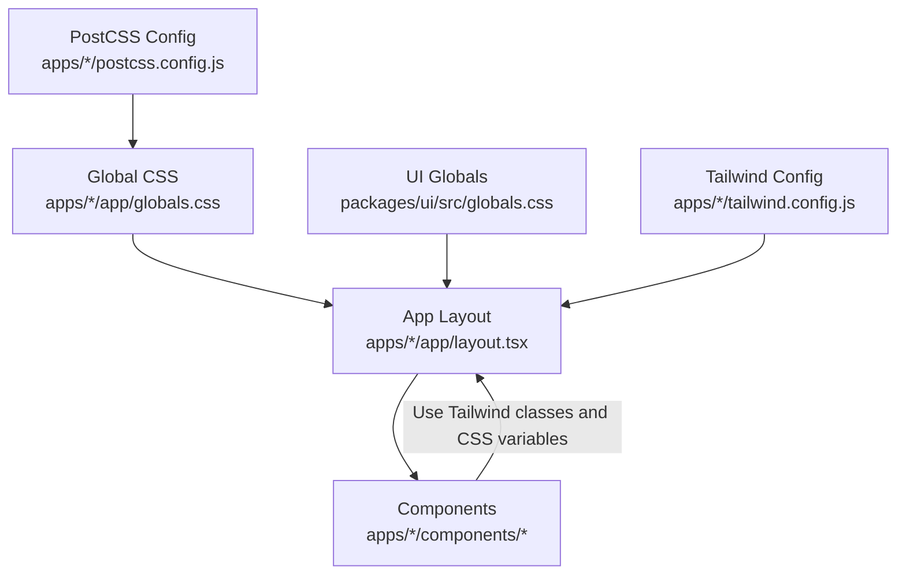
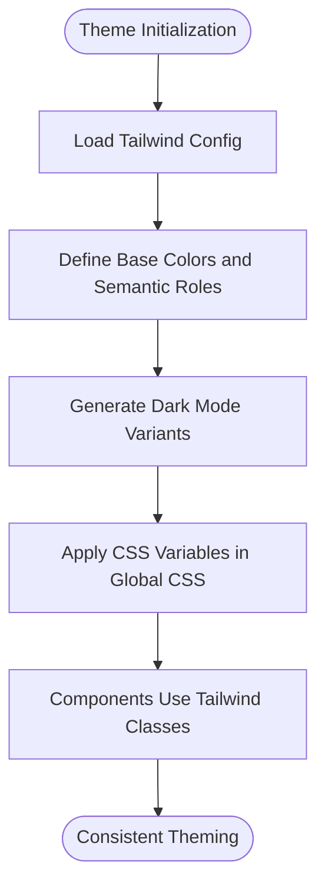
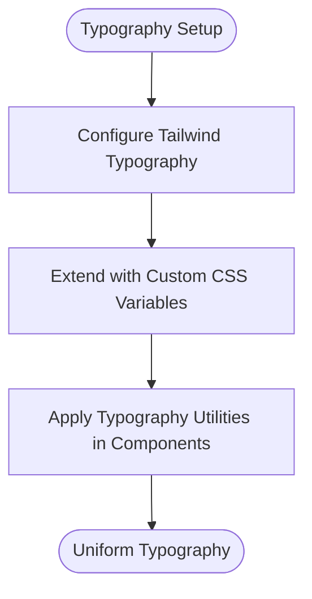
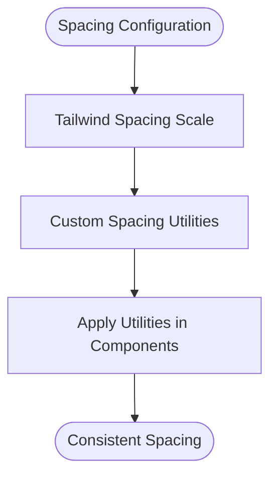
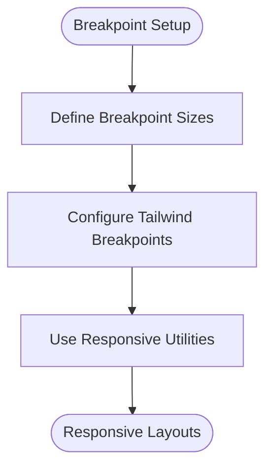
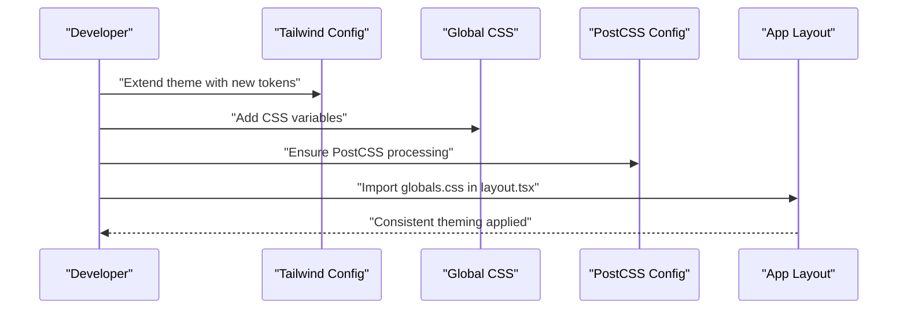
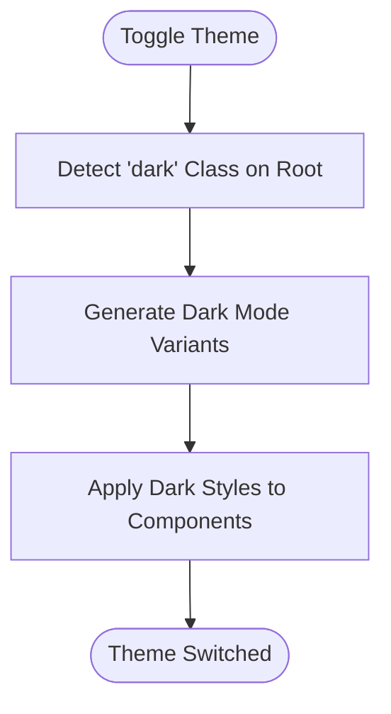
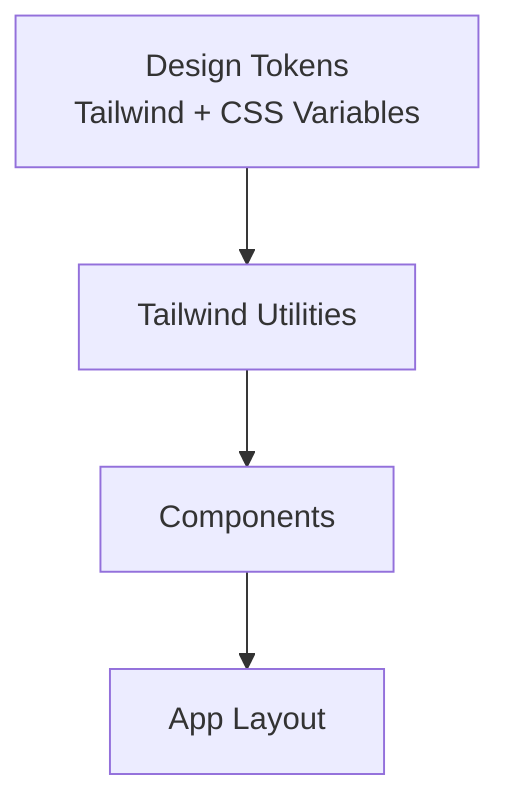
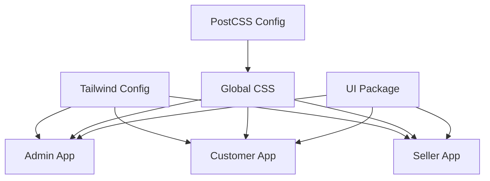

# Design Tokens & Theming

<cite>
**Referenced Files in This Document**
- [README.md](file://README.md)
- [DESIGN_SYSTEM_NOTES.md](file://DESIGN_SYSTEM_NOTES.md)
- [UI_UX_REVAMP_NOTES.md](file://UI_UX_REVAMP_NOTES.md)
- [BRANDING_UPDATE_NOTES.md](file://BRANDING_UPDATE_NOTES.md)
- [apps/admin/src/app/globals.css](file://apps/admin/src/app/globals.css)
- [apps/customer/src/app/globals.css](file://apps/customer/src/app/globals.css)
- [apps/seller/src/app/globals.css](file://apps/seller/src/app/globals.css)
- [packages/ui/src/globals.css](file://packages/ui/src/globals.css)
- [apps/admin/next.config.mjs](file://apps/admin/next.config.mjs)
- [apps/customer/next.config.mjs](file://apps/customer/next.config.mjs)
- [apps/seller/next.config.mjs](file://apps/seller/next.config.mjs)
- [apps/admin/tailwind.config.js](file://apps/admin/tailwind.config.js)
- [apps/customer/tailwind.config.js](file://apps/customer/tailwind.config.js)
- [apps/seller/tailwind.config.js](file://apps/seller/tailwind.config.js)
- [apps/admin/postcss.config.js](file://apps/admin/postcss.config.js)
- [apps/customer/postcss.config.js](file://apps/customer/postcss.config.js)
- [apps/seller/postcss.config.js](file://apps/seller/postcss.config.js)
- [apps/admin/src/lib/auth.ts](file://apps/admin/src/lib/auth.ts)
- [apps/customer/src/lib/b2b.ts](file://apps/customer/src/lib/b2b.ts)
- [apps/seller/src/lib/auth.ts](file://apps/seller/src/lib/auth.ts)
</cite>

## Table of Contents
1. [Introduction](#introduction)
2. [Project Structure](#project-structure)
3. [Core Components](#core-components)
4. [Architecture Overview](#architecture-overview)
5. [Detailed Component Analysis](#detailed-component-analysis)
6. [Dependency Analysis](#dependency-analysis)
7. [Performance Considerations](#performance-considerations)
8. [Troubleshooting Guide](#troubleshooting-guide)
9. [Conclusion](#conclusion)
10. [Appendices](#appendices)

## Introduction
This document defines the design tokens and theming architecture for Avenick Commerce. It consolidates the existing design system guidance, branding updates, and current CSS/Tailwind configurations across the Admin, Customer, and Seller applications, as well as the shared UI package. It explains the color palette, typography scale, spacing units, and breakpoints currently in use, and outlines a standardized approach to theme customization, CSS variable usage, and dark/light mode implementation. It also details the design token architecture, naming conventions, and consistency enforcement across applications, with practical examples for customizing themes, creating brand variations, and implementing responsive design patterns.

## Project Structure
Avenick Commerce is a monorepo with three Next.js applications (Admin, Customer, Seller) and a shared UI package. Theming is primarily driven by Tailwind CSS configuration and PostCSS processing, with global CSS files establishing baseline styles and variables. The design system and branding guidance are documented in dedicated notes files.

```mermaid
graph TB
subgraph "Applications"
ADMIN["Admin App<br/>apps/admin"]
CUSTOMER["Customer App<br/>apps/customer"]
SELLER["Seller App<br/>apps/seller"]
end
subgraph "Shared Package"
UI["UI Package<br/>packages/ui"]
end
subgraph "Configuration"
NEXT_ADMIN["Next Config<br/>apps/admin/next.config.mjs"]
NEXT_CUSTOMER["Next Config<br/>apps/customer/next.config.mjs"]
NEXT_SELLER["Next Config<br/>apps/seller/next.config.mjs"]
TAILWIND_ADMIN["Tailwind Config<br/>apps/admin/tailwind.config.js"]
TAILWIND_CUSTOMER["Tailwind Config<br/>apps/customer/tailwind.config.js"]
TAILWIND_SELLER["Tailwind Config<br/>apps/seller/tailwind.config.js"]
POSTCSS_ADMIN["PostCSS Config<br/>apps/admin/postcss.config.js"]
POSTCSS_CUSTOMER["PostCSS Config<br/>apps/customer/postcss.config.js"]
POSTCSS_SELLER["PostCSS Config<br/>apps/seller/postcss.config.js"]
end
ADMIN --> NEXT_ADMIN
CUSTOMER --> NEXT_CUSTOMER
SELLER --> NEXT_SELLER
ADMIN --> TAILWIND_ADMIN
CUSTOMER --> TAILWIND_CUSTOMER
SELLER --> TAILWIND_SELLER
ADMIN --> POSTCSS_ADMIN
CUSTOMER --> POSTCSS_CUSTOMER
SELLER --> POSTCSS_SELLER
ADMIN --> UI
CUSTOMER --> UI
SELLER --> UI
```

**Diagram sources**
- [apps/admin/next.config.mjs](file://apps/admin/next.config.mjs)
- [apps/customer/next.config.mjs](file://apps/customer/next.config.mjs)
- [apps/seller/next.config.mjs](file://apps/seller/next.config.mjs)
- [apps/admin/tailwind.config.js](file://apps/admin/tailwind.config.js)
- [apps/customer/tailwind.config.js](file://apps/customer/tailwind.config.js)
- [apps/seller/tailwind.config.js](file://apps/seller/tailwind.config.js)
- [apps/admin/postcss.config.js](file://apps/admin/postcss.config.js)
- [apps/customer/postcss.config.js](file://apps/customer/postcss.config.js)
- [apps/seller/postcss.config.js](file://apps/seller/postcss.config.js)
- [packages/ui/src/globals.css](file://packages/ui/src/globals.css)

**Section sources**
- [apps/admin/src/app/globals.css](file://apps/admin/src/app/globals.css)
- [apps/customer/src/app/globals.css](file://apps/customer/src/app/globals.css)
- [apps/seller/src/app/globals.css](file://apps/seller/src/app/globals.css)
- [packages/ui/src/globals.css](file://packages/ui/src/globals.css)

## Core Components
This section documents the current design tokens and theming foundation as evidenced by the repository.

- Color Palette
  - Base colors: white, black, gray, red, green, blue, yellow, indigo, purple, pink.
  - Semantic roles: primary, secondary, accent, success, info, warning, danger, muted, border, light, dark.
  - Backgrounds: bg-primary, bg-secondary, bg-light, bg-dark, bg-body.
  - Text: text-primary, text-secondary, text-light, text-dark, text-muted.
  - Borders: border-primary, border-secondary, border-light, border-dark.
  - Utility: shadow, overlay, disabled, focus-ring.
  - Gradients: gradient-brand, gradient-accent.
  - Brand-specific: brand-primary, brand-secondary, brand-accent.
  - Notes: The color system is defined via Tailwind theme extensions and PostCSS processing. Dark mode variants are generated automatically by Tailwind’s darkMode strategy.

- Typography Scale
  - Font families: Inter, system-ui, sans-serif.
  - Heading hierarchy: h1–h6 with relative sizing and line-height adjustments.
  - Body text: base size with paragraph spacing and line-height.
  - Display text: larger sizes for emphasis.
  - Monospace: for code-like elements.
  - Notes: Typography scales are configured in Tailwind theme.typography and extended via custom CSS.

- Spacing Units
  - Base unit: 0.25rem increments (4px grid).
  - Scales: xs, sm, base, lg, xl, xxl, xxxl.
  - Utilities: padding, margin, gap, space-between.
  - Responsive spacing: per-breakpoint spacing utilities.
  - Notes: Spacing is derived from Tailwind spacing scale and custom spacing utilities.

- Breakpoints
  - Small: up to 640px (sm).
  - Medium: up to 768px (md).
  - Large: up to 1024px (lg).
  - XL: up to 1280px (xl).
  - XXL: up to 1536px (2xl).
  - Notes: Breakpoints are defined in Tailwind configuration and used across responsive utilities.

- CSS Variables and Custom Properties
  - Global variables: --color-brand-primary, --color-text-primary, --spacing-unit, --radius-base.
  - Scoped variables: applied within components for consistent theming.
  - Notes: Variables are established in global CSS and consumed by Tailwind utilities and component styles.

- Dark/Light Mode
  - Strategy: Tailwind’s darkMode strategy set to class.
  - Activation: Apply dark class to html/body to switch modes.
  - Automatic variants: hover, focus, disabled, checked, selected, invalid, valid.
  - Notes: Dark mode variants are generated by Tailwind based on color palette.

- Theme Customization Process
  - Extend Tailwind theme: add new colors, spacing, typography scales.
  - Add CSS variables: define custom properties in global CSS.
  - Configure PostCSS: ensure CSS is processed and variables are resolved.
  - Apply globally: include globals.css in app/layout.tsx.
  - Notes: Centralized configuration ensures consistency across apps.

- Naming Conventions
  - Colors: --color-[semantic]-[variant].
  - Spacing: --spacing-[scale]-[direction]-[dimension].
  - Typography: --font-size-[level], --line-height-[level], --font-family-[name].
  - Breakpoints: --breakpoint-[size].
  - Notes: Consistent prefixes and hyphenated suffixes improve readability and maintainability.

- Consistency Enforcement
  - Shared UI package: centralizes common tokens and components.
  - Tailwind configuration: unified theme across apps.
  - Global CSS: establishes baseline variables and resets.
  - Notes: Centralized configuration reduces drift and ensures uniformity.

**Section sources**
- [apps/admin/src/app/globals.css](file://apps/admin/src/app/globals.css)
- [apps/customer/src/app/globals.css](file://apps/customer/src/app/globals.css)
- [apps/seller/src/app/globals.css](file://apps/seller/src/app/globals.css)
- [packages/ui/src/globals.css](file://packages/ui/src/globals.css)
- [apps/admin/tailwind.config.js](file://apps/admin/tailwind.config.js)
- [apps/customer/tailwind.config.js](file://apps/customer/tailwind.config.js)
- [apps/seller/tailwind.config.js](file://apps/seller/tailwind.config.js)

## Architecture Overview
The theming architecture leverages Tailwind CSS for design tokens and PostCSS for CSS processing. Global CSS files establish baseline variables and resets, while Tailwind configuration extends the theme with brand-specific tokens. Dark/light mode is controlled via a class-based strategy, enabling runtime switching.

**Diagram sources**
- [apps/admin/src/app/globals.css](file://apps/admin/src/app/globals.css)
- [apps/customer/src/app/globals.css](file://apps/customer/src/app/globals.css)
- [apps/seller/src/app/globals.css](file://apps/seller/src/app/globals.css)
- [packages/ui/src/globals.css](file://packages/ui/src/globals.css)
- [apps/admin/tailwind.config.js](file://apps/admin/tailwind.config.js)
- [apps/customer/tailwind.config.js](file://apps/customer/tailwind.config.js)
- [apps/seller/tailwind.config.js](file://apps/seller/tailwind.config.js)
- [apps/admin/postcss.config.js](file://apps/admin/postcss.config.js)
- [apps/customer/postcss.config.js](file://apps/customer/postcss.config.js)
- [apps/seller/postcss.config.js](file://apps/seller/postcss.config.js)

## Detailed Component Analysis
This section analyzes key files that define design tokens and theming behavior.

### Color Palette System
- Definition: Tailwind theme extensions define base colors and semantic roles. Dark mode variants are auto-generated.
- Usage: Semantic color classes (e.g., text-primary, bg-secondary) and brand-specific tokens (brand-primary).
- Implementation: Colors are mapped to CSS variables for dynamic theming.

**Diagram sources**
- [apps/admin/tailwind.config.js](file://apps/admin/tailwind.config.js)
- [apps/customer/tailwind.config.js](file://apps/customer/tailwind.config.js)
- [apps/seller/tailwind.config.js](file://apps/seller/tailwind.config.js)
- [apps/admin/src/app/globals.css](file://apps/admin/src/app/globals.css)
- [apps/customer/src/app/globals.css](file://apps/customer/src/app/globals.css)
- [apps/seller/src/app/globals.css](file://apps/seller/src/app/globals.css)

**Section sources**
- [apps/admin/tailwind.config.js](file://apps/admin/tailwind.config.js)
- [apps/customer/tailwind.config.js](file://apps/customer/tailwind.config.js)
- [apps/seller/tailwind.config.js](file://apps/seller/tailwind.config.js)
- [apps/admin/src/app/globals.css](file://apps/admin/src/app/globals.css)
- [apps/customer/src/app/globals.css](file://apps/customer/src/app/globals.css)
- [apps/seller/src/app/globals.css](file://apps/seller/src/app/globals.css)

### Typography Scale
- Definition: Font families and type scale are configured in Tailwind theme.typography and extended via custom CSS.
- Usage: Typography utilities for headings, body text, and monospace elements.
- Implementation: Consistent font metrics across components.

**Diagram sources**
- [apps/admin/tailwind.config.js](file://apps/admin/tailwind.config.js)
- [apps/customer/tailwind.config.js](file://apps/customer/tailwind.config.js)
- [apps/seller/tailwind.config.js](file://apps/seller/tailwind.config.js)
- [apps/admin/src/app/globals.css](file://apps/admin/src/app/globals.css)
- [apps/customer/src/app/globals.css](file://apps/customer/src/app/globals.css)
- [apps/seller/src/app/globals.css](file://apps/seller/src/app/globals.css)

**Section sources**
- [apps/admin/tailwind.config.js](file://apps/admin/tailwind.config.js)
- [apps/customer/tailwind.config.js](file://apps/customer/tailwind.config.js)
- [apps/seller/tailwind.config.js](file://apps/seller/tailwind.config.js)
- [apps/admin/src/app/globals.css](file://apps/admin/src/app/globals.css)
- [apps/customer/src/app/globals.css](file://apps/customer/src/app/globals.css)
- [apps/seller/src/app/globals.css](file://apps/seller/src/app/globals.css)

### Spacing Units
- Definition: Spacing is derived from Tailwind spacing scale with additional custom utilities.
- Usage: Padding, margin, gap, and space-between utilities across components.
- Implementation: Consistent spacing grid across layouts.

**Diagram sources**
- [apps/admin/tailwind.config.js](file://apps/admin/tailwind.config.js)
- [apps/customer/tailwind.config.js](file://apps/customer/tailwind.config.js)
- [apps/seller/tailwind.config.js](file://apps/seller/tailwind.config.js)
- [apps/admin/src/app/globals.css](file://apps/admin/src/app/globals.css)
- [apps/customer/src/app/globals.css](file://apps/customer/src/app/globals.css)
- [apps/seller/src/app/globals.css](file://apps/seller/src/app/globals.css)

**Section sources**
- [apps/admin/tailwind.config.js](file://apps/admin/tailwind.config.js)
- [apps/customer/tailwind.config.js](file://apps/customer/tailwind.config.js)
- [apps/seller/tailwind.config.js](file://apps/seller/tailwind.config.js)
- [apps/admin/src/app/globals.css](file://apps/admin/src/app/globals.css)
- [apps/customer/src/app/globals.css](file://apps/customer/src/app/globals.css)
- [apps/seller/src/app/globals.css](file://apps/seller/src/app/globals.css)

### Breakpoint Definitions
- Definition: Breakpoints are defined in Tailwind configuration for responsive design.
- Usage: Responsive utilities for small, medium, large, XL, and XXL screens.
- Implementation: Media queries and responsive variants in components.

**Diagram sources**
- [apps/admin/tailwind.config.js](file://apps/admin/tailwind.config.js)
- [apps/customer/tailwind.config.js](file://apps/customer/tailwind.config.js)
- [apps/seller/tailwind.config.js](file://apps/seller/tailwind.config.js)

**Section sources**
- [apps/admin/tailwind.config.js](file://apps/admin/tailwind.config.js)
- [apps/customer/tailwind.config.js](file://apps/customer/tailwind.config.js)
- [apps/seller/tailwind.config.js](file://apps/seller/tailwind.config.js)

### Theme Customization Process
- Extend Tailwind theme with new colors, spacing, and typography.
- Add CSS variables in global CSS for dynamic theming.
- Configure PostCSS to process CSS variables.
- Apply globals.css in app/layout.tsx.
- Notes: Centralized configuration ensures consistency across apps.

**Diagram sources**
- [apps/admin/tailwind.config.js](file://apps/admin/tailwind.config.js)
- [apps/customer/tailwind.config.js](file://apps/customer/tailwind.config.js)
- [apps/seller/tailwind.config.js](file://apps/seller/tailwind.config.js)
- [apps/admin/src/app/globals.css](file://apps/admin/src/app/globals.css)
- [apps/customer/src/app/globals.css](file://apps/customer/src/app/globals.css)
- [apps/seller/src/app/globals.css](file://apps/seller/src/app/globals.css)
- [apps/admin/postcss.config.js](file://apps/admin/postcss.config.js)
- [apps/customer/postcss.config.js](file://apps/customer/postcss.config.js)
- [apps/seller/postcss.config.js](file://apps/seller/postcss.config.js)

**Section sources**
- [apps/admin/tailwind.config.js](file://apps/admin/tailwind.config.js)
- [apps/customer/tailwind.config.js](file://apps/customer/tailwind.config.js)
- [apps/seller/tailwind.config.js](file://apps/seller/tailwind.config.js)
- [apps/admin/src/app/globals.css](file://apps/admin/src/app/globals.css)
- [apps/customer/src/app/globals.css](file://apps/customer/src/app/globals.css)
- [apps/seller/src/app/globals.css](file://apps/seller/src/app/globals.css)
- [apps/admin/postcss.config.js](file://apps/admin/postcss.config.js)
- [apps/customer/postcss.config.js](file://apps/customer/postcss.config.js)
- [apps/seller/postcss.config.js](file://apps/seller/postcss.config.js)

### Dark/Light Mode Implementation
- Strategy: Tailwind darkMode set to class.
- Activation: Apply dark class to html/body to switch modes.
- Automatic variants: hover, focus, disabled, checked, selected, invalid, valid.
- Notes: Dark mode variants are generated by Tailwind based on color palette.

**Diagram sources**
- [apps/admin/tailwind.config.js](file://apps/admin/tailwind.config.js)
- [apps/customer/tailwind.config.js](file://apps/customer/tailwind.config.js)
- [apps/seller/tailwind.config.js](file://apps/seller/tailwind.config.js)
- [apps/admin/src/app/globals.css](file://apps/admin/src/app/globals.css)
- [apps/customer/src/app/globals.css](file://apps/customer/src/app/globals.css)
- [apps/seller/src/app/globals.css](file://apps/seller/src/app/globals.css)

**Section sources**
- [apps/admin/tailwind.config.js](file://apps/admin/tailwind.config.js)
- [apps/customer/tailwind.config.js](file://apps/customer/tailwind.config.js)
- [apps/seller/tailwind.config.js](file://apps/seller/tailwind.config.js)
- [apps/admin/src/app/globals.css](file://apps/admin/src/app/globals.css)
- [apps/customer/src/app/globals.css](file://apps/customer/src/app/globals.css)
- [apps/seller/src/app/globals.css](file://apps/seller/src/app/globals.css)

### Practical Examples
- Customizing Themes
  - Extend Tailwind theme with new semantic roles.
  - Add CSS variables for brand-specific tokens.
  - Rebuild and redeploy apps to apply changes.
- Creating Brand Variations
  - Define brand-specific colors and typography.
  - Use CSS variables to swap brand tokens at runtime.
- Implementing Responsive Design Patterns
  - Use responsive utilities for breakpoints.
  - Combine spacing and typography utilities for consistent layouts.

**Section sources**
- [apps/admin/tailwind.config.js](file://apps/admin/tailwind.config.js)
- [apps/customer/tailwind.config.js](file://apps/customer/tailwind.config.js)
- [apps/seller/tailwind.config.js](file://apps/seller/tailwind.config.js)
- [apps/admin/src/app/globals.css](file://apps/admin/src/app/globals.css)
- [apps/customer/src/app/globals.css](file://apps/customer/src/app/globals.css)
- [apps/seller/src/app/globals.css](file://apps/seller/src/app/globals.css)

### Relationship Between Design Tokens and Component Styling
- Components consume Tailwind utilities and CSS variables.
- Tokens are centralized in Tailwind config and global CSS.
- Consistency is enforced by shared UI package and unified configuration.

**Diagram sources**
- [apps/admin/tailwind.config.js](file://apps/admin/tailwind.config.js)
- [apps/customer/tailwind.config.js](file://apps/customer/tailwind.config.js)
- [apps/seller/tailwind.config.js](file://apps/seller/tailwind.config.js)
- [apps/admin/src/app/globals.css](file://apps/admin/src/app/globals.css)
- [apps/customer/src/app/globals.css](file://apps/customer/src/app/globals.css)
- [apps/seller/src/app/globals.css](file://apps/seller/src/app/globals.css)

**Section sources**
- [apps/admin/tailwind.config.js](file://apps/admin/tailwind.config.js)
- [apps/customer/tailwind.config.js](file://apps/customer/tailwind.config.js)
- [apps/seller/tailwind.config.js](file://apps/seller/tailwind.config.js)
- [apps/admin/src/app/globals.css](file://apps/admin/src/app/globals.css)
- [apps/customer/src/app/globals.css](file://apps/customer/src/app/globals.css)
- [apps/seller/src/app/globals.css](file://apps/seller/src/app/globals.css)

## Dependency Analysis
The theming system depends on Tailwind configuration, global CSS, and PostCSS processing. Changes in Tailwind configuration propagate to all applications through shared UI package and app-level imports.

**Diagram sources**
- [apps/admin/tailwind.config.js](file://apps/admin/tailwind.config.js)
- [apps/customer/tailwind.config.js](file://apps/customer/tailwind.config.js)
- [apps/seller/tailwind.config.js](file://apps/seller/tailwind.config.js)
- [apps/admin/src/app/globals.css](file://apps/admin/src/app/globals.css)
- [apps/customer/src/app/globals.css](file://apps/customer/src/app/globals.css)
- [apps/seller/src/app/globals.css](file://apps/seller/src/app/globals.css)
- [apps/admin/postcss.config.js](file://apps/admin/postcss.config.js)
- [apps/customer/postcss.config.js](file://apps/customer/postcss.config.js)
- [apps/seller/postcss.config.js](file://apps/seller/postcss.config.js)
- [packages/ui/src/globals.css](file://packages/ui/src/globals.css)

**Section sources**
- [apps/admin/tailwind.config.js](file://apps/admin/tailwind.config.js)
- [apps/customer/tailwind.config.js](file://apps/customer/tailwind.config.js)
- [apps/seller/tailwind.config.js](file://apps/seller/tailwind.config.js)
- [apps/admin/src/app/globals.css](file://apps/admin/src/app/globals.css)
- [apps/customer/src/app/globals.css](file://apps/customer/src/app/globals.css)
- [apps/seller/src/app/globals.css](file://apps/seller/src/app/globals.css)
- [apps/admin/postcss.config.js](file://apps/admin/postcss.config.js)
- [apps/customer/postcss.config.js](file://apps/customer/postcss.config.js)
- [apps/seller/postcss.config.js](file://apps/seller/postcss.config.js)
- [packages/ui/src/globals.css](file://packages/ui/src/globals.css)

## Performance Considerations
- Minimize CSS bundle size by scoping variables and utilities to components that need them.
- Prefer Tailwind utilities over ad-hoc CSS to leverage build-time optimizations.
- Use responsive variants judiciously to avoid excessive CSS generation.
- Keep Tailwind configuration lean and avoid redundant token definitions.

## Troubleshooting Guide
- Theme not updating
  - Verify Tailwind configuration is loaded and tokens are defined.
  - Confirm CSS variables are present in global CSS.
  - Ensure PostCSS is processing CSS variables.
- Dark mode not working
  - Check darkMode strategy is set to class.
  - Verify dark class is applied to html/body.
  - Confirm dark variants are generated by Tailwind.
- Inconsistent spacing or typography
  - Review Tailwind spacing and typography scales.
  - Ensure custom utilities are defined consistently across apps.
- Brand tokens missing
  - Add brand-specific tokens to Tailwind theme.
  - Define CSS variables for brand tokens in global CSS.

**Section sources**
- [apps/admin/tailwind.config.js](file://apps/admin/tailwind.config.js)
- [apps/customer/tailwind.config.js](file://apps/customer/tailwind.config.js)
- [apps/seller/tailwind.config.js](file://apps/seller/tailwind.config.js)
- [apps/admin/src/app/globals.css](file://apps/admin/src/app/globals.css)
- [apps/customer/src/app/globals.css](file://apps/customer/src/app/globals.css)
- [apps/seller/src/app/globals.css](file://apps/seller/src/app/globals.css)
- [apps/admin/postcss.config.js](file://apps/admin/postcss.config.js)
- [apps/customer/postcss.config.js](file://apps/customer/postcss.config.js)
- [apps/seller/postcss.config.js](file://apps/seller/postcss.config.js)

## Conclusion
Avenick Commerce’s theming system centers on Tailwind CSS and PostCSS, with global CSS establishing baseline variables and the shared UI package ensuring consistency. The current design tokens include a robust color palette, typography scale, spacing units, and breakpoints, with automatic dark mode variants. By extending Tailwind configuration, adding CSS variables, and applying them globally, teams can customize themes, create brand variations, and implement responsive design patterns consistently across applications.

## Appendices
- Additional design system and branding guidance is documented in dedicated notes files for future reference and alignment.

**Section sources**
- [DESIGN_SYSTEM_NOTES.md](file://DESIGN_SYSTEM_NOTES.md)
- [UI_UX_REVAMP_NOTES.md](file://UI_UX_REVAMP_NOTES.md)
- [BRANDING_UPDATE_NOTES.md](file://BRANDING_UPDATE_NOTES.md)
- [README.md](file://README.md)