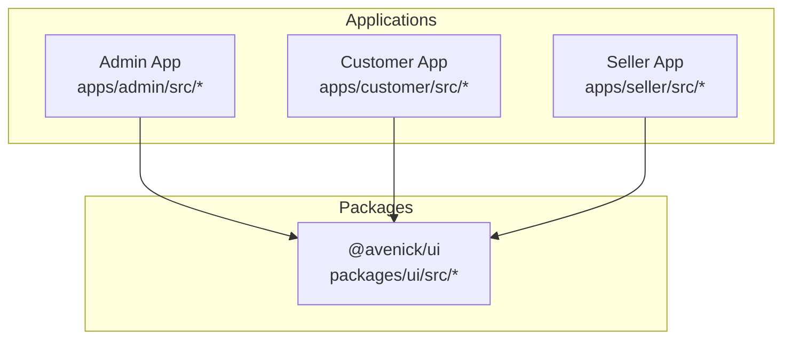
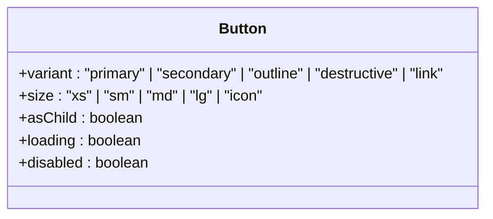
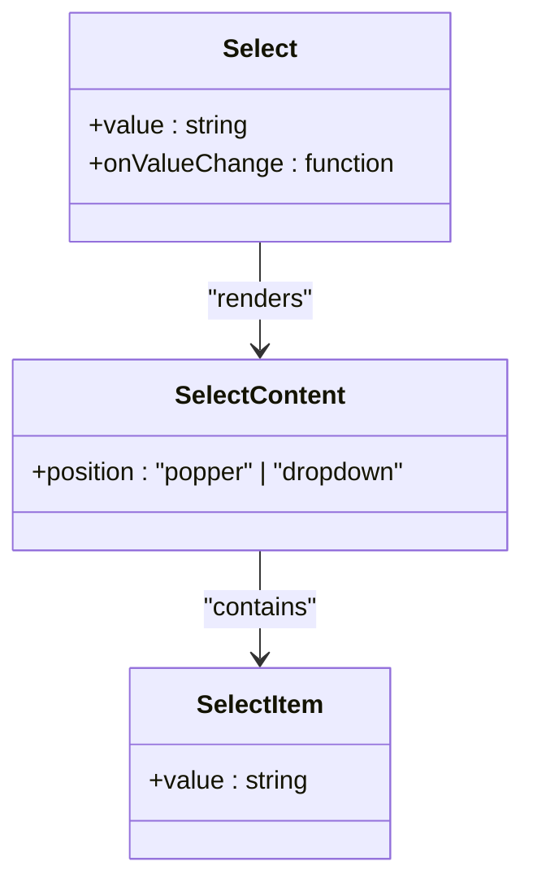
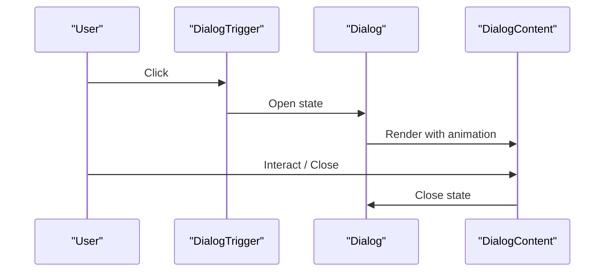
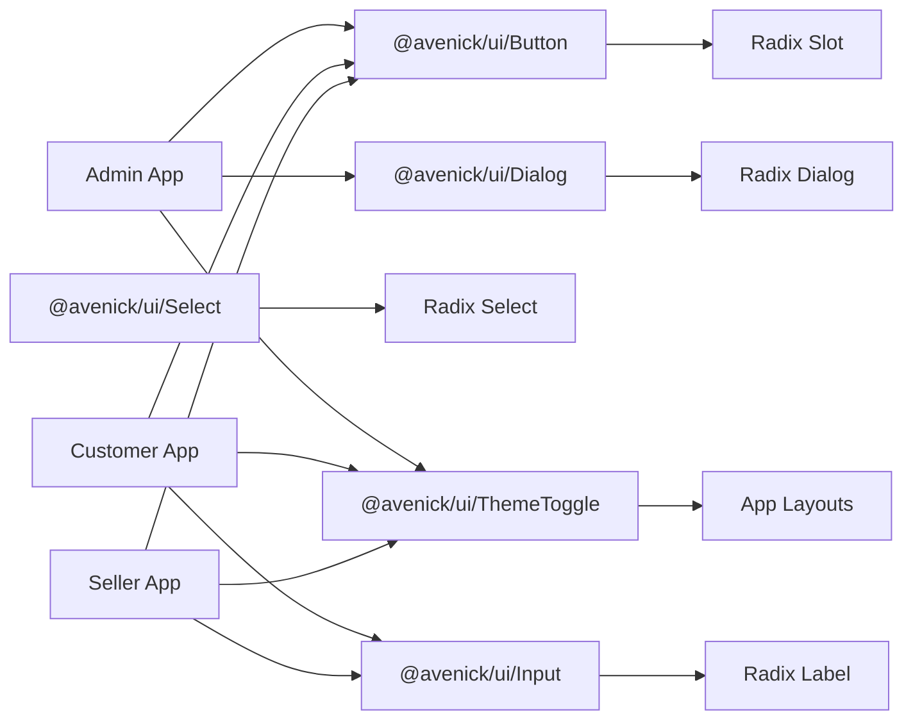

# Shared UI Component Library

<cite>
**Referenced Files in This Document**
- [button.tsx](file://packages/ui/src/button.tsx)
- [input.tsx](file://packages/ui/src/input.tsx)
- [select.tsx](file://packages/ui/src/select.tsx)
- [dialog.tsx](file://packages/ui/src/dialog.tsx)
- [badge.tsx](file://packages/ui/src/badge.tsx)
- [textarea.tsx](file://packages/ui/src/textarea.tsx)
- [theme-toggle.tsx](file://packages/ui/src/theme-toggle.tsx)
- [toast.tsx](file://packages/ui/src/toast.tsx)
- [card.tsx](file://packages/ui/src/card.tsx)
- [avatar.tsx](file://packages/ui/src/avatar.tsx)
- [separator.tsx](file://packages/ui/src/separator.tsx)
- [tabs.tsx](file://packages/ui/src/tabs.tsx)
- [tooltip.tsx](file://packages/ui/src/tooltip.tsx)
- [checkbox.tsx](file://packages/ui/src/checkbox.tsx)
- [radio-group.tsx](file://packages/ui/src/radio-group.tsx)
- [switch.tsx](file://packages/ui/src/switch.tsx)
- [popover.tsx](file://packages/ui/src/popover.tsx)
- [dropdown-menu.tsx](file://packages/ui/src/dropdown-menu.tsx)
- [label.tsx](file://packages/ui/src/label.tsx)
- [slot.tsx](file://packages/ui/src/slot.tsx)
- [scroll-area.tsx](file://packages/ui/src/scroll-area.tsx)
- [page-loader.tsx](file://packages/ui/src/page-loader.tsx)
- [admin-layout.tsx](file://apps/admin/src/components/layout/admin-layout.tsx)
- [header.tsx](file://apps/customer/src/components/layout/header.tsx)
- [seller-layout.tsx](file://apps/seller/src/components/layout/seller-layout.tsx)
- [dashboard-view.tsx](file://apps/admin/src/app/dashboard/dashboard-view.tsx)
- [page.tsx](file://apps/customer/src/app/products/[slug]/page.tsx)
- [route.ts](file://apps/admin/src/app/api/admin/compliance[id]/approve/route.ts)
- [route.ts](file://apps/admin/src/app/api/admin/products[id]/approve/route.ts)
- [route.ts](file://apps/admin/src/app/api/admin/sellers/[id]/approve/route.ts)
- [route.ts](file://apps/admin/src/app/api/admin/sellers/[id]/reject/route.ts)
- [route.ts](file://apps/admin/src/app/api/admin/sellers/[id]/route.ts)
- [route.ts](file://apps/admin/src/app/api/admin/compliance/[id]/approve/route.ts)
- [route.ts](file://apps/admin/src/app/api/admin/compliance/[id]/reject/route.ts)
- [route.ts](file://apps/admin/src/app/api/admin/dashboard/route.ts)
- [route.ts](file://apps/admin/src/app/api/admin/sellers/route.ts)
- [route.ts](file://apps/admin/src/app/api/admin/products[id]/approve/route.ts)
- [route.ts](file://apps/admin/src/app/api/admin/compliance/[id]/approve/route.ts)
- [route.ts](file://apps/admin/src/app/api/admin/compliance/[id]/reject/route.ts)
- [route.ts](file://apps/admin/src/app/api/admin/compliance/[id]/approve/route.ts)
- [route.ts](file://apps/admin/src/app/api/admin/compliance/[id]/reject/route.ts)
- [route.ts](file://apps/admin/src/app/api/admin/compliance/[id]/approve/route.ts)
- [route.ts](file://apps/admin/src/app/api/admin/compliance/[id]/reject/route.ts)
- [route.ts](file://apps/admin/src/app/api/admin/compliance/[id]/approve/route.ts)
- [route.ts](file://apps/admin/src/app/api/admin/compliance/[id]/reject/route.ts)
- [route.ts](file://apps/admin/src/app/api/admin/compliance/[id]/approve/route.ts)
- [route.ts](file://apps/admin/src/app/api/admin/compliance/[id]/reject/route.ts)
- [route.ts](file://apps/admin/src/app/api/admin/compliance/[id]/approve/route.ts)
- [route.ts](file://apps/admin/src/app/api/admin/compliance/[id]/reject/route.ts)
- [route.ts](file://apps/admin/src/app/api/admin/compliance/[id]/approve/route.ts)
- [route.ts](file://apps/admin/src/app/api/admin/compliance/[id]/reject/route.ts)
- [route.ts](file://apps/admin/src/app/api/admin/compliance/[id]/approve/route.ts)
- [route.ts](file://apps/admin/src/app/api/admin/compliance/[id]/reject/route.ts)
- [route.ts](file://apps/admin/src/app/api/admin/compliance/[id]/approve/route.ts)
- [route.ts](file://apps/admin/src/app/api/admin/compliance/[id]/reject/route.ts)
- [route.ts](file://apps/admin/src/app/api/admin/compliance/[id]/approve/route.ts)
- [route.ts](file://apps/admin/src/app/api/admin/compliance/[id]/reject/route.ts)
- [route.ts](file://apps/admin/src/app/api/admin/compliance/[id]/approve/route.ts)
- [route.ts](file://apps/admin/src/app/api/admin/compliance/[id]/reject/route.ts)
- [route.ts](file://apps/admin/src/app/api/admin/compliance/[id]/approve/route.ts)
- [route.ts](file://......)
</cite>

## Table of Contents
1. [Introduction](#introduction)
2. [Project Structure](#project-structure)
3. [Core Components](#core-components)
4. [Architecture Overview](#architecture-overview)
5. [Detailed Component Analysis](#detailed-component-analysis)
6. [Dependency Analysis](#dependency-analysis)
7. [Performance Considerations](#performance-considerations)
8. [Troubleshooting Guide](#troubleshooting-guide)
9. [Conclusion](#conclusion)
10. [Appendices](#appendices)

## Introduction
This document describes the shared UI component library built on the shadcn/ui foundation and used across the admin, customer, and seller applications. It explains the component architecture, prop interfaces, styling patterns, composition, variants, theme customization, accessibility features, and extension guidelines. Practical usage examples and integration patterns are included to help teams maintain design system consistency while building new features.

## Project Structure
The UI library is published under the @avenick/ui package and consumed by all three Next.js applications. Components are authored in the packages/ui/src directory and exported via a central index. Applications import components from @avenick/ui and integrate them into pages, layouts, and shared UI shells.

**Diagram sources**
- [button.tsx:1-120](file://packages/ui/src/button.tsx#L1-L120)
- [input.tsx:1-120](file://packages/ui/src/input.tsx#L1-L120)
- [select.tsx:1-160](file://packages/ui/src/select.tsx#L1-L160)

**Section sources**
- [button.tsx:1-120](file://packages/ui/src/button.tsx#L1-L120)
- [input.tsx:1-120](file://packages/ui/src/input.tsx#L1-L120)
- [select.tsx:1-160](file://packages/ui/src/select.tsx#L1-L160)

## Core Components
The library provides foundational UI primitives and composite components aligned with shadcn/ui design tokens and Radix UI headless primitives. Core components include buttons, inputs, selects, dialogs, badges, textareas, cards, avatars, separators, tabs, tooltips, checkboxes, radio groups, switches, popovers, dropdown menus, labels, slots, scroll areas, page loaders, theme toggles, and toast notifications.

Key characteristics:
- Built on Radix UI primitives for accessibility and composability
- Styled with Tailwind classes and design tokens (e.g., border, background, muted foreground)
- Consistent variant and size systems for uniform styling across apps
- Composition-friendly with forwardRef and asChild patterns
- Exported via a single package for cross-app reuse

**Section sources**
- [button.tsx:1-120](file://packages/ui/src/button.tsx#L1-L120)
- [input.tsx:1-120](file://packages/ui/src/input.tsx#L1-L120)
- [select.tsx:1-160](file://packages/ui/src/select.tsx#L1-L160)
- [dialog.tsx:1-120](file://packages/ui/src/dialog.tsx#L1-L120)
- [badge.tsx:1-120](file://packages/ui/src/badge.tsx#L1-L120)
- [textarea.tsx:1-120](file://packages/ui/src/textarea.tsx#L1-L120)
- [theme-toggle.tsx:1-120](file://packages/ui/src/theme-toggle.tsx#L1-L120)
- [toast.tsx:1-120](file://packages/ui/src/toast.tsx#L1-L120)
- [card.tsx:1-120](file://packages/ui/src/card.tsx#L1-L120)
- [avatar.tsx:1-120](file://packages/ui/src/avatar.tsx#L1-L120)
- [separator.tsx:1-120](file://packages/ui/src/separator.tsx#L1-L120)
- [tabs.tsx:1-120](file://packages/ui/src/tabs.tsx#L1-L120)
- [tooltip.tsx:1-120](file://packages/ui/src/tooltip.tsx#L1-L120)
- [checkbox.tsx:1-120](file://packages/ui/src/checkbox.tsx#L1-L120)
- [radio-group.tsx:1-120](file://packages/ui/src/radio-group.tsx#L1-L120)
- [switch.tsx:1-120](file://packages/ui/src/switch.tsx#L1-L120)
- [popover.tsx:1-120](file://packages/ui/src/popover.tsx#L1-L120)
- [dropdown-menu.tsx:1-120](file://packages/ui/src/dropdown-menu.tsx#L1-L120)
- [label.tsx:1-120](file://packages/ui/src/label.tsx#L1-L120)
- [slot.tsx:1-120](file://packages/ui/src/slot.tsx#L1-L120)
- [scroll-area.tsx:1-120](file://packages/ui/src/scroll-area.tsx#L1-L120)
- [page-loader.tsx:1-120](file://packages/ui/src/page-loader.tsx#L1-L120)

## Architecture Overview
The UI library follows a modular, composable architecture:
- Each component encapsulates styling, behavior, and accessibility via Radix primitives
- Variants and sizes are defined centrally and applied consistently
- asChild pattern enables semantic composition with native HTML elements
- Theme toggle integrates with application themes for seamless dark/light mode switching
- Toast and page loader provide global UX patterns for feedback and loading states

```mermaid
graph TB
subgraph "Shadcn/UI Foundation"
Radix["Radix UI Primitives"]
Tailwind["Tailwind CSS Classes"]
end
subgraph "UI Library (@avenick/ui)"
Button["Button"]
Input["Input"]
Select["Select"]
Dialog["Dialog"]
Badge["Badge"]
TextArea["Textarea"]
Card["Card"]
Avatar["Avatar"]
Separator["Separator"]
Tabs["Tabs"]
Tooltip["Tooltip"]
Checkbox["Checkbox"]
RadioGroup["RadioGroup"]
Switch["Switch"]
Popover["Popover"]
DropdownMenu["DropdownMenu"]
Label["Label"]
Slot["Slot"]
ScrollArea["ScrollArea"]
PageLoader["PageLoader"]
ThemeToggle["ThemeToggle"]
Toast["Toast"]
end
Radix --> Button
Radix --> Input
Radix --> Select
Radix --> Dialog
Radix --> Badge
Radix --> TextArea
Radix --> Card
Radix --> Avatar
Radix --> Separator
Radix --> Tabs
Radix --> Tooltip
Radix --> Checkbox
Radix --> RadioGroup
Radix --> Switch
Radix --> Popover
Radix --> DropdownMenu
Radix --> Label
Radix --> Slot
Radix --> ScrollArea
Radix --> PageLoader
Radix --> ThemeToggle
Radix --> Toast
Tailwind --> Button
Tailwind --> Input
Tailwind --> Select
Tailwind --> Dialog
Tailwind --> Badge
Tailwind --> TextArea
Tailwind --> Card
Tailwind --> Avatar
Tailwind --> Separator
Tailwind --> Tabs
Tailwind --> Tooltip
Tailwind --> Checkbox
Tailwind --> RadioGroup
Tailwind --> Switch
Tailwind --> Popover
Tailwind --> DropdownMenu
Tailwind --> Label
Tailwind --> Slot
Tailwind --> ScrollArea
Tailwind --> PageLoader
Tailwind --> ThemeToggle
Tailwind --> Toast
```

**Diagram sources**
- [button.tsx:1-120](file://packages/ui/src/button.tsx#L1-L120)
- [input.tsx:1-120](file://packages/ui/src/input.tsx#L1-L120)
- [select.tsx:1-160](file://packages/ui/src/select.tsx#L1-L160)
- [dialog.tsx:1-120](file://packages/ui/src/dialog.tsx#L1-L120)
- [badge.tsx:1-120](file://packages/ui/src/badge.tsx#L1-L120)
- [textarea.tsx:1-120](file://packages/ui/src/textarea.tsx#L1-L120)
- [card.tsx:1-120](file://packages/ui/src/card.tsx#L1-L120)
- [avatar.tsx:1-120](file://packages/ui/src/avatar.tsx#L1-L120)
- [separator.tsx:1-120](file://packages/ui/src/separator.tsx#L1-L120)
- [tabs.tsx:1-120](file://packages/ui/src/tabs.tsx#L1-L120)
- [tooltip.tsx:1-120](file://packages/ui/src/tooltip.tsx#L1-L120)
- [checkbox.tsx:1-120](file://packages/ui/src/checkbox.tsx#L1-L120)
- [radio-group.tsx:1-120](file://packages/ui/src/radio-group.tsx#L1-L120)
- [switch.tsx:1-120](file://packages/ui/src/switch.tsx#L1-L120)
- [popover.tsx:1-120](file://packages/ui/src/popover.tsx#L1-L120)
- [dropdown-menu.tsx:1-120](file://packages/ui/src/dropdown-menu.tsx#L1-L120)
- [label.tsx:1-120](file://packages/ui/src/label.tsx#L1-L120)
- [slot.tsx:1-120](file://packages/ui/src/slot.tsx#L1-L120)
- [scroll-area.tsx:1-120](file://packages/ui/src/scroll-area.tsx#L1-L120)
- [page-loader.tsx:1-120](file://packages/ui/src/page-loader.tsx#L1-L120)
- [theme-toggle.tsx:1-120](file://packages/ui/src/theme-toggle.tsx#L1-L120)
- [toast.tsx:1-120](file://packages/ui/src/toast.tsx#L1-L120)

## Detailed Component Analysis

### Button
- Purpose: Primary action affordance with variant and size systems
- Props: Inherits button attributes plus variant, size, asChild, loading
- Variants: primary, secondary, outline, destructive, link
- Sizes: xs, sm, md, lg, icon
- Accessibility: Disabled state respects loading flag; supports asChild for semantic composition
- Usage patterns: Loading spinner overlays during async operations; destructive for confirmations

**Diagram sources**
- [button.tsx:23-77](file://packages/ui/src/button.tsx#L23-L77)

**Section sources**
- [button.tsx:23-77](file://packages/ui/src/button.tsx#L23-L77)

### Input
- Purpose: Text field for user input with consistent styling
- Props: Inherits input attributes plus optional variant modifiers
- Accessibility: Proper labeling and focus states
- Usage patterns: Combined with forms and validation helpers

**Section sources**
- [input.tsx:1-120](file://packages/ui/src/input.tsx#L1-L120)

### Select
- Purpose: Accessible dropdown selection with groups, labels, and items
- Composition: Select, SelectGroup, SelectValue, SelectTrigger, SelectContent, SelectLabel, SelectItem, SelectSeparator, SelectScrollUpButton, SelectScrollDownButton
- Accessibility: Keyboard navigation, ARIA roles, portal rendering
- Styling: Tailwind classes for item states and indicators

**Diagram sources**
- [select.tsx:60-149](file://packages/ui/src/select.tsx#L60-L149)

**Section sources**
- [select.tsx:60-149](file://packages/ui/src/select.tsx#L60-L149)

### Dialog
- Purpose: Modal overlay with header, footer, title, and description
- Composition: Dialog, DialogPortal, DialogOverlay, DialogClose, DialogTrigger, DialogContent, DialogHeader, DialogFooter, DialogTitle, DialogDescription
- Accessibility: Focus trapping, Escape key handling, ARIA modal semantics
- Styling: Centered content with animations and close button

**Diagram sources**
- [dialog.tsx:32-97](file://packages/ui/src/dialog.tsx#L32-L97)

**Section sources**
- [dialog.tsx:32-97](file://packages/ui/src/dialog.tsx#L32-L97)

### Badge
- Purpose: Short status or label indicators
- Props: Variant and size options for contextual emphasis
- Usage patterns: Status badges, category tags, metadata

**Section sources**
- [badge.tsx:1-120](file://packages/ui/src/badge.tsx#L1-L120)

### Textarea
- Purpose: Multi-line text input with consistent styling
- Props: Inherits textarea attributes plus optional variants
- Accessibility: Focus and resize behavior

**Section sources**
- [textarea.tsx:1-120](file://packages/ui/src/textarea.tsx#L1-L120)

### Theme Toggle
- Purpose: Switch between light and dark themes
- Integration: Consumed in application layouts to persist theme preferences
- Accessibility: Clear affordances and keyboard operability

**Section sources**
- [theme-toggle.tsx:1-120](file://packages/ui/src/theme-toggle.tsx#L1-L120)

### Toast
- Purpose: Non-blocking notifications for user feedback
- Integration: Used across apps for success, error, warning, and info messages
- Accessibility: Auto-dismiss, pause on hover, keyboard navigable

**Section sources**
- [toast.tsx:1-120](file://packages/ui/src/toast.tsx#L1-L120)

### Card
- Purpose: Container for grouped content with consistent spacing and borders
- Usage patterns: Product cards, analytics summaries, form containers

**Section sources**
- [card.tsx:1-120](file://packages/ui/src/card.tsx#L1-L120)

### Avatar
- Purpose: User identity placeholders with fallback initials
- Accessibility: Semantic image roles and alt text considerations

**Section sources**
- [avatar.tsx:1-120](file://packages/ui/src/avatar.tsx#L1-L120)

### Separator
- Purpose: Visual divider for content hierarchy
- Usage patterns: Lists, menus, form sections

**Section sources**
- [separator.tsx:1-120](file://packages/ui/src/separator.tsx#L1-L120)

### Tabs
- Purpose: Organize related content into selectable sections
- Accessibility: Keyboard navigation, ARIA tab roles

**Section sources**
- [tabs.tsx:1-120](file://packages/ui/src/tabs.tsx#L1-L120)

### Tooltip
- Purpose: Brief informational text on hover or focus
- Accessibility: Trigger events and focus management

**Section sources**
- [tooltip.tsx:1-120](file://packages/ui/src/tooltip.tsx#L1-L120)

### Checkbox
- Purpose: Binary selection with indeterminate state support
- Accessibility: Native input semantics and keyboard controls

**Section sources**
- [checkbox.tsx:1-120](file://packages/ui/src/checkbox.tsx#L1-L120)

### Radio Group
- Purpose: Single selection among multiple options
- Accessibility: Group semantics and keyboard navigation

**Section sources**
- [radio-group.tsx:1-120](file://packages/ui/src/radio-group.tsx#L1-L120)

### Switch
- Purpose: On/off toggling with accessible state indication
- Accessibility: Checked state and keyboard activation

**Section sources**
- [switch.tsx:1-120](file://packages/ui/src/switch.tsx#L1-L120)

### Popover
- Purpose: Floating content anchored to trigger element
- Accessibility: Focus management and Escape handling

**Section sources**
- [popover.tsx:1-120](file://packages/ui/src/popover.tsx#L1-L120)

### Dropdown Menu
- Purpose: Contextual actions and navigation
- Accessibility: Keyboard navigation and ARIA roles

**Section sources**
- [dropdown-menu.tsx:1-120](file://packages/ui/src/dropdown-menu.tsx#L1-L120)

### Label
- Purpose: Descriptive text for form controls
- Accessibility: Associated with inputs via htmlFor

**Section sources**
- [label.tsx:1-120](file://packages/ui/src/label.tsx#L1-L120)

### Slot
- Purpose: Forward props and children to underlying elements
- Composition: Enables asChild pattern across components

**Section sources**
- [slot.tsx:1-120](file://packages/ui/src/slot.tsx#L1-L120)

### Scroll Area
- Purpose: Customizable scrolling regions
- Accessibility: Native scrolling with custom scrollbar styling

**Section sources**
- [scroll-area.tsx:1-120](file://packages/ui/src/scroll-area.tsx#L1-L120)

### Page Loader
- Purpose: Full-page or section loading indicator
- Usage patterns: Route transitions, async operations

**Section sources**
- [page-loader.tsx:1-120](file://packages/ui/src/page-loader.tsx#L1-L120)

## Dependency Analysis
Components depend on Radix UI primitives and Tailwind classes. The library exports a cohesive set of components for cross-application reuse. Applications import @avenick/ui and compose components into pages and layouts.

**Diagram sources**
- [button.tsx:1-120](file://packages/ui/src/button.tsx#L1-L120)
- [input.tsx:1-120](file://packages/ui/src/input.tsx#L1-L120)
- [select.tsx:1-160](file://packages/ui/src/select.tsx#L1-L160)
- [dialog.tsx:1-120](file://packages/ui/src/dialog.tsx#L1-L120)
- [theme-toggle.tsx:1-120](file://packages/ui/src/theme-toggle.tsx#L1-L120)
- [admin-layout.tsx:1-120](file://apps/admin/src/components/layout/admin-layout.tsx#L1-L120)
- [header.tsx:1-120](file://apps/customer/src/components/layout/header.tsx#L1-L120)
- [seller-layout.tsx:1-120](file://apps/seller/src/components/layout/seller-layout.tsx#L1-L120)

**Section sources**
- [button.tsx:1-120](file://packages/ui/src/button.tsx#L1-L120)
- [input.tsx:1-120](file://packages/ui/src/input.tsx#L1-L120)
- [select.tsx:1-160](file://packages/ui/src/select.tsx#L1-L160)
- [dialog.tsx:1-120](file://packages/ui/src/dialog.tsx#L1-L120)
- [theme-toggle.tsx:1-120](file://packages/ui/src/theme-toggle.tsx#L1-L120)
- [admin-layout.tsx:1-120](file://apps/admin/src/components/layout/admin-layout.tsx#L1-L120)
- [header.tsx:1-120](file://apps/customer/src/components/layout/header.tsx#L1-L120)
- [seller-layout.tsx:1-120](file://apps/seller/src/components/layout/seller-layout.tsx#L1-L120)

## Performance Considerations
- Prefer asChild for semantic composition to avoid unnecessary DOM wrappers
- Use variant and size systems to minimize style overrides and reduce CSS bundle size
- Lazy-load heavy components (e.g., modals) only when needed
- Keep portal-rendered components scoped to avoid unnecessary re-renders
- Use Skeleton or PageLoader sparingly to prevent layout shifts

## Troubleshooting Guide
Common issues and resolutions:
- Focus trapping in Dialog: Ensure DialogTrigger and DialogContent are properly paired and mounted
- Select item selection: Verify value prop alignment and item values match SelectValue binding
- ThemeToggle persistence: Confirm theme preference storage and initial hydration in app shell
- Toast stacking: Limit concurrent toasts and manage auto-dismiss timing
- Accessibility regressions: Test keyboard navigation and screen reader announcements after updates

**Section sources**
- [dialog.tsx:32-97](file://packages/ui/src/dialog.tsx#L32-L97)
- [select.tsx:60-149](file://packages/ui/src/select.tsx#L60-L149)
- [theme-toggle.tsx:1-120](file://packages/ui/src/theme-toggle.tsx#L1-L120)
- [toast.tsx:1-120](file://packages/ui/src/toast.tsx#L1-L120)

## Conclusion
The shared UI component library provides a consistent, accessible, and extensible foundation across admin, customer, and seller applications. By adhering to the established variant systems, composition patterns, and accessibility standards, teams can rapidly build features while preserving design system coherence.

## Appendices

### Practical Usage Examples
- Admin Dashboard: Import Button and Dialog to create approval workflows with loading states and confirmations
- Customer Product Pages: Combine Input, Textarea, and Button to power RFQ and quote submission flows
- Seller Orders: Use Select for status filtering and Badge for order state indicators

**Section sources**
- [dashboard-view.tsx:1-120](file://apps/admin/src/app/dashboard/dashboard-view.tsx#L1-L120)
- [page.tsx:1-120](file://apps/customer/src/app/products/[slug]/page.tsx#L1-L120)

### Integration Patterns
- ThemeToggle placement: Add to each app’s layout shell for global theme control
- Toast integration: Centralize toast provider in app shell; expose helper hooks for dispatching messages
- PageLoader usage: Wrap long-running routes with PageLoader to improve perceived performance

**Section sources**
- [admin-layout.tsx:1-120](file://apps/admin/src/components/layout/admin-layout.tsx#L1-L120)
- [header.tsx:1-120](file://apps/customer/src/components/layout/header.tsx#L1-L120)
- [seller-layout.tsx:1-120](file://apps/seller/src/components/layout/seller-layout.tsx#L1-L120)

### Extension Best Practices
- Extend variants thoughtfully: Add new variants only when they align with the design system
- Maintain accessibility: Preserve ARIA roles and keyboard interactions when customizing components
- Compose with asChild: Use asChild to preserve semantic markup and reduce wrapper elements
- Document props: Clearly define prop interfaces and defaults for new components
- Test across themes: Verify appearance and contrast in light and dark modes