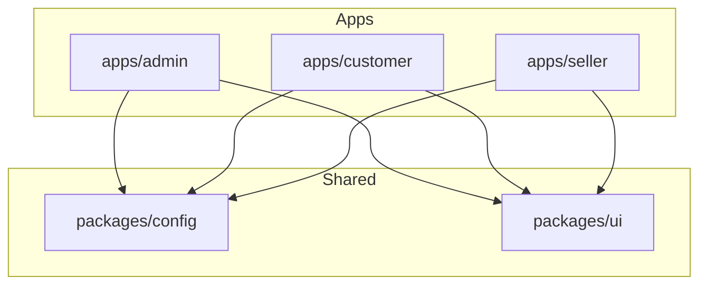
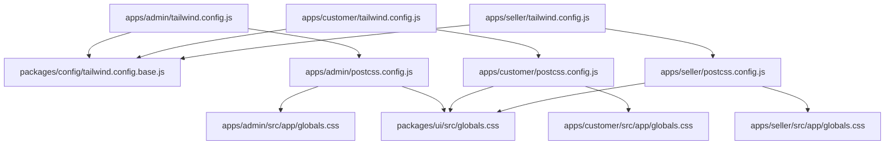
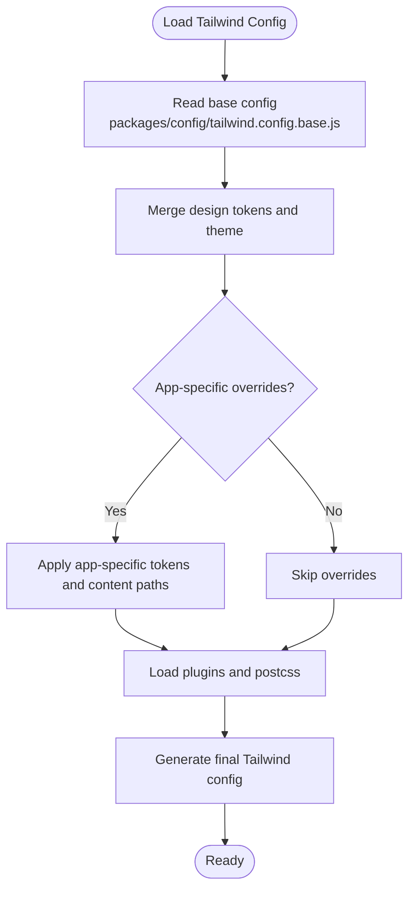
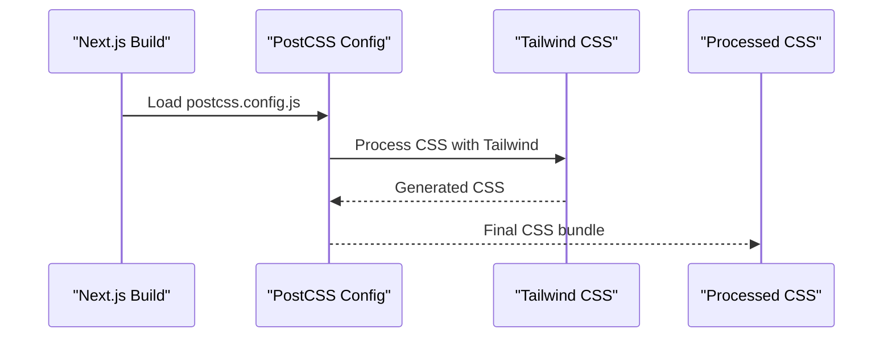
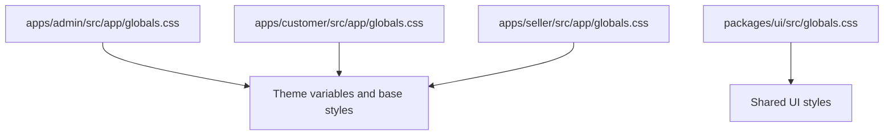
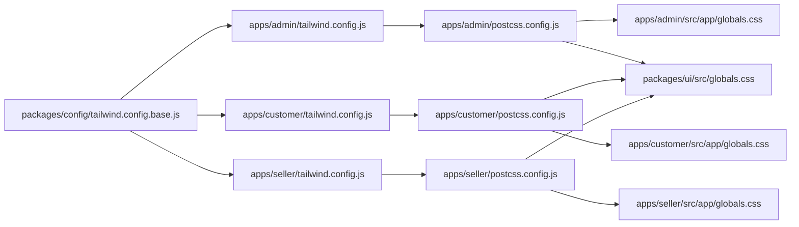

# Styling & Design System

<cite>
**Referenced Files in This Document**
- [admin/tailwind.config.js](file://apps/admin/tailwind.config.js)
- [customer/tailwind.config.js](file://apps/customer/tailwind.config.js)
- [seller/tailwind.config.js](file://apps/seller/tailwind.config.js)
- [config/tailwind.config.base.js](file://packages/config/tailwind.config.base.js)
- [admin/postcss.config.js](file://apps/admin/postcss.config.js)
- [customer/postcss.config.js](file://apps/customer/postcss.config.js)
- [seller/postcss.config.js](file://apps/seller/postcss.config.js)
- [admin/globals.css](file://apps/admin/src/app/globals.css)
- [customer/globals.css](file://apps/customer/src/app/globals.css)
- [seller/globals.css](file://apps/seller/src/app/globals.css)
- [ui/globals.css](file://packages/ui/src/globals.css)
- [DESIGN_SYSTEM_NOTES.md](file://DESIGN_SYSTEM_NOTES.md)
- [UI_UX_REVAMP_NOTES.md](file://UI_UX_REVAMP_NOTES.md)
</cite>

## Table of Contents
1. [Introduction](#introduction)
2. [Project Structure](#project-structure)
3. [Core Components](#core-components)
4. [Architecture Overview](#architecture-overview)
5. [Detailed Component Analysis](#detailed-component-analysis)
6. [Dependency Analysis](#dependency-analysis)
7. [Performance Considerations](#performance-considerations)
8. [Troubleshooting Guide](#troubleshooting-guide)
9. [Conclusion](#conclusion)
10. [Appendices](#appendices)

## Introduction
This document describes the styling and design system for Avenick Commerce across all three Next.js applications (Admin, Customer, Seller). It covers Tailwind CSS configuration, PostCSS setup, global styles, design tokens, and the shared UI foundation. It also explains component styling patterns, theme customization, responsive design, color systems, typography scales, spacing guidelines, and how to build reusable components consistently.

## Project Structure
The styling system is organized around per-application Tailwind configurations and a shared base configuration. Each app defines its own Tailwind and PostCSS configuration and global CSS. A shared UI package contributes global styles and can host reusable components and tokens.

**Diagram sources**
- [admin/tailwind.config.js](file://apps/admin/tailwind.config.js)
- [customer/tailwind.config.js](file://apps/customer/tailwind.config.js)
- [seller/tailwind.config.js](file://apps/seller/tailwind.config.js)
- [config/tailwind.config.base.js](file://packages/config/tailwind.config.base.js)

**Section sources**
- [admin/tailwind.config.js](file://apps/admin/tailwind.config.js)
- [customer/tailwind.config.js](file://apps/customer/tailwind.config.js)
- [seller/tailwind.config.js](file://apps/seller/tailwind.config.js)
- [config/tailwind.config.base.js](file://packages/config/tailwind.config.base.js)

## Core Components
- Tailwind CSS configuration per app: Each application maintains its own Tailwind configuration file to tailor design tokens, plugins, and content paths.
- Shared base configuration: A centralized base Tailwind configuration in the config package provides common design tokens and plugin defaults.
- PostCSS pipeline: Each app includes a PostCSS configuration to process CSS transformations and plugins.
- Global styles: Each app defines global CSS for foundational styles, resets, and base utilities. A shared UI package also contributes global styles.

Key responsibilities:
- apps/*/tailwind.config.js: Define design tokens, content scanning, plugins, and theme overrides.
- packages/config/tailwind.config.base.js: Provide shared design tokens and base theme settings.
- apps/*/postcss.config.js: Configure PostCSS plugins and processing steps.
- apps/*/src/app/globals.css: Define global styles for each app.
- packages/ui/src/globals.css: Provide shared UI global styles.

**Section sources**
- [admin/tailwind.config.js](file://apps/admin/tailwind.config.js)
- [customer/tailwind.config.js](file://apps/customer/tailwind.config.js)
- [seller/tailwind.config.js](file://apps/seller/tailwind.config.js)
- [config/tailwind.config.base.js](file://packages/config/tailwind.config.base.js)
- [admin/postcss.config.js](file://apps/admin/postcss.config.js)
- [customer/postcss.config.js](file://apps/customer/postcss.config.js)
- [seller/postcss.config.js](file://apps/seller/postcss.config.js)
- [admin/globals.css](file://apps/admin/src/app/globals.css)
- [customer/globals.css](file://apps/customer/src/app/globals.css)
- [seller/globals.css](file://apps/seller/src/app/globals.css)
- [ui/globals.css](file://packages/ui/src/globals.css)

## Architecture Overview
The styling architecture follows a layered approach:
- Base tokens and theme are defined centrally in the config package.
- Each app extends the base configuration with app-specific tokens and overrides.
- PostCSS transforms processed CSS, ensuring consistent output across apps.
- Global styles are scoped per app and optionally shared via the UI package.

**Diagram sources**
- [config/tailwind.config.base.js](file://packages/config/tailwind.config.base.js)
- [admin/tailwind.config.js](file://apps/admin/tailwind.config.js)
- [customer/tailwind.config.js](file://apps/customer/tailwind.config.js)
- [seller/tailwind.config.js](file://apps/seller/tailwind.config.js)
- [admin/postcss.config.js](file://apps/admin/postcss.config.js)
- [customer/postcss.config.js](file://apps/customer/postcss.config.js)
- [seller/postcss.config.js](file://apps/seller/postcss.config.js)
- [admin/globals.css](file://apps/admin/src/app/globals.css)
- [customer/globals.css](file://apps/customer/src/app/globals.css)
- [seller/globals.css](file://apps/seller/src/app/globals.css)
- [ui/globals.css](file://packages/ui/src/globals.css)

## Detailed Component Analysis

### Tailwind Configuration Layering
Each app’s Tailwind configuration extends the shared base configuration. This ensures consistent design tokens while allowing app-specific overrides.

**Diagram sources**
- [config/tailwind.config.base.js](file://packages/config/tailwind.config.base.js)
- [admin/tailwind.config.js](file://apps/admin/tailwind.config.js)
- [customer/tailwind.config.js](file://apps/customer/tailwind.config.js)
- [seller/tailwind.config.js](file://apps/seller/tailwind.config.js)

**Section sources**
- [config/tailwind.config.base.js](file://packages/config/tailwind.config.base.js)
- [admin/tailwind.config.js](file://apps/admin/tailwind.config.js)
- [customer/tailwind.config.js](file://apps/customer/tailwind.config.js)
- [seller/tailwind.config.js](file://apps/seller/tailwind.config.js)

### PostCSS Pipeline
PostCSS is configured per app to process CSS through plugins. The pipeline ensures consistent CSS output and enables features like autoprefixing, nesting, and custom transforms.

**Diagram sources**
- [admin/postcss.config.js](file://apps/admin/postcss.config.js)
- [customer/postcss.config.js](file://apps/customer/postcss.config.js)
- [seller/postcss.config.js](file://apps/seller/postcss.config.js)

**Section sources**
- [admin/postcss.config.js](file://apps/admin/postcss.config.js)
- [customer/postcss.config.js](file://apps/customer/postcss.config.js)
- [seller/postcss.config.js](file://apps/seller/postcss.config.js)

### Global Styles and Theming
Global styles define foundational CSS for each app and can include base resets, typography defaults, and theme-specific variables. The shared UI package contributes global styles that can be reused across apps.

**Diagram sources**
- [admin/globals.css](file://apps/admin/src/app/globals.css)
- [customer/globals.css](file://apps/customer/src/app/globals.css)
- [seller/globals.css](file://apps/seller/src/app/globals.css)
- [ui/globals.css](file://packages/ui/src/globals.css)

**Section sources**
- [admin/globals.css](file://apps/admin/src/app/globals.css)
- [customer/globals.css](file://apps/customer/src/app/globals.css)
- [seller/globals.css](file://apps/seller/src/app/globals.css)
- [ui/globals.css](file://packages/ui/src/globals.css)

### Design Tokens and Color Systems
Design tokens are defined in the shared base configuration and extended per app. Tokens typically include:
- Colors: primary, secondary, neutral, background, surface, and semantic states.
- Typography: font families, sizes, weights, line heights, and letter spacing.
- Spacing: padding, margin, gap, and layout units.
- Breakpoints: responsive thresholds for mobile-first design.
- Shadows and borders: consistent elevation and border radius scales.

These tokens are consumed by Tailwind utilities and can be customized per app while maintaining consistency.

**Section sources**
- [config/tailwind.config.base.js](file://packages/config/tailwind.config.base.js)
- [admin/tailwind.config.js](file://apps/admin/tailwind.config.js)
- [customer/tailwind.config.js](file://apps/customer/tailwind.config.js)
- [seller/tailwind.config.js](file://apps/seller/tailwind.config.js)

### Typography Scale and Spacing Guidelines
Typography and spacing scales are established in the base configuration and applied consistently across apps. Use these guidelines to maintain readability and rhythm:
- Typography scale: Choose appropriate sizes and weights for headings, body text, captions, and code.
- Line height: Pair font sizes with optimal line heights for readability.
- Letter spacing: Adjust tracking for different contexts (e.g., hero text vs. body).
- Spacing units: Use consistent spacing increments (e.g., multiples of 4px) for padding, margins, and gaps.

**Section sources**
- [config/tailwind.config.base.js](file://packages/config/tailwind.config.base.js)

### Responsive Design Implementation
Responsive breakpoints are defined in the base configuration. Implement mobile-first design by:
- Starting with base styles for small screens.
- Using Tailwind’s responsive prefixes to adjust layouts on larger screens.
- Testing across breakpoints to ensure readability and usability.

**Section sources**
- [config/tailwind.config.base.js](file://packages/config/tailwind.config.base.js)

### Component Styling Patterns and Composition
Component styling follows a consistent pattern:
- Prefer utility classes for atomic styling.
- Compose components by combining utility classes for predictable outcomes.
- Use variants (hover, focus, disabled) to manage interactive states.
- Keep component styles declarative and avoid inline styles.

**Section sources**
- [admin/tailwind.config.js](file://apps/admin/tailwind.config.js)
- [customer/tailwind.config.js](file://apps/customer/tailwind.config.js)
- [seller/tailwind.config.js](file://apps/seller/tailwind.config.js)

### Theme Customization Across Apps
Customize themes per app by:
- Extending the base configuration with app-specific tokens.
- Overriding colors, typography, and spacing to reflect brand identity.
- Ensuring consistency by referencing shared tokens where possible.

**Section sources**
- [config/tailwind.config.base.js](file://packages/config/tailwind.config.base.js)
- [admin/tailwind.config.js](file://apps/admin/tailwind.config.js)
- [customer/tailwind.config.js](file://apps/customer/tailwind.config.js)
- [seller/tailwind.config.js](file://apps/seller/tailwind.config.js)

### Creating Reusable Components and Variants
To create reusable components:
- Define consistent props for variant states (size, color, shape).
- Encapsulate variant logic in utility classes or a variant generator.
- Document component APIs and usage patterns.
- Test variants across responsive breakpoints.

**Section sources**
- [admin/tailwind.config.js](file://apps/admin/tailwind.config.js)
- [customer/tailwind.config.js](file://apps/customer/tailwind.config.js)
- [seller/tailwind.config.js](file://apps/seller/tailwind.config.js)

### CSS-in-JS Patterns and Integration
While the codebase primarily uses Tailwind CSS utilities, CSS-in-JS can complement the design system for dynamic or theme-driven styles:
- Use CSS-in-JS libraries for complex animations or dynamic themes.
- Integrate CSS-in-JS by generating tokens from the shared design system.
- Ensure CSS-in-JS does not override Tailwind utilities unintentionally.

[No sources needed since this section provides general guidance]

### Design System Notes and UX Revamp
Refer to the project’s design system documentation for detailed notes on branding, component libraries, and UX improvements.

**Section sources**
- [DESIGN_SYSTEM_NOTES.md](file://DESIGN_SYSTEM_NOTES.md)
- [UI_UX_REVAMP_NOTES.md](file://UI_UX_REVAMP_NOTES.md)

## Dependency Analysis
The styling stack depends on Tailwind and PostCSS configurations, with shared tokens and global styles flowing from the config and UI packages into each app.

**Diagram sources**
- [config/tailwind.config.base.js](file://packages/config/tailwind.config.base.js)
- [admin/tailwind.config.js](file://apps/admin/tailwind.config.js)
- [customer/tailwind.config.js](file://apps/customer/tailwind.config.js)
- [seller/tailwind.config.js](file://apps/seller/tailwind.config.js)
- [admin/postcss.config.js](file://apps/admin/postcss.config.js)
- [customer/postcss.config.js](file://apps/customer/postcss.config.js)
- [seller/postcss.config.js](file://apps/seller/postcss.config.js)
- [admin/globals.css](file://apps/admin/src/app/globals.css)
- [customer/globals.css](file://apps/customer/src/app/globals.css)
- [seller/globals.css](file://apps/seller/src/app/globals.css)
- [ui/globals.css](file://packages/ui/src/globals.css)

**Section sources**
- [config/tailwind.config.base.js](file://packages/config/tailwind.config.base.js)
- [admin/tailwind.config.js](file://apps/admin/tailwind.config.js)
- [customer/tailwind.config.js](file://apps/customer/tailwind.config.js)
- [seller/tailwind.config.js](file://apps/seller/tailwind.config.js)
- [admin/postcss.config.js](file://apps/admin/postcss.config.js)
- [customer/postcss.config.js](file://apps/customer/postcss.config.js)
- [seller/postcss.config.js](file://apps/seller/postcss.config.js)
- [admin/globals.css](file://apps/admin/src/app/globals.css)
- [customer/globals.css](file://apps/customer/src/app/globals.css)
- [seller/globals.css](file://apps/seller/src/app/globals.css)
- [ui/globals.css](file://packages/ui/src/globals.css)

## Performance Considerations
- Purge unused CSS: Ensure content paths in Tailwind configs include all template locations to remove unused styles.
- Minimize custom CSS: Prefer utility classes to reduce CSS bloat.
- Optimize PostCSS plugins: Enable only necessary plugins to reduce build time.
- Use responsive variants judiciously: Avoid excessive breakpoint-specific styles.

[No sources needed since this section provides general guidance]

## Troubleshooting Guide
Common styling issues and resolutions:
- Styles not applying: Verify Tailwind content paths include component files and that PostCSS is configured correctly.
- Theme inconsistencies: Confirm app-specific overrides align with shared base tokens.
- Global styles conflicts: Review app-specific globals.css and shared UI globals.css for overlapping declarations.
- Build errors: Check PostCSS plugin compatibility and Tailwind version alignment across apps.

**Section sources**
- [admin/tailwind.config.js](file://apps/admin/tailwind.config.js)
- [customer/tailwind.config.js](file://apps/customer/tailwind.config.js)
- [seller/tailwind.config.js](file://apps/seller/tailwind.config.js)
- [admin/postcss.config.js](file://apps/admin/postcss.config.js)
- [customer/postcss.config.js](file://apps/customer/postcss.config.js)
- [seller/postcss.config.js](file://apps/seller/postcss.config.js)
- [admin/globals.css](file://apps/admin/src/app/globals.css)
- [customer/globals.css](file://apps/customer/src/app/globals.css)
- [seller/globals.css](file://apps/seller/src/app/globals.css)
- [ui/globals.css](file://packages/ui/src/globals.css)

## Conclusion
Avenick Commerce employs a scalable styling architecture centered on a shared Tailwind base configuration with app-specific overrides. The PostCSS pipeline ensures consistent CSS processing, while global styles provide foundational theming. By adhering to design tokens, responsive patterns, and component composition guidelines, teams can build reusable, consistent UIs across Admin, Customer, and Seller applications.

## Appendices
- Design system documentation references:
  - [DESIGN_SYSTEM_NOTES.md](file://DESIGN_SYSTEM_NOTES.md)
  - [UI_UX_REVAMP_NOTES.md](file://UI_UX_REVAMP_NOTES.md)

**Section sources**
- [DESIGN_SYSTEM_NOTES.md](file://DESIGN_SYSTEM_NOTES.md)
- [UI_UX_REVAMP_NOTES.md](file://UI_UX_REVAMP_NOTES.md)