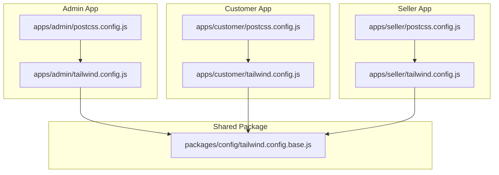
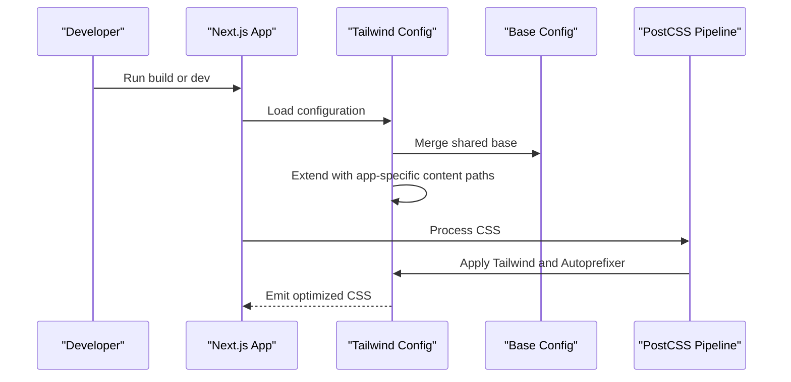
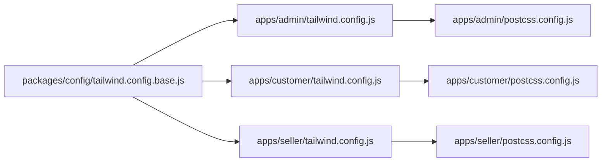

# Tailwind CSS Configuration

<cite>
**Referenced Files in This Document**
- [admin/tailwind.config.js](file://apps/admin/tailwind.config.js)
- [customer/tailwind.config.js](file://apps/customer/tailwind.config.js)
- [seller/tailwind.config.js](file://apps/seller/tailwind.config.js)
- [admin/postcss.config.js](file://apps/admin/postcss.config.js)
- [customer/postcss.config.js](file://apps/customer/postcss.config.js)
- [seller/postcss.config.js](file://apps/seller/postcss.config.js)
- [config/tailwind.config.base.js](file://packages/config/tailwind.config.base.js)
</cite>

## Table of Contents
1. [Introduction](#introduction)
2. [Project Structure](#project-structure)
3. [Core Components](#core-components)
4. [Architecture Overview](#architecture-overview)
5. [Detailed Component Analysis](#detailed-component-analysis)
6. [Dependency Analysis](#dependency-analysis)
7. [Performance Considerations](#performance-considerations)
8. [Troubleshooting Guide](#troubleshooting-guide)
9. [Conclusion](#conclusion)

## Introduction
This document explains the Tailwind CSS configuration strategy for Avenick Commerce across three Next.js applications: Admin, Customer, and Seller. It covers the shared base configuration, application-specific overrides, content path scanning, plugin setup via PostCSS, and how the shared UI package integrates into the design system. Practical guidance is included for extending the design system consistently while maintaining a unified look and feel across all portals.

## Project Structure
Each application defines its own Tailwind configuration that composes a shared base configuration and extends it with application-specific content scanning. All applications share identical PostCSS configuration with Tailwind and Autoprefixer enabled.

**Diagram sources**
- [admin/tailwind.config.js:1-11](file://apps/admin/tailwind.config.js#L1-L11)
- [customer/tailwind.config.js:1-11](file://apps/customer/tailwind.config.js#L1-L11)
- [seller/tailwind.config.js:1-11](file://apps/seller/tailwind.config.js#L1-L11)
- [admin/postcss.config.js:1-7](file://apps/admin/postcss.config.js#L1-L7)
- [customer/postcss.config.js:1-7](file://apps/customer/postcss.config.js#L1-L7)
- [seller/postcss.config.js:1-7](file://apps/seller/postcss.config.js#L1-L7)
- [config/tailwind.config.base.js:1-125](file://packages/config/tailwind.config.base.js#L1-L125)

**Section sources**
- [admin/tailwind.config.js:1-11](file://apps/admin/tailwind.config.js#L1-L11)
- [customer/tailwind.config.js:1-11](file://apps/customer/tailwind.config.js#L1-L11)
- [seller/tailwind.config.js:1-11](file://apps/seller/tailwind.config.js#L1-L11)
- [admin/postcss.config.js:1-7](file://apps/admin/postcss.config.js#L1-L7)
- [customer/postcss.config.js:1-7](file://apps/customer/postcss.config.js#L1-L7)
- [seller/postcss.config.js:1-7](file://apps/seller/postcss.config.js#L1-L7)
- [config/tailwind.config.base.js:1-125](file://packages/config/tailwind.config.base.js#L1-L125)

## Core Components
- Shared base configuration: Defines global design tokens (colors, typography, spacing, shadows, animations, and backgrounds) and establishes the design system foundation. It also sets the dark mode strategy and empty content array for scanning.
- Application-specific Tailwind configs: Import the shared base and override content paths to include the app’s source and the shared UI package source.
- PostCSS pipeline: Enables Tailwind and Autoprefixer for each app.

Key characteristics:
- Dark mode strategy set to class-based.
- Content scanning includes application source and shared UI package source to ensure all components contribute styles.
- Plugins array is intentionally left empty in the base; apps can add plugins locally if needed.

**Section sources**
- [config/tailwind.config.base.js:1-125](file://packages/config/tailwind.config.base.js#L1-L125)
- [admin/tailwind.config.js:1-11](file://apps/admin/tailwind.config.js#L1-L11)
- [customer/tailwind.config.js:1-11](file://apps/customer/tailwind.config.js#L1-L11)
- [seller/tailwind.config.js:1-11](file://apps/seller/tailwind.config.js#L1-L11)
- [admin/postcss.config.js:1-7](file://apps/admin/postcss.config.js#L1-L7)
- [customer/postcss.config.js:1-7](file://apps/customer/postcss.config.js#L1-L7)
- [seller/postcss.config.js:1-7](file://apps/seller/postcss.config.js#L1-L7)

## Architecture Overview
The configuration architecture follows a composition pattern:
- A single shared base configuration supplies the canonical design system.
- Each application composes the base and augments it with local content scanning.
- PostCSS orchestrates Tailwind processing and vendor prefixing.

**Diagram sources**
- [admin/tailwind.config.js:1-11](file://apps/admin/tailwind.config.js#L1-L11)
- [customer/tailwind.config.js:1-11](file://apps/customer/tailwind.config.js#L1-L11)
- [seller/tailwind.config.js:1-11](file://apps/seller/tailwind.config.js#L1-L11)
- [config/tailwind.config.base.js:1-125](file://packages/config/tailwind.config.base.js#L1-L125)
- [admin/postcss.config.js:1-7](file://apps/admin/postcss.config.js#L1-L7)
- [customer/postcss.config.js:1-7](file://apps/customer/postcss.config.js#L1-L7)
- [seller/postcss.config.js:1-7](file://apps/seller/postcss.config.js#L1-L7)

## Detailed Component Analysis

### Shared Base Configuration
The base configuration centralizes:
- Design tokens via semantic color palettes (primary, secondary, accent, neutral, and state colors).
- Typography families bound to CSS variables for font swapping and localization.
- Border radius, box shadows, and gradient backgrounds.
- Animation keyframes and reusable animation names.
- Dark mode strategy set to class-based.
- Empty content array to defer scanning to application-specific configs.

Practical implications:
- All apps inherit the same palette and tokens, ensuring visual consistency.
- Adding or modifying tokens here propagates across all apps.
- Keep the base minimal and additive to avoid conflicts.

**Section sources**
- [config/tailwind.config.base.js:1-125](file://packages/config/tailwind.config.base.js#L1-L125)

### Application-Specific Overrides
Each app’s Tailwind config:
- Imports the shared base configuration.
- Extends content paths to include:
  - The app’s own source tree.
  - The shared UI package source tree.

Why this matters:
- Ensures Tailwind scans components from the shared UI package alongside app-specific components.
- Prevents unused CSS elimination for shared components.
- Keeps app-specific overrides concise and focused.

**Section sources**
- [admin/tailwind.config.js:1-11](file://apps/admin/tailwind.config.js#L1-L11)
- [customer/tailwind.config.js:1-11](file://apps/customer/tailwind.config.js#L1-L11)
- [seller/tailwind.config.js:1-11](file://apps/seller/tailwind.config.js#L1-L11)

### PostCSS Plugin Setup
All apps use the same PostCSS configuration:
- Tailwind CSS plugin.
- Autoprefixer plugin.

Outcome:
- Consistent vendor prefixing and deterministic CSS generation across apps.
- Simplifies maintenance and reduces environment drift.

**Section sources**
- [admin/postcss.config.js:1-7](file://apps/admin/postcss.config.js#L1-L7)
- [customer/postcss.config.js:1-7](file://apps/customer/postcss.config.js#L1-L7)
- [seller/postcss.config.js:1-7](file://apps/seller/postcss.config.js#L1-L7)

### Content Path Scanning Patterns
Content scanning is configured per-app to include:
- Application source directory.
- Shared UI package source directory.

Guidelines:
- Keep patterns broad enough to capture all component variants and dynamic class usage.
- Avoid overly broad globs that could slow builds.
- When adding new shared components, ensure their files match existing patterns.

**Section sources**
- [admin/tailwind.config.js:6-9](file://apps/admin/tailwind.config.js#L6-L9)
- [customer/tailwind.config.js:6-9](file://apps/customer/tailwind.config.js#L6-L9)
- [seller/tailwind.config.js:6-9](file://apps/seller/tailwind.config.js#L6-L9)

### Extending the Design System
Recommended approaches:
- Add new semantic tokens in the base configuration to maintain consistency across apps.
- Introduce new animation keyframes or shadow variants in the base for global reuse.
- Use the base configuration as the single source of truth for brand colors and typography families.

Maintaining consistency:
- Prefer base-level additions over app-specific overrides.
- If an app needs a variant, consider whether it belongs in the shared base.

**Section sources**
- [config/tailwind.config.base.js:5-121](file://packages/config/tailwind.config.base.js#L5-L121)

### Adding Custom Utilities
When adding custom utilities:
- Define them in the base configuration so all apps benefit.
- If a utility is truly app-specific, apply it within the app’s Tailwind config while keeping the change localized.

Plugins:
- The base configuration leaves the plugins array empty. Apps can add plugins locally if needed, but coordinate with the team to avoid fragmentation.

**Section sources**
- [config/tailwind.config.base.js:123-124](file://packages/config/tailwind.config.base.js#L123-L124)

### Relationship Between Shared UI Package and App Configurations
The shared UI package contributes components that must be scanned by Tailwind. App configurations include the UI package source in their content arrays, ensuring:
- Proper extraction of utility classes used inside shared components.
- No dead-code elimination for shared UI utilities.

Best practices:
- Keep UI package component class names aligned with the shared design tokens.
- When refactoring shared components, update class names to remain within the established palette and spacing scale.

**Section sources**
- [admin/tailwind.config.js:6-9](file://apps/admin/tailwind.config.js#L6-L9)
- [customer/tailwind.config.js:6-9](file://apps/customer/tailwind.config.js#L6-L9)
- [seller/tailwind.config.js:6-9](file://apps/seller/tailwind.config.js#L6-L9)

## Dependency Analysis
The configuration dependency chain is straightforward and centralized:

Observations:
- All apps depend on the shared base configuration.
- PostCSS is independent per app but identical in structure.
- There are no circular dependencies; the direction is unidirectional from base to apps.

**Diagram sources**
- [config/tailwind.config.base.js:1-125](file://packages/config/tailwind.config.base.js#L1-L125)
- [admin/tailwind.config.js:1-11](file://apps/admin/tailwind.config.js#L1-L11)
- [customer/tailwind.config.js:1-11](file://apps/customer/tailwind.config.js#L1-L11)
- [seller/tailwind.config.js:1-11](file://apps/seller/tailwind.config.js#L1-L11)
- [admin/postcss.config.js:1-7](file://apps/admin/postcss.config.js#L1-L7)
- [customer/postcss.config.js:1-7](file://apps/customer/postcss.config.js#L1-L7)
- [seller/postcss.config.js:1-7](file://apps/seller/postcss.config.js#L1-L7)

**Section sources**
- [config/tailwind.config.base.js:1-125](file://packages/config/tailwind.config.base.js#L1-L125)
- [admin/tailwind.config.js:1-11](file://apps/admin/tailwind.config.js#L1-L11)
- [customer/tailwind.config.js:1-11](file://apps/customer/tailwind.config.js#L1-L11)
- [seller/tailwind.config.js:1-11](file://apps/seller/tailwind.config.js#L1-L11)
- [admin/postcss.config.js:1-7](file://apps/admin/postcss.config.js#L1-L7)
- [customer/postcss.config.js:1-7](file://apps/customer/postcss.config.js#L1-L7)
- [seller/postcss.config.js:1-7](file://apps/seller/postcss.config.js#L1-L7)

## Performance Considerations
- Content scanning scope: Keep patterns precise to reduce unnecessary scanning and improve build times.
- Avoid excessive plugin usage in the base; add plugins locally only when necessary.
- Prefer CSS variables for theme tokens to minimize generated CSS duplication.
- Use the shared base for heavy utilities and animations to maximize reuse across apps.

## Troubleshooting Guide
Common issues and resolutions:
- New shared component classes not generating:
  - Verify the shared UI package source is included in the app’s content array.
  - Ensure the component’s class names align with the shared design tokens.
- Unexpected dark mode behavior:
  - Confirm dark mode is set to class-based in the base configuration.
  - Ensure the class is toggled appropriately in the app shell.
- Build performance regressions:
  - Review content patterns for unnecessary recursion or overly broad globs.
  - Consolidate custom utilities into the base to reduce duplication.
- Inconsistent styles across apps:
  - Check that each app imports the shared base and does not override core tokens.
  - Align typography and color families with the base configuration.

**Section sources**
- [config/tailwind.config.base.js:3-4](file://packages/config/tailwind.config.base.js#L3-L4)
- [admin/tailwind.config.js:6-9](file://apps/admin/tailwind.config.js#L6-L9)
- [customer/tailwind.config.js:6-9](file://apps/customer/tailwind.config.js#L6-L9)
- [seller/tailwind.config.js:6-9](file://apps/seller/tailwind.config.js#L6-L9)

## Conclusion
Avenick Commerce employs a clean, scalable Tailwind configuration strategy centered on a shared base configuration and consistent app-specific overrides. By scanning both app and shared UI sources, enabling Tailwind through PostCSS, and centralizing design tokens in the base, the system ensures visual consistency, maintainability, and predictable performance across the Admin, Customer, and Seller applications.