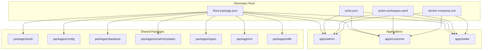
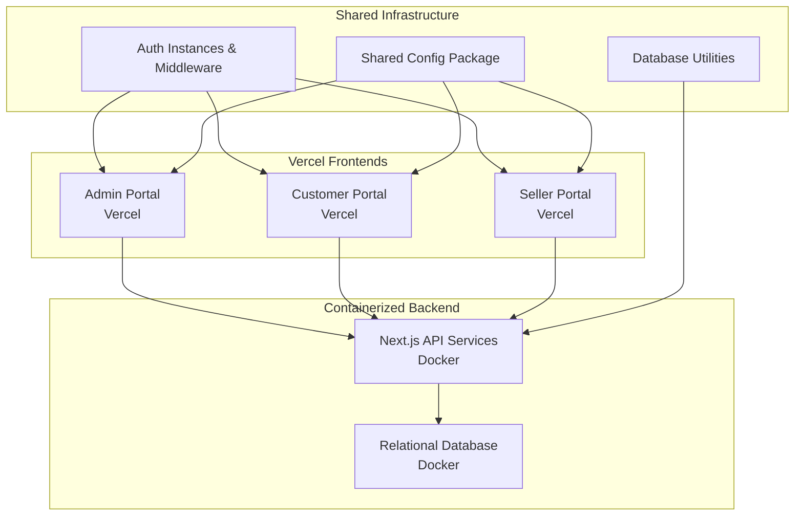
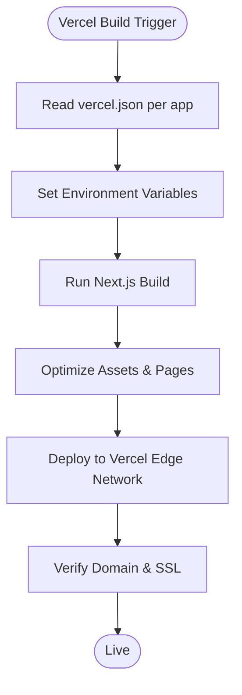
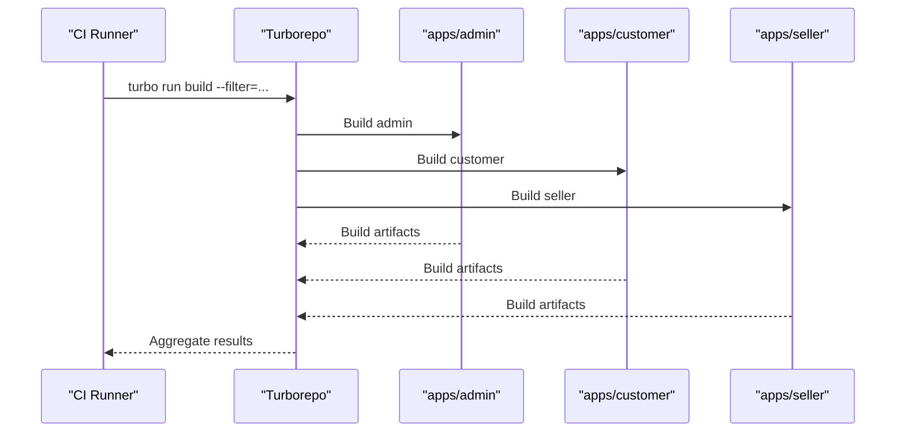
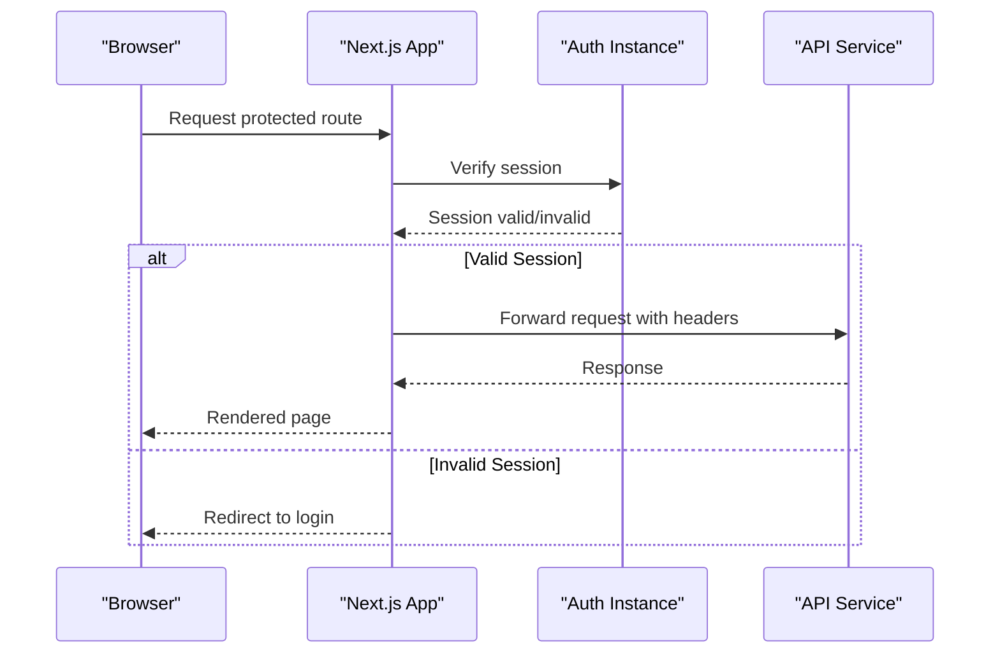
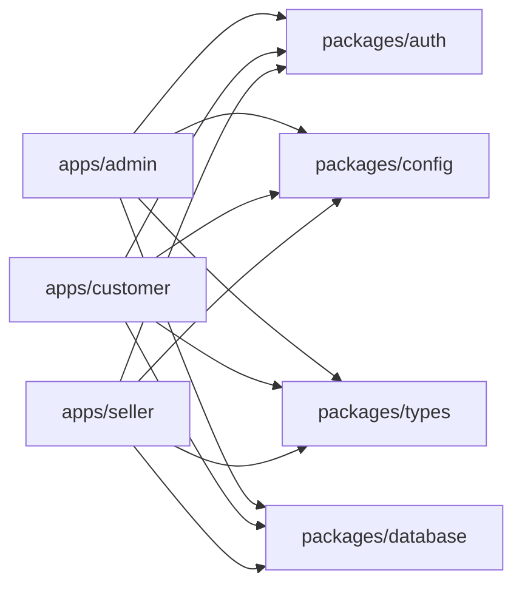

# Deployment Configuration

<cite>
**Referenced Files in This Document**
- [docker-compose.yml](file://docker-compose.yml)
- [turbo.json](file://turbo.json)
- [pnpm-workspace.yaml](file://pnpm-workspace.yaml)
- [package.json](file://package.json)
- [apps/admin/package.json](file://apps/admin/package.json)
- [apps/customer/package.json](file://apps/customer/package.json)
- [apps/seller/package.json](file://apps/seller/package.json)
- [apps/admin/vercel.json](file://apps/admin/vercel.json)
- [apps/customer/vercel.json](file://apps/customer/vercel.json)
- [apps/seller/vercel.json](file://apps/seller/vercel.json)
- [apps/admin/next.config.mjs](file://apps/admin/next.config.mjs)
- [apps/customer/next.config.mjs](file://apps/customer/next.config.mjs)
- [apps/seller/next.config.mjs](file://apps/seller/next.config.mjs)
- [apps/admin/src/lib/auth-instance.ts](file://apps/admin/src/lib/auth-instance.ts)
- [apps/customer/src/lib/auth-instance.ts](file://apps/customer/src/lib/auth-instance.ts)
- [apps/seller/src/lib/auth-instance.ts](file://apps/seller/src/lib/auth-instance.ts)
- [apps/admin/src/middleware.ts](file://apps/admin/src/middleware.ts)
- [apps/customer/src/middleware.ts](file://apps/customer/src/middleware.ts)
- [apps/seller/src/middleware.ts](file://apps/seller/src/middleware.ts)
- [packages/config/package.json](file://packages/config/package.json)
- [packages/database/package.json](file://packages/database/package.json)
- [DATABASE_NOTES.md](file://DATABASE_NOTES.md)
</cite>

## Table of Contents
1. [Introduction](#introduction)
2. [Project Structure](#project-structure)
3. [Core Components](#core-components)
4. [Architecture Overview](#architecture-overview)
5. [Detailed Component Analysis](#detailed-component-analysis)
6. [Dependency Analysis](#dependency-analysis)
7. [Performance Considerations](#performance-considerations)
8. [Troubleshooting Guide](#troubleshooting-guide)
9. [Conclusion](#conclusion)
10. [Appendices](#appendices)

## Introduction
This document provides comprehensive deployment configuration guidance for Avenick Commerce across its three application portals: Admin, Customer, and Seller. It covers containerization with Docker Compose, environment variable management, production-ready configurations, Vercel deployment settings per Next.js application, monorepo deployment via Turborepo, dependency management, build optimization, database deployment considerations, migration strategies, backup procedures, and step-by-step deployment guides for development, staging, and production. Security configurations, SSL certificates, CDN setup, and load balancing considerations are also addressed.

## Project Structure
Avenick Commerce follows a monorepo architecture using pnpm workspaces and Turborepo for build orchestration. The repository includes:
- Three Next.js applications under apps/: admin, customer, and seller
- Shared packages under packages/: auth, config, database, email-templates, types, ui, utils
- Root configuration files for Docker Compose, Turborepo, and pnpm workspace management

**Diagram sources**
- [turbo.json](file://turbo.json)
- [pnpm-workspace.yaml](file://pnpm-workspace.yaml)
- [docker-compose.yml](file://docker-compose.yml)
- [package.json](file://package.json)

**Section sources**
- [turbo.json](file://turbo.json)
- [pnpm-workspace.yaml](file://pnpm-workspace.yaml)
- [package.json](file://package.json)

## Core Components
This section outlines the primary deployment components and their roles:
- Docker Compose: Defines services for the backend API and database, networking, volumes, and environment variables.
- Turborepo: Orchestrates build caching, task execution, and pipeline orchestration across the monorepo.
- Vercel Configurations: Per-application vercel.json files define build settings, environment variables, and custom domains.
- Next.js Configurations: Application-specific next.config.mjs files manage runtime behavior, asset optimization, and server settings.
- Authentication Middleware: Shared authentication instances and middleware enforce session-based access control across portals.
- Shared Packages: Centralized configuration, database utilities, and type definitions support consistent deployment behavior.

Key deployment artifacts:
- Docker Compose service definitions for API and database
- Turborepo pipeline tasks for building and caching
- Vercel JSON configurations for each portal
- Next.js configurations for each portal
- Authentication and middleware modules
- Shared configuration and database packages

**Section sources**
- [docker-compose.yml](file://docker-compose.yml)
- [turbo.json](file://turbo.json)
- [apps/admin/vercel.json](file://apps/admin/vercel.json)
- [apps/customer/vercel.json](file://apps/customer/vercel.json)
- [apps/seller/vercel.json](file://apps/seller/vercel.json)
- [apps/admin/next.config.mjs](file://apps/admin/next.config.mjs)
- [apps/customer/next.config.mjs](file://apps/customer/next.config.mjs)
- [apps/seller/next.config.mjs](file://apps/seller/next.config.mjs)
- [apps/admin/src/lib/auth-instance.ts](file://apps/admin/src/lib/auth-instance.ts)
- [apps/customer/src/lib/auth-instance.ts](file://apps/customer/src/lib/auth-instance.ts)
- [apps/seller/src/lib/auth-instance.ts](file://apps/seller/src/lib/auth-instance.ts)
- [apps/admin/src/middleware.ts](file://apps/admin/src/middleware.ts)
- [apps/customer/src/middleware.ts](file://apps/customer/src/middleware.ts)
- [apps/seller/src/middleware.ts](file://apps/seller/src/middleware.ts)
- [packages/config/package.json](file://packages/config/package.json)
- [packages/database/package.json](file://packages/database/package.json)

## Architecture Overview
The deployment architecture integrates containerized backend services with frontend deployments on Vercel. The backend API is containerized alongside a relational database, while each Next.js application is independently deployed to Vercel with environment-specific configurations.

**Diagram sources**
- [docker-compose.yml](file://docker-compose.yml)
- [apps/admin/vercel.json](file://apps/admin/vercel.json)
- [apps/customer/vercel.json](file://apps/customer/vercel.json)
- [apps/seller/vercel.json](file://apps/seller/vercel.json)
- [apps/admin/src/lib/auth-instance.ts](file://apps/admin/src/lib/auth-instance.ts)
- [apps/customer/src/lib/auth-instance.ts](file://apps/customer/src/lib/auth-instance.ts)
- [apps/seller/src/lib/auth-instance.ts](file://apps/seller/src/lib/auth-instance.ts)
- [packages/config/package.json](file://packages/config/package.json)
- [packages/database/package.json](file://packages/database/package.json)

## Detailed Component Analysis

### Docker Containerization Setup
- Services: The compose file defines backend API and database services with explicit ports, environment variables, and persistent volumes.
- Networking: Services communicate over a shared network; ensure port conflicts are resolved during deployment.
- Environment Variables: Database credentials, API secrets, and feature flags are managed via environment files or CI/CD secrets.
- Volumes: Persistent storage is configured for the database to retain data across deployments.
- Health Checks: Configure health checks for readiness and liveness to enable safe rolling updates.

Recommended practices:
- Use separate environment files for development, staging, and production.
- Store sensitive keys in a secrets manager and inject them at runtime.
- Enable resource limits and restart policies for production stability.

**Section sources**
- [docker-compose.yml](file://docker-compose.yml)

### Environment Variable Management
- Centralized Configuration: The shared config package consolidates environment variables and runtime settings used across applications.
- Application-Specific Overrides: Each Next.js application maintains its own environment variables for domain routing, authentication, and feature flags.
- Secret Rotation: Rotate secrets periodically and update environment variables across services without downtime.

Best practices:
- Use encrypted secret storage for production.
- Maintain a strict separation between public and private environment variables.
- Document all required variables in a centralized location.

**Section sources**
- [packages/config/package.json](file://packages/config/package.json)
- [apps/admin/vercel.json](file://apps/admin/vercel.json)
- [apps/customer/vercel.json](file://apps/customer/vercel.json)
- [apps/seller/vercel.json](file://apps/seller/vercel.json)

### Production-Ready Configurations
- Build Optimization: Enable static export and image optimization in Next.js configurations for improved performance.
- Runtime Settings: Configure API base URLs, logging levels, and error reporting for production.
- Security Headers: Enforce secure headers and CSP policies via middleware and server configurations.
- CDN Integration: Route assets through a CDN for global distribution and reduced latency.

**Section sources**
- [apps/admin/next.config.mjs](file://apps/admin/next.config.mjs)
- [apps/customer/next.config.mjs](file://apps/customer/next.config.mjs)
- [apps/seller/next.config.mjs](file://apps/seller/next.config.mjs)

### Vercel Deployment Configuration
Each portal has a dedicated vercel.json file controlling builds, environment variables, and custom domains.

**Diagram sources**
- [apps/admin/vercel.json](file://apps/admin/vercel.json)
- [apps/customer/vercel.json](file://apps/customer/vercel.json)
- [apps/seller/vercel.json](file://apps/seller/vercel.json)

Key elements per portal:
- Build Settings: Define build commands, output directories, and framework detection.
- Environment Variables: Map secrets and configuration values to the runtime environment.
- Custom Domains: Configure primary and canonical domains with automatic SSL provisioning.
- Routing Rules: Redirect legacy paths and enforce HTTPS.

**Section sources**
- [apps/admin/vercel.json](file://apps/admin/vercel.json)
- [apps/customer/vercel.json](file://apps/customer/vercel.json)
- [apps/seller/vercel.json](file://apps/seller/vercel.json)

### Monorepo Deployment Strategy Using Turborepo
Turborepo orchestrates build caching and task execution across the monorepo.

**Diagram sources**
- [turbo.json](file://turbo.json)

Operational guidance:
- Define pipeline tasks for linting, type checking, and building per application.
- Leverage caching to accelerate repeated builds.
- Use filtering to target specific apps during partial deployments.

**Section sources**
- [turbo.json](file://turbo.json)

### Dependency Management
- Workspace Configuration: pnpm-workspace.yaml groups related packages for consistent dependency resolution.
- Root Dependencies: The root package.json coordinates shared scripts and tooling.
- Application Dependencies: Each app declares its own dependencies and peer requirements.

Recommendations:
- Keep shared dependencies in packages/* to avoid duplication.
- Pin versions carefully and use lockfiles for reproducibility.
- Audit dependencies regularly for vulnerabilities.

**Section sources**
- [pnpm-workspace.yaml](file://pnpm-workspace.yaml)
- [package.json](file://package.json)
- [apps/admin/package.json](file://apps/admin/package.json)
- [apps/customer/package.json](file://apps/customer/package.json)
- [apps/seller/package.json](file://apps/seller/package.json)

### Database Deployment Considerations
- Schema Management: Use the database package to manage migrations and schema evolution.
- Migration Strategies: Apply incremental migrations with rollback plans before production changes.
- Backup Procedures: Schedule regular backups and test restoration procedures.
- Monitoring: Track database performance and set alerts for anomalies.

**Section sources**
- [packages/database/package.json](file://packages/database/package.json)
- [DATABASE_NOTES.md](file://DATABASE_NOTES.md)

### Authentication and Middleware
Authentication is enforced via shared auth instances and middleware across portals.

**Diagram sources**
- [apps/admin/src/lib/auth-instance.ts](file://apps/admin/src/lib/auth-instance.ts)
- [apps/customer/src/lib/auth-instance.ts](file://apps/customer/src/lib/auth-instance.ts)
- [apps/seller/src/lib/auth-instance.ts](file://apps/seller/src/lib/auth-instance.ts)
- [apps/admin/src/middleware.ts](file://apps/admin/src/middleware.ts)
- [apps/customer/src/middleware.ts](file://apps/customer/src/middleware.ts)
- [apps/seller/src/middleware.ts](file://apps/seller/src/middleware.ts)

**Section sources**
- [apps/admin/src/lib/auth-instance.ts](file://apps/admin/src/lib/auth-instance.ts)
- [apps/customer/src/lib/auth-instance.ts](file://apps/customer/src/lib/auth-instance.ts)
- [apps/seller/src/lib/auth-instance.ts](file://apps/seller/src/lib/auth-instance.ts)
- [apps/admin/src/middleware.ts](file://apps/admin/src/middleware.ts)
- [apps/customer/src/middleware.ts](file://apps/customer/src/middleware.ts)
- [apps/seller/src/middleware.ts](file://apps/seller/src/middleware.ts)

### Security Configurations, SSL Certificates, CDN, and Load Balancing
- SSL Certificates: Vercel provisions SSL automatically for custom domains; ensure DNS records are configured correctly.
- CDN Setup: Utilize Vercel’s edge network for global distribution; configure cache policies for optimal performance.
- Load Balancing: Deploy multiple instances behind a load balancer; ensure sticky sessions if required by authentication.
- Security Headers: Enforce secure headers and CSP policies via middleware and server configurations.

[No sources needed since this section provides general guidance]

## Dependency Analysis
This section maps dependencies among applications and shared packages to inform deployment sequencing and isolation.

**Diagram sources**
- [apps/admin/package.json](file://apps/admin/package.json)
- [apps/customer/package.json](file://apps/customer/package.json)
- [apps/seller/package.json](file://apps/seller/package.json)
- [packages/auth/package.json](file://packages/auth/package.json)
- [packages/config/package.json](file://packages/config/package.json)
- [packages/database/package.json](file://packages/database/package.json)
- [packages/types/package.json](file://packages/types/package.json)

**Section sources**
- [apps/admin/package.json](file://apps/admin/package.json)
- [apps/customer/package.json](file://apps/customer/package.json)
- [apps/seller/package.json](file://apps/seller/package.json)

## Performance Considerations
- Build Optimization: Enable static generation and image optimization in Next.js configurations.
- Caching: Use Turborepo caching and Vercel’s edge caching to reduce build times and latency.
- Asset Delivery: Serve static assets via CDN and optimize images and fonts.
- Database Performance: Index frequently queried columns and monitor slow queries.

[No sources needed since this section provides general guidance]

## Troubleshooting Guide
Common deployment issues and resolutions:
- Build Failures: Validate environment variables and dependency versions; check Turborepo logs for task failures.
- Authentication Errors: Confirm auth instance configuration and middleware routing.
- Database Connectivity: Verify connection strings and network permissions; check database logs for errors.
- Domain and SSL Issues: Ensure DNS propagation and certificate issuance; review Vercel logs for domain verification errors.

**Section sources**
- [apps/admin/src/lib/auth-instance.ts](file://apps/admin/src/lib/auth-instance.ts)
- [apps/customer/src/lib/auth-instance.ts](file://apps/customer/src/lib/auth-instance.ts)
- [apps/seller/src/lib/auth-instance.ts](file://apps/seller/src/lib/auth-instance.ts)
- [apps/admin/src/middleware.ts](file://apps/admin/src/middleware.ts)
- [apps/customer/src/middleware.ts](file://apps/customer/src/middleware.ts)
- [apps/seller/src/middleware.ts](file://apps/seller/src/middleware.ts)

## Conclusion
Avenick Commerce deployment leverages a robust monorepo strategy with Turborepo orchestration, containerized backend services, and independent Vercel deployments for each portal. By following the outlined practices for environment management, database migrations, security, and CDN/SSL configuration, teams can achieve reliable, scalable, and maintainable deployments across development, staging, and production environments.

## Appendices

### Step-by-Step Deployment Guides

#### Development Environment
- Initialize the monorepo with pnpm and install dependencies.
- Start local services using Docker Compose for the API and database.
- Run individual Next.js apps locally with hot reload enabled.
- Configure environment variables from .env files for local development.

**Section sources**
- [docker-compose.yml](file://docker-compose.yml)
- [pnpm-workspace.yaml](file://pnpm-workspace.yaml)

#### Staging Environment
- Push changes to the staging branch.
- Trigger CI pipeline to build and deploy each portal to Vercel staging domains.
- Validate authentication flows and database connectivity against staging infrastructure.
- Monitor logs and performance metrics for regressions.

**Section sources**
- [apps/admin/vercel.json](file://apps/admin/vercel.json)
- [apps/customer/vercel.json](file://apps/customer/vercel.json)
- [apps/seller/vercel.json](file://apps/seller/vercel.json)

#### Production Environment
- Tag releases and trigger CI pipeline for production deployments.
- Promote successful staging builds to production domains.
- Execute database migrations with rollback plans and notify stakeholders.
- Monitor health checks, error rates, and performance post-deploy.

**Section sources**
- [DATABASE_NOTES.md](file://DATABASE_NOTES.md)

### Additional References
- Shared configuration and database packages for consistent runtime behavior across deployments.

**Section sources**
- [packages/config/package.json](file://packages/config/package.json)
- [packages/database/package.json](file://packages/database/package.json)