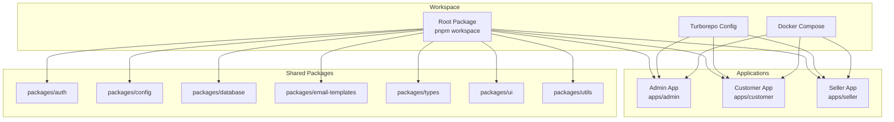
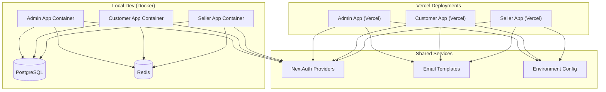
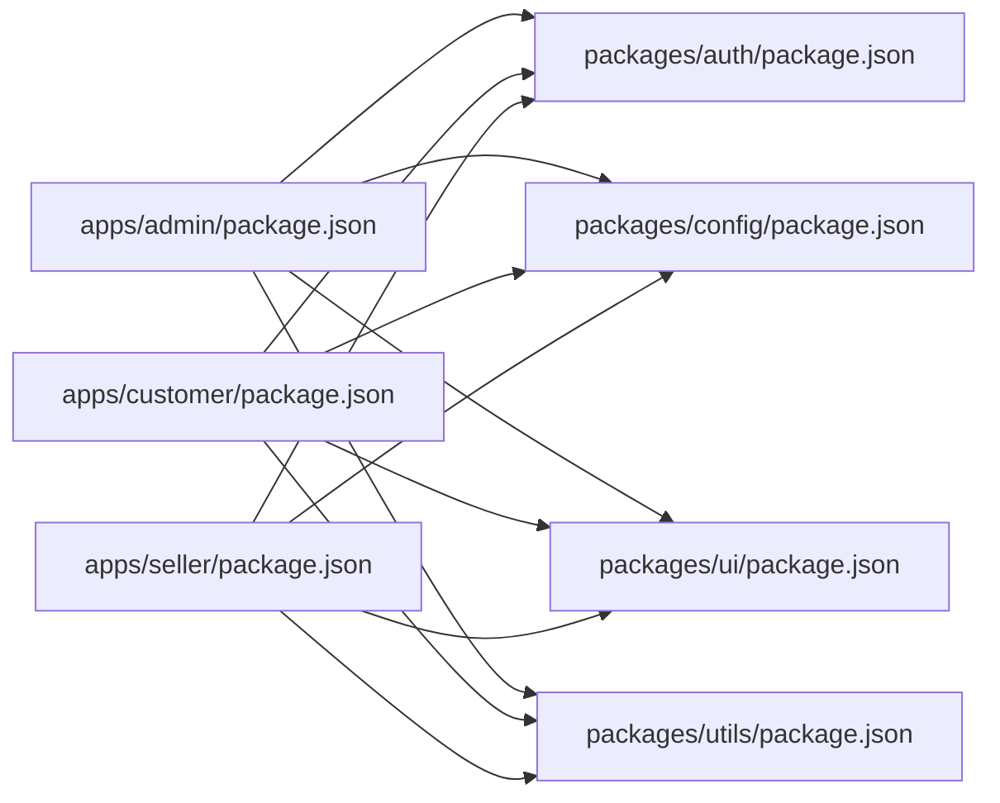

# Testing & Deployment

<cite>
**Referenced Files in This Document**
- [README.md](file://README.md)
- [turbo.json](file://turbo.json)
- [docker-compose.yml](file://docker-compose.yml)
- [package.json](file://package.json)
- [apps/admin/package.json](file://apps/admin/package.json)
- [apps/customer/package.json](file://apps/customer/package.json)
- [apps/seller/package.json](file://apps/seller/package.json)
- [apps/admin/vercel.json](file://apps/admin/vercel.json)
- [apps/customer/vercel.json](file://apps/customer/vercel.json)
- [apps/seller/vercel.json](file://apps/seller/vercel.json)
- [apps/admin/src/lib/auth.ts](file://apps/admin/src/lib/auth.ts)
- [apps/admin/src/middleware.ts](file://apps/admin/src/middleware.ts)
- [apps/customer/src/lib/auth.ts](file://apps/customer/src/lib/auth.ts)
- [apps/customer/src/middleware.ts](file://apps/customer/src/middleware.ts)
- [apps/seller/src/lib/auth.ts](file://apps/seller/src/lib/auth.ts)
- [apps/seller/src/middleware.ts](file://apps/seller/src/middleware.ts)
- [apps/admin/src/app/api/auth/[...nextauth]/route.ts](file://apps/admin/src/app/api/auth/[...nextauth]/route.ts)
- [apps/customer/src/app/api/auth/[...nextauth]/route.ts](file://apps/customer/src/app/api/auth/[...nextauth]/route.ts)
- [apps/seller/src/app/api/auth/[...nextauth]/route.ts](file://apps/seller/src/app/api/auth/[...nextauth]/route.ts)
- [apps/admin/src/app/api/admin/compliance[id]/approve/route.ts](file://apps/admin/src/app/api/admin/compliance[id]/approve/route.ts)
- [apps/admin/src/app/api/admin/compliance[id]/reject/route.ts](file://apps/admin/src/app/api/admin/compliance[id]/reject/route.ts)
- [apps/admin/src/app/api/admin/products[id]/approve/route.ts](file://apps/admin/src/app/api/admin/products[id]/approve/route.ts)
- [apps/admin/src/app/api/admin/sellers/[id]/approve/route.ts](file://apps/admin/src/app/api/admin/sellers/[id]/approve/route.ts)
- [apps/admin/src/app/api/admin/sellers/[id]/reject/route.ts](file://apps/admin/src/app/api/admin/sellers/[id]/reject/route.ts)
- [apps/customer/src/app/api/products/[slug]/route.ts](file://apps/customer/src/app/api/products/[slug]/route.ts)
- [apps/customer/src/app/api/orders/route.ts](file://apps/customer/src/app/api/orders/route.ts)
- [apps/customer/src/app/api/payments/webhook/route.ts](file://apps/customer/src/app/api/payments/webhook/route.ts)
- [apps/seller/src/app/api/seller/dashboard/route.ts](file://apps/seller/src/app/api/seller/dashboard/route.ts)
- [apps/seller/src/app/api/seller/orders/route.ts](file://apps/seller/src/app/api/seller/orders/route.ts)
- [apps/seller/src/app/api/ai/draft/route.ts](file://apps/seller/src/app/api/ai/draft/route.ts)
- [apps/admin/src/stores/cart.ts](file://apps/admin/src/stores/cart.ts)
- [apps/customer/src/stores/cart.ts](file://apps/customer/src/stores/cart.ts)
- [apps/seller/src/stores/cart.ts](file://apps/seller/src/stores/cart.ts)
- [apps/admin/src/components/layout/admin-layout.tsx](file://apps/admin/src/components/layout/admin-layout.tsx)
- [apps/customer/src/components/layout/main-layout.tsx](file://apps/customer/src/components/layout/main-layout.tsx)
- [apps/seller/src/components/layout/seller-layout.tsx](file://apps/seller/src/components/layout/seller-layout.tsx)
- [apps/admin/src/i18n/request.ts](file://apps/admin/src/i18n/request.ts)
- [apps/customer/src/i18n/request.ts](file://apps/customer/src/i18n/request.ts)
- [apps/seller/src/i18n/request.ts](file://apps/seller/src/i18n/request.ts)
- [packages/utils/package.json](file://packages/utils/package.json)
- [packages/ui/package.json](file://packages/ui/package.json)
- [packages/types/package.json](file://packages/types/package.json)
- [packages/config/package.json](file://packages/config/package.json)
- [packages/database/package.json](file://packages/database/package.json)
- [packages/email-templates/package.json](file://packages/email-templates/package.json)
- [packages/auth/package.json](file://packages/auth/package.json)
</cite>

## Table of Contents
1. [Introduction](#introduction)
2. [Project Structure](#project-structure)
3. [Core Components](#core-components)
4. [Architecture Overview](#architecture-overview)
5. [Detailed Component Analysis](#detailed-component-analysis)
6. [Dependency Analysis](#dependency-analysis)
7. [Performance Considerations](#performance-considerations)
8. [Troubleshooting Guide](#troubleshooting-guide)
9. [Conclusion](#conclusion)
10. [Appendices](#appendices)

## Introduction
This document provides comprehensive testing and deployment guidance for Avenick Commerce. It covers testing strategies (unit, integration, and end-to-end), deployment configurations for Vercel, Docker containerization, and production environments, CI/CD pipeline considerations, environment configuration management, and monitoring strategies. Practical examples demonstrate running tests, building production deployments, and managing environment variables across the admin, customer, and seller portals. Performance optimization, security hardening, and scaling considerations are included for each application portal.

## Project Structure
Avenick Commerce is a monorepo organized with a Turborepo workspace and three Next.js applications (admin, customer, seller) plus shared packages for auth, config, database, UI, types, utils, and email templates. Each app includes its own configuration files, routing APIs, middleware, internationalization utilities, and portal-specific layouts.

**Diagram sources**
- [turbo.json](file://turbo.json)
- [docker-compose.yml](file://docker-compose.yml)
- [package.json](file://package.json)

**Section sources**
- [turbo.json](file://turbo.json)
- [docker-compose.yml](file://docker-compose.yml)
- [package.json](file://package.json)

## Core Components
- Application Portals
  - Admin Portal: Central administrative controls, compliance, product moderation, seller approvals, and analytics dashboards.
  - Customer Portal: B2C/B2B shopping experience, orders, payments, quotes, RFQs, wishlists, and account management.
  - Seller Portal: Inventory, orders, payouts, compliance, analytics, and AI-assisted product draft generation.
- Shared Packages
  - Authentication utilities and middleware across portals.
  - Configuration and environment abstractions.
  - Database and type definitions.
  - UI primitives and reusable components.
  - Utilities and email templates.

Key capabilities include:
- Next.js App Router APIs under each app’s app/api directory.
- Middleware-driven authentication and role-based access control.
- Internationalization request utilities per portal.
- Store modules for cart/wishlist state management.

**Section sources**
- [apps/admin/src/lib/auth.ts](file://apps/admin/src/lib/auth.ts)
- [apps/admin/src/middleware.ts](file://apps/admin/src/middleware.ts)
- [apps/customer/src/lib/auth.ts](file://apps/customer/src/lib/auth.ts)
- [apps/customer/src/middleware.ts](file://apps/customer/src/middleware.ts)
- [apps/seller/src/lib/auth.ts](file://apps/seller/src/lib/auth.ts)
- [apps/seller/src/middleware.ts](file://apps/seller/src/middleware.ts)
- [apps/admin/src/i18n/request.ts](file://apps/admin/src/i18n/request.ts)
- [apps/customer/src/i18n/request.ts](file://apps/customer/src/i18n/request.ts)
- [apps/seller/src/i18n/request.ts](file://apps/seller/src/i18n/request.ts)
- [apps/admin/src/stores/cart.ts](file://apps/admin/src/stores/cart.ts)
- [apps/customer/src/stores/cart.ts](file://apps/customer/src/stores/cart.ts)
- [apps/seller/src/stores/cart.ts](file://apps/seller/src/stores/cart.ts)

## Architecture Overview
The system follows a multi-application architecture with shared packages. Each portal exposes REST-like API routes via Next.js App Router, protected by middleware and NextAuth-based authentication. Docker Compose orchestrates local development services, while Vercel deploys each portal independently.

**Diagram sources**
- [apps/admin/vercel.json](file://apps/admin/vercel.json)
- [apps/customer/vercel.json](file://apps/customer/vercel.json)
- [apps/seller/vercel.json](file://apps/seller/vercel.json)
- [docker-compose.yml](file://docker-compose.yml)

## Detailed Component Analysis

### Testing Strategy

#### Unit Testing
- Focus areas:
  - Utility functions in packages/utils and shared logic in packages/auth.
  - Store modules (cart/wishlist) for state transitions and selectors.
  - API route handlers for request validation, response shape, and error handling.
- Recommended frameworks:
  - Use a testing framework compatible with TypeScript and Next.js (e.g., Vitest or Jest).
  - Mock Next.js App Router APIs and server-side dependencies.
- Coverage targets:
  - >80% for pure functions and reducers.
  - >60% for API handlers and store logic.

Practical example references:
- Run unit tests for the workspace: [package.json](file://package.json)
- Example test commands are defined in the root scripts; adapt to your chosen runner.

**Section sources**
- [packages/utils/package.json](file://packages/utils/package.json)
- [packages/auth/package.json](file://packages/auth/package.json)
- [apps/admin/src/stores/cart.ts](file://apps/admin/src/stores/cart.ts)
- [apps/customer/src/stores/cart.ts](file://apps/customer/src/stores/cart.ts)
- [apps/seller/src/stores/cart.ts](file://apps/seller/src/stores/cart.ts)

#### Integration Testing
- Focus areas:
  - NextAuth authentication flows across all portals.
  - API routes for CRUD operations (products, orders, payments webhooks).
  - Middleware behavior for role-based access control.
- Approach:
  - Spin up a minimal server using Next.js dev server or a lightweight HTTP server.
  - Use supertest or fetch-based clients to hit App Router endpoints.
  - Mock external services (payment providers, email, Redis) via environment variables or dependency injection.

Example references:
- Admin compliance and product moderation routes: [apps/admin/src/app/api/admin/compliance[id]/approve/route.ts](file://apps/admin/src/app/api/admin/compliance[id]/approve/route.ts), [apps/admin/src/app/api/admin/compliance[id]/reject/route.ts](file://apps/admin/src/app/api/admin/compliance[id]/reject/route.ts), [apps/admin/src/app/api/admin/products[id]/approve/route.ts](file://apps/admin/src/app/api/admin/products[id]/approve/route.ts)
- Customer payment webhook: [apps/customer/src/app/api/payments/webhook/route.ts](file://apps/customer/src/app/api/payments/webhook/route.ts)
- Seller dashboard and orders: [apps/seller/src/app/api/seller/dashboard/route.ts](file://apps/seller/src/app/api/seller/dashboard/route.ts), [apps/seller/src/app/api/seller/orders/route.ts](file://apps/seller/src/app/api/seller/orders/route.ts)

**Section sources**
- [apps/admin/src/app/api/admin/compliance[id]/approve/route.ts](file://apps/admin/src/app/api/admin/compliance[id]/approve/route.ts)
- [apps/admin/src/app/api/admin/compliance[id]/reject/route.ts](file://apps/admin/src/app/api/admin/compliance[id]/reject/route.ts)
- [apps/admin/src/app/api/admin/products[id]/approve/route.ts](file://apps/admin/src/app/api/admin/products[id]/approve/route.ts)
- [apps/customer/src/app/api/payments/webhook/route.ts](file://apps/customer/src/app/api/payments/webhook/route.ts)
- [apps/seller/src/app/api/seller/dashboard/route.ts](file://apps/seller/src/app/api/seller/dashboard/route.ts)
- [apps/seller/src/app/api/seller/orders/route.ts](file://apps/seller/src/app/api/seller/orders/route.ts)

#### End-to-End Testing
- Focus areas:
  - User journeys: registration, login, product browsing, cart/add-to-cart, checkout, order placement, and order tracking.
  - Admin workflows: compliance review, product approval/rejection, seller management.
  - Seller workflows: product catalog updates, order fulfillment, payout requests.
- Approach:
  - Use Playwright or Cypress for browser automation.
  - Configure environment variables for test runs and mock third-party integrations.
  - Isolate test data using seeded databases or test-specific collections.

[No sources needed since this section provides general guidance]

### Deployment Configuration

#### Vercel Deployment
- Each portal is configured for independent deployment with Vercel:
  - Admin portal deployment configuration: [apps/admin/vercel.json](file://apps/admin/vercel.json)
  - Customer portal deployment configuration: [apps/customer/vercel.json](file://apps/customer/vercel.json)
  - Seller portal deployment configuration: [apps/seller/vercel.json](file://apps/seller/vercel.json)
- Typical Vercel settings include build output, environment variables, and routes handling.
- CI/CD integration:
  - Connect repositories to Vercel and enable branch-based deployments.
  - Use Vercel Environment Variables for secrets and feature flags.

**Section sources**
- [apps/admin/vercel.json](file://apps/admin/vercel.json)
- [apps/customer/vercel.json](file://apps/customer/vercel.json)
- [apps/seller/vercel.json](file://apps/seller/vercel.json)

#### Docker Containerization
- Local orchestration:
  - Docker Compose defines containers for each portal and shared services (database, cache).
  - Reference: [docker-compose.yml](file://docker-compose.yml)
- Build and run:
  - Use pnpm to install dependencies and build the workspace.
  - Start services with Docker Compose for local development and testing.
- Production considerations:
  - Use multi-stage builds to minimize image size.
  - Separate containers per portal for scalability and isolation.

**Section sources**
- [docker-compose.yml](file://docker-compose.yml)
- [package.json](file://package.json)

#### Production Environment Setup
- Environment variables:
  - Define environment variables per portal and shared packages.
  - Use Vercel Environment Variables for production deployments.
  - For local Docker, define variables in docker-compose.yml or .env files.
- Secrets management:
  - Store sensitive keys in Vercel or Docker secrets.
  - Avoid committing secrets to the repository.

**Section sources**
- [apps/admin/vercel.json](file://apps/admin/vercel.json)
- [apps/customer/vercel.json](file://apps/customer/vercel.json)
- [apps/seller/vercel.json](file://apps/seller/vercel.json)
- [docker-compose.yml](file://docker-compose.yml)

### CI/CD Pipeline
- Workflow stages:
  - Install dependencies using pnpm workspace.
  - Lint and type-check across the workspace.
  - Run unit and integration tests.
  - Build production artifacts for each portal.
  - Deploy to Vercel with environment-specific configurations.
- Artifact and caching:
  - Cache pnpm store and Next.js build outputs to speed up pipelines.
- Branch protection:
  - Require successful pipeline runs before merging to protected branches.

[No sources needed since this section provides general guidance]

### Environment Configuration Management
- Per-portal configuration:
  - Next.js configuration files per app define build and runtime behavior.
  - Authentication providers and middleware enforce role-based access.
- Shared configuration:
  - packages/config centralizes environment and feature flags.
- Internationalization:
  - Request utilities per portal handle locale detection and message loading.

**Section sources**
- [apps/admin/src/lib/auth.ts](file://apps/admin/src/lib/auth.ts)
- [apps/admin/src/middleware.ts](file://apps/admin/src/middleware.ts)
- [apps/customer/src/lib/auth.ts](file://apps/customer/src/lib/auth.ts)
- [apps/customer/src/middleware.ts](file://apps/customer/src/middleware.ts)
- [apps/seller/src/lib/auth.ts](file://apps/seller/src/lib/auth.ts)
- [apps/seller/src/middleware.ts](file://apps/seller/src/middleware.ts)
- [apps/admin/src/i18n/request.ts](file://apps/admin/src/i18n/request.ts)
- [apps/customer/src/i18n/request.ts](file://apps/customer/src/i18n/request.ts)
- [apps/seller/src/i18n/request.ts](file://apps/seller/src/i18n/request.ts)

### Monitoring Strategies
- Observability:
  - Use Vercel Analytics and logs for production insights.
  - Add structured logging in API routes and middleware.
- Health checks:
  - Expose health endpoints for each portal.
- Performance monitoring:
  - Track bundle sizes, LCP, and FID for frontend performance.
- Error tracking:
  - Integrate error reporting in middleware and global error boundaries.

[No sources needed since this section provides general guidance]

## Dependency Analysis
The workspace uses Turborepo for task orchestration and pnpm for dependency management. Each portal depends on shared packages for authentication, configuration, UI, and utilities. API routes depend on NextAuth and middleware for access control.

**Diagram sources**
- [apps/admin/package.json](file://apps/admin/package.json)
- [apps/customer/package.json](file://apps/customer/package.json)
- [apps/seller/package.json](file://apps/seller/package.json)
- [packages/auth/package.json](file://packages/auth/package.json)
- [packages/config/package.json](file://packages/config/package.json)
- [packages/ui/package.json](file://packages/ui/package.json)
- [packages/utils/package.json](file://packages/utils/package.json)

**Section sources**
- [turbo.json](file://turbo.json)
- [package.json](file://package.json)

## Performance Considerations
- Frontend
  - Enable Next.js static generation and ISR where appropriate.
  - Optimize images and lazy-load non-critical resources.
  - Minimize client bundles and split code with dynamic imports.
- Backend
  - Cache frequently accessed data (products, categories) with Redis.
  - Use database indexing for search and filtering.
- API Routes
  - Keep handlers small and delegate heavy work to background jobs.
  - Use streaming responses for large datasets.
- Caching Strategy
  - Implement CDN caching for public pages and API responses.
  - Use cache tags and cache invalidation for product catalogs.

[No sources needed since this section provides general guidance]

## Troubleshooting Guide
Common issues and resolutions:
- Authentication failures
  - Verify NextAuth provider configuration and callback URLs.
  - Check environment variables for OAuth credentials.
  - Review middleware logs for access control errors.
- API route errors
  - Validate request payloads and response shapes.
  - Inspect database connections and Redis availability.
- Build failures
  - Clear node_modules and reinstall with pnpm.
  - Ensure TypeScript types are consistent across packages.
- Docker issues
  - Confirm service dependencies are healthy.
  - Rebuild images after dependency changes.

**Section sources**
- [apps/admin/src/lib/auth.ts](file://apps/admin/src/lib/auth.ts)
- [apps/customer/src/lib/auth.ts](file://apps/customer/src/lib/auth.ts)
- [apps/seller/src/lib/auth.ts](file://apps/seller/src/lib/auth.ts)
- [apps/admin/src/middleware.ts](file://apps/admin/src/middleware.ts)
- [apps/customer/src/middleware.ts](file://apps/customer/src/middleware.ts)
- [apps/seller/src/middleware.ts](file://apps/seller/src/middleware.ts)

## Conclusion
Avenick Commerce leverages a modular architecture with independent portal deployments, shared packages, and robust middleware-driven authentication. By implementing a layered testing strategy, containerized local development, and Vercel-based production deployments, teams can achieve reliable releases and scalable operations. Adopt the recommended performance, security, and monitoring practices to maintain a high-quality platform across all portals.

## Appendices

### Practical Examples

- Running Tests
  - Use the root scripts to execute unit and integration tests across the workspace.
  - Example script entries are defined in the root package.json; adapt for your testing framework.

- Building Production Deployments
  - Build each portal using Next.js production build commands.
  - Deploy to Vercel with environment-specific configurations per portal.

- Managing Environment Variables
  - Define variables in Vercel project settings for production.
  - Use docker-compose for local development and keep secrets out of version control.

**Section sources**
- [package.json](file://package.json)
- [apps/admin/vercel.json](file://apps/admin/vercel.json)
- [apps/customer/vercel.json](file://apps/customer/vercel.json)
- [apps/seller/vercel.json](file://apps/seller/vercel.json)
- [docker-compose.yml](file://docker-compose.yml)