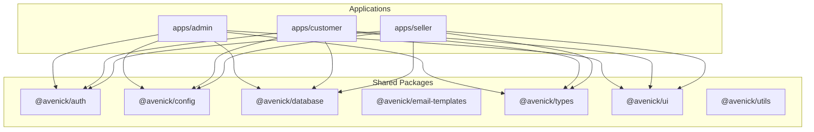
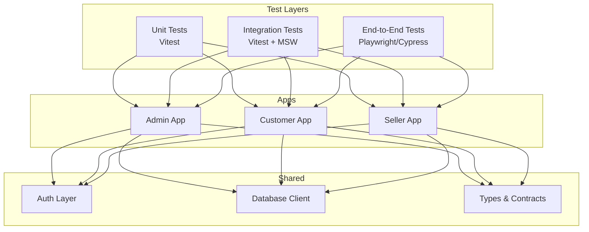
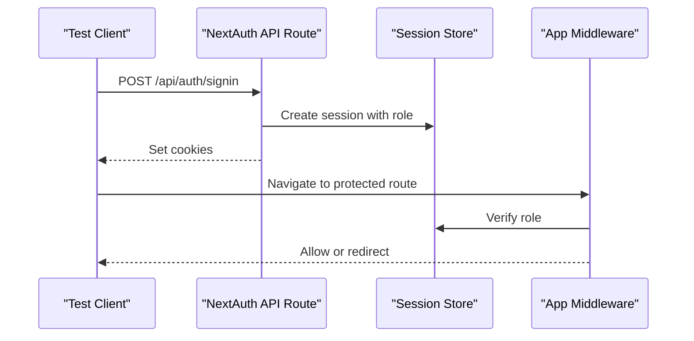
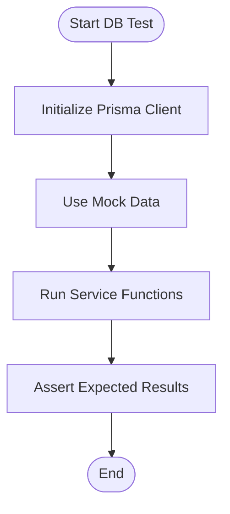
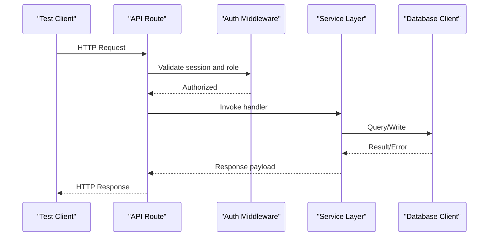
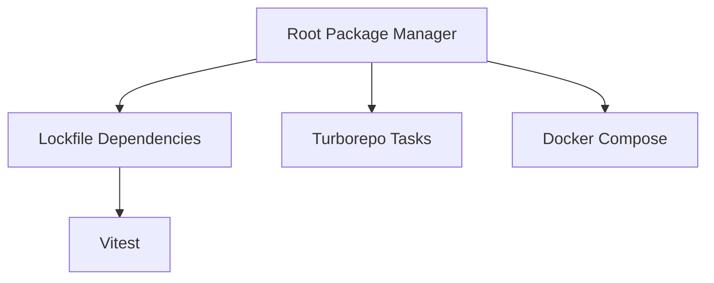

# Testing Strategy

<cite>
**Referenced Files in This Document**
- [package.json](file://package.json)
- [turbo.json](file://turbo.json)
- [docker-compose.yml](file://docker-compose.yml)
- [PHASE2_TESTING_CHECKLIST.md](file://PHASE2_TESTING_CHECKLIST.md)
- [PHASE3_TESTING_CHECKLIST.md](file://PHASE3_TESTING_CHECKLIST.md)
- [MODULE_11_AI_AUTOMATION_INTEGRATIONS_NOTES.md](file://MODULE_11_AI_AUTOMATION_INTEGRATIONS_NOTES.md)
- [DATABASE_NOTES.md](file://DATABASE_NOTES.md)
- [apps/admin/src/app/integrations/page.tsx](file://apps/admin/src/app/integrations/page.tsx)
- [apps/admin/src/lib/auth.ts](file://apps/admin/src/lib/auth.ts)
- [apps/admin/src/middleware.ts](file://apps/admin/src/middleware.ts)
- [apps/customer/src/lib/auth-instance.ts](file://apps/customer/src/lib/auth-instance.ts)
- [apps/customer/src/middleware.ts](file://apps/customer/src/middleware.ts)
- [apps/seller/src/lib/auth-instance.ts](file://apps/seller/src/lib/auth-instance.ts)
- [apps/seller/src/middleware.ts](file://apps/seller/src/middleware.ts)
- [packages/database/src/index.ts](file://packages/database/src/index.ts)
- [packages/database/src/mock-data.ts](file://packages/database/src/mock-data.ts)
- [apps/admin/src/app/api/auth/[...nextauth]/route.ts](file://apps/admin/src/app/api/auth/[...nextauth]/route.ts)
- [apps/customer/src/app/api/auth/[...nextauth]/route.ts](file://apps/customer/src/app/api/auth/[...nextauth]/route.ts)
- [apps/seller/src/app/api/auth/[...nextauth]/route.ts](file://apps/seller/src/app/api/auth/[...nextauth]/route.ts)
- [apps/admin/src/app/api/admin/compliance[id]/approve/route.ts](file://apps/admin/src/app/api/admin/compliance[id]/approve/route.ts)
- [apps/admin/src/app/api/admin/products[id]/approve/route.ts](file://apps/admin/src/app/api/admin/products[id]/approve/route.ts)
- [apps/admin/src/app/api/admin/sellers/[id]/approve/route.ts](file://apps/admin/src/app/api/admin/sellers/[id]/approve/route.ts)
- [apps/admin/src/app/api/admin/sellers/[id]/reject/route.ts](file://apps/admin/src/app/api/admin/sellers/[id]/reject/route.ts)
- [apps/admin/src/app/api/admin/dashboard/route.ts](file://apps/admin/src/app/api/admin/dashboard/route.ts)
- [apps/customer/src/app/api/products/[slug]/route.ts](file://apps/customer/src/app/api/products/[slug]/route.ts)
- [apps/customer/src/app/api/categories/route.ts](file://apps/customer/src/app/api/categories/route.ts)
- [apps/customer/src/app/api/orders/route.ts](file://apps/customer/src/app/api/orders/route.ts)
- [apps/customer/src/app/api/payments/webhook/route.ts](file://apps/customer/src/app/api/payments/webhook/route.ts)
- [apps/seller/src/app/api/seller/dashboard/route.ts](file://apps/seller/src/app/api/seller/dashboard/route.ts)
- [apps/seller/src/app/api/seller/orders/route.ts](file://apps/seller/src/app/api/seller/orders/route.ts)
- [apps/seller/src/app/api/notifications/route.ts](file://apps/seller/src/app/api/notifications/route.ts)
- [apps/seller/src/app/api/ai/draft/route.ts](file://apps/seller/src/app/api/ai/draft/route.ts)
- [apps/admin/src/app/ai-insights/page.tsx](file://apps/admin/src/app/ai-insights/page.tsx)
- [apps/admin/src/app/automation/page.tsx](file://apps/admin/src/app/automation/page.tsx)
- [apps/admin/src/app/integrations/page.tsx](file://apps/admin/src/app/integrations/page.tsx)
- [apps/admin/src/app/dashboard/page.tsx](file://apps/admin/src/app/dashboard/page.tsx)
- [apps/admin/src/app/products/page.tsx](file://apps/admin/src/app/products/page.tsx)
- [apps/customer/src/app/products/[slug]/page.tsx](file://apps/customer/src/app/products/[slug]/page.tsx)
- [apps/customer/src/app/cart/page.tsx](file://apps/customer/src/app/cart/page.tsx)
- [apps/customer/src/app/search/page.tsx](file://apps/customer/src/app/search/page.tsx)
- [apps/customer/src/app/b2b/page.tsx](file://apps/customer/src/app/b2b/page.tsx)
- [apps/seller/src/app/products/page.tsx](file://apps/seller/src/app/products/page.tsx)
- [apps/seller/src/app/quotes/page.tsx](file://apps/seller/src/app/quotes/page.tsx)
- [apps/seller/src/app/orders/page.tsx](file://apps/seller/src/app/orders/page.tsx)
- [apps/seller/src/app/returns/page.tsx](file://apps/seller/src/app/returns/page.tsx)
- [apps/seller/src/app/shipments/page.tsx](file://apps/seller/src/app/shipments/page.tsx)
</cite>

## Table of Contents
1. [Introduction](#introduction)
2. [Project Structure](#project-structure)
3. [Core Components](#core-components)
4. [Architecture Overview](#architecture-overview)
5. [Detailed Component Analysis](#detailed-component-analysis)
6. [Dependency Analysis](#dependency-analysis)
7. [Performance Considerations](#performance-considerations)
8. [Security Testing](#security-testing)
9. [Accessibility Testing](#accessibility-testing)
10. [Troubleshooting Guide](#troubleshooting-guide)
11. [Conclusion](#conclusion)
12. [Appendices](#appendices)

## Introduction
This document defines a comprehensive testing strategy for Avenick Commerce across unit, integration, and end-to-end testing. It covers framework setup, test execution commands, coverage expectations, and practical guidance for testing individual applications (admin, customer, seller), shared packages, and API endpoints. It also details mocking strategies for external dependencies, database testing approaches, authentication testing, and examples for React components, Next.js API routes, and Prisma operations. Finally, it outlines performance, security, and accessibility testing requirements aligned with the project’s architecture and documented checklists.

## Project Structure
Avenick Commerce is a monorepo organized with three Next.js applications and several shared packages:
- Applications:
  - Admin portal
  - Customer storefront
  - Seller portal
- Shared packages:
  - Authentication utilities
  - Configuration
  - Database client and services
  - Email templates
  - Types
  - UI components
  - Utilities

Key testing-relevant files:
- Root package manager and task orchestration define scripts and dependencies.
- Turborepo configuration orchestrates builds and caching.
- Docker Compose provisions local environments for development and CI.
- Phase 2 and Phase 3 testing checklists guide verification tasks.
- Module notes include UI and feature testing checkpoints.

**Section sources**
- [package.json](file://package.json)
- [turbo.json](file://turbo.json)
- [docker-compose.yml](file://docker-compose.yml)

## Core Components
This section identifies the core testing components and their roles:
- Testing framework: Vitest is present in lockfile entries indicating its availability for unit and integration tests.
- Authentication: NextAuth-based authentication flows are implemented per app and exposed via API routes under [...nextauth].
- Middleware: Role-based routing guards are implemented in each app’s middleware.
- Database: A singleton Prisma client is exported from a shared package; Phase 2 uses mock data for database operations.
- API routes: Next.js App Router API routes under each app expose business endpoints.
- UI pages: Feature pages under each app serve as targets for component and E2E tests.

**Section sources**
- [pnpm-lock.yaml:4019-4042](file://pnpm-lock.yaml#L4019-L4042)
- [apps/admin/src/lib/auth.ts](file://apps/admin/src/lib/auth.ts)
- [apps/admin/src/middleware.ts](file://apps/admin/src/middleware.ts)
- [apps/customer/src/lib/auth-instance.ts](file://apps/customer/src/lib/auth-instance.ts)
- [apps/customer/src/middleware.ts](file://apps/customer/src/middleware.ts)
- [apps/seller/src/lib/auth-instance.ts](file://apps/seller/src/lib/auth-instance.ts)
- [apps/seller/src/middleware.ts](file://apps/seller/src/middleware.ts)
- [packages/database/src/index.ts:1-28](file://packages/database/src/index.ts#L1-L28)
- [DATABASE_NOTES.md:54-67](file://DATABASE_NOTES.md#L54-L67)

## Architecture Overview
The testing architecture leverages:
- Unit tests for pure functions, utilities, and isolated components using Vitest.
- Integration tests validating API routes and middleware behavior against a controlled environment.
- End-to-end tests verifying user journeys across applications and shared packages.

## Detailed Component Analysis

### Authentication Testing
Authentication is implemented via NextAuth and exposed through API routes under [...nextauth]. Testing should cover:
- Successful sign-in flows for each role (admin, customer, seller).
- Cookie isolation across apps.
- Role-gated middleware enforcement.
- Protected route access and redirects.

Recommended strategies:
- Use a test harness to initialize NextAuth with mock providers.
- Mock session retrieval and user role claims.
- Verify middleware redirect behavior for unauthorized users.
- Validate API responses for protected endpoints.

**Diagram sources**
- [apps/admin/src/app/api/auth/[...nextauth]/route.ts](file://apps/admin/src/app/api/auth/[...nextauth]/route.ts)
- [apps/customer/src/app/api/auth/[...nextauth]/route.ts](file://apps/customer/src/app/api/auth/[...nextauth]/route.ts)
- [apps/seller/src/app/api/auth/[...nextauth]/route.ts](file://apps/seller/src/app/api/auth/[...nextauth]/route.ts)
- [apps/admin/src/middleware.ts](file://apps/admin/src/middleware.ts)
- [apps/customer/src/middleware.ts](file://apps/customer/src/middleware.ts)
- [apps/seller/src/middleware.ts](file://apps/seller/src/middleware.ts)

**Section sources**
- [apps/admin/src/lib/auth.ts](file://apps/admin/src/lib/auth.ts)
- [apps/admin/src/middleware.ts](file://apps/admin/src/middleware.ts)
- [apps/customer/src/lib/auth-instance.ts](file://apps/customer/src/lib/auth-instance.ts)
- [apps/customer/src/middleware.ts](file://apps/customer/src/middleware.ts)
- [apps/seller/src/lib/auth-instance.ts](file://apps/seller/src/lib/auth-instance.ts)
- [apps/seller/src/middleware.ts](file://apps/seller/src/middleware.ts)

### Database Testing
Phase 2 uses mock data and a singleton Prisma client. Testing should:
- Validate service functions that compute metrics and health indicators using mock data.
- Ensure the singleton client is properly initialized and reused during tests.
- Simulate database failures and verify error handling paths.

**Diagram sources**
- [packages/database/src/index.ts:1-28](file://packages/database/src/index.ts#L1-L28)
- [packages/database/src/mock-data.ts](file://packages/database/src/mock-data.ts)
- [DATABASE_NOTES.md:54-67](file://DATABASE_NOTES.md#L54-L67)

**Section sources**
- [packages/database/src/index.ts:1-28](file://packages/database/src/index.ts#L1-L28)
- [packages/database/src/mock-data.ts](file://packages/database/src/mock-data.ts)
- [DATABASE_NOTES.md:54-67](file://DATABASE_NOTES.md#L54-L67)

### API Endpoint Testing
API routes under each app should be tested for:
- Request validation and response shape.
- Authorization and role checks.
- Error handling and status codes.
- Side effects (e.g., webhooks).

Examples of routes to test:
- Admin compliance and product approval endpoints.
- Customer product, category, order, and payment webhook endpoints.
- Seller dashboard, orders, notifications, and AI draft endpoints.

**Diagram sources**
- [apps/admin/src/app/api/admin/compliance[id]/approve/route.ts](file://apps/admin/src/app/api/admin/compliance[id]/approve/route.ts)
- [apps/admin/src/app/api/admin/products[id]/approve/route.ts](file://apps/admin/src/app/api/admin/products[id]/approve/route.ts)
- [apps/admin/src/app/api/admin/sellers/[id]/approve/route.ts](file://apps/admin/src/app/api/admin/sellers/[id]/approve/route.ts)
- [apps/admin/src/app/api/admin/sellers/[id]/reject/route.ts](file://apps/admin/src/app/api/admin/sellers/[id]/reject/route.ts)
- [apps/admin/src/app/api/admin/dashboard/route.ts](file://apps/admin/src/app/api/admin/dashboard/route.ts)
- [apps/customer/src/app/api/products/[slug]/route.ts](file://apps/customer/src/app/api/products/[slug]/route.ts)
- [apps/customer/src/app/api/categories/route.ts](file://apps/customer/src/app/api/categories/route.ts)
- [apps/customer/src/app/api/orders/route.ts](file://apps/customer/src/app/api/orders/route.ts)
- [apps/customer/src/app/api/payments/webhook/route.ts](file://apps/customer/src/app/api/payments/webhook/route.ts)
- [apps/seller/src/app/api/seller/dashboard/route.ts](file://apps/seller/src/app/api/seller/dashboard/route.ts)
- [apps/seller/src/app/api/seller/orders/route.ts](file://apps/seller/src/app/api/seller/orders/route.ts)
- [apps/seller/src/app/api/notifications/route.ts](file://apps/seller/src/app/api/notifications/route.ts)
- [apps/seller/src/app/api/ai/draft/route.ts](file://apps/seller/src/app/api/ai/draft/route.ts)

**Section sources**
- [apps/admin/src/app/api/admin/compliance[id]/approve/route.ts](file://apps/admin/src/app/api/admin/compliance[id]/approve/route.ts)
- [apps/admin/src/app/api/admin/products[id]/approve/route.ts](file://apps/admin/src/app/api/admin/products[id]/approve/route.ts)
- [apps/admin/src/app/api/admin/sellers/[id]/approve/route.ts](file://apps/admin/src/app/api/admin/sellers/[id]/approve/route.ts)
- [apps/admin/src/app/api/admin/sellers/[id]/reject/route.ts](file://apps/admin/src/app/api/admin/sellers/[id]/reject/route.ts)
- [apps/admin/src/app/api/admin/dashboard/route.ts](file://apps/admin/src/app/api/admin/dashboard/route.ts)
- [apps/customer/src/app/api/products/[slug]/route.ts](file://apps/customer/src/app/api/products/[slug]/route.ts)
- [apps/customer/src/app/api/categories/route.ts](file://apps/customer/src/app/api/categories/route.ts)
- [apps/customer/src/app/api/orders/route.ts](file://apps/customer/src/app/api/orders/route.ts)
- [apps/customer/src/app/api/payments/webhook/route.ts](file://apps/customer/src/app/api/payments/webhook/route.ts)
- [apps/seller/src/app/api/seller/dashboard/route.ts](file://apps/seller/src/app/api/seller/dashboard/route.ts)
- [apps/seller/src/app/api/seller/orders/route.ts](file://apps/seller/src/app/api/seller/orders/route.ts)
- [apps/seller/src/app/api/notifications/route.ts](file://apps/seller/src/app/api/notifications/route.ts)
- [apps/seller/src/app/api/ai/draft/route.ts](file://apps/seller/src/app/api/ai/draft/route.ts)

### UI Component Testing
Focus areas:
- Admin dashboard, AI insights, automation, and integrations pages.
- Customer product listing/detail, cart, search, and B2B pages.
- Seller product, quote, order, return, and shipment pages.

Guidance:
- Render components in isolation with minimal props.
- Mock data and services to avoid network calls.
- Verify UI segments, tabs, and interactive elements behave as expected.

**Section sources**
- [apps/admin/src/app/ai-insights/page.tsx](file://apps/admin/src/app/ai-insights/page.tsx)
- [apps/admin/src/app/automation/page.tsx](file://apps/admin/src/app/automation/page.tsx)
- [apps/admin/src/app/integrations/page.tsx](file://apps/admin/src/app/integrations/page.tsx)
- [apps/admin/src/app/dashboard/page.tsx](file://apps/admin/src/app/dashboard/page.tsx)
- [apps/admin/src/app/products/page.tsx](file://apps/admin/src/app/products/page.tsx)
- [apps/customer/src/app/products/[slug]/page.tsx](file://apps/customer/src/app/products/[slug]/page.tsx)
- [apps/customer/src/app/cart/page.tsx](file://apps/customer/src/app/cart/page.tsx)
- [apps/customer/src/app/search/page.tsx](file://apps/customer/src/app/search/page.tsx)
- [apps/customer/src/app/b2b/page.tsx](file://apps/customer/src/app/b2b/page.tsx)
- [apps/seller/src/app/products/page.tsx](file://apps/seller/src/app/products/page.tsx)
- [apps/seller/src/app/quotes/page.tsx](file://apps/seller/src/app/quotes/page.tsx)
- [apps/seller/src/app/orders/page.tsx](file://apps/seller/src/app/orders/page.tsx)
- [apps/seller/src/app/returns/page.tsx](file://apps/seller/src/app/returns/page.tsx)
- [apps/seller/src/app/shipments/page.tsx](file://apps/seller/src/app/shipments/page.tsx)

## Dependency Analysis
Testing dependencies and scripts are managed at the workspace level. The lockfile confirms Vitest presence, enabling unit and integration testing. Turborepo orchestrates builds and caching across apps and packages. Docker Compose provisions local environments for development and CI.

**Diagram sources**
- [pnpm-lock.yaml:4019-4042](file://pnpm-lock.yaml#L4019-L4042)
- [turbo.json](file://turbo.json)
- [docker-compose.yml](file://docker-compose.yml)

**Section sources**
- [pnpm-lock.yaml:4019-4042](file://pnpm-lock.yaml#L4019-L4042)
- [turbo.json](file://turbo.json)
- [docker-compose.yml](file://docker-compose.yml)

## Performance Considerations
- Use Vitest spies and timers to isolate slow operations in unit tests.
- Prefer deterministic mocks for external services to avoid flaky timing.
- For integration tests, limit concurrent requests and simulate realistic load patterns.
- Profile API routes and middleware to identify bottlenecks.

## Security Testing
- Validate CSRF protection and secure cookie flags in NextAuth flows.
- Verify role-based access controls in middleware and protected routes.
- Test input sanitization and rate limiting where applicable.
- Audit third-party integrations and webhook signatures.

## Accessibility Testing
- Ensure semantic HTML and ARIA attributes in shared UI components.
- Test keyboard navigation and screen reader compatibility across pages.
- Validate color contrast and focus indicators.

## Troubleshooting Guide
Common issues and resolutions:
- Authentication failures:
  - Confirm NextAuth routes are reachable and sessions are persisted.
  - Verify middleware redirects for unauthorized users.
- Database errors:
  - Ensure the Prisma singleton is initialized before tests.
  - Use mock data for Phase 2 to avoid real DB dependencies.
- API route failures:
  - Validate request bodies and query parameters.
  - Check for proper error responses and status codes.
- Environment setup:
  - Use Docker Compose to provision services consistently.
  - Follow start/build commands from the testing checklist.

**Section sources**
- [PHASE2_TESTING_CHECKLIST.md:111-127](file://PHASE2_TESTING_CHECKLIST.md#L111-L127)
- [PHASE3_TESTING_CHECKLIST.md](file://PHASE3_TESTING_CHECKLIST.md)
- [DATABASE_NOTES.md:54-67](file://DATABASE_NOTES.md#L54-L67)

## Conclusion
Avenick Commerce’s testing strategy emphasizes robust unit, integration, and end-to-end coverage tailored to its Next.js monorepo architecture. By leveraging Vitest, NextAuth, middleware, and shared database services, teams can systematically validate authentication, API behavior, UI components, and cross-application workflows. The documented checklists and guidance ensure consistent verification across Phase 2 and Phase 3 implementations.

## Appendices

### Testing Framework Setup and Execution
- Framework: Vitest (present in lockfile).
- Scripts: Use workspace scripts to run tests across apps and packages.
- Orchestration: Turborepo manages task execution and caching.
- Environment: Docker Compose provisions local services.

**Section sources**
- [pnpm-lock.yaml:4019-4042](file://pnpm-lock.yaml#L4019-L4042)
- [turbo.json](file://turbo.json)
- [docker-compose.yml](file://docker-compose.yml)

### Coverage Requirements
- Target: Maintain high coverage for critical paths (authentication, API routes, service functions).
- Thresholds: Establish minimum thresholds per module and enforce via CI.
- Reports: Generate and publish coverage reports for PRs and releases.

### Phase 2 and Phase 3 Testing Checklists
- Phase 2: Refer to the dedicated checklist for feature verification and build/start commands.
- Phase 3: Use the Phase 3 checklist to validate advanced features and integrations.

**Section sources**
- [PHASE2_TESTING_CHECKLIST.md:1-127](file://PHASE2_TESTING_CHECKLIST.md#L1-L127)
- [PHASE3_TESTING_CHECKLIST.md](file://PHASE3_TESTING_CHECKLIST.md)
- [MODULE_11_AI_AUTOMATION_INTEGRATIONS_NOTES.md:27-59](file://MODULE_11_AI_AUTOMATION_INTEGRATIONS_NOTES.md#L27-L59)

### Mocking Strategies
- External dependencies: Use Vitest mocks and MSW for HTTP interceptors.
- Database: Utilize mock data and the Prisma singleton for deterministic tests.
- Authentication: Mock NextAuth session and user roles.

**Section sources**
- [packages/database/src/index.ts:1-28](file://packages/database/src/index.ts#L1-L28)
- [packages/database/src/mock-data.ts](file://packages/database/src/mock-data.ts)
- [apps/admin/src/lib/auth.ts](file://apps/admin/src/lib/auth.ts)
- [apps/customer/src/lib/auth-instance.ts](file://apps/customer/src/lib/auth-instance.ts)
- [apps/seller/src/lib/auth-instance.ts](file://apps/seller/src/lib/auth-instance.ts)

### Examples by Component Type
- React components:
  - Render pages in isolation with minimal props.
  - Mock services and data to avoid network calls.
  - Verify UI segments, tabs, and interactive elements.
- Next.js API routes:
  - Validate request parsing, authorization, and response shapes.
  - Test error paths and status codes.
- Prisma operations:
  - Use mock data for Phase 2.
  - For future phases, mock Prisma client methods and transactions.

**Section sources**
- [apps/admin/src/app/integrations/page.tsx:205-217](file://apps/admin/src/app/integrations/page.tsx#L205-L217)
- [apps/admin/src/app/ai-insights/page.tsx](file://apps/admin/src/app/ai-insights/page.tsx)
- [apps/admin/src/app/automation/page.tsx](file://apps/admin/src/app/automation/page.tsx)
- [apps/admin/src/app/dashboard/page.tsx](file://apps/admin/src/app/dashboard/page.tsx)
- [apps/admin/src/app/products/page.tsx](file://apps/admin/src/app/products/page.tsx)
- [apps/customer/src/app/products/[slug]/page.tsx](file://apps/customer/src/app/products/[slug]/page.tsx)
- [apps/customer/src/app/cart/page.tsx](file://apps/customer/src/app/cart/page.tsx)
- [apps/customer/src/app/search/page.tsx](file://apps/customer/src/app/search/page.tsx)
- [apps/customer/src/app/b2b/page.tsx](file://apps/customer/src/app/b2b/page.tsx)
- [apps/seller/src/app/products/page.tsx](file://apps/seller/src/app/products/page.tsx)
- [apps/seller/src/app/quotes/page.tsx](file://apps/seller/src/app/quotes/page.tsx)
- [apps/seller/src/app/orders/page.tsx](file://apps/seller/src/app/orders/page.tsx)
- [apps/seller/src/app/returns/page.tsx](file://apps/seller/src/app/returns/page.tsx)
- [apps/seller/src/app/shipments/page.tsx](file://apps/seller/src/app/shipments/page.tsx)