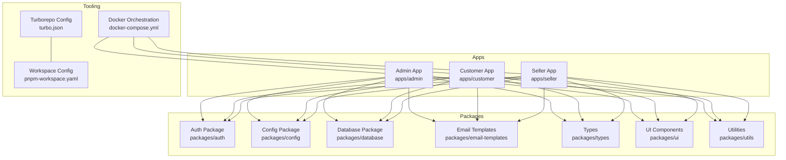
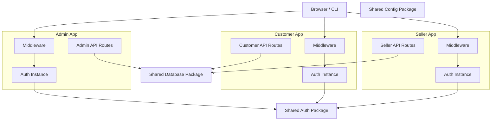
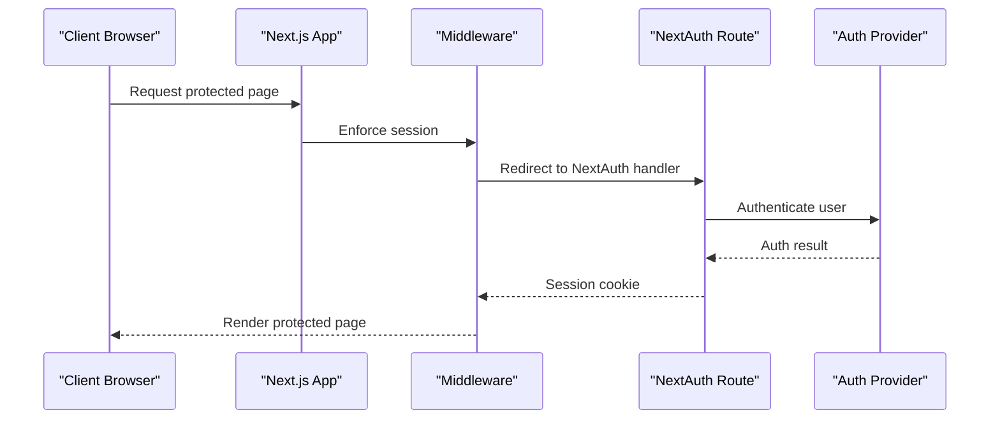
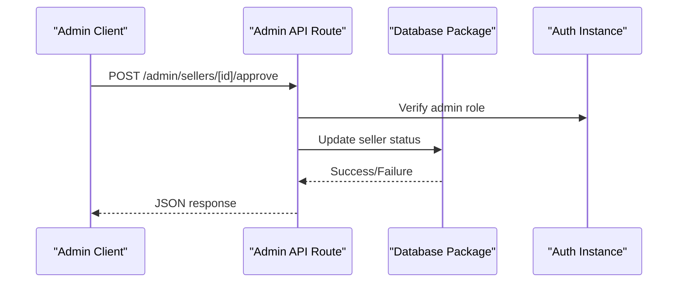
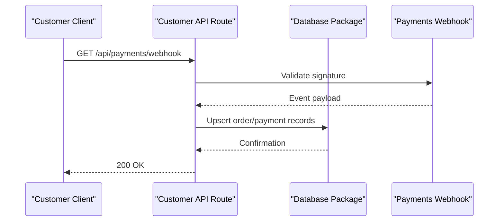
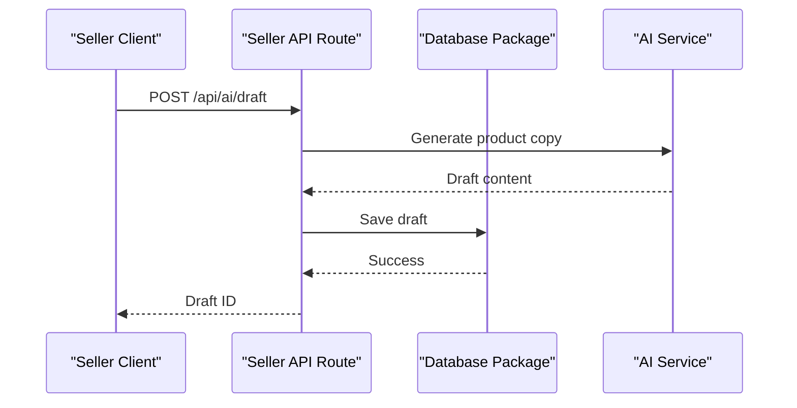
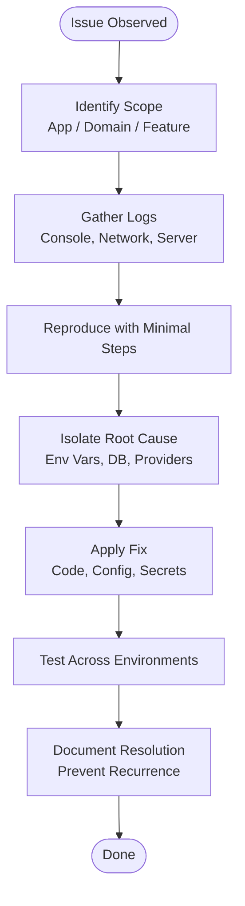
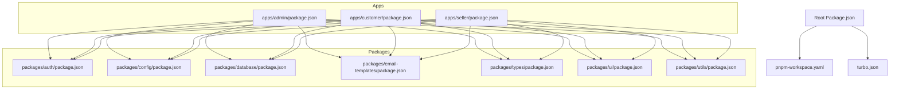

# Troubleshooting & FAQ

<cite>
**Referenced Files in This Document**
- [README.md](file://README.md)
- [docker-compose.yml](file://docker-compose.yml)
- [turbo.json](file://turbo.json)
- [package.json](file://package.json)
- [pnpm-workspace.yaml](file://pnpm-workspace.yaml)
- [apps/admin/next.config.mjs](file://apps/admin/next.config.mjs)
- [apps/customer/next.config.mjs](file://apps/customer/next.config.mjs)
- [apps/seller/next.config.mjs](file://apps/seller/next.config.mjs)
- [apps/admin/vercel.json](file://apps/admin/vercel.json)
- [apps/customer/vercel.json](file://apps/customer/vercel.json)
- [apps/seller/vercel.json](file://apps/seller/vercel.json)
- [apps/admin/src/lib/auth.ts](file://apps/admin/src/lib/auth.ts)
- [apps/admin/src/lib/auth-instance.ts](file://apps/admin/src/lib/auth-instance.ts)
- [apps/admin/src/middleware.ts](file://apps/admin/middleware.ts)
- [apps/customer/src/lib/auth-instance.ts](file://apps/customer/src/lib/auth-instance.ts)
- [apps/customer/src/middleware.ts](file://apps/customer/src/middleware.ts)
- [apps/seller/src/lib/auth-instance.ts](file://apps/seller/src/lib/auth-instance.ts)
- [apps/seller/src/middleware.ts](file://apps/seller/src/middleware.ts)
- [apps/admin/src/app/api/auth/[...nextauth]/route.ts](file://apps/admin/src/app/api/auth/[...nextauth]/route.ts)
- [apps/customer/src/app/api/auth/[...nextauth]/route.ts](file://apps/customer/src/app/api/auth/[...nextauth]/route.ts)
- [apps/admin/src/app/api/admin/compliance/[id]/approve/route.ts](file://apps/admin/src/app/api/admin/compliance/[id]/approve/route.ts)
- [apps/admin/src/app/api/admin/compliance/[id]/reject/route.ts](file://apps/admin/src/app/api/admin/compliance/[id]/reject/route.ts)
- [apps/admin/src/app/api/admin/products/[id]/approve/route.ts](file://apps/admin/src/app/api/admin/products/[id]/approve/route.ts)
- [apps/admin/src/app/api/admin/sellers/[id]/approve/route.ts](file://apps/admin/src/app/api/admin/sellers/[id]/approve/route.ts)
- [apps/admin/src/app/api/admin/sellers/[id]/reject/route.ts](file://apps/admin/src/app/api/admin/sellers/[id]/reject/route.ts)
- [apps/admin/src/app/api/admin/sellers/[id]/route.ts](file://apps/admin/src/app/api/admin/sellers/[id]/route.ts)
- [apps/admin/src/app/api/admin/sellers/route.ts](file://apps/admin/src/app/api/admin/sellers/route.ts)
- [apps/admin/src/app/api/admin/dashboard/route.ts](file://apps/admin/src/app/api/admin/dashboard/route.ts)
- [apps/customer/src/app/api/categories/route.ts](file://apps/customer/src/app/api/categories/route.ts)
- [apps/customer/src/app/api/orders/route.ts](file://apps/customer/src/app/api/orders/route.ts)
- [apps/customer/src/app/api/payments/webhook/route.ts](file://apps/customer/src/app/api/payments/webhook/route.ts)
- [apps/customer/src/app/api/products/[slug]/route.ts](file://apps/customer/src/app/api/products/[slug]/route.ts)
- [apps/seller/src/app/api/ai/draft/route.ts](file://apps/seller/src/app/api/ai/draft/route.ts)
- [apps/seller/src/app/api/notifications/route.ts](file://apps/seller/src/app/api/notifications/route.ts)
- [apps/seller/src/app/api/seller/dashboard/route.ts](file://apps/seller/src/app/api/seller/dashboard/route.ts)
- [apps/seller/src/app/api/seller/orders/route.ts](file://apps/seller/src/app/api/seller/orders/route.ts)
- [DATABASE_NOTES.md](file://DATABASE_NOTES.md)
- [MODULE_01_B2C_MARKETPLACE_NOTES.md](file://MODULE_01_B2C_MARKETPLACE_NOTES.md)
- [MODULE_02_B2B_TRADE_NOTES.md](file://MODULE_02_B2B_TRADE_NOTES.md)
- [MODULE_03_SUPPLIER_SELLER_NOTES.md](file://MODULE_03_SUPPLIER_SELLER_NOTES.md)
- [MODULE_04_ORDERS_FULFILLMENT_NOTES.md](file://MODULE_04_ORDERS_FULFILLMENT_NOTES.md)
- [MODULE_05_WAREHOUSE_3PL_NOTES.md](file://MODULE_05_WAREHOUSE_3PL_NOTES.md)
- [MODULE_06_CRM_GROWTH_NOTES.md](file://MODULE_06_CRM_GROWTH_NOTES.md)
- [MODULE_07_FINANCE_NOTES.md](file://MODULE_07_FINANCE_NOTES.md)
- [MODULE_08_SUPPORT_DISPUTES_NOTES.md](file://MODULE_08_SUPPORT_DISPUTES_NOTES.md)
- [MODULE_09_ADMIN_SETTINGS_NOTES.md](file://MODULE_09_ADMIN_SETTINGS_NOTES.md)
- [MODULE_10_PRICING_COMMISSION_NOTES.md](file://MODULE_10_PRICING_COMMISSION_NOTES.md)
- [MODULE_11_AI_AUTOMATION_INTEGRATIONS_NOTES.md](file://MODULE_11_AI_AUTOMATION_INTEGRATIONS_NOTES.md)
</cite>

## Table of Contents
1. [Introduction](#introduction)
2. [Project Structure](#project-structure)
3. [Core Components](#core-components)
4. [Architecture Overview](#architecture-overview)
5. [Detailed Component Analysis](#detailed-component-analysis)
6. [Dependency Analysis](#dependency-analysis)
7. [Performance Considerations](#performance-considerations)
8. [Troubleshooting Guide](#troubleshooting-guide)
9. [Conclusion](#conclusion)
10. [Appendices](#appendices)

## Introduction
This document provides a comprehensive troubleshooting and FAQ guide for the Avenick Commerce platform. It focuses on diagnosing and resolving common development issues, runtime errors, and deployment problems across the Admin, Customer, and Seller applications. It also covers performance optimization, debugging strategies, diagnostic tools, and environment-specific pitfalls. Where applicable, the guide references concrete source files to help you locate and fix issues quickly.

## Project Structure
Avenick Commerce is a monorepo built with a modern React stack and multiple Next.js applications. The repository includes:
- Three Next.js apps: admin, customer, and seller
- Shared packages under packages/ for auth, config, database, email templates, types, ui, and utils
- Workspace configuration via pnpm and Turborepo
- Docker Compose for local orchestration
- Environment-specific configurations per app (Next.js and Vercel)

**Diagram sources**
- [turbo.json](file://turbo.json)
- [pnpm-workspace.yaml](file://pnpm-workspace.yaml)
- [docker-compose.yml](file://docker-compose.yml)

**Section sources**
- [turbo.json](file://turbo.json)
- [pnpm-workspace.yaml](file://pnpm-workspace.yaml)
- [docker-compose.yml](file://docker-compose.yml)

## Core Components
Key components relevant to troubleshooting and diagnostics:
- Next.js configuration per app (build, redirects, headers, output)
- Vercel deployment configuration per app
- Authentication setup using NextAuth and shared auth instances
- Middleware for routing and session enforcement
- API routes for admin, customer, and seller domains
- Database notes and module-specific documentation for domain areas

**Section sources**
- [apps/admin/next.config.mjs](file://apps/admin/next.config.mjs)
- [apps/customer/next.config.mjs](file://apps/customer/next.config.mjs)
- [apps/seller/next.config.mjs](file://apps/seller/next.config.mjs)
- [apps/admin/vercel.json](file://apps/admin/vercel.json)
- [apps/customer/vercel.json](file://apps/customer/vercel.json)
- [apps/seller/vercel.json](file://apps/seller/vercel.json)
- [apps/admin/src/lib/auth.ts](file://apps/admin/src/lib/auth.ts)
- [apps/admin/src/lib/auth-instance.ts](file://apps/admin/src/lib/auth-instance.ts)
- [apps/admin/src/middleware.ts](file://apps/admin/src/middleware.ts)
- [apps/customer/src/lib/auth-instance.ts](file://apps/customer/src/lib/auth-instance.ts)
- [apps/customer/src/middleware.ts](file://apps/customer/src/middleware.ts)
- [apps/seller/src/lib/auth-instance.ts](file://apps/seller/src/lib/auth-instance.ts)
- [apps/seller/src/middleware.ts](file://apps/seller/src/middleware.ts)
- [DATABASE_NOTES.md](file://DATABASE_NOTES.md)

## Architecture Overview
The platform comprises three distinct Next.js applications, each with its own authentication, middleware, and API routes. Shared packages encapsulate cross-cutting concerns like authentication and configuration. Turborepo coordinates builds and caching across the workspace, while Docker Compose supports local development environments.

**Diagram sources**
- [apps/admin/src/middleware.ts](file://apps/admin/src/middleware.ts)
- [apps/customer/src/middleware.ts](file://apps/customer/src/middleware.ts)
- [apps/seller/src/middleware.ts](file://apps/seller/src/middleware.ts)
- [apps/admin/src/lib/auth-instance.ts](file://apps/admin/src/lib/auth-instance.ts)
- [apps/customer/src/lib/auth-instance.ts](file://apps/customer/src/lib/auth-instance.ts)
- [apps/seller/src/lib/auth-instance.ts](file://apps/seller/src/lib/auth-instance.ts)
- [apps/admin/src/lib/auth.ts](file://apps/admin/src/lib/auth.ts)
- [apps/admin/src/app/api/admin/dashboard/route.ts](file://apps/admin/src/app/api/admin/dashboard/route.ts)
- [apps/customer/src/app/api/categories/route.ts](file://apps/customer/src/app/api/categories/route.ts)
- [apps/customer/src/app/api/payments/webhook/route.ts](file://apps/customer/src/app/api/payments/webhook/route.ts)
- [apps/seller/src/app/api/ai/draft/route.ts](file://apps/seller/src/app/api/ai/draft/route.ts)

## Detailed Component Analysis

### Authentication and Session Management
Common issues include session persistence, provider misconfiguration, and redirect loops. The Admin, Customer, and Seller apps each define their own NextAuth routes and auth instances. Ensure consistent issuer, secret, and base path settings across apps and providers.

**Diagram sources**
- [apps/admin/src/middleware.ts](file://apps/admin/src/middleware.ts)
- [apps/admin/src/app/api/auth/[...nextauth]/route.ts](file://apps/admin/src/app/api/auth/[...nextauth]/route.ts)
- [apps/customer/src/middleware.ts](file://apps/customer/src/middleware.ts)
- [apps/customer/src/app/api/auth/[...nextauth]/route.ts](file://apps/customer/src/app/api/auth/[...nextauth]/route.ts)
- [apps/admin/src/lib/auth-instance.ts](file://apps/admin/src/lib/auth-instance.ts)
- [apps/customer/src/lib/auth-instance.ts](file://apps/customer/src/lib/auth-instance.ts)
- [apps/seller/src/lib/auth-instance.ts](file://apps/seller/src/lib/auth-instance.ts)

**Section sources**
- [apps/admin/src/lib/auth.ts](file://apps/admin/src/lib/auth.ts)
- [apps/admin/src/lib/auth-instance.ts](file://apps/admin/src/lib/auth-instance.ts)
- [apps/admin/src/middleware.ts](file://apps/admin/src/middleware.ts)
- [apps/customer/src/lib/auth-instance.ts](file://apps/customer/src/lib/auth-instance.ts)
- [apps/customer/src/middleware.ts](file://apps/customer/src/middleware.ts)
- [apps/seller/src/lib/auth-instance.ts](file://apps/seller/src/lib/auth-instance.ts)
- [apps/seller/src/middleware.ts](file://apps/seller/src/middleware.ts)
- [apps/admin/src/app/api/auth/[...nextauth]/route.ts](file://apps/admin/src/app/api/auth/[...nextauth]/route.ts)
- [apps/customer/src/app/api/auth/[...nextauth]/route.ts](file://apps/customer/src/app/api/auth/[...nextauth]/route.ts)

### Admin API Workflows
Admin routes handle approvals, compliance, and dashboard metrics. Typical issues involve permission checks, payload validation, and database connectivity. Use the admin dashboard route as a baseline for verifying backend health.

**Diagram sources**
- [apps/admin/src/app/api/admin/sellers/[id]/approve/route.ts](file://apps/admin/src/app/api/admin/sellers/[id]/approve/route.ts)
- [apps/admin/src/app/api/admin/sellers/[id]/reject/route.ts](file://apps/admin/src/app/api/admin/sellers/[id]/reject/route.ts)
- [apps/admin/src/app/api/admin/compliance/[id]/approve/route.ts](file://apps/admin/src/app/api/admin/compliance/[id]/approve/route.ts)
- [apps/admin/src/app/api/admin/compliance/[id]/reject/route.ts](file://apps/admin/src/app/api/admin/compliance/[id]/reject/route.ts)
- [apps/admin/src/app/api/admin/products/[id]/approve/route.ts](file://apps/admin/src/app/api/admin/products/[id]/approve/route.ts)
- [apps/admin/src/app/api/admin/dashboard/route.ts](file://apps/admin/src/app/api/admin/dashboard/route.ts)
- [apps/admin/src/lib/auth-instance.ts](file://apps/admin/src/lib/auth-instance.ts)

**Section sources**
- [apps/admin/src/app/api/admin/sellers/[id]/approve/route.ts](file://apps/admin/src/app/api/admin/sellers/[id]/approve/route.ts)
- [apps/admin/src/app/api/admin/sellers/[id]/reject/route.ts](file://apps/admin/src/app/api/admin/sellers/[id]/reject/route.ts)
- [apps/admin/src/app/api/admin/compliance/[id]/approve/route.ts](file://apps/admin/src/app/api/admin/compliance/[id]/approve/route.ts)
- [apps/admin/src/app/api/admin/compliance/[id]/reject/route.ts](file://apps/admin/src/app/api/admin/compliance/[id]/reject/route.ts)
- [apps/admin/src/app/api/admin/products/[id]/approve/route.ts](file://apps/admin/src/app/api/admin/products/[id]/approve/route.ts)
- [apps/admin/src/app/api/admin/dashboard/route.ts](file://apps/admin/src/app/api/admin/dashboard/route.ts)

### Customer API Workflows
Customer routes include registration, categories, orders, payments webhook, and product pages. Payment webhooks and product slug routes are frequent sources of runtime errors.

**Diagram sources**
- [apps/customer/src/app/api/payments/webhook/route.ts](file://apps/customer/src/app/api/payments/webhook/route.ts)
- [apps/customer/src/app/api/categories/route.ts](file://apps/customer/src/app/api/categories/route.ts)
- [apps/customer/src/app/api/orders/route.ts](file://apps/customer/src/app/api/orders/route.ts)
- [apps/customer/src/app/api/products/[slug]/route.ts](file://apps/customer/src/app/api/products/[slug]/route.ts)
- [apps/customer/src/lib/auth-instance.ts](file://apps/customer/src/lib/auth-instance.ts)

**Section sources**
- [apps/customer/src/app/api/payments/webhook/route.ts](file://apps/customer/src/app/api/payments/webhook/route.ts)
- [apps/customer/src/app/api/categories/route.ts](file://apps/customer/src/app/api/categories/route.ts)
- [apps/customer/src/app/api/orders/route.ts](file://apps/customer/src/app/api/orders/route.ts)
- [apps/customer/src/app/api/products/[slug]/route.ts](file://apps/customer/src/app/api/products/[slug]/route.ts)

### Seller API Workflows
Seller routes include AI draft generation, notifications, dashboard, and orders. AI and notification endpoints often surface environment variable and external service errors.

**Diagram sources**
- [apps/seller/src/app/api/ai/draft/route.ts](file://apps/seller/src/app/api/ai/draft/route.ts)
- [apps/seller/src/app/api/notifications/route.ts](file://apps/seller/src/app/api/notifications/route.ts)
- [apps/seller/src/app/api/seller/dashboard/route.ts](file://apps/seller/src/app/api/seller/dashboard/route.ts)
- [apps/seller/src/app/api/seller/orders/route.ts](file://apps/seller/src/app/api/seller/orders/route.ts)
- [apps/seller/src/lib/auth-instance.ts](file://apps/seller/src/lib/auth-instance.ts)

**Section sources**
- [apps/seller/src/app/api/ai/draft/route.ts](file://apps/seller/src/app/api/ai/draft/route.ts)
- [apps/seller/src/app/api/notifications/route.ts](file://apps/seller/src/app/api/notifications/route.ts)
- [apps/seller/src/app/api/seller/dashboard/route.ts](file://apps/seller/src/app/api/seller/dashboard/route.ts)
- [apps/seller/src/app/api/seller/orders/route.ts](file://apps/seller/src/app/api/seller/orders/route.ts)

### Conceptual Overview
This section provides conceptual guidance for diagnosing cross-cutting issues such as authentication failures, database connectivity, and inter-app communication.

[No sources needed since this diagram shows conceptual workflow, not actual code structure]

## Dependency Analysis
The workspace uses pnpm workspaces and Turborepo to manage dependencies and build pipelines. Conflicts often arise from mismatched versions, missing peer dependencies, or incorrect Turborepo cache invalidation.

**Diagram sources**
- [package.json](file://package.json)
- [pnpm-workspace.yaml](file://pnpm-workspace.yaml)
- [turbo.json](file://turbo.json)
- [apps/admin/src/lib/auth-instance.ts](file://apps/admin/src/lib/auth-instance.ts)
- [apps/customer/src/lib/auth-instance.ts](file://apps/customer/src/lib/auth-instance.ts)
- [apps/seller/src/lib/auth-instance.ts](file://apps/seller/src/lib/auth-instance.ts)

**Section sources**
- [package.json](file://package.json)
- [pnpm-workspace.yaml](file://pnpm-workspace.yaml)
- [turbo.json](file://turbo.json)

## Performance Considerations
- Build and cache optimization: Use Turborepo to speed up incremental builds and avoid unnecessary rebuilds.
- Asset optimization: Enable appropriate Next.js image optimization and static export where feasible.
- Database queries: Prefer paginated queries and limit joins; add indexes for frequent filters.
- Middleware overhead: Keep middleware minimal and short-circuit early for public routes.
- CDN and edge routing: Configure Vercel edge functions and caching headers to reduce latency.

[No sources needed since this section provides general guidance]

## Troubleshooting Guide

### Development Environment Setup
- Symptom: Cannot start dev server or build fails.
  - Check Node.js and pnpm versions against the repository requirements.
  - Run workspace bootstrap to install dependencies consistently.
  - Clear Turborepo cache and retry builds.
  - Validate Docker Compose services if using local databases or queues.

**Section sources**
- [pnpm-workspace.yaml](file://pnpm-workspace.yaml)
- [turbo.json](file://turbo.json)
- [docker-compose.yml](file://docker-compose.yml)

### Authentication and Authorization Issues
- Symptom: Redirect loops after login or unauthorized access.
  - Verify issuer, secret, and base path match across NextAuth routes and auth instances.
  - Confirm middleware is applied to protected routes and respects public paths.
  - Inspect cookies and session storage in browser devtools.
  - Check provider credentials and scopes.

**Section sources**
- [apps/admin/src/app/api/auth/[...nextauth]/route.ts](file://apps/admin/src/app/api/auth/[...nextauth]/route.ts)
- [apps/customer/src/app/api/auth/[...nextauth]/route.ts](file://apps/customer/src/app/api/auth/[...nextauth]/route.ts)
- [apps/admin/src/middleware.ts](file://apps/admin/src/middleware.ts)
- [apps/customer/src/middleware.ts](file://apps/customer/src/middleware.ts)
- [apps/seller/src/middleware.ts](file://apps/seller/src/middleware.ts)
- [apps/admin/src/lib/auth-instance.ts](file://apps/admin/src/lib/auth-instance.ts)
- [apps/customer/src/lib/auth-instance.ts](file://apps/customer/src/lib/auth-instance.ts)
- [apps/seller/src/lib/auth-instance.ts](file://apps/seller/src/lib/auth-instance.ts)

### Database Connectivity Problems
- Symptom: Queries fail or app crashes on data access.
  - Review database connection strings and environment variables.
  - Validate database availability via Docker Compose logs.
  - Check migrations and schema alignment using the database package.
  - Inspect slow queries and add indexes for hotspots.

**Section sources**
- [DATABASE_NOTES.md](file://DATABASE_NOTES.md)
- [apps/admin/src/lib/auth-instance.ts](file://apps/admin/src/lib/auth-instance.ts)
- [apps/customer/src/lib/auth-instance.ts](file://apps/customer/src/lib/auth-instance.ts)
- [apps/seller/src/lib/auth-instance.ts](file://apps/seller/src/lib/auth-instance.ts)

### Cross-Application Communication Failures
- Symptom: One app cannot reach another’s API or shared package.
  - Ensure shared packages are published or linked in the workspace.
  - Verify relative imports and module resolution in each app.
  - Confirm environment variables for inter-service URLs are set consistently.

**Section sources**
- [pnpm-workspace.yaml](file://pnpm-workspace.yaml)
- [apps/admin/src/lib/auth-instance.ts](file://apps/admin/src/lib/auth-instance.ts)
- [apps/customer/src/lib/auth-instance.ts](file://apps/customer/src/lib/auth-instance.ts)
- [apps/seller/src/lib/auth-instance.ts](file://apps/seller/src/lib/auth-instance.ts)

### Deployment and Environment-Specific Issues
- Symptom: Builds succeed locally but fail in CI/CD or production.
  - Align CI Node and pnpm versions with local setup.
  - Set required environment variables in deployment targets.
  - Validate Vercel configuration per app and edge routing expectations.
  - Use Vercel logs to trace API route failures.

**Section sources**
- [apps/admin/vercel.json](file://apps/admin/vercel.json)
- [apps/customer/vercel.json](file://apps/customer/vercel.json)
- [apps/seller/vercel.json](file://apps/seller/vercel.json)
- [apps/admin/next.config.mjs](file://apps/admin/next.config.mjs)
- [apps/customer/next.config.mjs](file://apps/customer/next.config.mjs)
- [apps/seller/next.config.mjs](file://apps/seller/next.config.mjs)

### API Route Debugging Strategies
- Symptom: API routes return unexpected errors or timeouts.
  - Add structured logging around critical sections.
  - Validate request payloads and enforce schema checks.
  - Use network tab to inspect request/response bodies.
  - For payment webhooks, verify signatures and event deduplication.

**Section sources**
- [apps/customer/src/app/api/payments/webhook/route.ts](file://apps/customer/src/app/api/payments/webhook/route.ts)
- [apps/admin/src/app/api/admin/sellers/[id]/approve/route.ts](file://apps/admin/src/app/api/admin/sellers/[id]/approve/route.ts)
- [apps/seller/src/app/api/ai/draft/route.ts](file://apps/seller/src/app/api/ai/draft/route.ts)

### Dependency Conflicts and Upgrade Procedures
- Symptom: Build warnings, runtime errors after upgrades.
  - Run dependency updates with pnpm and resolve peer dependency conflicts.
  - Invalidate Turborepo cache and re-run builds.
  - Test each app individually after upgrading shared packages.
  - Keep Next.js, React, and related libraries aligned across apps.

**Section sources**
- [package.json](file://package.json)
- [pnpm-workspace.yaml](file://pnpm-workspace.yaml)
- [turbo.json](file://turbo.json)

### Frequently Asked Questions
- Q: Why does the admin dashboard route fail?
  - A: Check the route implementation and ensure the auth instance is configured and the database is reachable.

- Q: How do I troubleshoot payment webhooks?
  - A: Verify signature validation, event payload integrity, and idempotency handling.

- Q: Why do I get authentication errors in the seller app?
  - A: Confirm NextAuth settings, middleware application, and provider credentials.

- Q: How do I optimize build times?
  - A: Leverage Turborepo caching, minimize middleware, and enable asset optimization.

- Q: What environment variables are required?
  - A: Review app-specific NextAuth and database variables; align across Vercel deployments.

**Section sources**
- [apps/admin/src/app/api/admin/dashboard/route.ts](file://apps/admin/src/app/api/admin/dashboard/route.ts)
- [apps/customer/src/app/api/payments/webhook/route.ts](file://apps/customer/src/app/api/payments/webhook/route.ts)
- [apps/seller/src/lib/auth-instance.ts](file://apps/seller/src/lib/auth-instance.ts)
- [turbo.json](file://turbo.json)
- [apps/admin/vercel.json](file://apps/admin/vercel.json)
- [apps/customer/vercel.json](file://apps/customer/vercel.json)
- [apps/seller/vercel.json](file://apps/seller/vercel.json)

## Conclusion
By following this troubleshooting guide, you can systematically diagnose and resolve development, runtime, and deployment issues across the Avenick Commerce platform. Use the referenced files to pinpoint root causes, apply targeted fixes, and adopt preventive measures to maintain stability and performance.

## Appendices
- Module-specific notes for domain areas:
  - [MODULE_01_B2C_MARKETPLACE_NOTES.md](file://MODULE_01_B2C_MARKETPLACE_NOTES.md)
  - [MODULE_02_B2B_TRADE_NOTES.md](file://MODULE_02_B2B_TRADE_NOTES.md)
  - [MODULE_03_SUPPLIER_SELLER_NOTES.md](file://MODULE_03_SUPPLIER_SELLER_NOTES.md)
  - [MODULE_04_ORDERS_FULFILLMENT_NOTES.md](file://MODULE_04_ORDERS_FULFILLMENT_NOTES.md)
  - [MODULE_05_WAREHOUSE_3PL_NOTES.md](file://MODULE_05_WAREHOUSE_3PL_NOTES.md)
  - [MODULE_06_CRM_GROWTH_NOTES.md](file://MODULE_06_CRM_GROWTH_NOTES.md)
  - [MODULE_07_FINANCE_NOTES.md](file://MODULE_07_FINANCE_NOTES.md)
  - [MODULE_08_SUPPORT_DISPUTES_NOTES.md](file://MODULE_08_SUPPORT_DISPUTES_NOTES.md)
  - [MODULE_09_ADMIN_SETTINGS_NOTES.md](file://MODULE_09_ADMIN_SETTINGS_NOTES.md)
  - [MODULE_10_PRICING_COMMISSION_NOTES.md](file://MODULE_10_PRICING_COMMISSION_NOTES.md)
  - [MODULE_11_AI_AUTOMATION_INTEGRATIONS_NOTES.md](file://MODULE_11_AI_AUTOMATION_INTEGRATIONS_NOTES.md)

[No sources needed since this section aggregates references without analyzing specific files]